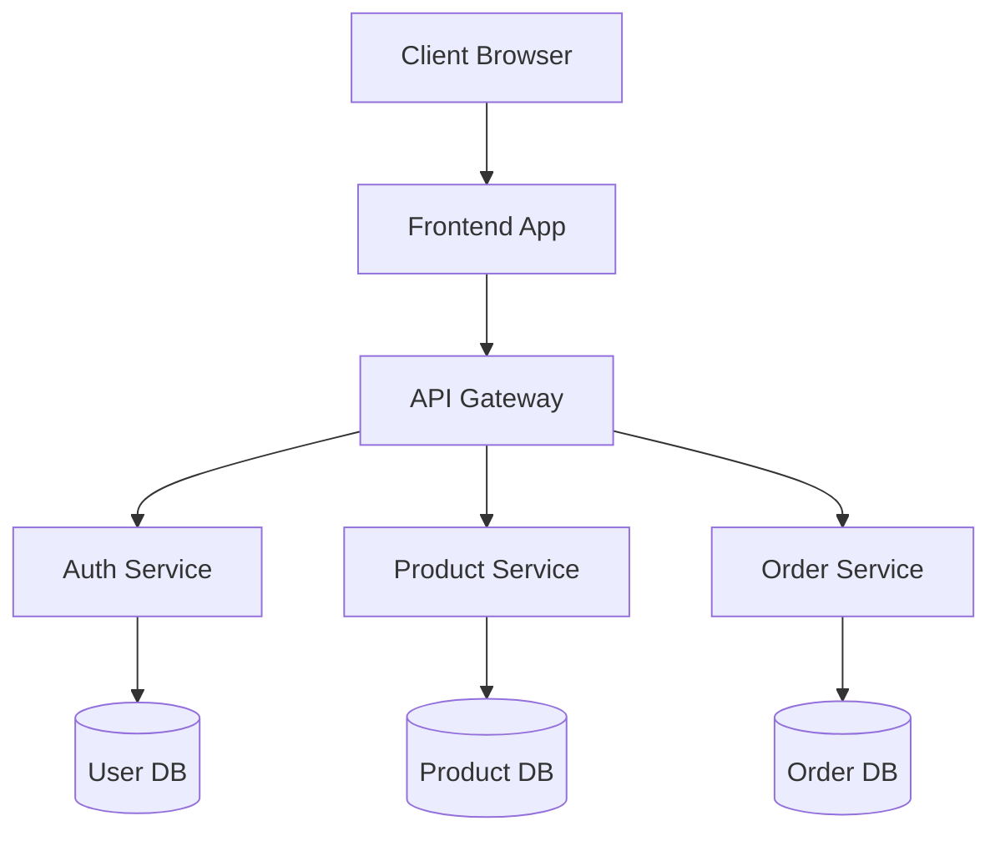
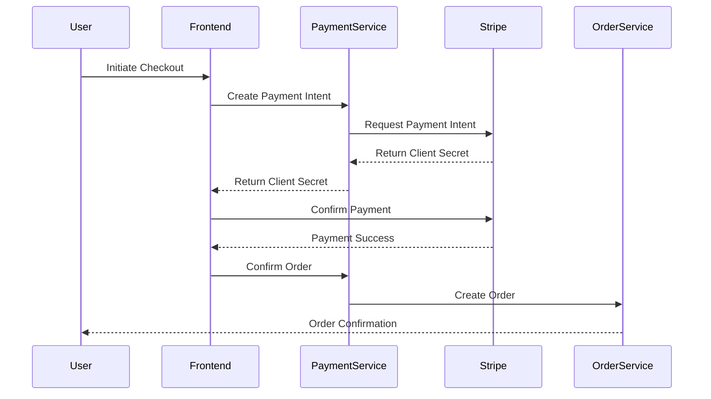
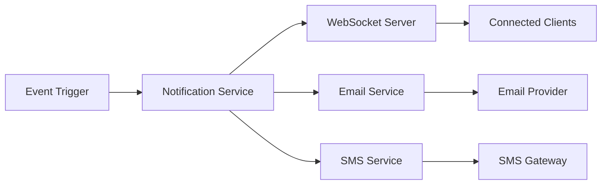

# Low-Level Design Document

## 1. Introduction

This document provides the low-level design for the e-commerce platform.

## 2. System Architecture

### 2.1 Component Overview

The system consists of the following main components:
- Frontend Application
- Backend API Services
- Database Layer
- Cache Layer

### 2.2 Architecture Diagram



## 3. Component Details

### 3.1 Frontend Application

Built using React.js with Redux for state management.

### 3.2 Backend Services

Microservices architecture using Node.js and Express.

## 4. Data Models

### 4.1 User Model

```json
{
  "userId": "string",
  "email": "string",
  "name": "string",
  "createdAt": "timestamp"
}
```

## 5. API Endpoints

### 5.1 Authentication

- POST /api/auth/login
- POST /api/auth/register

### 5.2 Products

- GET /api/products
- GET /api/products/:id

## 6. Security Considerations

- JWT-based authentication
- HTTPS encryption
- Input validation

### 6.4 Additional Security Measures

**New security features:**

- Two-factor authentication (2FA)
- Rate limiting on API endpoints
- SQL injection prevention
- XSS protection headers
- CORS configuration

#### 6.4.1 Rate Limiting Configuration

```javascript
const rateLimit = {
  windowMs: 15 * 60 * 1000, // 15 minutes
  max: 100, // limit each IP to 100 requests per windowMs
  message: 'Too many requests from this IP'
};
```

## 7. Performance Optimization

- Redis caching
- Database indexing
- CDN for static assets

## 8. Payment Processing

### 8.1 Payment Gateway Integration

The system integrates with Stripe for payment processing.

**Added Components:**
- Payment Service
- Webhook Handler
- Transaction Logger

### 8.2 Payment Flow Diagram



### 8.3 Payment API Endpoints

**New endpoints to be added:**

- POST /api/payment/create-intent
- POST /api/payment/confirm
- POST /api/payment/webhook
- GET /api/payment/status/:transactionId

### 8.4 Payment Data Model

```json
{
  "transactionId": "string",
  "orderId": "string",
  "amount": "number",
  "currency": "string",
  "status": "pending|completed|failed",
  "paymentMethod": "string",
  "createdAt": "timestamp",
  "updatedAt": "timestamp"
}
```

## 9. Notification Service

### 9.1 Overview

Implement real-time notifications for order updates and promotions.

**New components:**
- Notification Service
- WebSocket Server
- Email Service
- SMS Service

### 9.2 Notification Architecture



### 9.3 Notification Types

- Order confirmation
- Shipping updates
- Promotional offers
- Account alerts