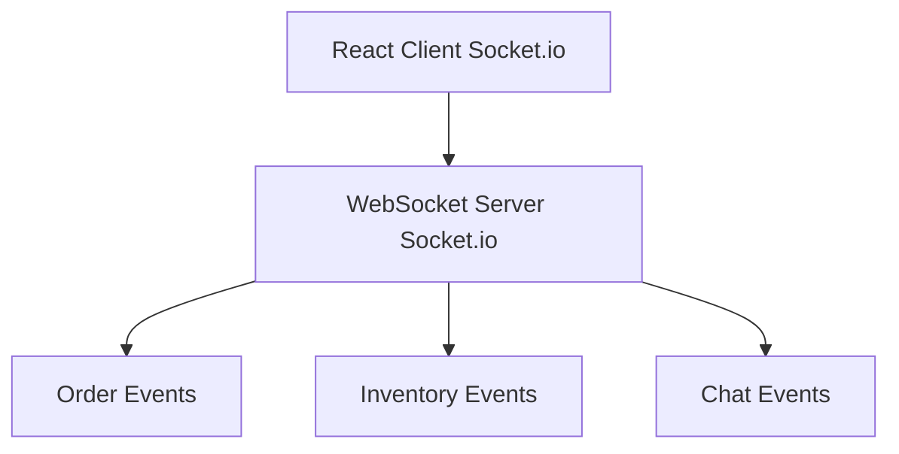

# Low-Level Design (LLD) Document

## 1. Introduction

### 1.1 Purpose
This document provides a detailed low-level design for the Aava E-Commerce Platform. It describes the system architecture, component interactions, data models, API specifications, and implementation details.

### 1.2 Scope
The LLD covers:
- System architecture and component design
- Database schema and data models
- API endpoints and contracts
- Security implementation
- Performance optimization strategies
- Error handling and logging

### 1.3 Definitions and Acronyms
- **API**: Application Programming Interface
- **JWT**: JSON Web Token
- **REST**: Representational State Transfer
- **CRUD**: Create, Read, Update, Delete
- **ORM**: Object-Relational Mapping

## 2. System Architecture

### 2.1 Architecture Overview
The system follows a microservices-based architecture with the following layers:
- Presentation Layer (React Frontend)
- API Gateway Layer
- Business Logic Layer (Node.js Services)
- Data Access Layer
- Database Layer (MongoDB)

### 2.2 Component Diagram
```
┌─────────────────┐
│  React Client   │
└────────┬────────┘
         │
         ▼
┌─────────────────┐
│   API Gateway   │
└────────┬────────┘
         │
    ┌────┴────┬─────────┬──────────┐
    ▼         ▼         ▼          ▼
┌──────┐ ┌────────┐ ┌──────┐ ┌─────────┐
│ Auth │ │Product │ │ Cart │ │ Payment │
│Service│ │Service │ │Service│ │ Service │
└───┬──┘ └───┬────┘ └───┬──┘ └────┬────┘
    │        │          │         │
    └────────┴──────────┴─────────┘
                   ▼
            ┌──────────────┐
            │   MongoDB    │
            └──────────────┘
```

## 3. Database Design

### 3.1 Database Schema

#### 3.1.1 Users Collection
```javascript
{
  _id: ObjectId,
  email: String (unique, indexed),
  password: String (hashed),
  firstName: String,
  lastName: String,
  role: String (enum: ['customer', 'admin']),
  addresses: [{
    street: String,
    city: String,
    state: String,
    zipCode: String,
    country: String,
    isDefault: Boolean
  }],
  createdAt: Date,
  updatedAt: Date
}
```

#### 3.1.2 Products Collection
```javascript
{
  _id: ObjectId,
  name: String (indexed),
  description: String,
  price: Number,
  category: String (indexed),
  subcategory: String,
  brand: String,
  sku: String (unique, indexed),
  inventory: {
    quantity: Number,
    reserved: Number,
    available: Number (computed)
  },
  images: [{
    url: String,
    alt: String,
    isPrimary: Boolean
  }],
  specifications: Map,
  ratings: {
    average: Number,
    count: Number
  },
  isActive: Boolean,
  createdAt: Date,
  updatedAt: Date
}
```

#### 3.1.3 Orders Collection
```javascript
{
  _id: ObjectId,
  orderNumber: String (unique, indexed),
  userId: ObjectId (indexed),
  items: [{
    productId: ObjectId,
    name: String,
    price: Number,
    quantity: Number,
    subtotal: Number
  }],
  totals: {
    subtotal: Number,
    tax: Number,
    shipping: Number,
    discount: Number,
    total: Number
  },
  shippingAddress: {
    street: String,
    city: String,
    state: String,
    zipCode: String,
    country: String
  },
  paymentInfo: {
    method: String,
    transactionId: String,
    status: String
  },
  status: String (enum: ['pending', 'processing', 'shipped', 'delivered', 'cancelled']),
  trackingNumber: String,
  createdAt: Date,
  updatedAt: Date
}
```

#### 3.1.4 Cart Collection
```javascript
{
  _id: ObjectId,
  userId: ObjectId (unique, indexed),
  items: [{
    productId: ObjectId,
    quantity: Number,
    addedAt: Date
  }],
  updatedAt: Date
}
```

### 3.2 Indexes
- Users: email (unique), role
- Products: name (text), category, sku (unique), isActive
- Orders: orderNumber (unique), userId, status, createdAt
- Cart: userId (unique)

## 4. API Design

### 4.1 Authentication APIs

#### 4.1.1 POST /api/auth/register
**Request:**
```javascript
{
  "email": "user@example.com",
  "password": "SecurePass123!",
  "firstName": "John",
  "lastName": "Doe"
}
```

**Response (201):**
```javascript
{
  "success": true,
  "data": {
    "user": {
      "id": "507f1f77bcf86cd799439011",
      "email": "user@example.com",
      "firstName": "John",
      "lastName": "Doe",
      "role": "customer"
    },
    "token": "eyJhbGciOiJIUzI1NiIsInR5cCI6IkpXVCJ9..."
  }
}
```

#### 4.1.2 POST /api/auth/login
**Request:**
```javascript
{
  "email": "user@example.com",
  "password": "SecurePass123!"
}
```

**Response (200):**
```javascript
{
  "success": true,
  "data": {
    "user": {
      "id": "507f1f77bcf86cd799439011",
      "email": "user@example.com",
      "firstName": "John",
      "lastName": "Doe",
      "role": "customer"
    },
    "token": "eyJhbGciOiJIUzI1NiIsInR5cCI6IkpXVCJ9..."
  }
}
```

### 4.2 Product APIs

#### 4.2.1 GET /api/products
**Query Parameters:**
- page (default: 1)
- limit (default: 20)
- category (optional)
- search (optional)
- sortBy (optional: price, name, rating)
- order (optional: asc, desc)

**Response (200):**
```javascript
{
  "success": true,
  "data": {
    "products": [
      {
        "id": "507f1f77bcf86cd799439011",
        "name": "Product Name",
        "description": "Product description",
        "price": 99.99,
        "category": "Electronics",
        "images": [
          {
            "url": "https://example.com/image.jpg",
            "alt": "Product image",
            "isPrimary": true
          }
        ],
        "ratings": {
          "average": 4.5,
          "count": 120
        },
        "inventory": {
          "available": 50
        }
      }
    ],
    "pagination": {
      "currentPage": 1,
      "totalPages": 5,
      "totalItems": 100,
      "itemsPerPage": 20
    }
  }
}
```

#### 4.2.2 GET /api/products/:id
**Response (200):**
```javascript
{
  "success": true,
  "data": {
    "id": "507f1f77bcf86cd799439011",
    "name": "Product Name",
    "description": "Detailed product description",
    "price": 99.99,
    "category": "Electronics",
    "subcategory": "Smartphones",
    "brand": "Brand Name",
    "sku": "PROD-12345",
    "images": [...],
    "specifications": {
      "color": "Black",
      "size": "Medium",
      "weight": "200g"
    },
    "ratings": {
      "average": 4.5,
      "count": 120
    },
    "inventory": {
      "available": 50
    }
  }
}
```

#### 4.2.3 POST /api/products (Admin only)
**Request:**
```javascript
{
  "name": "New Product",
  "description": "Product description",
  "price": 99.99,
  "category": "Electronics",
  "subcategory": "Smartphones",
  "brand": "Brand Name",
  "sku": "PROD-12345",
  "inventory": {
    "quantity": 100
  },
  "images": [...],
  "specifications": {...}
}
```

**Response (201):**
```javascript
{
  "success": true,
  "data": {
    "id": "507f1f77bcf86cd799439011",
    // ... product details
  }
}
```

### 4.3 Cart APIs

#### 4.3.1 GET /api/cart
**Headers:** Authorization: Bearer {token}

**Response (200):**
```javascript
{
  "success": true,
  "data": {
    "items": [
      {
        "productId": "507f1f77bcf86cd799439011",
        "name": "Product Name",
        "price": 99.99,
        "quantity": 2,
        "subtotal": 199.98,
        "image": "https://example.com/image.jpg"
      }
    ],
    "totals": {
      "subtotal": 199.98,
      "tax": 20.00,
      "shipping": 10.00,
      "total": 229.98
    }
  }
}
```

#### 4.3.2 POST /api/cart/items
**Headers:** Authorization: Bearer {token}

**Request:**
```javascript
{
  "productId": "507f1f77bcf86cd799439011",
  "quantity": 2
}
```

**Response (200):**
```javascript
{
  "success": true,
  "data": {
    "message": "Item added to cart",
    "cart": { /* cart details */ }
  }
}
```

#### 4.3.3 PUT /api/cart/items/:productId
**Headers:** Authorization: Bearer {token}

**Request:**
```javascript
{
  "quantity": 3
}
```

**Response (200):**
```javascript
{
  "success": true,
  "data": {
    "message": "Cart updated",
    "cart": { /* cart details */ }
  }
}
```

#### 4.3.4 DELETE /api/cart/items/:productId
**Headers:** Authorization: Bearer {token}

**Response (200):**
```javascript
{
  "success": true,
  "data": {
    "message": "Item removed from cart",
    "cart": { /* cart details */ }
  }
}
```

### 4.4 Order APIs

#### 4.4.1 POST /api/orders
**Headers:** Authorization: Bearer {token}

**Request:**
```javascript
{
  "shippingAddress": {
    "street": "123 Main St",
    "city": "New York",
    "state": "NY",
    "zipCode": "10001",
    "country": "USA"
  },
  "paymentMethod": "credit_card",
  "paymentDetails": {
    "cardNumber": "**** **** **** 1234",
    "cardHolder": "John Doe"
  }
}
```

**Response (201):**
```javascript
{
  "success": true,
  "data": {
    "orderId": "507f1f77bcf86cd799439011",
    "orderNumber": "ORD-2024-00001",
    "status": "pending",
    "items": [...],
    "totals": {...},
    "shippingAddress": {...},
    "createdAt": "2024-01-15T10:30:00Z"
  }
}
```

#### 4.4.2 GET /api/orders
**Headers:** Authorization: Bearer {token}

**Query Parameters:**
- page (default: 1)
- limit (default: 10)
- status (optional)

**Response (200):**
```javascript
{
  "success": true,
  "data": {
    "orders": [
      {
        "id": "507f1f77bcf86cd799439011",
        "orderNumber": "ORD-2024-00001",
        "status": "delivered",
        "total": 229.98,
        "itemCount": 3,
        "createdAt": "2024-01-15T10:30:00Z"
      }
    ],
    "pagination": {...}
  }
}
```

#### 4.4.3 GET /api/orders/:id
**Headers:** Authorization: Bearer {token}

**Response (200):**
```javascript
{
  "success": true,
  "data": {
    "id": "507f1f77bcf86cd799439011",
    "orderNumber": "ORD-2024-00001",
    "status": "delivered",
    "items": [...],
    "totals": {...},
    "shippingAddress": {...},
    "trackingNumber": "TRACK123456",
    "createdAt": "2024-01-15T10:30:00Z",
    "updatedAt": "2024-01-20T14:30:00Z"
  }
}
```

## 5. Security Implementation

### 5.1 Authentication
- JWT-based authentication
- Token expiration: 24 hours
- Refresh token mechanism
- Password hashing using bcrypt (salt rounds: 10)

### 5.2 Authorization
- Role-based access control (RBAC)
- Middleware for route protection
- Admin-only endpoints protection

### 5.3 Data Security
- Input validation using Joi
- SQL injection prevention (using parameterized queries)
- XSS protection (sanitizing inputs)
- CORS configuration
- Rate limiting (100 requests per 15 minutes per IP)

### 5.4 Payment Security
- PCI DSS compliance
- Tokenization of payment information
- SSL/TLS encryption
- No storage of sensitive card data

## 6. Error Handling

### 6.1 Error Response Format
```javascript
{
  "success": false,
  "error": {
    "code": "ERROR_CODE",
    "message": "Human-readable error message",
    "details": {} // Optional additional details
  }
}
```

### 6.2 HTTP Status Codes
- 200: Success
- 201: Created
- 400: Bad Request
- 401: Unauthorized
- 403: Forbidden
- 404: Not Found
- 409: Conflict
- 422: Unprocessable Entity
- 500: Internal Server Error

### 6.3 Error Codes
- AUTH_001: Invalid credentials
- AUTH_002: Token expired
- AUTH_003: Invalid token
- PROD_001: Product not found
- PROD_002: Insufficient inventory
- CART_001: Cart is empty
- ORDER_001: Order not found
- PAYMENT_001: Payment failed

## 7. Logging and Monitoring

### 7.1 Logging Strategy
- Use Winston for logging
- Log levels: error, warn, info, debug
- Structured logging format (JSON)
- Log rotation (daily, max 14 days)

### 7.2 Monitoring Metrics
- API response times
- Error rates
- Database query performance
- System resource usage
- User activity metrics

## 8. Performance Optimization

### 8.1 Caching Strategy
- Redis for session management
- Product catalog caching (TTL: 1 hour)
- API response caching for frequently accessed data

### 8.2 Database Optimization
- Proper indexing strategy
- Query optimization
- Connection pooling
- Aggregation pipeline optimization

### 8.3 API Optimization
- Pagination for large datasets
- Field filtering (select only required fields)
- Compression (gzip)
- CDN for static assets

## 9. Testing Strategy

### 9.1 Unit Testing
- Framework: Jest
- Coverage target: 80%
- Test individual functions and methods

### 9.2 Integration Testing
- Test API endpoints
- Test database operations
- Test external service integrations

### 9.3 End-to-End Testing
- Framework: Cypress
- Test complete user flows
- Test critical business processes

## 10. Deployment

### 10.1 Environment Configuration
- Development
- Staging
- Production

### 10.2 CI/CD Pipeline
- Automated testing
- Code quality checks
- Automated deployment
- Rollback mechanism

### 10.3 Infrastructure
- Cloud provider: AWS/Azure/GCP
- Container orchestration: Docker/Kubernetes
- Load balancing
- Auto-scaling

## 11. Maintenance and Support

### 11.1 Backup Strategy
- Daily automated backups
- Point-in-time recovery
- Backup retention: 30 days

### 11.2 Disaster Recovery
- Recovery Time Objective (RTO): 4 hours
- Recovery Point Objective (RPO): 1 hour
- Failover procedures

## 12. Appendix

### 12.1 Technology Stack
- Frontend: React, Redux, Material-UI
- Backend: Node.js, Express.js
- Database: MongoDB
- Caching: Redis
- Authentication: JWT
- Payment: Stripe/PayPal
- Deployment: Docker, Kubernetes

### 12.2 Third-Party Services
- Payment Gateway: Stripe
- Email Service: SendGrid
- SMS Service: Twilio
- Cloud Storage: AWS S3
- CDN: CloudFront

### 12.3 Development Guidelines
- Code style: ESLint (Airbnb style guide)
- Git workflow: GitFlow
- Code review process
- Documentation standards

## 13. Real-Time Features

### 13.1 WebSocket Implementation
- Real-time order status updates
- Live inventory updates
- Real-time notifications
- Chat support integration

### 13.2 WebSocket Architecture


### 13.3 WebSocket Events

#### Order Status Updates
```javascript
// Client subscribes to order updates
socket.emit('subscribe:order', { orderId: '507f1f77bcf86cd799439011' });

// Server emits order status changes
socket.on('order:status:updated', (data) => {
  console.log(data);
  // {
  //   orderId: '507f1f77bcf86cd799439011',
  //   status: 'shipped',
  //   trackingNumber: 'TRACK123456',
  //   updatedAt: '2024-01-20T14:30:00Z'
  // }
});
```

#### Inventory Updates
```javascript
// Client subscribes to product inventory
socket.emit('subscribe:product', { productId: '507f1f77bcf86cd799439011' });

// Server emits inventory changes
socket.on('inventory:updated', (data) => {
  console.log(data);
  // {
  //   productId: '507f1f77bcf86cd799439011',
  //   available: 45,
  //   reserved: 5
  // }
});
```

## 14. Analytics and Reporting

### 14.1 Analytics Data Collection
- User behavior tracking
- Product view analytics
- Conversion funnel analysis
- Cart abandonment tracking

### 14.2 Analytics Events
```javascript
// Product view event
{
  event: 'product_viewed',
  userId: '507f1f77bcf86cd799439011',
  productId: '507f1f77bcf86cd799439012',
  timestamp: '2024-01-20T14:30:00Z',
  metadata: {
    source: 'search',
    category: 'Electronics'
  }
}

// Add to cart event
{
  event: 'add_to_cart',
  userId: '507f1f77bcf86cd799439011',
  productId: '507f1f77bcf86cd799439012',
  quantity: 2,
  price: 99.99,
  timestamp: '2024-01-20T14:35:00Z'
}

// Purchase event
{
  event: 'purchase',
  userId: '507f1f77bcf86cd799439011',
  orderId: '507f1f77bcf86cd799439013',
  total: 229.98,
  items: [...],
  timestamp: '2024-01-20T14:40:00Z'
}
```

### 14.3 Reporting APIs

#### GET /api/analytics/sales
**Query Parameters:**
- startDate (required)
- endDate (required)
- groupBy (optional: day, week, month)

**Response (200):**
```javascript
{
  "success": true,
  "data": {
    "totalSales": 125000.00,
    "totalOrders": 450,
    "averageOrderValue": 277.78,
    "breakdown": [
      {
        "date": "2024-01-15",
        "sales": 5000.00,
        "orders": 18
      }
    ]
  }
}
```

#### GET /api/analytics/products/top
**Query Parameters:**
- period (default: 30d)
- limit (default: 10)
- metric (views, sales, revenue)

**Response (200):**
```javascript
{
  "success": true,
  "data": {
    "products": [
      {
        "productId": "507f1f77bcf86cd799439011",
        "name": "Product Name",
        "views": 1500,
        "sales": 120,
        "revenue": 11998.80,
        "conversionRate": 8.0
      }
    ]
  }
}
```

## 15. Recommendation Engine

### 15.1 Recommendation Types
- Personalized recommendations
- Similar products
- Frequently bought together
- Trending products
- Recently viewed products

### 15.2 Recommendation Algorithm
```javascript
// Collaborative filtering approach
function getPersonalizedRecommendations(userId) {
  // 1. Get user's purchase history
  const userPurchases = getUserPurchases(userId);
  
  // 2. Find similar users based on purchase patterns
  const similarUsers = findSimilarUsers(userPurchases);
  
  // 3. Get products purchased by similar users
  const recommendations = getProductsFromSimilarUsers(similarUsers);
  
  // 4. Filter out already purchased products
  const filtered = recommendations.filter(
    product => !userPurchases.includes(product.id)
  );
  
  // 5. Rank by relevance score
  return rankByRelevance(filtered);
}
```

### 15.3 Recommendation APIs

#### GET /api/recommendations/personalized
**Headers:** Authorization: Bearer {token}

**Query Parameters:**
- limit (default: 10)

**Response (200):**
```javascript
{
  "success": true,
  "data": {
    "recommendations": [
      {
        "productId": "507f1f77bcf86cd799439011",
        "name": "Product Name",
        "price": 99.99,
        "image": "https://example.com/image.jpg",
        "relevanceScore": 0.85,
        "reason": "Based on your recent purchases"
      }
    ]
  }
}
```

#### GET /api/recommendations/similar/:productId
**Query Parameters:**
- limit (default: 5)

**Response (200):**
```javascript
{
  "success": true,
  "data": {
    "recommendations": [
      {
        "productId": "507f1f77bcf86cd799439012",
        "name": "Similar Product",
        "price": 89.99,
        "image": "https://example.com/image.jpg",
        "similarityScore": 0.92
      }
    ]
  }
}
```

## 16. Search Enhancement

### 16.1 Elasticsearch Integration
- Full-text search capabilities
- Faceted search
- Auto-suggestions
- Typo tolerance
- Synonym support

### 16.2 Search Index Schema
```javascript
{
  "mappings": {
    "properties": {
      "name": {
        "type": "text",
        "analyzer": "standard",
        "fields": {
          "keyword": {
            "type": "keyword"
          },
          "suggest": {
            "type": "completion"
          }
        }
      },
      "description": {
        "type": "text",
        "analyzer": "standard"
      },
      "category": {
        "type": "keyword"
      },
      "brand": {
        "type": "keyword"
      },
      "price": {
        "type": "float"
      },
      "ratings": {
        "type": "object",
        "properties": {
          "average": { "type": "float" },
          "count": { "type": "integer" }
        }
      },
      "tags": {
        "type": "keyword"
      }
    }
  }
}
```

### 16.3 Enhanced Search API

#### GET /api/search
**Query Parameters:**
- q (search query)
- filters (JSON string)
- page (default: 1)
- limit (default: 20)
- sortBy (relevance, price, rating)

**Response (200):**
```javascript
{
  "success": true,
  "data": {
    "results": [
      {
        "productId": "507f1f77bcf86cd799439011",
        "name": "Product Name",
        "price": 99.99,
        "category": "Electronics",
        "rating": 4.5,
        "relevanceScore": 0.95,
        "highlights": {
          "name": ["<em>Product</em> Name"],
          "description": ["This <em>product</em> is..."]
        }
      }
    ],
    "facets": {
      "categories": [
        { "name": "Electronics", "count": 45 },
        { "name": "Clothing", "count": 32 }
      ],
      "brands": [
        { "name": "Brand A", "count": 25 },
        { "name": "Brand B", "count": 18 }
      ],
      "priceRanges": [
        { "range": "0-50", "count": 30 },
        { "range": "50-100", "count": 25 }
      ]
    },
    "pagination": {...}
  }
}
```

#### GET /api/search/suggestions
**Query Parameters:**
- q (partial query)
- limit (default: 5)

**Response (200):**
```javascript
{
  "success": true,
  "data": {
    "suggestions": [
      "smartphone",
      "smart watch",
      "smart tv",
      "smart home devices"
    ]
  }
}
```

## 17. Notification System

### 17.1 Notification Types
- Email notifications
- SMS notifications
- Push notifications
- In-app notifications

### 17.2 Notification Events
- Order confirmation
- Order status updates
- Payment confirmation
- Shipping updates
- Delivery confirmation
- Promotional offers
- Price drop alerts
- Back in stock alerts

### 17.3 Notification Schema
```javascript
{
  _id: ObjectId,
  userId: ObjectId,
  type: String (enum: ['email', 'sms', 'push', 'in_app']),
  category: String (enum: ['order', 'payment', 'shipping', 'promotional']),
  title: String,
  message: String,
  data: Object,
  status: String (enum: ['pending', 'sent', 'failed', 'read']),
  sentAt: Date,
  readAt: Date,
  createdAt: Date
}
```

### 17.4 Notification APIs

#### GET /api/notifications
**Headers:** Authorization: Bearer {token}

**Query Parameters:**
- page (default: 1)
- limit (default: 20)
- unreadOnly (default: false)

**Response (200):**
```javascript
{
  "success": true,
  "data": {
    "notifications": [
      {
        "id": "507f1f77bcf86cd799439011",
        "type": "in_app",
        "category": "order",
        "title": "Order Shipped",
        "message": "Your order #ORD-2024-00001 has been shipped",
        "data": {
          "orderId": "507f1f77bcf86cd799439012",
          "trackingNumber": "TRACK123456"
        },
        "status": "unread",
        "createdAt": "2024-01-20T14:30:00Z"
      }
    ],
    "unreadCount": 5,
    "pagination": {...}
  }
}
```

#### PUT /api/notifications/:id/read
**Headers:** Authorization: Bearer {token}

**Response (200):**
```javascript
{
  "success": true,
  "data": {
    "message": "Notification marked as read"
  }
}
```

## 18. Wishlist Feature

### 18.1 Wishlist Schema
```javascript
{
  _id: ObjectId,
  userId: ObjectId (unique, indexed),
  items: [{
    productId: ObjectId,
    addedAt: Date,
    priceWhenAdded: Number,
    notifyOnPriceDrop: Boolean,
    notifyOnBackInStock: Boolean
  }],
  updatedAt: Date
}
```

### 18.2 Wishlist APIs

#### GET /api/wishlist
**Headers:** Authorization: Bearer {token}

**Response (200):**
```javascript
{
  "success": true,
  "data": {
    "items": [
      {
        "productId": "507f1f77bcf86cd799439011",
        "name": "Product Name",
        "currentPrice": 89.99,
        "priceWhenAdded": 99.99,
        "priceDrop": 10.00,
        "image": "https://example.com/image.jpg",
        "inStock": true,
        "addedAt": "2024-01-15T10:30:00Z"
      }
    ],
    "totalItems": 5
  }
}
```

#### POST /api/wishlist/items
**Headers:** Authorization: Bearer {token}

**Request:**
```javascript
{
  "productId": "507f1f77bcf86cd799439011",
  "notifyOnPriceDrop": true,
  "notifyOnBackInStock": true
}
```

**Response (200):**
```javascript
{
  "success": true,
  "data": {
    "message": "Item added to wishlist",
    "wishlist": { /* wishlist details */ }
  }
}
```

#### DELETE /api/wishlist/items/:productId
**Headers:** Authorization: Bearer {token}

**Response (200):**
```javascript
{
  "success": true,
  "data": {
    "message": "Item removed from wishlist"
  }
}
```