# Low Level Design Document

## 1. Project Overview

This document provides the Low Level Design (LLD) for an E-commerce system built using Spring Boot, Java 21, and PostgreSQL. The system is designed with a modular architecture following Domain-Driven Design (DDD) principles.

### Modules
- **ProductManagement**: Handles product catalog operations including CRUD operations, search, and inventory management
- **ShoppingCartManagement**: Manages shopping cart operations including adding/removing items, updating quantities, and cart retrieval

## 2. System Architecture

### 2.1 High-Level Architecture

The system follows a layered architecture pattern:

```
Presentation Layer (Controllers)
        ↓
Business Logic Layer (Services)
        ↓
Data Access Layer (Repositories)
        ↓
Database Layer (PostgreSQL)
```

### 2.2 Class Diagram

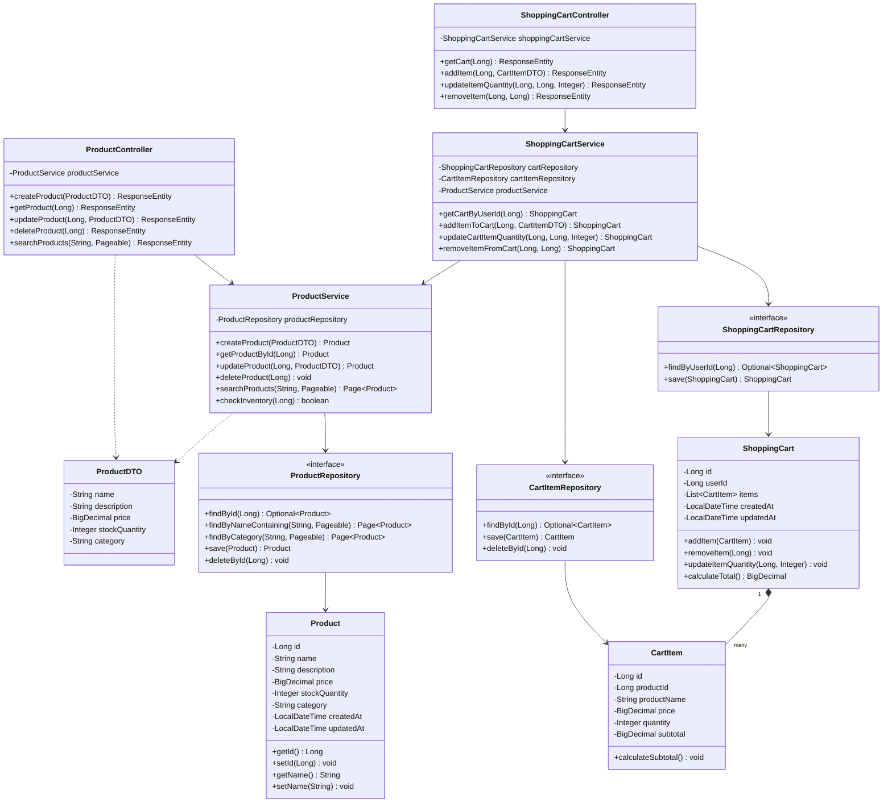

### 2.3 Entity Relationship Diagram

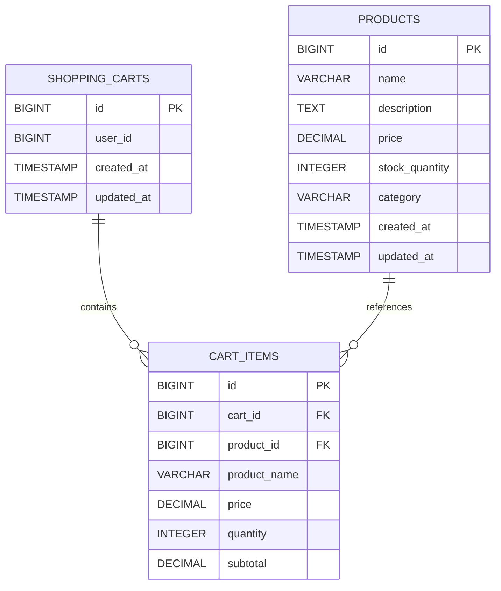

## 3. Sequence Diagrams

### 3.1 Create Product Flow

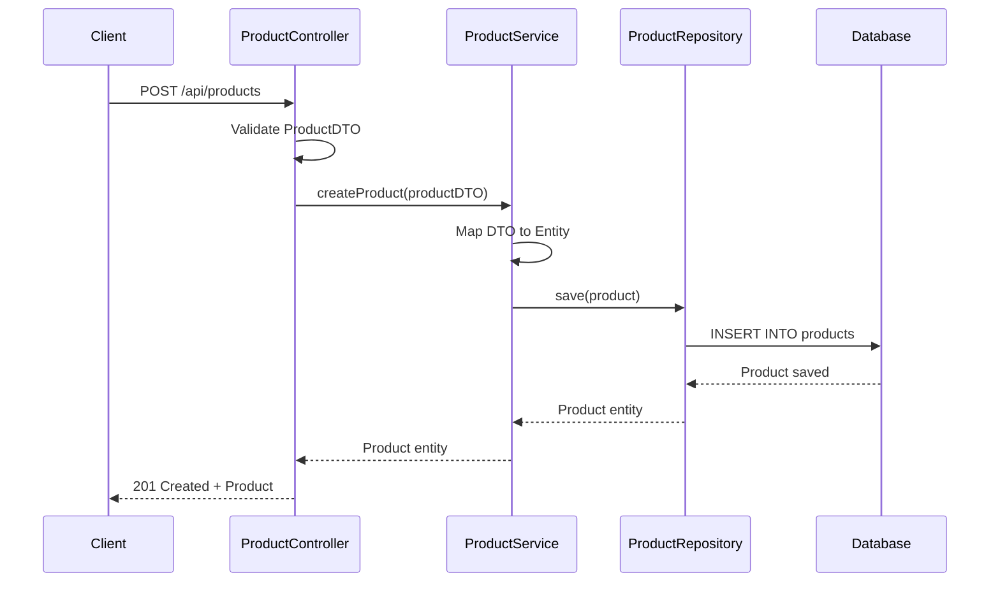

### 3.2 Get Product by ID Flow

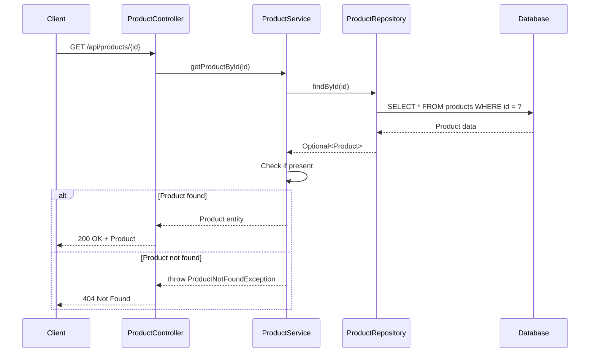

### 3.3 Update Product Flow

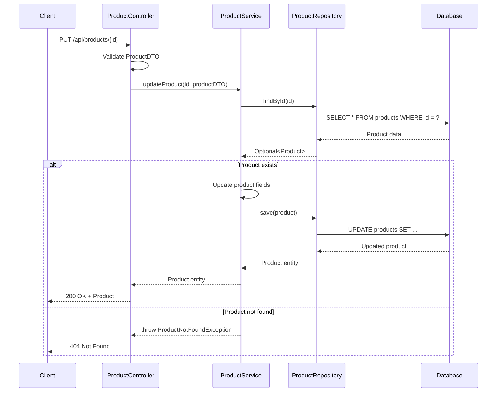

### 3.4 Delete Product Flow

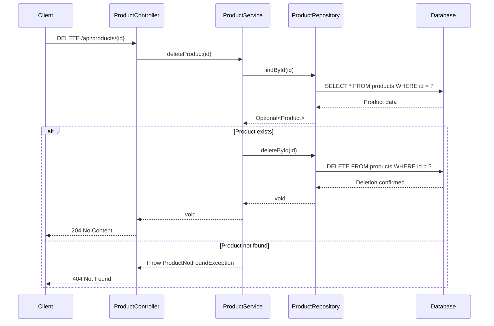

### 3.5 Search Products Flow

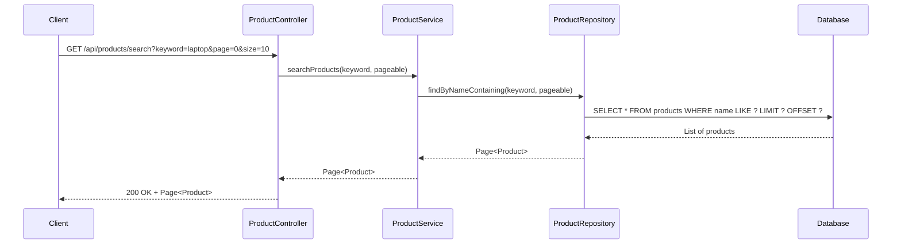

### 3.6 Check Inventory Flow

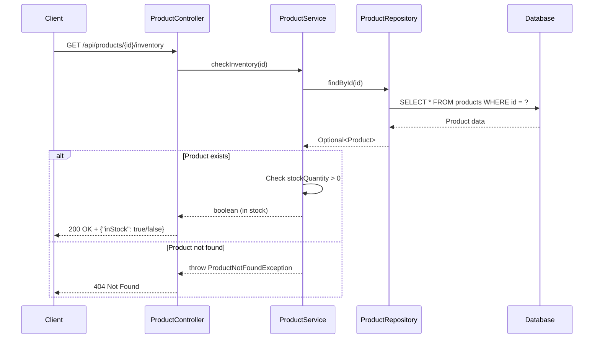

### 3.7 Get Products by Category Flow

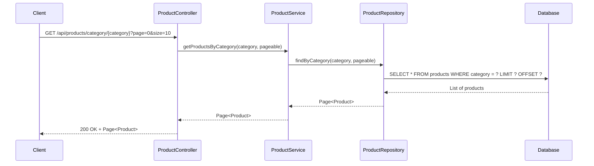

### 3.8 Get Shopping Cart Flow

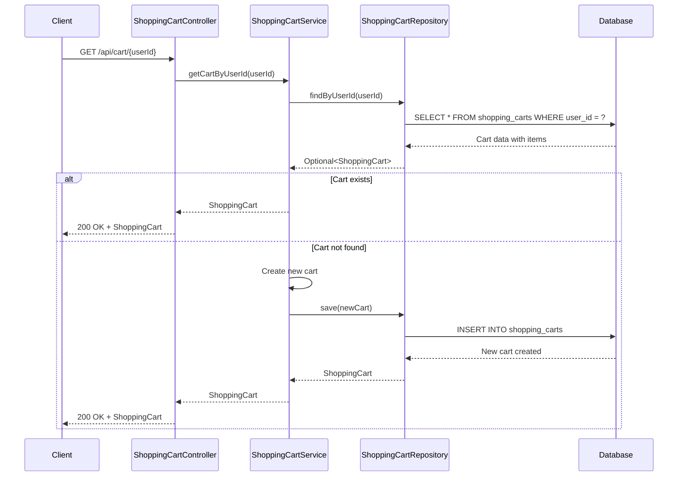

### 3.9 Add Item to Cart Flow

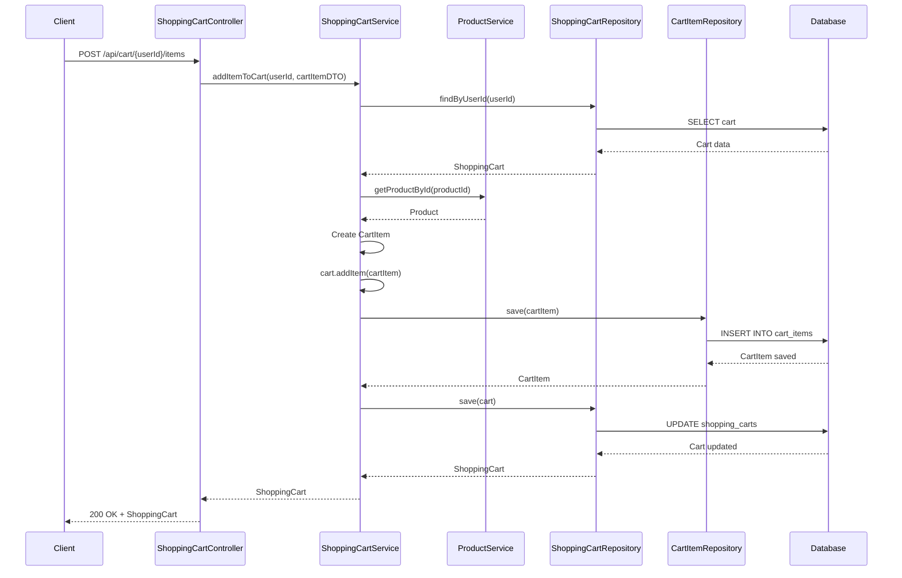

### 3.10 Update Cart Item Quantity Flow

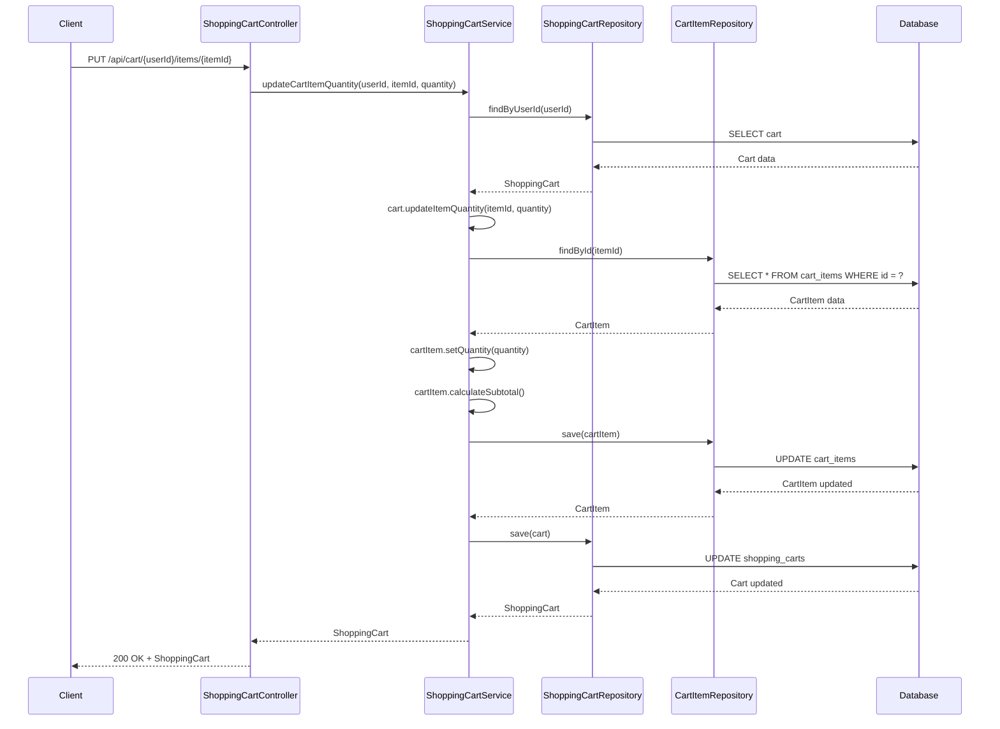

### 3.11 Remove Item from Cart Flow

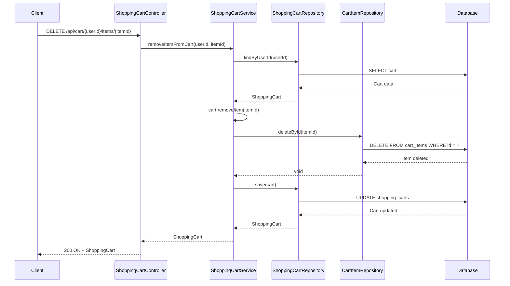

## 4. API Endpoints

### 4.1 Product Management Endpoints

#### Create Product
- **Endpoint**: `POST /api/products`
- **Request Body**:
```json
{
  "name": "Laptop",
  "description": "High-performance laptop",
  "price": 999.99,
  "stockQuantity": 50,
  "category": "Electronics"
}
```
- **Response**: `201 Created`
```json
{
  "id": 1,
  "name": "Laptop",
  "description": "High-performance laptop",
  "price": 999.99,
  "stockQuantity": 50,
  "category": "Electronics",
  "createdAt": "2024-01-15T10:30:00",
  "updatedAt": "2024-01-15T10:30:00"
}
```

#### Get Product by ID
- **Endpoint**: `GET /api/products/{id}`
- **Response**: `200 OK`
```json
{
  "id": 1,
  "name": "Laptop",
  "description": "High-performance laptop",
  "price": 999.99,
  "stockQuantity": 50,
  "category": "Electronics",
  "createdAt": "2024-01-15T10:30:00",
  "updatedAt": "2024-01-15T10:30:00"
}
```

#### Update Product
- **Endpoint**: `PUT /api/products/{id}`
- **Request Body**:
```json
{
  "name": "Gaming Laptop",
  "description": "High-performance gaming laptop",
  "price": 1299.99,
  "stockQuantity": 45,
  "category": "Electronics"
}
```
- **Response**: `200 OK`

#### Delete Product
- **Endpoint**: `DELETE /api/products/{id}`
- **Response**: `204 No Content`

#### Search Products
- **Endpoint**: `GET /api/products/search?keyword={keyword}&page={page}&size={size}`
- **Response**: `200 OK`
```json
{
  "content": [
    {
      "id": 1,
      "name": "Laptop",
      "description": "High-performance laptop",
      "price": 999.99,
      "stockQuantity": 50,
      "category": "Electronics"
    }
  ],
  "pageable": {
    "pageNumber": 0,
    "pageSize": 10
  },
  "totalElements": 1,
  "totalPages": 1
}
```

#### Check Inventory
- **Endpoint**: `GET /api/products/{id}/inventory`
- **Response**: `200 OK`
```json
{
  "inStock": true,
  "quantity": 50
}
```

#### Get Products by Category
- **Endpoint**: `GET /api/products/category/{category}?page={page}&size={size}`
- **Response**: `200 OK` (Same structure as Search Products)

### 4.2 Shopping Cart Management Endpoints

#### Get Shopping Cart
- **Endpoint**: `GET /api/cart/{userId}`
- **Response**: `200 OK`
```json
{
  "id": 1,
  "userId": 123,
  "items": [
    {
      "id": 1,
      "productId": 1,
      "productName": "Laptop",
      "price": 999.99,
      "quantity": 2,
      "subtotal": 1999.98
    }
  ],
  "total": 1999.98,
  "createdAt": "2024-01-15T10:30:00",
  "updatedAt": "2024-01-15T11:00:00"
}
```

#### Add Item to Cart
- **Endpoint**: `POST /api/cart/{userId}/items`
- **Request Body**:
```json
{
  "productId": 1,
  "quantity": 2
}
```
- **Response**: `200 OK` (Returns updated cart)

#### Update Cart Item Quantity
- **Endpoint**: `PUT /api/cart/{userId}/items/{itemId}`
- **Request Body**:
```json
{
  "quantity": 3
}
```
- **Response**: `200 OK` (Returns updated cart)

#### Remove Item from Cart
- **Endpoint**: `DELETE /api/cart/{userId}/items/{itemId}`
- **Response**: `200 OK` (Returns updated cart)

## 5. Database Schema

### 5.1 Products Table

```sql
CREATE TABLE products (
    id BIGSERIAL PRIMARY KEY,
    name VARCHAR(255) NOT NULL,
    description TEXT,
    price DECIMAL(10, 2) NOT NULL,
    stock_quantity INTEGER NOT NULL DEFAULT 0,
    category VARCHAR(100),
    created_at TIMESTAMP DEFAULT CURRENT_TIMESTAMP,
    updated_at TIMESTAMP DEFAULT CURRENT_TIMESTAMP,
    CONSTRAINT price_positive CHECK (price >= 0),
    CONSTRAINT stock_non_negative CHECK (stock_quantity >= 0)
);

CREATE INDEX idx_products_category ON products(category);
CREATE INDEX idx_products_name ON products(name);
```

### 5.2 Shopping Carts Table

```sql
CREATE TABLE shopping_carts (
    id BIGSERIAL PRIMARY KEY,
    user_id BIGINT NOT NULL,
    created_at TIMESTAMP DEFAULT CURRENT_TIMESTAMP,
    updated_at TIMESTAMP DEFAULT CURRENT_TIMESTAMP,
    CONSTRAINT unique_user_cart UNIQUE (user_id)
);

CREATE INDEX idx_shopping_carts_user_id ON shopping_carts(user_id);
```

### 5.3 Cart Items Table

```sql
CREATE TABLE cart_items (
    id BIGSERIAL PRIMARY KEY,
    cart_id BIGINT NOT NULL,
    product_id BIGINT NOT NULL,
    product_name VARCHAR(255) NOT NULL,
    price DECIMAL(10, 2) NOT NULL,
    quantity INTEGER NOT NULL DEFAULT 1,
    subtotal DECIMAL(10, 2) NOT NULL,
    CONSTRAINT fk_cart FOREIGN KEY (cart_id) REFERENCES shopping_carts(id) ON DELETE CASCADE,
    CONSTRAINT fk_product FOREIGN KEY (product_id) REFERENCES products(id),
    CONSTRAINT quantity_positive CHECK (quantity > 0),
    CONSTRAINT price_positive CHECK (price >= 0),
    CONSTRAINT subtotal_non_negative CHECK (subtotal >= 0)
);

CREATE INDEX idx_cart_items_cart_id ON cart_items(cart_id);
CREATE INDEX idx_cart_items_product_id ON cart_items(product_id);
```

## 6. Technology Stack

- **Framework**: Spring Boot 3.x
- **Language**: Java 21
- **Database**: PostgreSQL 15+
- **ORM**: Spring Data JPA / Hibernate
- **Build Tool**: Maven / Gradle
- **API Documentation**: SpringDoc OpenAPI (Swagger)
- **Validation**: Jakarta Bean Validation
- **Logging**: SLF4J with Logback

## 7. Design Patterns Used

### 7.1 Repository Pattern
- Abstracts data access logic
- Provides a collection-like interface for accessing domain objects
- Implemented through Spring Data JPA repositories

### 7.2 Service Layer Pattern
- Encapsulates business logic
- Provides transaction boundaries
- Coordinates between controllers and repositories

### 7.3 DTO Pattern
- Separates internal domain models from API contracts
- Reduces coupling between layers
- Provides data validation at API boundary

### 7.4 Dependency Injection
- Constructor-based injection for required dependencies
- Promotes loose coupling and testability
- Managed by Spring IoC container

### 7.5 Aggregate Pattern
- ShoppingCart acts as an aggregate root managing CartItems
- Ensures consistency boundaries within the shopping cart domain
- All modifications to cart items go through the ShoppingCart aggregate

## 8. Key Features

### 8.1 Product Management
- Complete CRUD operations for products
- Pagination support for product listings
- Search functionality by product name
- Category-based product filtering
- Real-time inventory tracking
- Stock quantity validation

### 8.2 Shopping Cart Management
- User-specific shopping cart creation and retrieval
- Add products to cart with quantity specification
- Update item quantities in cart
- Remove items from cart
- Automatic subtotal and total calculation
- Cart persistence across sessions

## 9. Error Handling

### Common Error Responses

#### Product Not Found
```json
{
  "timestamp": "2024-01-15T10:30:00",
  "status": 404,
  "error": "Not Found",
  "message": "Product not found with id: 1",
  "path": "/api/products/1"
}
```

#### Validation Error
```json
{
  "timestamp": "2024-01-15T10:30:00",
  "status": 400,
  "error": "Bad Request",
  "message": "Validation failed",
  "errors": [
    {
      "field": "price",
      "message": "Price must be positive"
    }
  ],
  "path": "/api/products"
}
```

## 10. Security Considerations

- Input validation on all API endpoints
- SQL injection prevention through parameterized queries (JPA)
- Price and quantity constraints at database level
- Transaction management for data consistency
- Proper error handling without exposing sensitive information

## 11. Performance Optimizations

- Database indexing on frequently queried columns
- Pagination for large result sets
- Connection pooling for database connections
- Lazy loading for entity relationships
- Caching strategies for frequently accessed data (future enhancement)

## 12. Testing Strategy

### Unit Tests
- Service layer business logic
- Repository custom queries
- DTO validation rules

### Integration Tests
- Controller endpoints
- Database operations
- End-to-end API flows

### Test Coverage Goals
- Minimum 80% code coverage
- All critical paths tested
- Edge cases and error scenarios covered

## 13. Future Enhancements

- Product image management
- Product reviews and ratings
- Advanced search with filters (price range, ratings, etc.)
- Product recommendations
- Inventory alerts for low stock
- Bulk product operations
- Product variants (size, color, etc.)
- Shopping cart checkout process
- Order management integration
- Payment processing integration
- Wishlist functionality