# Low Level Design Document
## E-commerce Product Management System

### Document Version: 1.1
### Last Updated: 2024
### Story: SCRUM-1140 - Shopping Cart Management

---

## Table of Contents
1. [System Overview](#1-system-overview)
2. [Detailed Design](#2-detailed-design)
   - 2.1 [Class Diagrams](#21-class-diagrams)
   - 2.2 [Entity Relationship Diagrams](#22-entity-relationship-diagrams)
3. [Sequence Diagrams](#3-sequence-diagrams)
4. [API Endpoints](#4-api-endpoints)
5. [Database Schema](#5-database-schema)
6. [Security Design](#6-security-design)
7. [Design Patterns](#7-design-patterns)
8. [Component Interactions](#8-component-interactions)
9. [Error Handling](#9-error-handling)
10. [Performance Considerations](#10-performance-considerations)

---

## 1. System Overview

### 1.1 Technology Stack
- **Backend Framework**: Spring Boot 3.2.x
- **Language**: Java 21
- **Database**: PostgreSQL 15+
- **ORM**: Spring Data JPA / Hibernate
- **Build Tool**: Maven
- **API Documentation**: SpringDoc OpenAPI

### 1.2 Architecture Style
- Layered Architecture (Controller → Service → Repository → Entity)
- RESTful API Design
- Domain-Driven Design principles

### 1.3 Key Modules
- ProductManagement
- CategoryManagement
- InventoryManagement
- ShoppingCartManagement

---

## 2. Detailed Design

### 2.1 Class Diagrams

#### 2.1.1 Product Management Module

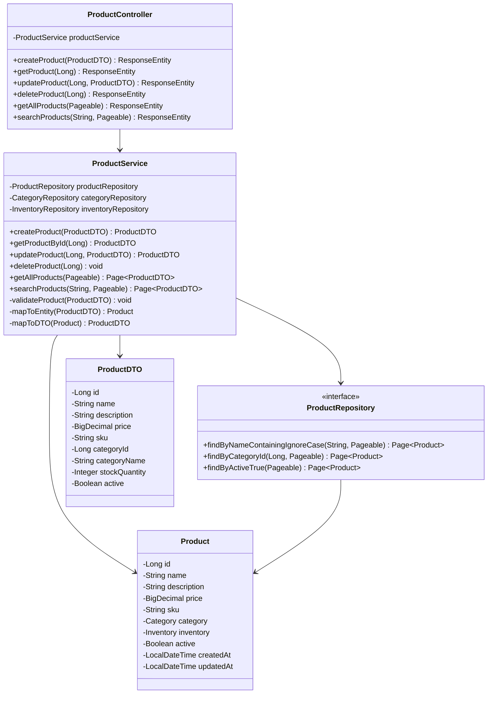
```mermaid
classDiagram
    class ProductController {
        -ProductService productService
        +createProduct(ProductDTO) ResponseEntity
        +getProduct(Long) ResponseEntity
        +updateProduct(Long, ProductDTO) ResponseEntity
        +deleteProduct(Long) ResponseEntity
        +getAllProducts(Pageable) ResponseEntity
        +searchProducts(String, Pageable) ResponseEntity
    }

    class ProductService {
        -ProductRepository productRepository
        -CategoryRepository categoryRepository
        -InventoryRepository inventoryRepository
        +createProduct(ProductDTO) ProductDTO
        +getProductById(Long) ProductDTO
        +updateProduct(Long, ProductDTO) ProductDTO
        +deleteProduct(Long) void
        +getAllProducts(Pageable) Page~ProductDTO~
        +searchProducts(String, Pageable) Page~ProductDTO~
        -validateProduct(ProductDTO) void
        -mapToEntity(ProductDTO) Product
        -mapToDTO(Product) ProductDTO
    }

    class ProductRepository {
        <<interface>>
        +findByNameContainingIgnoreCase(String, Pageable) Page~Product~
        +findByCategoryId(Long, Pageable) Page~Product~
        +findByActiveTrue(Pageable) Page~Product~
    }

    class Product {
        -Long id
        -String name
        -String description
        -BigDecimal price
        -String sku
        -Category category
        -Inventory inventory
        -Boolean active
        -LocalDateTime createdAt
        -LocalDateTime updatedAt
    }

    class ProductDTO {
        -Long id
        -String name
        -String description
        -BigDecimal price
        -String sku
        -Long categoryId
        -String categoryName
        -Integer stockQuantity
        -Boolean active
    }

    ProductController --> ProductService
    ProductService --> ProductRepository
    ProductService --> Product
    ProductService --> ProductDTO
    ProductRepository --> Product
```

#### 2.1.2 Category Management Module

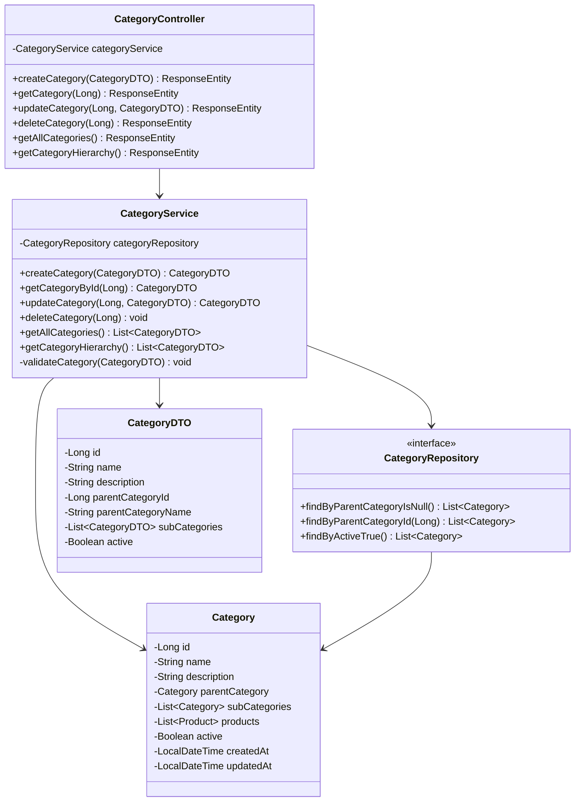
```mermaid
classDiagram
    class CategoryController {
        -CategoryService categoryService
        +createCategory(CategoryDTO) ResponseEntity
        +getCategory(Long) ResponseEntity
        +updateCategory(Long, CategoryDTO) ResponseEntity
        +deleteCategory(Long) ResponseEntity
        +getAllCategories() ResponseEntity
        +getCategoryHierarchy() ResponseEntity
    }

    class CategoryService {
        -CategoryRepository categoryRepository
        +createCategory(CategoryDTO) CategoryDTO
        +getCategoryById(Long) CategoryDTO
        +updateCategory(Long, CategoryDTO) CategoryDTO
        +deleteCategory(Long) void
        +getAllCategories() List~CategoryDTO~
        +getCategoryHierarchy() List~CategoryDTO~
        -validateCategory(CategoryDTO) void
    }

    class CategoryRepository {
        <<interface>>
        +findByParentCategoryIsNull() List~Category~
        +findByParentCategoryId(Long) List~Category~
        +findByActiveTrue() List~Category~
    }

    class Category {
        -Long id
        -String name
        -String description
        -Category parentCategory
        -List~Category~ subCategories
        -List~Product~ products
        -Boolean active
        -LocalDateTime createdAt
        -LocalDateTime updatedAt
    }

    class CategoryDTO {
        -Long id
        -String name
        -String description
        -Long parentCategoryId
        -String parentCategoryName
        -List~CategoryDTO~ subCategories
        -Boolean active
    }

    CategoryController --> CategoryService
    CategoryService --> CategoryRepository
    CategoryService --> Category
    CategoryService --> CategoryDTO
    CategoryRepository --> Category
```

#### 2.1.3 Inventory Management Module

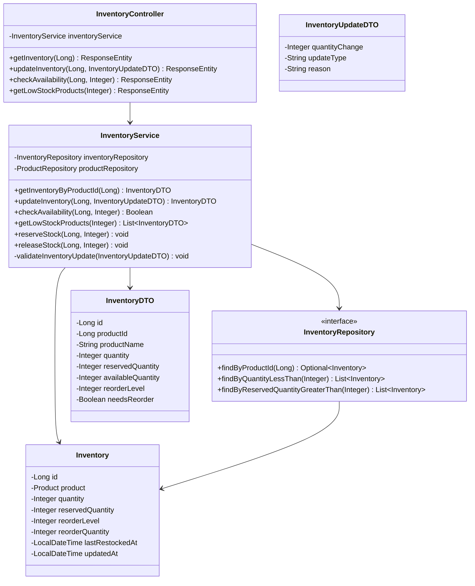
```mermaid
classDiagram
    class InventoryController {
        -InventoryService inventoryService
        +getInventory(Long) ResponseEntity
        +updateInventory(Long, InventoryUpdateDTO) ResponseEntity
        +checkAvailability(Long, Integer) ResponseEntity
        +getLowStockProducts(Integer) ResponseEntity
    }

    class InventoryService {
        -InventoryRepository inventoryRepository
        -ProductRepository productRepository
        +getInventoryByProductId(Long) InventoryDTO
        +updateInventory(Long, InventoryUpdateDTO) InventoryDTO
        +checkAvailability(Long, Integer) Boolean
        +getLowStockProducts(Integer) List~InventoryDTO~
        +reserveStock(Long, Integer) void
        +releaseStock(Long, Integer) void
        -validateInventoryUpdate(InventoryUpdateDTO) void
    }

    class InventoryRepository {
        <<interface>>
        +findByProductId(Long) Optional~Inventory~
        +findByQuantityLessThan(Integer) List~Inventory~
        +findByReservedQuantityGreaterThan(Integer) List~Inventory~
    }

    class Inventory {
        -Long id
        -Product product
        -Integer quantity
        -Integer reservedQuantity
        -Integer reorderLevel
        -Integer reorderQuantity
        -LocalDateTime lastRestockedAt
        -LocalDateTime updatedAt
    }

    class InventoryDTO {
        -Long id
        -Long productId
        -String productName
        -Integer quantity
        -Integer reservedQuantity
        -Integer availableQuantity
        -Integer reorderLevel
        -Boolean needsReorder
    }

    class InventoryUpdateDTO {
        -Integer quantityChange
        -String updateType
        -String reason
    }

    InventoryController --> InventoryService
    InventoryService --> InventoryRepository
    InventoryService --> Inventory
    InventoryService --> InventoryDTO
    InventoryRepository --> Inventory
```

#### 2.1.4 Shopping Cart Management Module

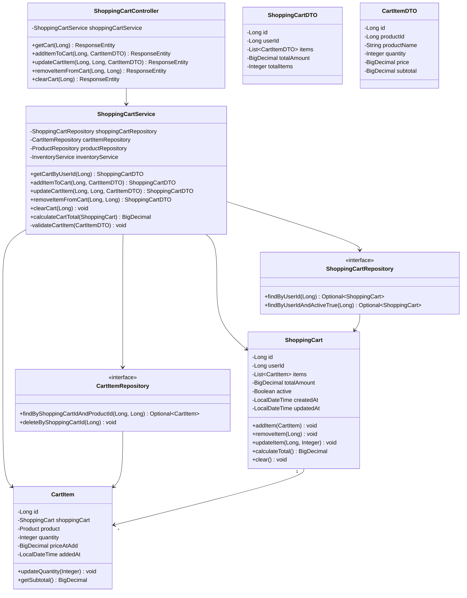
```mermaid
classDiagram
    class ShoppingCartController {
        -ShoppingCartService shoppingCartService
        +getCart(Long) ResponseEntity
        +addItemToCart(Long, CartItemDTO) ResponseEntity
        +updateCartItem(Long, Long, CartItemDTO) ResponseEntity
        +removeItemFromCart(Long, Long) ResponseEntity
        +clearCart(Long) ResponseEntity
    }

    class ShoppingCartService {
        -ShoppingCartRepository shoppingCartRepository
        -CartItemRepository cartItemRepository
        -ProductRepository productRepository
        -InventoryService inventoryService
        +getCartByUserId(Long) ShoppingCartDTO
        +addItemToCart(Long, CartItemDTO) ShoppingCartDTO
        +updateCartItem(Long, Long, CartItemDTO) ShoppingCartDTO
        +removeItemFromCart(Long, Long) ShoppingCartDTO
        +clearCart(Long) void
        +calculateCartTotal(ShoppingCart) BigDecimal
        -validateCartItem(CartItemDTO) void
    }

    class ShoppingCartRepository {
        <<interface>>
        +findByUserId(Long) Optional~ShoppingCart~
        +findByUserIdAndActiveTrue(Long) Optional~ShoppingCart~
    }

    class CartItemRepository {
        <<interface>>
        +findByShoppingCartIdAndProductId(Long, Long) Optional~CartItem~
        +deleteByShoppingCartId(Long) void
    }

    class ShoppingCart {
        -Long id
        -Long userId
        -List~CartItem~ items
        -BigDecimal totalAmount
        -Boolean active
        -LocalDateTime createdAt
        -LocalDateTime updatedAt
        +addItem(CartItem) void
        +removeItem(Long) void
        +updateItem(Long, Integer) void
        +calculateTotal() BigDecimal
        +clear() void
    }

    class CartItem {
        -Long id
        -ShoppingCart shoppingCart
        -Product product
        -Integer quantity
        -BigDecimal priceAtAdd
        -LocalDateTime addedAt
        +updateQuantity(Integer) void
        +getSubtotal() BigDecimal
    }

    class ShoppingCartDTO {
        -Long id
        -Long userId
        -List~CartItemDTO~ items
        -BigDecimal totalAmount
        -Integer totalItems
    }

    class CartItemDTO {
        -Long id
        -Long productId
        -String productName
        -Integer quantity
        -BigDecimal price
        -BigDecimal subtotal
    }

    ShoppingCartController --> ShoppingCartService
    ShoppingCartService --> ShoppingCartRepository
    ShoppingCartService --> CartItemRepository
    ShoppingCartService --> ShoppingCart
    ShoppingCartService --> CartItem
    ShoppingCartRepository --> ShoppingCart
    CartItemRepository --> CartItem
    ShoppingCart "1" --> "*" CartItem
```

### 2.2 Entity Relationship Diagrams

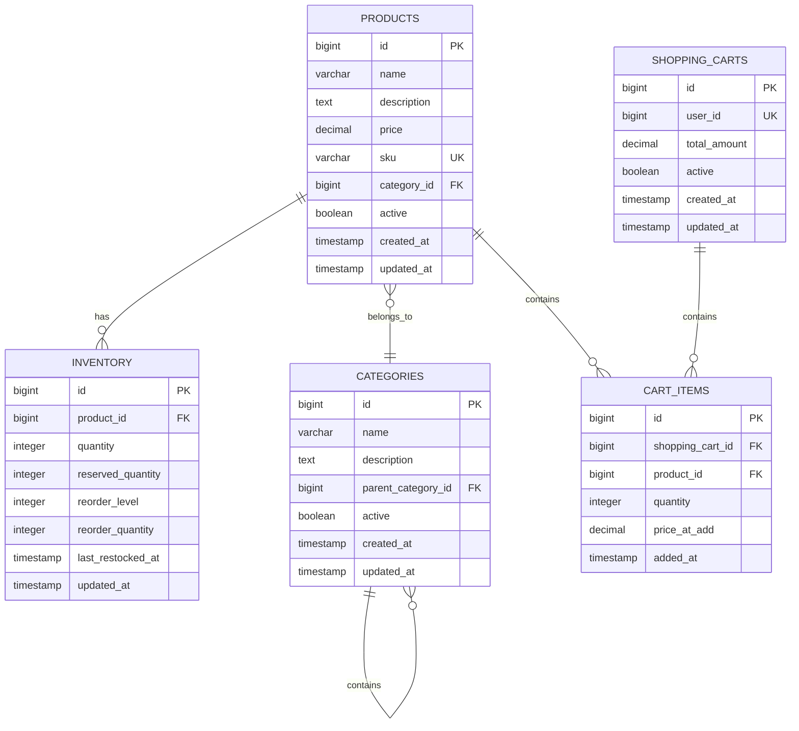
```mermaid
erDiagram
    PRODUCTS ||--o{ INVENTORY : has
    PRODUCTS }o--|| CATEGORIES : belongs_to
    CATEGORIES ||--o{ CATEGORIES : contains
    PRODUCTS ||--o{ CART_ITEMS : contains
    SHOPPING_CARTS ||--o{ CART_ITEMS : contains

    PRODUCTS {
        bigint id PK
        varchar name
        text description
        decimal price
        varchar sku UK
        bigint category_id FK
        boolean active
        timestamp created_at
        timestamp updated_at
    }

    CATEGORIES {
        bigint id PK
        varchar name
        text description
        bigint parent_category_id FK
        boolean active
        timestamp created_at
        timestamp updated_at
    }

    INVENTORY {
        bigint id PK
        bigint product_id FK
        integer quantity
        integer reserved_quantity
        integer reorder_level
        integer reorder_quantity
        timestamp last_restocked_at
        timestamp updated_at
    }

    SHOPPING_CARTS {
        bigint id PK
        bigint user_id UK
        decimal total_amount
        boolean active
        timestamp created_at
        timestamp updated_at
    }

    CART_ITEMS {
        bigint id PK
        bigint shopping_cart_id FK
        bigint product_id FK
        integer quantity
        decimal price_at_add
        timestamp added_at
    }
```

---

## 3. Sequence Diagrams

### 3.1 Create Product Flow

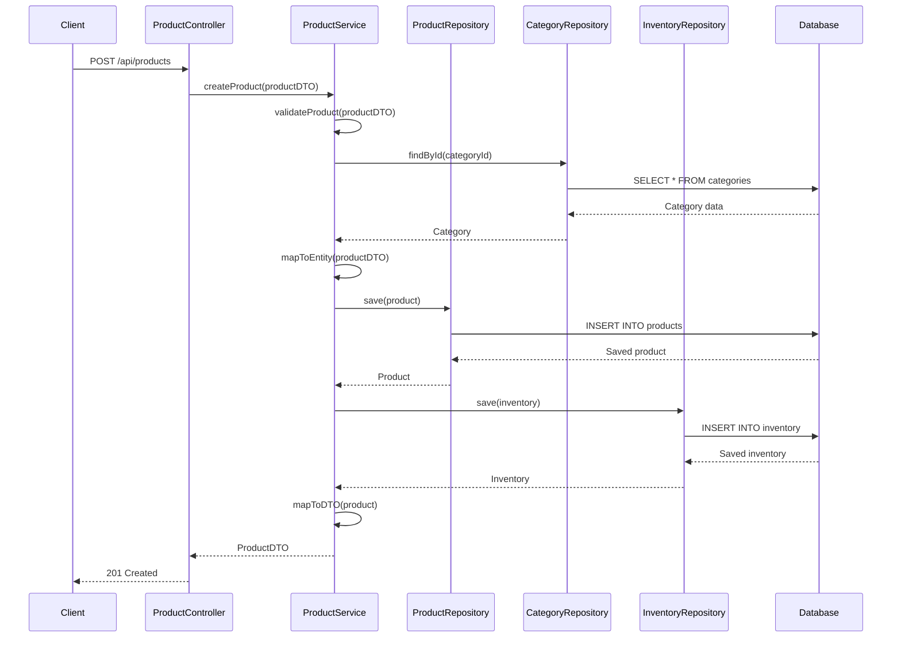
```mermaid
sequenceDiagram
    participant Client
    participant ProductController
    participant ProductService
    participant ProductRepository
    participant CategoryRepository
    participant InventoryRepository
    participant Database

    Client->>ProductController: POST /api/products
    ProductController->>ProductService: createProduct(productDTO)
    ProductService->>ProductService: validateProduct(productDTO)
    ProductService->>CategoryRepository: findById(categoryId)
    CategoryRepository->>Database: SELECT * FROM categories
    Database-->>CategoryRepository: Category data
    CategoryRepository-->>ProductService: Category
    ProductService->>ProductService: mapToEntity(productDTO)
    ProductService->>ProductRepository: save(product)
    ProductRepository->>Database: INSERT INTO products
    Database-->>ProductRepository: Saved product
    ProductRepository-->>ProductService: Product
    ProductService->>InventoryRepository: save(inventory)
    InventoryRepository->>Database: INSERT INTO inventory
    Database-->>InventoryRepository: Saved inventory
    InventoryRepository-->>ProductService: Inventory
    ProductService->>ProductService: mapToDTO(product)
    ProductService-->>ProductController: ProductDTO
    ProductController-->>Client: 201 Created
```

### 3.2 Get Product Flow

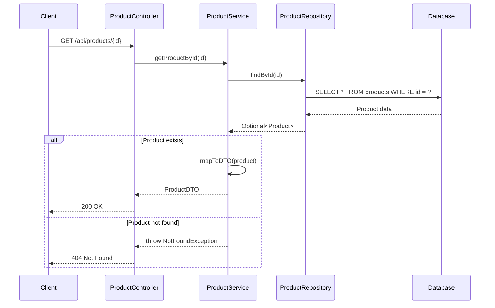
```mermaid
sequenceDiagram
    participant Client
    participant ProductController
    participant ProductService
    participant ProductRepository
    participant Database

    Client->>ProductController: GET /api/products/{id}
    ProductController->>ProductService: getProductById(id)
    ProductService->>ProductRepository: findById(id)
    ProductRepository->>Database: SELECT * FROM products WHERE id = ?
    Database-->>ProductRepository: Product data
    ProductRepository-->>ProductService: Optional<Product>
    alt Product exists
        ProductService->>ProductService: mapToDTO(product)
        ProductService-->>ProductController: ProductDTO
        ProductController-->>Client: 200 OK
    else Product not found
        ProductService-->>ProductController: throw NotFoundException
        ProductController-->>Client: 404 Not Found
    end
```

### 3.3 Update Product Flow

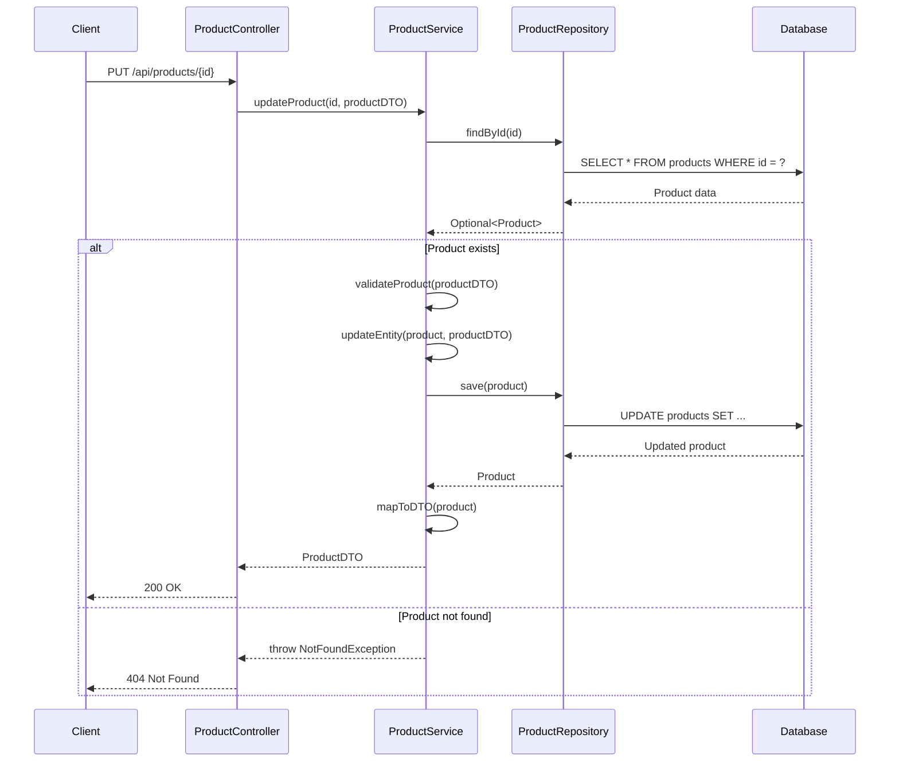
```mermaid
sequenceDiagram
    participant Client
    participant ProductController
    participant ProductService
    participant ProductRepository
    participant Database

    Client->>ProductController: PUT /api/products/{id}
    ProductController->>ProductService: updateProduct(id, productDTO)
    ProductService->>ProductRepository: findById(id)
    ProductRepository->>Database: SELECT * FROM products WHERE id = ?
    Database-->>ProductRepository: Product data
    ProductRepository-->>ProductService: Optional<Product>
    alt Product exists
        ProductService->>ProductService: validateProduct(productDTO)
        ProductService->>ProductService: updateEntity(product, productDTO)
        ProductService->>ProductRepository: save(product)
        ProductRepository->>Database: UPDATE products SET ...
        Database-->>ProductRepository: Updated product
        ProductRepository-->>ProductService: Product
        ProductService->>ProductService: mapToDTO(product)
        ProductService-->>ProductController: ProductDTO
        ProductController-->>Client: 200 OK
    else Product not found
        ProductService-->>ProductController: throw NotFoundException
        ProductController-->>Client: 404 Not Found
    end
```

### 3.4 Delete Product Flow

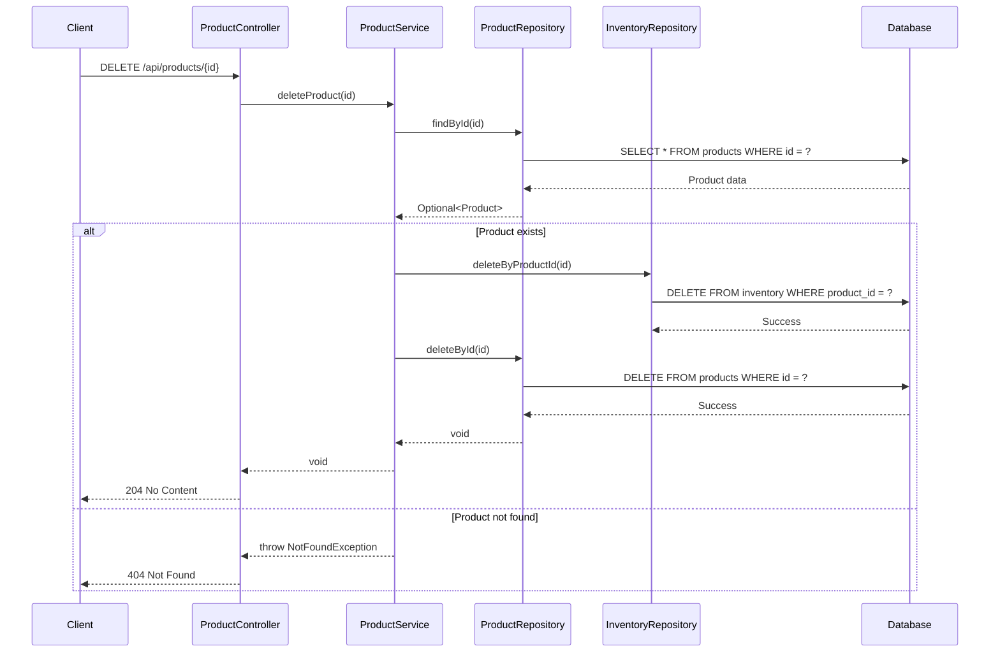
```mermaid
sequenceDiagram
    participant Client
    participant ProductController
    participant ProductService
    participant ProductRepository
    participant InventoryRepository
    participant Database

    Client->>ProductController: DELETE /api/products/{id}
    ProductController->>ProductService: deleteProduct(id)
    ProductService->>ProductRepository: findById(id)
    ProductRepository->>Database: SELECT * FROM products WHERE id = ?
    Database-->>ProductRepository: Product data
    ProductRepository-->>ProductService: Optional<Product>
    alt Product exists
        ProductService->>InventoryRepository: deleteByProductId(id)
        InventoryRepository->>Database: DELETE FROM inventory WHERE product_id = ?
        Database-->>InventoryRepository: Success
        ProductService->>ProductRepository: deleteById(id)
        ProductRepository->>Database: DELETE FROM products WHERE id = ?
        Database-->>ProductRepository: Success
        ProductRepository-->>ProductService: void
        ProductService-->>ProductController: void
        ProductController-->>Client: 204 No Content
    else Product not found
        ProductService-->>ProductController: throw NotFoundException
        ProductController-->>Client: 404 Not Found
    end
```

### 3.5 Search Products Flow

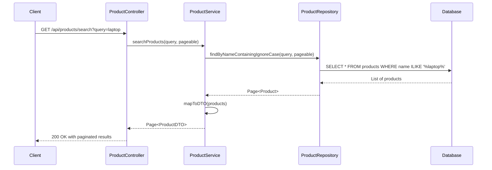
```mermaid
sequenceDiagram
    participant Client
    participant ProductController
    participant ProductService
    participant ProductRepository
    participant Database

    Client->>ProductController: GET /api/products/search?query=laptop
    ProductController->>ProductService: searchProducts(query, pageable)
    ProductService->>ProductRepository: findByNameContainingIgnoreCase(query, pageable)
    ProductRepository->>Database: SELECT * FROM products WHERE name ILIKE '%laptop%'
    Database-->>ProductRepository: List of products
    ProductRepository-->>ProductService: Page<Product>
    ProductService->>ProductService: mapToDTO(products)
    ProductService-->>ProductController: Page<ProductDTO>
    ProductController-->>Client: 200 OK with paginated results
```

### 3.6 Update Inventory Flow

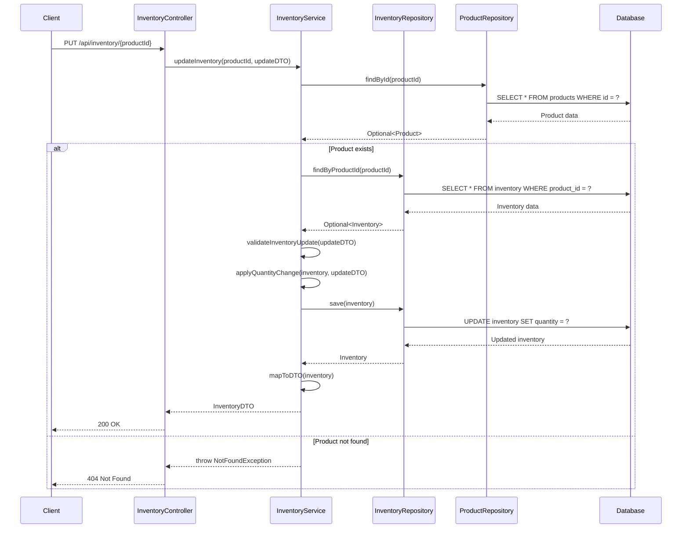
```mermaid
sequenceDiagram
    participant Client
    participant InventoryController
    participant InventoryService
    participant InventoryRepository
    participant ProductRepository
    participant Database

    Client->>InventoryController: PUT /api/inventory/{productId}
    InventoryController->>InventoryService: updateInventory(productId, updateDTO)
    InventoryService->>ProductRepository: findById(productId)
    ProductRepository->>Database: SELECT * FROM products WHERE id = ?
    Database-->>ProductRepository: Product data
    ProductRepository-->>InventoryService: Optional<Product>
    alt Product exists
        InventoryService->>InventoryRepository: findByProductId(productId)
        InventoryRepository->>Database: SELECT * FROM inventory WHERE product_id = ?
        Database-->>InventoryRepository: Inventory data
        InventoryRepository-->>InventoryService: Optional<Inventory>
        InventoryService->>InventoryService: validateInventoryUpdate(updateDTO)
        InventoryService->>InventoryService: applyQuantityChange(inventory, updateDTO)
        InventoryService->>InventoryRepository: save(inventory)
        InventoryRepository->>Database: UPDATE inventory SET quantity = ?
        Database-->>InventoryRepository: Updated inventory
        InventoryRepository-->>InventoryService: Inventory
        InventoryService->>InventoryService: mapToDTO(inventory)
        InventoryService-->>InventoryController: InventoryDTO
        InventoryController-->>Client: 200 OK
    else Product not found
        InventoryService-->>InventoryController: throw NotFoundException
        InventoryController-->>Client: 404 Not Found
    end
```

### 3.7 Check Stock Availability Flow

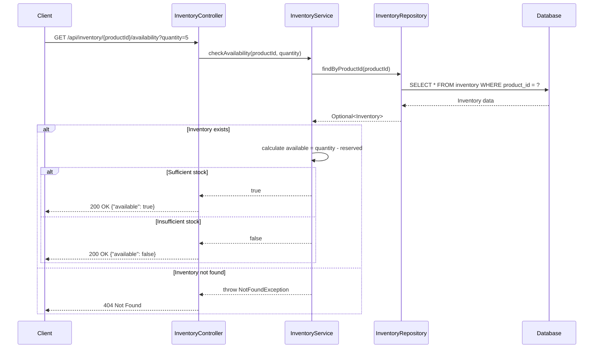
```mermaid
sequenceDiagram
    participant Client
    participant InventoryController
    participant InventoryService
    participant InventoryRepository
    participant Database

    Client->>InventoryController: GET /api/inventory/{productId}/availability?quantity=5
    InventoryController->>InventoryService: checkAvailability(productId, quantity)
    InventoryService->>InventoryRepository: findByProductId(productId)
    InventoryRepository->>Database: SELECT * FROM inventory WHERE product_id = ?
    Database-->>InventoryRepository: Inventory data
    InventoryRepository-->>InventoryService: Optional<Inventory>
    alt Inventory exists
        InventoryService->>InventoryService: calculate available = quantity - reserved
        alt Sufficient stock
            InventoryService-->>InventoryController: true
            InventoryController-->>Client: 200 OK {"available": true}
        else Insufficient stock
            InventoryService-->>InventoryController: false
            InventoryController-->>Client: 200 OK {"available": false}
        end
    else Inventory not found
        InventoryService-->>InventoryController: throw NotFoundException
        InventoryController-->>Client: 404 Not Found
    end
```

### 3.8 Add Item to Cart Flow

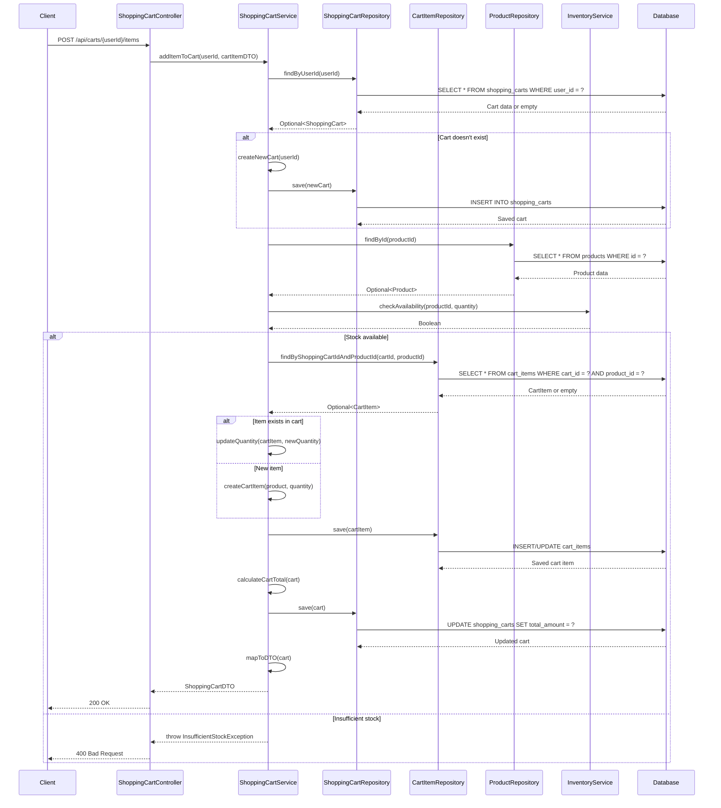
```mermaid
sequenceDiagram
    participant Client
    participant ShoppingCartController
    participant ShoppingCartService
    participant ShoppingCartRepository
    participant CartItemRepository
    participant ProductRepository
    participant InventoryService
    participant Database

    Client->>ShoppingCartController: POST /api/carts/{userId}/items
    ShoppingCartController->>ShoppingCartService: addItemToCart(userId, cartItemDTO)
    ShoppingCartService->>ShoppingCartRepository: findByUserId(userId)
    ShoppingCartRepository->>Database: SELECT * FROM shopping_carts WHERE user_id = ?
    Database-->>ShoppingCartRepository: Cart data or empty
    ShoppingCartRepository-->>ShoppingCartService: Optional<ShoppingCart>
    alt Cart doesn't exist
        ShoppingCartService->>ShoppingCartService: createNewCart(userId)
        ShoppingCartService->>ShoppingCartRepository: save(newCart)
        ShoppingCartRepository->>Database: INSERT INTO shopping_carts
        Database-->>ShoppingCartRepository: Saved cart
    end
    ShoppingCartService->>ProductRepository: findById(productId)
    ProductRepository->>Database: SELECT * FROM products WHERE id = ?
    Database-->>ProductRepository: Product data
    ProductRepository-->>ShoppingCartService: Optional<Product>
    ShoppingCartService->>InventoryService: checkAvailability(productId, quantity)
    InventoryService-->>ShoppingCartService: Boolean
    alt Stock available
        ShoppingCartService->>CartItemRepository: findByShoppingCartIdAndProductId(cartId, productId)
        CartItemRepository->>Database: SELECT * FROM cart_items WHERE cart_id = ? AND product_id = ?
        Database-->>CartItemRepository: CartItem or empty
        CartItemRepository-->>ShoppingCartService: Optional<CartItem>
        alt Item exists in cart
            ShoppingCartService->>ShoppingCartService: updateQuantity(cartItem, newQuantity)
        else New item
            ShoppingCartService->>ShoppingCartService: createCartItem(product, quantity)
        end
        ShoppingCartService->>CartItemRepository: save(cartItem)
        CartItemRepository->>Database: INSERT/UPDATE cart_items
        Database-->>CartItemRepository: Saved cart item
        ShoppingCartService->>ShoppingCartService: calculateCartTotal(cart)
        ShoppingCartService->>ShoppingCartRepository: save(cart)
        ShoppingCartRepository->>Database: UPDATE shopping_carts SET total_amount = ?
        Database-->>ShoppingCartRepository: Updated cart
        ShoppingCartService->>ShoppingCartService: mapToDTO(cart)
        ShoppingCartService-->>ShoppingCartController: ShoppingCartDTO
        ShoppingCartController-->>Client: 200 OK
    else Insufficient stock
        ShoppingCartService-->>ShoppingCartController: throw InsufficientStockException
        ShoppingCartController-->>Client: 400 Bad Request
    end
```

### 3.9 Update Cart Item Flow

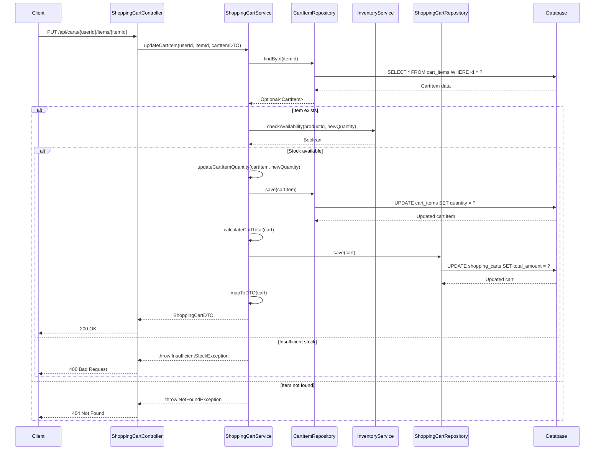
```mermaid
sequenceDiagram
    participant Client
    participant ShoppingCartController
    participant ShoppingCartService
    participant CartItemRepository
    participant InventoryService
    participant ShoppingCartRepository
    participant Database

    Client->>ShoppingCartController: PUT /api/carts/{userId}/items/{itemId}
    ShoppingCartController->>ShoppingCartService: updateCartItem(userId, itemId, cartItemDTO)
    ShoppingCartService->>CartItemRepository: findById(itemId)
    CartItemRepository->>Database: SELECT * FROM cart_items WHERE id = ?
    Database-->>CartItemRepository: CartItem data
    CartItemRepository-->>ShoppingCartService: Optional<CartItem>
    alt Item exists
        ShoppingCartService->>InventoryService: checkAvailability(productId, newQuantity)
        InventoryService-->>ShoppingCartService: Boolean
        alt Stock available
            ShoppingCartService->>ShoppingCartService: updateCartItemQuantity(cartItem, newQuantity)
            ShoppingCartService->>CartItemRepository: save(cartItem)
            CartItemRepository->>Database: UPDATE cart_items SET quantity = ?
            Database-->>CartItemRepository: Updated cart item
            ShoppingCartService->>ShoppingCartService: calculateCartTotal(cart)
            ShoppingCartService->>ShoppingCartRepository: save(cart)
            ShoppingCartRepository->>Database: UPDATE shopping_carts SET total_amount = ?
            Database-->>ShoppingCartRepository: Updated cart
            ShoppingCartService->>ShoppingCartService: mapToDTO(cart)
            ShoppingCartService-->>ShoppingCartController: ShoppingCartDTO
            ShoppingCartController-->>Client: 200 OK
        else Insufficient stock
            ShoppingCartService-->>ShoppingCartController: throw InsufficientStockException
            ShoppingCartController-->>Client: 400 Bad Request
        end
    else Item not found
        ShoppingCartService-->>ShoppingCartController: throw NotFoundException
        ShoppingCartController-->>Client: 404 Not Found
    end
```

### 3.10 Remove Item from Cart Flow

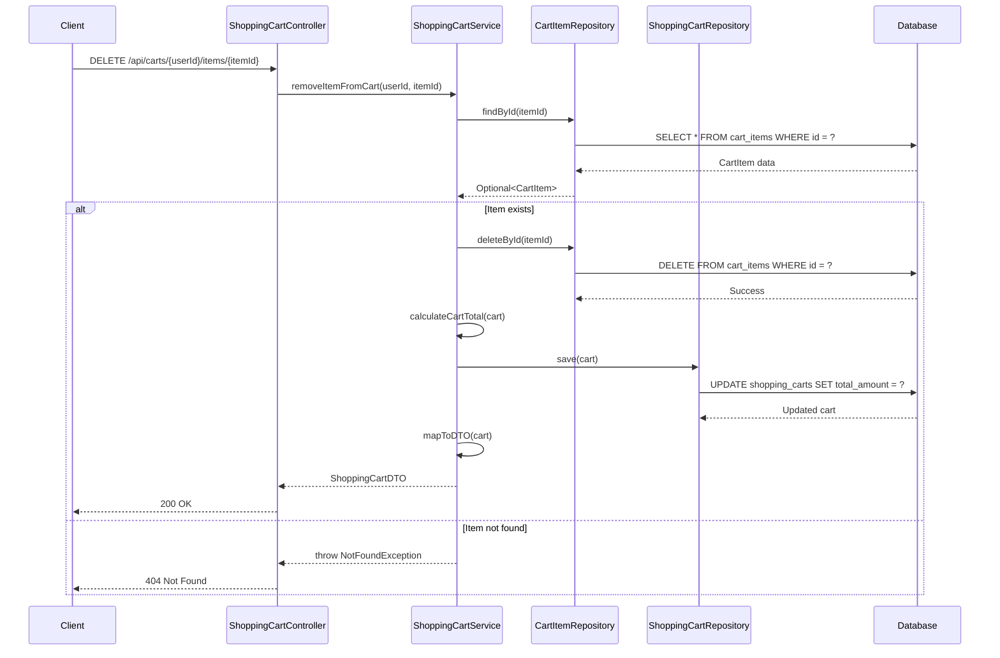
```mermaid
sequenceDiagram
    participant Client
    participant ShoppingCartController
    participant ShoppingCartService
    participant CartItemRepository
    participant ShoppingCartRepository
    participant Database

    Client->>ShoppingCartController: DELETE /api/carts/{userId}/items/{itemId}
    ShoppingCartController->>ShoppingCartService: removeItemFromCart(userId, itemId)
    ShoppingCartService->>CartItemRepository: findById(itemId)
    CartItemRepository->>Database: SELECT * FROM cart_items WHERE id = ?
    Database-->>CartItemRepository: CartItem data
    CartItemRepository-->>ShoppingCartService: Optional<CartItem>
    alt Item exists
        ShoppingCartService->>CartItemRepository: deleteById(itemId)
        CartItemRepository->>Database: DELETE FROM cart_items WHERE id = ?
        Database-->>CartItemRepository: Success
        ShoppingCartService->>ShoppingCartService: calculateCartTotal(cart)
        ShoppingCartService->>ShoppingCartRepository: save(cart)
        ShoppingCartRepository->>Database: UPDATE shopping_carts SET total_amount = ?
        Database-->>ShoppingCartRepository: Updated cart
        ShoppingCartService->>ShoppingCartService: mapToDTO(cart)
        ShoppingCartService-->>ShoppingCartController: ShoppingCartDTO
        ShoppingCartController-->>Client: 200 OK
    else Item not found
        ShoppingCartService-->>ShoppingCartController: throw NotFoundException
        ShoppingCartController-->>Client: 404 Not Found
    end
```

### 3.11 Clear Cart Flow

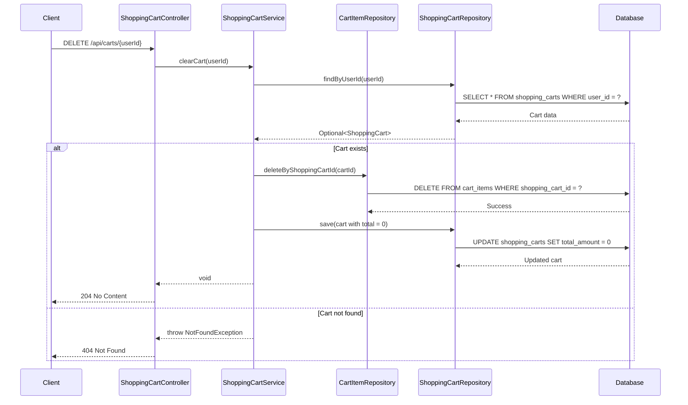
```mermaid
sequenceDiagram
    participant Client
    participant ShoppingCartController
    participant ShoppingCartService
    participant CartItemRepository
    participant ShoppingCartRepository
    participant Database

    Client->>ShoppingCartController: DELETE /api/carts/{userId}
    ShoppingCartController->>ShoppingCartService: clearCart(userId)
    ShoppingCartService->>ShoppingCartRepository: findByUserId(userId)
    ShoppingCartRepository->>Database: SELECT * FROM shopping_carts WHERE user_id = ?
    Database-->>ShoppingCartRepository: Cart data
    ShoppingCartRepository-->>ShoppingCartService: Optional<ShoppingCart>
    alt Cart exists
        ShoppingCartService->>CartItemRepository: deleteByShoppingCartId(cartId)
        CartItemRepository->>Database: DELETE FROM cart_items WHERE shopping_cart_id = ?
        Database-->>CartItemRepository: Success
        ShoppingCartService->>ShoppingCartRepository: save(cart with total = 0)
        ShoppingCartRepository->>Database: UPDATE shopping_carts SET total_amount = 0
        Database-->>ShoppingCartRepository: Updated cart
        ShoppingCartService-->>ShoppingCartController: void
        ShoppingCartController-->>Client: 204 No Content
    else Cart not found
        ShoppingCartService-->>ShoppingCartController: throw NotFoundException
        ShoppingCartController-->>Client: 404 Not Found
    end
```

---

## 4. API Endpoints

### 4.1 Product Management Endpoints

| Method | Endpoint | Description | Request Body | Response |
|--------|----------|-------------|--------------|----------|
| POST | `/api/products` | Create new product | ProductDTO | 201 Created, ProductDTO |
| GET | `/api/products/{id}` | Get product by ID | - | 200 OK, ProductDTO |
| PUT | `/api/products/{id}` | Update product | ProductDTO | 200 OK, ProductDTO |
| DELETE | `/api/products/{id}` | Delete product | - | 204 No Content |
| GET | `/api/products` | Get all products (paginated) | - | 200 OK, Page<ProductDTO> |
| GET | `/api/products/search` | Search products | query param | 200 OK, Page<ProductDTO> |

### 4.2 Category Management Endpoints

| Method | Endpoint | Description | Request Body | Response |
|--------|----------|-------------|--------------|----------|
| POST | `/api/categories` | Create new category | CategoryDTO | 201 Created, CategoryDTO |
| GET | `/api/categories/{id}` | Get category by ID | - | 200 OK, CategoryDTO |
| PUT | `/api/categories/{id}` | Update category | CategoryDTO | 200 OK, CategoryDTO |
| DELETE | `/api/categories/{id}` | Delete category | - | 204 No Content |
| GET | `/api/categories` | Get all categories | - | 200 OK, List<CategoryDTO> |
| GET | `/api/categories/hierarchy` | Get category hierarchy | - | 200 OK, List<CategoryDTO> |

### 4.3 Inventory Management Endpoints

| Method | Endpoint | Description | Request Body | Response |
|--------|----------|-------------|--------------|----------|
| GET | `/api/inventory/{productId}` | Get inventory for product | - | 200 OK, InventoryDTO |
| PUT | `/api/inventory/{productId}` | Update inventory | InventoryUpdateDTO | 200 OK, InventoryDTO |
| GET | `/api/inventory/{productId}/availability` | Check stock availability | quantity param | 200 OK, Boolean |
| GET | `/api/inventory/low-stock` | Get low stock products | threshold param | 200 OK, List<InventoryDTO> |

### 4.4 Shopping Cart Management Endpoints

| Method | Endpoint | Description | Request Body | Response |
|--------|----------|-------------|--------------|----------|
| GET | `/api/carts/{userId}` | Get user's shopping cart | - | 200 OK, ShoppingCartDTO |
| POST | `/api/carts/{userId}/items` | Add item to cart | CartItemDTO | 200 OK, ShoppingCartDTO |
| PUT | `/api/carts/{userId}/items/{itemId}` | Update cart item | CartItemDTO | 200 OK, ShoppingCartDTO |
| DELETE | `/api/carts/{userId}/items/{itemId}` | Remove item from cart | - | 200 OK, ShoppingCartDTO |
| DELETE | `/api/carts/{userId}` | Clear cart | - | 204 No Content |

---

## 5. Database Schema

### 5.1 Products Table

```sql
CREATE TABLE products (
    id BIGSERIAL PRIMARY KEY,
    name VARCHAR(255) NOT NULL,
    description TEXT,
    price DECIMAL(10, 2) NOT NULL,
    sku VARCHAR(100) UNIQUE NOT NULL,
    category_id BIGINT,
    active BOOLEAN DEFAULT true,
    created_at TIMESTAMP DEFAULT CURRENT_TIMESTAMP,
    updated_at TIMESTAMP DEFAULT CURRENT_TIMESTAMP,
    FOREIGN KEY (category_id) REFERENCES categories(id) ON DELETE SET NULL
);

CREATE INDEX idx_products_name ON products(name);
CREATE INDEX idx_products_category ON products(category_id);
CREATE INDEX idx_products_sku ON products(sku);
CREATE INDEX idx_products_active ON products(active);
```

### 5.2 Categories Table

```sql
CREATE TABLE categories (
    id BIGSERIAL PRIMARY KEY,
    name VARCHAR(255) NOT NULL,
    description TEXT,
    parent_category_id BIGINT,
    active BOOLEAN DEFAULT true,
    created_at TIMESTAMP DEFAULT CURRENT_TIMESTAMP,
    updated_at TIMESTAMP DEFAULT CURRENT_TIMESTAMP,
    FOREIGN KEY (parent_category_id) REFERENCES categories(id) ON DELETE CASCADE
);

CREATE INDEX idx_categories_parent ON categories(parent_category_id);
CREATE INDEX idx_categories_active ON categories(active);
```

### 5.3 Inventory Table

```sql
CREATE TABLE inventory (
    id BIGSERIAL PRIMARY KEY,
    product_id BIGINT UNIQUE NOT NULL,
    quantity INTEGER NOT NULL DEFAULT 0,
    reserved_quantity INTEGER NOT NULL DEFAULT 0,
    reorder_level INTEGER DEFAULT 10,
    reorder_quantity INTEGER DEFAULT 50,
    last_restocked_at TIMESTAMP,
    updated_at TIMESTAMP DEFAULT CURRENT_TIMESTAMP,
    FOREIGN KEY (product_id) REFERENCES products(id) ON DELETE CASCADE,
    CONSTRAINT chk_quantity_positive CHECK (quantity >= 0),
    CONSTRAINT chk_reserved_positive CHECK (reserved_quantity >= 0)
);

CREATE INDEX idx_inventory_product ON inventory(product_id);
CREATE INDEX idx_inventory_quantity ON inventory(quantity);
```

### 5.4 Shopping Carts Table

```sql
CREATE TABLE shopping_carts (
    id BIGSERIAL PRIMARY KEY,
    user_id BIGINT UNIQUE NOT NULL,
    total_amount DECIMAL(10, 2) NOT NULL DEFAULT 0.00,
    active BOOLEAN DEFAULT true,
    created_at TIMESTAMP DEFAULT CURRENT_TIMESTAMP,
    updated_at TIMESTAMP DEFAULT CURRENT_TIMESTAMP
);

CREATE INDEX idx_shopping_carts_user ON shopping_carts(user_id);
CREATE INDEX idx_shopping_carts_active ON shopping_carts(active);
```

### 5.5 Cart Items Table

```sql
CREATE TABLE cart_items (
    id BIGSERIAL PRIMARY KEY,
    shopping_cart_id BIGINT NOT NULL,
    product_id BIGINT NOT NULL,
    quantity INTEGER NOT NULL,
    price_at_add DECIMAL(10, 2) NOT NULL,
    added_at TIMESTAMP DEFAULT CURRENT_TIMESTAMP,
    FOREIGN KEY (shopping_cart_id) REFERENCES shopping_carts(id) ON DELETE CASCADE,
    FOREIGN KEY (product_id) REFERENCES products(id) ON DELETE CASCADE,
    CONSTRAINT chk_cart_item_quantity_positive CHECK (quantity > 0),
    CONSTRAINT uk_cart_product UNIQUE (shopping_cart_id, product_id)
);

CREATE INDEX idx_cart_items_cart ON cart_items(shopping_cart_id);
CREATE INDEX idx_cart_items_product ON cart_items(product_id);
```

---

## 6. Security Design

### 6.1 Authentication & Authorization
- JWT-based authentication
- Role-based access control (RBAC)
- Roles: ADMIN, MANAGER, USER

### 6.2 API Security
- All endpoints require authentication except public product browsing
- HTTPS enforcement
- CORS configuration
- Rate limiting

### 6.3 Data Security
- Input validation using Bean Validation
- SQL injection prevention via JPA/Hibernate
- XSS protection
- Sensitive data encryption

---

## 7. Design Patterns

### 7.1 Repository Pattern
- Abstracts data access logic
- Provides clean separation between business logic and data access
- Implemented via Spring Data JPA repositories

### 7.2 DTO Pattern
- Separates internal domain models from API contracts
- Prevents over-exposure of entity details
- Enables API versioning

### 7.3 Service Layer Pattern
- Encapsulates business logic
- Provides transaction boundaries
- Coordinates between multiple repositories

### 7.4 Builder Pattern
- Used for complex object construction
- Implemented via Lombok @Builder
- Improves code readability

### 7.5 Aggregate Pattern
- ShoppingCart acts as an aggregate root
- CartItems are managed through ShoppingCart
- Ensures consistency of cart operations
- Encapsulates business rules for cart management

---

## 8. Component Interactions

### 8.1 Product Management Flow
1. Client sends request to ProductController
2. Controller delegates to ProductService
3. Service validates business rules
4. Service interacts with ProductRepository and related repositories
5. Repository performs database operations
6. Results are mapped to DTOs and returned

### 8.2 Inventory Management Flow
1. Inventory updates trigger validation
2. Stock availability checks before operations
3. Reserved quantity tracking for pending orders
4. Automatic reorder notifications when below threshold

### 8.3 Category Hierarchy Management
1. Parent-child relationships maintained
2. Cascade operations for category trees
3. Validation prevents circular references
4. Efficient querying of category hierarchies

### 8.4 Shopping Cart Management
1. Cart is created on first item addition
2. Cart items are validated against inventory
3. Cart total is recalculated on each modification
4. Cart operations are transactional
5. Abandoned carts can be identified via timestamps

---

## 9. Error Handling

### 9.1 Exception Hierarchy
- `BusinessException` - Base for business logic errors
- `NotFoundException` - Resource not found (404)
- `ValidationException` - Input validation errors (400)
- `InsufficientStockException` - Inventory shortage (400)
- `DuplicateResourceException` - Unique constraint violation (409)

### 9.2 Global Exception Handler
```java
@RestControllerAdvice
public class GlobalExceptionHandler {
    @ExceptionHandler(NotFoundException.class)
    public ResponseEntity<ErrorResponse> handleNotFound(NotFoundException ex);
    
    @ExceptionHandler(ValidationException.class)
    public ResponseEntity<ErrorResponse> handleValidation(ValidationException ex);
    
    @ExceptionHandler(InsufficientStockException.class)
    public ResponseEntity<ErrorResponse> handleInsufficientStock(InsufficientStockException ex);
}
```

### 9.3 Error Response Format
```json
{
    "timestamp": "2024-01-15T10:30:00",
    "status": 404,
    "error": "Not Found",
    "message": "Product with id 123 not found",
    "path": "/api/products/123"
}
```

---

## 10. Performance Considerations

### 10.1 Database Optimization
- Proper indexing on frequently queried columns
- Connection pooling (HikariCP)
- Query optimization and N+1 prevention
- Pagination for large result sets

### 10.2 Caching Strategy
- Redis cache for frequently accessed products
- Category hierarchy caching
- Cache invalidation on updates
- TTL-based expiration

### 10.3 API Performance
- Response compression
- Lazy loading for relationships
- Projection queries for specific fields
- Async processing for heavy operations

### 10.4 Monitoring
- Application metrics via Actuator
- Database query performance monitoring
- API response time tracking
- Error rate monitoring

---

## Appendix

### A. Technology Versions
- Spring Boot: 3.2.x
- Java: 21
- PostgreSQL: 15+
- Maven: 3.9+

### B. Development Guidelines
- Follow Java coding conventions
- Write unit tests for service layer (80%+ coverage)
- Integration tests for API endpoints
- Document all public APIs
- Use meaningful commit messages

### C. Deployment Considerations
- Containerization with Docker
- Environment-specific configurations
- Database migration with Flyway/Liquibase
- Health check endpoints
- Graceful shutdown handling

---

**Document End**