# Low Level Design Document
## E-commerce Product Management System

### Version History
| Version | Date | Author | Description |
|---------|------|--------|-------------|
| 1.0 | 2024-01-15 | Development Team | Initial LLD |
| 1.1 | 2024-01-20 | Development Team | Added Shopping Cart Management |

---

## 1. Project Overview

### 1.1 System Architecture
The E-commerce Product Management System is built using:
- **Backend Framework**: Spring Boot 3.2.x
- **Language**: Java 21
- **Database**: PostgreSQL 15+
- **Architecture Pattern**: Layered Architecture with Domain-Driven Design principles

### 1.2 Module Structure
```
com.ecommerce.product
├── controller/          # REST API Controllers
├── service/            # Business Logic Layer
├── repository/         # Data Access Layer
├── model/              # Domain Models & Entities
├── dto/                # Data Transfer Objects
├── exception/          # Custom Exceptions
├── config/             # Configuration Classes
└── util/               # Utility Classes
```

### 1.3 Key Modules
1. **ProductManagement**: Core product CRUD operations
2. **ShoppingCartManagement**: Shopping cart and cart items management

---

## 2. Detailed Design

### 2.1 Class Diagram

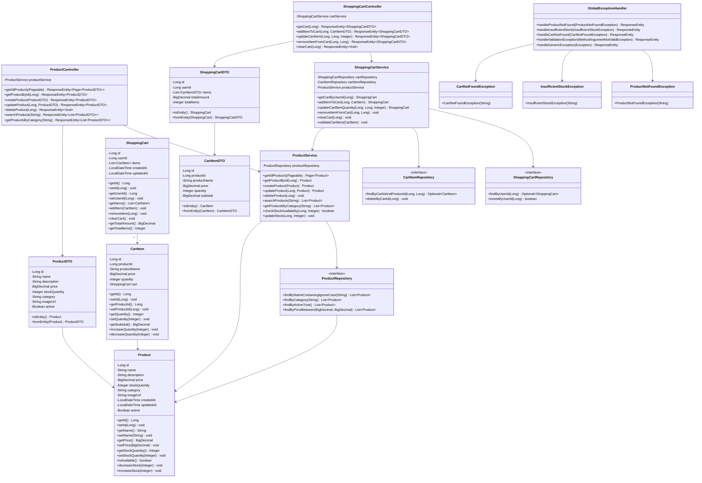

### 2.2 Entity Relationship Diagram

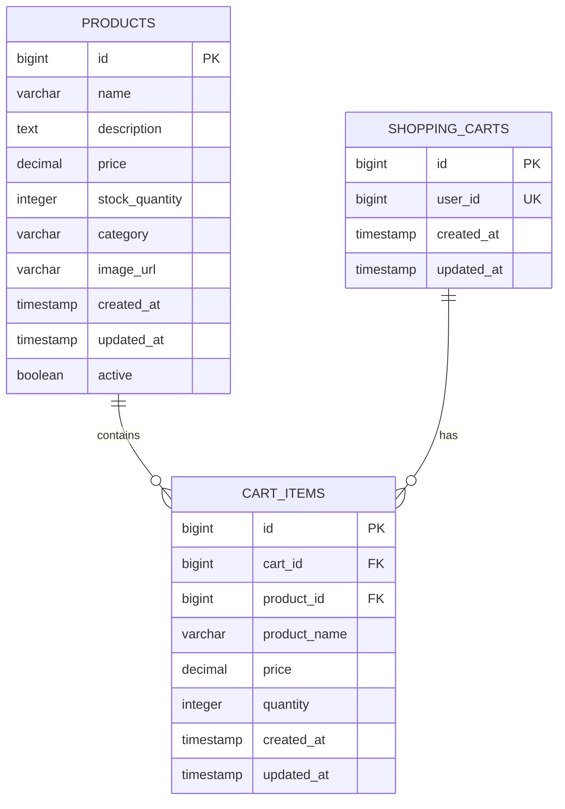

---

## 3. Sequence Diagrams

### 3.1 Create Product Flow

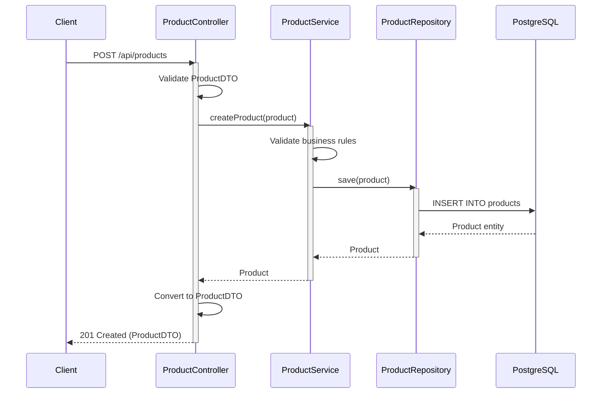

### 3.2 Get Product by ID Flow

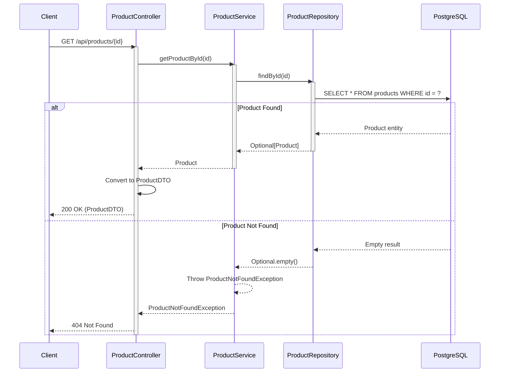

### 3.3 Update Product Flow

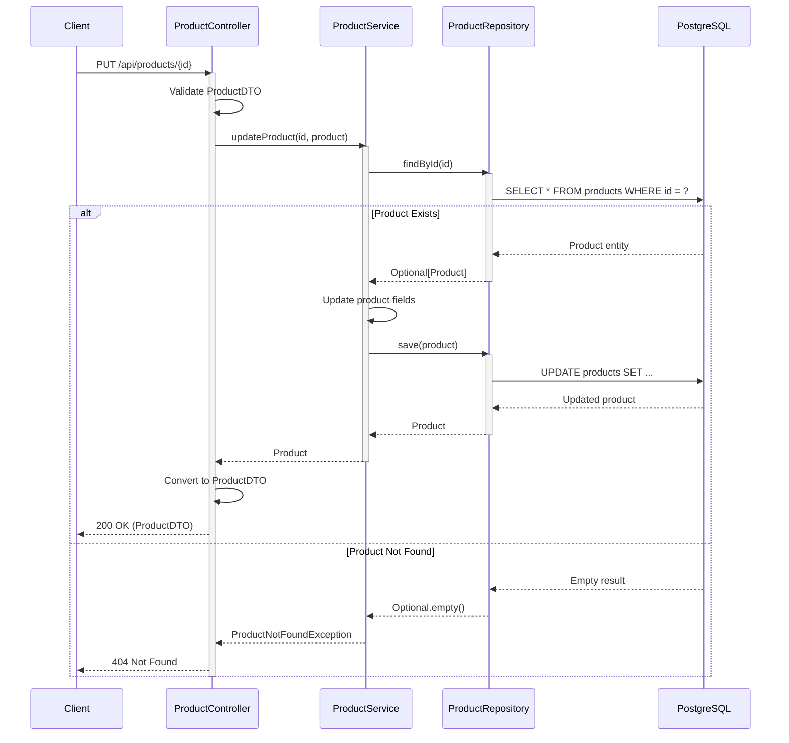

### 3.4 Delete Product Flow

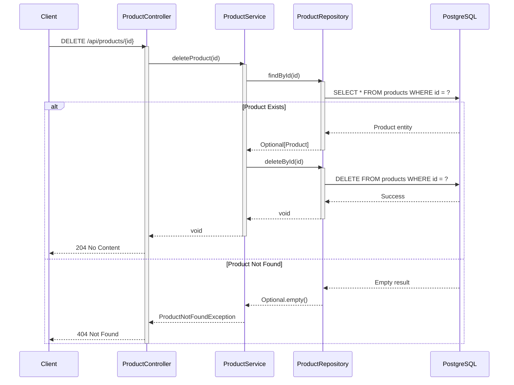

### 3.5 Search Products Flow

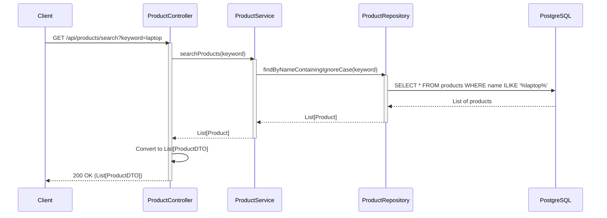

### 3.6 Get Products by Category Flow

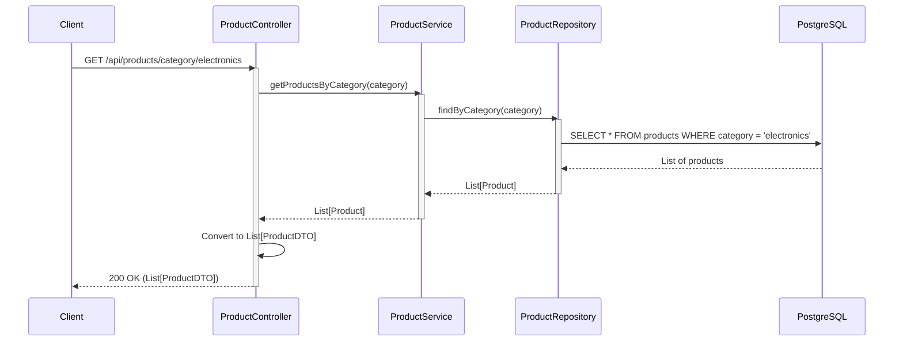

### 3.7 Update Stock Flow

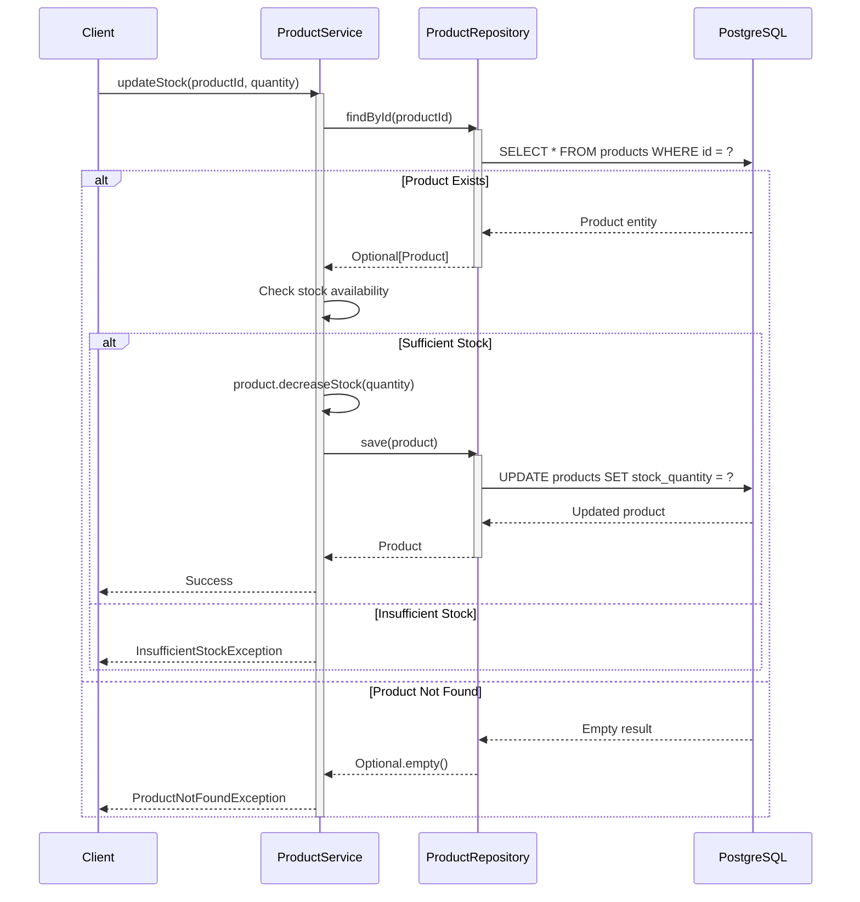

### 3.8 Add Item to Cart Flow

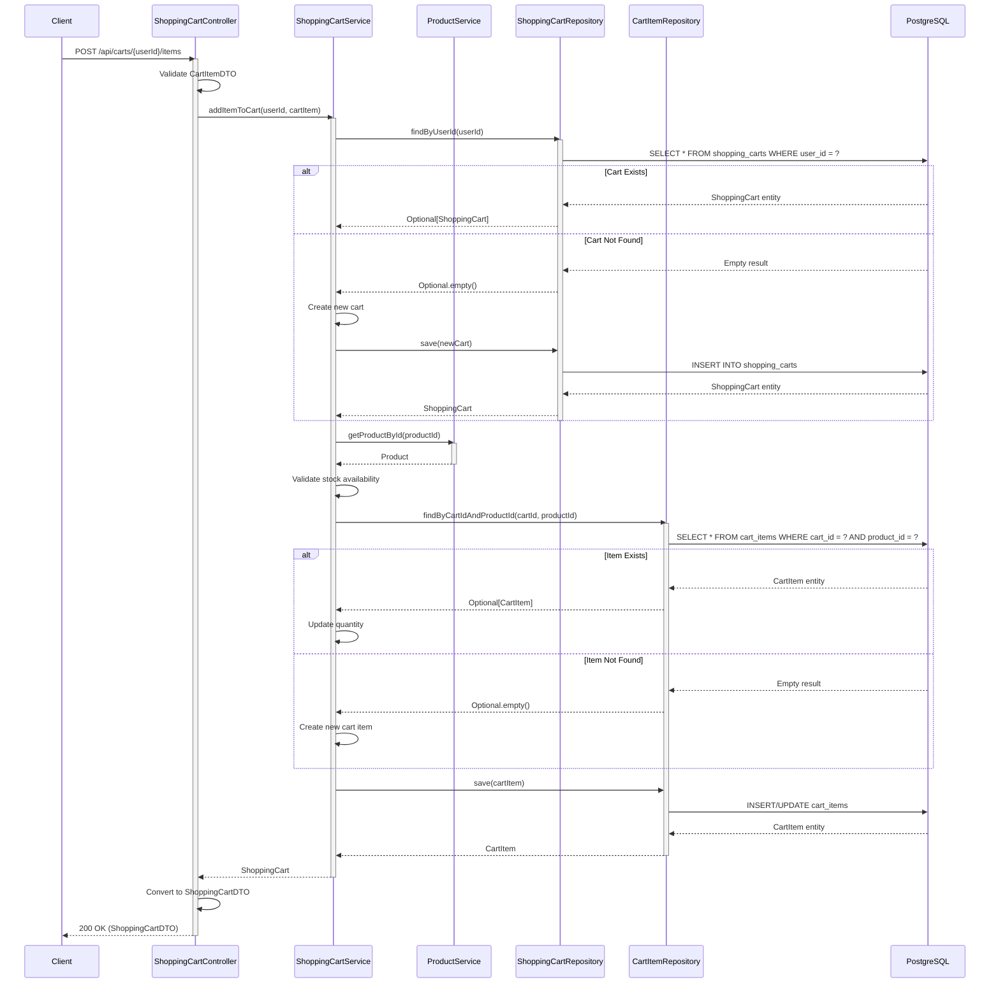

### 3.9 Update Cart Item Quantity Flow

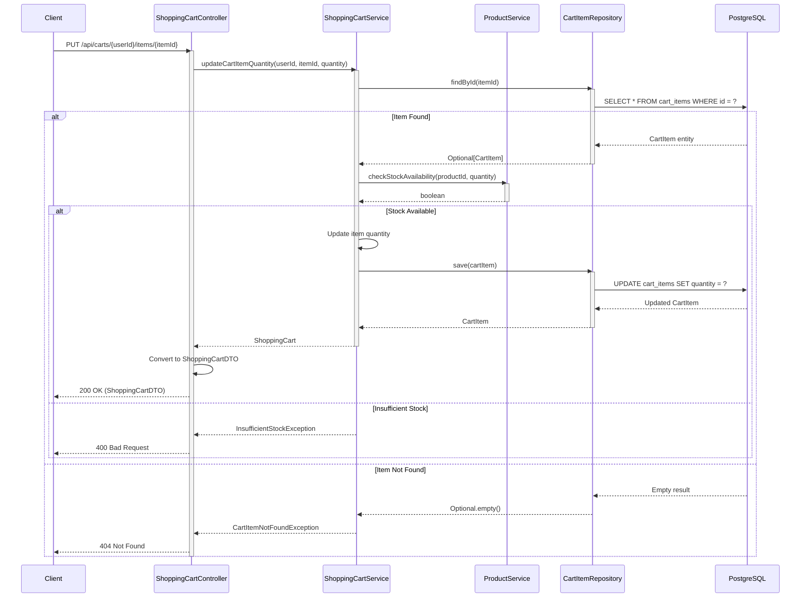

### 3.10 Remove Item from Cart Flow

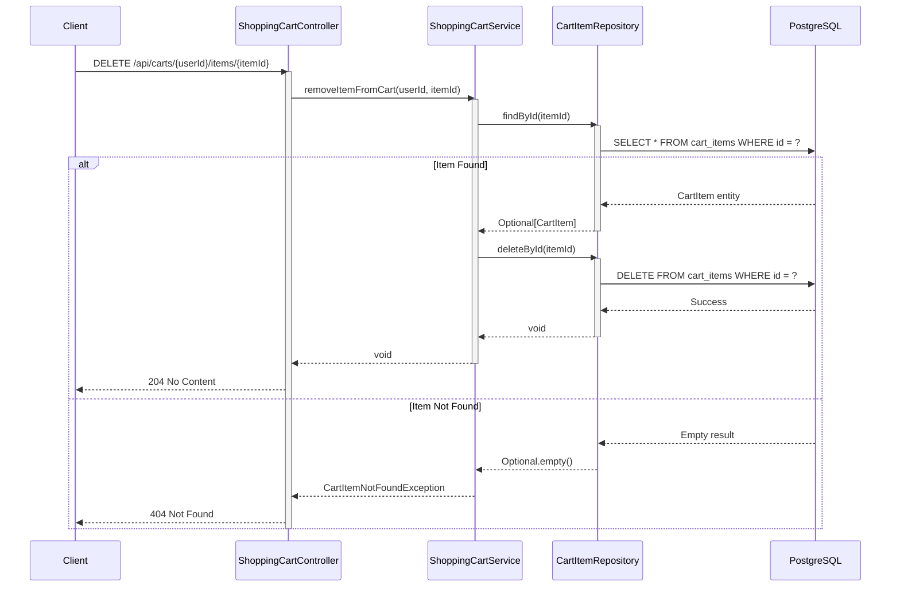

### 3.11 Clear Cart Flow

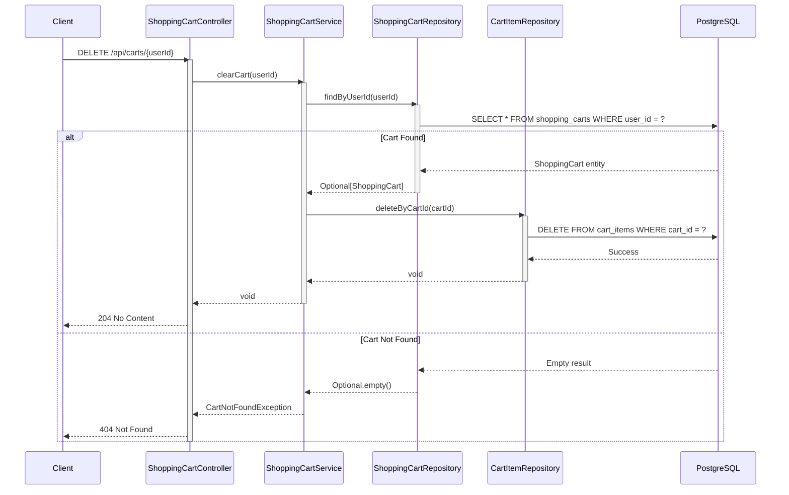

---

## 4. API Endpoints

### 4.1 Product Management Endpoints

#### Get All Products
```
GET /api/products
Query Parameters:
  - page: int (default: 0)
  - size: int (default: 20)
  - sort: string (default: "id,asc")

Response: 200 OK
{
  "content": [
    {
      "id": 1,
      "name": "Laptop",
      "description": "High-performance laptop",
      "price": 999.99,
      "stockQuantity": 50,
      "category": "Electronics",
      "imageUrl": "https://example.com/laptop.jpg",
      "active": true
    }
  ],
  "pageable": {...},
  "totalPages": 5,
  "totalElements": 100
}
```

#### Get Product by ID
```
GET /api/products/{id}

Response: 200 OK
{
  "id": 1,
  "name": "Laptop",
  "description": "High-performance laptop",
  "price": 999.99,
  "stockQuantity": 50,
  "category": "Electronics",
  "imageUrl": "https://example.com/laptop.jpg",
  "active": true
}

Error Response: 404 Not Found
{
  "timestamp": "2024-01-15T10:30:00",
  "status": 404,
  "error": "Not Found",
  "message": "Product not found with id: 1",
  "path": "/api/products/1"
}
```

#### Create Product
```
POST /api/products
Content-Type: application/json

Request Body:
{
  "name": "Laptop",
  "description": "High-performance laptop",
  "price": 999.99,
  "stockQuantity": 50,
  "category": "Electronics",
  "imageUrl": "https://example.com/laptop.jpg",
  "active": true
}

Response: 201 Created
{
  "id": 1,
  "name": "Laptop",
  "description": "High-performance laptop",
  "price": 999.99,
  "stockQuantity": 50,
  "category": "Electronics",
  "imageUrl": "https://example.com/laptop.jpg",
  "active": true
}

Error Response: 400 Bad Request
{
  "timestamp": "2024-01-15T10:30:00",
  "status": 400,
  "error": "Bad Request",
  "message": "Validation failed",
  "errors": [
    {
      "field": "name",
      "message": "Product name is required"
    },
    {
      "field": "price",
      "message": "Price must be greater than 0"
    }
  ]
}
```

#### Update Product
```
PUT /api/products/{id}
Content-Type: application/json

Request Body:
{
  "name": "Updated Laptop",
  "description": "Updated description",
  "price": 1099.99,
  "stockQuantity": 45,
  "category": "Electronics",
  "imageUrl": "https://example.com/laptop-new.jpg",
  "active": true
}

Response: 200 OK
{
  "id": 1,
  "name": "Updated Laptop",
  "description": "Updated description",
  "price": 1099.99,
  "stockQuantity": 45,
  "category": "Electronics",
  "imageUrl": "https://example.com/laptop-new.jpg",
  "active": true
}

Error Response: 404 Not Found
```

#### Delete Product
```
DELETE /api/products/{id}

Response: 204 No Content

Error Response: 404 Not Found
```

#### Search Products
```
GET /api/products/search?keyword=laptop

Response: 200 OK
[
  {
    "id": 1,
    "name": "Laptop",
    "description": "High-performance laptop",
    "price": 999.99,
    "stockQuantity": 50,
    "category": "Electronics",
    "imageUrl": "https://example.com/laptop.jpg",
    "active": true
  }
]
```

#### Get Products by Category
```
GET /api/products/category/{category}

Response: 200 OK
[
  {
    "id": 1,
    "name": "Laptop",
    "description": "High-performance laptop",
    "price": 999.99,
    "stockQuantity": 50,
    "category": "Electronics",
    "imageUrl": "https://example.com/laptop.jpg",
    "active": true
  }
]
```

### 4.2 Shopping Cart Management Endpoints

#### Get Shopping Cart
```
GET /api/carts/{userId}

Response: 200 OK
{
  "id": 1,
  "userId": 123,
  "items": [
    {
      "id": 1,
      "productId": 10,
      "productName": "Laptop",
      "price": 999.99,
      "quantity": 2,
      "subtotal": 1999.98
    },
    {
      "id": 2,
      "productId": 20,
      "productName": "Mouse",
      "price": 29.99,
      "quantity": 1,
      "subtotal": 29.99
    }
  ],
  "totalAmount": 2029.97,
  "totalItems": 3
}

Error Response: 404 Not Found
{
  "timestamp": "2024-01-15T10:30:00",
  "status": 404,
  "error": "Not Found",
  "message": "Shopping cart not found for user: 123",
  "path": "/api/carts/123"
}
```

#### Add Item to Cart
```
POST /api/carts/{userId}/items
Content-Type: application/json

Request Body:
{
  "productId": 10,
  "quantity": 2
}

Response: 200 OK
{
  "id": 1,
  "userId": 123,
  "items": [
    {
      "id": 1,
      "productId": 10,
      "productName": "Laptop",
      "price": 999.99,
      "quantity": 2,
      "subtotal": 1999.98
    }
  ],
  "totalAmount": 1999.98,
  "totalItems": 2
}

Error Response: 400 Bad Request (Insufficient Stock)
{
  "timestamp": "2024-01-15T10:30:00",
  "status": 400,
  "error": "Bad Request",
  "message": "Insufficient stock for product: Laptop. Available: 1, Requested: 2",
  "path": "/api/carts/123/items"
}

Error Response: 404 Not Found (Product Not Found)
{
  "timestamp": "2024-01-15T10:30:00",
  "status": 404,
  "error": "Not Found",
  "message": "Product not found with id: 10",
  "path": "/api/carts/123/items"
}
```

#### Update Cart Item Quantity
```
PUT /api/carts/{userId}/items/{itemId}
Content-Type: application/json

Request Body:
{
  "quantity": 3
}

Response: 200 OK
{
  "id": 1,
  "userId": 123,
  "items": [
    {
      "id": 1,
      "productId": 10,
      "productName": "Laptop",
      "price": 999.99,
      "quantity": 3,
      "subtotal": 2999.97
    }
  ],
  "totalAmount": 2999.97,
  "totalItems": 3
}

Error Response: 404 Not Found
{
  "timestamp": "2024-01-15T10:30:00",
  "status": 404,
  "error": "Not Found",
  "message": "Cart item not found with id: 1",
  "path": "/api/carts/123/items/1"
}
```

#### Remove Item from Cart
```
DELETE /api/carts/{userId}/items/{itemId}

Response: 204 No Content

Error Response: 404 Not Found
{
  "timestamp": "2024-01-15T10:30:00",
  "status": 404,
  "error": "Not Found",
  "message": "Cart item not found with id: 1",
  "path": "/api/carts/123/items/1"
}
```

#### Clear Cart
```
DELETE /api/carts/{userId}

Response: 204 No Content

Error Response: 404 Not Found
{
  "timestamp": "2024-01-15T10:30:00",
  "status": 404,
  "error": "Not Found",
  "message": "Shopping cart not found for user: 123",
  "path": "/api/carts/123"
}
```

---

## 5. Database Schema

### 5.1 Products Table

```sql
CREATE TABLE products (
    id BIGSERIAL PRIMARY KEY,
    name VARCHAR(255) NOT NULL,
    description TEXT,
    price DECIMAL(10, 2) NOT NULL CHECK (price >= 0),
    stock_quantity INTEGER NOT NULL DEFAULT 0 CHECK (stock_quantity >= 0),
    category VARCHAR(100) NOT NULL,
    image_url VARCHAR(500),
    created_at TIMESTAMP NOT NULL DEFAULT CURRENT_TIMESTAMP,
    updated_at TIMESTAMP NOT NULL DEFAULT CURRENT_TIMESTAMP,
    active BOOLEAN NOT NULL DEFAULT true,
    CONSTRAINT uk_product_name UNIQUE (name)
);

CREATE INDEX idx_products_category ON products(category);
CREATE INDEX idx_products_active ON products(active);
CREATE INDEX idx_products_name ON products(name);
```

### 5.2 Shopping Carts Table

```sql
CREATE TABLE shopping_carts (
    id BIGSERIAL PRIMARY KEY,
    user_id BIGINT NOT NULL,
    created_at TIMESTAMP NOT NULL DEFAULT CURRENT_TIMESTAMP,
    updated_at TIMESTAMP NOT NULL DEFAULT CURRENT_TIMESTAMP,
    CONSTRAINT uk_shopping_cart_user UNIQUE (user_id)
);

CREATE INDEX idx_shopping_carts_user_id ON shopping_carts(user_id);
```

### 5.3 Cart Items Table

```sql
CREATE TABLE cart_items (
    id BIGSERIAL PRIMARY KEY,
    cart_id BIGINT NOT NULL,
    product_id BIGINT NOT NULL,
    product_name VARCHAR(255) NOT NULL,
    price DECIMAL(10, 2) NOT NULL CHECK (price >= 0),
    quantity INTEGER NOT NULL CHECK (quantity > 0),
    created_at TIMESTAMP NOT NULL DEFAULT CURRENT_TIMESTAMP,
    updated_at TIMESTAMP NOT NULL DEFAULT CURRENT_TIMESTAMP,
    CONSTRAINT fk_cart_items_cart FOREIGN KEY (cart_id) REFERENCES shopping_carts(id) ON DELETE CASCADE,
    CONSTRAINT fk_cart_items_product FOREIGN KEY (product_id) REFERENCES products(id) ON DELETE CASCADE,
    CONSTRAINT uk_cart_product UNIQUE (cart_id, product_id)
);

CREATE INDEX idx_cart_items_cart_id ON cart_items(cart_id);
CREATE INDEX idx_cart_items_product_id ON cart_items(product_id);
```

### 5.4 Database Triggers

```sql
-- Trigger to update updated_at timestamp for products
CREATE OR REPLACE FUNCTION update_products_updated_at()
RETURNS TRIGGER AS $$
BEGIN
    NEW.updated_at = CURRENT_TIMESTAMP;
    RETURN NEW;
END;
$$ LANGUAGE plpgsql;

CREATE TRIGGER trigger_update_products_updated_at
BEFORE UPDATE ON products
FOR EACH ROW
EXECUTE FUNCTION update_products_updated_at();

-- Trigger to update updated_at timestamp for shopping_carts
CREATE OR REPLACE FUNCTION update_shopping_carts_updated_at()
RETURNS TRIGGER AS $$
BEGIN
    NEW.updated_at = CURRENT_TIMESTAMP;
    RETURN NEW;
END;
$$ LANGUAGE plpgsql;

CREATE TRIGGER trigger_update_shopping_carts_updated_at
BEFORE UPDATE ON shopping_carts
FOR EACH ROW
EXECUTE FUNCTION update_shopping_carts_updated_at();

-- Trigger to update updated_at timestamp for cart_items
CREATE OR REPLACE FUNCTION update_cart_items_updated_at()
RETURNS TRIGGER AS $$
BEGIN
    NEW.updated_at = CURRENT_TIMESTAMP;
    RETURN NEW;
END;
$$ LANGUAGE plpgsql;

CREATE TRIGGER trigger_update_cart_items_updated_at
BEFORE UPDATE ON cart_items
FOR EACH ROW
EXECUTE FUNCTION update_cart_items_updated_at();
```

---

## 6. Configuration

### 6.1 Application Properties

```properties
# Application Configuration
spring.application.name=ecommerce-product-service
server.port=8080

# Database Configuration
spring.datasource.url=jdbc:postgresql://localhost:5432/ecommerce_db
spring.datasource.username=${DB_USERNAME:postgres}
spring.datasource.password=${DB_PASSWORD:postgres}
spring.datasource.driver-class-name=org.postgresql.Driver

# JPA Configuration
spring.jpa.hibernate.ddl-auto=validate
spring.jpa.show-sql=true
spring.jpa.properties.hibernate.format_sql=true
spring.jpa.properties.hibernate.dialect=org.hibernate.dialect.PostgreSQLDialect
spring.jpa.properties.hibernate.jdbc.batch_size=20
spring.jpa.properties.hibernate.order_inserts=true
spring.jpa.properties.hibernate.order_updates=true

# Flyway Configuration
spring.flyway.enabled=true
spring.flyway.locations=classpath:db/migration
spring.flyway.baseline-on-migrate=true

# Logging Configuration
logging.level.root=INFO
logging.level.com.ecommerce.product=DEBUG
logging.level.org.hibernate.SQL=DEBUG
logging.level.org.hibernate.type.descriptor.sql.BasicBinder=TRACE

# Pagination Configuration
spring.data.web.pageable.default-page-size=20
spring.data.web.pageable.max-page-size=100

# Jackson Configuration
spring.jackson.serialization.write-dates-as-timestamps=false
spring.jackson.time-zone=UTC

# Error Handling
server.error.include-message=always
server.error.include-binding-errors=always
server.error.include-stacktrace=on_param
server.error.include-exception=false
```

### 6.2 Maven Dependencies (pom.xml)

```xml
<?xml version="1.0" encoding="UTF-8"?>
<project xmlns="http://maven.apache.org/POM/4.0.0"
         xmlns:xsi="http://www.w3.org/2001/XMLSchema-instance"
         xsi:schemaLocation="http://maven.apache.org/POM/4.0.0
         https://maven.apache.org/xsd/maven-4.0.0.xsd">
    <modelVersion>4.0.0</modelVersion>
    
    <parent>
        <groupId>org.springframework.boot</groupId>
        <artifactId>spring-boot-starter-parent</artifactId>
        <version>3.2.0</version>
        <relativePath/>
    </parent>
    
    <groupId>com.ecommerce</groupId>
    <artifactId>product-service</artifactId>
    <version>1.0.0</version>
    <name>E-commerce Product Service</name>
    <description>Product Management Service for E-commerce Platform</description>
    
    <properties>
        <java.version>21</java.version>
    </properties>
    
    <dependencies>
        <!-- Spring Boot Starters -->
        <dependency>
            <groupId>org.springframework.boot</groupId>
            <artifactId>spring-boot-starter-web</artifactId>
        </dependency>
        
        <dependency>
            <groupId>org.springframework.boot</groupId>
            <artifactId>spring-boot-starter-data-jpa</artifactId>
        </dependency>
        
        <dependency>
            <groupId>org.springframework.boot</groupId>
            <artifactId>spring-boot-starter-validation</artifactId>
        </dependency>
        
        <!-- Database -->
        <dependency>
            <groupId>org.postgresql</groupId>
            <artifactId>postgresql</artifactId>
            <scope>runtime</scope>
        </dependency>
        
        <!-- Flyway for Database Migration -->
        <dependency>
            <groupId>org.flywaydb</groupId>
            <artifactId>flyway-core</artifactId>
        </dependency>
        
        <!-- Lombok -->
        <dependency>
            <groupId>org.projectlombok</groupId>
            <artifactId>lombok</artifactId>
            <optional>true</optional>
        </dependency>
        
        <!-- Testing -->
        <dependency>
            <groupId>org.springframework.boot</groupId>
            <artifactId>spring-boot-starter-test</artifactId>
            <scope>test</scope>
        </dependency>
        
        <dependency>
            <groupId>com.h2database</groupId>
            <artifactId>h2</artifactId>
            <scope>test</scope>
        </dependency>
    </dependencies>
    
    <build>
        <plugins>
            <plugin>
                <groupId>org.springframework.boot</groupId>
                <artifactId>spring-boot-maven-plugin</artifactId>
                <configuration>
                    <excludes>
                        <exclude>
                            <groupId>org.projectlombok</groupId>
                            <artifactId>lombok</artifactId>
                        </exclude>
                    </excludes>
                </configuration>
            </plugin>
        </plugins>
    </build>
</project>
```

---

## 7. Design Patterns

### 7.1 Layered Architecture
- **Controller Layer**: Handles HTTP requests and responses
- **Service Layer**: Contains business logic
- **Repository Layer**: Manages data persistence
- **Model Layer**: Defines domain entities and DTOs

### 7.2 Repository Pattern
- Abstracts data access logic
- Provides a collection-like interface for accessing domain objects
- Implemented using Spring Data JPA

### 7.3 DTO Pattern
- Separates internal domain models from external API contracts
- Prevents over-exposure of entity details
- Facilitates API versioning

### 7.4 Exception Handling Pattern
- Centralized exception handling using `@ControllerAdvice`
- Custom exceptions for domain-specific errors
- Consistent error response format

### 7.5 Builder Pattern
- Used with Lombok's `@Builder` annotation
- Facilitates object creation with many optional parameters
- Improves code readability

### 7.6 Aggregate Pattern
- ShoppingCart acts as an aggregate root
- CartItems are managed through the ShoppingCart aggregate
- Ensures consistency boundaries and transactional integrity
- Encapsulates business rules for cart operations

---

## 8. Key Features

### 8.1 Product Management
- **CRUD Operations**: Complete create, read, update, delete functionality
- **Search**: Full-text search by product name
- **Filtering**: Filter products by category
- **Pagination**: Support for paginated product listings
- **Stock Management**: Track and update product inventory
- **Validation**: Input validation for all product operations

### 8.2 Shopping Cart Management
- **Cart Creation**: Automatic cart creation for new users
- **Add to Cart**: Add products with quantity validation
- **Update Quantity**: Modify item quantities with stock checking
- **Remove Items**: Remove individual items from cart
- **Clear Cart**: Remove all items from cart
- **Cart Totals**: Automatic calculation of subtotals and total amount
- **Stock Validation**: Real-time stock availability checking
- **Duplicate Prevention**: Merge quantities for duplicate products

### 8.3 Data Integrity
- **Constraints**: Database-level constraints for data validation
- **Transactions**: ACID compliance for all operations
- **Cascading**: Proper cascade rules for related entities
- **Indexing**: Optimized queries with strategic indexes

### 8.4 Error Handling
- **Custom Exceptions**: Domain-specific exception types
- **Global Handler**: Centralized exception handling
- **Validation Errors**: Detailed validation error messages
- **HTTP Status Codes**: Appropriate status codes for different scenarios

### 8.5 Performance Optimization
- **Connection Pooling**: Efficient database connection management
- **Batch Operations**: Hibernate batch processing for bulk operations
- **Lazy Loading**: Optimized entity loading strategies
- **Caching**: Query result caching where appropriate

---

## 9. Security Considerations

### 9.1 Input Validation
- Bean Validation (JSR-380) annotations
- Custom validators for complex business rules
- SQL injection prevention through parameterized queries

### 9.2 Data Protection
- Sensitive data encryption at rest
- Secure password storage (when user management is added)
- HTTPS enforcement for production

### 9.3 Authentication & Authorization
- JWT-based authentication (to be implemented)
- Role-based access control (to be implemented)
- API rate limiting (to be implemented)

---

## 10. Testing Strategy

### 10.1 Unit Tests
- Service layer business logic testing
- Repository layer data access testing
- Mock external dependencies
- Target: 80%+ code coverage

### 10.2 Integration Tests
- Controller endpoint testing
- Database integration testing
- End-to-end workflow testing
- Use H2 in-memory database for tests

### 10.3 Test Data
- Use test fixtures for consistent test data
- Implement data builders for complex objects
- Clean up test data after each test

---

## 11. Deployment

### 11.1 Environment Configuration
- **Development**: Local PostgreSQL, debug logging
- **Staging**: Cloud-hosted PostgreSQL, info logging
- **Production**: Managed PostgreSQL, error logging only

### 11.2 Database Migration
- Flyway for version-controlled schema changes
- Rollback scripts for each migration
- Automated migration on application startup

### 11.3 Monitoring
- Application health checks
- Database connection pool monitoring
- API response time tracking
- Error rate monitoring

---

## 12. Future Enhancements

### 12.1 Planned Features
- User authentication and authorization
- Product reviews and ratings
- Inventory management system
- Order processing integration
- Payment gateway integration
- Email notifications
- Product recommendations
- Advanced search with filters
- Wishlist functionality
- Product variants (size, color, etc.)

### 12.2 Technical Improvements
- Redis caching layer
- Elasticsearch for advanced search
- Message queue for async operations
- Microservices architecture migration
- GraphQL API support
- API versioning
- Rate limiting
- API documentation with Swagger/OpenAPI

---

## 13. Appendix

### 13.1 Glossary
- **DTO**: Data Transfer Object
- **JPA**: Java Persistence API
- **CRUD**: Create, Read, Update, Delete
- **REST**: Representational State Transfer
- **API**: Application Programming Interface
- **Aggregate**: A cluster of domain objects treated as a single unit
- **Aggregate Root**: The main entity through which all operations on the aggregate are performed

### 13.2 References
- Spring Boot Documentation: https://spring.io/projects/spring-boot
- Spring Data JPA Documentation: https://spring.io/projects/spring-data-jpa
- PostgreSQL Documentation: https://www.postgresql.org/docs/
- Domain-Driven Design: Eric Evans
- RESTful API Design Best Practices

### 13.3 Contact Information
- **Development Team**: dev-team@ecommerce.com
- **Project Manager**: pm@ecommerce.com
- **Technical Lead**: tech-lead@ecommerce.com

---

**Document End**