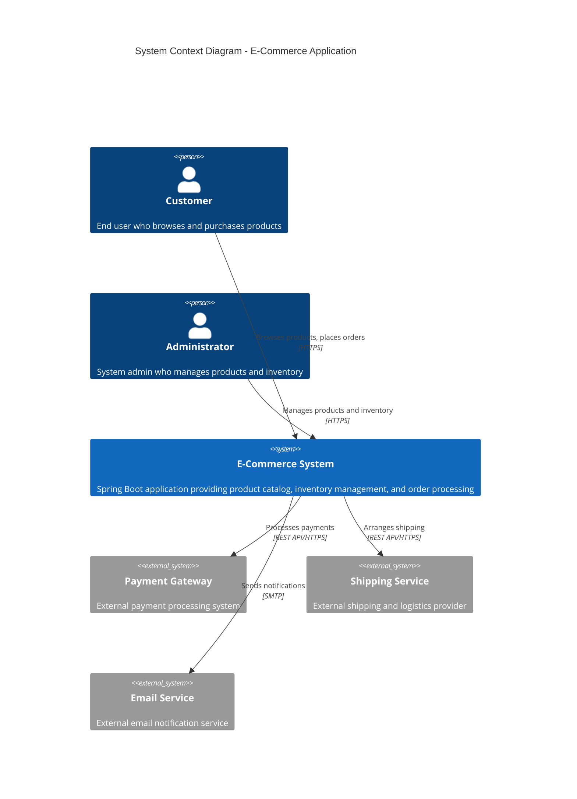
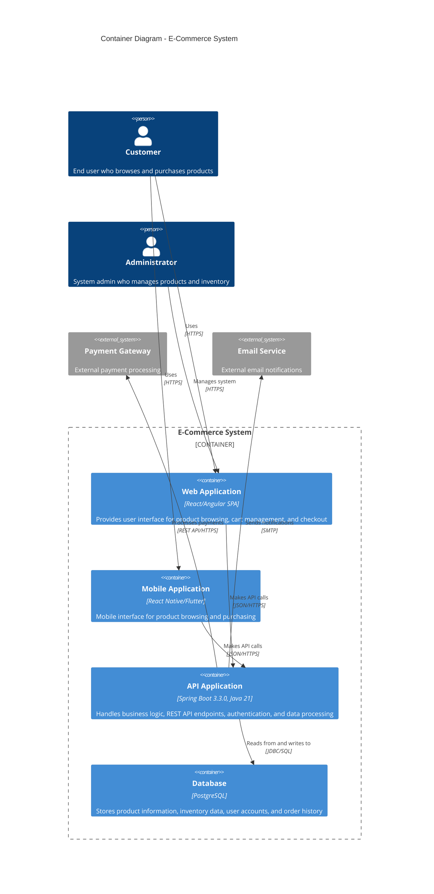

# E-Commerce Spring Boot Application - High Level Design

## System Overview

This document contains the High Level Design (HLD) diagrams for the E-Commerce Spring Boot Application. The system is built using Spring Boot 3.3.0 with Java 21 and PostgreSQL database, following a layered monolith architecture.

### Key Features
- Product catalog management
- Inventory tracking
- Category-based organization
- Search and filtering capabilities
- Full CRUD operations

## Architecture Diagrams

### 1. System Context Diagram

The System Context diagram shows the E-Commerce system and how it fits into the wider environment, including users and external systems.

### 2. Container Diagram

The Container diagram zooms into the E-Commerce system to show the high-level technical building blocks and how they interact.

## Data Flow Summary

The system follows these primary data flows:

1. **User Interaction Flow**:
   - User → Web/Mobile App (HTTPS)
   - Web/Mobile App → API (JSON/REST)
   - API → Database (JDBC)
   - Database → API (Result Sets)
   - API → Web/Mobile App (JSON Response)
   - Web/Mobile App → User (HTML/UI)

2. **External Integration Flow**:
   - API → Payment Gateway (REST API/HTTPS)
   - API → Email Service (SMTP)
   - API → Shipping Service (REST API/HTTPS)

## Technology Stack

- **Backend**: Spring Boot 3.3.0, Java 21
- **Database**: PostgreSQL
- **Architecture**: Layered Monolith
- **API**: RESTful services
- **Frontend**: Web and Mobile applications
- **Communication**: HTTPS, JSON, JDBC

## Key Components

### API Application (Spring Boot)
- **Controllers**: Handle REST API endpoints
- **Services**: Implement business logic
- **Repositories**: Data access layer
- **Entities**: JPA entities for database mapping
- **Security**: Authentication and authorization
- **Configuration**: Application configuration and beans

### Database (PostgreSQL)
- **Products Table**: Product catalog information
- **Categories Table**: Product categorization
- **Inventory Table**: Stock levels and tracking
- **Users Table**: Customer and admin accounts
- **Orders Table**: Order history and details

### Client Applications
- **Web Application**: Browser-based interface
- **Mobile Application**: Native mobile interface
- **Admin Panel**: Administrative interface for system management