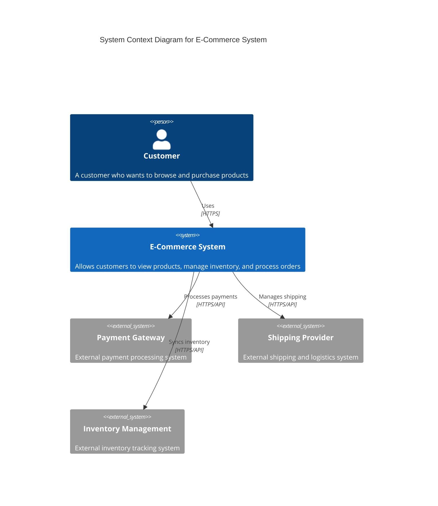
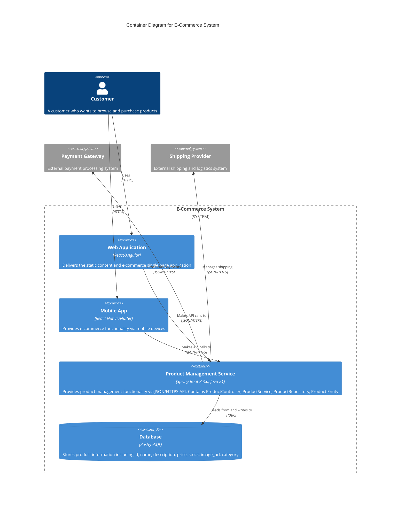

# E-Commerce System - High Level Design

## System Overview

This document contains the High Level Design (HLD) for the E-Commerce Spring Boot Application. The system follows a layered microservice architecture pattern using Spring Boot 3.3.0, PostgreSQL, and Java 21.

## Architecture Diagrams

### 1. System Context Diagram

The following diagram shows the high-level view of the E-Commerce System and its interactions with users and external systems:

### 2. Container Diagram

The following diagram shows the internal structure of the E-Commerce System, including its containers and their interactions:

## Data Flow Description

The system follows these primary data flows:

1. **User Interaction Flow:**
   - User interacts with Web/Mobile App via HTTPS
   - Web/Mobile App renders UI and handles user interactions

2. **API Communication Flow:**
   - Web/Mobile App sends requests to Product Management Service via JSON/REST over HTTPS
   - Product Management Service processes business logic through ProductService
   - ProductController handles REST API endpoints

3. **Data Persistence Flow:**
   - Product Management Service connects to PostgreSQL Database via JDBC
   - ProductRepository handles CRUD operations
   - Database returns Result Sets to Product Management Service

4. **Response Flow:**
   - Product Management Service sends JSON responses back to Web/Mobile App
   - Web/Mobile App processes responses and updates UI
   - User sees updated content through UI rendering

## Technical Components

### Product Management Service Components:
- **ProductController**: Handles REST API endpoints
- **ProductService**: Contains business logic
- **ProductRepository**: Manages data access layer
- **Product Entity**: Represents product data model

### Database Schema:
- **Products Table Fields:**
  - id (Primary Key)
  - name
  - description
  - price
  - stock
  - image_url
  - category

### Key Features:
- CRUD operations for products
- Product search and filtering
- Data validation
- RESTful API design
- Microservice architecture
- Layered application structure

## Technology Stack

- **Backend**: Spring Boot 3.3.0, Java 21
- **Database**: PostgreSQL
- **Architecture**: Layered Microservice
- **Communication**: REST API, JSON, HTTPS
- **Data Access**: JDBC, Spring Data JPA