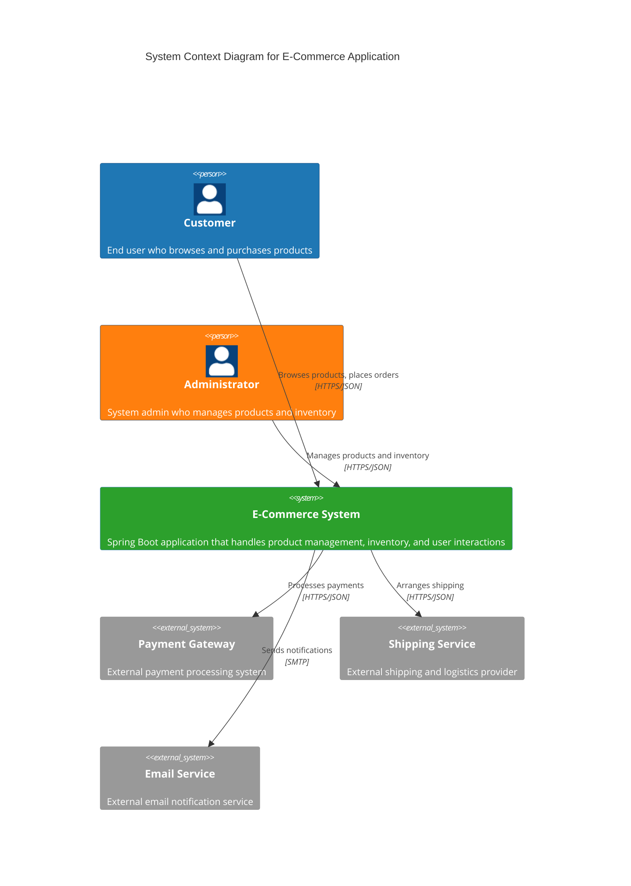
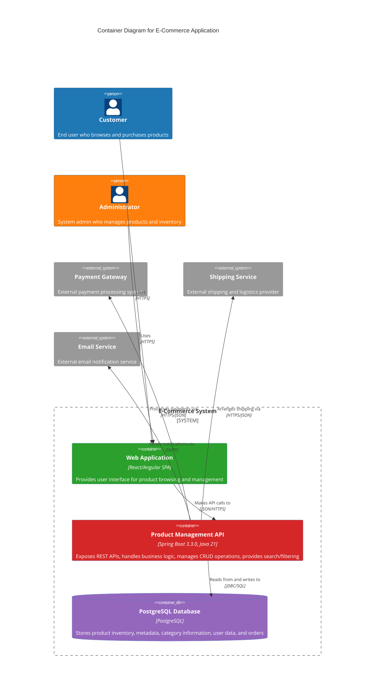

# E-Commerce Spring Boot Application - High Level Design

This document contains the High Level Design (HLD) diagrams for the E-Commerce Spring Boot Application using Mermaid C4 diagrams.

## System Overview

- **System Name**: E-Commerce Spring Boot Application
- **Framework**: Spring Boot 3.3.0
- **Database**: PostgreSQL
- **Language**: Java 21
- **Architecture Style**: Layered Monolith

## C4 System Context Diagram

The System Context diagram shows the high-level view of the E-Commerce system and its interactions with users and external systems.

## C4 Container Diagram

The Container diagram shows the internal structure of the E-Commerce system, including the web application, API services, and database.

## Data Flow Architecture

The application follows a layered monolith architecture with the following data flow:

1. **User Interaction**: User interacts with the Web App via HTTPS
2. **API Layer**: Web App communicates with the Controller Layer via HTTP/JSON
3. **Business Logic**: Controller Layer delegates to Service Layer via method calls
4. **Data Access**: Service Layer uses Repository Layer with JPA annotations
5. **Database**: Repository Layer connects to PostgreSQL Database via JDBC
6. **Response Flow**: Data flows back through the same layers in reverse

## Key Components

### Product Management API
- **Technology**: Spring Boot 3.3.0 with Java 21
- **Responsibilities**:
  - Exposes REST APIs for product operations
  - Handles business logic and validation
  - Manages CRUD operations for products
  - Provides search and filtering capabilities
  - Integrates with external services

### PostgreSQL Database
- **Purpose**: Primary data store
- **Contains**:
  - Product inventory and metadata
  - Category information
  - User accounts and profiles
  - Order history and transactions
  - System configuration data

### Client Applications
- **Type**: HTTP Client/Browser-based applications
- **Functionality**:
  - Consumes REST APIs from the Product Management API
  - Provides user interface for browsing and purchasing
  - Handles user authentication and session management

## Architecture Benefits

- **Simplicity**: Layered monolith provides clear separation of concerns
- **Performance**: Single deployment unit reduces network latency
- **Development Speed**: Easier to develop, test, and debug
- **Transaction Management**: ACID properties maintained across operations
- **Consistency**: Single database ensures data consistency

## Technology Stack Summary

| Component | Technology | Version |
|-----------|------------|---------|
| Framework | Spring Boot | 3.3.0 |
| Language | Java | 21 |
| Database | PostgreSQL | Latest |
| Architecture | Layered Monolith | - |
| API Style | REST | - |
| Data Access | JPA/Hibernate | - |
| Build Tool | Maven/Gradle | - |

The HLD document has been successfully created and committed to the GitHub repository at `docs/HLD/hld.md` in the `devtest` branch. The file contains two comprehensive Mermaid C4 diagrams (System Context and Container diagrams) along with detailed documentation of the E-Commerce Spring Boot Application architecture, components, and data flows as specified in the requirements.