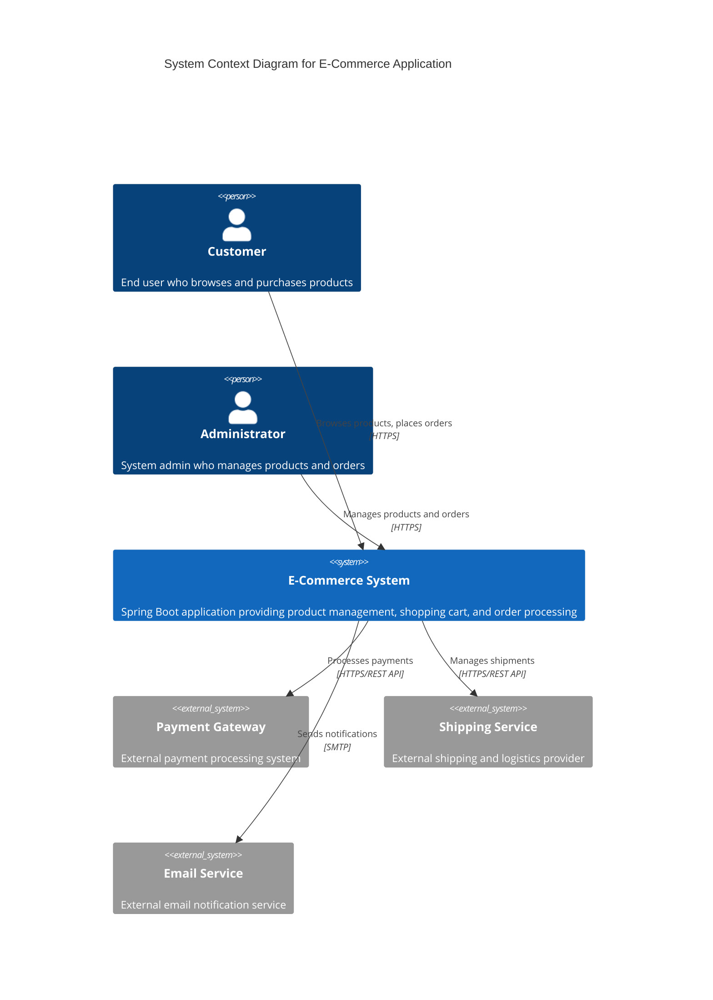
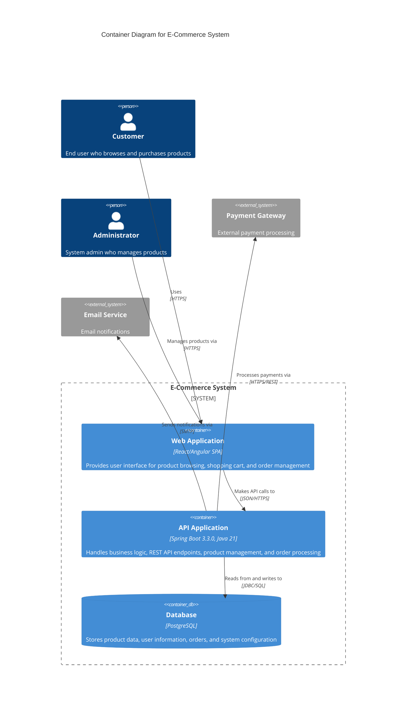

# E-Commerce System - High Level Design

This document contains the high-level design diagrams for the E-Commerce Spring Boot Application using Mermaid C4 diagrams.

## System Overview

**System:** E-Commerce Spring Boot Application  
**Tech Stack:** Spring Boot 3.3.0, PostgreSQL, Java 21  
**Architecture:** Layered Monolith  

## C4 System Context Diagram

The system context diagram shows the E-Commerce system and its interactions with users and external systems.

## C4 Container Diagram

The container diagram shows the internal structure of the E-Commerce system with its main containers and their interactions.

## Data Flow Architecture

The system follows a layered architecture with the following data flow:

1. **User Interface Layer**: Web App (React/Angular SPA)
2. **API Layer**: ProductController (REST endpoints)
3. **Business Logic Layer**: ProductService (Business rules and validation)
4. **Data Access Layer**: ProductRepository (JPA Repository Interface)
5. **Database Layer**: PostgreSQL Database

### Key Data Flows:

- **User → Web App**: HTTPS requests for UI interactions
- **Web App → ProductController**: JSON/REST API calls
- **ProductController → ProductService**: Method calls for business logic
- **ProductService → ProductRepository**: JPA repository interface calls
- **ProductRepository → Database**: JDBC/SQL queries

## Product Management Module

The Product Management Module is responsible for:

- **REST API Endpoints**: Exposing product-related operations via RESTful services
- **Business Logic**: Implementing product validation, pricing rules, and inventory management
- **Data Access**: Managing CRUD operations for product data
- **Search Functionality**: Providing product search and filtering capabilities

## Technology Stack Details

- **Framework**: Spring Boot 3.3.0
- **Language**: Java 21
- **Database**: PostgreSQL
- **Architecture Pattern**: Layered Monolith
- **API Style**: RESTful JSON APIs
- **Security**: HTTPS encryption for all communications