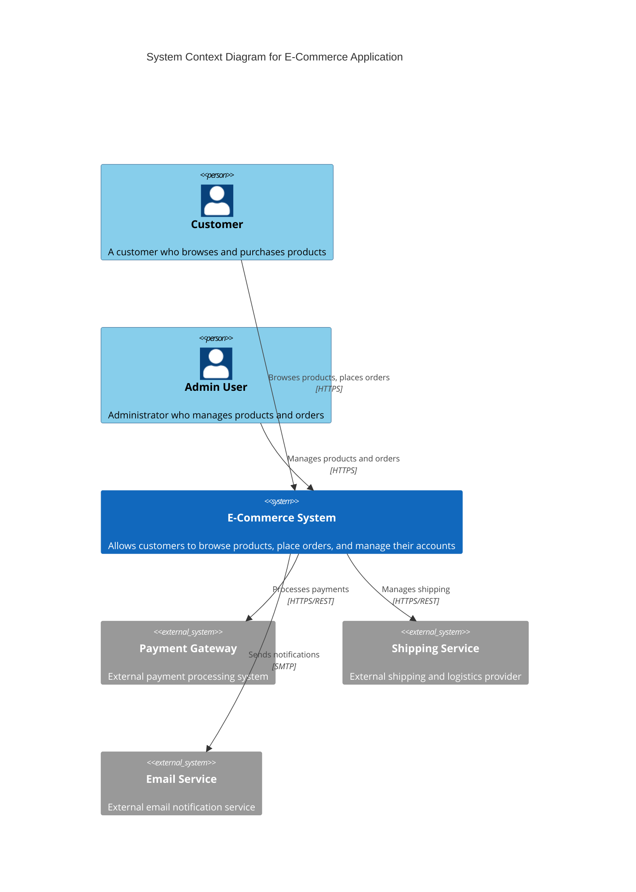
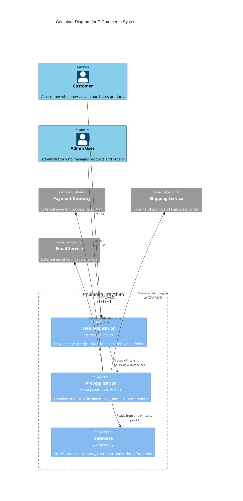

# E-Commerce System - High Level Design

This document contains the high-level design diagrams for the E-Commerce Spring Boot Application.

## System Overview

- **Name**: E-Commerce Spring Boot Application
- **Tech Stack**: Spring Boot 3.3.0, PostgreSQL, Java 21
- **Architecture**: Three-Tier Layered Architecture (Controller-Service-Repository)

## C4 System Context Diagram

The following diagram shows the system context and how users interact with the E-Commerce system.

## C4 Container Diagram

The following diagram shows the containers within the E-Commerce system and their interactions.

## Architecture Details

### Components Description

1. **API Application (Spring Boot Service)**
   - Handles REST APIs
   - Implements business logic
   - Performs CRUD operations
   - Built with Spring Boot 3.3.0 and Java 21

2. **Database (PostgreSQL)**
   - Stores product inventory and metadata
   - Manages user accounts and authentication data
   - Handles order and transaction records

3. **Client Applications (Web Application)**
   - Provides user interface for customers and administrators
   - Consumes REST APIs from the backend
   - Handles user interactions and data presentation

### Data Flow Summary

- **User ↔ Web App**: HTTPS communication for secure user interactions
- **Web App ↔ API**: JSON/REST over HTTP for data exchange
- **API ↔ Database**: JDBC for database operations and data persistence

### Technology Stack

- **Backend**: Spring Boot 3.3.0, Java 21
- **Database**: PostgreSQL
- **Architecture Pattern**: Three-Tier Layered Architecture (Controller-Service-Repository)
- **Communication**: REST APIs, HTTPS, JDBC