# Low-Level Design (LLD) - E-commerce Product Management System

## 1. Project Overview

**Framework:** Spring Boot  
**Language:** Java 21  
**Database:** PostgreSQL  
**Module:** ProductManagement  

## 2. System Architecture

### 2.1 Class Diagram

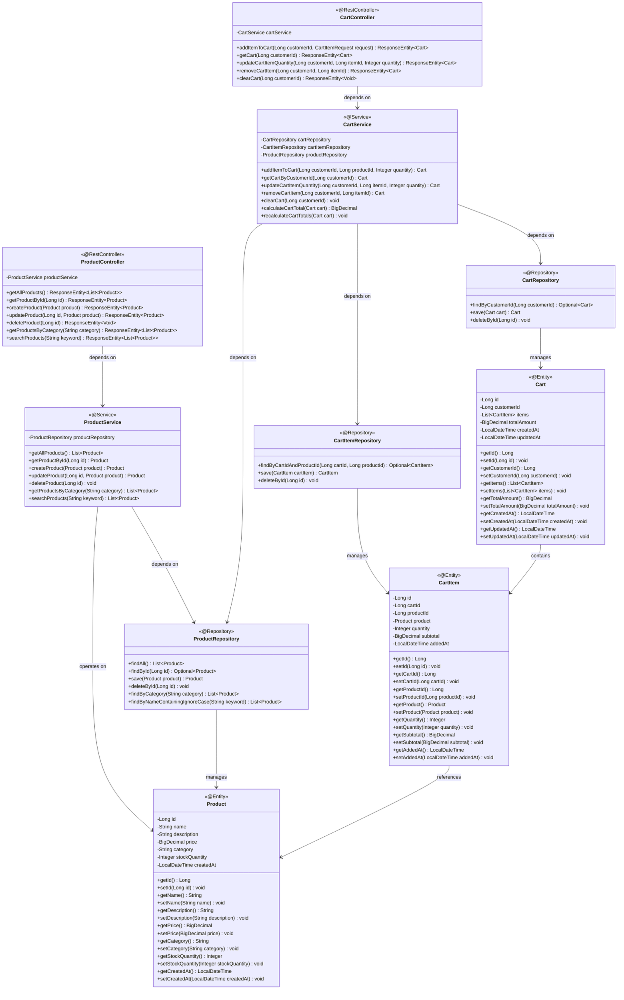

### 2.2 Entity Relationship Diagram

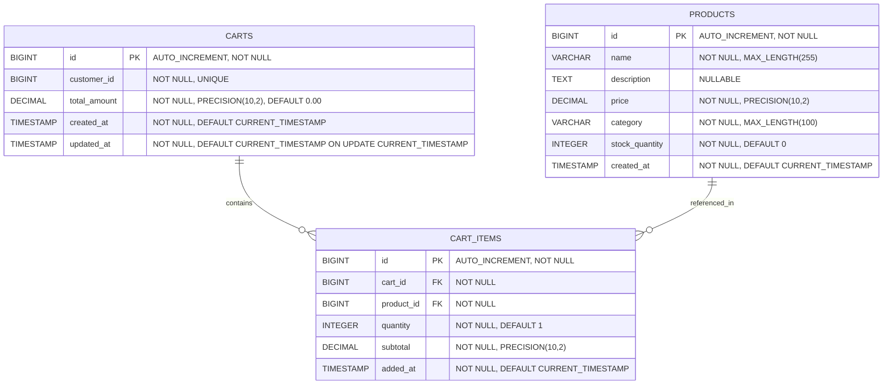

## 3. Sequence Diagrams

### 3.1 Get All Products

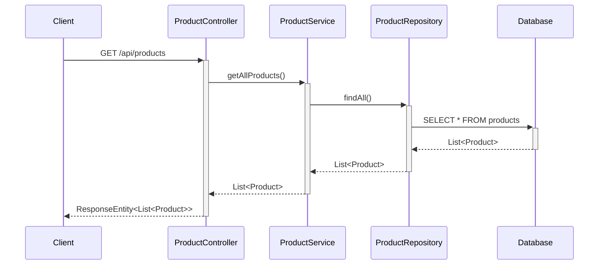

### 3.2 Get Product By ID

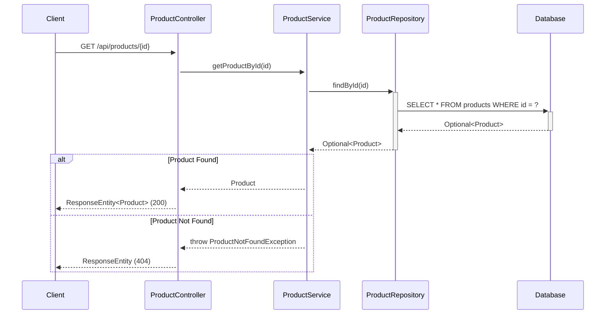

### 3.3 Create Product

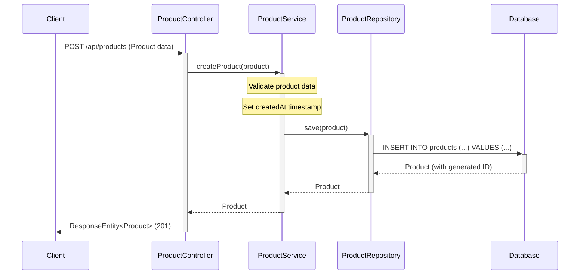

### 3.4 Update Product

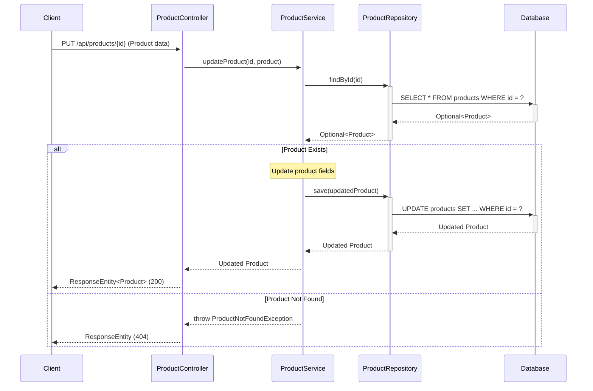

### 3.5 Delete Product

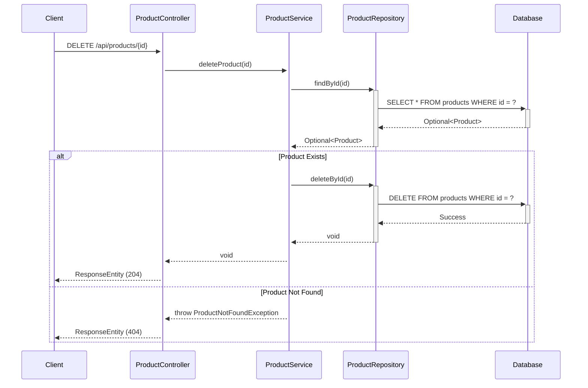

### 3.6 Get Products By Category

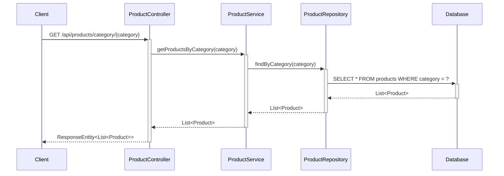

### 3.7 Search Products

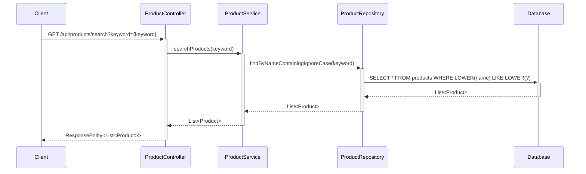

### 3.8 Add Item to Cart

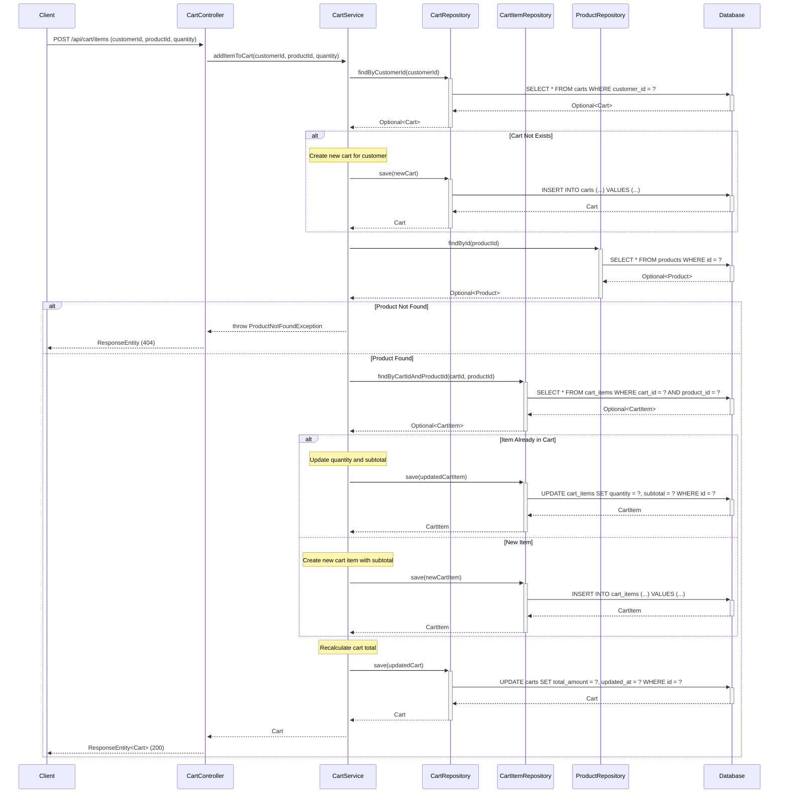

### 3.9 View Cart

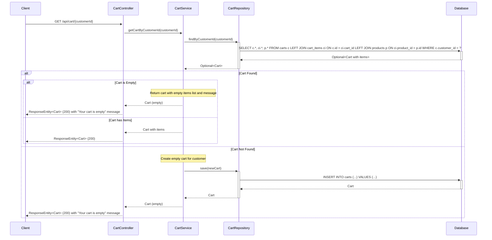

### 3.10 Update Cart Item Quantity

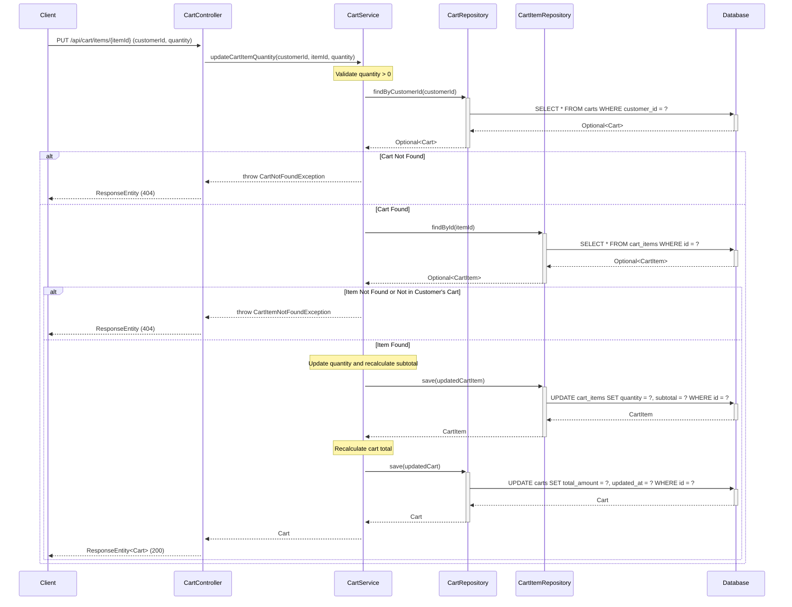

### 3.11 Remove Cart Item

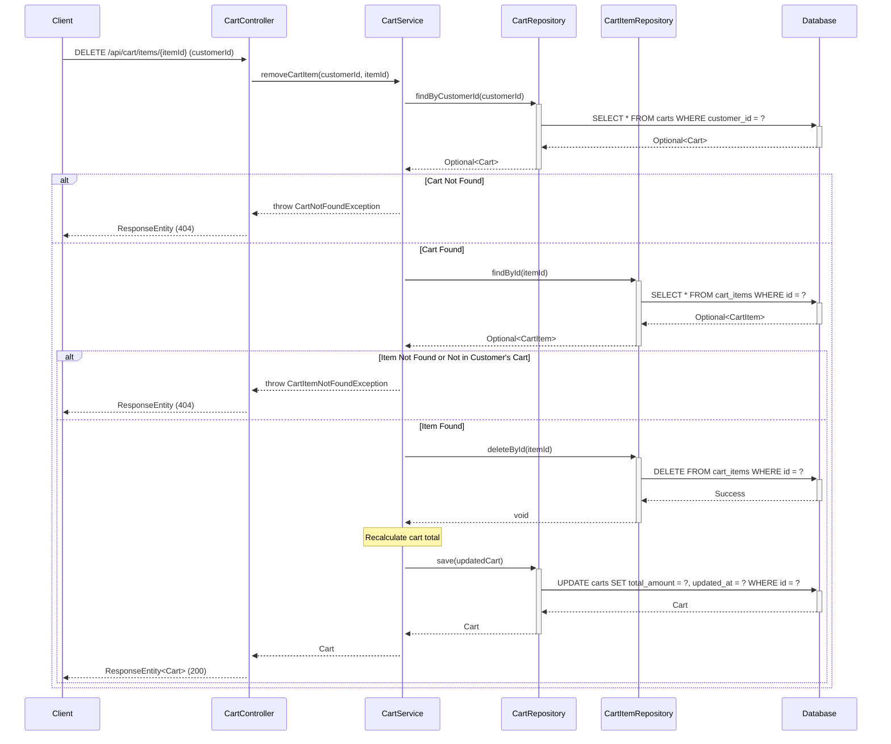

## 4. API Endpoints Summary

| Method | Endpoint | Description | Request Body | Response |
|--------|----------|-------------|--------------|----------|
| GET | `/api/products` | Get all products | None | List<Product> |
| GET | `/api/products/{id}` | Get product by ID | None | Product |
| POST | `/api/products` | Create new product | Product | Product |
| PUT | `/api/products/{id}` | Update existing product | Product | Product |
| DELETE | `/api/products/{id}` | Delete product | None | None |
| GET | `/api/products/category/{category}` | Get products by category | None | List<Product> |
| GET | `/api/products/search?keyword={keyword}` | Search products by name | None | List<Product> |
| POST | `/api/cart/items` | Add item to cart | CartItemRequest (customerId, productId, quantity) | Cart |
| GET | `/api/cart/{customerId}` | View cart | None | Cart |
| PUT | `/api/cart/items/{itemId}` | Update cart item quantity | QuantityUpdateRequest (customerId, quantity) | Cart |
| DELETE | `/api/cart/items/{itemId}` | Remove item from cart | customerId (query param) | Cart |
| DELETE | `/api/cart/{customerId}` | Clear entire cart | None | None |

## 5. Database Schema

### Products Table

```sql
CREATE TABLE products (
    id BIGINT PRIMARY KEY AUTO_INCREMENT,
    name VARCHAR(255) NOT NULL,
    description TEXT,
    price DECIMAL(10,2) NOT NULL,
    category VARCHAR(100) NOT NULL,
    stock_quantity INTEGER NOT NULL DEFAULT 0,
    created_at TIMESTAMP NOT NULL DEFAULT CURRENT_TIMESTAMP
);

CREATE INDEX idx_products_category ON products(category);
CREATE INDEX idx_products_name ON products(name);
```

### Carts Table

```sql
CREATE TABLE carts (
    id BIGINT PRIMARY KEY AUTO_INCREMENT,
    customer_id BIGINT NOT NULL UNIQUE,
    total_amount DECIMAL(10,2) NOT NULL DEFAULT 0.00,
    created_at TIMESTAMP NOT NULL DEFAULT CURRENT_TIMESTAMP,
    updated_at TIMESTAMP NOT NULL DEFAULT CURRENT_TIMESTAMP ON UPDATE CURRENT_TIMESTAMP
);

CREATE INDEX idx_carts_customer_id ON carts(customer_id);
```

### Cart Items Table

```sql
CREATE TABLE cart_items (
    id BIGINT PRIMARY KEY AUTO_INCREMENT,
    cart_id BIGINT NOT NULL,
    product_id BIGINT NOT NULL,
    quantity INTEGER NOT NULL DEFAULT 1,
    subtotal DECIMAL(10,2) NOT NULL,
    added_at TIMESTAMP NOT NULL DEFAULT CURRENT_TIMESTAMP,
    FOREIGN KEY (cart_id) REFERENCES carts(id) ON DELETE CASCADE,
    FOREIGN KEY (product_id) REFERENCES products(id) ON DELETE CASCADE,
    UNIQUE KEY unique_cart_product (cart_id, product_id)
);

CREATE INDEX idx_cart_items_cart_id ON cart_items(cart_id);
CREATE INDEX idx_cart_items_product_id ON cart_items(product_id);
```

## 6. Technology Stack

- **Backend Framework:** Spring Boot 3.x
- **Language:** Java 21
- **Database:** PostgreSQL
- **ORM:** Spring Data JPA / Hibernate
- **Build Tool:** Maven/Gradle
- **API Documentation:** Swagger/OpenAPI 3

## 7. Design Patterns Used

1. **MVC Pattern:** Separation of Controller, Service, and Repository layers
2. **Repository Pattern:** Data access abstraction through ProductRepository
3. **Dependency Injection:** Spring's IoC container manages dependencies
4. **DTO Pattern:** Data Transfer Objects for API requests/responses
5. **Exception Handling:** Custom exceptions for business logic errors

## 8. Key Features

- RESTful API design following HTTP standards
- Proper HTTP status codes for different scenarios
- Input validation and error handling
- Database indexing for performance optimization
- Transactional operations for data consistency
- Pagination support for large datasets (can be extended)
- Search functionality with case-insensitive matching

## 9. Shopping Cart Management Features

### 9.1 Cart Operations

- **Add to Cart:** Customers can add products to their shopping cart with specified quantities
- **View Cart:** Display all items in the cart with product details, quantities, and calculated totals
- **Update Quantity:** Modify the quantity of items already in the cart with automatic subtotal recalculation
- **Remove Items:** Delete individual items from the cart
- **Empty Cart Handling:** Display appropriate messaging when cart is empty

### 9.2 Business Logic

- **Automatic Calculations:** 
  - Subtotal calculation per cart item (quantity × product price)
  - Total cart amount calculation (sum of all item subtotals)
  - Automatic recalculation on any cart modification

- **Validation Rules:**
  - Quantity must be greater than 0
  - Product must exist and be available
  - Cart items are unique per product (update quantity if product already in cart)

- **Data Integrity:**
  - One cart per customer (enforced by unique constraint)
  - Cascade deletion of cart items when cart is deleted
  - Cascade deletion of cart items when product is deleted
  - Timestamp tracking for cart creation and updates

### 9.3 Error Handling

- **CartNotFoundException:** Thrown when cart is not found for customer
- **CartItemNotFoundException:** Thrown when cart item is not found or doesn't belong to customer's cart
- **ProductNotFoundException:** Thrown when attempting to add non-existent product
- **InvalidQuantityException:** Thrown when quantity is less than or equal to 0

## 10. Traceability Matrix

### Story SCRUM-1140 - Shopping Cart Management

| Acceptance Criteria | Implementation | Section Reference |
|---------------------|----------------|-------------------|
| AC1: Add products to cart | POST /api/cart/items endpoint, addItemToCart() method | Section 3.8, 4 |
| AC2: View cart with all items | GET /api/cart/{customerId} endpoint, getCartByCustomerId() method | Section 3.9, 4 |
| AC3: Update item quantities with recalculation | PUT /api/cart/items/{itemId} endpoint, updateCartItemQuantity() method | Section 3.10, 4 |
| AC4: Remove items from cart | DELETE /api/cart/items/{itemId} endpoint, removeCartItem() method | Section 3.11, 4 |
| AC5: Empty cart handling | Empty cart logic in getCartByCustomerId() method | Section 3.9, 9.1 |

### Epic SCRUM-1153 - Customer Shopping Experience

| Component | Implementation | Section Reference |
|-----------|----------------|-------------------|
| Cart Data Models | Cart and CartItem entities with relationships | Section 2.1, 2.2, 5 |
| Cart Management APIs | 5 new cart endpoints | Section 4 |
| Business Logic | CartService with calculation and validation logic | Section 2.1, 9.2 |
| Database Schema | carts and cart_items tables with constraints | Section 5 |