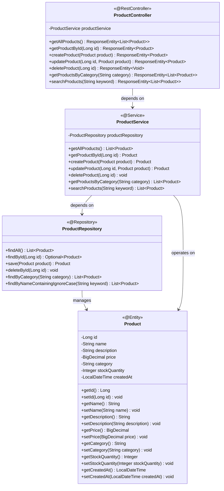
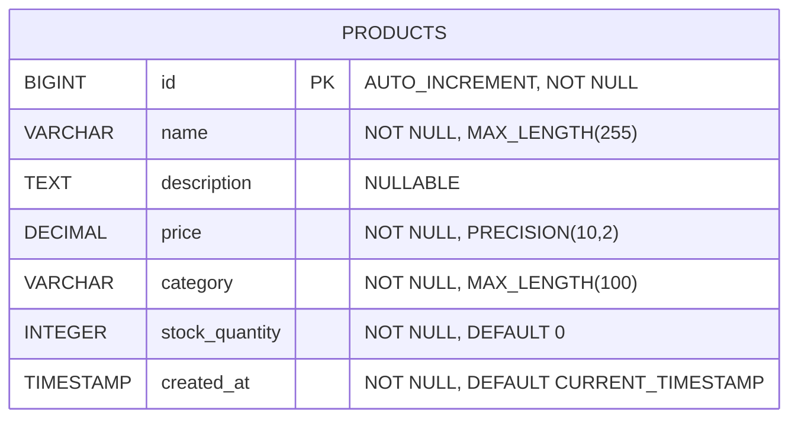
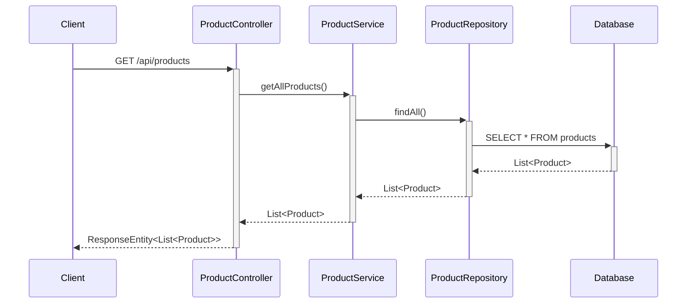
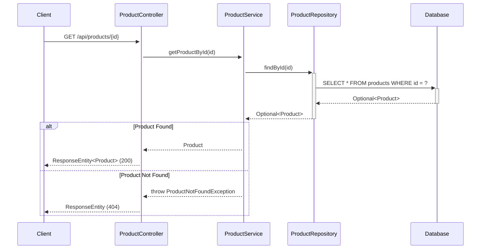
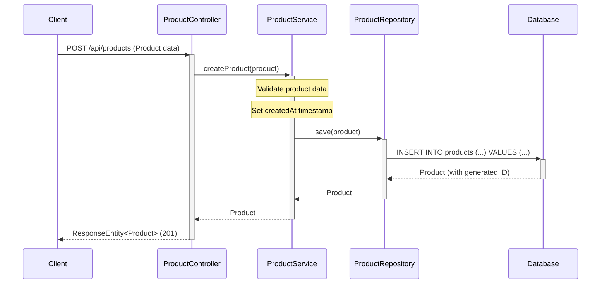
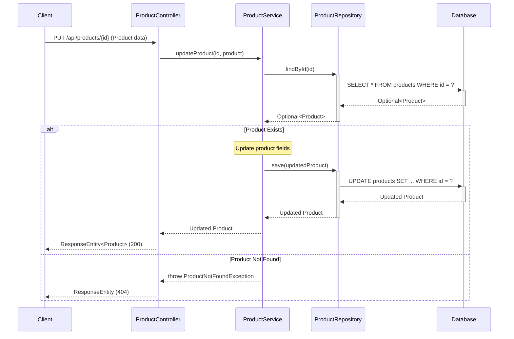
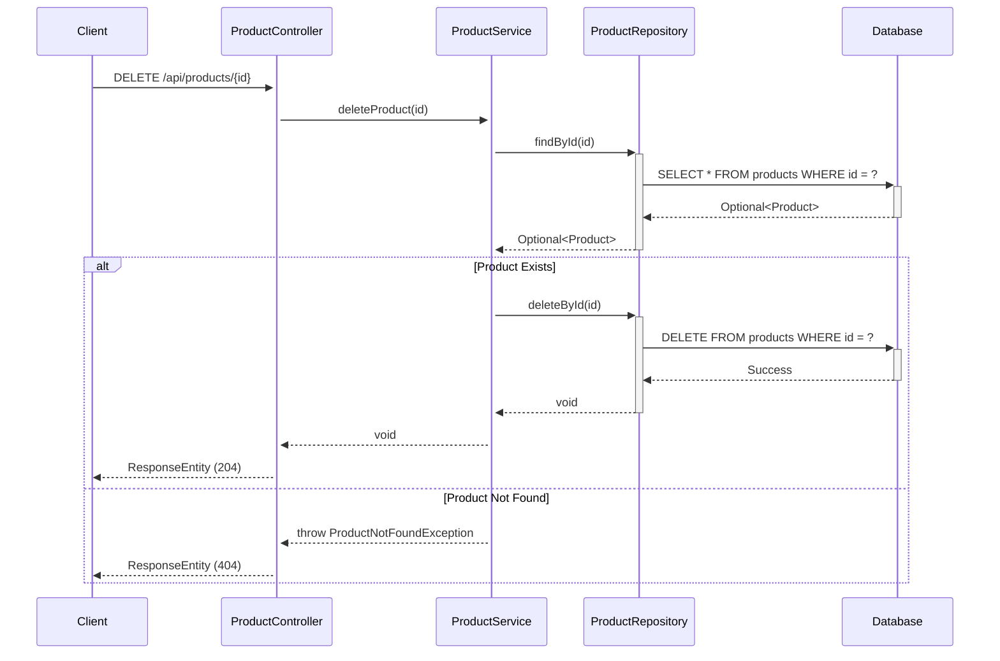
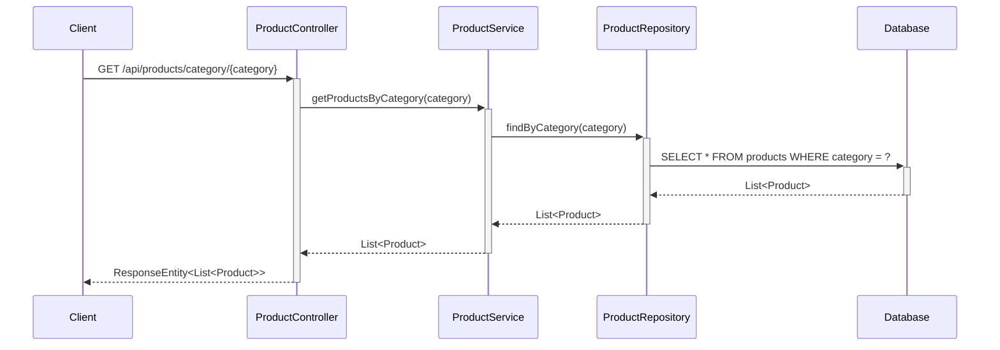
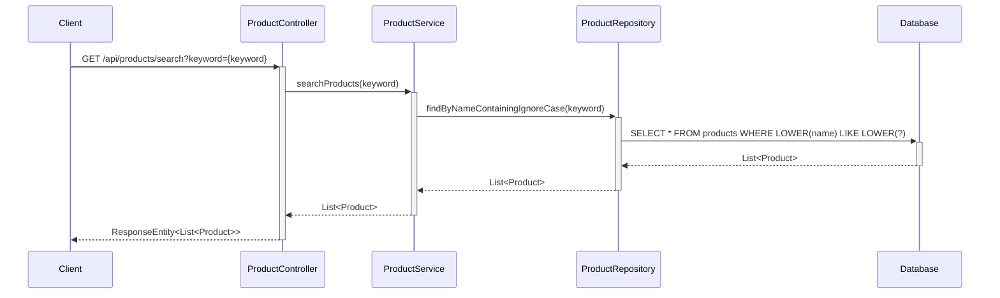

# Low-Level Design (LLD) - E-commerce Product Management System

## 1. Project Overview

**Framework:** Spring Boot  
**Language:** Java 21  
**Database:** PostgreSQL  
**Module:** ProductManagement  

## 2. System Architecture

### 2.1 Class Diagram



### 2.2 Entity Relationship Diagram



## 3. Sequence Diagrams

### 3.1 Get All Products



### 3.2 Get Product By ID



### 3.3 Create Product



### 3.4 Update Product



### 3.5 Delete Product



### 3.6 Get Products By Category



### 3.7 Search Products



## 4. API Endpoints Summary

| Method | Endpoint | Description | Request Body | Response |
|--------|----------|-------------|--------------|----------|
| GET | `/api/products` | Get all products | None | List<Product> |
| GET | `/api/products/{id}` | Get product by ID | None | Product |
| POST | `/api/products` | Create new product | Product | Product |
| PUT | `/api/products/{id}` | Update existing product | Product | Product |
| DELETE | `/api/products/{id}` | Delete product | None | None |
| GET | `/api/products/category/{category}` | Get products by category | None | List<Product> |
| GET | `/api/products/search?keyword={keyword}` | Search products by name | None | List<Product> |

## 5. Database Schema

### Products Table

```sql
CREATE TABLE products (
    id BIGINT PRIMARY KEY AUTO_INCREMENT,
    name VARCHAR(255) NOT NULL,
    description TEXT,
    price DECIMAL(10,2) NOT NULL,
    category VARCHAR(100) NOT NULL,
    stock_quantity INTEGER NOT NULL DEFAULT 0,
    created_at TIMESTAMP NOT NULL DEFAULT CURRENT_TIMESTAMP
);

CREATE INDEX idx_products_category ON products(category);
CREATE INDEX idx_products_name ON products(name);
```

## 6. Technology Stack

- **Backend Framework:** Spring Boot 3.x
- **Language:** Java 21
- **Database:** PostgreSQL
- **ORM:** Spring Data JPA / Hibernate
- **Build Tool:** Maven/Gradle
- **API Documentation:** Swagger/OpenAPI 3

## 7. Design Patterns Used

1. **MVC Pattern:** Separation of Controller, Service, and Repository layers
2. **Repository Pattern:** Data access abstraction through ProductRepository
3. **Dependency Injection:** Spring's IoC container manages dependencies
4. **DTO Pattern:** Data Transfer Objects for API requests/responses
5. **Exception Handling:** Custom exceptions for business logic errors

## 8. Key Features

- RESTful API design following HTTP standards
- Proper HTTP status codes for different scenarios
- Input validation and error handling
- Database indexing for performance optimization
- Transactional operations for data consistency
- Pagination support for large datasets (can be extended)
- Search functionality with case-insensitive matching