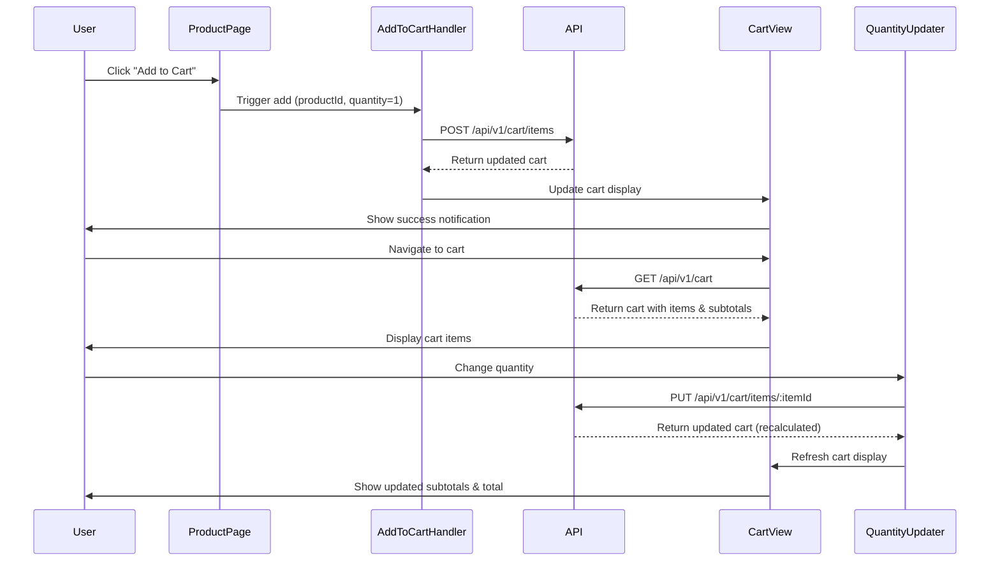

# Low Level Design Document: E-commerce Shopping Cart Management System

## 1. System Overview

This document provides the low-level design for an E-commerce Shopping Cart Management System. The system enables users to manage a shopping cart, add products, update quantities, and prepare for checkout. This LLD is specifically scoped to Story SCRUM-1140: Shopping Cart Management.

## 2. Architecture Components

### 2.1 Module Structure

```
ecommerce-system/
├── shopping-cart/
│   ├── controllers/
│   ├── services/
│   ├── repositories/
│   └── models/
├── presentation-layer/
│   ├── components/
│   ├── views/
│   └── handlers/
└── shared/
    ├── middleware/
    ├── utils/
    └── config/
```

## 3. Shopping Cart Management Module

### 3.1 Data Model

#### Cart Entity
```typescript
interface Cart {
  id: string;              // UUID
  userId: string;          // User identifier (bound to user session or user ID for cart ownership and persistence)
  items: CartItem[];       // Array of cart items
  totalAmount: number;     // Total cart value in cents
  currency: string;        // ISO 4217 currency code
  createdAt: Date;         // Creation timestamp
  updatedAt: Date;         // Last update timestamp
}
```

**Cart-to-User Binding Mechanism**:
- Each cart is uniquely bound to a user through the `userId` field
- For authenticated users: `userId` is the user's unique identifier from the authentication system
- For guest users: `userId` is a session-based identifier that persists across browser sessions via secure session tokens
- Cart ownership is validated on every operation to prevent unauthorized access
- Session management strategy ensures cart persistence and prevents data leakage between users

#### CartItem Entity
```typescript
interface CartItem {
  id: string;              // UUID
  cartId: string;          // Reference to cart
  productId: string;       // Reference to product
  productName: string;     // Cached product name for display (populated from Product entity at the time of adding to cart and returned in API responses)
  price: number;           // Price snapshot at time of adding (cents) - preserves price at moment of cart addition
  quantity: number;        // Item quantity
  subtotal: number;        // price * quantity (individual item subtotal)
  addedAt: Date;           // Timestamp when added
}
```

**Price Snapshot Capture Logic**:
- When an item is added to the cart, the system captures the current product price from the Product entity
- This price snapshot is stored in the CartItem's `price` field and remains fixed for that cart item
- All cart calculations (subtotal, total) use the price snapshot, not the current product price
- This ensures cart prices remain stable even if product prices are updated after items are added
- Price snapshots prevent customer confusion and potential revenue discrepancies during checkout

### 3.2 API Endpoints

#### POST /api/v1/cart/items
**Purpose**: Add item to shopping cart

**Request Body**:
```typescript
{
  productId: string;    // Required: UUID of product
  quantity?: number;    // Optional: Number of items (must be positive integer; if not provided, defaults to 1)
}
```

**Default Quantity Behavior**:
- If the `quantity` field is not provided in the request, the system automatically defaults to `quantity = 1`
- This ensures consistent behavior and simplifies the add-to-cart operation for single-item additions
- Explicit quantity values override the default when provided

**Response**:
```typescript
{
  data: Cart;           // Updated cart with all items
  message: string;      // Success message
}
```

**Status Codes**:
- 201: Item added successfully
- 400: Invalid request (invalid productId, invalid quantity)
- 404: Product not found
- 409: Insufficient stock
- 500: Server error

#### GET /api/v1/cart
**Purpose**: Retrieve current user's cart with individual item subtotals

**Response**:
```typescript
{
  data: {
    id: string;
    userId: string;
    items: [
      {
        id: string;
        productId: string;
        productName: string;
        price: number;
        quantity: number;
        subtotal: number;      // Individual item subtotal (quantity × price snapshot)
        addedAt: Date;
      }
    ];
    totalAmount: number;       // Cart total (sum of all item subtotals)
    currency: string;
    createdAt: Date;
    updatedAt: Date;
  }
}
```

**Individual Item Subtotals**:
- Each cart item in the response includes a `subtotal` field calculated as `quantity × priceSnapshot`
- This eliminates the need for client-side subtotal calculations and ensures consistency
- The cart `totalAmount` is the sum of all individual item subtotals

**Status Codes**:
- 200: Success
- 404: Cart not found (empty cart)
- 500: Server error

#### PUT /api/v1/cart/items/:itemId
**Purpose**: Update cart item quantity with automatic recalculation

**Request Body**:
```typescript
{
  quantity: number;     // Required: New quantity (must be positive)
}
```

**Automatic Recalculation Logic**:
- Any PUT operation on cart items triggers immediate recalculation of:
  1. Item subtotal (quantity × price snapshot)
  2. Cart total (sum of all item subtotals)
- Recalculation occurs before the response is returned to ensure data consistency
- This automatic behavior ensures cart totals are always accurate and up-to-date

**Response**:
```typescript
{
  data: Cart;           // Updated cart with recalculated totals
  message: string;
}
```

**Status Codes**:
- 200: Updated successfully
- 400: Invalid quantity
- 404: Item not found
- 409: Insufficient stock
- 500: Server error

#### DELETE /api/v1/cart/items/:itemId
**Purpose**: Remove item from cart

**Response**:
```typescript
{
  data: Cart;           // Updated cart
  message: string;
}
```

**Status Codes**:
- 200: Removed successfully
- 404: Item not found
- 500: Server error

#### DELETE /api/v1/cart
**Purpose**: Clear entire cart

**Response**:
```typescript
{
  message: string;      // Success message
}
```

**Status Codes**:
- 200: Cart cleared
- 404: Cart not found
- 500: Server error

### 3.3 Business Logic Implementation

#### Cart Service
```typescript
class CartService {
  async addItemToCart(userId: string, productId: string, quantity: number = 1): Promise<Cart> {
    // 1. Validate productId format (UUID)
    // 2. Validate quantity (positive integer, default to 1 if not provided)
    // 3. Fetch product details and verify it exists and is active
    // 4. Capture price snapshot from product.price at this moment
    // 5. Check stock availability (product.stockQuantity >= quantity)
    // 6. Get or create cart for user (bind to userId)
    // 7. Check if product already exists in cart
    //    - If exists: update quantity (add to existing)
    //    - If new: create new cart item with price snapshot
    // 8. Recalculate item subtotals and cart totals
    // 9. Save cart and return updated cart with individual subtotals
  }

  async getCart(userId: string): Promise<Cart> {
    // 1. Query cart by userId
    // 2. Include all cart items with product details
    // 3. Verify all products are still active and in stock
    // 4. Calculate individual item subtotals (quantity × price snapshot)
    // 5. Recalculate cart total to ensure accuracy
    // 6. Return cart with individual subtotals or throw NotFoundError if empty
  }

  async updateCartItem(userId: string, itemId: string, quantity: number): Promise<Cart> {
    // 1. Validate quantity (must be positive)
    // 2. Get cart and verify ownership (userId matches)
    // 3. Find cart item by itemId
    // 4. Fetch current product details
    // 5. Verify stock availability for new quantity
    // 6. Update item quantity
    // 7. Recalculate item subtotal (quantity × price snapshot)
    // 8. Recalculate cart total (sum of all subtotals)
    // 9. Save and return updated cart with recalculated values
  }

  async removeCartItem(userId: string, itemId: string): Promise<Cart> {
    // 1. Get cart and verify ownership
    // 2. Find and remove cart item
    // 3. Recalculate cart totals
    // 4. Save and return updated cart
  }

  async clearCart(userId: string): Promise<void> {
    // 1. Find cart by userId
    // 2. Delete all cart items
    // 3. Reset cart totals to zero
    // 4. Save cart or delete cart record
  }

  private calculateCartTotals(cart: Cart): void {
    // 1. Calculate individual item subtotals (quantity × price snapshot)
    // 2. Sum all item subtotals to get cart total
    // 3. Update cart.totalAmount
    // 4. Ensure currency consistency across all items
  }
}
```

#### Stock Validation Logic
```typescript
class StockValidator {
  async validateStock(productId: string, requestedQuantity: number): Promise<boolean> {
    // 1. Fetch current product stock
    // 2. Compare requestedQuantity with stockQuantity
    // 3. Return true if sufficient, false otherwise
    // 4. Consider reserved stock (items in other carts)
  }
}
```

#### Empty Cart Handling
When a cart is empty or all items are removed:
- The GET /api/v1/cart endpoint returns 404 with message "Cart is empty"
- The presentation layer (frontend) is responsible for handling this response and redirecting users to the product browsing page
- The API includes a specific response field `isEmpty: true` and/or uses status code 404 to signal that the cart is empty, which triggers the presentation layer's redirection logic
- This separation ensures the API remains stateless while allowing the UI to implement appropriate navigation flows
- **Empty Cart State UI Redirection**: When the cart is empty, the frontend displays an "Empty Cart View" with a prominent "Continue Shopping" link/button that redirects users to the product catalog page, providing clear guidance and improving user experience

### 3.4 Database Schema

```sql
CREATE TABLE carts (
  id UUID PRIMARY KEY DEFAULT gen_random_uuid(),
  user_id VARCHAR(255) NOT NULL UNIQUE,
  total_amount INTEGER NOT NULL DEFAULT 0,
  currency VARCHAR(3) NOT NULL DEFAULT 'USD',
  created_at TIMESTAMP DEFAULT CURRENT_TIMESTAMP,
  updated_at TIMESTAMP DEFAULT CURRENT_TIMESTAMP
);

CREATE TABLE cart_items (
  id UUID PRIMARY KEY DEFAULT gen_random_uuid(),
  cart_id UUID NOT NULL REFERENCES carts(id) ON DELETE CASCADE,
  product_id UUID NOT NULL REFERENCES products(id),
  product_name VARCHAR(200) NOT NULL,
  price INTEGER NOT NULL,
  quantity INTEGER NOT NULL CHECK (quantity > 0),
  subtotal INTEGER NOT NULL,
  added_at TIMESTAMP DEFAULT CURRENT_TIMESTAMP,
  UNIQUE(cart_id, product_id)
);

CREATE INDEX idx_carts_user_id ON carts(user_id);
CREATE INDEX idx_cart_items_cart_id ON cart_items(cart_id);
CREATE INDEX idx_cart_items_product_id ON cart_items(product_id);
```

## 4. Presentation Layer Components

### 4.1 Frontend Component Specifications

The presentation layer implements the user-facing components required for shopping cart functionality as specified in Story SCRUM-1140.

#### 4.1.1 Cart View Interface
**Purpose**: Display the current shopping cart with all items, quantities, prices, and totals

**Responsibilities**:
- Render list of cart items with product details (name, image, price snapshot, quantity)
- Display individual item subtotals for each cart item
- Show cart total amount prominently
- Provide controls for quantity updates and item removal
- Handle loading states and error messages
- Trigger automatic UI updates when cart data changes

**Component Structure**:
```typescript
interface CartViewProps {
  cart: Cart;
  onQuantityUpdate: (itemId: string, quantity: number) => void;
  onItemRemove: (itemId: string) => void;
  onClearCart: () => void;
  isLoading: boolean;
}
```

**Key Features**:
- Real-time display of individual item subtotals (quantity × price)
- Responsive layout for mobile and desktop views
- Accessibility compliance (ARIA labels, keyboard navigation)
- Visual feedback for user actions (loading spinners, success/error messages)

#### 4.1.2 Empty Cart View with Redirection Link
**Purpose**: Provide user guidance when the cart is empty

**Responsibilities**:
- Display empty cart state message
- Show "Continue Shopping" link/button prominently
- Redirect users to product catalog when clicked
- Provide visual indication that cart is empty (icon, illustration)

**Component Structure**:
```typescript
interface EmptyCartViewProps {
  onContinueShopping: () => void;
  catalogUrl: string;
}
```

**Behavior**:
- Automatically displayed when GET /api/v1/cart returns 404 or `isEmpty: true`
- "Continue Shopping" button redirects to product browsing page
- Includes helpful messaging to encourage users to add items

#### 4.1.3 Add to Cart Interaction Handler
**Purpose**: Manage the add-to-cart user interaction flow

**Responsibilities**:
- Handle "Add to Cart" button clicks from product pages
- Validate user input (quantity selection)
- Call POST /api/v1/cart/items API endpoint
- Provide user feedback (success notification, error handling)
- Update cart badge/counter in navigation
- Handle default quantity (1) when not specified

**Component Structure**:
```typescript
interface AddToCartHandlerProps {
  productId: string;
  defaultQuantity?: number;  // Defaults to 1
  onSuccess: (cart: Cart) => void;
  onError: (error: Error) => void;
}
```

**Interaction Flow**:
1. User clicks "Add to Cart" button on product page
2. Handler validates quantity (defaults to 1 if not specified)
3. API call to POST /api/v1/cart/items with productId and quantity
4. On success: Show success notification, update cart counter
5. On error: Display error message (e.g., insufficient stock)

#### 4.1.4 Quantity Updater Component
**Purpose**: Allow users to modify item quantities within the cart

**Responsibilities**:
- Render quantity input controls (increment/decrement buttons, text input)
- Validate quantity input (positive integers only)
- Call PUT /api/v1/cart/items/:itemId API endpoint
- Trigger automatic recalculation of subtotals and cart total
- Handle stock validation errors
- Provide immediate visual feedback

**Component Structure**:
```typescript
interface QuantityUpdaterProps {
  itemId: string;
  currentQuantity: number;
  maxQuantity: number;  // Based on product stock
  onUpdate: (itemId: string, newQuantity: number) => void;
  isUpdating: boolean;
}
```

**Features**:
- Increment (+) and decrement (-) buttons
- Direct numeric input with validation
- Disable controls when updating
- Show stock availability limits
- Debounced API calls to prevent excessive requests

### 4.2 Component Interaction Flow



### 4.3 State Management

**Cart State**:
- Centralized cart state management (Redux, Context API, or similar)
- Automatic synchronization with backend API
- Optimistic UI updates with rollback on error
- Persistent cart state across page navigation

**Error Handling**:
- Network error recovery
- Stock validation error display
- Session expiration handling
- Graceful degradation for API failures

## 5. Error Handling

### 5.1 Error Response Format
```typescript
{
  error: {
    code: string;        // Error code (e.g., "PRODUCT_NOT_FOUND")
    message: string;     // Human-readable message
    details?: any;       // Optional additional details
  }
}
```

### 5.2 Common Error Scenarios

#### Product Not Found
```typescript
{
  error: {
    code: "PRODUCT_NOT_FOUND",
    message: "The requested product does not exist or is no longer available"
  }
}
```

#### Insufficient Stock
```typescript
{
  error: {
    code: "INSUFFICIENT_STOCK",
    message: "Not enough stock available",
    details: {
      requested: 5,
      available: 2
    }
  }
}
```

#### Invalid Quantity
```typescript
{
  error: {
    code: "INVALID_QUANTITY",
    message: "Quantity must be a positive integer"
  }
}
```

## 6. Security Considerations

### 6.1 Authentication & Authorization
- All cart endpoints require valid user authentication
- Users can only access and modify their own carts
- JWT tokens used for authentication with 24-hour expiry
- Cart-to-user binding prevents unauthorized access and data leakage

### 6.2 Input Validation
- All UUIDs validated for correct format
- Quantity values must be positive integers
- Price values stored as integers (cents) to avoid floating-point issues
- SQL injection prevention through parameterized queries

### 6.3 Rate Limiting
- Cart operations: 50 requests per minute per user
- Implement exponential backoff for repeated failures

## 7. Performance Optimization

### 7.1 Caching Strategy
- Cart data not cached (real-time accuracy required)

### 7.2 Database Optimization
- Indexes on frequently queried fields (userId, productId)
- Connection pooling for database connections

### 7.3 Query Optimization
- Use SELECT specific columns instead of SELECT *
- Implement eager loading for cart items with product details
- Batch operations where possible

## 8. Monitoring & Logging

### 8.1 Logging Requirements
- Log all cart modifications (add, update, remove)
- Log stock validation failures
- Log authentication failures
- Include userId, timestamp, and operation details

### 8.2 Metrics to Track
- Cart abandonment rate
- Average items per cart
- Most added products
- Stock-out frequency
- API response times
- Error rates by endpoint

## 9. Testing Strategy

### 9.1 Unit Tests
- Cart service methods
- Stock validation logic
- Price calculation accuracy
- Price snapshot capture logic
- Individual subtotal calculations

### 9.2 Integration Tests
- End-to-end cart workflows
- Database transaction integrity
- Error handling scenarios
- Frontend component interactions

### 9.3 Test Scenarios
- Add item to empty cart
- Add duplicate item (quantity update)
- Update item quantity
- Remove item from cart
- Clear entire cart
- Handle insufficient stock
- Handle deleted products in cart
- Concurrent cart modifications
- Price snapshot preservation when product price changes
- Default quantity behavior (quantity = 1)
- Empty cart state and UI redirection
- Individual subtotal calculations
- Automatic recalculation on quantity updates

## 10. Deployment Considerations

### 10.1 Environment Variables
```
DATABASE_URL=postgresql://...
REDIS_URL=redis://...
JWT_SECRET=...
API_PORT=3000
NODE_ENV=production
```

### 10.2 Scalability
- Horizontal scaling of API servers
- Redis for session and cache management

### 10.3 Backup & Recovery
- Daily database backups
- Point-in-time recovery capability
- Cart data retention: 90 days for inactive carts

---

**Document Version**: 3.0  
**Last Updated**: 2024-01-15  
**Prepared By**: Engineering Team  
**Story Scope**: SCRUM-1140 - Shopping Cart Management  
**Change Log**: 
- v3.0: Applied RCA findings - Added API versioning (/api/v1/cart/items), separated CartItem entity definition, documented price snapshot capture logic, cart-to-user binding mechanism, default quantity behavior, individual item subtotals in API responses, automatic recalculation logic, empty cart state UI redirection, and complete presentation layer component specifications (Cart View Interface, Empty Cart View, Add to Cart Handler, Quantity Updater Component). Removed out-of-scope Product Management APIs and Product Data Model (belong to SCRUM-1147 and SCRUM-1139). Updated all cart API endpoints to RESTful standard with proper versioning.
- v2.0: Initial version with basic cart functionality