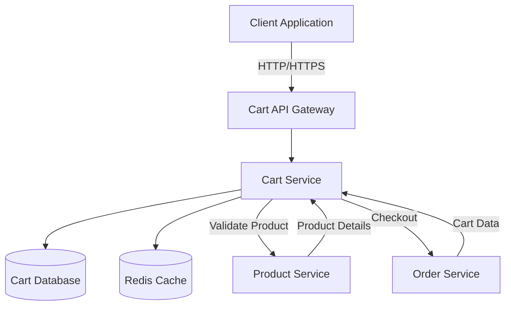
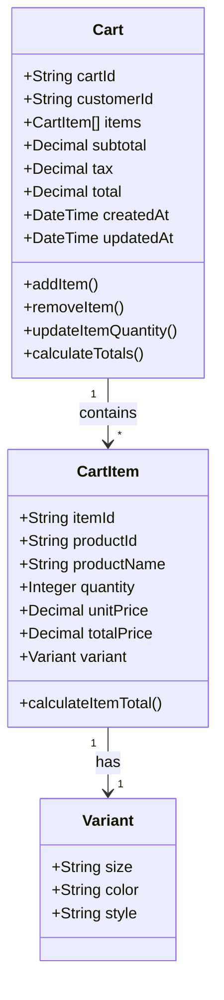
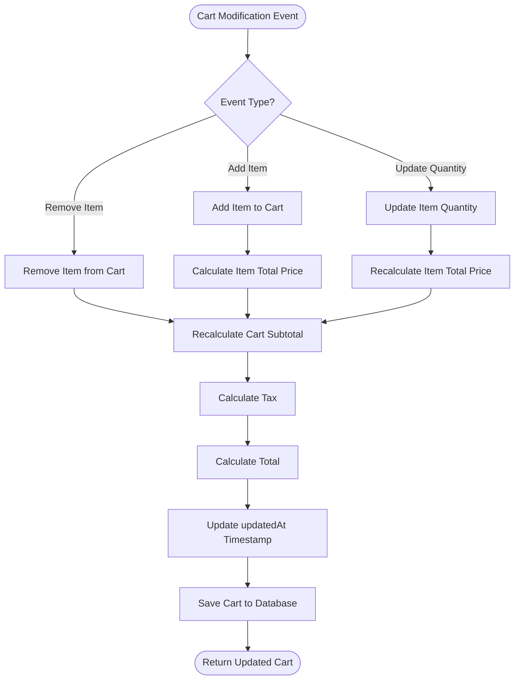
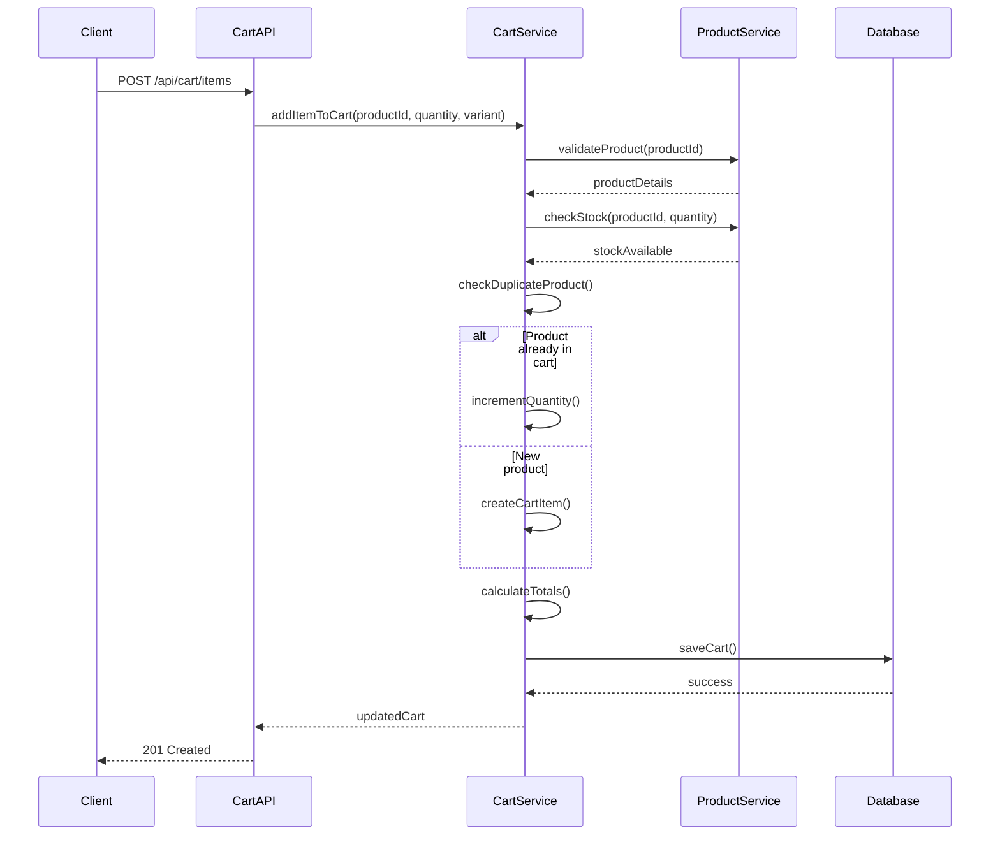
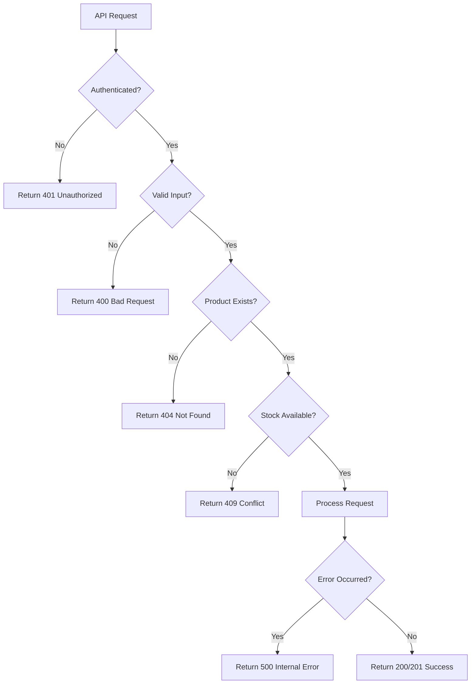
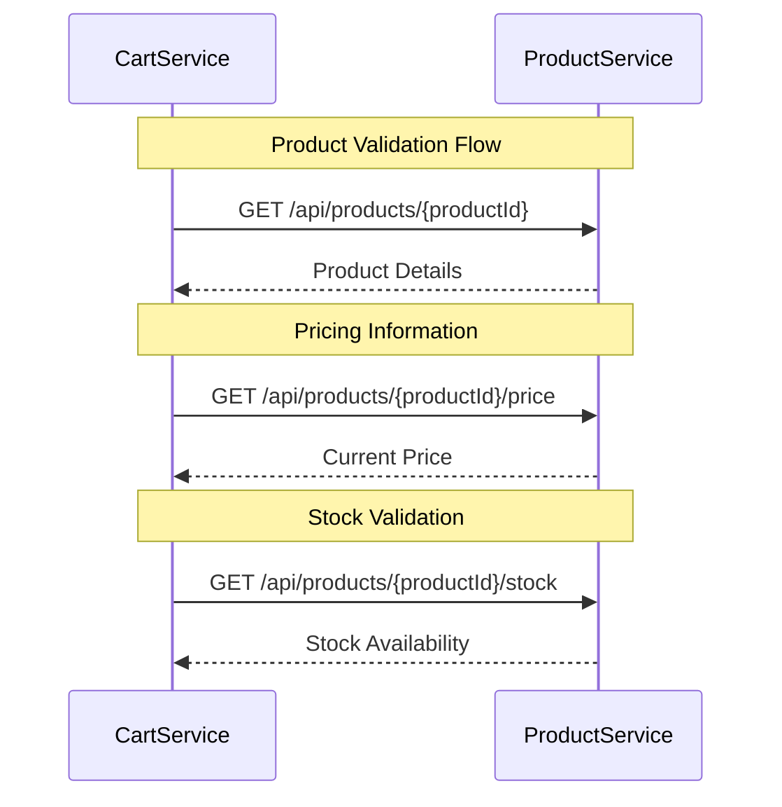
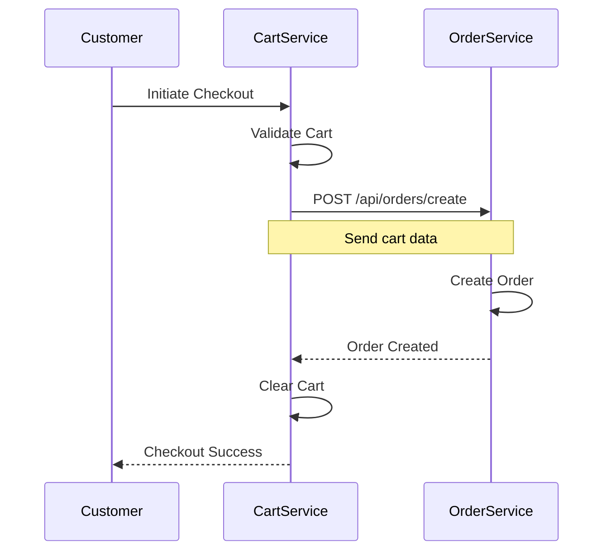
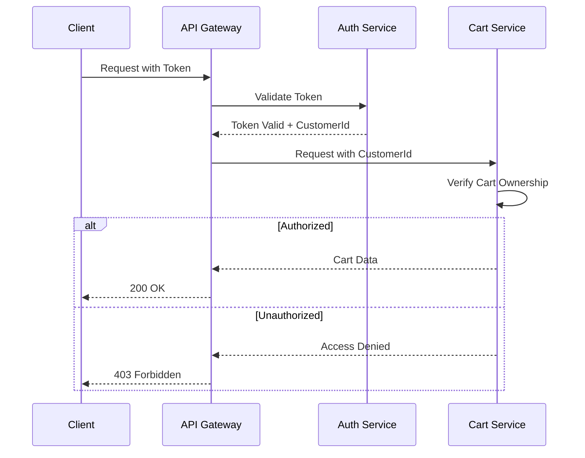

# Low Level Design: Shopping Cart Management System

## 1. Overview

This document provides a comprehensive Low Level Design (LLD) for the Shopping Cart Management System. The system enables customers to add products to their cart, update quantities, remove items, and view their cart with automatic price calculations. This design ensures scalability, security, and optimal performance for e-commerce operations.

### 1.1 Purpose
The Shopping Cart Management System provides core functionality for managing customer shopping carts, including item management, price calculations, and integration with product and order services.

### 1.2 Scope
This LLD covers:
- API endpoint specifications
- Data models and relationships
- Business logic and calculations
- Validation rules
- Error handling strategies
- UI/UX requirements
- System dependencies
- Performance and security requirements
- Edge case handling

## 2. System Architecture



## 3. API Endpoints

### 3.1 Add Item to Cart

**Endpoint:** `POST /api/cart/items`

**Description:** Adds a product to the customer's shopping cart with specified quantity and variant details.

**Request Headers:**
```
Authorization: Bearer <token>
Content-Type: application/json
```

**Request Body:**
```json
{
  "productId": "string",
  "quantity": "integer",
  "variant": {
    "size": "string",
    "color": "string",
    "style": "string"
  }
}
```

**Response (201 Created):**
```json
{
  "success": true,
  "message": "Item added to cart successfully",
  "cart": {
    "cartId": "string",
    "customerId": "string",
    "items": [],
    "subtotal": "number",
    "tax": "number",
    "total": "number",
    "updatedAt": "timestamp"
  }
}
```

### 3.2 Get Cart Details

**Endpoint:** `GET /api/cart`

**Description:** Retrieves complete cart details for the authenticated customer.

**Request Headers:**
```
Authorization: Bearer <token>
```

**Response (200 OK):**
```json
{
  "success": true,
  "cart": {
    "cartId": "string",
    "customerId": "string",
    "items": [
      {
        "itemId": "string",
        "productId": "string",
        "productName": "string",
        "quantity": "integer",
        "unitPrice": "number",
        "totalPrice": "number",
        "variant": {
          "size": "string",
          "color": "string",
          "style": "string"
        }
      }
    ],
    "subtotal": "number",
    "tax": "number",
    "total": "number",
    "createdAt": "timestamp",
    "updatedAt": "timestamp"
  }
}
```

### 3.3 Update Item Quantity

**Endpoint:** `PUT /api/cart/items/{itemId}`

**Description:** Updates the quantity of a specific item in the cart with automatic recalculation of totals.

**Request Headers:**
```
Authorization: Bearer <token>
Content-Type: application/json
```

**Request Body:**
```json
{
  "quantity": "integer"
}
```

**Response (200 OK):**
```json
{
  "success": true,
  "message": "Item quantity updated successfully",
  "cart": {
    "cartId": "string",
    "customerId": "string",
    "items": [],
    "subtotal": "number",
    "tax": "number",
    "total": "number",
    "updatedAt": "timestamp"
  }
}
```

### 3.4 Remove Item from Cart

**Endpoint:** `DELETE /api/cart/items/{itemId}`

**Description:** Removes a specific item from the cart with automatic recalculation of totals.

**Request Headers:**
```
Authorization: Bearer <token>
```

**Response (200 OK):**
```json
{
  "success": true,
  "message": "Item removed from cart successfully",
  "cart": {
    "cartId": "string",
    "customerId": "string",
    "items": [],
    "subtotal": "number",
    "tax": "number",
    "total": "number",
    "updatedAt": "timestamp"
  }
}
```

## 4. Data Models



### 4.1 Cart Model

**Entity:** Cart

**Attributes:**
- `cartId` (String, Primary Key): Unique identifier for the cart
- `customerId` (String, Foreign Key): Reference to the customer who owns the cart
- `items` (Array[CartItem]): List of items in the cart
- `subtotal` (Decimal): Sum of all item totals before tax
- `tax` (Decimal): Calculated tax amount
- `total` (Decimal): Final total including tax (subtotal + tax)
- `createdAt` (DateTime): Timestamp when cart was created
- `updatedAt` (DateTime): Timestamp of last modification

**Indexes:**
- Primary: `cartId`
- Secondary: `customerId` (for quick customer cart lookup)

### 4.2 CartItem Model

**Entity:** CartItem

**Attributes:**
- `itemId` (String, Primary Key): Unique identifier for the cart item
- `productId` (String, Foreign Key): Reference to the product
- `productName` (String): Name of the product (denormalized for performance)
- `quantity` (Integer): Number of units
- `unitPrice` (Decimal): Price per unit
- `totalPrice` (Decimal): Calculated as quantity × unitPrice
- `variant` (Object): Product variant details
  - `size` (String): Size variant
  - `color` (String): Color variant
  - `style` (String): Style variant

## 5. Business Logic

### 5.1 Automatic Recalculation Logic



#### 5.1.1 Quantity Update Recalculation

When an item quantity is updated:

1. **Validate New Quantity**
   - Check if quantity is a positive integer
   - Verify stock availability
   - Ensure quantity doesn't exceed maximum limit

2. **Recalculate Item Total**
   ```
   itemTotalPrice = quantity × unitPrice
   ```

3. **Recalculate Cart Subtotal**
   ```
   subtotal = Σ(item.totalPrice) for all items in cart
   ```

4. **Recalculate Tax**
   ```
   tax = subtotal × taxRate
   ```
   (taxRate is configurable per region/customer)

5. **Recalculate Total**
   ```
   total = subtotal + tax
   ```

6. **Update Timestamp**
   ```
   updatedAt = currentTimestamp
   ```

#### 5.1.2 Item Removal Recalculation

When an item is removed from the cart:

1. **Remove Item**
   - Delete the item from the cart's items array

2. **Recalculate Cart Subtotal**
   ```
   subtotal = Σ(item.totalPrice) for all remaining items
   ```

3. **Recalculate Tax**
   ```
   tax = subtotal × taxRate
   ```

4. **Recalculate Total**
   ```
   total = subtotal + tax
   ```

5. **Update Timestamp**
   ```
   updatedAt = currentTimestamp
   ```

### 5.2 Add Item Logic



## 6. Validation Rules

### 6.1 Add to Cart Validation

**Product Validation:**
- Product must exist in the product catalog
- Product must be active and available for purchase
- Product ID must be a valid format

**Stock Availability:**
- Requested quantity must not exceed available stock
- Real-time stock check with Product Service
- Consider reserved stock from other pending carts

**Quantity Limits:**
- Minimum quantity: 1
- Maximum quantity: Configurable per product (default: 99)
- Quantity must be a positive integer

**Cart Limits:**
- Maximum unique items per cart: Configurable (default: 50)
- Maximum total quantity across all items: Configurable (default: 999)

### 6.2 Update Quantity Validation

**Quantity Rules:**
- Must be a positive integer only
- Cannot be zero (use DELETE endpoint instead)
- Cannot be negative

**Stock Check:**
- New quantity must not exceed available stock
- Real-time validation against current inventory

**Maximum Limits:**
- Cannot exceed per-product maximum quantity limit
- Cannot cause total cart quantity to exceed cart limit

**Special Cases:**
- If quantity is set to 0, automatically remove item from cart
- If quantity exceeds stock, return error with available quantity

## 7. Error Handling

### 7.1 Add to Cart Errors

**Product Not Found (404)**
```json
{
  "success": false,
  "error": {
    "code": "PRODUCT_NOT_FOUND",
    "message": "The requested product does not exist",
    "productId": "string"
  }
}
```

**Insufficient Stock (409)**
```json
{
  "success": false,
  "error": {
    "code": "INSUFFICIENT_STOCK",
    "message": "Requested quantity exceeds available stock",
    "requestedQuantity": "integer",
    "availableQuantity": "integer"
  }
}
```

**Invalid Quantity (400)**
```json
{
  "success": false,
  "error": {
    "code": "INVALID_QUANTITY",
    "message": "Quantity must be a positive integer between 1 and maximum limit",
    "minQuantity": 1,
    "maxQuantity": "integer"
  }
}
```

**Cart Limit Exceeded (400)**
```json
{
  "success": false,
  "error": {
    "code": "CART_LIMIT_EXCEEDED",
    "message": "Cannot add more items to cart. Maximum limit reached",
    "currentItems": "integer",
    "maxItems": "integer"
  }
}
```

### 7.2 Update Quantity Errors

**Item Not in Cart (404)**
```json
{
  "success": false,
  "error": {
    "code": "ITEM_NOT_FOUND",
    "message": "The specified item is not in your cart",
    "itemId": "string"
  }
}
```

**Insufficient Stock (409)**
```json
{
  "success": false,
  "error": {
    "code": "INSUFFICIENT_STOCK",
    "message": "Updated quantity exceeds available stock",
    "requestedQuantity": "integer",
    "availableQuantity": "integer"
  }
}
```

**Invalid Quantity (400)**
```json
{
  "success": false,
  "error": {
    "code": "INVALID_QUANTITY",
    "message": "Quantity must be a positive integer",
    "providedQuantity": "any"
  }
}
```

### 7.3 Error Handling Strategy



## 8. UI/UX Requirements

### 8.1 Empty Cart State

**Display Requirements:**
- Show a clear, friendly message: "Your cart is empty"
- Include an icon or illustration representing an empty cart
- Provide a prominent call-to-action button

**Empty Cart Message:**
```
Your cart is empty

Looks like you haven't added any items to your cart yet.
Start shopping to find great products!
```

**Call-to-Action Button:**
- Text: "Continue Shopping"
- Action: Redirect to product catalog/homepage
- Style: Primary button (prominent, eye-catching)

**Wireframe:**
```
┌─────────────────────────────────────┐
│         Shopping Cart               │
├─────────────────────────────────────┤
│                                     │
│         🛒                          │
│                                     │
│     Your cart is empty              │
│                                     │
│  Looks like you haven't added any   │
│  items to your cart yet.            │
│  Start shopping to find great       │
│  products!                          │
│                                     │
│   ┌─────────────────────────┐      │
│   │  Continue Shopping      │      │
│   └─────────────────────────┘      │
│                                     │
└─────────────────────────────────────┘
```

### 8.2 Cart Display Requirements

**Item Display:**
- Product image thumbnail
- Product name and variant details
- Unit price and total price
- Quantity selector with +/- buttons
- Remove item button

**Cart Summary:**
- Subtotal (sum of all items)
- Tax amount
- Total amount (subtotal + tax)
- Checkout button

**Real-time Updates:**
- Instant recalculation when quantity changes
- Loading indicators during updates
- Success/error notifications

## 9. Dependencies

### 9.1 Product Service Integration



**Required Endpoints:**

1. **Get Product Details**
   - Endpoint: `GET /api/products/{productId}`
   - Purpose: Validate product existence and retrieve details
   - Response: Product name, description, category, status

2. **Get Product Pricing**
   - Endpoint: `GET /api/products/{productId}/price`
   - Purpose: Retrieve current product pricing
   - Response: Unit price, currency, discounts

3. **Check Stock Availability**
   - Endpoint: `GET /api/products/{productId}/stock`
   - Purpose: Validate stock availability for requested quantity
   - Response: Available quantity, reserved quantity, status

### 9.2 Order Service Integration



**Required Integration:**

1. **Cart-to-Order Conversion**
   - Endpoint: `POST /api/orders/create`
   - Purpose: Convert cart contents to order during checkout
   - Payload: Complete cart data including items, totals, customer info

2. **Data Transfer:**
   - All cart items with quantities and prices
   - Customer information
   - Calculated totals (subtotal, tax, total)
   - Variant details for each item

## 10. Performance Requirements

### 10.1 Response Time SLA

**Read Operations (< 200ms):**
- `GET /api/cart` - Retrieve cart details
- Target: 95th percentile < 200ms
- Maximum acceptable: 500ms

**Write Operations (< 500ms):**
- `POST /api/cart/items` - Add item to cart
- `PUT /api/cart/items/{itemId}` - Update quantity
- `DELETE /api/cart/items/{itemId}` - Remove item
- Target: 95th percentile < 500ms
- Maximum acceptable: 1000ms

### 10.2 Performance Optimization Strategies

**Caching:**
- Cache cart data in Redis with TTL of 30 minutes
- Cache product details to reduce Product Service calls
- Invalidate cache on cart modifications

**Database Optimization:**
- Index on customerId for fast cart lookup
- Use connection pooling
- Implement read replicas for GET operations

**API Optimization:**
- Implement request batching where possible
- Use async processing for non-critical operations
- Compress response payloads

**Monitoring:**
- Track response times for all endpoints
- Set up alerts for SLA violations
- Monitor database query performance

## 11. Security Requirements

### 11.1 Cart Access Control

**Authentication Required:**
- All cart endpoints require valid authentication token
- Token must be passed in Authorization header
- Format: `Bearer <JWT_TOKEN>`

**Authorization Rules:**
- Customers can only access their own carts
- Cart ownership validated via customerId in token
- Attempting to access another customer's cart returns 403 Forbidden



### 11.2 Security Best Practices

**Data Protection:**
- Encrypt sensitive data at rest
- Use HTTPS for all API communications
- Sanitize all input data to prevent injection attacks

**Rate Limiting:**
- Implement rate limiting per customer
- Prevent abuse and DDoS attacks
- Limit: 100 requests per minute per customer

**Audit Logging:**
- Log all cart modifications with timestamp and customer ID
- Track failed authentication attempts
- Monitor suspicious activity patterns

## 12. Edge Cases

### 12.1 Duplicate Product Additions

**Scenario:** Customer attempts to add a product that already exists in their cart

**Behavior:**
- Instead of creating a duplicate entry, increment the quantity of the existing item
- Validate that the new total quantity doesn't exceed stock or limits
- Return updated cart with consolidated item

**Implementation:**
```
IF product exists in cart THEN
    newQuantity = existingQuantity + requestedQuantity
    IF newQuantity <= maxQuantity AND newQuantity <= availableStock THEN
        UPDATE item.quantity = newQuantity
        RECALCULATE totals
    ELSE
        RETURN error (insufficient stock or limit exceeded)
    END IF
ELSE
    ADD new item to cart
END IF
```

### 12.2 Quantity Update to Zero

**Scenario:** Customer updates item quantity to 0

**Behavior:**
- Automatically remove the item from the cart
- Treat as equivalent to DELETE operation
- Recalculate cart totals
- Return updated cart without the item

**Implementation:**
```
IF updatedQuantity == 0 THEN
    REMOVE item from cart
    RECALCULATE totals
    RETURN updated cart with success message
ELSE IF updatedQuantity < 0 THEN
    RETURN error (invalid quantity)
ELSE
    UPDATE item.quantity
    RECALCULATE totals
END IF
```

### 12.3 Price Changes

**Scenario:** Product price changes after item was added to cart

**Behavior:**
- Display current price in cart
- Show notification if price has changed since adding
- Allow customer to review before checkout
- Update item price to current price

**Implementation:**
```
ON cart retrieval:
    FOR EACH item in cart:
        currentPrice = getProductPrice(item.productId)
        IF currentPrice != item.unitPrice THEN
            item.priceChanged = true
            item.oldPrice = item.unitPrice
            item.unitPrice = currentPrice
            RECALCULATE item.totalPrice
        END IF
    END FOR
    RECALCULATE cart totals
```

**Notification Display:**
```json
{
  "priceChangeNotification": {
    "message": "Some prices have changed since you added them to your cart",
    "affectedItems": [
      {
        "itemId": "string",
        "productName": "string",
        "oldPrice": "number",
        "newPrice": "number",
        "priceChange": "number"
      }
    ]
  }
}
```

### 12.4 Additional Edge Cases

**Concurrent Updates:**
- Use optimistic locking to handle simultaneous cart updates
- Implement version control on cart entity
- Retry logic for conflict resolution

**Session Expiry:**
- Persist cart data beyond session expiry
- Allow cart recovery on next login
- Set cart expiry to 30 days of inactivity

**Product Discontinuation:**
- Handle products that become unavailable while in cart
- Display clear message about unavailable items
- Allow removal of unavailable items
- Prevent checkout with unavailable items

**Network Failures:**
- Implement retry logic with exponential backoff
- Cache cart state locally for resilience
- Provide clear error messages to users

## 13. Testing Requirements

### 13.1 Unit Tests
- Test all calculation logic (subtotal, tax, total)
- Test validation rules
- Test edge case handling
- Target: 90% code coverage

### 13.2 Integration Tests
- Test Product Service integration
- Test Order Service integration
- Test database operations
- Test cache operations

### 13.3 Performance Tests
- Load testing for SLA validation
- Stress testing for concurrent users
- Endurance testing for memory leaks

## 14. Deployment Considerations

### 14.1 Environment Configuration
- Development, Staging, Production environments
- Environment-specific configuration for:
  - Database connections
  - Cache settings
  - External service URLs
  - Tax rates
  - Quantity limits

### 14.2 Monitoring and Alerting
- Application performance monitoring (APM)
- Error tracking and logging
- Business metrics dashboard
- Alert thresholds for SLA violations

## 15. Conclusion

This Low Level Design provides a comprehensive blueprint for implementing a robust Shopping Cart Management System. The design ensures scalability, security, and optimal performance while handling various edge cases and maintaining data integrity. All components are designed to work together seamlessly, providing an excellent user experience for e-commerce customers.

### 15.1 Key Highlights
- RESTful API design with clear endpoints
- Automatic calculation and recalculation logic
- Comprehensive validation and error handling
- Strong security with authentication and authorization
- Performance optimization with caching and indexing
- Graceful handling of edge cases
- Integration with Product and Order services

### 15.2 Next Steps
1. Review and approve this LLD
2. Set up development environment
3. Implement core cart functionality
4. Integrate with Product and Order services
5. Conduct thorough testing
6. Deploy to staging for UAT
7. Production deployment with monitoring

---

**Document Version:** 1.0  
**Last Updated:** 2025-01-24  
**Status:** Final  
**Approved By:** Engineering Team