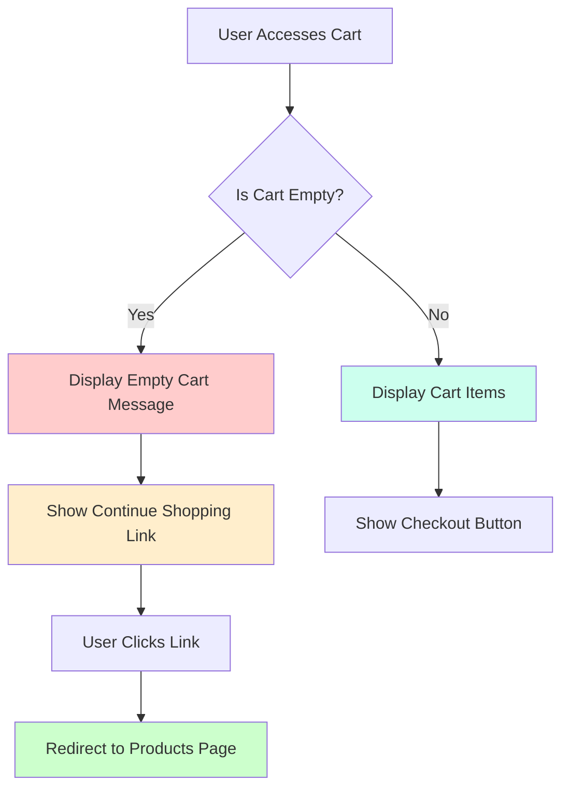

# Low Level Design Document

## 1. Introduction

### 1.1 Purpose
This Low Level Design (LLD) document provides detailed technical specifications for the E-Commerce Platform. It translates the High Level Design into implementable components, defining the internal structure, algorithms, data structures, and interfaces required for development.

### 1.2 Scope
This document covers:
- Detailed component designs
- Class diagrams and data structures
- API specifications
- Database schemas
- Algorithm implementations
- Security implementations
- Error handling mechanisms

### 1.3 Definitions and Acronyms
- **API**: Application Programming Interface
- **DTO**: Data Transfer Object
- **ORM**: Object-Relational Mapping
- **JWT**: JSON Web Token
- **CRUD**: Create, Read, Update, Delete
- **REST**: Representational State Transfer

## 2. System Architecture Overview

### 2.1 Technology Stack
- **Backend**: Node.js with Express.js
- **Database**: PostgreSQL
- **Cache**: Redis
- **Message Queue**: RabbitMQ
- **Search Engine**: Elasticsearch
- **File Storage**: AWS S3
- **Authentication**: JWT

### 2.2 Design Patterns
- **MVC Pattern**: Model-View-Controller for application structure
- **Repository Pattern**: Data access abstraction
- **Factory Pattern**: Object creation
- **Singleton Pattern**: Database connections
- **Observer Pattern**: Event handling
- **Strategy Pattern**: Payment processing

## 3. Detailed Component Design

### 3.1 User Management Module

#### 3.1.1 User Model
```javascript
class User {
  constructor() {
    this.id = null;
    this.email = '';
    this.passwordHash = '';
    this.firstName = '';
    this.lastName = '';
    this.phoneNumber = '';
    this.role = 'customer'; // customer, admin, vendor
    this.isActive = true;
    this.emailVerified = false;
    this.createdAt = null;
    this.updatedAt = null;
    this.lastLoginAt = null;
  }
}
```

#### 3.1.2 User Repository
```javascript
class UserRepository {
  async create(userData) {
    const query = `
      INSERT INTO users (email, password_hash, first_name, last_name, phone_number, role)
      VALUES ($1, $2, $3, $4, $5, $6)
      RETURNING *
    `;
    const values = [
      userData.email,
      userData.passwordHash,
      userData.firstName,
      userData.lastName,
      userData.phoneNumber,
      userData.role
    ];
    return await db.query(query, values);
  }

  async findById(userId) {
    const query = 'SELECT * FROM users WHERE id = $1';
    return await db.query(query, [userId]);
  }

  async findByEmail(email) {
    const query = 'SELECT * FROM users WHERE email = $1';
    return await db.query(query, [email]);
  }

  async update(userId, userData) {
    const query = `
      UPDATE users 
      SET first_name = $1, last_name = $2, phone_number = $3, updated_at = NOW()
      WHERE id = $4
      RETURNING *
    `;
    const values = [userData.firstName, userData.lastName, userData.phoneNumber, userId];
    return await db.query(query, values);
  }

  async delete(userId) {
    const query = 'UPDATE users SET is_active = false WHERE id = $1';
    return await db.query(query, [userId]);
  }
}
```

#### 3.1.3 Authentication Service
```javascript
class AuthenticationService {
  constructor() {
    this.userRepository = new UserRepository();
    this.jwtSecret = process.env.JWT_SECRET;
    this.tokenExpiry = '24h';
  }

  async register(userData) {
    // Validate input
    this.validateRegistrationData(userData);
    
    // Check if user exists
    const existingUser = await this.userRepository.findByEmail(userData.email);
    if (existingUser) {
      throw new Error('User already exists');
    }

    // Hash password
    const passwordHash = await bcrypt.hash(userData.password, 10);
    
    // Create user
    const user = await this.userRepository.create({
      ...userData,
      passwordHash
    });

    // Generate verification token
    const verificationToken = this.generateVerificationToken(user.id);
    
    // Send verification email
    await this.sendVerificationEmail(user.email, verificationToken);

    return user;
  }

  async login(email, password) {
    // Find user
    const user = await this.userRepository.findByEmail(email);
    if (!user) {
      throw new Error('Invalid credentials');
    }

    // Verify password
    const isValidPassword = await bcrypt.compare(password, user.passwordHash);
    if (!isValidPassword) {
      throw new Error('Invalid credentials');
    }

    // Check if user is active
    if (!user.isActive) {
      throw new Error('Account is deactivated');
    }

    // Generate JWT token
    const token = jwt.sign(
      { userId: user.id, email: user.email, role: user.role },
      this.jwtSecret,
      { expiresIn: this.tokenExpiry }
    );

    // Update last login
    await this.userRepository.updateLastLogin(user.id);

    return { user, token };
  }

  async verifyToken(token) {
    try {
      const decoded = jwt.verify(token, this.jwtSecret);
      return decoded;
    } catch (error) {
      throw new Error('Invalid token');
    }
  }

  validateRegistrationData(userData) {
    const emailRegex = /^[^\s@]+@[^\s@]+\.[^\s@]+$/;
    if (!emailRegex.test(userData.email)) {
      throw new Error('Invalid email format');
    }

    if (userData.password.length < 8) {
      throw new Error('Password must be at least 8 characters');
    }

    // Additional validation rules
  }
}
```

### 3.2 Product Catalog Module

#### 3.2.1 Product Model
```javascript
class Product {
  constructor() {
    this.id = null;
    this.name = '';
    this.description = '';
    this.sku = '';
    this.categoryId = null;
    this.brandId = null;
    this.price = 0;
    this.compareAtPrice = 0;
    this.costPrice = 0;
    this.quantity = 0;
    this.weight = 0;
    this.dimensions = {
      length: 0,
      width: 0,
      height: 0
    };
    this.images = [];
    this.attributes = {};
    this.isActive = true;
    this.isFeatured = false;
    this.createdAt = null;
    this.updatedAt = null;
  }
}
```

#### 3.2.2 Product Repository
```javascript
class ProductRepository {
  async create(productData) {
    const query = `
      INSERT INTO products (
        name, description, sku, category_id, brand_id, 
        price, compare_at_price, cost_price, quantity, 
        weight, dimensions, attributes
      )
      VALUES ($1, $2, $3, $4, $5, $6, $7, $8, $9, $10, $11, $12)
      RETURNING *
    `;
    const values = [
      productData.name,
      productData.description,
      productData.sku,
      productData.categoryId,
      productData.brandId,
      productData.price,
      productData.compareAtPrice,
      productData.costPrice,
      productData.quantity,
      productData.weight,
      JSON.stringify(productData.dimensions),
      JSON.stringify(productData.attributes)
    ];
    return await db.query(query, values);
  }

  async findById(productId) {
    const query = `
      SELECT p.*, c.name as category_name, b.name as brand_name
      FROM products p
      LEFT JOIN categories c ON p.category_id = c.id
      LEFT JOIN brands b ON p.brand_id = b.id
      WHERE p.id = $1
    `;
    return await db.query(query, [productId]);
  }

  async search(filters) {
    let query = `
      SELECT p.*, c.name as category_name, b.name as brand_name
      FROM products p
      LEFT JOIN categories c ON p.category_id = c.id
      LEFT JOIN brands b ON p.brand_id = b.id
      WHERE p.is_active = true
    `;
    const values = [];
    let paramCount = 1;

    if (filters.categoryId) {
      query += ` AND p.category_id = $${paramCount}`;
      values.push(filters.categoryId);
      paramCount++;
    }

    if (filters.brandId) {
      query += ` AND p.brand_id = $${paramCount}`;
      values.push(filters.brandId);
      paramCount++;
    }

    if (filters.minPrice) {
      query += ` AND p.price >= $${paramCount}`;
      values.push(filters.minPrice);
      paramCount++;
    }

    if (filters.maxPrice) {
      query += ` AND p.price <= $${paramCount}`;
      values.push(filters.maxPrice);
      paramCount++;
    }

    if (filters.searchTerm) {
      query += ` AND (p.name ILIKE $${paramCount} OR p.description ILIKE $${paramCount})`;
      values.push(`%${filters.searchTerm}%`);
      paramCount++;
    }

    // Sorting
    const sortField = filters.sortBy || 'created_at';
    const sortOrder = filters.sortOrder || 'DESC';
    query += ` ORDER BY p.${sortField} ${sortOrder}`;

    // Pagination
    const limit = filters.limit || 20;
    const offset = filters.offset || 0;
    query += ` LIMIT $${paramCount} OFFSET $${paramCount + 1}`;
    values.push(limit, offset);

    return await db.query(query, values);
  }

  async update(productId, productData) {
    const query = `
      UPDATE products
      SET name = $1, description = $2, price = $3, 
          quantity = $4, updated_at = NOW()
      WHERE id = $5
      RETURNING *
    `;
    const values = [
      productData.name,
      productData.description,
      productData.price,
      productData.quantity,
      productId
    ];
    return await db.query(query, values);
  }

  async updateInventory(productId, quantity) {
    const query = `
      UPDATE products
      SET quantity = quantity + $1, updated_at = NOW()
      WHERE id = $2
      RETURNING *
    `;
    return await db.query(query, [quantity, productId]);
  }
}
```

#### 3.2.3 Product Service
```javascript
class ProductService {
  constructor() {
    this.productRepository = new ProductRepository();
    this.cacheService = new CacheService();
    this.searchService = new SearchService();
  }

  async createProduct(productData) {
    // Validate product data
    this.validateProductData(productData);

    // Generate SKU if not provided
    if (!productData.sku) {
      productData.sku = await this.generateSKU(productData);
    }

    // Create product
    const product = await this.productRepository.create(productData);

    // Index in search engine
    await this.searchService.indexProduct(product);

    // Clear cache
    await this.cacheService.clearProductCache();

    return product;
  }

  async getProduct(productId) {
    // Check cache
    const cacheKey = `product:${productId}`;
    const cachedProduct = await this.cacheService.get(cacheKey);
    if (cachedProduct) {
      return cachedProduct;
    }

    // Fetch from database
    const product = await this.productRepository.findById(productId);
    if (!product) {
      throw new Error('Product not found');
    }

    // Cache the result
    await this.cacheService.set(cacheKey, product, 3600);

    return product;
  }

  async searchProducts(filters) {
    // Use Elasticsearch for complex searches
    if (filters.searchTerm) {
      return await this.searchService.searchProducts(filters);
    }

    // Use database for simple filters
    return await this.productRepository.search(filters);
  }

  async updateProduct(productId, productData) {
    // Validate product data
    this.validateProductData(productData);

    // Update product
    const product = await this.productRepository.update(productId, productData);

    // Update search index
    await this.searchService.updateProduct(product);

    // Clear cache
    await this.cacheService.delete(`product:${productId}`);
    await this.cacheService.clearProductCache();

    return product;
  }

  validateProductData(productData) {
    if (!productData.name || productData.name.length < 3) {
      throw new Error('Product name must be at least 3 characters');
    }

    if (productData.price < 0) {
      throw new Error('Price cannot be negative');
    }

    if (productData.quantity < 0) {
      throw new Error('Quantity cannot be negative');
    }
  }

  async generateSKU(productData) {
    const prefix = productData.categoryId.toString().padStart(3, '0');
    const timestamp = Date.now().toString().slice(-6);
    const random = Math.floor(Math.random() * 1000).toString().padStart(3, '0');
    return `${prefix}-${timestamp}-${random}`;
  }
}
```

### 3.3 Shopping Cart Module

#### 3.3.1 Cart Model
```javascript
class Cart {
  constructor() {
    this.id = null;
    this.userId = null;
    this.sessionId = null;
    this.items = [];
    this.subtotal = 0;
    this.tax = 0;
    this.shipping = 0;
    this.discount = 0;
    this.total = 0;
    this.createdAt = null;
    this.updatedAt = null;
  }
}

class CartItem {
  constructor() {
    this.id = null;
    this.cartId = null;
    this.productId = null;
    this.variantId = null;
    this.quantity = 0;
    this.price = 0;
    this.total = 0;
  }
}
```

#### 3.3.2 Cart Repository
```javascript
class CartRepository {
  async create(cartData) {
    const query = `
      INSERT INTO carts (user_id, session_id)
      VALUES ($1, $2)
      RETURNING *
    `;
    return await db.query(query, [cartData.userId, cartData.sessionId]);
  }

  async findByUserId(userId) {
    const query = `
      SELECT c.*, 
        json_agg(
          json_build_object(
            'id', ci.id,
            'product_id', ci.product_id,
            'quantity', ci.quantity,
            'price', ci.price,
            'product', p.*
          )
        ) as items
      FROM carts c
      LEFT JOIN cart_items ci ON c.id = ci.cart_id
      LEFT JOIN products p ON ci.product_id = p.id
      WHERE c.user_id = $1
      GROUP BY c.id
    `;
    return await db.query(query, [userId]);
  }

  async findBySessionId(sessionId) {
    const query = `
      SELECT c.*, 
        json_agg(
          json_build_object(
            'id', ci.id,
            'product_id', ci.product_id,
            'quantity', ci.quantity,
            'price', ci.price,
            'product', p.*
          )
        ) as items
      FROM carts c
      LEFT JOIN cart_items ci ON c.id = ci.cart_id
      LEFT JOIN products p ON ci.product_id = p.id
      WHERE c.session_id = $1
      GROUP BY c.id
    `;
    return await db.query(query, [sessionId]);
  }

  async addItem(cartId, itemData) {
    const query = `
      INSERT INTO cart_items (cart_id, product_id, variant_id, quantity, price)
      VALUES ($1, $2, $3, $4, $5)
      ON CONFLICT (cart_id, product_id, variant_id) 
      DO UPDATE SET quantity = cart_items.quantity + $4
      RETURNING *
    `;
    const values = [
      cartId,
      itemData.productId,
      itemData.variantId,
      itemData.quantity,
      itemData.price
    ];
    return await db.query(query, values);
  }

  async updateItem(itemId, quantity) {
    const query = `
      UPDATE cart_items
      SET quantity = $1
      WHERE id = $2
      RETURNING *
    `;
    return await db.query(query, [quantity, itemId]);
  }

  async removeItem(itemId) {
    const query = 'DELETE FROM cart_items WHERE id = $1';
    return await db.query(query, [itemId]);
  }

  async clear(cartId) {
    const query = 'DELETE FROM cart_items WHERE cart_id = $1';
    return await db.query(query, [cartId]);
  }
}
```

#### 3.3.3 Cart Service
```javascript
class CartService {
  constructor() {
    this.cartRepository = new CartRepository();
    this.productRepository = new ProductRepository();
    this.pricingService = new PricingService();
  }

  async getCart(userId, sessionId) {
    let cart;
    
    if (userId) {
      cart = await this.cartRepository.findByUserId(userId);
    } else {
      cart = await this.cartRepository.findBySessionId(sessionId);
    }

    if (!cart) {
      cart = await this.cartRepository.create({ userId, sessionId });
    }

    // Calculate totals
    cart = await this.calculateTotals(cart);

    return cart;
  }

  async addItem(userId, sessionId, itemData) {
    // Get or create cart
    const cart = await this.getCart(userId, sessionId);

    // Validate product availability
    const product = await this.productRepository.findById(itemData.productId);
    if (!product) {
      throw new Error('Product not found');
    }

    if (product.quantity < itemData.quantity) {
      throw new Error('Insufficient inventory');
    }

    // Get current price
    itemData.price = product.price;

    // Add item to cart
    await this.cartRepository.addItem(cart.id, itemData);

    // Recalculate totals after adding item
    const updatedCart = await this.getCart(userId, sessionId);
    return await this.calculateTotals(updatedCart);
  }

  async updateItem(userId, sessionId, itemId, quantity) {
    if (quantity <= 0) {
      return await this.removeItem(userId, sessionId, itemId);
    }

    // Validate inventory
    const item = await this.cartRepository.getItem(itemId);
    const product = await this.productRepository.findById(item.productId);
    
    if (product.quantity < quantity) {
      throw new Error('Insufficient inventory');
    }

    // Update item
    await this.cartRepository.updateItem(itemId, quantity);

    // Recalculate totals after updating item
    const updatedCart = await this.getCart(userId, sessionId);
    return await this.calculateTotals(updatedCart);
  }

  async removeItem(userId, sessionId, itemId) {
    await this.cartRepository.removeItem(itemId);
    
    // Recalculate totals after removing item
    const updatedCart = await this.getCart(userId, sessionId);
    return await this.calculateTotals(updatedCart);
  }

  async clearCart(userId, sessionId) {
    const cart = await this.getCart(userId, sessionId);
    await this.cartRepository.clear(cart.id);
    return await this.getCart(userId, sessionId);
  }

  async calculateTotals(cart) {
    let subtotal = 0;

    // Calculate subtotal and individual item totals
    cart.items.forEach(item => {
      item.total = item.price * item.quantity;
      subtotal += item.total;
    });

    cart.subtotal = subtotal;

    // Calculate tax
    cart.tax = await this.pricingService.calculateTax(cart);

    // Calculate shipping
    cart.shipping = await this.pricingService.calculateShipping(cart);

    // Apply discounts
    cart.discount = await this.pricingService.calculateDiscount(cart);

    // Calculate total
    cart.total = cart.subtotal + cart.tax + cart.shipping - cart.discount;

    return cart;
  }

  async mergeCarts(userId, sessionId) {
    const userCart = await this.cartRepository.findByUserId(userId);
    const sessionCart = await this.cartRepository.findBySessionId(sessionId);

    if (!sessionCart || sessionCart.items.length === 0) {
      return userCart;
    }

    if (!userCart) {
      // Transfer session cart to user
      await this.cartRepository.updateCartUser(sessionCart.id, userId);
      return await this.getCart(userId, null);
    }

    // Merge items
    for (const item of sessionCart.items) {
      await this.cartRepository.addItem(userCart.id, {
        productId: item.productId,
        variantId: item.variantId,
        quantity: item.quantity,
        price: item.price
      });
    }

    // Delete session cart
    await this.cartRepository.delete(sessionCart.id);

    return await this.getCart(userId, null);
  }
}
```

#### 3.3.4 Cart UI Redirection Logic for Empty Cart State

**Purpose**: Implement UI redirection logic to handle empty cart state and guide users to continue shopping.

**Business Rule Reference**: story_summary.json: business_logic_rules[1]

**Implementation Details**:

When the shopping cart is empty, the system must provide a clear user experience by redirecting or displaying a "Continue Shopping" link to guide users back to the product catalog.

```javascript
class CartUIService {
  constructor() {
    this.cartService = new CartService();
  }

  async getCartWithUIState(userId, sessionId) {
    const cart = await this.cartService.getCart(userId, sessionId);
    
    // Check if cart is empty
    const isEmpty = !cart.items || cart.items.length === 0;
    
    return {
      ...cart,
      isEmpty,
      uiState: {
        showEmptyCartMessage: isEmpty,
        continueShoppingUrl: isEmpty ? '/products' : null,
        emptyCartMessage: isEmpty ? 'Your cart is empty. Continue shopping to add items.' : null
      }
    };
  }

  async handleEmptyCartRedirection(req, res) {
    const cart = await this.getCartWithUIState(req.user?.id, req.sessionId);
    
    if (cart.isEmpty) {
      // Return response with redirection information
      return res.status(200).json({
        success: true,
        data: cart,
        redirect: {
          required: true,
          url: '/products',
          message: 'Your cart is empty. Redirecting to products...'
        }
      });
    }
    
    return res.status(200).json({
      success: true,
      data: cart
    });
  }
}
```

**Frontend Integration**:

```javascript
// Example frontend handler for empty cart redirection
class CartViewController {
  async loadCart() {
    try {
      const response = await fetch('/api/cart');
      const data = await response.json();
      
      if (data.redirect && data.redirect.required) {
        // Show message and redirect
        this.showMessage(data.redirect.message);
        setTimeout(() => {
          window.location.href = data.redirect.url;
        }, 2000);
      } else {
        this.renderCart(data.data);
      }
    } catch (error) {
      console.error('Error loading cart:', error);
    }
  }
  
  renderCart(cart) {
    if (cart.isEmpty) {
      // Display empty cart UI with continue shopping link
      const emptyCartHTML = `
        <div class="empty-cart">
          <h2>Your Cart is Empty</h2>
          <p>${cart.uiState.emptyCartMessage}</p>
          <a href="${cart.uiState.continueShoppingUrl}" class="btn btn-primary">
            Continue Shopping
          </a>
        </div>
      `;
      document.getElementById('cart-container').innerHTML = emptyCartHTML;
    } else {
      // Render cart items
      this.renderCartItems(cart.items);
    }
  }
}
```

**API Response Format for Empty Cart**:

```json
{
  "success": true,
  "data": {
    "id": 1,
    "items": [],
    "subtotal": 0,
    "tax": 0,
    "shipping": 0,
    "discount": 0,
    "total": 0,
    "isEmpty": true,
    "uiState": {
      "showEmptyCartMessage": true,
      "continueShoppingUrl": "/products",
      "emptyCartMessage": "Your cart is empty. Continue shopping to add items."
    }
  },
  "redirect": {
    "required": true,
    "url": "/products",
    "message": "Your cart is empty. Redirecting to products..."
  }
}
```

**Mermaid Diagram - Empty Cart Redirection Flow**:



### 3.4 Order Management Module

#### 3.4.1 Order Model
```javascript
class Order {
  constructor() {
    this.id = null;
    this.orderNumber = '';
    this.userId = null;
    this.status = 'pending'; // pending, confirmed, processing, shipped, delivered, cancelled
    this.paymentStatus = 'pending'; // pending, paid, failed, refunded
    this.items = [];
    this.subtotal = 0;
    this.tax = 0;
    this.shipping = 0;
    this.discount = 0;
    this.total = 0;
    this.shippingAddress = {};
    this.billingAddress = {};
    this.paymentMethod = '';
    this.shippingMethod = '';
    this.notes = '';
    this.createdAt = null;
    this.updatedAt = null;
  }
}

class OrderItem {
  constructor() {
    this.id = null;
    this.orderId = null;
    this.productId = null;
    this.variantId = null;
    this.quantity = 0;
    this.price = 0;
    this.total = 0;
    this.status = 'pending';
  }
}
```

#### 3.4.2 Order Repository
```javascript
class OrderRepository {
  async create(orderData) {
    const client = await db.getClient();
    
    try {
      await client.query('BEGIN');

      // Create order
      const orderQuery = `
        INSERT INTO orders (
          order_number, user_id, status, payment_status,
          subtotal, tax, shipping, discount, total,
          shipping_address, billing_address,
          payment_method, shipping_method, notes
        )
        VALUES ($1, $2, $3, $4, $5, $6, $7, $8, $9, $10, $11, $12, $13, $14)
        RETURNING *
      `;
      const orderValues = [
        orderData.orderNumber,
        orderData.userId,
        orderData.status,
        orderData.paymentStatus,
        orderData.subtotal,
        orderData.tax,
        orderData.shipping,
        orderData.discount,
        orderData.total,
        JSON.stringify(orderData.shippingAddress),
        JSON.stringify(orderData.billingAddress),
        orderData.paymentMethod,
        orderData.shippingMethod,
        orderData.notes
      ];
      const orderResult = await client.query(orderQuery, orderValues);
      const order = orderResult.rows[0];

      // Create order items
      for (const item of orderData.items) {
        const itemQuery = `
          INSERT INTO order_items (
            order_id, product_id, variant_id, quantity, price, total
          )
          VALUES ($1, $2, $3, $4, $5, $6)
        `;
        const itemValues = [
          order.id,
          item.productId,
          item.variantId,
          item.quantity,
          item.price,
          item.total
        ];
        await client.query(itemQuery, itemValues);

        // Update product inventory
        const inventoryQuery = `
          UPDATE products
          SET quantity = quantity - $1
          WHERE id = $2
        `;
        await client.query(inventoryQuery, [item.quantity, item.productId]);
      }

      await client.query('COMMIT');
      return order;
    } catch (error) {
      await client.query('ROLLBACK');
      throw error;
    } finally {
      client.release();
    }
  }

  async findById(orderId) {
    const query = `
      SELECT o.*,
        json_agg(
          json_build_object(
            'id', oi.id,
            'product_id', oi.product_id,
            'quantity', oi.quantity,
            'price', oi.price,
            'total', oi.total,
            'product', p.*
          )
        ) as items
      FROM orders o
      LEFT JOIN order_items oi ON o.id = oi.order_id
      LEFT JOIN products p ON oi.product_id = p.id
      WHERE o.id = $1
      GROUP BY o.id
    `;
    return await db.query(query, [orderId]);
  }

  async findByUserId(userId, filters = {}) {
    let query = `
      SELECT o.*,
        json_agg(
          json_build_object(
            'id', oi.id,
            'product_id', oi.product_id,
            'quantity', oi.quantity,
            'price', oi.price,
            'total', oi.total
          )
        ) as items
      FROM orders o
      LEFT JOIN order_items oi ON o.id = oi.order_id
      WHERE o.user_id = $1
    `;
    const values = [userId];
    let paramCount = 2;

    if (filters.status) {
      query += ` AND o.status = $${paramCount}`;
      values.push(filters.status);
      paramCount++;
    }

    query += ' GROUP BY o.id ORDER BY o.created_at DESC';

    if (filters.limit) {
      query += ` LIMIT $${paramCount}`;
      values.push(filters.limit);
      paramCount++;
    }

    if (filters.offset) {
      query += ` OFFSET $${paramCount}`;
      values.push(filters.offset);
    }

    return await db.query(query, values);
  }

  async updateStatus(orderId, status) {
    const query = `
      UPDATE orders
      SET status = $1, updated_at = NOW()
      WHERE id = $2
      RETURNING *
    `;
    return await db.query(query, [status, orderId]);
  }

  async updatePaymentStatus(orderId, paymentStatus) {
    const query = `
      UPDATE orders
      SET payment_status = $1, updated_at = NOW()
      WHERE id = $2
      RETURNING *
    `;
    return await db.query(query, [paymentStatus, orderId]);
  }
}
```

#### 3.4.3 Order Service
```javascript
class OrderService {
  constructor() {
    this.orderRepository = new OrderRepository();
    this.cartService = new CartService();
    this.paymentService = new PaymentService();
    this.notificationService = new NotificationService();
    this.inventoryService = new InventoryService();
  }

  async createOrder(userId, orderData) {
    // Get cart
    const cart = await this.cartService.getCart(userId, null);
    if (!cart.items || cart.items.length === 0) {
      throw new Error('Cart is empty');
    }

    // Validate inventory
    await this.inventoryService.validateAvailability(cart.items);

    // Generate order number
    const orderNumber = await this.generateOrderNumber();

    // Prepare order data
    const order = {
      orderNumber,
      userId,
      status: 'pending',
      paymentStatus: 'pending',
      items: cart.items,
      subtotal: cart.subtotal,
      tax: cart.tax,
      shipping: cart.shipping,
      discount: cart.discount,
      total: cart.total,
      shippingAddress: orderData.shippingAddress,
      billingAddress: orderData.billingAddress,
      paymentMethod: orderData.paymentMethod,
      shippingMethod: orderData.shippingMethod,
      notes: orderData.notes || ''
    };

    // Create order
    const createdOrder = await this.orderRepository.create(order);

    // Clear cart
    await this.cartService.clearCart(userId, null);

    // Process payment
    try {
      await this.paymentService.processPayment(createdOrder);
      await this.orderRepository.updatePaymentStatus(createdOrder.id, 'paid');
      await this.orderRepository.updateStatus(createdOrder.id, 'confirmed');
    } catch (error) {
      await this.orderRepository.updatePaymentStatus(createdOrder.id, 'failed');
      throw new Error('Payment failed: ' + error.message);
    }

    // Send confirmation email
    await this.notificationService.sendOrderConfirmation(createdOrder);

    return createdOrder;
  }

  async getOrder(orderId, userId) {
    const order = await this.orderRepository.findById(orderId);
    
    if (!order) {
      throw new Error('Order not found');
    }

    // Verify ownership
    if (order.userId !== userId) {
      throw new Error('Unauthorized access');
    }

    return order;
  }

  async getUserOrders(userId, filters = {}) {
    return await this.orderRepository.findByUserId(userId, filters);
  }

  async updateOrderStatus(orderId, status) {
    const order = await this.orderRepository.updateStatus(orderId, status);

    // Send status update notification
    await this.notificationService.sendOrderStatusUpdate(order);

    return order;
  }

  async cancelOrder(orderId, userId) {
    const order = await this.getOrder(orderId, userId);

    // Check if order can be cancelled
    if (['shipped', 'delivered', 'cancelled'].includes(order.status)) {
      throw new Error('Order cannot be cancelled');
    }

    // Update status
    await this.orderRepository.updateStatus(orderId, 'cancelled');

    // Restore inventory
    await this.inventoryService.restoreInventory(order.items);

    // Process refund if payment was made
    if (order.paymentStatus === 'paid') {
      await this.paymentService.processRefund(order);
      await this.orderRepository.updatePaymentStatus(orderId, 'refunded');
    }

    // Send cancellation notification
    await this.notificationService.sendOrderCancellation(order);

    return order;
  }

  async generateOrderNumber() {
    const prefix = 'ORD';
    const timestamp = Date.now().toString();
    const random = Math.floor(Math.random() * 10000).toString().padStart(4, '0');
    return `${prefix}-${timestamp}-${random}`;
  }
}
```

### 3.5 Payment Processing Module

#### 3.5.1 Payment Service
```javascript
class PaymentService {
  constructor() {
    this.stripeClient = require('stripe')(process.env.STRIPE_SECRET_KEY);
    this.paymentRepository = new PaymentRepository();
  }

  async processPayment(order) {
    try {
      // Create payment intent
      const paymentIntent = await this.stripeClient.paymentIntents.create({
        amount: Math.round(order.total * 100), // Convert to cents
        currency: 'usd',
        payment_method: order.paymentMethod,
        confirm: true,
        metadata: {
          orderId: order.id,
          orderNumber: order.orderNumber
        }
      });

      // Save payment record
      await this.paymentRepository.create({
        orderId: order.id,
        amount: order.total,
        currency: 'usd',
        paymentMethod: order.paymentMethod,
        transactionId: paymentIntent.id,
        status: 'completed'
      });

      return paymentIntent;
    } catch (error) {
      // Save failed payment record
      await this.paymentRepository.create({
        orderId: order.id,
        amount: order.total,
        currency: 'usd',
        paymentMethod: order.paymentMethod,
        status: 'failed',
        errorMessage: error.message
      });

      throw error;
    }
  }

  async processRefund(order) {
    try {
      // Get original payment
      const payment = await this.paymentRepository.findByOrderId(order.id);

      // Create refund
      const refund = await this.stripeClient.refunds.create({
        payment_intent: payment.transactionId,
        amount: Math.round(order.total * 100)
      });

      // Save refund record
      await this.paymentRepository.createRefund({
        paymentId: payment.id,
        amount: order.total,
        transactionId: refund.id,
        status: 'completed'
      });

      return refund;
    } catch (error) {
      throw new Error('Refund failed: ' + error.message);
    }
  }

  async handleWebhook(event) {
    switch (event.type) {
      case 'payment_intent.succeeded':
        await this.handlePaymentSuccess(event.data.object);
        break;
      case 'payment_intent.payment_failed':
        await this.handlePaymentFailure(event.data.object);
        break;
      case 'charge.refunded':
        await this.handleRefund(event.data.object);
        break;
      default:
        console.log(`Unhandled event type: ${event.type}`);
    }
  }

  async handlePaymentSuccess(paymentIntent) {
    const orderId = paymentIntent.metadata.orderId;
    await this.orderRepository.updatePaymentStatus(orderId, 'paid');
    await this.orderRepository.updateStatus(orderId, 'confirmed');
  }

  async handlePaymentFailure(paymentIntent) {
    const orderId = paymentIntent.metadata.orderId;
    await this.orderRepository.updatePaymentStatus(orderId, 'failed');
  }
}
```

## 4. Database Design

### 4.1 Database Schema

```sql
-- Users Table
CREATE TABLE users (
  id SERIAL PRIMARY KEY,
  email VARCHAR(255) UNIQUE NOT NULL,
  password_hash VARCHAR(255) NOT NULL,
  first_name VARCHAR(100),
  last_name VARCHAR(100),
  phone_number VARCHAR(20),
  role VARCHAR(20) DEFAULT 'customer',
  is_active BOOLEAN DEFAULT true,
  email_verified BOOLEAN DEFAULT false,
  created_at TIMESTAMP DEFAULT CURRENT_TIMESTAMP,
  updated_at TIMESTAMP DEFAULT CURRENT_TIMESTAMP,
  last_login_at TIMESTAMP
);

-- Categories Table
CREATE TABLE categories (
  id SERIAL PRIMARY KEY,
  name VARCHAR(100) NOT NULL,
  slug VARCHAR(100) UNIQUE NOT NULL,
  description TEXT,
  parent_id INTEGER REFERENCES categories(id),
  image_url VARCHAR(500),
  is_active BOOLEAN DEFAULT true,
  created_at TIMESTAMP DEFAULT CURRENT_TIMESTAMP,
  updated_at TIMESTAMP DEFAULT CURRENT_TIMESTAMP
);

-- Brands Table
CREATE TABLE brands (
  id SERIAL PRIMARY KEY,
  name VARCHAR(100) NOT NULL,
  slug VARCHAR(100) UNIQUE NOT NULL,
  description TEXT,
  logo_url VARCHAR(500),
  is_active BOOLEAN DEFAULT true,
  created_at TIMESTAMP DEFAULT CURRENT_TIMESTAMP,
  updated_at TIMESTAMP DEFAULT CURRENT_TIMESTAMP
);

-- Products Table
CREATE TABLE products (
  id SERIAL PRIMARY KEY,
  name VARCHAR(255) NOT NULL,
  description TEXT,
  sku VARCHAR(100) UNIQUE NOT NULL,
  category_id INTEGER REFERENCES categories(id),
  brand_id INTEGER REFERENCES brands(id),
  price DECIMAL(10, 2) NOT NULL,
  compare_at_price DECIMAL(10, 2),
  cost_price DECIMAL(10, 2),
  quantity INTEGER DEFAULT 0,
  weight DECIMAL(10, 2),
  dimensions JSONB,
  attributes JSONB,
  is_active BOOLEAN DEFAULT true,
  is_featured BOOLEAN DEFAULT false,
  created_at TIMESTAMP DEFAULT CURRENT_TIMESTAMP,
  updated_at TIMESTAMP DEFAULT CURRENT_TIMESTAMP
);

-- Product Images Table
CREATE TABLE product_images (
  id SERIAL PRIMARY KEY,
  product_id INTEGER REFERENCES products(id) ON DELETE CASCADE,
  image_url VARCHAR(500) NOT NULL,
  alt_text VARCHAR(255),
  position INTEGER DEFAULT 0,
  created_at TIMESTAMP DEFAULT CURRENT_TIMESTAMP
);

-- Carts Table
CREATE TABLE carts (
  id SERIAL PRIMARY KEY,
  user_id INTEGER REFERENCES users(id),
  session_id VARCHAR(255),
  created_at TIMESTAMP DEFAULT CURRENT_TIMESTAMP,
  updated_at TIMESTAMP DEFAULT CURRENT_TIMESTAMP
);

-- Cart Items Table
CREATE TABLE cart_items (
  id SERIAL PRIMARY KEY,
  cart_id INTEGER REFERENCES carts(id) ON DELETE CASCADE,
  product_id INTEGER REFERENCES products(id),
  variant_id INTEGER,
  quantity INTEGER NOT NULL,
  price DECIMAL(10, 2) NOT NULL,
  created_at TIMESTAMP DEFAULT CURRENT_TIMESTAMP,
  updated_at TIMESTAMP DEFAULT CURRENT_TIMESTAMP,
  UNIQUE(cart_id, product_id, variant_id)
);

-- Orders Table
CREATE TABLE orders (
  id SERIAL PRIMARY KEY,
  order_number VARCHAR(50) UNIQUE NOT NULL,
  user_id INTEGER REFERENCES users(id),
  status VARCHAR(20) DEFAULT 'pending',
  payment_status VARCHAR(20) DEFAULT 'pending',
  subtotal DECIMAL(10, 2) NOT NULL,
  tax DECIMAL(10, 2) DEFAULT 0,
  shipping DECIMAL(10, 2) DEFAULT 0,
  discount DECIMAL(10, 2) DEFAULT 0,
  total DECIMAL(10, 2) NOT NULL,
  shipping_address JSONB,
  billing_address JSONB,
  payment_method VARCHAR(50),
  shipping_method VARCHAR(50),
  notes TEXT,
  created_at TIMESTAMP DEFAULT CURRENT_TIMESTAMP,
  updated_at TIMESTAMP DEFAULT CURRENT_TIMESTAMP
);

-- Order Items Table
CREATE TABLE order_items (
  id SERIAL PRIMARY KEY,
  order_id INTEGER REFERENCES orders(id) ON DELETE CASCADE,
  product_id INTEGER REFERENCES products(id),
  variant_id INTEGER,
  quantity INTEGER NOT NULL,
  price DECIMAL(10, 2) NOT NULL,
  total DECIMAL(10, 2) NOT NULL,
  status VARCHAR(20) DEFAULT 'pending',
  created_at TIMESTAMP DEFAULT CURRENT_TIMESTAMP
);

-- Payments Table
CREATE TABLE payments (
  id SERIAL PRIMARY KEY,
  order_id INTEGER REFERENCES orders(id),
  amount DECIMAL(10, 2) NOT NULL,
  currency VARCHAR(3) DEFAULT 'USD',
  payment_method VARCHAR(50),
  transaction_id VARCHAR(255),
  status VARCHAR(20),
  error_message TEXT,
  created_at TIMESTAMP DEFAULT CURRENT_TIMESTAMP
);

-- Addresses Table
CREATE TABLE addresses (
  id SERIAL PRIMARY KEY,
  user_id INTEGER REFERENCES users(id) ON DELETE CASCADE,
  type VARCHAR(20), -- shipping, billing
  first_name VARCHAR(100),
  last_name VARCHAR(100),
  company VARCHAR(100),
  address_line1 VARCHAR(255) NOT NULL,
  address_line2 VARCHAR(255),
  city VARCHAR(100) NOT NULL,
  state VARCHAR(100),
  postal_code VARCHAR(20) NOT NULL,
  country VARCHAR(100) NOT NULL,
  phone_number VARCHAR(20),
  is_default BOOLEAN DEFAULT false,
  created_at TIMESTAMP DEFAULT CURRENT_TIMESTAMP,
  updated_at TIMESTAMP DEFAULT CURRENT_TIMESTAMP
);

-- Reviews Table
CREATE TABLE reviews (
  id SERIAL PRIMARY KEY,
  product_id INTEGER REFERENCES products(id) ON DELETE CASCADE,
  user_id INTEGER REFERENCES users(id),
  rating INTEGER CHECK (rating >= 1 AND rating <= 5),
  title VARCHAR(255),
  comment TEXT,
  is_verified BOOLEAN DEFAULT false,
  is_approved BOOLEAN DEFAULT false,
  created_at TIMESTAMP DEFAULT CURRENT_TIMESTAMP,
  updated_at TIMESTAMP DEFAULT CURRENT_TIMESTAMP
);

-- Indexes
CREATE INDEX idx_products_category ON products(category_id);
CREATE INDEX idx_products_brand ON products(brand_id);
CREATE INDEX idx_products_sku ON products(sku);
CREATE INDEX idx_orders_user ON orders(user_id);
CREATE INDEX idx_orders_status ON orders(status);
CREATE INDEX idx_cart_items_cart ON cart_items(cart_id);
CREATE INDEX idx_order_items_order ON order_items(order_id);
```

### 4.2 Data Access Layer

```javascript
class Database {
  constructor() {
    this.pool = new Pool({
      host: process.env.DB_HOST,
      port: process.env.DB_PORT,
      database: process.env.DB_NAME,
      user: process.env.DB_USER,
      password: process.env.DB_PASSWORD,
      max: 20,
      idleTimeoutMillis: 30000,
      connectionTimeoutMillis: 2000
    });
  }

  async query(text, params) {
    const start = Date.now();
    try {
      const res = await this.pool.query(text, params);
      const duration = Date.now() - start;
      console.log('Executed query', { text, duration, rows: res.rowCount });
      return res.rows;
    } catch (error) {
      console.error('Database query error', { text, error: error.message });
      throw error;
    }
  }

  async getClient() {
    return await this.pool.connect();
  }

  async transaction(callback) {
    const client = await this.getClient();
    try {
      await client.query('BEGIN');
      const result = await callback(client);
      await client.query('COMMIT');
      return result;
    } catch (error) {
      await client.query('ROLLBACK');
      throw error;
    } finally {
      client.release();
    }
  }
}
```

## 5. API Specifications

### 5.1 Authentication APIs

#### POST /api/auth/register
```javascript
// Request
{
  "email": "user@example.com",
  "password": "SecurePass123!",
  "firstName": "John",
  "lastName": "Doe",
  "phoneNumber": "+1234567890"
}

// Response (201 Created)
{
  "success": true,
  "data": {
    "user": {
      "id": 1,
      "email": "user@example.com",
      "firstName": "John",
      "lastName": "Doe",
      "role": "customer"
    },
    "message": "Registration successful. Please verify your email."
  }
}
```

#### POST /api/auth/login
```javascript
// Request
{
  "email": "user@example.com",
  "password": "SecurePass123!"
}

// Response (200 OK)
{
  "success": true,
  "data": {
    "user": {
      "id": 1,
      "email": "user@example.com",
      "firstName": "John",
      "lastName": "Doe",
      "role": "customer"
    },
    "token": "eyJhbGciOiJIUzI1NiIsInR5cCI6IkpXVCJ9..."
  }
}
```

### 5.2 Product APIs

#### GET /api/products
```javascript
// Query Parameters
{
  "categoryId": 1,
  "brandId": 2,
  "minPrice": 10,
  "maxPrice": 100,
  "searchTerm": "laptop",
  "sortBy": "price",
  "sortOrder": "ASC",
  "limit": 20,
  "offset": 0
}

// Response (200 OK)
{
  "success": true,
  "data": {
    "products": [
      {
        "id": 1,
        "name": "Product Name",
        "description": "Product description",
        "sku": "SKU-001",
        "price": 99.99,
        "compareAtPrice": 129.99,
        "quantity": 50,
        "images": [
          {
            "url": "https://example.com/image1.jpg",
            "altText": "Product image"
          }
        ],
        "category": {
          "id": 1,
          "name": "Electronics"
        },
        "brand": {
          "id": 2,
          "name": "Brand Name"
        }
      }
    ],
    "pagination": {
      "total": 100,
      "limit": 20,
      "offset": 0,
      "hasMore": true
    }
  }
}
```

#### GET /api/products/:id
```javascript
// Response (200 OK)
{
  "success": true,
  "data": {
    "id": 1,
    "name": "Product Name",
    "description": "Detailed product description",
    "sku": "SKU-001",
    "price": 99.99,
    "compareAtPrice": 129.99,
    "quantity": 50,
    "weight": 1.5,
    "dimensions": {
      "length": 10,
      "width": 8,
      "height": 2
    },
    "attributes": {
      "color": "Black",
      "size": "Medium"
    },
    "images": [
      {
        "url": "https://example.com/image1.jpg",
        "altText": "Product image"
      }
    ],
    "category": {
      "id": 1,
      "name": "Electronics"
    },
    "brand": {
      "id": 2,
      "name": "Brand Name"
    },
    "reviews": {
      "average": 4.5,
      "count": 120
    }
  }
}
```

### 5.3 Cart APIs

#### GET /api/cart
```javascript
// Response (200 OK) - Cart with Items
{
  "success": true,
  "data": {
    "id": 1,
    "items": [
      {
        "id": 1,
        "productId": 1,
        "quantity": 2,
        "price": 99.99,
        "subtotal": 199.98,
        "product": {
          "id": 1,
          "name": "Product Name",
          "image": "https://example.com/image1.jpg"
        }
      }
    ],
    "subtotal": 199.98,
    "tax": 15.99,
    "shipping": 10.00,
    "discount": 0,
    "total": 225.97,
    "isEmpty": false
  }
}

// Response (200 OK) - Empty Cart with Redirection
{
  "success": true,
  "data": {
    "id": 1,
    "items": [],
    "subtotal": 0,
    "tax": 0,
    "shipping": 0,
    "discount": 0,
    "total": 0,
    "isEmpty": true,
    "uiState": {
      "showEmptyCartMessage": true,
      "continueShoppingUrl": "/products",
      "emptyCartMessage": "Your cart is empty. Continue shopping to add items."
    }
  },
  "redirect": {
    "required": true,
    "url": "/products",
    "message": "Your cart is empty. Redirecting to products..."
  }
}
```

#### POST /api/cart/items
```javascript
// Request
{
  "productId": 1,
  "variantId": null,
  "quantity": 2
}

// Response (200 OK)
{
  "success": true,
  "data": {
    "id": 1,
    "items": [
      {
        "id": 1,
        "productId": 1,
        "quantity": 2,
        "price": 99.99,
        "subtotal": 199.98,
        "product": {
          "id": 1,
          "name": "Product Name",
          "image": "https://example.com/image1.jpg"
        }
      }
    ],
    "subtotal": 199.98,
    "tax": 15.99,
    "shipping": 10.00,
    "total": 225.97
  }
}
```

#### PUT /api/cart/items/:itemId
```javascript
// Request
{
  "quantity": 3
}

// Response (200 OK)
{
  "success": true,
  "data": {
    "id": 1,
    "items": [
      {
        "id": 1,
        "productId": 1,
        "quantity": 3,
        "price": 99.99,
        "subtotal": 299.97,
        "product": {
          "id": 1,
          "name": "Product Name",
          "image": "https://example.com/image1.jpg"
        }
      }
    ],
    "subtotal": 299.97,
    "tax": 23.99,
    "shipping": 10.00,
    "total": 333.96
  }
}
```

#### DELETE /api/cart/items/:itemId
```javascript
// Response (200 OK)
{
  "success": true,
  "data": {
    "id": 1,
    "items": [],
    "subtotal": 0,
    "tax": 0,
    "shipping": 0,
    "total": 0,
    "isEmpty": true,
    "uiState": {
      "showEmptyCartMessage": true,
      "continueShoppingUrl": "/products",
      "emptyCartMessage": "Your cart is empty. Continue shopping to add items."
    }
  }
}
```

### 5.4 Order APIs

#### POST /api/orders
```javascript
// Request
{
  "shippingAddress": {
    "firstName": "John",
    "lastName": "Doe",
    "addressLine1": "123 Main St",
    "city": "New York",
    "state": "NY",
    "postalCode": "10001",
    "country": "USA",
    "phoneNumber": "+1234567890"
  },
  "billingAddress": {
    "firstName": "John",
    "lastName": "Doe",
    "addressLine1": "123 Main St",
    "city": "New York",
    "state": "NY",
    "postalCode": "10001",
    "country": "USA"
  },
  "paymentMethod": "pm_1234567890",
  "shippingMethod": "standard",
  "notes": "Please leave at door"
}

// Response (201 Created)
{
  "success": true,
  "data": {
    "id": 1,
    "orderNumber": "ORD-1234567890-1234",
    "status": "confirmed",
    "paymentStatus": "paid",
    "items": [...],
    "subtotal": 199.98,
    "tax": 15.99,
    "shipping": 10.00,
    "total": 225.97,
    "shippingAddress": {...},
    "billingAddress": {...},
    "createdAt": "2024-01-15T10:30:00Z"
  }
}
```

#### GET /api/orders/:id
```javascript
// Response (200 OK)
{
  "success": true,
  "data": {
    "id": 1,
    "orderNumber": "ORD-1234567890-1234",
    "status": "shipped",
    "paymentStatus": "paid",
    "items": [
      {
        "id": 1,
        "productId": 1,
        "quantity": 2,
        "price": 99.99,
        "total": 199.98,
        "product": {
          "id": 1,
          "name": "Product Name",
          "image": "https://example.com/image1.jpg"
        }
      }
    ],
    "subtotal": 199.98,
    "tax": 15.99,
    "shipping": 10.00,
    "total": 225.97,
    "shippingAddress": {...},
    "billingAddress": {...},
    "trackingNumber": "1Z999AA10123456784",
    "createdAt": "2024-01-15T10:30:00Z",
    "updatedAt": "2024-01-16T14:20:00Z"
  }
}
```

## 6. Security Implementation

### 6.1 Authentication Middleware
```javascript
class AuthMiddleware {
  async authenticate(req, res, next) {
    try {
      // Extract token from header
      const authHeader = req.headers.authorization;
      if (!authHeader || !authHeader.startsWith('Bearer ')) {
        return res.status(401).json({
          success: false,
          error: 'No token provided'
        });
      }

      const token = authHeader.substring(7);

      // Verify token
      const authService = new AuthenticationService();
      const decoded = await authService.verifyToken(token);

      // Attach user to request
      req.user = decoded;
      next();
    } catch (error) {
      return res.status(401).json({
        success: false,
        error: 'Invalid token'
      });
    }
  }

  authorize(...roles) {
    return (req, res, next) => {
      if (!req.user) {
        return res.status(401).json({
          success: false,
          error: 'Not authenticated'
        });
      }

      if (!roles.includes(req.user.role)) {
        return res.status(403).json({
          success: false,
          error: 'Insufficient permissions'
        });
      }

      next();
    };
  }
}
```

### 6.2 Input Validation
```javascript
class ValidationMiddleware {
  validateRegistration(req, res, next) {
    const schema = Joi.object({
      email: Joi.string().email().required(),
      password: Joi.string().min(8).required(),
      firstName: Joi.string().min(2).required(),
      lastName: Joi.string().min(2).required(),
      phoneNumber: Joi.string().pattern(/^\+?[1-9]\d{1,14}$/)
    });

    const { error } = schema.validate(req.body);
    if (error) {
      return res.status(400).json({
        success: false,
        error: error.details[0].message
      });
    }

    next();
  }

  validateProduct(req, res, next) {
    const schema = Joi.object({
      name: Joi.string().min(3).required(),
      description: Joi.string().required(),
      sku: Joi.string().required(),
      categoryId: Joi.number().integer().required(),
      price: Joi.number().positive().required(),
      quantity: Joi.number().integer().min(0).required()
    });

    const { error } = schema.validate(req.body);
    if (error) {
      return res.status(400).json({
        success: false,
        error: error.details[0].message
      });
    }

    next();
  }
}
```

### 6.3 Rate Limiting
```javascript
class RateLimiter {
  constructor() {
    this.redis = new Redis({
      host: process.env.REDIS_HOST,
      port: process.env.REDIS_PORT
    });
  }

  async limit(identifier, maxRequests, windowSeconds) {
    const key = `ratelimit:${identifier}`;
    const current = await this.redis.incr(key);

    if (current === 1) {
      await this.redis.expire(key, windowSeconds);
    }

    if (current > maxRequests) {
      const ttl = await this.redis.ttl(key);
      throw new Error(`Rate limit exceeded. Try again in ${ttl} seconds`);
    }

    return {
      remaining: maxRequests - current,
      reset: Date.now() + (windowSeconds * 1000)
    };
  }

  middleware(maxRequests = 100, windowSeconds = 60) {
    return async (req, res, next) => {
      try {
        const identifier = req.user?.id || req.ip;
        const result = await this.limit(identifier, maxRequests, windowSeconds);
        
        res.setHeader('X-RateLimit-Remaining', result.remaining);
        res.setHeader('X-RateLimit-Reset', result.reset);
        
        next();
      } catch (error) {
        return res.status(429).json({
          success: false,
          error: error.message
        });
      }
    };
  }
}
```

## 7. Error Handling

### 7.1 Error Classes
```javascript
class AppError extends Error {
  constructor(message, statusCode) {
    super(message);
    this.statusCode = statusCode;
    this.isOperational = true;
    Error.captureStackTrace(this, this.constructor);
  }
}

class ValidationError extends AppError {
  constructor(message) {
    super(message, 400);
  }
}

class AuthenticationError extends AppError {
  constructor(message = 'Authentication failed') {
    super(message, 401);
  }
}

class AuthorizationError extends AppError {
  constructor(message = 'Insufficient permissions') {
    super(message, 403);
  }
}

class NotFoundError extends AppError {
  constructor(message = 'Resource not found') {
    super(message, 404);
  }
}

class ConflictError extends AppError {
  constructor(message) {
    super(message, 409);
  }
}
```

### 7.2 Error Handler Middleware
```javascript
class ErrorHandler {
  handle(err, req, res, next) {
    let error = { ...err };
    error.message = err.message;

    // Log error
    console.error(err);

    // Mongoose bad ObjectId
    if (err.name === 'CastError') {
      error = new ValidationError('Invalid ID format');
    }

    // Mongoose duplicate key
    if (err.code === 11000) {
      error = new ConflictError('Duplicate field value');
    }

    // Mongoose validation error
    if (err.name === 'ValidationError') {
      const message = Object.values(err.errors).map(e => e.message).join(', ');
      error = new ValidationError(message);
    }

    // JWT errors
    if (err.name === 'JsonWebTokenError') {
      error = new AuthenticationError('Invalid token');
    }

    if (err.name === 'TokenExpiredError') {
      error = new AuthenticationError('Token expired');
    }

    res.status(error.statusCode || 500).json({
      success: false,
      error: error.message || 'Server Error',
      ...(process.env.NODE_ENV === 'development' && { stack: err.stack })
    });
  }
}
```

## 8. Performance Optimization

### 8.1 Caching Strategy
```javascript
class CacheService {
  constructor() {
    this.redis = new Redis({
      host: process.env.REDIS_HOST,
      port: process.env.REDIS_PORT
    });
  }

  async get(key) {
    try {
      const data = await this.redis.get(key);
      return data ? JSON.parse(data) : null;
    } catch (error) {
      console.error('Cache get error:', error);
      return null;
    }
  }

  async set(key, value, ttl = 3600) {
    try {
      await this.redis.setex(key, ttl, JSON.stringify(value));
    } catch (error) {
      console.error('Cache set error:', error);
    }
  }

  async delete(key) {
    try {
      await this.redis.del(key);
    } catch (error) {
      console.error('Cache delete error:', error);
    }
  }

  async clearPattern(pattern) {
    try {
      const keys = await this.redis.keys(pattern);
      if (keys.length > 0) {
        await this.redis.del(...keys);
      }
    } catch (error) {
      console.error('Cache clear pattern error:', error);
    }
  }

  async clearProductCache() {
    await this.clearPattern('product:*');
    await this.clearPattern('products:*');
  }
}
```

### 8.2 Database Query Optimization
```javascript
class QueryOptimizer {
  // Use connection pooling
  static configurePool() {
    return {
      max: 20,
      min: 5,
      idle: 10000,
      acquire: 30000
    };
  }

  // Implement pagination
  static paginate(query, page = 1, limit = 20) {
    const offset = (page - 1) * limit;
    return query.limit(limit).offset(offset);
  }

  // Use indexes effectively
  static async createIndexes() {
    await db.query('CREATE INDEX IF NOT EXISTS idx_products_category ON products(category_id)');
    await db.query('CREATE INDEX IF NOT EXISTS idx_products_price ON products(price)');
    await db.query('CREATE INDEX IF NOT EXISTS idx_orders_user_status ON orders(user_id, status)');
  }

  // Implement query result caching
  static async cachedQuery(key, query, ttl = 3600) {
    const cacheService = new CacheService();
    
    // Check cache
    let result = await cacheService.get(key);
    if (result) {
      return result;
    }

    // Execute query
    result = await query();

    // Cache result
    await cacheService.set(key, result, ttl);

    return result;
  }
}
```

## 9. Testing Strategy

### 9.1 Unit Tests
```javascript
describe('ProductService', () => {
  let productService;
  let productRepository;
  let cacheService;

  beforeEach(() => {
    productRepository = new ProductRepository();
    cacheService = new CacheService();
    productService = new ProductService();
  });

  describe('createProduct', () => {
    it('should create a product successfully', async () => {
      const productData = {
        name: 'Test Product',
        description: 'Test Description',
        price: 99.99,
        quantity: 10,
        categoryId: 1
      };

      const result = await productService.createProduct(productData);

      expect(result).toBeDefined();
      expect(result.name).toBe(productData.name);
      expect(result.sku).toBeDefined();
    });

    it('should throw error for invalid product data', async () => {
      const productData = {
        name: 'Te', // Too short
        price: -10 // Negative price
      };

      await expect(productService.createProduct(productData))
        .rejects.toThrow(ValidationError);
    });
  });

  describe('getProduct', () => {
    it('should return cached product if available', async () => {
      const productId = 1;
      const cachedProduct = { id: productId, name: 'Cached Product' };
      
      jest.spyOn(cacheService, 'get').mockResolvedValue(cachedProduct);

      const result = await productService.getProduct(productId);

      expect(result).toEqual(cachedProduct);
      expect(cacheService.get).toHaveBeenCalledWith(`product:${productId}`);
    });
  });
});
```

### 9.2 Integration Tests
```javascript
describe('Order API Integration Tests', () => {
  let app;
  let authToken;

  beforeAll(async () => {
    app = await createTestApp();
    authToken = await getTestAuthToken();
  });

  describe('POST /api/orders', () => {
    it('should create an order successfully', async () => {
      const orderData = {
        shippingAddress: {
          firstName: 'John',
          lastName: 'Doe',
          addressLine1: '123 Main St',
          city: 'New York',
          state: 'NY',
          postalCode: '10001',
          country: 'USA'
        },
        paymentMethod: 'pm_test_123',
        shippingMethod: 'standard'
      };

      const response = await request(app)
        .post('/api/orders')
        .set('Authorization', `Bearer ${authToken}`)
        .send(orderData)
        .expect(201);

      expect(response.body.success).toBe(true);
      expect(response.body.data.orderNumber).toBeDefined();
      expect(response.body.data.status).toBe('confirmed');
    });

    it('should return 401 without authentication', async () => {
      const response = await request(app)
        .post('/api/orders')
        .send({})
        .expect(401);

      expect(response.body.success).toBe(false);
    });
  });
});
```

## 10. Deployment Architecture

### 10.1 Docker Configuration
```dockerfile
# Dockerfile
FROM node:18-alpine

WORKDIR /app

COPY package*.json ./
RUN npm ci --only=production

COPY . .

EXPOSE 3000

CMD ["node", "server.js"]
```

```yaml
# docker-compose.yml
version: '3.8'

services:
  app:
    build: .
    ports:
      - "3000:3000"
    environment:
      - NODE_ENV=production
      - DB_HOST=postgres
      - REDIS_HOST=redis
    depends_on:
      - postgres
      - redis

  postgres:
    image: postgres:15
    environment:
      - POSTGRES_DB=ecommerce
      - POSTGRES_USER=admin
      - POSTGRES_PASSWORD=password
    volumes:
      - postgres_data:/var/lib/postgresql/data

  redis:
    image: redis:7-alpine
    volumes:
      - redis_data:/data

  nginx:
    image: nginx:alpine
    ports:
      - "80:80"
      - "443:443"
    volumes:
      - ./nginx.conf:/etc/nginx/nginx.conf
    depends_on:
      - app

volumes:
  postgres_data:
  redis_data:
```

### 10.2 CI/CD Pipeline
```yaml
# .github/workflows/deploy.yml
name: Deploy

on:
  push:
    branches: [main]

jobs:
  test:
    runs-on: ubuntu-latest
    steps:
      - uses: actions/checkout@v2
      - uses: actions/setup-node@v2
        with:
          node-version: '18'
      - run: npm ci
      - run: npm test

  build:
    needs: test
    runs-on: ubuntu-latest
    steps:
      - uses: actions/checkout@v2
      - uses: docker/build-push-action@v2
        with:
          push: true
          tags: myapp:latest

  deploy:
    needs: build
    runs-on: ubuntu-latest
    steps:
      - name: Deploy to production
        run: |
          kubectl apply -f k8s/
          kubectl rollout status deployment/app
```

## 11. Monitoring and Logging

### 11.1 Logging Service
```javascript
class Logger {
  constructor() {
    this.winston = require('winston');
    this.logger = this.winston.createLogger({
      level: 'info',
      format: this.winston.format.json(),
      transports: [
        new this.winston.transports.File({ filename: 'error.log', level: 'error' }),
        new this.winston.transports.File({ filename: 'combined.log' })
      ]
    });

    if (process.env.NODE_ENV !== 'production') {
      this.logger.add(new this.winston.transports.Console({
        format: this.winston.format.simple()
      }));
    }
  }

  info(message, meta = {}) {
    this.logger.info(message, meta);
  }

  error(message, error = {}) {
    this.logger.error(message, {
      error: error.message,
      stack: error.stack,
      ...error
    });
  }

  warn(message, meta = {}) {
    this.logger.warn(message, meta);
  }
}
```

### 11.2 Performance Monitoring
```javascript
class PerformanceMonitor {
  trackRequest(req, res, next) {
    const start = Date.now();

    res.on('finish', () => {
      const duration = Date.now() - start;
      const log = {
        method: req.method,
        url: req.url,
        status: res.statusCode,
        duration,
        userAgent: req.get('user-agent'),
        ip: req.ip
      };

      logger.info('Request completed', log);

      // Send metrics to monitoring service
      this.sendMetrics(log);
    });

    next();
  }

  sendMetrics(data) {
    // Send to monitoring service (e.g., Prometheus, DataDog)
  }
}
```

## 12. Conclusion

This Low Level Design document provides comprehensive technical specifications for implementing the E-Commerce Platform. It covers all major components including user management, product catalog, shopping cart, order management, and payment processing. The design emphasizes scalability, security, and maintainability through the use of established design patterns and best practices.

Key implementation considerations:
- Follow the repository pattern for data access
- Implement comprehensive error handling
- Use caching strategically for performance
- Maintain security through authentication and authorization
- Write tests for all critical functionality
- Monitor application performance and errors
- Use containerization for consistent deployments

This design serves as a blueprint for the development team to implement the system according to specifications.