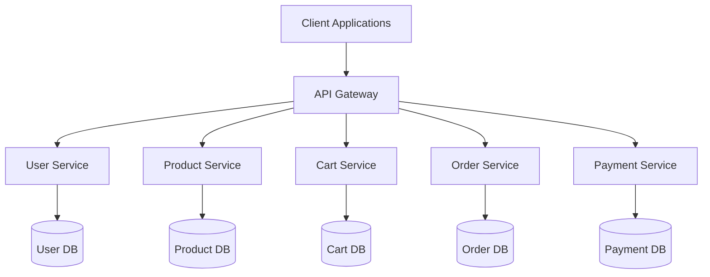
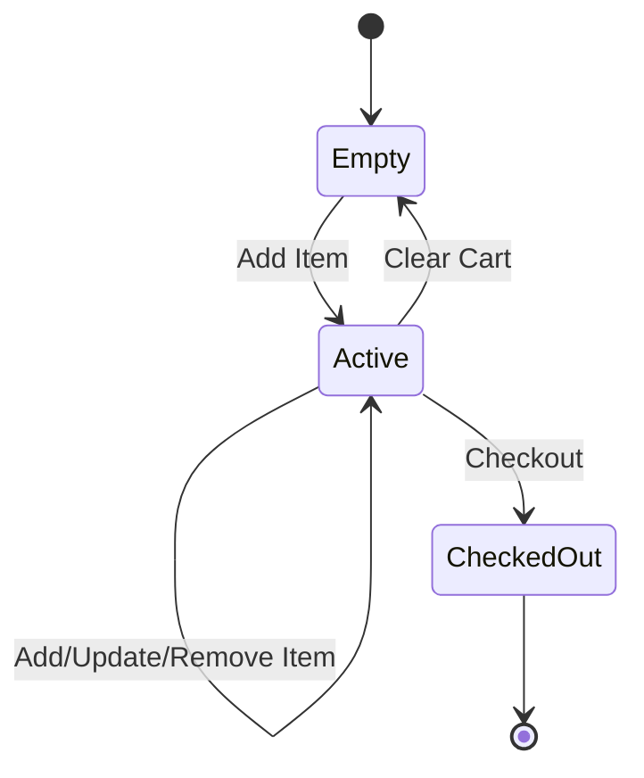

# Low Level Design Document
## E-Commerce Platform

### Version: 2.0
### Date: 2024

---

## Table of Contents
1. [Introduction](#1-introduction)
2. [System Architecture](#2-system-architecture)
3. [Module Design](#3-module-design)
   - 3.1 [User Management Module](#31-user-management-module)
   - 3.2 [Product Catalog Module](#32-product-catalog-module)
   - 3.3 [Shopping Cart Module](#33-shopping-cart-module)
   - 3.4 [Order Management Module](#34-order-management-module)
   - 3.5 [Payment Processing Module](#35-payment-processing-module)
4. [Database Design](#4-database-design)
5. [API Specifications](#5-api-specifications)
6. [Security](#6-security)
7. [Error Handling](#7-error-handling)
8. [Performance Optimization](#8-performance-optimization)
9. [Testing Strategy](#9-testing-strategy)
10. [Deployment](#10-deployment)
11. [Monitoring and Logging](#11-monitoring-and-logging)

---

## 1. Introduction

### 1.1 Purpose
This Low Level Design (LLD) document provides detailed technical specifications for the E-Commerce Platform. It describes the internal structure, components, interfaces, and data flow of the system.

### 1.2 Scope
This document covers the detailed design of all major modules including user management, product catalog, shopping cart, order management, and payment processing.

### 1.3 Definitions and Acronyms
- **API**: Application Programming Interface
- **REST**: Representational State Transfer
- **JWT**: JSON Web Token
- **CRUD**: Create, Read, Update, Delete
- **LLD**: Low Level Design

---

## 2. System Architecture

### 2.1 Architecture Overview
The system follows a microservices architecture pattern with the following key components:



### 2.2 Technology Stack
- **Backend**: Node.js with Express.js
- **Database**: PostgreSQL (primary), Redis (cache)
- **Message Queue**: RabbitMQ
- **Authentication**: JWT
- **API Documentation**: Swagger/OpenAPI

---

## 3. Module Design

### 3.1 User Management Module

#### 3.1.1 Overview
Handles user registration, authentication, profile management, and authorization.

#### 3.1.2 Components
- **UserController**: Handles HTTP requests
- **UserService**: Business logic layer
- **UserRepository**: Data access layer
- **AuthMiddleware**: JWT validation

#### 3.1.3 User Model
```javascript
class User {
  constructor() {
    this.id = null;              // UUID
    this.email = '';             // String, unique
    this.password_hash = '';     // String, bcrypt hashed
    this.first_name = '';        // String
    this.last_name = '';         // String
    this.phone = '';             // String
    this.role = 'customer';      // Enum: customer, admin
    this.created_at = null;      // Timestamp
    this.updated_at = null;      // Timestamp
    this.is_active = true;       // Boolean
  }
}
```

#### 3.1.4 User API Endpoints
- `POST /api/v1/users/register` - User registration
- `POST /api/v1/users/login` - User authentication
- `GET /api/v1/users/profile` - Get user profile
- `PUT /api/v1/users/profile` - Update user profile
- `POST /api/v1/users/logout` - User logout

---

### 3.2 Product Catalog Module

#### 3.2.1 Overview
Manages product information, categories, inventory, and search functionality.

#### 3.2.2 Components
- **ProductController**: Handles product-related requests
- **ProductService**: Product business logic
- **ProductRepository**: Product data access
- **CategoryService**: Category management
- **SearchService**: Product search functionality

#### 3.2.3 Product Model
```javascript
class Product {
  constructor() {
    this.id = null;              // UUID
    this.name = '';              // String
    this.description = '';       // Text
    this.price = 0.00;           // Decimal(10,2)
    this.category_id = null;     // UUID
    this.sku = '';               // String, unique
    this.stock_quantity = 0;     // Integer
    this.images = [];            // Array of image URLs
    this.is_active = true;       // Boolean
    this.created_at = null;      // Timestamp
    this.updated_at = null;      // Timestamp
  }
}
```

#### 3.2.4 Product API Endpoints
- `GET /api/v1/products` - List products with pagination
- `GET /api/v1/products/:id` - Get product details
- `POST /api/v1/products` - Create product (admin)
- `PUT /api/v1/products/:id` - Update product (admin)
- `DELETE /api/v1/products/:id` - Delete product (admin)
- `GET /api/v1/products/search` - Search products

---

### 3.3 Shopping Cart Module

#### 3.3.1 Overview
Manages shopping cart operations including adding items, updating quantities, and cart persistence.

#### 3.3.2 Components
- **CartController**: Handles cart-related HTTP requests
- **CartService**: Cart business logic and validation
- **CartRepository**: Cart data access layer
- **CartItemValidator**: Validates cart item operations

#### 3.3.3 Cart Models

##### Cart Model
```javascript
class Cart {
  constructor() {
    this.id = null;              // UUID
    this.user_id = null;         // UUID
    this.items = [];             // Array of CartItem
    this.total_amount = 0.00;    // Decimal(10,2)
    this.created_at = null;      // Timestamp
    this.updated_at = null;      // Timestamp
  }
}
```

##### CartItem Model
```javascript
class CartItem {
  constructor() {
    this.id = null;              // UUID
    this.cart_id = null;         // UUID
    this.product_id = null;      // UUID - Product reference
    this.quantity = 1;           // Integer - Item quantity
    this.price = 0.00;           // Decimal(10,2) - Item price
    this.user_id = null;         // UUID - User reference
    this.created_at = null;      // Timestamp
    this.updated_at = null;      // Timestamp
  }
}
```

#### 3.3.4 Cart API Contracts

##### REQ-CART-001: Add Item to Cart
**Endpoint**: `POST /api/v1/cart/add`

**Description**: Add item to cart with quantity and product details

**Request Body**:
```json
{
  "product_id": "uuid",
  "quantity": 1,
  "price": 29.99
}
```

**Response** (200 OK):
```json
{
  "success": true,
  "data": {
    "cart_id": "uuid",
    "item": {
      "id": "uuid",
      "product_id": "uuid",
      "quantity": 1,
      "price": 29.99,
      "user_id": "uuid"
    },
    "total_items": 3,
    "total_amount": 89.97
  }
}
```

**Validation Rules**:
- product_id must be valid UUID
- quantity must be positive integer
- price must be positive decimal
- Product must exist and be active
- Sufficient stock must be available

##### Get Cart
**Endpoint**: `GET /api/v1/cart`

**Description**: Retrieve current user's cart with all items

**Response** (200 OK):
```json
{
  "success": true,
  "data": {
    "id": "uuid",
    "user_id": "uuid",
    "items": [
      {
        "id": "uuid",
        "product_id": "uuid",
        "product_name": "Product Name",
        "quantity": 2,
        "price": 29.99,
        "subtotal": 59.98
      }
    ],
    "total_amount": 89.97,
    "total_items": 3
  }
}
```

##### REQ-CART-002: Update Cart Item Quantity
**Endpoint**: `PUT /api/v1/cart/update`

**Description**: Update the quantity of an item in the cart

**Request Body**:
```json
{
  "item_id": "uuid",
  "quantity": 3
}
```

**Response** (200 OK):
```json
{
  "success": true,
  "data": {
    "item": {
      "id": "uuid",
      "product_id": "uuid",
      "quantity": 3,
      "price": 29.99,
      "subtotal": 89.97
    },
    "cart_total": 119.96
  }
}
```

**Validation Rules**:
- item_id must be valid UUID
- item must belong to user's cart
- quantity must be positive integer
- max quantity 99
- Sufficient stock must be available for new quantity

##### Remove Item from Cart
**Endpoint**: `DELETE /api/v1/cart/items/:item_id`

**Description**: Remove an item from the cart

**Response** (200 OK):
```json
{
  "success": true,
  "message": "Item removed from cart",
  "data": {
    "cart_total": 59.98,
    "total_items": 2
  }
}
```

##### Clear Cart
**Endpoint**: `DELETE /api/v1/cart/clear`

**Description**: Remove all items from the cart

**Response** (200 OK):
```json
{
  "success": true,
  "message": "Cart cleared successfully"
}
```

#### 3.3.5 Cart Service Implementation

```javascript
class CartService {
  constructor(cartRepository, productService) {
    this.cartRepository = cartRepository;
    this.productService = productService;
  }

  async addItemToCart(userId, productId, quantity, price) {
    // Validate product exists and is active
    const product = await this.productService.getProduct(productId);
    if (!product || !product.is_active) {
      throw new Error('Product not found or inactive');
    }

    // Check stock availability
    if (product.stock_quantity < quantity) {
      throw new Error('Insufficient stock');
    }

    // Get or create cart
    let cart = await this.cartRepository.getCartByUserId(userId);
    if (!cart) {
      cart = await this.cartRepository.createCart(userId);
    }

    // Check if item already exists in cart
    const existingItem = cart.items.find(item => item.product_id === productId);
    
    if (existingItem) {
      // Update quantity
      const newQuantity = existingItem.quantity + quantity;
      return await this.updateCartItemQuantity(userId, existingItem.id, newQuantity);
    } else {
      // Add new item
      const cartItem = await this.cartRepository.addItem({
        cart_id: cart.id,
        product_id: productId,
        quantity: quantity,
        price: price,
        user_id: userId
      });

      // Recalculate cart total
      await this.recalculateCartTotal(cart.id);

      return cartItem;
    }
  }

  async updateCartItemQuantity(userId, itemId, quantity) {
    // Validate quantity
    if (quantity <= 0) {
      throw new Error('Quantity must be positive integer');
    }

    if (quantity > 99) {
      throw new Error('Maximum quantity is 99');
    }

    // Get cart item
    const item = await this.cartRepository.getItem(itemId);
    if (!item) {
      throw new Error('Cart item not found');
    }

    // Verify ownership
    const cart = await this.cartRepository.getCartById(item.cart_id);
    if (cart.user_id !== userId) {
      throw new Error('Unauthorized access to cart item');
    }

    // Check stock availability
    const product = await this.productService.getProduct(item.product_id);
    if (product.stock_quantity < quantity) {
      throw new Error('Insufficient stock');
    }

    // Update item
    const updatedItem = await this.cartRepository.updateItemQuantity(itemId, quantity);

    // Recalculate cart total
    await this.recalculateCartTotal(cart.id);

    return updatedItem;
  }

  async removeItemFromCart(userId, itemId) {
    const item = await this.cartRepository.getItem(itemId);
    if (!item) {
      throw new Error('Cart item not found');
    }

    const cart = await this.cartRepository.getCartById(item.cart_id);
    if (cart.user_id !== userId) {
      throw new Error('Unauthorized access to cart item');
    }

    await this.cartRepository.removeItem(itemId);
    await this.recalculateCartTotal(cart.id);

    return true;
  }

  async getCart(userId) {
    const cart = await this.cartRepository.getCartByUserId(userId);
    if (!cart) {
      return await this.cartRepository.createCart(userId);
    }
    return cart;
  }

  async clearCart(userId) {
    const cart = await this.cartRepository.getCartByUserId(userId);
    if (cart) {
      await this.cartRepository.clearCart(cart.id);
    }
    return true;
  }

  async recalculateCartTotal(cartId) {
    const cart = await this.cartRepository.getCartById(cartId);
    const total = cart.items.reduce((sum, item) => {
      return sum + (item.price * item.quantity);
    }, 0);

    await this.cartRepository.updateCartTotal(cartId, total);
    return total;
  }
}
```

#### 3.3.6 Cart Validation Rules

1. **Product Validation**
   - Product must exist in the system
   - Product must be active
   - Product must have sufficient stock

2. **Quantity Validation**
   - Quantity must be positive integer
   - Maximum quantity per item: 99
   - Minimum quantity: 1

3. **Price Validation**
   - Price must match current product price
   - Price must be positive decimal

4. **Cart Ownership**
   - Users can only access their own carts
   - Cart items must belong to the requesting user

#### 3.3.7 Cart State Management



---

### 3.4 Order Management Module

#### 3.4.1 Overview
Handles order creation, processing, tracking, and fulfillment.

#### 3.4.2 Components
- **OrderController**: Handles order-related requests
- **OrderService**: Order business logic
- **OrderRepository**: Order data access
- **OrderStatusManager**: Manages order state transitions

#### 3.4.3 Order Model
```javascript
class Order {
  constructor() {
    this.id = null;              // UUID
    this.user_id = null;         // UUID
    this.order_number = '';      // String, unique
    this.status = 'pending';     // Enum: pending, confirmed, shipped, delivered, cancelled
    this.items = [];             // Array of OrderItem
    this.subtotal = 0.00;        // Decimal(10,2)
    this.tax = 0.00;             // Decimal(10,2)
    this.shipping = 0.00;        // Decimal(10,2)
    this.total = 0.00;           // Decimal(10,2)
    this.shipping_address = {};  // JSON
    this.billing_address = {};   // JSON
    this.payment_method = '';    // String
    this.created_at = null;      // Timestamp
    this.updated_at = null;      // Timestamp
  }
}
```

#### 3.4.4 Order API Endpoints
- `POST /api/v1/orders` - Create order from cart
- `GET /api/v1/orders` - List user orders
- `GET /api/v1/orders/:id` - Get order details
- `PUT /api/v1/orders/:id/cancel` - Cancel order
- `GET /api/v1/orders/:id/track` - Track order status

---

### 3.5 Payment Processing Module

#### 3.5.1 Overview
Handles payment processing, validation, and transaction management.

#### 3.5.2 Components
- **PaymentController**: Handles payment requests
- **PaymentService**: Payment business logic
- **PaymentGateway**: Integration with payment providers
- **TransactionRepository**: Transaction data access

#### 3.5.3 Payment Model
```javascript
class Payment {
  constructor() {
    this.id = null;              // UUID
    this.order_id = null;        // UUID
    this.amount = 0.00;          // Decimal(10,2)
    this.currency = 'USD';       // String
    this.payment_method = '';    // String
    this.status = 'pending';     // Enum: pending, completed, failed, refunded
    this.transaction_id = '';    // String
    this.gateway_response = {};  // JSON
    this.created_at = null;      // Timestamp
    this.updated_at = null;      // Timestamp
  }
}
```

#### 3.5.4 Payment API Endpoints
- `POST /api/v1/payments/process` - Process payment
- `GET /api/v1/payments/:id` - Get payment details
- `POST /api/v1/payments/:id/refund` - Refund payment

---

## 4. Database Design

### 4.1 Database Schema

#### Users Table
```sql
CREATE TABLE users (
    id UUID PRIMARY KEY DEFAULT gen_random_uuid(),
    email VARCHAR(255) UNIQUE NOT NULL,
    password_hash VARCHAR(255) NOT NULL,
    first_name VARCHAR(100),
    last_name VARCHAR(100),
    phone VARCHAR(20),
    role VARCHAR(20) DEFAULT 'customer',
    is_active BOOLEAN DEFAULT true,
    created_at TIMESTAMP DEFAULT CURRENT_TIMESTAMP,
    updated_at TIMESTAMP DEFAULT CURRENT_TIMESTAMP
);
```

#### Products Table
```sql
CREATE TABLE products (
    id UUID PRIMARY KEY DEFAULT gen_random_uuid(),
    name VARCHAR(255) NOT NULL,
    description TEXT,
    price DECIMAL(10,2) NOT NULL,
    category_id UUID REFERENCES categories(id),
    sku VARCHAR(100) UNIQUE NOT NULL,
    stock_quantity INTEGER DEFAULT 0,
    images JSONB,
    is_active BOOLEAN DEFAULT true,
    created_at TIMESTAMP DEFAULT CURRENT_TIMESTAMP,
    updated_at TIMESTAMP DEFAULT CURRENT_TIMESTAMP
);
```

#### Carts Table
```sql
CREATE TABLE carts (
    id UUID PRIMARY KEY DEFAULT gen_random_uuid(),
    user_id UUID REFERENCES users(id) ON DELETE CASCADE,
    total_amount DECIMAL(10,2) DEFAULT 0.00,
    created_at TIMESTAMP DEFAULT CURRENT_TIMESTAMP,
    updated_at TIMESTAMP DEFAULT CURRENT_TIMESTAMP,
    UNIQUE(user_id)
);
```

#### Cart Items Table
```sql
CREATE TABLE cart_items (
    id UUID PRIMARY KEY DEFAULT gen_random_uuid(),
    cart_id UUID REFERENCES carts(id) ON DELETE CASCADE,
    product_id UUID REFERENCES products(id),
    quantity INTEGER NOT NULL CHECK (quantity > 0 AND quantity <= 99),
    price DECIMAL(10,2) NOT NULL,
    user_id UUID REFERENCES users(id),
    created_at TIMESTAMP DEFAULT CURRENT_TIMESTAMP,
    updated_at TIMESTAMP DEFAULT CURRENT_TIMESTAMP,
    UNIQUE(cart_id, product_id)
);
```

#### Orders Table
```sql
CREATE TABLE orders (
    id UUID PRIMARY KEY DEFAULT gen_random_uuid(),
    user_id UUID REFERENCES users(id),
    order_number VARCHAR(50) UNIQUE NOT NULL,
    status VARCHAR(20) DEFAULT 'pending',
    subtotal DECIMAL(10,2) NOT NULL,
    tax DECIMAL(10,2) DEFAULT 0.00,
    shipping DECIMAL(10,2) DEFAULT 0.00,
    total DECIMAL(10,2) NOT NULL,
    shipping_address JSONB,
    billing_address JSONB,
    payment_method VARCHAR(50),
    created_at TIMESTAMP DEFAULT CURRENT_TIMESTAMP,
    updated_at TIMESTAMP DEFAULT CURRENT_TIMESTAMP
);
```

### 4.2 Indexes
```sql
CREATE INDEX idx_users_email ON users(email);
CREATE INDEX idx_products_category ON products(category_id);
CREATE INDEX idx_products_sku ON products(sku);
CREATE INDEX idx_carts_user ON carts(user_id);
CREATE INDEX idx_cart_items_cart ON cart_items(cart_id);
CREATE INDEX idx_cart_items_product ON cart_items(product_id);
CREATE INDEX idx_orders_user ON orders(user_id);
CREATE INDEX idx_orders_status ON orders(status);
```

---

## 5. API Specifications

### 5.1 API Standards
- RESTful API design principles
- JSON request/response format
- HTTP status codes for responses
- API versioning (v1, v2, etc.)

### 5.2 Common Response Format
```json
{
  "success": true,
  "data": {},
  "message": "Operation successful",
  "errors": []
}
```

### 5.3 Authentication
All protected endpoints require JWT token in Authorization header:
```
Authorization: Bearer <jwt_token>
```

---

## 6. Security

### 6.1 Authentication & Authorization
- JWT-based authentication
- Role-based access control (RBAC)
- Password hashing using bcrypt
- Session management

### 6.2 Data Protection
- HTTPS/TLS encryption
- SQL injection prevention
- XSS protection
- CSRF tokens
- Input validation and sanitization

### 6.3 API Security
- Rate limiting
- API key validation
- Request throttling
- CORS configuration

---

## 7. Error Handling

### 7.1 Error Response Format
```json
{
  "success": false,
  "error": {
    "code": "ERROR_CODE",
    "message": "Human readable error message",
    "details": {}
  }
}
```

### 7.2 HTTP Status Codes
- 200: Success
- 201: Created
- 400: Bad Request
- 401: Unauthorized
- 403: Forbidden
- 404: Not Found
- 409: Conflict
- 500: Internal Server Error

### 7.3 Error Categories
- Validation Errors
- Authentication Errors
- Authorization Errors
- Business Logic Errors
- System Errors

---

## 8. Performance Optimization

### 8.1 Caching Strategy
- Redis for session storage
- Product catalog caching
- API response caching
- Cache invalidation policies

### 8.2 Database Optimization
- Query optimization
- Proper indexing
- Connection pooling
- Read replicas for scaling

### 8.3 API Optimization
- Pagination for list endpoints
- Field filtering
- Compression (gzip)
- CDN for static assets

---

## 9. Testing Strategy

### 9.1 Unit Testing
- Test individual functions and methods
- Mock external dependencies
- Code coverage target: 80%+

### 9.2 Integration Testing
- Test API endpoints
- Test database interactions
- Test service integrations

### 9.3 End-to-End Testing
- Test complete user flows
- Test critical business scenarios
- Automated testing with Selenium/Cypress

---

## 10. Deployment

### 10.1 Deployment Architecture
- Containerized deployment (Docker)
- Kubernetes orchestration
- CI/CD pipeline
- Blue-green deployment strategy

### 10.2 Environment Configuration
- Development
- Staging
- Production
- Environment variables management

---

## 11. Monitoring and Logging

### 11.1 Logging
- Structured logging (JSON format)
- Log levels: ERROR, WARN, INFO, DEBUG
- Centralized log aggregation
- Log retention policies

### 11.2 Monitoring
- Application performance monitoring (APM)
- Infrastructure monitoring
- Database monitoring
- Alert configuration

### 11.3 Metrics
- Request rate
- Response time
- Error rate
- System resource usage
- Business metrics (orders, revenue, etc.)

---

## Appendix

### A. Glossary
- **Cart**: Temporary storage for products before checkout
- **Order**: Confirmed purchase transaction
- **SKU**: Stock Keeping Unit
- **JWT**: JSON Web Token for authentication

### B. References
- REST API Design Guidelines
- PostgreSQL Documentation
- Node.js Best Practices
- Security Best Practices

### C. Change Log

#### Version 2.0 - Current
- **REQ-CART-001**: Added new Cart API endpoint `/api/v1/cart/add` (POST method)
- **REQ-CART-001**: Added CartItem model with fields: product_id, quantity, price, user_id
- **REQ-CART-002**: Updated cart item quantity validation for endpoint `/api/v1/cart/update`
- **REQ-CART-002**: Added validation rules: quantity must be positive integer, max quantity 99
- **REQ-CART-003**: Removed deprecated endpoint `/api/v1/cart/merge` (Functionality moved to cart sync service)

#### Version 1.0
- Initial LLD document
- Core modules design
- Database schema
- API specifications

---

**Document End**