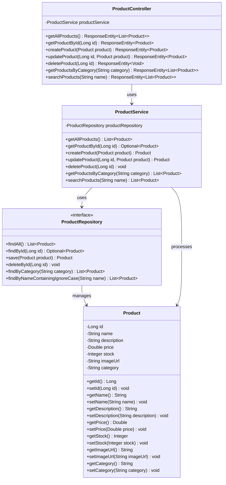
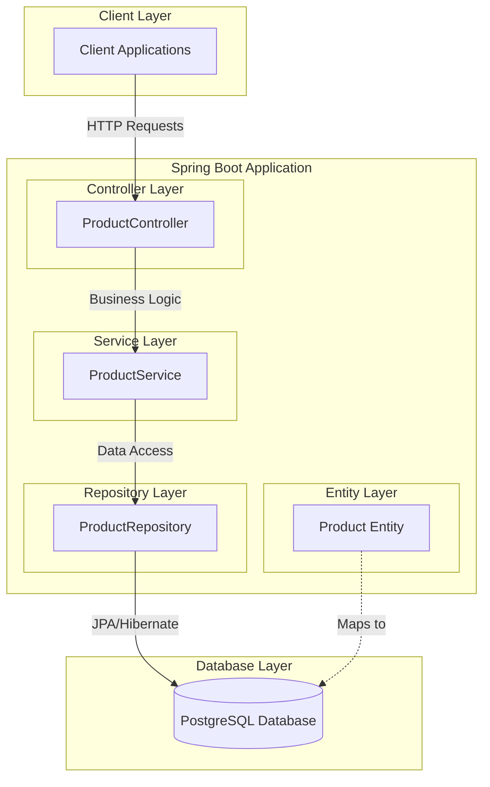
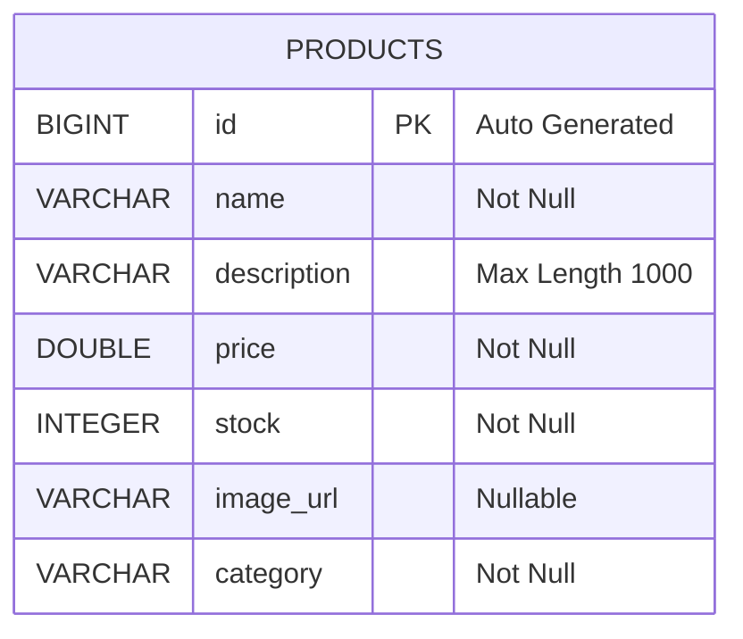
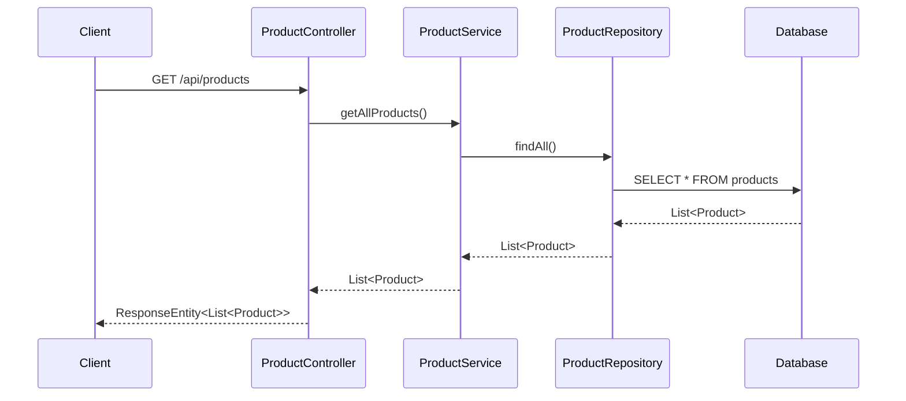
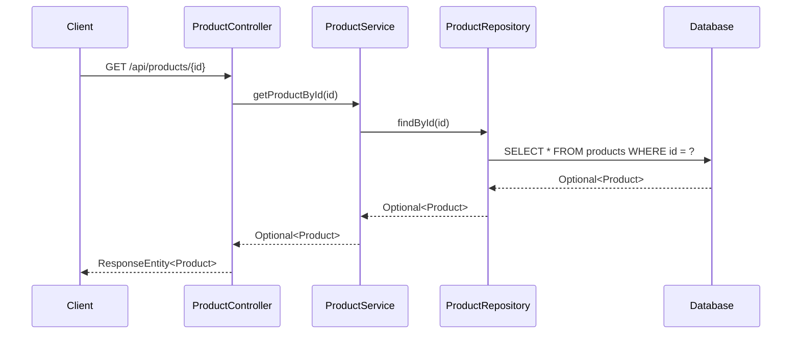
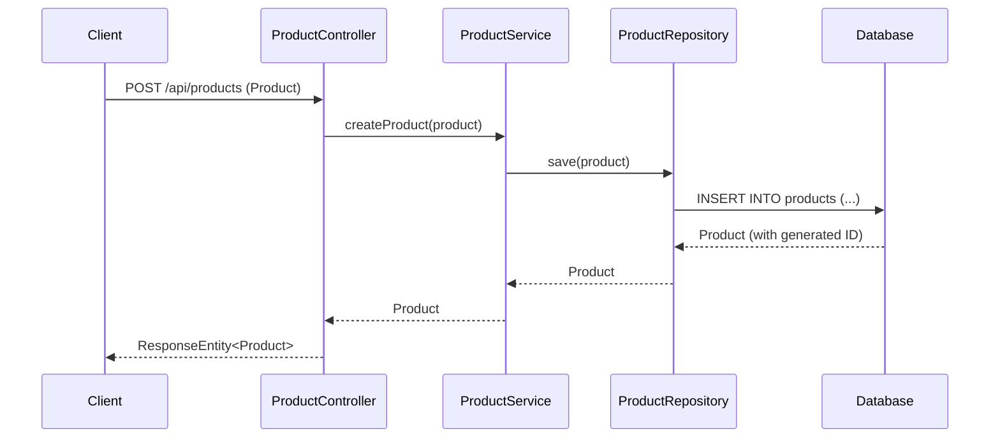
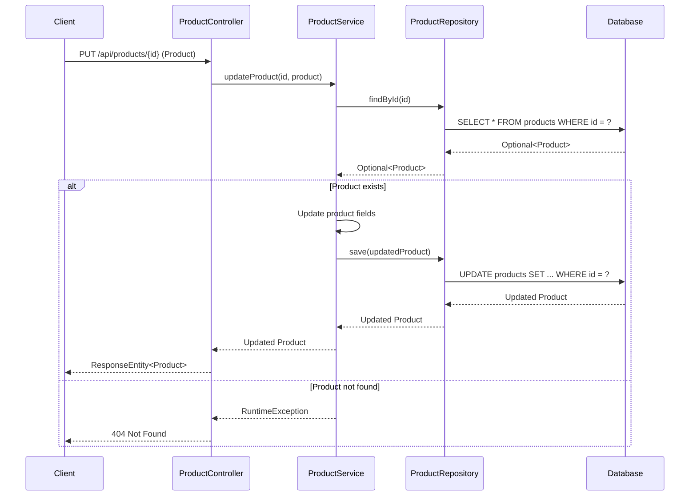
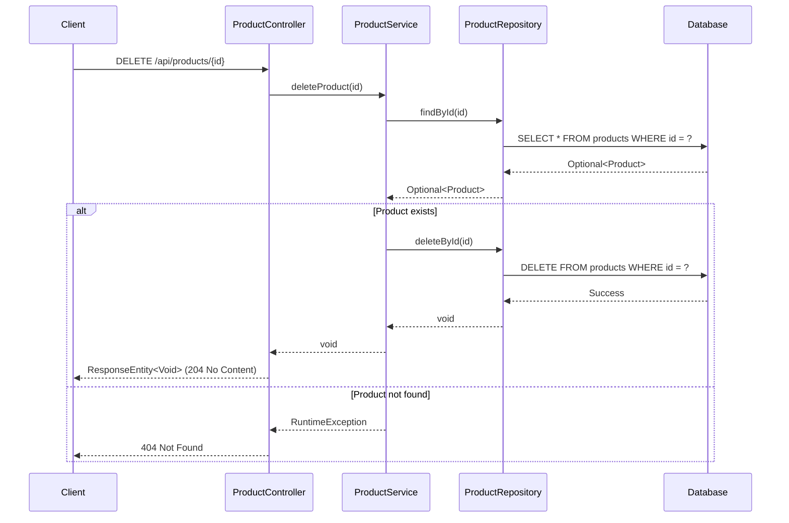
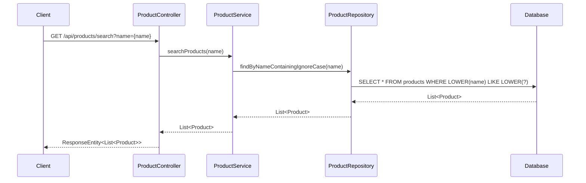

# Low-Level Design (LLD) - E-Commerce Spring Boot Application

## Table of Contents
1. [System Overview](#system-overview)
2. [Architecture Diagrams](#architecture-diagrams)
3. [Database Design](#database-design)
4. [Business Logic Flows](#business-logic-flows)
5. [API Specifications](#api-specifications)

## System Overview

### Project Configuration
- **Framework**: Spring Boot 3.3.0
- **Java Version**: 21
- **Database**: PostgreSQL
- **Server Port**: 8080
- **Module**: ProductManagement

### Architecture Pattern
This application follows a layered architecture pattern with clear separation of concerns:
- **Controller Layer**: REST API endpoints
- **Service Layer**: Business logic implementation
- **Repository Layer**: Data access abstraction
- **Entity Layer**: Data model representation

## Architecture Diagrams

### Class Diagram



### Component Architecture



## Database Design

### Entity Relationship Diagram



### Database Schema Details

**Table: products**
- **id**: Primary Key, Auto-generated Long value
- **name**: Product name, Required field
- **description**: Product description, Maximum 1000 characters
- **price**: Product price, Required Double value
- **stock**: Available stock quantity, Required Integer
- **image_url**: Product image URL, Optional field
- **category**: Product category, Required field

## Business Logic Flows

### Get All Products Flow



### Get Product By ID Flow



### Create Product Flow



### Update Product Flow



### Delete Product Flow



### Get Products By Category Flow


### Search Products Flow



## API Specifications

### REST Endpoints

| Method | Endpoint | Description | Request Body | Response |
|--------|----------|-------------|--------------|----------|
| GET | `/api/products` | Get all products | None | List<Product> |
| GET | `/api/products/{id}` | Get product by ID | None | Product |
| POST | `/api/products` | Create new product | Product | Product |
| PUT | `/api/products/{id}` | Update existing product | Product | Product |
| DELETE | `/api/products/{id}` | Delete product | None | Void |
| GET | `/api/products/category/{category}` | Get products by category | None | List<Product> |
| GET | `/api/products/search?name={name}` | Search products by name | None | List<Product> |

### Data Transfer Objects

**Product Model:**
```json
{
  "id": "Long (Auto-generated)",
  "name": "String (Required)",
  "description": "String (Max 1000 chars)",
  "price": "Double (Required)",
  "stock": "Integer (Required)",
  "imageUrl": "String (Optional)",
  "category": "String (Required)"
}
```

### Error Handling

- **404 Not Found**: When product with specified ID doesn't exist
- **400 Bad Request**: When request validation fails
- **500 Internal Server Error**: When unexpected server errors occur

### Service Layer Business Rules

1. **Product Creation**: All required fields must be provided
2. **Product Update**: Product must exist before updating
3. **Product Deletion**: Product must exist before deletion
4. **Search Operations**: Case-insensitive partial matching for product names
5. **Category Filtering**: Exact match for category names

---

*This LLD document provides a comprehensive overview of the e-commerce Spring Boot application's ProductManagement module, including detailed architectural diagrams, database design, and business logic flows.*