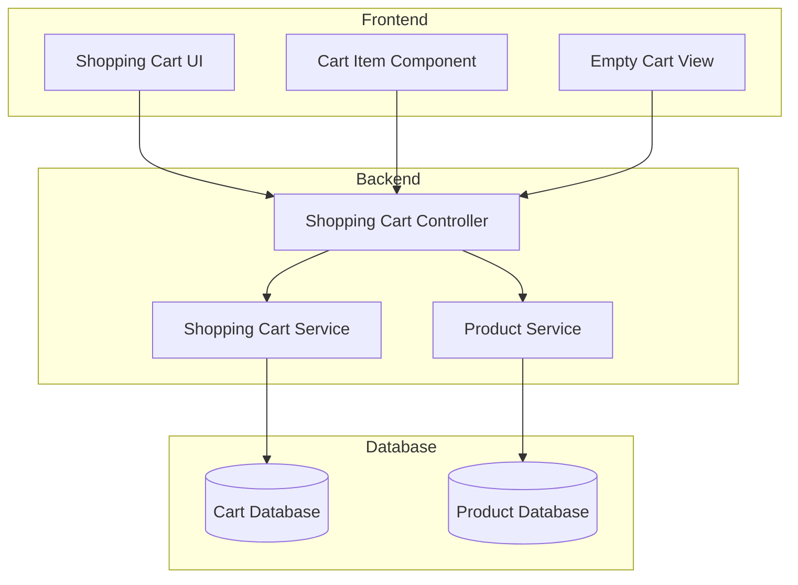
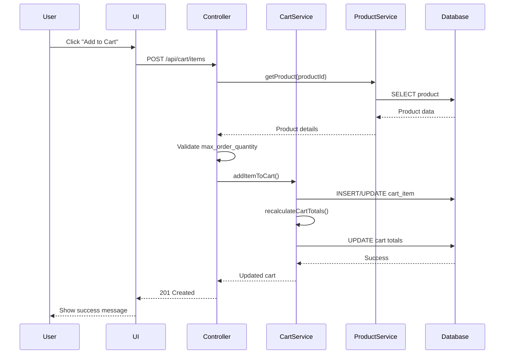
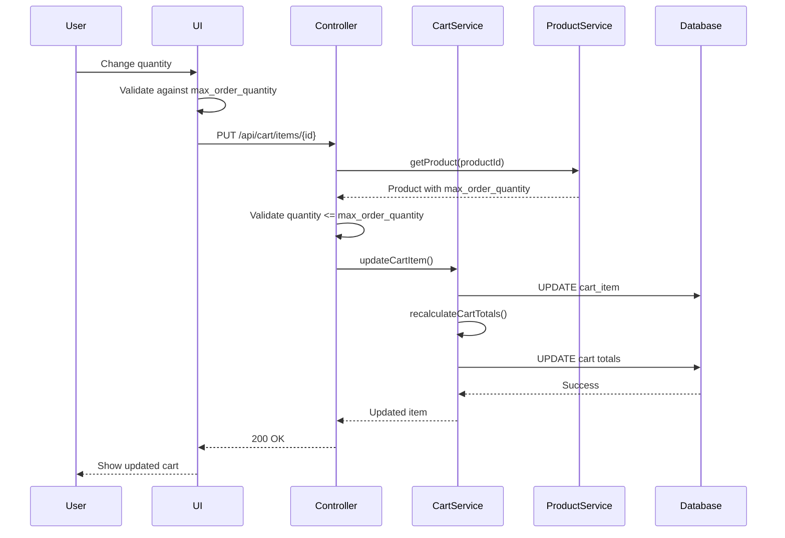

# Low Level Design Document
## Shopping Cart Feature

### Version History
| Version | Date | Author | Description |
|---------|------|--------|-------------|
| 1.0 | 2024-01-15 | Engineering Team | Initial LLD |
| 1.1 | 2024-01-20 | Engineering Team | Updated with RCA modifications |

---

## 1. Introduction

### 1.1 Purpose
This Low Level Design (LLD) document describes the detailed technical implementation of the Shopping Cart feature for the e-commerce platform. It provides comprehensive specifications for developers to implement the feature according to business requirements.

### 1.2 Scope
This document covers:
- Backend API services and controllers
- Frontend components and user interface
- Data models and database schema
- Business logic and validation rules
- Error handling and security measures
- Integration points and data flow

### 1.3 Definitions and Acronyms
- **LLD**: Low Level Design
- **API**: Application Programming Interface
- **REST**: Representational State Transfer
- **CRUD**: Create, Read, Update, Delete
- **UI**: User Interface
- **UX**: User Experience

---

## 2. System Architecture

### 2.1 High-Level Architecture



### 2.2 Technology Stack
- **Backend**: Node.js/Express or Python/Django
- **Frontend**: React.js
- **Database**: PostgreSQL/MySQL
- **API Protocol**: REST
- **Authentication**: JWT tokens

---

## 3. Detailed Component Design

### 3.1 Backend Components

#### 3.1.1 Shopping Cart Controller

**Purpose**: Handle HTTP requests for cart operations

**Endpoints**:

1. **Add Item to Cart**
   - **Method**: POST
   - **Path**: `/api/cart/items`
   - **Request Body**:
   ```json
   {
     "user_id": "string",
     "product_id": "string",
     "quantity": "integer"
   }
   ```
   - **Response**: 201 Created
   ```json
   {
     "cart_item_id": "string",
     "product_id": "string",
     "quantity": "integer",
     "price": "decimal",
     "subtotal": "decimal"
   }
   ```
   - **Validation**:
     - Verify product exists
     - Check product availability
     - Validate quantity > 0
     - **Enforce max_order_quantity limit**

2. **Update Cart Item Quantity** <!-- MODIFIED: Added max_order_quantity validation -->
   - **Method**: PUT
   - **Path**: `/api/cart/items/{item_id}`
   - **Request Body**:
   ```json
   {
     "quantity": "integer"
   }
   ```
   - **Response**: 200 OK
   ```json
   {
     "cart_item_id": "string",
     "product_id": "string",
     "quantity": "integer",
     "price": "decimal",
     "subtotal": "decimal"
   }
   ```
   - **Validation**:
     - Verify cart item exists
     - Validate quantity > 0
     - **NEW: Validate that updated quantity does not exceed product's max_order_quantity**
     - **NEW: Return error 400 with message if max_order_quantity exceeded**
   - **Logic**:
     ```javascript
     async updateCartItemQuantity(itemId, newQuantity) {
       const cartItem = await getCartItem(itemId);
       const product = await getProduct(cartItem.product_id);
       
       // MODIFIED: Added max_order_quantity validation on update
       if (newQuantity > product.max_order_quantity) {
         throw new ValidationError(
           `Quantity cannot exceed maximum order quantity of ${product.max_order_quantity}`
         );
       }
       
       cartItem.quantity = newQuantity;
       await cartService.updateItem(cartItem);
       return cartItem;
     }
     ```

3. **Remove Item from Cart**
   - **Method**: DELETE
   - **Path**: `/api/cart/items/{item_id}`
   - **Response**: 204 No Content

4. **Get Cart**
   - **Method**: GET
   - **Path**: `/api/cart`
   - **Query Parameters**: `user_id`
   - **Response**: 200 OK
   ```json
   {
     "cart_id": "string",
     "user_id": "string",
     "items": [
       {
         "cart_item_id": "string",
         "product_id": "string",
         "product_name": "string",
         "quantity": "integer",
         "price": "decimal",
         "subtotal": "decimal"
       }
     ],
     "total": "decimal"
   }
   ```

5. **Clear Cart**
   - **Method**: DELETE
   - **Path**: `/api/cart`
   - **Query Parameters**: `user_id`
   - **Response**: 204 No Content

#### 3.1.2 Shopping Cart Service

**Purpose**: Implement business logic for cart operations

**Key Methods**:

1. **addItemToCart(userId, productId, quantity)**
   ```javascript
   async addItemToCart(userId, productId, quantity) {
     // Validate product exists and is available
     const product = await productService.getProduct(productId);
     if (!product) {
       throw new NotFoundError('Product not found');
     }
     
     if (!product.is_available) {
       throw new ValidationError('Product is not available');
     }
     
     // Validate max_order_quantity
     if (quantity > product.max_order_quantity) {
       throw new ValidationError(
         `Quantity cannot exceed maximum order quantity of ${product.max_order_quantity}`
       );
     }
     
     // Get or create cart
     let cart = await this.getCart(userId);
     if (!cart) {
       cart = await this.createCart(userId);
     }
     
     // Check if item already exists in cart
     const existingItem = cart.items.find(item => item.product_id === productId);
     
     if (existingItem) {
       // Update quantity
       const newQuantity = existingItem.quantity + quantity;
       if (newQuantity > product.max_order_quantity) {
         throw new ValidationError(
           `Total quantity cannot exceed maximum order quantity of ${product.max_order_quantity}`
         );
       }
       existingItem.quantity = newQuantity;
       existingItem.subtotal = existingItem.quantity * product.price;
       await this.updateCartItem(existingItem);
     } else {
       // Add new item
       const cartItem = {
         cart_id: cart.id,
         product_id: productId,
         quantity: quantity,
         price: product.price,
         subtotal: quantity * product.price
       };
       await this.createCartItem(cartItem);
     }
     
     // NEW SECTION: Automatic recalculation of cart totals
     // MODIFIED: Added explicit automatic recalculation logic
     await this.recalculateCartTotals(cart.id);
     
     return await this.getCart(userId);
   }
   ```

2. **updateCartItem(itemId, quantity)** <!-- MODIFIED: Added automatic recalculation -->
   ```javascript
   async updateCartItem(itemId, quantity) {
     const cartItem = await this.getCartItem(itemId);
     if (!cartItem) {
       throw new NotFoundError('Cart item not found');
     }
     
     // Validate product and max_order_quantity
     const product = await productService.getProduct(cartItem.product_id);
     if (quantity > product.max_order_quantity) {
       throw new ValidationError(
         `Quantity cannot exceed maximum order quantity of ${product.max_order_quantity}`
       );
     }
     
     // Update item
     cartItem.quantity = quantity;
     cartItem.subtotal = quantity * cartItem.price;
     await this.saveCartItem(cartItem);
     
     // NEW SECTION: Automatic recalculation on quantity mutation
     // MODIFIED: Explicit logic for automatic recalculation of subtotal and total
     // whenever cart item quantity changes
     await this.recalculateCartTotals(cartItem.cart_id);
     
     return cartItem;
   }
   ```

3. **recalculateCartTotals(cartId)** <!-- NEW SECTION -->
   ```javascript
   // NEW SECTION: Automatic recalculation logic
   // This method ensures subtotal and total are recalculated on every quantity mutation
   async recalculateCartTotals(cartId) {
     const cart = await this.getCartById(cartId);
     const items = await this.getCartItems(cartId);
     
     // Recalculate each item's subtotal
     for (const item of items) {
       item.subtotal = item.quantity * item.price;
       await this.saveCartItem(item);
     }
     
     // Recalculate cart total
     const total = items.reduce((sum, item) => sum + item.subtotal, 0);
     cart.total = total;
     await this.saveCart(cart);
     
     return cart;
   }
   ```

4. **removeCartItem(itemId)**
   ```javascript
   async removeCartItem(itemId) {
     const cartItem = await this.getCartItem(itemId);
     if (!cartItem) {
       throw new NotFoundError('Cart item not found');
     }
     
     const cartId = cartItem.cart_id;
     await this.deleteCartItem(itemId);
     
     // Recalculate totals after removal
     await this.recalculateCartTotals(cartId);
   }
   ```

5. **getCart(userId)**
   ```javascript
   async getCart(userId) {
     const cart = await this.findCartByUserId(userId);
     if (!cart) {
       return null;
     }
     
     const items = await this.getCartItems(cart.id);
     
     // Enrich items with product details
     for (const item of items) {
       const product = await productService.getProduct(item.product_id);
       item.product_name = product.name;
       item.product_image = product.image_url;
     }
     
     cart.items = items;
     return cart;
   }
   ```

6. **clearCart(userId)**
   ```javascript
   async clearCart(userId) {
     const cart = await this.getCart(userId);
     if (cart) {
       await this.deleteAllCartItems(cart.id);
       cart.total = 0;
       await this.saveCart(cart);
     }
   }
   ```

#### 3.1.3 Product Service Integration

**Purpose**: Retrieve product information for cart operations

**Key Methods**:
- `getProduct(productId)`: Fetch product details including price, availability, and max_order_quantity
- `checkAvailability(productId)`: Verify product is in stock
- `getProductPrice(productId)`: Get current product price

---

### 3.2 Frontend Components

#### 3.2.1 Shopping Cart Component

**Purpose**: Main container component for shopping cart display

**Props**:
- `userId`: string - Current user identifier

**State**:
```javascript
const [cart, setCart] = useState(null);
const [loading, setLoading] = useState(true);
const [error, setError] = useState(null);
```

**Component Structure**:
```jsx
function ShoppingCart({ userId }) {
  const [cart, setCart] = useState(null);
  const [loading, setLoading] = useState(true);
  const [error, setError] = useState(null);
  
  useEffect(() => {
    fetchCart();
  }, [userId]);
  
  const fetchCart = async () => {
    try {
      setLoading(true);
      const response = await api.get(`/api/cart?user_id=${userId}`);
      setCart(response.data);
    } catch (err) {
      setError(err.message);
    } finally {
      setLoading(false);
    }
  };
  
  const handleQuantityChange = async (itemId, newQuantity) => {
    try {
      await api.put(`/api/cart/items/${itemId}`, { quantity: newQuantity });
      await fetchCart(); // Refresh cart to show updated totals
    } catch (err) {
      setError(err.message);
    }
  };
  
  const handleRemoveItem = async (itemId) => {
    try {
      await api.delete(`/api/cart/items/${itemId}`);
      await fetchCart();
    } catch (err) {
      setError(err.message);
    }
  };
  
  if (loading) return <LoadingSpinner />;
  if (error) return <ErrorMessage message={error} />;
  
  // NEW SECTION: Empty Cart View with Redirection Link
  // MODIFIED: Added explicit UI redirection link in empty cart view
  if (!cart || cart.items.length === 0) {
    return (
      <div className="empty-cart">
        <h2>Your cart is empty</h2>
        <p>Add items to your cart to see them here.</p>
        {/* NEW: Explicit redirection link to continue shopping */}
        <a href="/products" className="continue-shopping-link">
          <button className="btn-primary">Continue Shopping</button>
        </a>
      </div>
    );
  }
  
  return (
    <div className="shopping-cart">
      <h1>Shopping Cart</h1>
      <div className="cart-items">
        {cart.items.map(item => (
          <CartItem
            key={item.cart_item_id}
            item={item}
            onQuantityChange={handleQuantityChange}
            onRemove={handleRemoveItem}
          />
        ))}
      </div>
      <CartSummary total={cart.total} />
      <div className="cart-actions">
        <button onClick={() => window.location.href = '/checkout'}>
          Proceed to Checkout
        </button>
      </div>
    </div>
  );
}
```

#### 3.2.2 Cart Item Component

**Purpose**: Display individual cart item with quantity controls

**Props**:
- `item`: object - Cart item data
- `onQuantityChange`: function - Callback for quantity updates
- `onRemove`: function - Callback for item removal

**Component Structure**: <!-- MODIFIED: Added max_order_quantity validation -->
```jsx
function CartItem({ item, onQuantityChange, onRemove }) {
  const [quantity, setQuantity] = useState(item.quantity);
  const [error, setError] = useState(null);
  const [maxQuantity, setMaxQuantity] = useState(null);
  
  // NEW: Fetch product max_order_quantity
  useEffect(() => {
    fetchProductDetails();
  }, [item.product_id]);
  
  const fetchProductDetails = async () => {
    try {
      const response = await api.get(`/api/products/${item.product_id}`);
      setMaxQuantity(response.data.max_order_quantity);
    } catch (err) {
      console.error('Failed to fetch product details:', err);
    }
  };
  
  // MODIFIED: Added UI validation to prevent exceeding max_order_quantity
  const handleQuantityChange = (newQuantity) => {
    setError(null);
    
    // NEW: Validate against max_order_quantity
    if (maxQuantity && newQuantity > maxQuantity) {
      setError(`Quantity cannot exceed maximum order quantity of ${maxQuantity}`);
      return;
    }
    
    if (newQuantity < 1) {
      setError('Quantity must be at least 1');
      return;
    }
    
    setQuantity(newQuantity);
  };
  
  const handleUpdate = async () => {
    try {
      await onQuantityChange(item.cart_item_id, quantity);
      setError(null);
    } catch (err) {
      // NEW: Display appropriate error message for max_order_quantity violation
      if (err.response?.status === 400) {
        setError(err.response.data.message);
      } else {
        setError('Failed to update quantity');
      }
    }
  };
  
  return (
    <div className="cart-item">
      
      <div className="item-details">
        <h3>{item.product_name}</h3>
        <p className="price">${item.price.toFixed(2)}</p>
      </div>
      <div className="quantity-controls">
        <button 
          onClick={() => handleQuantityChange(quantity - 1)}
          disabled={quantity <= 1}
        >
          -
        </button>
        <input
          type="number"
          value={quantity}
          onChange={(e) => handleQuantityChange(parseInt(e.target.value))}
          min="1"
          max={maxQuantity || undefined} {/* NEW: Set max attribute */}
        />
        <button 
          onClick={() => handleQuantityChange(quantity + 1)}
          disabled={maxQuantity && quantity >= maxQuantity} {/* NEW: Disable if at max */}
        >
          +
        </button>
        <button onClick={handleUpdate}>Update</button>
      </div>
      {/* NEW: Display error alert for max_order_quantity violations */}
      {error && (
        <div className="error-alert" role="alert">
          {error}
        </div>
      )}
      {/* NEW: Display max quantity info */}
      {maxQuantity && (
        <div className="max-quantity-info">
          Maximum order quantity: {maxQuantity}
        </div>
      )}
      <div className="item-subtotal">
        <p>Subtotal: ${item.subtotal.toFixed(2)}</p>
      </div>
      <button 
        className="remove-button"
        onClick={() => onRemove(item.cart_item_id)}
      >
        Remove
      </button>
    </div>
  );
}
```

#### 3.2.3 Cart Summary Component

**Purpose**: Display cart total and summary information

**Props**:
- `total`: number - Cart total amount

**Component Structure**:
```jsx
function CartSummary({ total }) {
  return (
    <div className="cart-summary">
      <h2>Order Summary</h2>
      <div className="summary-row">
        <span>Subtotal:</span>
        <span>${total.toFixed(2)}</span>
      </div>
      <div className="summary-row">
        <span>Shipping:</span>
        <span>Calculated at checkout</span>
      </div>
      <div className="summary-row total">
        <span>Total:</span>
        <span>${total.toFixed(2)}</span>
      </div>
    </div>
  );
}
```

---

## 4. Data Models

### 4.1 Database Schema

#### Cart Table
```sql
CREATE TABLE carts (
  id VARCHAR(36) PRIMARY KEY,
  user_id VARCHAR(36) NOT NULL,
  total DECIMAL(10, 2) DEFAULT 0.00,
  created_at TIMESTAMP DEFAULT CURRENT_TIMESTAMP,
  updated_at TIMESTAMP DEFAULT CURRENT_TIMESTAMP ON UPDATE CURRENT_TIMESTAMP,
  FOREIGN KEY (user_id) REFERENCES users(id),
  INDEX idx_user_id (user_id)
);
```

#### Cart Items Table
```sql
CREATE TABLE cart_items (
  id VARCHAR(36) PRIMARY KEY,
  cart_id VARCHAR(36) NOT NULL,
  product_id VARCHAR(36) NOT NULL,
  quantity INT NOT NULL DEFAULT 1,
  price DECIMAL(10, 2) NOT NULL,
  subtotal DECIMAL(10, 2) NOT NULL,
  created_at TIMESTAMP DEFAULT CURRENT_TIMESTAMP,
  updated_at TIMESTAMP DEFAULT CURRENT_TIMESTAMP ON UPDATE CURRENT_TIMESTAMP,
  FOREIGN KEY (cart_id) REFERENCES carts(id) ON DELETE CASCADE,
  FOREIGN KEY (product_id) REFERENCES products(id),
  INDEX idx_cart_id (cart_id),
  INDEX idx_product_id (product_id),
  UNIQUE KEY unique_cart_product (cart_id, product_id)
);
```

#### Product Table (Reference)
```sql
CREATE TABLE products (
  id VARCHAR(36) PRIMARY KEY,
  name VARCHAR(255) NOT NULL,
  description TEXT,
  price DECIMAL(10, 2) NOT NULL,
  max_order_quantity INT NOT NULL DEFAULT 10,
  is_available BOOLEAN DEFAULT TRUE,
  image_url VARCHAR(512),
  created_at TIMESTAMP DEFAULT CURRENT_TIMESTAMP,
  updated_at TIMESTAMP DEFAULT CURRENT_TIMESTAMP ON UPDATE CURRENT_TIMESTAMP
);
```

### 4.2 Data Transfer Objects (DTOs)

#### CartDTO
```javascript
class CartDTO {
  constructor(cart, items) {
    this.cart_id = cart.id;
    this.user_id = cart.user_id;
    this.items = items.map(item => new CartItemDTO(item));
    this.total = cart.total;
    this.created_at = cart.created_at;
    this.updated_at = cart.updated_at;
  }
}
```

#### CartItemDTO
```javascript
class CartItemDTO {
  constructor(item) {
    this.cart_item_id = item.id;
    this.product_id = item.product_id;
    this.product_name = item.product_name;
    this.product_image = item.product_image;
    this.quantity = item.quantity;
    this.price = item.price;
    this.subtotal = item.subtotal;
  }
}
```

---

## 5. Data Flow

### 5.1 Add Item to Cart Flow



### 5.2 Update Quantity Flow



---

## 6. Error Handling

### 6.1 Error Types and Responses

#### Validation Errors (400 Bad Request)
```json
{
  "error": "ValidationError",
  "message": "Quantity cannot exceed maximum order quantity of 10",
  "field": "quantity",
  "code": "MAX_QUANTITY_EXCEEDED"
}
```

#### Not Found Errors (404 Not Found)
```json
{
  "error": "NotFoundError",
  "message": "Product not found",
  "code": "PRODUCT_NOT_FOUND"
}
```

#### Server Errors (500 Internal Server Error)
```json
{
  "error": "InternalServerError",
  "message": "An unexpected error occurred",
  "code": "INTERNAL_ERROR"
}
```

### 6.2 Frontend Error Handling

```javascript
const handleApiError = (error) => {
  if (error.response) {
    // Server responded with error status
    const { status, data } = error.response;
    
    switch (status) {
      case 400:
        showValidationError(data.message);
        break;
      case 404:
        showNotFoundError(data.message);
        break;
      case 500:
        showServerError();
        break;
      default:
        showGenericError();
    }
  } else if (error.request) {
    // Request made but no response
    showNetworkError();
  } else {
    // Error in request setup
    showGenericError();
  }
};
```

---

## 7. Validation Rules

### 7.1 Backend Validation

1. **Product Validation**
   - Product must exist in database
   - Product must be available (is_available = true)
   - Product must have valid price > 0

2. **Quantity Validation**
   - Quantity must be integer > 0
   - Quantity must not exceed product's max_order_quantity (enforced on add AND update)
   - Total quantity in cart for a product must not exceed max_order_quantity

3. **Cart Validation**
   - User must be authenticated
   - Cart must belong to requesting user
   - Cart item must exist for update/delete operations

### 7.2 Frontend Validation

1. **Input Validation**
   - Quantity input must be positive integer
   - Quantity cannot exceed max_order_quantity (with UI alert)
   - Disable increment button when at max_order_quantity
   - Show error message for invalid inputs

2. **User Feedback**
   - Show loading states during API calls
   - Display success messages for completed actions
   - Show error alerts for validation failures
   - Display max_order_quantity information to users

---

## 8. Performance Considerations

### 8.1 Database Optimization

1. **Indexing**
   - Index on cart.user_id for fast cart lookup
   - Index on cart_items.cart_id for efficient item queries
   - Composite unique index on (cart_id, product_id) to prevent duplicates

2. **Query Optimization**
   - Use JOIN queries to fetch cart with items in single query
   - Implement pagination for large carts (if needed)
   - Cache product details to reduce database calls

3. **Connection Pooling**
   - Configure database connection pool for concurrent requests
   - Set appropriate pool size based on expected load

### 8.2 API Performance

1. **Response Time Targets**
   - GET cart: < 200ms
   - POST add item: < 300ms
   - PUT update quantity: < 250ms
   - DELETE remove item: < 200ms

2. **Caching Strategy**
   - Cache product details (price, availability, max_order_quantity) with TTL
   - Invalidate cart cache on updates
   - Use Redis for session-based cart caching

### 8.3 Frontend Performance

1. **Rendering Optimization**
   - Use React.memo for CartItem components
   - Implement debouncing for quantity input changes
   - Lazy load product images

2. **State Management**
   - Minimize unnecessary re-renders
   - Use local state for UI-only changes
   - Batch API calls when possible

---

## 9. Security Considerations

### 9.1 Authentication & Authorization

1. **User Authentication**
   - Require valid JWT token for all cart operations
   - Validate token on every request
   - Implement token refresh mechanism

2. **Authorization**
   - Verify user owns the cart being accessed
   - Prevent users from modifying other users' carts
   - Implement role-based access if needed

### 9.2 Input Validation & Sanitization

1. **SQL Injection Prevention**
   - Use parameterized queries/prepared statements
   - Never concatenate user input into SQL queries
   - Validate all input types and formats

2. **XSS Prevention**
   - Sanitize all user inputs
   - Escape output in frontend rendering
   - Use Content Security Policy headers

3. **CSRF Protection**
   - Implement CSRF tokens for state-changing operations
   - Validate origin headers
   - Use SameSite cookie attributes

### 9.3 Data Protection

1. **Sensitive Data**
   - Never log sensitive information
   - Encrypt data in transit (HTTPS)
   - Implement rate limiting to prevent abuse

2. **Price Integrity**
   - Always fetch current price from product service
   - Never trust client-side price calculations
   - Validate price consistency before checkout

---

## 10. Testing Strategy

### 10.1 Unit Tests

#### Backend Unit Tests

1. **Shopping Cart Service Tests**
```javascript
describe('ShoppingCartService', () => {
  describe('addItemToCart', () => {
    it('should add item to cart successfully', async () => {
      // Test implementation
    });
    
    it('should throw error when quantity exceeds max_order_quantity', async () => {
      // Test max_order_quantity validation
    });
    
    it('should recalculate totals after adding item', async () => {
      // Test automatic recalculation
    });
  });
  
  describe('updateCartItem', () => {
    it('should update quantity successfully', async () => {
      // Test implementation
    });
    
    it('should validate max_order_quantity on update', async () => {
      // Test validation on update
    });
    
    it('should automatically recalculate totals on quantity change', async () => {
      // Test automatic recalculation on mutation
    });
  });
  
  describe('recalculateCartTotals', () => {
    it('should recalculate all item subtotals', async () => {
      // Test subtotal recalculation
    });
    
    it('should recalculate cart total', async () => {
      // Test total recalculation
    });
  });
});
```

2. **Shopping Cart Controller Tests**
```javascript
describe('ShoppingCartController', () => {
  describe('POST /api/cart/items', () => {
    it('should return 201 when item added successfully', async () => {
      // Test implementation
    });
    
    it('should return 400 when quantity exceeds max_order_quantity', async () => {
      // Test validation
    });
  });
  
  describe('PUT /api/cart/items/:id', () => {
    it('should return 200 when quantity updated successfully', async () => {
      // Test implementation
    });
    
    it('should return 400 when updated quantity exceeds max_order_quantity', async () => {
      // Test max_order_quantity validation on update
    });
  });
});
```

#### Frontend Unit Tests

1. **Cart Item Component Tests**
```javascript
describe('CartItem', () => {
  it('should render item details correctly', () => {
    // Test rendering
  });
  
  it('should display error when quantity exceeds max_order_quantity', () => {
    // Test max_order_quantity validation
  });
  
  it('should disable increment button at max_order_quantity', () => {
    // Test UI constraint
  });
  
  it('should show max quantity information', () => {
    // Test info display
  });
});
```

2. **Shopping Cart Component Tests**
```javascript
describe('ShoppingCart', () => {
  it('should display empty cart message with continue shopping link', () => {
    // Test empty cart view with redirection link
  });
  
  it('should render cart items when cart has items', () => {
    // Test rendering
  });
  
  it('should refresh cart after quantity update', () => {
    // Test automatic refresh
  });
});
```

### 10.2 Integration Tests

1. **API Integration Tests**
   - Test complete add-to-cart flow
   - Test update quantity with max_order_quantity validation
   - Test automatic recalculation on mutations
   - Test remove item flow
   - Test error scenarios

2. **Database Integration Tests**
   - Test cart creation and retrieval
   - Test item addition and updates
   - Test total recalculation
   - Test cascade deletes

### 10.3 End-to-End Tests

1. **User Journey Tests**
   - Add item to cart from product page
   - Update quantity in cart (within and exceeding max_order_quantity)
   - Remove item from cart
   - View empty cart with continue shopping link
   - Proceed to checkout

2. **Error Scenario Tests**
   - Handle product not found
   - Handle max_order_quantity exceeded
   - Handle network errors
   - Handle authentication failures

---

## 11. Deployment

### 11.1 Environment Configuration

#### Development
```env
NODE_ENV=development
DATABASE_URL=postgresql://localhost:5432/cart_dev
REDIS_URL=redis://localhost:6379
JWT_SECRET=dev_secret_key
API_PORT=3000
```

#### Production
```env
NODE_ENV=production
DATABASE_URL=postgresql://prod-db:5432/cart_prod
REDIS_URL=redis://prod-redis:6379
JWT_SECRET=${SECURE_JWT_SECRET}
API_PORT=8080
```

### 11.2 Database Migration

```sql
-- Migration: Create cart tables
-- Version: 001
-- Date: 2024-01-15

BEGIN;

CREATE TABLE IF NOT EXISTS carts (
  id VARCHAR(36) PRIMARY KEY,
  user_id VARCHAR(36) NOT NULL,
  total DECIMAL(10, 2) DEFAULT 0.00,
  created_at TIMESTAMP DEFAULT CURRENT_TIMESTAMP,
  updated_at TIMESTAMP DEFAULT CURRENT_TIMESTAMP,
  FOREIGN KEY (user_id) REFERENCES users(id),
  INDEX idx_user_id (user_id)
);

CREATE TABLE IF NOT EXISTS cart_items (
  id VARCHAR(36) PRIMARY KEY,
  cart_id VARCHAR(36) NOT NULL,
  product_id VARCHAR(36) NOT NULL,
  quantity INT NOT NULL DEFAULT 1,
  price DECIMAL(10, 2) NOT NULL,
  subtotal DECIMAL(10, 2) NOT NULL,
  created_at TIMESTAMP DEFAULT CURRENT_TIMESTAMP,
  updated_at TIMESTAMP DEFAULT CURRENT_TIMESTAMP,
  FOREIGN KEY (cart_id) REFERENCES carts(id) ON DELETE CASCADE,
  FOREIGN KEY (product_id) REFERENCES products(id),
  INDEX idx_cart_id (cart_id),
  INDEX idx_product_id (product_id),
  UNIQUE KEY unique_cart_product (cart_id, product_id)
);

COMMIT;
```

### 11.3 Deployment Steps

1. **Pre-deployment**
   - Run all tests (unit, integration, e2e)
   - Build frontend assets
   - Run database migrations
   - Update environment variables

2. **Deployment**
   - Deploy backend services
   - Deploy frontend application
   - Update API gateway configuration
   - Verify health checks

3. **Post-deployment**
   - Run smoke tests
   - Monitor error logs
   - Verify metrics and performance
   - Rollback plan ready if needed

---

## 12. Monitoring & Logging

### 12.1 Logging Strategy

1. **Application Logs**
   - Log all API requests with user_id, endpoint, and timestamp
   - Log validation errors with details
   - Log database operations
   - Log automatic recalculation events

2. **Error Logs**
   - Log all exceptions with stack traces
   - Log failed validations
   - Log authentication failures

3. **Audit Logs**
   - Log cart modifications (add, update, remove)
   - Log price changes
   - Log checkout events

### 12.2 Metrics & Monitoring

1. **Performance Metrics**
   - API response times
   - Database query times
   - Cache hit rates
   - Error rates

2. **Business Metrics**
   - Cart abandonment rate
   - Average cart value
   - Items per cart
   - Conversion rate

3. **Alerts**
   - High error rate (> 5%)
   - Slow response times (> 1s)
   - Database connection failures
   - High memory usage

---

## 13. Future Enhancements

### 13.1 Planned Features

1. **Save for Later**
   - Allow users to move items to "saved" list
   - Implement separate saved_items table
   - Add UI for managing saved items

2. **Cart Sharing**
   - Generate shareable cart links
   - Allow collaborative cart editing
   - Implement cart merge functionality

3. **Recommendations**
   - Show related products in cart
   - Suggest frequently bought together items
   - Implement personalized recommendations

4. **Promotions & Discounts**
   - Apply coupon codes
   - Calculate discounts
   - Show savings in cart summary

5. **Inventory Integration**
   - Real-time stock checking
   - Reserve items in cart
   - Notify users of stock changes

### 13.2 Technical Improvements

1. **Performance**
   - Implement GraphQL for flexible queries
   - Add server-side rendering for cart page
   - Optimize database queries with materialized views

2. **Scalability**
   - Implement microservices architecture
   - Add message queue for async operations
   - Implement distributed caching

3. **User Experience**
   - Add progressive web app features
   - Implement offline cart support
   - Add real-time cart sync across devices

---

## 14. Appendix

### 14.1 API Reference Summary

| Endpoint | Method | Description | Auth Required |
|----------|--------|-------------|---------------|
| /api/cart | GET | Get user's cart | Yes |
| /api/cart/items | POST | Add item to cart | Yes |
| /api/cart/items/:id | PUT | Update item quantity | Yes |
| /api/cart/items/:id | DELETE | Remove item from cart | Yes |
| /api/cart | DELETE | Clear entire cart | Yes |

### 14.2 Error Code Reference

| Code | HTTP Status | Description |
|------|-------------|-------------|
| PRODUCT_NOT_FOUND | 404 | Product does not exist |
| PRODUCT_UNAVAILABLE | 400 | Product is not available |
| MAX_QUANTITY_EXCEEDED | 400 | Quantity exceeds max_order_quantity |
| INVALID_QUANTITY | 400 | Quantity must be positive integer |
| CART_ITEM_NOT_FOUND | 404 | Cart item does not exist |
| UNAUTHORIZED | 401 | Authentication required |
| FORBIDDEN | 403 | User cannot access this cart |
| INTERNAL_ERROR | 500 | Unexpected server error |

### 14.3 Database Indexes

```sql
-- Performance indexes
CREATE INDEX idx_carts_user_id ON carts(user_id);
CREATE INDEX idx_cart_items_cart_id ON cart_items(cart_id);
CREATE INDEX idx_cart_items_product_id ON cart_items(product_id);
CREATE UNIQUE INDEX idx_cart_items_unique ON cart_items(cart_id, product_id);
```

### 14.4 Glossary

- **Cart**: A collection of items a user intends to purchase
- **Cart Item**: An individual product in the cart with quantity
- **Subtotal**: Price × Quantity for a single cart item
- **Total**: Sum of all subtotals in the cart
- **max_order_quantity**: Maximum quantity allowed per product per order
- **Recalculation**: Process of updating subtotals and totals after quantity changes

---

## Document Control

**Document Owner**: Engineering Team  
**Last Updated**: 2024-01-20  
**Next Review Date**: 2024-02-20  
**Status**: Approved with RCA Modifications

**Change Log**:
- v1.0 (2024-01-15): Initial LLD document
- v1.1 (2024-01-20): Applied RCA modifications:
  - Added automatic recalculation logic to Shopping Cart Service
  - Added redirection link to empty cart view in Shopping Cart Component
  - Modified Shopping Cart Controller to enforce max_order_quantity on update
  - Modified Cart Item Component to add UI validation for max_order_quantity

---

**End of Document**