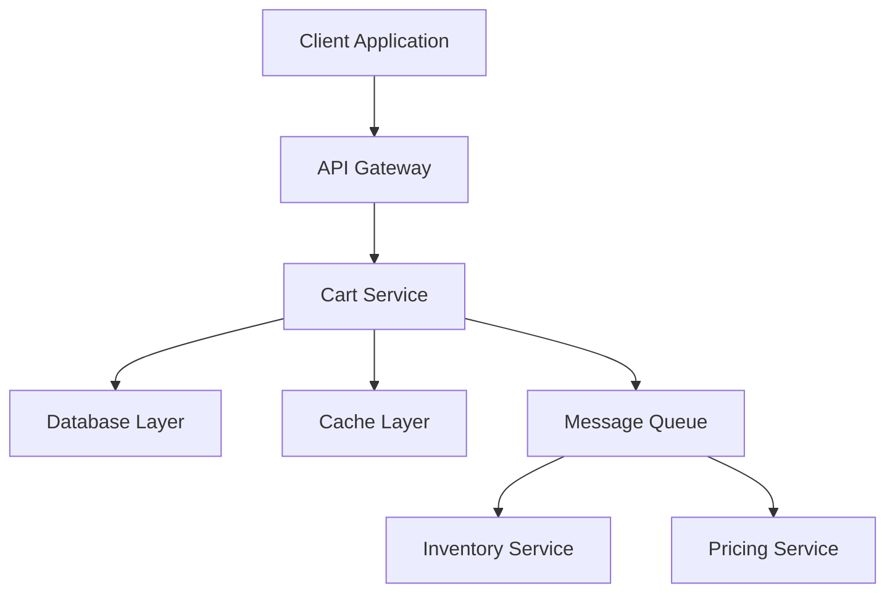
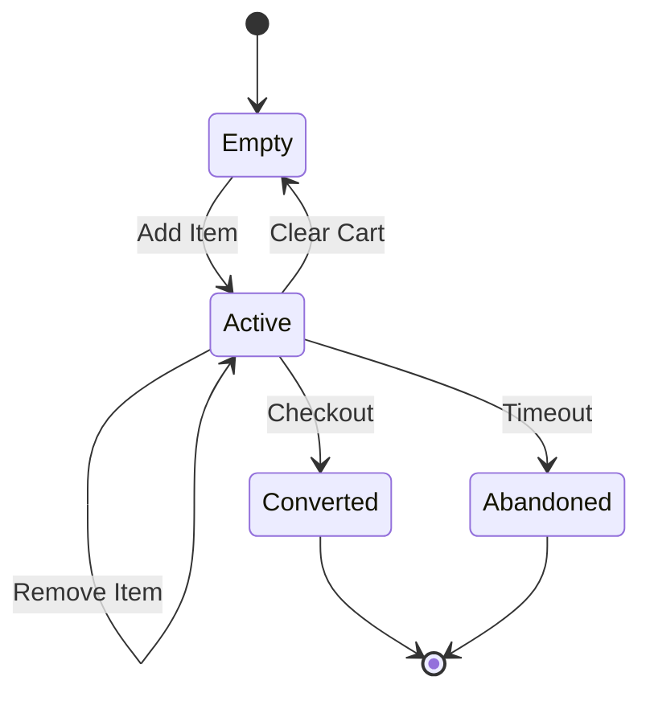

# Low Level Design Document
## E-Commerce Platform - Shopping Cart Module

### 1. Document Information

**Document Version:** 2.1
**Last Updated:** 2024-01-15
**Author:** Engineering Team
**Status:** Active

### 2. Overview

This Low Level Design (LLD) document provides detailed technical specifications for the E-Commerce Platform's Shopping Cart Module. It describes the architecture, components, interfaces, and implementation details necessary for development.

### 3. System Architecture

#### 3.1 High-Level Architecture



#### 3.2 Technology Stack

- **Backend Framework:** Node.js with Express
- **Database:** PostgreSQL 14+
- **Cache:** Redis 6+
- **Message Queue:** RabbitMQ
- **API Protocol:** REST
- **Authentication:** JWT

#### 3.3 Shopping Cart Module

The Shopping Cart Module handles all cart-related operations including item management, price calculations, and cart persistence.

##### 3.3.1 Cart Data Model

```javascript
// Cart Schema
const CartSchema = {
  cart_id: 'UUID PRIMARY KEY',
  user_id: 'UUID NOT NULL',
  created_at: 'TIMESTAMP',
  updated_at: 'TIMESTAMP',
  status: 'ENUM(active, abandoned, converted)',
  items: 'JSONB'
}

// Cart Item Schema
const CartItemSchema = {
  item_id: 'UUID PRIMARY KEY',
  cart_id: 'UUID FOREIGN KEY',
  product_id: 'UUID NOT NULL',
  quantity: 'INTEGER NOT NULL',
  price: 'DECIMAL(10,2)',
  added_at: 'TIMESTAMP'
}
```

##### 3.3.2 Cart State Management



##### 3.3.3 Cart Service

The Cart Service implements core business logic for cart operations.

**Key Responsibilities:**
- Cart lifecycle management
- Item addition and removal
- Quantity updates with validation
- Price calculation and updates
- Cart persistence and retrieval

**Service Methods:**

```javascript
class CartService {
  async createCart(userId) {
    // Creates new cart for user
  }
  
  async addItem(cartId, productId, quantity, price, userId) {
    // Adds item to cart
    // Validates product availability
    // Updates cart total
  }
  
  async getCart(cartId) {
    // Retrieves cart with all items
  }
  
  async updateItemQuantity(cartId, itemId, quantity) {
    // Updates item quantity
    // Validation rules:
    // - quantity must be positive integer
    // - max quantity 99
    // Recalculates cart total
  }
  
  async removeItem(cartId, itemId) {
    // Removes item from cart
  }
  
  async clearCart(cartId) {
    // Removes all items from cart
  }
  
  async calculateTotal(cartId) {
    // Calculates cart total with taxes
  }
}
```

### 4. Component Design

#### 4.1 Cart Controller

Handles HTTP requests and responses for cart operations.

```javascript
class CartController {
  constructor(cartService) {
    this.cartService = cartService;
  }
  
  async handleAddToCart(req, res) {
    try {
      const { product_id, quantity, price, user_id } = req.body;
      const result = await this.cartService.addItem(
        req.params.cartId,
        product_id,
        quantity,
        price,
        user_id
      );
      res.status(200).json(result);
    } catch (error) {
      res.status(400).json({ error: error.message });
    }
  }
  
  async handleUpdateCart(req, res) {
    try {
      const { quantity } = req.body;
      const result = await this.cartService.updateItemQuantity(
        req.params.cartId,
        req.params.itemId,
        quantity
      );
      res.status(200).json(result);
    } catch (error) {
      res.status(400).json({ error: error.message });
    }
  }
  
  async handleGetCart(req, res) {
    try {
      const cart = await this.cartService.getCart(req.params.cartId);
      res.status(200).json(cart);
    } catch (error) {
      res.status(404).json({ error: error.message });
    }
  }
}
```

#### 4.2 Cart Repository

Handles data persistence operations.

```javascript
class CartRepository {
  async save(cart) {
    // Saves cart to database
  }
  
  async findById(cartId) {
    // Retrieves cart by ID
  }
  
  async findByUserId(userId) {
    // Retrieves active cart for user
  }
  
  async update(cartId, updates) {
    // Updates cart data
  }
  
  async delete(cartId) {
    // Soft deletes cart
  }
}
```

### 5. API Specifications

#### 5.1 Authentication

All cart APIs require JWT authentication.

```
Authorization: Bearer <jwt_token>
```

#### 5.2 Common Response Format

```json
{
  "success": true,
  "data": {},
  "error": null,
  "timestamp": "2024-01-15T10:30:00Z"
}
```

#### 5.3 Cart APIs

##### 5.3.1 Create Cart

**Endpoint:** `POST /api/v1/cart`

**Request:**
```json
{
  "user_id": "uuid"
}
```

**Response:**
```json
{
  "success": true,
  "data": {
    "cart_id": "uuid",
    "user_id": "uuid",
    "created_at": "timestamp",
    "items": [],
    "total": 0
  }
}
```

##### 5.3.2 Add Item to Cart

**Endpoint:** `POST /api/v1/cart/add`

**Request:**
```json
{
  "product_id": "uuid",
  "quantity": 1,
  "price": 29.99,
  "user_id": "uuid"
}
```

**Response:**
```json
{
  "success": true,
  "data": {
    "cart_id": "uuid",
    "item_id": "uuid",
    "product_id": "uuid",
    "quantity": 1,
    "price": 29.99,
    "added_at": "timestamp"
  }
}
```

**Validation Rules:**
- product_id: Required, must be valid UUID
- quantity: Required, positive integer
- price: Required, positive decimal
- user_id: Required, must be valid UUID

##### 5.3.3 Get Cart

**Endpoint:** `GET /api/v1/cart/:cartId`

**Response:**
```json
{
  "success": true,
  "data": {
    "cart_id": "uuid",
    "user_id": "uuid",
    "items": [
      {
        "item_id": "uuid",
        "product_id": "uuid",
        "quantity": 2,
        "price": 29.99
      }
    ],
    "total": 59.98
  }
}
```

##### 5.3.4 Update Cart Item

**Endpoint:** `PUT /api/v1/cart/update/:cartId/items/:itemId`

**Request:**
```json
{
  "quantity": 3
}
```

**Response:**
```json
{
  "success": true,
  "data": {
    "item_id": "uuid",
    "quantity": 3,
    "updated_at": "timestamp"
  }
}
```

**Validation Rules:**
- quantity: Required, must be positive integer
- quantity: Maximum value 99

##### 5.3.5 Remove Item from Cart

**Endpoint:** `DELETE /api/v1/cart/:cartId/items/:itemId`

**Response:**
```json
{
  "success": true,
  "data": {
    "message": "Item removed successfully"
  }
}
```

##### 5.3.6 Clear Cart

**Endpoint:** `DELETE /api/v1/cart/:cartId`

**Response:**
```json
{
  "success": true,
  "data": {
    "message": "Cart cleared successfully"
  }
}
```

### 6. Database Design

#### 6.1 Tables

**carts table:**
```sql
CREATE TABLE carts (
  cart_id UUID PRIMARY KEY DEFAULT gen_random_uuid(),
  user_id UUID NOT NULL,
  created_at TIMESTAMP DEFAULT CURRENT_TIMESTAMP,
  updated_at TIMESTAMP DEFAULT CURRENT_TIMESTAMP,
  status VARCHAR(20) DEFAULT 'active',
  CONSTRAINT fk_user FOREIGN KEY (user_id) REFERENCES users(user_id)
);
```

**cart_items table:**
```sql
CREATE TABLE cart_items (
  item_id UUID PRIMARY KEY DEFAULT gen_random_uuid(),
  cart_id UUID NOT NULL,
  product_id UUID NOT NULL,
  quantity INTEGER NOT NULL CHECK (quantity > 0 AND quantity <= 99),
  price DECIMAL(10,2) NOT NULL,
  added_at TIMESTAMP DEFAULT CURRENT_TIMESTAMP,
  CONSTRAINT fk_cart FOREIGN KEY (cart_id) REFERENCES carts(cart_id),
  CONSTRAINT fk_product FOREIGN KEY (product_id) REFERENCES products(product_id)
);
```

#### 6.2 Indexes

```sql
CREATE INDEX idx_carts_user_id ON carts(user_id);
CREATE INDEX idx_carts_status ON carts(status);
CREATE INDEX idx_cart_items_cart_id ON cart_items(cart_id);
CREATE INDEX idx_cart_items_product_id ON cart_items(product_id);
```

### 7. Caching Strategy

#### 7.1 Redis Cache Structure

```javascript
// Cache key pattern
const CACHE_KEYS = {
  cart: (cartId) => `cart:${cartId}`,
  userCart: (userId) => `user:${userId}:cart`,
  cartItems: (cartId) => `cart:${cartId}:items`
};

// Cache TTL
const CACHE_TTL = {
  cart: 3600, // 1 hour
  cartItems: 1800 // 30 minutes
};
```

#### 7.2 Cache Invalidation

```javascript
class CacheManager {
  async invalidateCart(cartId) {
    await redis.del(CACHE_KEYS.cart(cartId));
    await redis.del(CACHE_KEYS.cartItems(cartId));
  }
  
  async invalidateUserCart(userId) {
    await redis.del(CACHE_KEYS.userCart(userId));
  }
}
```

### 8. Error Handling

#### 8.1 Error Codes

| Code | Description | HTTP Status |
|------|-------------|-------------|
| CART_001 | Cart not found | 404 |
| CART_002 | Invalid cart item | 400 |
| CART_003 | Product not available | 400 |
| CART_004 | Invalid quantity | 400 |
| CART_005 | Cart already exists | 409 |
| CART_006 | Database error | 500 |

#### 8.2 Error Response Format

```json
{
  "success": false,
  "error": {
    "code": "CART_004",
    "message": "Invalid quantity: must be positive integer with max value 99",
    "details": {}
  },
  "timestamp": "2024-01-15T10:30:00Z"
}
```

### 9. Security Considerations

#### 9.1 Input Validation

- All user inputs must be sanitized
- UUID validation for IDs
- Quantity limits enforced (positive integer, max 99)
- Price validation (positive decimal)

#### 9.2 Authorization

- Users can only access their own carts
- JWT token validation on all endpoints
- Role-based access control for admin operations

### 10. Performance Optimization

#### 10.1 Database Optimization

- Use connection pooling
- Implement prepared statements
- Optimize queries with proper indexes
- Use batch operations where possible

#### 10.2 Caching Strategy

- Cache frequently accessed carts
- Implement cache-aside pattern
- Use Redis for session management
- Set appropriate TTL values

### 11. Monitoring and Logging

#### 11.1 Metrics to Track

- Cart creation rate
- Cart abandonment rate
- Average items per cart
- API response times
- Error rates by endpoint

#### 11.2 Logging Standards

```javascript
logger.info('Cart operation', {
  operation: 'addItem',
  cartId: 'uuid',
  userId: 'uuid',
  productId: 'uuid',
  quantity: 1,
  timestamp: new Date().toISOString()
});
```

### 12. Testing Strategy

#### 12.1 Unit Tests

- Test all service methods
- Mock external dependencies
- Test validation logic
- Test error handling

#### 12.2 Integration Tests

- Test API endpoints
- Test database operations
- Test cache operations
- Test message queue integration

#### 12.3 Load Tests

- Simulate concurrent cart operations
- Test under peak load conditions
- Measure response times
- Identify bottlenecks

### 13. Deployment

#### 13.1 Environment Configuration

```javascript
module.exports = {
  database: {
    host: process.env.DB_HOST,
    port: process.env.DB_PORT,
    database: process.env.DB_NAME,
    user: process.env.DB_USER,
    password: process.env.DB_PASSWORD
  },
  redis: {
    host: process.env.REDIS_HOST,
    port: process.env.REDIS_PORT
  },
  jwt: {
    secret: process.env.JWT_SECRET,
    expiresIn: '24h'
  }
};
```

#### 13.2 Deployment Steps

1. Run database migrations
2. Deploy application code
3. Update environment variables
4. Run smoke tests
5. Monitor application logs

### 14. Maintenance

#### 14.1 Regular Tasks

- Clean up abandoned carts (older than 30 days)
- Archive converted carts
- Monitor cache hit rates
- Review and optimize slow queries

#### 14.2 Backup Strategy

- Daily database backups
- Retain backups for 30 days
- Test restore procedures monthly

### 15. Appendix

#### 15.1 Glossary

- **Cart:** A temporary container for products a user intends to purchase
- **Cart Item:** An individual product entry within a cart
- **Abandoned Cart:** A cart that has been inactive for a specified period
- **Converted Cart:** A cart that has been successfully checked out

#### 15.2 References

- REST API Design Guidelines
- PostgreSQL Documentation
- Redis Best Practices
- Node.js Performance Guide

---

**Document Control:**
- Version: 2.1
- Last Modified: 2024-01-15
- Next Review Date: 2024-04-15
- Approved By: Engineering Lead