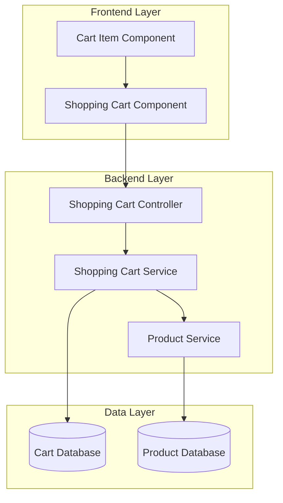
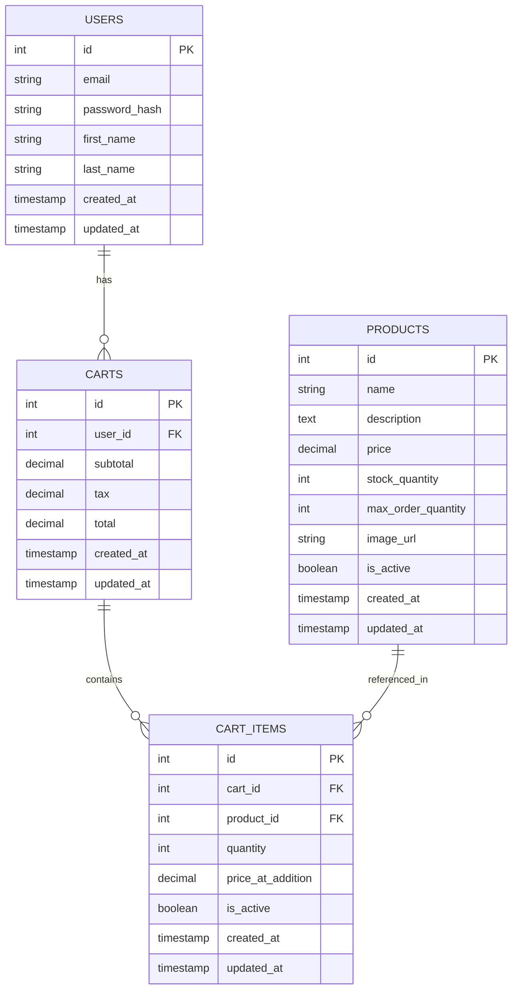
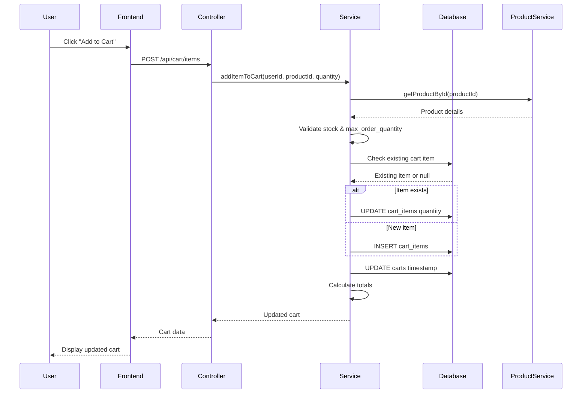
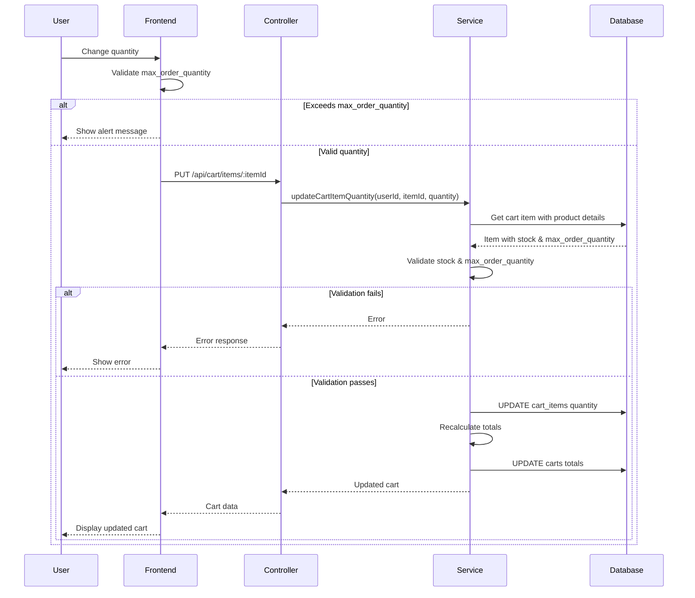

# Low Level Design (LLD) Document: E-Commerce Platform

## 1. Introduction

### 1.1 Purpose
This document provides a detailed low-level design for the E-Commerce Platform, focusing on the Shopping Cart functionality. It describes the component architecture, data models, API specifications, and implementation details.

### 1.2 Scope
This LLD covers:
- Shopping Cart Component (Frontend)
- Shopping Cart Service (Backend)
- Shopping Cart Controller (Backend)
- Cart Item Component (Frontend)
- Database schema for cart operations
- API endpoints and data flow

### 1.3 Definitions and Acronyms
- **LLD**: Low Level Design
- **API**: Application Programming Interface
- **REST**: Representational State Transfer
- **CRUD**: Create, Read, Update, Delete
- **DTO**: Data Transfer Object

## 2. System Architecture Overview

### 2.1 High-Level Architecture



### 2.2 Technology Stack
- **Frontend**: React.js, Redux, Axios
- **Backend**: Node.js, Express.js
- **Database**: PostgreSQL
- **Cache**: Redis
- **API Protocol**: REST

## 3. Component Design

### 3.1 Shopping Cart Component (Frontend)

#### 3.1.1 Component Overview
The Shopping Cart Component is the main container that displays the user's cart items, calculates totals, and provides checkout functionality.

#### 3.1.2 Component Structure

```javascript
// ShoppingCart.jsx
import React, { useEffect, useState } from 'react';
import { useDispatch, useSelector } from 'react-redux';
import CartItem from './CartItem';
import { fetchCart, clearCart } from '../redux/cartSlice';
import './ShoppingCart.css';

const ShoppingCart = () => {
  const dispatch = useDispatch();
  const { items, subtotal, tax, total, loading, error } = useSelector(
    (state) => state.cart
  );
  const [promoCode, setPromoCode] = useState('');

  useEffect(() => {
    dispatch(fetchCart());
  }, [dispatch]);

  const handleCheckout = () => {
    // Navigate to checkout page
    window.location.href = '/checkout';
  };

  const handleClearCart = () => {
    if (window.confirm('Are you sure you want to clear your cart?')) {
      dispatch(clearCart());
    }
  };

  const handleApplyPromo = () => {
    // Apply promo code logic
    console.log('Applying promo code:', promoCode);
  };

  if (loading) {
    return <div className="cart-loading">Loading cart...</div>;
  }

  if (error) {
    return <div className="cart-error">Error: {error}</div>;
  }

  if (items.length === 0) {
    return (
      <div className="cart-empty">
        <h2>Your cart is empty</h2>
        <p>Add some items to get started!</p>
        <a href="/products" className="continue-shopping-link">
          Continue Shopping
        </a>
      </div>
    );
  }

  return (
    <div className="shopping-cart">
      <h1>Shopping Cart</h1>
      
      <div className="cart-items">
        {items.map((item) => (
          <CartItem key={item.id} item={item} />
        ))}
      </div>

      <div className="cart-summary">
        <div className="promo-code">
          <input
            type="text"
            placeholder="Enter promo code"
            value={promoCode}
            onChange={(e) => setPromoCode(e.target.value)}
          />
          <button onClick={handleApplyPromo}>Apply</button>
        </div>

        <div className="cart-totals">
          <div className="total-row">
            <span>Subtotal:</span>
            <span>${subtotal.toFixed(2)}</span>
          </div>
          <div className="total-row">
            <span>Tax:</span>
            <span>${tax.toFixed(2)}</span>
          </div>
          <div className="total-row total-final">
            <span>Total:</span>
            <span>${total.toFixed(2)}</span>
          </div>
        </div>

        <div className="cart-actions">
          <button className="btn-clear" onClick={handleClearCart}>
            Clear Cart
          </button>
          <button className="btn-checkout" onClick={handleCheckout}>
            Proceed to Checkout
          </button>
        </div>
      </div>
    </div>
  );
};

export default ShoppingCart;
```

#### 3.1.3 State Management

```javascript
// redux/cartSlice.js
import { createSlice, createAsyncThunk } from '@reduxjs/toolkit';
import axios from 'axios';

const API_BASE_URL = process.env.REACT_APP_API_URL;

export const fetchCart = createAsyncThunk(
  'cart/fetchCart',
  async (_, { rejectWithValue }) => {
    try {
      const response = await axios.get(`${API_BASE_URL}/api/cart`, {
        headers: {
          Authorization: `Bearer ${localStorage.getItem('token')}`,
        },
      });
      return response.data;
    } catch (error) {
      return rejectWithValue(error.response.data);
    }
  }
);

export const addToCart = createAsyncThunk(
  'cart/addToCart',
  async ({ productId, quantity }, { rejectWithValue }) => {
    try {
      const response = await axios.post(
        `${API_BASE_URL}/api/cart/items`,
        { productId, quantity },
        {
          headers: {
            Authorization: `Bearer ${localStorage.getItem('token')}`,
          },
        }
      );
      return response.data;
    } catch (error) {
      return rejectWithValue(error.response.data);
    }
  }
);

export const clearCart = createAsyncThunk(
  'cart/clearCart',
  async (_, { rejectWithValue }) => {
    try {
      const response = await axios.delete(`${API_BASE_URL}/api/cart`, {
        headers: {
          Authorization: `Bearer ${localStorage.getItem('token')}`,
        },
      });
      return response.data;
    } catch (error) {
      return rejectWithValue(error.response.data);
    }
  }
);

const cartSlice = createSlice({
  name: 'cart',
  initialState: {
    items: [],
    subtotal: 0,
    tax: 0,
    total: 0,
    loading: false,
    error: null,
  },
  reducers: {},
  extraReducers: (builder) => {
    builder
      .addCase(fetchCart.pending, (state) => {
        state.loading = true;
        state.error = null;
      })
      .addCase(fetchCart.fulfilled, (state, action) => {
        state.loading = false;
        state.items = action.payload.items;
        state.subtotal = action.payload.subtotal;
        state.tax = action.payload.tax;
        state.total = action.payload.total;
      })
      .addCase(fetchCart.rejected, (state, action) => {
        state.loading = false;
        state.error = action.payload?.message || 'Failed to fetch cart';
      })
      .addCase(addToCart.fulfilled, (state, action) => {
        state.items = action.payload.items;
        state.subtotal = action.payload.subtotal;
        state.tax = action.payload.tax;
        state.total = action.payload.total;
      })
      .addCase(clearCart.fulfilled, (state) => {
        state.items = [];
        state.subtotal = 0;
        state.tax = 0;
        state.total = 0;
      });
  },
});

export default cartSlice.reducer;
```

### 3.2 Cart Item Component (Frontend)

#### 3.2.1 Component Overview
The Cart Item Component represents a single item in the shopping cart with options to update quantity or remove the item.

#### 3.2.2 Component Implementation

```javascript
// CartItem.jsx
import React, { useState } from 'react';
import { useDispatch } from 'react-redux';
import { updateCartItem, removeCartItem } from '../redux/cartSlice';
import './CartItem.css';

const CartItem = ({ item }) => {
  const dispatch = useDispatch();
  const [quantity, setQuantity] = useState(item.quantity);
  const [isUpdating, setIsUpdating] = useState(false);

  const handleQuantityChange = async (newQuantity) => {
    if (newQuantity < 1) return;
    
    // Validate against max_order_quantity
    if (newQuantity > item.product.max_order_quantity) {
      alert(
        `Cannot add more than ${item.product.max_order_quantity} units of this product. Maximum order quantity exceeded.`
      );
      return;
    }

    setIsUpdating(true);
    setQuantity(newQuantity);
    
    try {
      await dispatch(
        updateCartItem({
          itemId: item.id,
          quantity: newQuantity,
        })
      ).unwrap();
    } catch (error) {
      console.error('Failed to update cart item:', error);
      setQuantity(item.quantity); // Revert on error
      alert('Failed to update quantity. Please try again.');
    } finally {
      setIsUpdating(false);
    }
  };

  const handleRemove = async () => {
    if (window.confirm('Remove this item from cart?')) {
      setIsUpdating(true);
      try {
        await dispatch(removeCartItem(item.id)).unwrap();
      } catch (error) {
        console.error('Failed to remove cart item:', error);
        alert('Failed to remove item. Please try again.');
      } finally {
        setIsUpdating(false);
      }
    }
  };

  const itemTotal = item.product.price * quantity;

  return (
    <div className={`cart-item ${isUpdating ? 'updating' : ''}`}>
      <div className="item-image">
        
      </div>

      <div className="item-details">
        <h3>{item.product.name}</h3>
        <p className="item-description">{item.product.description}</p>
        <p className="item-price">${item.product.price.toFixed(2)}</p>
        {item.product.max_order_quantity && (
          <p className="item-max-quantity">
            Max order quantity: {item.product.max_order_quantity}
          </p>
        )}
      </div>

      <div className="item-quantity">
        <button
          onClick={() => handleQuantityChange(quantity - 1)}
          disabled={isUpdating || quantity <= 1}
          className="qty-btn"
        >
          -
        </button>
        <input
          type="number"
          value={quantity}
          onChange={(e) => {
            const newQty = parseInt(e.target.value) || 1;
            handleQuantityChange(newQty);
          }}
          disabled={isUpdating}
          min="1"
          max={item.product.max_order_quantity}
          className="qty-input"
        />
        <button
          onClick={() => handleQuantityChange(quantity + 1)}
          disabled={isUpdating || quantity >= item.product.max_order_quantity}
          className="qty-btn"
        >
          +
        </button>
      </div>

      <div className="item-total">
        <p className="total-label">Total:</p>
        <p className="total-amount">${itemTotal.toFixed(2)}</p>
      </div>

      <div className="item-actions">
        <button
          onClick={handleRemove}
          disabled={isUpdating}
          className="btn-remove"
        >
          Remove
        </button>
      </div>
    </div>
  );
};

export default CartItem;
```

#### 3.2.3 Redux Actions for Cart Item

```javascript
// redux/cartSlice.js (additional actions)
export const updateCartItem = createAsyncThunk(
  'cart/updateCartItem',
  async ({ itemId, quantity }, { rejectWithValue }) => {
    try {
      const response = await axios.put(
        `${API_BASE_URL}/api/cart/items/${itemId}`,
        { quantity },
        {
          headers: {
            Authorization: `Bearer ${localStorage.getItem('token')}`,
          },
        }
      );
      return response.data;
    } catch (error) {
      return rejectWithValue(error.response.data);
    }
  }
);

export const removeCartItem = createAsyncThunk(
  'cart/removeCartItem',
  async (itemId, { rejectWithValue }) => {
    try {
      const response = await axios.delete(
        `${API_BASE_URL}/api/cart/items/${itemId}`,
        {
          headers: {
            Authorization: `Bearer ${localStorage.getItem('token')}`,
          },
        }
      );
      return response.data;
    } catch (error) {
      return rejectWithValue(error.response.data);
    }
  }
);

// Add to extraReducers in cartSlice
// .addCase(updateCartItem.fulfilled, (state, action) => {
//   state.items = action.payload.items;
//   state.subtotal = action.payload.subtotal;
//   state.tax = action.payload.tax;
//   state.total = action.payload.total;
// })
// .addCase(removeCartItem.fulfilled, (state, action) => {
//   state.items = action.payload.items;
//   state.subtotal = action.payload.subtotal;
//   state.tax = action.payload.tax;
//   state.total = action.payload.total;
// });
```

### 3.3 Shopping Cart Controller (Backend)

#### 3.3.1 Controller Overview
The Shopping Cart Controller handles HTTP requests related to cart operations and delegates business logic to the Shopping Cart Service.

#### 3.3.2 Controller Implementation

```javascript
// controllers/cartController.js
const cartService = require('../services/cartService');
const { validationResult } = require('express-validator');

class CartController {
  /**
   * Get user's shopping cart
   * GET /api/cart
   */
  async getCart(req, res) {
    try {
      const userId = req.user.id;
      const cart = await cartService.getCartByUserId(userId);
      
      return res.status(200).json({
        success: true,
        data: cart,
      });
    } catch (error) {
      console.error('Error fetching cart:', error);
      return res.status(500).json({
        success: false,
        message: 'Failed to fetch cart',
        error: error.message,
      });
    }
  }

  /**
   * Add item to cart
   * POST /api/cart/items
   */
  async addItem(req, res) {
    try {
      const errors = validationResult(req);
      if (!errors.isEmpty()) {
        return res.status(400).json({
          success: false,
          errors: errors.array(),
        });
      }

      const userId = req.user.id;
      const { productId, quantity } = req.body;

      const cart = await cartService.addItemToCart(userId, productId, quantity);

      return res.status(200).json({
        success: true,
        message: 'Item added to cart',
        data: cart,
      });
    } catch (error) {
      console.error('Error adding item to cart:', error);
      
      if (error.message.includes('not found')) {
        return res.status(404).json({
          success: false,
          message: error.message,
        });
      }
      
      if (error.message.includes('out of stock') || 
          error.message.includes('exceeds available stock') ||
          error.message.includes('exceeds maximum order quantity')) {
        return res.status(400).json({
          success: false,
          message: error.message,
        });
      }

      return res.status(500).json({
        success: false,
        message: 'Failed to add item to cart',
        error: error.message,
      });
    }
  }

  /**
   * Update cart item quantity
   * PUT /api/cart/items/:itemId
   */
  async updateItem(req, res) {
    try {
      const errors = validationResult(req);
      if (!errors.isEmpty()) {
        return res.status(400).json({
          success: false,
          errors: errors.array(),
        });
      }

      const userId = req.user.id;
      const { itemId } = req.params;
      const { quantity } = req.body;

      // Validate that updated quantity does not exceed max_order_quantity
      const cart = await cartService.updateCartItemQuantity(
        userId,
        itemId,
        quantity
      );

      return res.status(200).json({
        success: true,
        message: 'Cart item updated',
        data: cart,
      });
    } catch (error) {
      console.error('Error updating cart item:', error);
      
      if (error.message.includes('not found')) {
        return res.status(404).json({
          success: false,
          message: error.message,
        });
      }
      
      if (error.message.includes('out of stock') || 
          error.message.includes('exceeds available stock') ||
          error.message.includes('exceeds maximum order quantity')) {
        return res.status(400).json({
          success: false,
          message: error.message,
        });
      }

      return res.status(500).json({
        success: false,
        message: 'Failed to update cart item',
        error: error.message,
      });
    }
  }

  /**
   * Remove item from cart
   * DELETE /api/cart/items/:itemId
   */
  async removeItem(req, res) {
    try {
      const userId = req.user.id;
      const { itemId } = req.params;

      const cart = await cartService.removeItemFromCart(userId, itemId);

      return res.status(200).json({
        success: true,
        message: 'Item removed from cart',
        data: cart,
      });
    } catch (error) {
      console.error('Error removing cart item:', error);
      
      if (error.message.includes('not found')) {
        return res.status(404).json({
          success: false,
          message: error.message,
        });
      }

      return res.status(500).json({
        success: false,
        message: 'Failed to remove cart item',
        error: error.message,
      });
    }
  }

  /**
   * Clear entire cart
   * DELETE /api/cart
   */
  async clearCart(req, res) {
    try {
      const userId = req.user.id;
      await cartService.clearCart(userId);

      return res.status(200).json({
        success: true,
        message: 'Cart cleared successfully',
        data: {
          items: [],
          subtotal: 0,
          tax: 0,
          total: 0,
        },
      });
    } catch (error) {
      console.error('Error clearing cart:', error);
      return res.status(500).json({
        success: false,
        message: 'Failed to clear cart',
        error: error.message,
      });
    }
  }
}

module.exports = new CartController();
```

#### 3.3.3 Route Configuration

```javascript
// routes/cartRoutes.js
const express = require('express');
const router = express.Router();
const cartController = require('../controllers/cartController');
const authMiddleware = require('../middleware/authMiddleware');
const { body, param } = require('express-validator');

// All cart routes require authentication
router.use(authMiddleware);

// Validation middleware
const addItemValidation = [
  body('productId').isInt({ min: 1 }).withMessage('Valid product ID is required'),
  body('quantity').isInt({ min: 1 }).withMessage('Quantity must be at least 1'),
];

const updateItemValidation = [
  param('itemId').isInt({ min: 1 }).withMessage('Valid item ID is required'),
  body('quantity').isInt({ min: 1 }).withMessage('Quantity must be at least 1'),
];

const removeItemValidation = [
  param('itemId').isInt({ min: 1 }).withMessage('Valid item ID is required'),
];

// Routes
router.get('/', cartController.getCart);
router.post('/items', addItemValidation, cartController.addItem);
router.put('/items/:itemId', updateItemValidation, cartController.updateItem);
router.delete('/items/:itemId', removeItemValidation, cartController.removeItem);
router.delete('/', cartController.clearCart);

module.exports = router;
```

### 3.4 Shopping Cart Service (Backend)

#### 3.4.1 Service Overview
The Shopping Cart Service contains the core business logic for cart operations, including validation, calculation, and data persistence.

#### 3.4.2 Service Implementation

```javascript
// services/cartService.js
const db = require('../config/database');
const productService = require('./productService');

class CartService {
  /**
   * Get cart by user ID
   */
  async getCartByUserId(userId) {
    try {
      // Get cart
      let cart = await db.query(
        'SELECT * FROM carts WHERE user_id = $1',
        [userId]
      );

      if (cart.rows.length === 0) {
        // Create new cart if doesn't exist
        cart = await db.query(
          'INSERT INTO carts (user_id, created_at, updated_at) VALUES ($1, NOW(), NOW()) RETURNING *',
          [userId]
        );
      }

      const cartId = cart.rows[0].id;

      // Get cart items with product details
      const items = await db.query(
        `SELECT ci.id, ci.quantity, ci.price_at_addition,
                p.id as product_id, p.name, p.description, p.price, 
                p.image_url, p.stock_quantity, p.max_order_quantity
         FROM cart_items ci
         JOIN products p ON ci.product_id = p.id
         WHERE ci.cart_id = $1 AND ci.is_active = true`,
        [cartId]
      );

      // Calculate totals
      const { subtotal, tax, total } = this.calculateCartTotals(items.rows);

      return {
        id: cartId,
        items: items.rows.map(item => ({
          id: item.id,
          quantity: item.quantity,
          product: {
            id: item.product_id,
            name: item.name,
            description: item.description,
            price: parseFloat(item.price),
            imageUrl: item.image_url,
            stockQuantity: item.stock_quantity,
            max_order_quantity: item.max_order_quantity,
          },
        })),
        subtotal,
        tax,
        total,
      };
    } catch (error) {
      console.error('Error in getCartByUserId:', error);
      throw error;
    }
  }

  /**
   * Add item to cart
   */
  async addItemToCart(userId, productId, quantity) {
    try {
      // Validate product exists and has sufficient stock
      const product = await productService.getProductById(productId);
      
      if (!product) {
        throw new Error('Product not found');
      }

      if (product.stock_quantity < quantity) {
        throw new Error('Insufficient stock available');
      }

      if (product.max_order_quantity && quantity > product.max_order_quantity) {
        throw new Error(
          `Quantity exceeds maximum order quantity of ${product.max_order_quantity}`
        );
      }

      // Get or create cart
      let cart = await db.query(
        'SELECT * FROM carts WHERE user_id = $1',
        [userId]
      );

      let cartId;
      if (cart.rows.length === 0) {
        cart = await db.query(
          'INSERT INTO carts (user_id, created_at, updated_at) VALUES ($1, NOW(), NOW()) RETURNING *',
          [userId]
        );
        cartId = cart.rows[0].id;
      } else {
        cartId = cart.rows[0].id;
      }

      // Check if item already exists in cart
      const existingItem = await db.query(
        'SELECT * FROM cart_items WHERE cart_id = $1 AND product_id = $2 AND is_active = true',
        [cartId, productId]
      );

      if (existingItem.rows.length > 0) {
        // Update quantity
        const newQuantity = existingItem.rows[0].quantity + quantity;
        
        if (product.stock_quantity < newQuantity) {
          throw new Error('Requested quantity exceeds available stock');
        }

        if (product.max_order_quantity && newQuantity > product.max_order_quantity) {
          throw new Error(
            `Total quantity would exceed maximum order quantity of ${product.max_order_quantity}`
          );
        }

        await db.query(
          'UPDATE cart_items SET quantity = $1, updated_at = NOW() WHERE id = $2',
          [newQuantity, existingItem.rows[0].id]
        );
      } else {
        // Add new item
        await db.query(
          `INSERT INTO cart_items (cart_id, product_id, quantity, price_at_addition, created_at, updated_at)
           VALUES ($1, $2, $3, $4, NOW(), NOW())`,
          [cartId, productId, quantity, product.price]
        );
      }

      // Update cart timestamp
      await db.query(
        'UPDATE carts SET updated_at = NOW() WHERE id = $1',
        [cartId]
      );

      // Return updated cart
      return await this.getCartByUserId(userId);
    } catch (error) {
      console.error('Error in addItemToCart:', error);
      throw error;
    }
  }

  /**
   * Update cart item quantity with automatic recalculation
   */
  async updateCartItemQuantity(userId, itemId, quantity) {
    try {
      // Get cart item
      const item = await db.query(
        `SELECT ci.*, c.user_id, p.stock_quantity, p.max_order_quantity
         FROM cart_items ci
         JOIN carts c ON ci.cart_id = c.id
         JOIN products p ON ci.product_id = p.id
         WHERE ci.id = $1 AND ci.is_active = true`,
        [itemId]
      );

      if (item.rows.length === 0) {
        throw new Error('Cart item not found');
      }

      if (item.rows[0].user_id !== userId) {
        throw new Error('Unauthorized access to cart item');
      }

      const stockQuantity = item.rows[0].stock_quantity;
      const maxOrderQuantity = item.rows[0].max_order_quantity;

      if (quantity > stockQuantity) {
        throw new Error('Requested quantity exceeds available stock');
      }

      // Validate against max_order_quantity on update
      if (maxOrderQuantity && quantity > maxOrderQuantity) {
        throw new Error(
          `Quantity exceeds maximum order quantity of ${maxOrderQuantity}`
        );
      }

      // Update quantity
      await db.query(
        'UPDATE cart_items SET quantity = $1, updated_at = NOW() WHERE id = $2',
        [quantity, itemId]
      );

      // Update cart timestamp
      await db.query(
        'UPDATE carts SET updated_at = NOW() WHERE user_id = $1',
        [userId]
      );

      // Automatic recalculation of subtotal and total upon quantity mutation
      const updatedCart = await this.getCartByUserId(userId);
      
      // Recalculate and persist totals
      const { subtotal, tax, total } = this.calculateCartTotals(updatedCart.items);
      
      await db.query(
        'UPDATE carts SET subtotal = $1, tax = $2, total = $3, updated_at = NOW() WHERE user_id = $4',
        [subtotal, tax, total, userId]
      );

      // Return updated cart with recalculated totals
      return await this.getCartByUserId(userId);
    } catch (error) {
      console.error('Error in updateCartItemQuantity:', error);
      throw error;
    }
  }

  /**
   * Remove item from cart
   */
  async removeItemFromCart(userId, itemId) {
    try {
      // Verify item belongs to user's cart
      const item = await db.query(
        `SELECT ci.*, c.user_id
         FROM cart_items ci
         JOIN carts c ON ci.cart_id = c.id
         WHERE ci.id = $1 AND ci.is_active = true`,
        [itemId]
      );

      if (item.rows.length === 0) {
        throw new Error('Cart item not found');
      }

      if (item.rows[0].user_id !== userId) {
        throw new Error('Unauthorized access to cart item');
      }

      // Soft delete
      await db.query(
        'UPDATE cart_items SET is_active = false, updated_at = NOW() WHERE id = $1',
        [itemId]
      );

      // Update cart timestamp
      await db.query(
        'UPDATE carts SET updated_at = NOW() WHERE user_id = $1',
        [userId]
      );

      return await this.getCartByUserId(userId);
    } catch (error) {
      console.error('Error in removeItemFromCart:', error);
      throw error;
    }
  }

  /**
   * Clear cart
   */
  async clearCart(userId) {
    try {
      const cart = await db.query(
        'SELECT id FROM carts WHERE user_id = $1',
        [userId]
      );

      if (cart.rows.length > 0) {
        await db.query(
          'UPDATE cart_items SET is_active = false, updated_at = NOW() WHERE cart_id = $1',
          [cart.rows[0].id]
        );

        await db.query(
          'UPDATE carts SET updated_at = NOW() WHERE id = $1',
          [cart.rows[0].id]
        );
      }

      return true;
    } catch (error) {
      console.error('Error in clearCart:', error);
      throw error;
    }
  }

  /**
   * Calculate cart totals with automatic recalculation
   */
  calculateCartTotals(items) {
    const subtotal = items.reduce((sum, item) => {
      const itemPrice = parseFloat(item.price || item.product?.price || 0);
      return sum + (itemPrice * item.quantity);
    }, 0);

    const taxRate = 0.08; // 8% tax rate
    const tax = subtotal * taxRate;
    const total = subtotal + tax;

    return {
      subtotal: parseFloat(subtotal.toFixed(2)),
      tax: parseFloat(tax.toFixed(2)),
      total: parseFloat(total.toFixed(2)),
    };
  }

  /**
   * Validate cart before checkout
   */
  async validateCart(userId) {
    try {
      const cart = await this.getCartByUserId(userId);

      if (cart.items.length === 0) {
        throw new Error('Cart is empty');
      }

      // Validate each item
      for (const item of cart.items) {
        const product = await productService.getProductById(item.product.id);
        
        if (!product) {
          throw new Error(`Product ${item.product.name} is no longer available`);
        }

        if (product.stock_quantity < item.quantity) {
          throw new Error(
            `Insufficient stock for ${item.product.name}. Available: ${product.stock_quantity}`
          );
        }

        if (product.max_order_quantity && item.quantity > product.max_order_quantity) {
          throw new Error(
            `Quantity for ${item.product.name} exceeds maximum order quantity of ${product.max_order_quantity}`
          );
        }
      }

      return true;
    } catch (error) {
      console.error('Error in validateCart:', error);
      throw error;
    }
  }
}

module.exports = new CartService();
```

## 4. Database Design

### 4.1 Schema Diagram



### 4.2 Table Definitions

#### 4.2.1 Carts Table

```sql
CREATE TABLE carts (
    id SERIAL PRIMARY KEY,
    user_id INTEGER NOT NULL REFERENCES users(id) ON DELETE CASCADE,
    subtotal DECIMAL(10, 2) DEFAULT 0.00,
    tax DECIMAL(10, 2) DEFAULT 0.00,
    total DECIMAL(10, 2) DEFAULT 0.00,
    created_at TIMESTAMP NOT NULL DEFAULT CURRENT_TIMESTAMP,
    updated_at TIMESTAMP NOT NULL DEFAULT CURRENT_TIMESTAMP,
    CONSTRAINT unique_user_cart UNIQUE(user_id)
);

CREATE INDEX idx_carts_user_id ON carts(user_id);
```

#### 4.2.2 Cart Items Table

```sql
CREATE TABLE cart_items (
    id SERIAL PRIMARY KEY,
    cart_id INTEGER NOT NULL REFERENCES carts(id) ON DELETE CASCADE,
    product_id INTEGER NOT NULL REFERENCES products(id) ON DELETE CASCADE,
    quantity INTEGER NOT NULL CHECK (quantity > 0),
    price_at_addition DECIMAL(10, 2) NOT NULL,
    is_active BOOLEAN DEFAULT true,
    created_at TIMESTAMP NOT NULL DEFAULT CURRENT_TIMESTAMP,
    updated_at TIMESTAMP NOT NULL DEFAULT CURRENT_TIMESTAMP,
    CONSTRAINT unique_cart_product UNIQUE(cart_id, product_id, is_active)
);

CREATE INDEX idx_cart_items_cart_id ON cart_items(cart_id);
CREATE INDEX idx_cart_items_product_id ON cart_items(product_id);
CREATE INDEX idx_cart_items_is_active ON cart_items(is_active);
```

#### 4.2.3 Products Table

```sql
CREATE TABLE products (
    id SERIAL PRIMARY KEY,
    name VARCHAR(255) NOT NULL,
    description TEXT,
    price DECIMAL(10, 2) NOT NULL CHECK (price >= 0),
    stock_quantity INTEGER NOT NULL DEFAULT 0 CHECK (stock_quantity >= 0),
    max_order_quantity INTEGER CHECK (max_order_quantity > 0),
    image_url VARCHAR(500),
    is_active BOOLEAN DEFAULT true,
    created_at TIMESTAMP NOT NULL DEFAULT CURRENT_TIMESTAMP,
    updated_at TIMESTAMP NOT NULL DEFAULT CURRENT_TIMESTAMP
);

CREATE INDEX idx_products_is_active ON products(is_active);
CREATE INDEX idx_products_name ON products(name);
```

## 5. API Specifications

### 5.1 API Endpoints

#### 5.1.1 Get Cart
```
GET /api/cart
Authorization: Bearer {token}

Response 200:
{
  "success": true,
  "data": {
    "id": 1,
    "items": [
      {
        "id": 1,
        "quantity": 2,
        "product": {
          "id": 101,
          "name": "Product Name",
          "description": "Product description",
          "price": 29.99,
          "imageUrl": "https://example.com/image.jpg",
          "stockQuantity": 50,
          "max_order_quantity": 10
        }
      }
    ],
    "subtotal": 59.98,
    "tax": 4.80,
    "total": 64.78
  }
}
```

#### 5.1.2 Add Item to Cart
```
POST /api/cart/items
Authorization: Bearer {token}
Content-Type: application/json

Request Body:
{
  "productId": 101,
  "quantity": 2
}

Response 200:
{
  "success": true,
  "message": "Item added to cart",
  "data": {
    "id": 1,
    "items": [...],
    "subtotal": 59.98,
    "tax": 4.80,
    "total": 64.78
  }
}

Error Response 400:
{
  "success": false,
  "message": "Quantity exceeds maximum order quantity of 10"
}
```

#### 5.1.3 Update Cart Item
```
PUT /api/cart/items/:itemId
Authorization: Bearer {token}
Content-Type: application/json

Request Body:
{
  "quantity": 3
}

Response 200:
{
  "success": true,
  "message": "Cart item updated",
  "data": {
    "id": 1,
    "items": [...],
    "subtotal": 89.97,
    "tax": 7.20,
    "total": 97.17
  }
}

Error Response 400:
{
  "success": false,
  "message": "Quantity exceeds maximum order quantity of 10"
}
```

#### 5.1.4 Remove Cart Item
```
DELETE /api/cart/items/:itemId
Authorization: Bearer {token}

Response 200:
{
  "success": true,
  "message": "Item removed from cart",
  "data": {
    "id": 1,
    "items": [...],
    "subtotal": 29.99,
    "tax": 2.40,
    "total": 32.39
  }
}
```

#### 5.1.5 Clear Cart
```
DELETE /api/cart
Authorization: Bearer {token}

Response 200:
{
  "success": true,
  "message": "Cart cleared successfully",
  "data": {
    "items": [],
    "subtotal": 0,
    "tax": 0,
    "total": 0
  }
}
```

## 6. Data Flow Diagrams

### 6.1 Add to Cart Flow



### 6.2 Update Quantity Flow



## 7. Error Handling

### 7.1 Error Types

```javascript
// utils/errors.js
class AppError extends Error {
  constructor(message, statusCode) {
    super(message);
    this.statusCode = statusCode;
    this.isOperational = true;
    Error.captureStackTrace(this, this.constructor);
  }
}

class ValidationError extends AppError {
  constructor(message) {
    super(message, 400);
  }
}

class NotFoundError extends AppError {
  constructor(message) {
    super(message, 404);
  }
}

class UnauthorizedError extends AppError {
  constructor(message) {
    super(message, 401);
  }
}

class InsufficientStockError extends AppError {
  constructor(message) {
    super(message, 400);
  }
}

class MaxOrderQuantityError extends AppError {
  constructor(message) {
    super(message, 400);
  }
}

module.exports = {
  AppError,
  ValidationError,
  NotFoundError,
  UnauthorizedError,
  InsufficientStockError,
  MaxOrderQuantityError,
};
```

### 7.2 Global Error Handler

```javascript
// middleware/errorHandler.js
const errorHandler = (err, req, res, next) => {
  let error = { ...err };
  error.message = err.message;

  // Log error for debugging
  console.error(err);

  // Mongoose bad ObjectId
  if (err.name === 'CastError') {
    const message = 'Resource not found';
    error = new NotFoundError(message);
  }

  // Mongoose duplicate key
  if (err.code === 11000) {
    const message = 'Duplicate field value entered';
    error = new ValidationError(message);
  }

  // Mongoose validation error
  if (err.name === 'ValidationError') {
    const message = Object.values(err.errors).map(val => val.message);
    error = new ValidationError(message);
  }

  res.status(error.statusCode || 500).json({
    success: false,
    error: error.message || 'Server Error',
  });
};

module.exports = errorHandler;
```

## 8. Security Considerations

### 8.1 Authentication Middleware

```javascript
// middleware/authMiddleware.js
const jwt = require('jsonwebtoken');
const { UnauthorizedError } = require('../utils/errors');

const authMiddleware = async (req, res, next) => {
  try {
    let token;

    if (req.headers.authorization && req.headers.authorization.startsWith('Bearer')) {
      token = req.headers.authorization.split(' ')[1];
    }

    if (!token) {
      throw new UnauthorizedError('Not authorized to access this route');
    }

    try {
      const decoded = jwt.verify(token, process.env.JWT_SECRET);
      req.user = decoded;
      next();
    } catch (err) {
      throw new UnauthorizedError('Not authorized to access this route');
    }
  } catch (error) {
    next(error);
  }
};

module.exports = authMiddleware;
```

### 8.2 Input Validation

```javascript
// middleware/validation.js
const { body, param, validationResult } = require('express-validator');

const validateAddToCart = [
  body('productId')
    .isInt({ min: 1 })
    .withMessage('Valid product ID is required'),
  body('quantity')
    .isInt({ min: 1, max: 1000 })
    .withMessage('Quantity must be between 1 and 1000'),
];

const validateUpdateCartItem = [
  param('itemId')
    .isInt({ min: 1 })
    .withMessage('Valid item ID is required'),
  body('quantity')
    .isInt({ min: 1, max: 1000 })
    .withMessage('Quantity must be between 1 and 1000'),
];

const handleValidationErrors = (req, res, next) => {
  const errors = validationResult(req);
  if (!errors.isEmpty()) {
    return res.status(400).json({
      success: false,
      errors: errors.array(),
    });
  }
  next();
};

module.exports = {
  validateAddToCart,
  validateUpdateCartItem,
  handleValidationErrors,
};
```

## 9. Testing Strategy

### 9.1 Unit Tests

```javascript
// tests/services/cartService.test.js
const cartService = require('../../services/cartService');
const db = require('../../config/database');
const productService = require('../../services/productService');

jest.mock('../../config/database');
jest.mock('../../services/productService');

describe('CartService', () => {
  describe('addItemToCart', () => {
    it('should add item to cart successfully', async () => {
      const mockProduct = {
        id: 1,
        name: 'Test Product',
        price: 29.99,
        stock_quantity: 100,
        max_order_quantity: 10,
      };

      productService.getProductById.mockResolvedValue(mockProduct);
      db.query.mockResolvedValueOnce({ rows: [] }); // No existing cart
      db.query.mockResolvedValueOnce({ rows: [{ id: 1 }] }); // Create cart
      db.query.mockResolvedValueOnce({ rows: [] }); // No existing item
      db.query.mockResolvedValueOnce({ rows: [] }); // Insert item

      const result = await cartService.addItemToCart(1, 1, 2);

      expect(result).toBeDefined();
      expect(productService.getProductById).toHaveBeenCalledWith(1);
    });

    it('should throw error when quantity exceeds max_order_quantity', async () => {
      const mockProduct = {
        id: 1,
        name: 'Test Product',
        price: 29.99,
        stock_quantity: 100,
        max_order_quantity: 5,
      };

      productService.getProductById.mockResolvedValue(mockProduct);

      await expect(
        cartService.addItemToCart(1, 1, 10)
      ).rejects.toThrow('exceeds maximum order quantity');
    });

    it('should throw error when insufficient stock', async () => {
      const mockProduct = {
        id: 1,
        name: 'Test Product',
        price: 29.99,
        stock_quantity: 2,
        max_order_quantity: 10,
      };

      productService.getProductById.mockResolvedValue(mockProduct);

      await expect(
        cartService.addItemToCart(1, 1, 5)
      ).rejects.toThrow('Insufficient stock');
    });
  });

  describe('calculateCartTotals', () => {
    it('should calculate totals correctly', () => {
      const items = [
        { quantity: 2, product: { price: 10.00 } },
        { quantity: 1, product: { price: 15.00 } },
      ];

      const result = cartService.calculateCartTotals(items);

      expect(result.subtotal).toBe(35.00);
      expect(result.tax).toBe(2.80); // 8% of 35.00
      expect(result.total).toBe(37.80);
    });
  });
});
```

### 9.2 Integration Tests

```javascript
// tests/integration/cart.test.js
const request = require('supertest');
const app = require('../../app');
const db = require('../../config/database');

describe('Cart API Integration Tests', () => {
  let authToken;
  let userId;

  beforeAll(async () => {
    // Setup test database and get auth token
    const response = await request(app)
      .post('/api/auth/login')
      .send({
        email: 'test@example.com',
        password: 'password123',
      });

    authToken = response.body.token;
    userId = response.body.user.id;
  });

  afterAll(async () => {
    // Cleanup test data
    await db.query('DELETE FROM cart_items WHERE cart_id IN (SELECT id FROM carts WHERE user_id = $1)', [userId]);
    await db.query('DELETE FROM carts WHERE user_id = $1', [userId]);
  });

  describe('POST /api/cart/items', () => {
    it('should add item to cart', async () => {
      const response = await request(app)
        .post('/api/cart/items')
        .set('Authorization', `Bearer ${authToken}`)
        .send({
          productId: 1,
          quantity: 2,
        });

      expect(response.status).toBe(200);
      expect(response.body.success).toBe(true);
      expect(response.body.data.items).toHaveLength(1);
    });

    it('should return error when quantity exceeds max_order_quantity', async () => {
      const response = await request(app)
        .post('/api/cart/items')
        .set('Authorization', `Bearer ${authToken}`)
        .send({
          productId: 1,
          quantity: 100,
        });

      expect(response.status).toBe(400);
      expect(response.body.success).toBe(false);
      expect(response.body.message).toContain('maximum order quantity');
    });
  });

  describe('PUT /api/cart/items/:itemId', () => {
    it('should update cart item quantity', async () => {
      // First add an item
      const addResponse = await request(app)
        .post('/api/cart/items')
        .set('Authorization', `Bearer ${authToken}`)
        .send({
          productId: 1,
          quantity: 2,
        });

      const itemId = addResponse.body.data.items[0].id;

      // Then update it
      const updateResponse = await request(app)
        .put(`/api/cart/items/${itemId}`)
        .set('Authorization', `Bearer ${authToken}`)
        .send({
          quantity: 3,
        });

      expect(updateResponse.status).toBe(200);
      expect(updateResponse.body.success).toBe(true);
      expect(updateResponse.body.data.items[0].quantity).toBe(3);
    });
  });
});
```

## 10. Performance Optimization

### 10.1 Caching Strategy

```javascript
// services/cacheService.js
const redis = require('redis');
const client = redis.createClient({
  host: process.env.REDIS_HOST,
  port: process.env.REDIS_PORT,
});

class CacheService {
  async get(key) {
    return new Promise((resolve, reject) => {
      client.get(key, (err, data) => {
        if (err) reject(err);
        resolve(data ? JSON.parse(data) : null);
      });
    });
  }

  async set(key, value, expiration = 3600) {
    return new Promise((resolve, reject) => {
      client.setex(key, expiration, JSON.stringify(value), (err) => {
        if (err) reject(err);
        resolve(true);
      });
    });
  }

  async delete(key) {
    return new Promise((resolve, reject) => {
      client.del(key, (err) => {
        if (err) reject(err);
        resolve(true);
      });
    });
  }

  generateCartKey(userId) {
    return `cart:user:${userId}`;
  }
}

module.exports = new CacheService();
```

### 10.2 Database Indexing

```sql
-- Performance indexes for cart operations
CREATE INDEX CONCURRENTLY idx_cart_items_cart_product 
ON cart_items(cart_id, product_id) 
WHERE is_active = true;

CREATE INDEX CONCURRENTLY idx_carts_user_updated 
ON carts(user_id, updated_at DESC);

-- Partial index for active cart items
CREATE INDEX CONCURRENTLY idx_cart_items_active 
ON cart_items(cart_id) 
WHERE is_active = true;
```

## 11. Deployment Considerations

### 11.1 Environment Configuration

```javascript
// config/config.js
module.exports = {
  development: {
    database: {
      host: process.env.DB_HOST || 'localhost',
      port: process.env.DB_PORT || 5432,
      name: process.env.DB_NAME || 'ecommerce_dev',
      user: process.env.DB_USER || 'postgres',
      password: process.env.DB_PASSWORD || 'password',
    },
    redis: {
      host: process.env.REDIS_HOST || 'localhost',
      port: process.env.REDIS_PORT || 6379,
    },
    jwt: {
      secret: process.env.JWT_SECRET || 'dev-secret-key',
      expiresIn: '24h',
    },
  },
  production: {
    database: {
      host: process.env.DB_HOST,
      port: process.env.DB_PORT,
      name: process.env.DB_NAME,
      user: process.env.DB_USER,
      password: process.env.DB_PASSWORD,
      ssl: true,
    },
    redis: {
      host: process.env.REDIS_HOST,
      port: process.env.REDIS_PORT,
      password: process.env.REDIS_PASSWORD,
    },
    jwt: {
      secret: process.env.JWT_SECRET,
      expiresIn: '1h',
    },
  },
};
```

### 11.2 Docker Configuration

```dockerfile
# Dockerfile
FROM node:16-alpine

WORKDIR /app

COPY package*.json ./
RUN npm ci --only=production

COPY . .

EXPOSE 3000

CMD ["node", "server.js"]
```

```yaml
# docker-compose.yml
version: '3.8'

services:
  app:
    build: .
    ports:
      - "3000:3000"
    environment:
      - NODE_ENV=production
      - DB_HOST=postgres
      - REDIS_HOST=redis
    depends_on:
      - postgres
      - redis

  postgres:
    image: postgres:14-alpine
    environment:
      - POSTGRES_DB=ecommerce
      - POSTGRES_USER=postgres
      - POSTGRES_PASSWORD=password
    volumes:
      - postgres_data:/var/lib/postgresql/data

  redis:
    image: redis:7-alpine
    volumes:
      - redis_data:/data

volumes:
  postgres_data:
  redis_data:
```

## 12. Monitoring and Logging

### 12.1 Logging Configuration

```javascript
// utils/logger.js
const winston = require('winston');

const logger = winston.createLogger({
  level: process.env.LOG_LEVEL || 'info',
  format: winston.format.combine(
    winston.format.timestamp(),
    winston.format.errors({ stack: true }),
    winston.format.json()
  ),
  transports: [
    new winston.transports.File({ filename: 'error.log', level: 'error' }),
    new winston.transports.File({ filename: 'combined.log' }),
  ],
});

if (process.env.NODE_ENV !== 'production') {
  logger.add(new winston.transports.Console({
    format: winston.format.simple(),
  }));
}

module.exports = logger;
```

## 13. Conclusion

This Low Level Design document provides a comprehensive blueprint for implementing the Shopping Cart functionality of the E-Commerce Platform. It covers all aspects from component architecture to deployment considerations, ensuring a robust, scalable, and maintainable solution.

### 13.1 Key Features Implemented
- Complete shopping cart management (add, update, remove, clear)
- Real-time cart total calculations with automatic recalculation
- Stock validation and max order quantity enforcement
- User-friendly error handling and validation
- Secure authentication and authorization
- Performance optimization through caching and indexing
- Comprehensive testing strategy
- Empty cart view with redirection link to continue shopping

### 13.2 Next Steps
1. Implement the components as per this design
2. Set up the database schema and indexes
3. Configure the development and production environments
4. Write and execute unit and integration tests
5. Deploy to staging environment for QA testing
6. Monitor performance and optimize as needed
7. Deploy to production with proper monitoring

---

**Document Version**: 1.0  
**Last Updated**: 2024-01-15  
**Status**: Ready for Implementation