# Low-Level Design Document: E-commerce Product Management System

## 1. Project Overview

### 1.1 Purpose
This document provides a detailed low-level design for an E-commerce Product Management System. The system enables users to browse products, manage shopping carts, and perform CRUD operations on products.

### 1.2 Scope
The system includes:
- Product catalog management
- Shopping cart functionality
- Category-based product organization
- Product search capabilities
- RESTful API endpoints

### 1.3 Technology Stack
- **Backend Framework**: Spring Boot 3.x
- **Language**: Java 17
- **Database**: PostgreSQL
- **ORM**: Spring Data JPA/Hibernate
- **API Documentation**: OpenAPI/Swagger
- **Build Tool**: Maven
- **Testing**: JUnit 5, Mockito

---

## 2. System Architecture

### 2.1 Layered Architecture
The system follows a layered architecture pattern:

```
┌─────────────────────────────────────┐
│     Presentation Layer (REST)       │
├─────────────────────────────────────┤
│       Service Layer (Business)      │
├─────────────────────────────────────┤
│    Repository Layer (Data Access)   │
├─────────────────────────────────────┤
│         Database (PostgreSQL)       │
└─────────────────────────────────────┘
```

### 2.2 Class Diagram

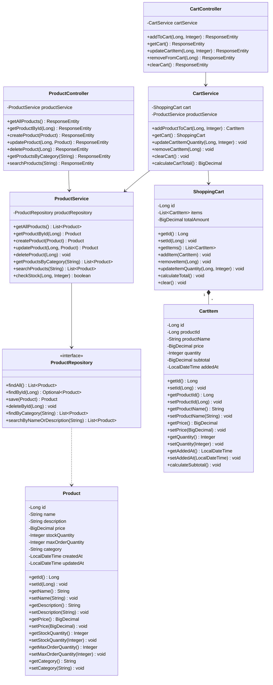

### 2.3 Entity Relationship Diagram

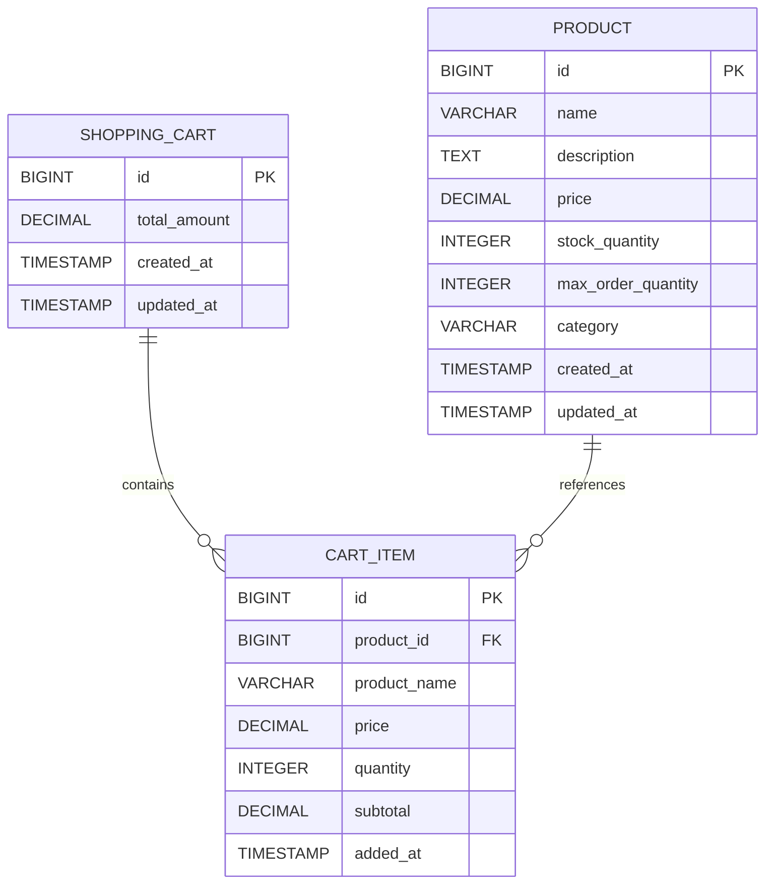

---

## 3. Detailed Component Design

### 3.1 Product Management

#### 3.1.1 Get All Products

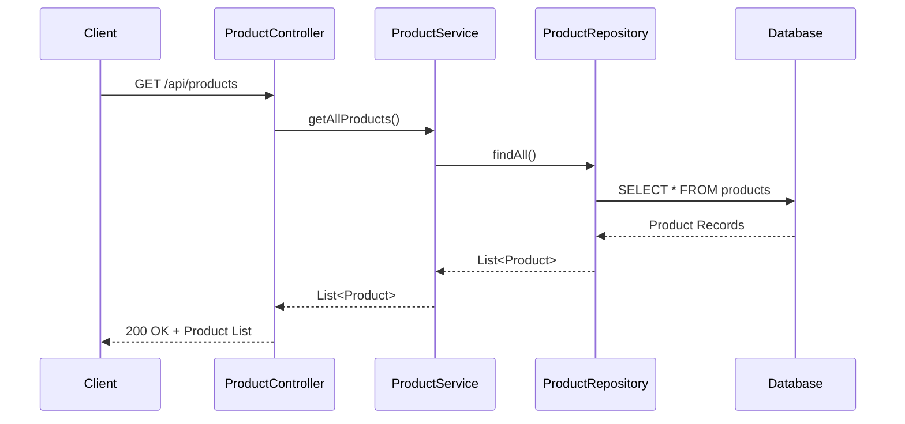

**Implementation Details:**
- **Endpoint**: `GET /api/products`
- **Response**: List of all products with pagination support
- **Error Handling**: Returns empty list if no products exist

#### 3.1.2 Get Product By ID

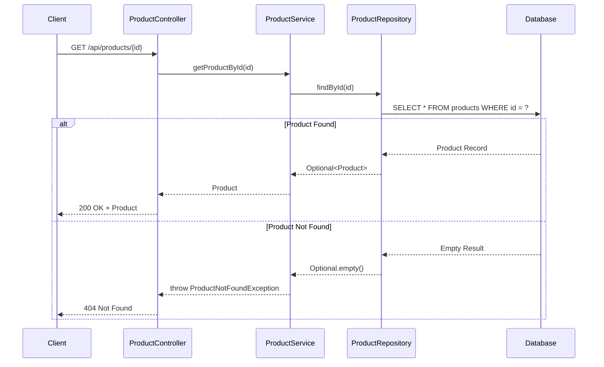

**Implementation Details:**
- **Endpoint**: `GET /api/products/{id}`
- **Path Variable**: `id` (Long)
- **Success Response**: 200 OK with product details
- **Error Response**: 404 Not Found if product doesn't exist

#### 3.1.3 Create Product

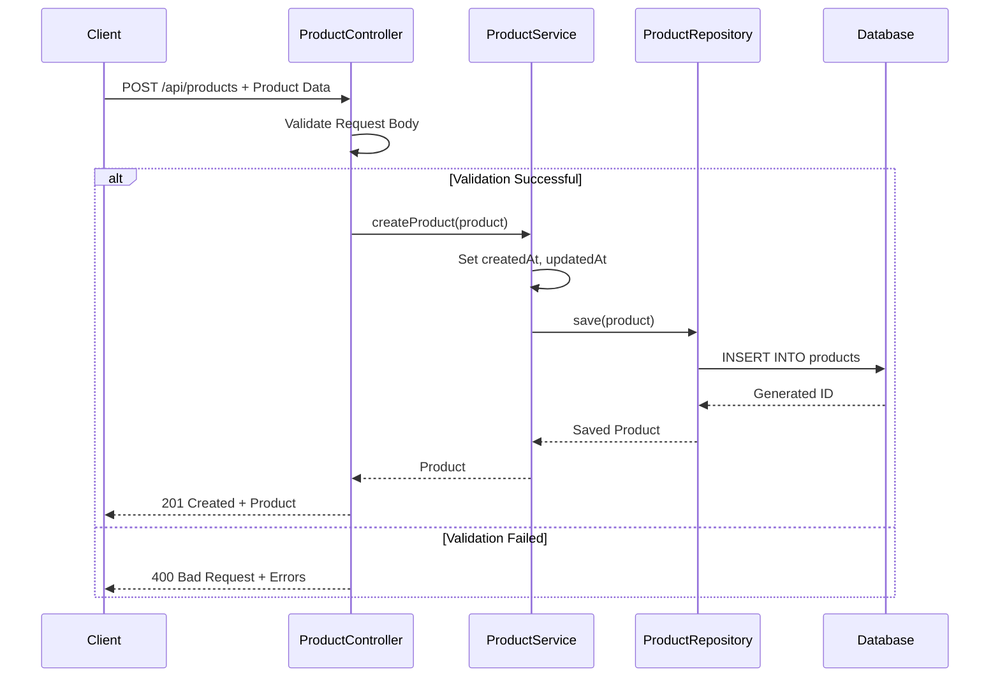

**Implementation Details:**
- **Endpoint**: `POST /api/products`
- **Request Body**: Product JSON
- **Validations**:
  - Name: Required, max 255 characters
  - Price: Required, positive value
  - Stock Quantity: Required, non-negative
  - Category: Required
- **Success Response**: 201 Created with product details
- **Error Response**: 400 Bad Request for validation errors

#### 3.1.4 Update Product

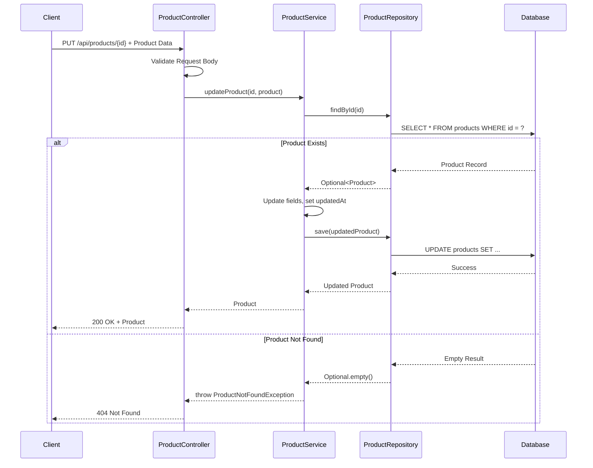

**Implementation Details:**
- **Endpoint**: `PUT /api/products/{id}`
- **Path Variable**: `id` (Long)
- **Request Body**: Product JSON
- **Update Strategy**: Partial update (only provided fields)
- **Success Response**: 200 OK with updated product
- **Error Responses**:
  - 404 Not Found if product doesn't exist
  - 400 Bad Request for validation errors

#### 3.1.5 Delete Product

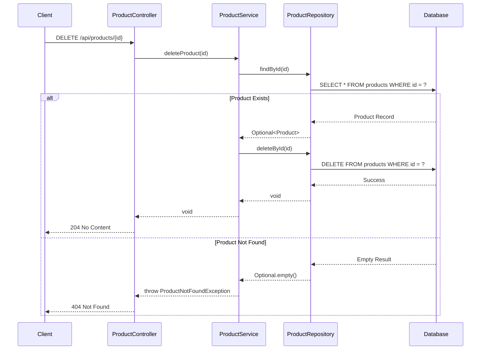

**Implementation Details:**
- **Endpoint**: `DELETE /api/products/{id}`
- **Path Variable**: `id` (Long)
- **Success Response**: 204 No Content
- **Error Response**: 404 Not Found if product doesn't exist

#### 3.1.6 Get Products By Category


**Implementation Details:**
- **Endpoint**: `GET /api/products/category/{category}`
- **Path Variable**: `category` (String)
- **Response**: List of products in the specified category
- **Error Handling**: Returns empty list if no products in category

#### 3.1.7 Search Products

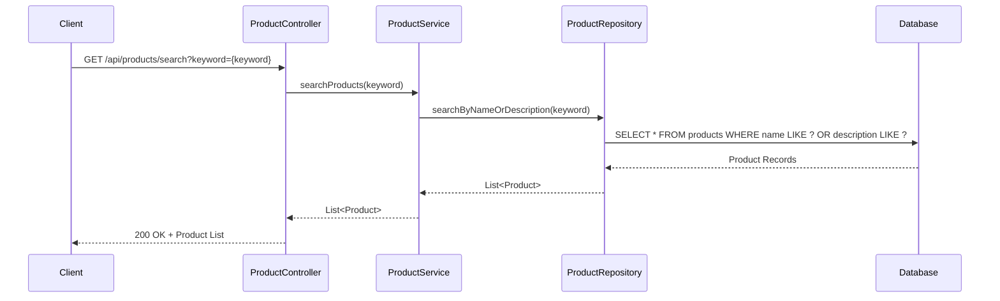

**Implementation Details:**
- **Endpoint**: `GET /api/products/search`
- **Query Parameter**: `keyword` (String)
- **Search Fields**: Product name and description
- **Search Type**: Case-insensitive partial match
- **Response**: List of matching products

### 3.2 Shopping Cart Management

#### 3.2.1 Add Product to Cart

```mermaid
sequenceDiagram
    participant Client
    participant CartController
    participant CartService
    participant ProductService
    participant ShoppingCart

    Client->>CartController: POST /api/cart/items + {productId, quantity}
    CartController->>CartService: addProductToCart(productId, quantity)
    CartService->>ProductService: getProductById(productId)
    
    alt Product Exists
        ProductService-->>CartService: Product
        CartService->>ProductService: checkStock(productId, quantity)
        
        alt Stock Available
            ProductService-->>CartService: true
            CartService->>ShoppingCart: addItem(cartItem)
            ShoppingCart->>ShoppingCart: calculateSubtotal()
            ShoppingCart->>ShoppingCart: calculateTotal()
            ShoppingCart-->>CartService: Updated Cart
            CartService-->>CartController: CartItem
            CartController-->>Client: 201 Created + CartItem
        else Insufficient Stock
            ProductService-->>CartService: false
            CartService-->>CartController: throw InsufficientStockException
            CartController-->>Client: 400 Bad Request
        end
    else Product Not Found
        ProductService-->>CartService: throw ProductNotFoundException
        CartService-->>CartController: Exception
        CartController-->>Client: 404 Not Found
    end
```

**Implementation Details:**
- **Endpoint**: `POST /api/cart/items`
- **Request Body**: `{productId: Long, quantity: Integer}`
- **Validations**:
  - Product must exist
  - Quantity must be positive
  - Sufficient stock must be available
- **Success Response**: 201 Created with cart item details
- **Error Responses**:
  - 404 Not Found if product doesn't exist
  - 400 Bad Request if insufficient stock

#### 3.2.2 View Shopping Cart

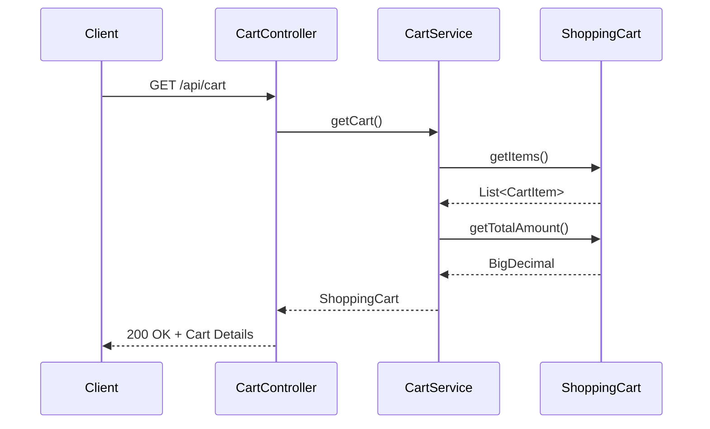

**Implementation Details:**
- **Endpoint**: `GET /api/cart`
- **Response**: Complete cart with items and total amount
- **Cart Details Include**:
  - List of cart items
  - Individual item subtotals
  - Total cart amount

#### 3.2.3 Update Cart Item Quantity

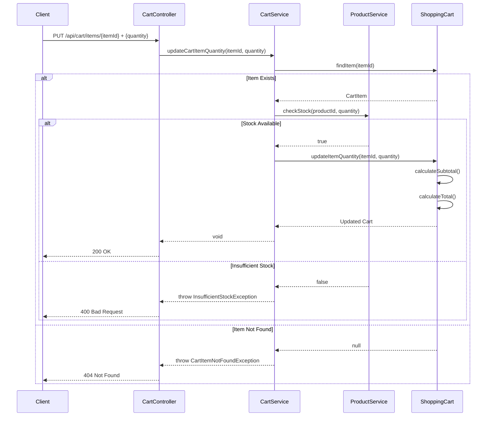

**Implementation Details:**
- **Endpoint**: `PUT /api/cart/items/{itemId}`
- **Path Variable**: `itemId` (Long)
- **Request Body**: `{quantity: Integer}`
- **Validations**:
  - Cart item must exist
  - Quantity must be positive
  - Sufficient stock must be available
- **Success Response**: 200 OK
- **Error Responses**:
  - 404 Not Found if cart item doesn't exist
  - 400 Bad Request if insufficient stock

#### 3.2.4 Remove Item from Cart

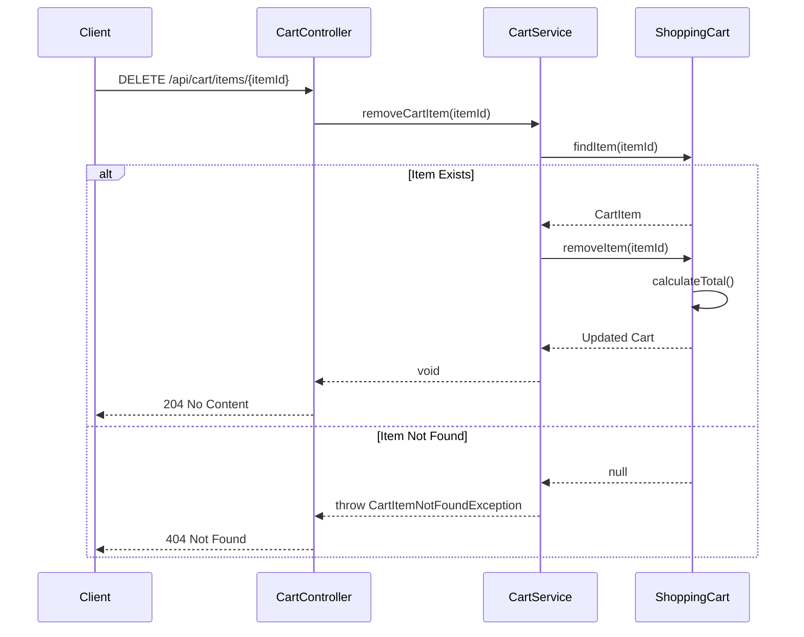

**Implementation Details:**
- **Endpoint**: `DELETE /api/cart/items/{itemId}`
- **Path Variable**: `itemId` (Long)
- **Success Response**: 204 No Content
- **Error Response**: 404 Not Found if cart item doesn't exist

---

## 4. Presentation Layer Components

### 4.1 Shopping Cart UI Component

The shopping cart user interface provides an interactive and responsive experience for managing cart items.

#### 4.1.1 Cart Component Architecture

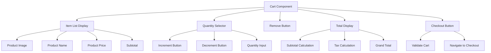

#### 4.1.2 Cart Component Features

**Core Features:**
- **Item List Display**: Shows all products added to cart with details
  - Product image thumbnail
  - Product name and description
  - Unit price
  - Quantity
  - Line item subtotal

- **Quantity Selector**: Interactive controls for adjusting item quantities
  - Increment/decrement buttons
  - Direct numeric input
  - Real-time validation against stock availability
  - Real-time subtotal updates

- **Remove Button**: One-click removal of items from cart
  - Confirmation dialog for accidental clicks
  - Immediate cart total recalculation

- **Total Display**: Comprehensive cost breakdown
  - Items subtotal
  - Tax calculation (if applicable)
  - Shipping estimates
  - Grand total

- **Checkout Button**: Initiates checkout process
  - Validates cart contents
  - Checks stock availability
  - Navigates to checkout flow

#### 4.1.3 Responsive Design

The cart component is fully responsive and adapts to different screen sizes:

**Desktop View (>1024px):**
- Multi-column layout
- Side-by-side product details and controls
- Sticky total summary panel

**Tablet View (768px - 1024px):**
- Two-column layout
- Stacked product information
- Floating checkout button

**Mobile View (<768px):**
- Single-column layout
- Compact product cards
- Bottom-fixed checkout bar
- Swipe-to-delete gesture support

#### 4.1.4 Cart Component State Management

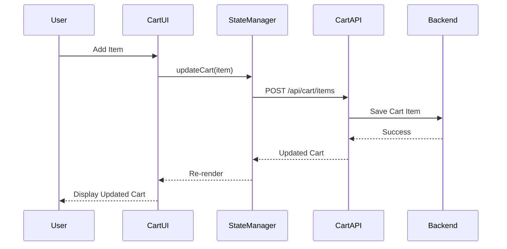

**State Management Features:**
- Local state for immediate UI updates
- Optimistic UI updates for better UX
- Background synchronization with backend
- Error handling and rollback on failure
- Session persistence for guest users
- User-specific cart for authenticated users

---

## 5. API Endpoints Summary

### 5.1 Product Endpoints

| Method | Endpoint | Description | Request Body | Response |
|--------|----------|-------------|--------------|----------|
| GET | `/api/products` | Get all products | - | 200 OK + List<Product> |
| GET | `/api/products/{id}` | Get product by ID | - | 200 OK + Product |
| POST | `/api/products` | Create new product | Product | 201 Created + Product |
| PUT | `/api/products/{id}` | Update product | Product | 200 OK + Product |
| DELETE | `/api/products/{id}` | Delete product | - | 204 No Content |
| GET | `/api/products/category/{category}` | Get products by category | - | 200 OK + List<Product> |
| GET | `/api/products/search?keyword={keyword}` | Search products | - | 200 OK + List<Product> |

### 5.2 Cart Endpoints

| Method | Endpoint | Description | Request Body | Response |
|--------|----------|-------------|--------------|----------|
| POST | `/api/cart/items` | Add product to cart | {productId, quantity} | 201 Created + CartItem |
| GET | `/api/cart` | View shopping cart | - | 200 OK + ShoppingCart |
| PUT | `/api/cart/items/{itemId}` | Update cart item quantity | {quantity} | 200 OK |
| DELETE | `/api/cart/items/{itemId}` | Remove item from cart | - | 204 No Content |
| DELETE | `/api/cart` | Clear cart | - | 204 No Content |

---

## 6. Database Schema

### 6.1 Products Table

```sql
CREATE TABLE products (
    id BIGSERIAL PRIMARY KEY,
    name VARCHAR(255) NOT NULL,
    description TEXT,
    price DECIMAL(10, 2) NOT NULL,
    stock_quantity INTEGER NOT NULL DEFAULT 0,
    max_order_quantity INTEGER DEFAULT 999,
    category VARCHAR(100) NOT NULL,
    created_at TIMESTAMP DEFAULT CURRENT_TIMESTAMP,
    updated_at TIMESTAMP DEFAULT CURRENT_TIMESTAMP
);

CREATE INDEX idx_products_category ON products(category);
CREATE INDEX idx_products_name ON products(name);
```

### 6.2 Cart Items Table

```sql
CREATE TABLE cart_items (
    id BIGSERIAL PRIMARY KEY,
    product_id BIGINT NOT NULL,
    product_name VARCHAR(255) NOT NULL,
    price DECIMAL(10, 2) NOT NULL,
    quantity INTEGER NOT NULL,
    subtotal DECIMAL(10, 2) NOT NULL,
    added_at TIMESTAMP DEFAULT CURRENT_TIMESTAMP,
    FOREIGN KEY (product_id) REFERENCES products(id) ON DELETE CASCADE
);

CREATE INDEX idx_cart_items_product_id ON cart_items(product_id);
```

### 6.3 Shopping Cart Table

```sql
CREATE TABLE shopping_carts (
    id BIGSERIAL PRIMARY KEY,
    total_amount DECIMAL(10, 2) NOT NULL DEFAULT 0.00,
    created_at TIMESTAMP DEFAULT CURRENT_TIMESTAMP,
    updated_at TIMESTAMP DEFAULT CURRENT_TIMESTAMP
);
```

---

## 7. Session Management and Authentication

### 7.1 Cart Persistence Strategy

The system implements a dual-mode cart persistence strategy to support both authenticated and guest users.

#### 7.1.1 Guest User Cart Management

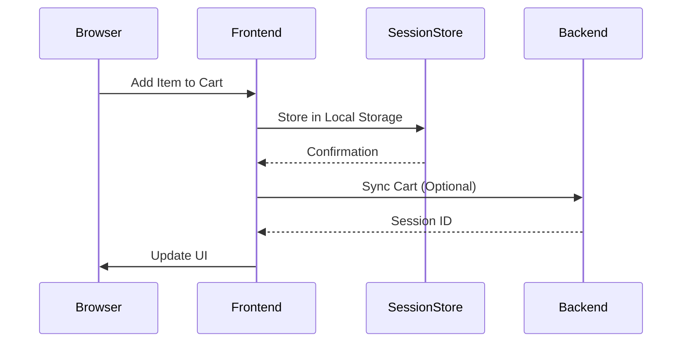

**Guest Cart Features:**
- **Local Storage**: Cart data stored in browser local storage
- **Session Tracking**: Anonymous session ID generated on first interaction
- **Expiration**: Guest carts expire after 7 days of inactivity
- **Migration**: Guest cart automatically migrated to user account upon login
- **Privacy**: No personal data stored for guest users

#### 7.1.2 Authenticated User Cart Management

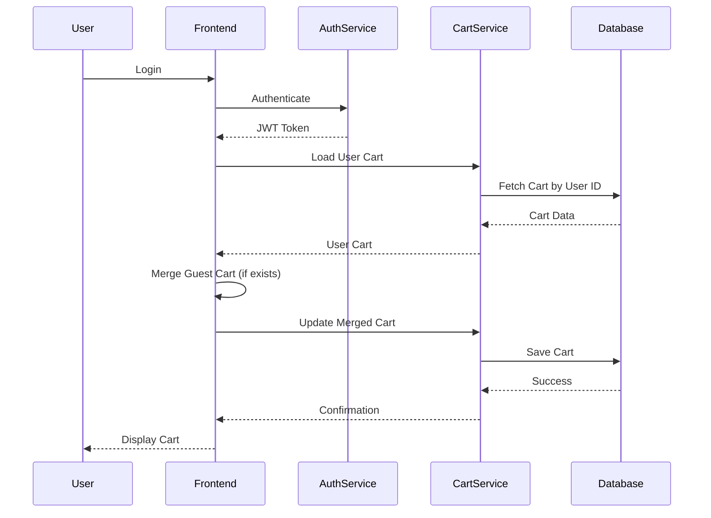

**Authenticated Cart Features:**
- **User Association**: Cart linked to user account via user_id
- **Cross-Device Sync**: Cart accessible from any device after login
- **Persistent Storage**: Cart data stored in database
- **No Expiration**: Cart persists indefinitely for logged-in users
- **Cart Merging**: Guest cart items merged with user cart on login

### 7.2 Session Management Configuration

**Session Properties:**
```yaml
spring:
  session:
    store-type: redis
    timeout: 30m
    redis:
      namespace: ecommerce:session
  
cart:
  guest:
    expiration-days: 7
    max-items: 50
  authenticated:
    max-items: 100
    sync-interval: 5m
```

### 7.3 Cart Security

**Security Measures:**
- **CSRF Protection**: All cart modification requests require CSRF token
- **Rate Limiting**: Maximum 100 cart operations per minute per session
- **Input Validation**: All cart inputs validated and sanitized
- **Price Verification**: Product prices verified against database on checkout
- **Stock Validation**: Real-time stock checks before order placement

---

## 8. Error Handling

### 8.1 Exception Hierarchy

```java
public class ProductNotFoundException extends RuntimeException {
    public ProductNotFoundException(Long id) {
        super("Product not found with id: " + id);
    }
}

public class InsufficientStockException extends RuntimeException {
    public InsufficientStockException(String productName, int requested, int available) {
        super(String.format("Insufficient stock for %s. Requested: %d, Available: %d", 
            productName, requested, available));
    }
}

public class CartItemNotFoundException extends RuntimeException {
    public CartItemNotFoundException(Long id) {
        super("Cart item not found with id: " + id);
    }
}

public class MaxOrderQuantityExceededException extends RuntimeException {
    public MaxOrderQuantityExceededException(String productName, int requested, int maxAllowed) {
        super(String.format("Maximum order quantity exceeded for %s. Requested: %d, Maximum allowed: %d",
            productName, requested, maxAllowed));
    }
}
```

### 8.2 Global Exception Handler

```java
@RestControllerAdvice
public class GlobalExceptionHandler {
    
    @ExceptionHandler(ProductNotFoundException.class)
    public ResponseEntity<ErrorResponse> handleProductNotFound(ProductNotFoundException ex) {
        ErrorResponse error = new ErrorResponse(
            HttpStatus.NOT_FOUND.value(),
            ex.getMessage(),
            LocalDateTime.now()
        );
        return new ResponseEntity<>(error, HttpStatus.NOT_FOUND);
    }
    
    @ExceptionHandler(InsufficientStockException.class)
    public ResponseEntity<ErrorResponse> handleInsufficientStock(InsufficientStockException ex) {
        ErrorResponse error = new ErrorResponse(
            HttpStatus.BAD_REQUEST.value(),
            ex.getMessage(),
            LocalDateTime.now()
        );
        return new ResponseEntity<>(error, HttpStatus.BAD_REQUEST);
    }
    
    @ExceptionHandler(MaxOrderQuantityExceededException.class)
    public ResponseEntity<ErrorResponse> handleMaxOrderQuantityExceeded(MaxOrderQuantityExceededException ex) {
        ErrorResponse error = new ErrorResponse(
            HttpStatus.BAD_REQUEST.value(),
            ex.getMessage(),
            LocalDateTime.now()
        );
        return new ResponseEntity<>(error, HttpStatus.BAD_REQUEST);
    }
    
    @ExceptionHandler(MethodArgumentNotValidException.class)
    public ResponseEntity<ErrorResponse> handleValidationErrors(MethodArgumentNotValidException ex) {
        List<String> errors = ex.getBindingResult()
            .getFieldErrors()
            .stream()
            .map(FieldError::getDefaultMessage)
            .collect(Collectors.toList());
        
        ErrorResponse error = new ErrorResponse(
            HttpStatus.BAD_REQUEST.value(),
            "Validation failed: " + String.join(", ", errors),
            LocalDateTime.now()
        );
        return new ResponseEntity<>(error, HttpStatus.BAD_REQUEST);
    }
}
```

---

## 9. Design Patterns Used

### 9.1 Repository Pattern
- Abstracts data access logic
- Provides clean separation between business logic and data access
- Implemented via Spring Data JPA

### 9.2 Service Layer Pattern
- Encapsulates business logic
- Provides transaction management
- Coordinates between controllers and repositories

### 9.3 DTO Pattern
- Separates internal domain models from API contracts
- Provides data validation
- Reduces over-fetching/under-fetching

### 9.4 Singleton Pattern
- Shopping cart instance (session-scoped)
- Service beans (application-scoped)

---

## 10. Security Considerations

### 10.1 Input Validation
- All user inputs validated using Bean Validation (JSR-380)
- SQL injection prevention via parameterized queries
- XSS prevention via input sanitization

### 10.2 Data Validation Rules

**Product:**
- Name: Required, 1-255 characters
- Description: Optional, max 2000 characters
- Price: Required, positive, max 2 decimal places
- Stock Quantity: Required, non-negative integer
- Max Order Quantity: Optional, positive integer, default 999
- Category: Required, 1-100 characters

**Cart Item:**
- Product ID: Required, must exist
- Quantity: Required, positive integer, max 999
- Quantity must not exceed product's max_order_quantity
- Quantity must not exceed available stock

---

## 11. Performance Considerations

### 11.1 Database Optimization
- Indexes on frequently queried columns (category, name, product_id)
- Connection pooling via HikariCP
- Lazy loading for relationships
- Query optimization via JPA criteria

### 11.2 Caching Strategy
- Product catalog caching (Redis/Caffeine)
- Cache invalidation on product updates
- Session-based cart storage

### 11.3 Pagination
- Implement pagination for product listings
- Default page size: 20 items
- Maximum page size: 100 items

---

## 12. Testing Strategy

### 12.1 Unit Tests

**Service Layer Tests:**
- Product service business logic
- Cart service operations
- Stock validation logic
- Price calculation methods
- Target coverage: 80%+

**Repository Tests:**
- Custom query methods
- Data persistence operations
- Relationship mappings

### 12.2 Integration Tests

**API Endpoint Tests:**
- Product CRUD operations
- Cart management workflows
- Error handling scenarios
- Authentication and authorization

**Database Integration:**
- Transaction management
- Constraint validation
- Cascade operations

### 12.3 Cart-Specific Test Cases

**Cart Service Unit Tests:**
```java
@Test
public void testAddItemToCart_Success() {
    // Test successful item addition
}

@Test
public void testAddItemToCart_InsufficientStock() {
    // Test stock validation
}

@Test
public void testUpdateQuantity_ExceedsMaxOrderQuantity() {
    // Test max order quantity validation
}

@Test
public void testRemoveItem_Success() {
    // Test item removal
}

@Test
public void testClearCart_Success() {
    // Test cart clearing
}

@Test
public void testCalculateTotal_MultipleItems() {
    // Test total calculation with multiple items
}
```

**Cart API Integration Tests:**
```java
@Test
public void testCartCheckoutFlow_EndToEnd() {
    // Test complete checkout workflow
    // 1. Add items to cart
    // 2. Update quantities
    // 3. Remove items
    // 4. Validate totals
    // 5. Proceed to checkout
}

@Test
public void testGuestCartMigration_OnLogin() {
    // Test guest cart migration to user account
}

@Test
public void testCartPersistence_AcrossSessions() {
    // Test cart persistence for authenticated users
}
```

### 12.4 Test Coverage Target

**Coverage Goals:**
- Overall code coverage: 85%
- Service layer coverage: 90%
- Controller layer coverage: 85%
- Repository layer coverage: 80%
- Critical path coverage: 100%

### 12.5 Test Data Management

**Test Data Strategy:**
- Use H2 in-memory database for unit tests
- Test data builders for object creation
- Mockito for mocking dependencies
- Test fixtures for common scenarios
- Database seeding scripts for integration tests

---

## 13. Deployment Considerations

### 13.1 Environment Configuration
- Development: H2 database, debug logging
- Staging: PostgreSQL, info logging
- Production: PostgreSQL with replication, error logging

### 13.2 Configuration Properties

```yaml
spring:
  datasource:
    url: ${DB_URL}
    username: ${DB_USERNAME}
    password: ${DB_PASSWORD}
  jpa:
    hibernate:
      ddl-auto: validate
    show-sql: false
  
server:
  port: 8080
  
logging:
  level:
    root: INFO
    com.ecommerce: DEBUG
```

---

## 14. Future Enhancements

1. **User Authentication & Authorization**
   - JWT-based authentication
   - Role-based access control
   - User-specific carts

2. **Order Management**
   - Checkout process
   - Order history
   - Payment integration

3. **Advanced Features**
   - Product reviews and ratings
   - Wishlist functionality
   - Product recommendations
   - Inventory management
   - Multi-currency support

4. **Performance Improvements**
   - Redis caching
   - CDN for product images
   - Database read replicas
   - Elasticsearch for product search

---

## 15. Appendix

### 15.1 Sample Request/Response

**Create Product Request:**
```json
{
  "name": "Laptop",
  "description": "High-performance laptop",
  "price": 999.99,
  "stockQuantity": 50,
  "maxOrderQuantity": 5,
  "category": "Electronics"
}
```

**Create Product Response:**
```json
{
  "id": 1,
  "name": "Laptop",
  "description": "High-performance laptop",
  "price": 999.99,
  "stockQuantity": 50,
  "maxOrderQuantity": 5,
  "category": "Electronics",
  "createdAt": "2024-01-15T10:30:00",
  "updatedAt": "2024-01-15T10:30:00"
}
```

**Add to Cart Request:**
```json
{
  "productId": 1,
  "quantity": 2
}
```

**Cart Response:**
```json
{
  "id": 1,
  "items": [
    {
      "id": 1,
      "productId": 1,
      "productName": "Laptop",
      "price": 999.99,
      "quantity": 2,
      "subtotal": 1999.98,
      "addedAt": "2024-01-15T10:35:00"
    }
  ],
  "totalAmount": 1999.98
}
```

### 15.2 Key Features Summary

1. **Product Management**
   - Complete CRUD operations
   - Category-based filtering
   - Search functionality
   - Stock management
   - Max order quantity enforcement

2. **Shopping Cart**
   - Add/remove items
   - Update quantities
   - Real-time total calculation
   - Stock validation
   - Max order quantity validation
   - Session persistence
   - Guest and authenticated user support

3. **Presentation Layer**
   - Responsive cart UI component
   - Interactive quantity controls
   - Real-time updates
   - Mobile-optimized design

4. **Data Integrity**
   - Foreign key constraints
   - Transaction management
   - Optimistic locking

5. **API Design**
   - RESTful principles
   - Consistent error handling
   - Comprehensive validation
   - Clear documentation

6. **Testing**
   - Comprehensive unit tests
   - Integration test coverage
   - Cart-specific test scenarios
   - 85% overall coverage target

---

**Document Version**: 2.0  
**Last Updated**: 2024-01-15  
**Author**: Development Team  
**Status**: Approved