# Low-Level Design Document: E-commerce Product and Shopping Cart Management System

## 1. Document Information

| Field | Value |
|-------|-------|
| **Document Title** | Low-Level Design - E-commerce Product and Shopping Cart Management System |
| **Version** | 2.0 |
| **Date** | 2024 |
| **Author** | Engineering Team |
| **Status** | Updated |

## 2. Introduction

### 2.1 Purpose
This document provides the low-level design for an E-commerce system that manages both product catalog and shopping cart functionality. It details the technical implementation, including API endpoints, database schemas, class structures, and interaction flows for both product management and shopping cart operations.

### 2.2 Scope
This LLD covers:
- Product CRUD operations and management
- Shopping cart management with add, view, update, and remove operations
- RESTful API design for products and cart
- Database schema design for products, shopping carts, and cart items
- Class and sequence diagrams for both modules
- Business logic and validation rules
- Session management for cart operations

### 2.3 System Overview
The system is built using a layered architecture:
- **Presentation Layer**: Controllers handling HTTP requests for products and cart
- **Service Layer**: Business logic for product and cart operations
- **Repository Layer**: Data access for products, carts, and cart items
- **Database Layer**: PostgreSQL database with product, cart, and cart item tables

## 3. Architecture Overview

### 3.1 High-Level Architecture

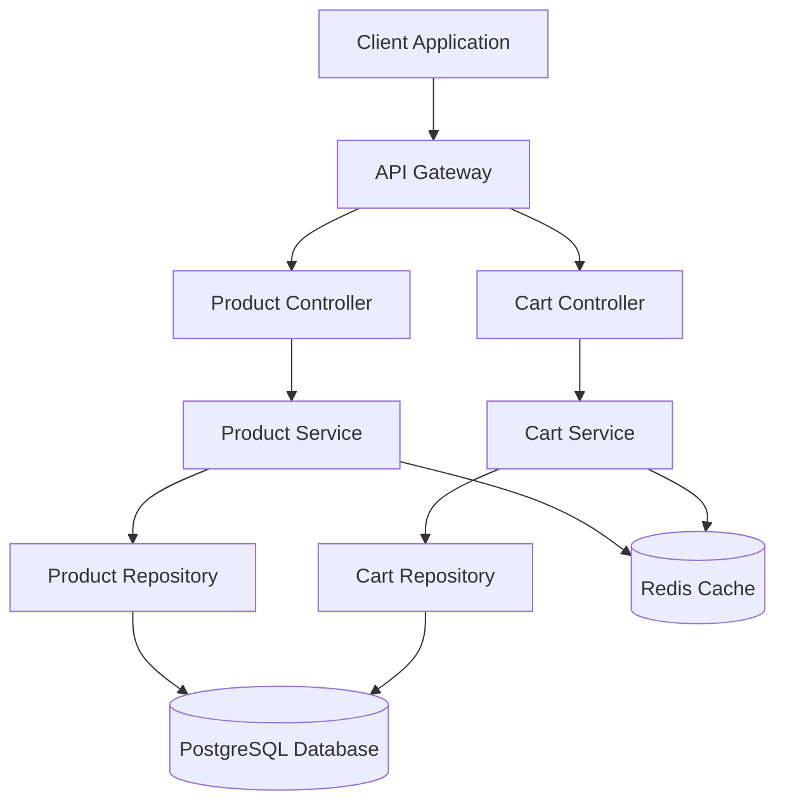

### 3.2 Technology Stack

| Layer | Technology |
|-------|------------|
| **Backend Framework** | Spring Boot 3.x |
| **Language** | Java 17 |
| **Database** | PostgreSQL 15 |
| **Cache** | Redis 7.x |
| **API Documentation** | OpenAPI 3.0 (Swagger) |
| **Build Tool** | Maven |
| **Testing** | JUnit 5, Mockito |

## 4. API Design

### 4.1 API Endpoints Summary

| Method | Endpoint | Description | Module |
|--------|----------|-------------|--------|
| POST | /api/v1/products | Create a new product | Product |
| GET | /api/v1/products/{id} | Get product by ID | Product |
| GET | /api/v1/products | Get all products (paginated) | Product |
| PUT | /api/v1/products/{id} | Update product | Product |
| DELETE | /api/v1/products/{id} | Delete product | Product |
| POST | /api/v1/cart/items | Add item to cart | Cart |
| GET | /api/v1/cart | Get cart contents | Cart |
| PUT | /api/v1/cart/items/{itemId} | Update cart item quantity | Cart |
| DELETE | /api/v1/cart/items/{itemId} | Remove item from cart | Cart |

### 4.2 Product API Endpoints

#### 4.2.1 Create Product

**Endpoint**: `POST /api/v1/products`

**Request Body**:
```json
{
  "name": "Laptop",
  "description": "High-performance laptop",
  "price": 999.99,
  "category": "Electronics",
  "stockQuantity": 50,
  "sku": "LAP-001"
}
```

**Response** (201 Created):
```json
{
  "id": 1,
  "name": "Laptop",
  "description": "High-performance laptop",
  "price": 999.99,
  "category": "Electronics",
  "stockQuantity": 50,
  "sku": "LAP-001",
  "createdAt": "2024-01-15T10:30:00Z",
  "updatedAt": "2024-01-15T10:30:00Z"
}
```

#### 4.2.2 Get Product by ID

**Endpoint**: `GET /api/v1/products/{id}`

**Response** (200 OK):
```json
{
  "id": 1,
  "name": "Laptop",
  "description": "High-performance laptop",
  "price": 999.99,
  "category": "Electronics",
  "stockQuantity": 50,
  "sku": "LAP-001",
  "createdAt": "2024-01-15T10:30:00Z",
  "updatedAt": "2024-01-15T10:30:00Z"
}
```

#### 4.2.3 Get All Products

**Endpoint**: `GET /api/v1/products?page=0&size=10&sort=name,asc`

**Response** (200 OK):
```json
{
  "content": [
    {
      "id": 1,
      "name": "Laptop",
      "price": 999.99,
      "category": "Electronics",
      "stockQuantity": 50
    }
  ],
  "page": 0,
  "size": 10,
  "totalElements": 100,
  "totalPages": 10
}
```

#### 4.2.4 Update Product

**Endpoint**: `PUT /api/v1/products/{id}`

**Request Body**:
```json
{
  "name": "Gaming Laptop",
  "description": "High-performance gaming laptop",
  "price": 1299.99,
  "category": "Electronics",
  "stockQuantity": 45,
  "sku": "LAP-001"
}
```

**Response** (200 OK):
```json
{
  "id": 1,
  "name": "Gaming Laptop",
  "description": "High-performance gaming laptop",
  "price": 1299.99,
  "category": "Electronics",
  "stockQuantity": 45,
  "sku": "LAP-001",
  "createdAt": "2024-01-15T10:30:00Z",
  "updatedAt": "2024-01-15T11:45:00Z"
}
```

#### 4.2.5 Delete Product

**Endpoint**: `DELETE /api/v1/products/{id}`

**Response** (204 No Content)

### 4.3 Shopping Cart API Endpoints

#### 4.3.1 Add Item to Cart

**Endpoint**: `POST /api/v1/cart/items`

**Request Body**:
```json
{
  "productId": 1,
  "quantity": 2
}
```

**Response** (201 Created):
```json
{
  "cartId": "cart-123",
  "items": [
    {
      "itemId": "item-456",
      "productId": 1,
      "productName": "Laptop",
      "price": 999.99,
      "quantity": 2,
      "subtotal": 1999.98
    }
  ],
  "totalAmount": 1999.98,
  "itemCount": 1
}
```

#### 4.3.2 Get Cart Contents

**Endpoint**: `GET /api/v1/cart`

**Response** (200 OK):
```json
{
  "cartId": "cart-123",
  "items": [
    {
      "itemId": "item-456",
      "productId": 1,
      "productName": "Laptop",
      "price": 999.99,
      "quantity": 2,
      "subtotal": 1999.98
    },
    {
      "itemId": "item-457",
      "productId": 2,
      "productName": "Mouse",
      "price": 29.99,
      "quantity": 1,
      "subtotal": 29.99
    }
  ],
  "totalAmount": 2029.97,
  "itemCount": 2,
  "lastUpdated": "2024-01-15T12:30:00Z"
}
```

#### 4.3.3 Update Cart Item Quantity

**Endpoint**: `PUT /api/v1/cart/items/{itemId}`

**Request Body**:
```json
{
  "quantity": 3
}
```

**Response** (200 OK):
```json
{
  "cartId": "cart-123",
  "items": [
    {
      "itemId": "item-456",
      "productId": 1,
      "productName": "Laptop",
      "price": 999.99,
      "quantity": 3,
      "subtotal": 2999.97
    }
  ],
  "totalAmount": 2999.97,
  "itemCount": 1
}
```

#### 4.3.4 Remove Item from Cart

**Endpoint**: `DELETE /api/v1/cart/items/{itemId}`

**Response** (200 OK):
```json
{
  "cartId": "cart-123",
  "items": [],
  "totalAmount": 0.00,
  "itemCount": 0,
  "message": "Item removed successfully"
}
```

## 5. Database Design

### 5.1 Entity Relationship Diagram

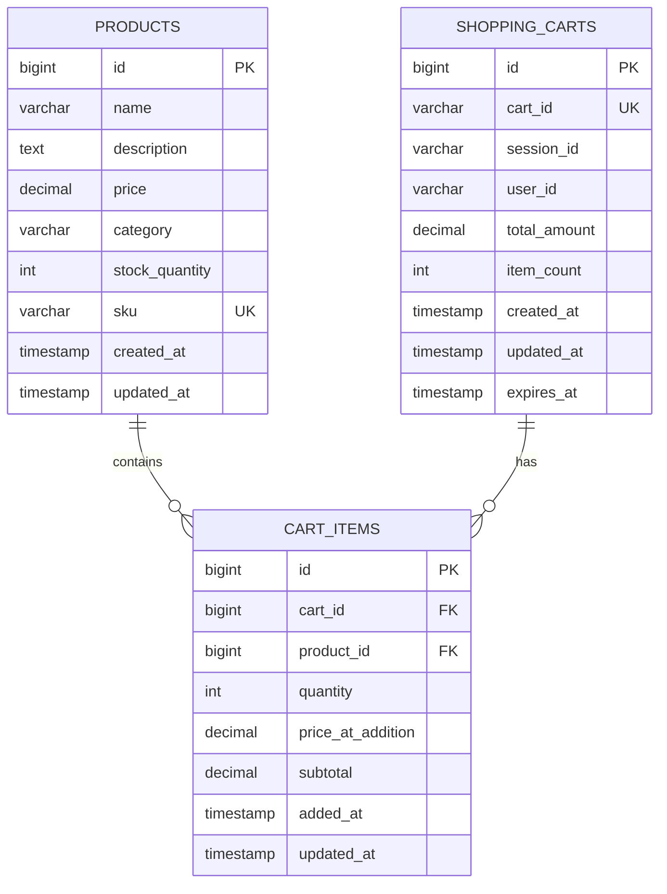

### 5.2 Database Schema

#### 5.2.1 Products Table

```sql
CREATE TABLE products (
    id BIGSERIAL PRIMARY KEY,
    name VARCHAR(255) NOT NULL,
    description TEXT,
    price DECIMAL(10, 2) NOT NULL CHECK (price >= 0),
    category VARCHAR(100) NOT NULL,
    stock_quantity INTEGER NOT NULL DEFAULT 0 CHECK (stock_quantity >= 0),
    sku VARCHAR(50) UNIQUE NOT NULL,
    created_at TIMESTAMP DEFAULT CURRENT_TIMESTAMP,
    updated_at TIMESTAMP DEFAULT CURRENT_TIMESTAMP
);

CREATE INDEX idx_products_category ON products(category);
CREATE INDEX idx_products_sku ON products(sku);
CREATE INDEX idx_products_name ON products(name);
```

#### 5.2.2 Shopping Carts Table

```sql
CREATE TABLE shopping_carts (
    id BIGSERIAL PRIMARY KEY,
    cart_id VARCHAR(100) UNIQUE NOT NULL,
    session_id VARCHAR(255),
    user_id VARCHAR(100),
    total_amount DECIMAL(10, 2) NOT NULL DEFAULT 0.00 CHECK (total_amount >= 0),
    item_count INTEGER NOT NULL DEFAULT 0 CHECK (item_count >= 0),
    created_at TIMESTAMP DEFAULT CURRENT_TIMESTAMP,
    updated_at TIMESTAMP DEFAULT CURRENT_TIMESTAMP,
    expires_at TIMESTAMP NOT NULL
);

CREATE INDEX idx_shopping_carts_cart_id ON shopping_carts(cart_id);
CREATE INDEX idx_shopping_carts_session_id ON shopping_carts(session_id);
CREATE INDEX idx_shopping_carts_user_id ON shopping_carts(user_id);
CREATE INDEX idx_shopping_carts_expires_at ON shopping_carts(expires_at);
```

#### 5.2.3 Cart Items Table

```sql
CREATE TABLE cart_items (
    id BIGSERIAL PRIMARY KEY,
    cart_id BIGINT NOT NULL REFERENCES shopping_carts(id) ON DELETE CASCADE,
    product_id BIGINT NOT NULL REFERENCES products(id) ON DELETE CASCADE,
    quantity INTEGER NOT NULL CHECK (quantity > 0),
    price_at_addition DECIMAL(10, 2) NOT NULL CHECK (price_at_addition >= 0),
    subtotal DECIMAL(10, 2) NOT NULL CHECK (subtotal >= 0),
    added_at TIMESTAMP DEFAULT CURRENT_TIMESTAMP,
    updated_at TIMESTAMP DEFAULT CURRENT_TIMESTAMP,
    UNIQUE(cart_id, product_id)
);

CREATE INDEX idx_cart_items_cart_id ON cart_items(cart_id);
CREATE INDEX idx_cart_items_product_id ON cart_items(product_id);
```

## 6. Class Design

### 6.1 Class Diagram

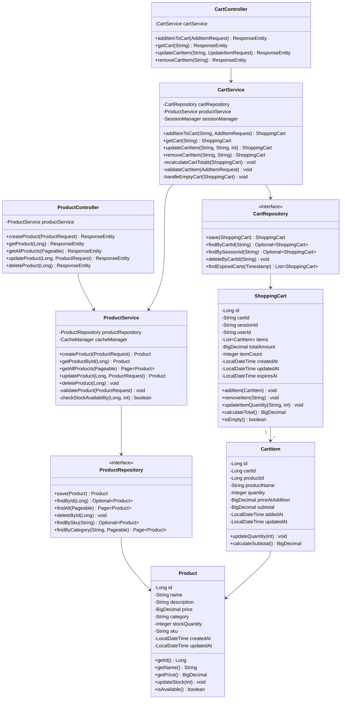

### 6.2 Class Descriptions

#### 6.2.1 Product Module Classes

**ProductController**: Handles HTTP requests for product operations
- Validates request data
- Delegates to ProductService
- Returns appropriate HTTP responses

**ProductService**: Contains business logic for product management
- Validates product data
- Manages product lifecycle
- Handles caching
- Checks stock availability

**ProductRepository**: Data access layer for products
- Extends JpaRepository
- Custom queries for product search
- Handles database operations

**Product**: Entity representing a product
- Contains product attributes
- Validation annotations
- Business methods for stock management

#### 6.2.2 Shopping Cart Module Classes

**CartController**: Handles HTTP requests for cart operations
- Manages cart session
- Validates cart requests
- Delegates to CartService
- Returns cart responses

**CartService**: Contains business logic for cart management
- Adds/removes/updates cart items
- Recalculates cart totals automatically
- Validates product availability
- Handles empty cart scenarios
- Manages cart expiration

**CartRepository**: Data access layer for shopping carts
- Extends JpaRepository
- Custom queries for cart retrieval
- Handles cart persistence

**ShoppingCart**: Entity representing a shopping cart
- Contains cart metadata
- Manages cart items collection
- Calculates totals
- Handles cart expiration

**CartItem**: Entity representing an item in the cart
- Links product to cart
- Stores quantity and pricing
- Calculates subtotals
- Tracks addition/update timestamps

## 7. Sequence Diagrams

### 7.1 Product Operations

#### 7.1.1 Create Product Flow

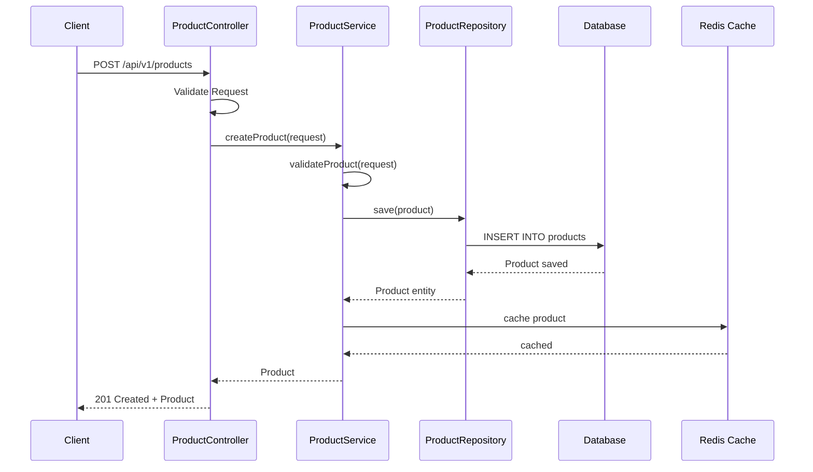

#### 7.1.2 Get Product Flow

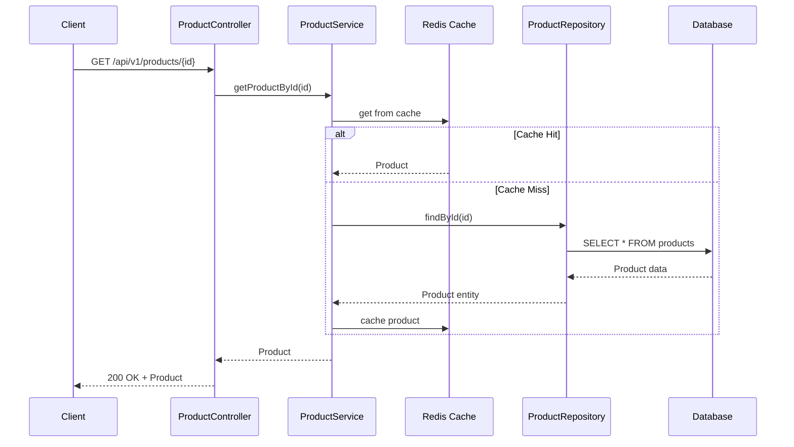

#### 7.1.3 Update Product Flow

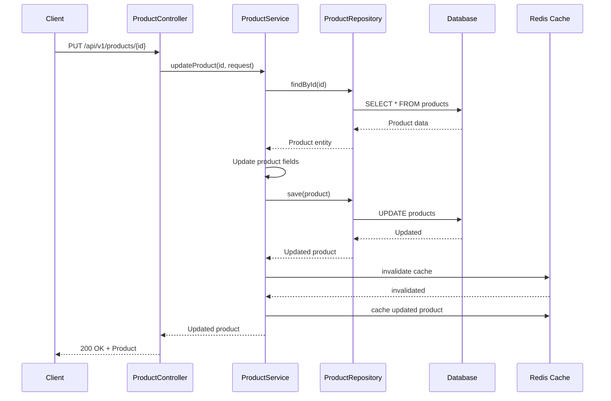

#### 7.1.4 Delete Product Flow

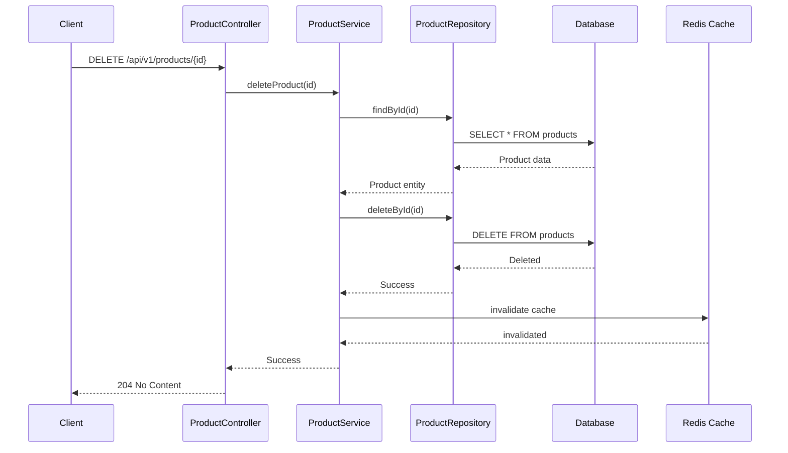

### 7.2 Shopping Cart Operations

#### 7.2.1 Add Item to Cart Flow

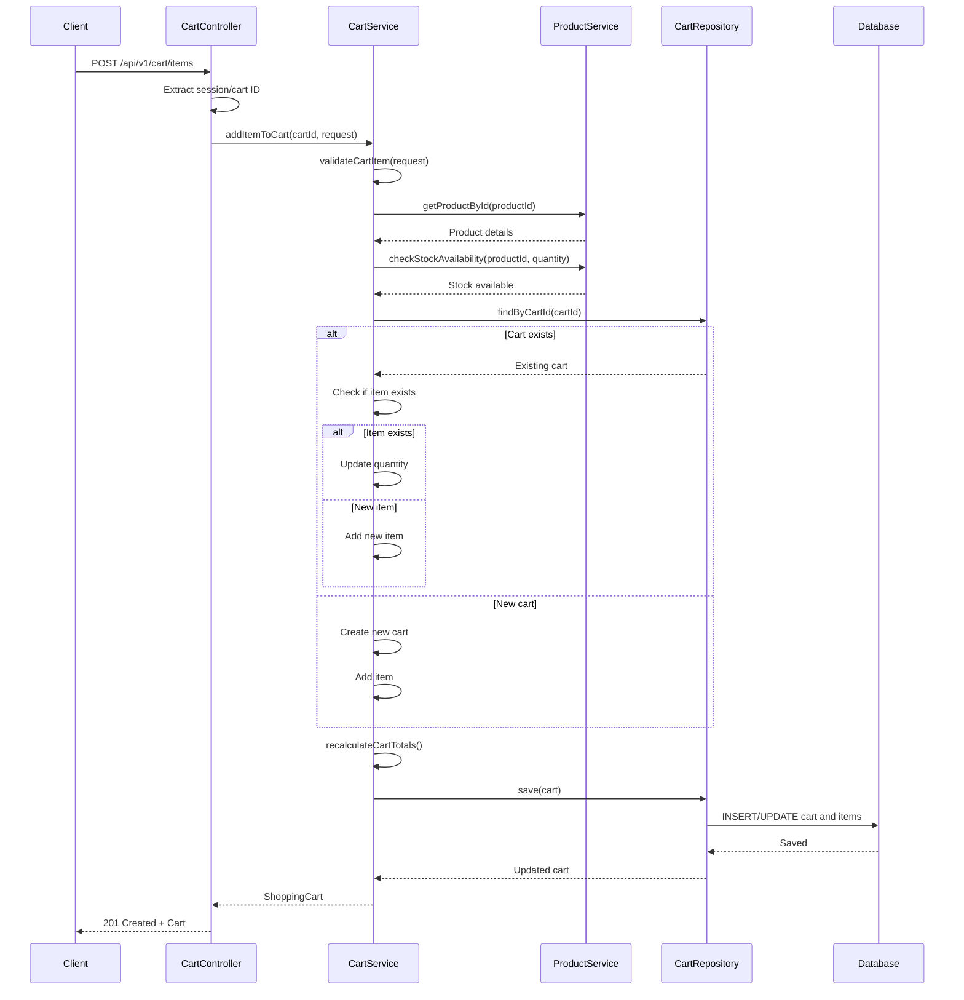

#### 7.2.2 Get Cart Contents Flow

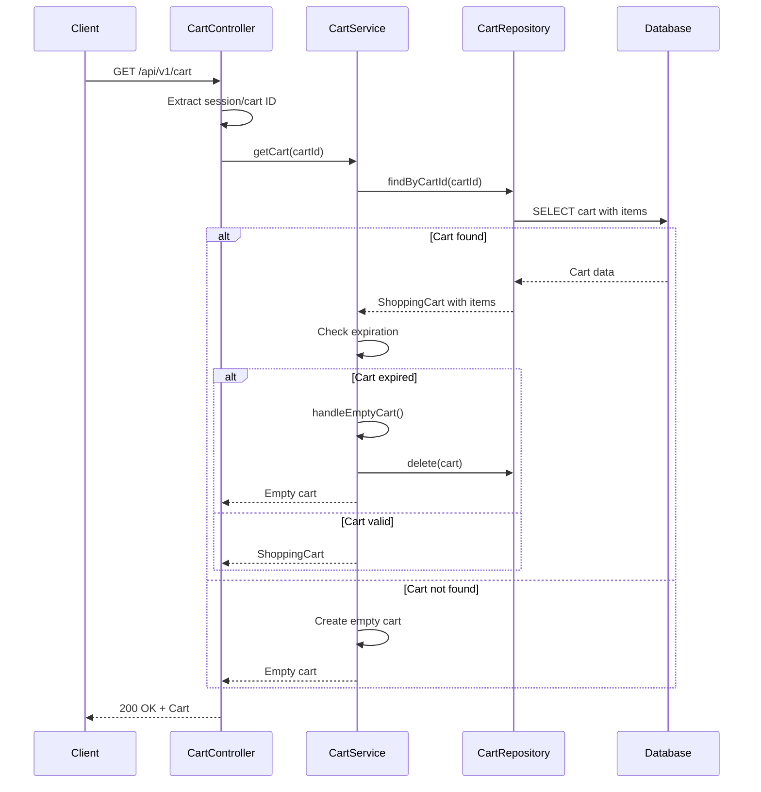

#### 7.2.3 Update Cart Item Quantity Flow

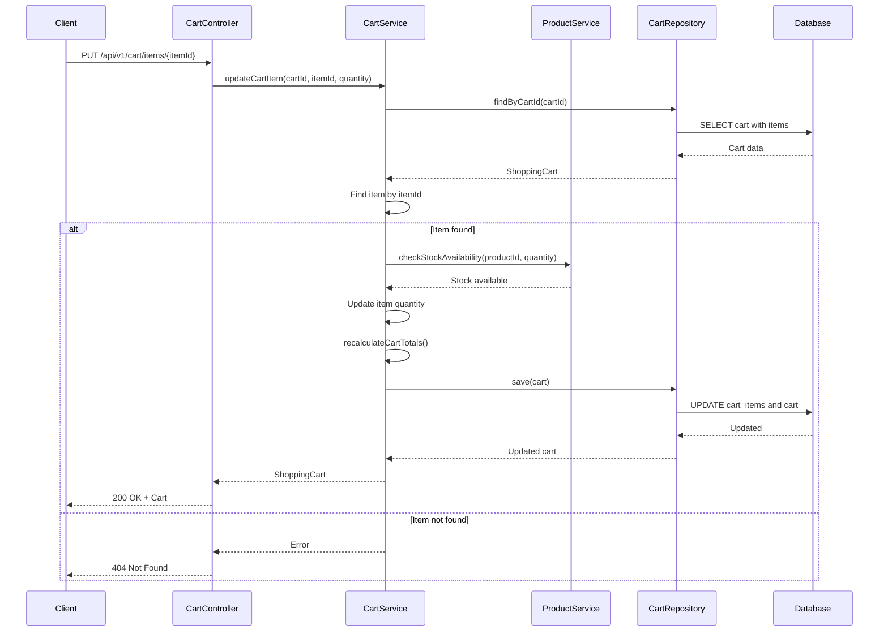

#### 7.2.4 Remove Item from Cart Flow

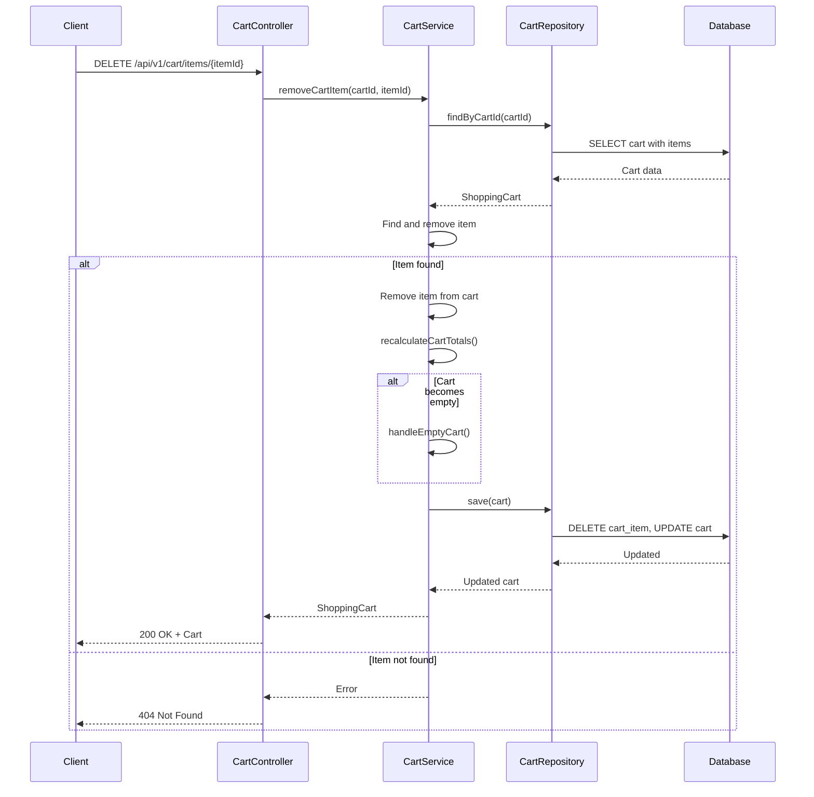

## 8. Business Logic and Rules

### 8.1 Product Management Rules

1. **Product Creation**:
   - Name is required and must be unique within category
   - Price must be positive
   - SKU must be unique across all products
   - Stock quantity cannot be negative
   - Category is required

2. **Product Updates**:
   - Cannot change SKU once created
   - Price changes don't affect existing cart items
   - Stock updates trigger availability checks

3. **Product Deletion**:
   - Soft delete if product exists in any cart
   - Hard delete only if no references exist
   - Cascade delete related data

4. **Stock Management**:
   - Stock decremented on order placement
   - Stock validation before adding to cart
   - Low stock warnings at threshold

### 8.2 Shopping Cart Rules

1. **Cart Creation**:
   - Cart automatically created on first item addition
   - Cart bound to session ID for guest users
   - Cart bound to user ID for authenticated users
   - Cart expires after 7 days of inactivity

2. **Add Item to Cart**:
   - Validate product exists and is available
   - Check stock availability before adding
   - If item already exists, increment quantity
   - Maximum quantity per item: 99
   - Automatic cart total recalculation

3. **Update Cart Item**:
   - Validate new quantity against stock
   - Quantity must be positive integer
   - Automatic subtotal and total recalculation
   - Update timestamp on modification

4. **Remove Item from Cart**:
   - Remove item completely from cart
   - Recalculate cart totals
   - If cart becomes empty, handle empty cart state
   - Maintain cart for potential future additions

5. **Cart Total Recalculation**:
   - Triggered on any cart modification
   - Recalculates all item subtotals
   - Updates cart total amount
   - Updates item count
   - Atomic operation to ensure consistency

6. **Empty Cart Handling**:
   - Cart remains active but with zero items
   - Total amount set to 0.00
   - Item count set to 0
   - Cart can accept new items
   - Expiration timer continues

7. **Cart Expiration**:
   - Carts expire after 7 days of no activity
   - Expired carts automatically cleaned up
   - Cleanup job runs daily
   - User notified before expiration (if authenticated)

## 9. Presentation Layer Components

### 9.1 Cart View Component

**Purpose**: Display shopping cart contents to user

**Responsibilities**:
- Render list of cart items with product details
- Display item quantities and prices
- Show subtotals for each item
- Display cart total amount
- Provide navigation to checkout
- Handle empty cart state

**Key Features**:
- Real-time total updates
- Responsive design
- Loading states
- Error handling

### 9.2 Empty Cart View Component

**Purpose**: Display when cart has no items

**Responsibilities**:
- Show empty cart message
- Provide call-to-action to browse products
- Display recently viewed items (optional)
- Suggest popular products

**Key Features**:
- Engaging empty state design
- Quick navigation to product catalog
- Personalized recommendations

### 9.3 Add to Cart Handler Component

**Purpose**: Handle add-to-cart interactions

**Responsibilities**:
- Capture add-to-cart button clicks
- Validate quantity input
- Send API request to add item
- Show success/error feedback
- Update cart badge count
- Handle loading states

**Key Features**:
- Optimistic UI updates
- Error recovery
- Quantity validation
- Stock availability check

### 9.4 Quantity Updater Component

**Purpose**: Allow users to modify item quantities

**Responsibilities**:
- Render quantity input controls (+ / - buttons)
- Validate quantity changes
- Send update requests to API
- Handle stock limitations
- Show loading during updates
- Revert on error

**Key Features**:
- Debounced API calls
- Min/max quantity enforcement
- Inline validation
- Smooth animations

## 10. Service Layer Architecture

### 10.1 ProductService

**Responsibilities**:
- Product CRUD operations
- Business rule validation
- Stock management
- Cache management
- Product search and filtering

**Key Methods**:
- `createProduct(ProductRequest)`: Creates new product
- `getProductById(Long)`: Retrieves product with caching
- `updateProduct(Long, ProductRequest)`: Updates product details
- `deleteProduct(Long)`: Soft/hard delete product
- `checkStockAvailability(Long, int)`: Validates stock
- `updateStock(Long, int)`: Adjusts stock quantity

### 10.2 CartService

**Responsibilities**:
- Cart lifecycle management
- Item addition/removal/update
- Cart total calculation
- Session management integration
- Cart expiration handling
- Business rule enforcement

**Key Methods**:
- `addItemToCart(String, AddItemRequest)`: Adds item to cart
- `getCart(String)`: Retrieves cart by ID
- `updateCartItem(String, String, int)`: Updates item quantity
- `removeCartItem(String, String)`: Removes item from cart
- `recalculateCartTotals(ShoppingCart)`: Recalculates all totals
- `handleEmptyCart(ShoppingCart)`: Manages empty cart state
- `validateCartItem(AddItemRequest)`: Validates item before adding

## 11. Repository Layer

### 11.1 ProductRepository

**Interface**: Extends JpaRepository<Product, Long>

**Custom Methods**:
```java
Optional<Product> findBySku(String sku);
Page<Product> findByCategory(String category, Pageable pageable);
List<Product> findByStockQuantityLessThan(int threshold);
@Query("SELECT p FROM Product p WHERE p.name LIKE %:keyword%")
List<Product> searchByName(@Param("keyword") String keyword);
```

### 11.2 CartRepository

**Interface**: Extends JpaRepository<ShoppingCart, Long>

**Custom Methods**:
```java
Optional<ShoppingCart> findByCartId(String cartId);
Optional<ShoppingCart> findBySessionId(String sessionId);
Optional<ShoppingCart> findByUserId(String userId);
List<ShoppingCart> findByExpiresAtBefore(LocalDateTime timestamp);
void deleteByCartId(String cartId);
@Query("SELECT c FROM ShoppingCart c LEFT JOIN FETCH c.items WHERE c.cartId = :cartId")
Optional<ShoppingCart> findByCartIdWithItems(@Param("cartId") String cartId);
```

## 12. Session Management

### 12.1 Cart-Session Binding Logic

**Purpose**: Associate shopping carts with user sessions

**Implementation**:

1. **Guest Users**:
   - Cart bound to HTTP session ID
   - Session ID stored in cookie
   - Cart persists across browser sessions (if cookie persists)
   - Session timeout: 30 minutes of inactivity

2. **Authenticated Users**:
   - Cart bound to user ID
   - Cart persists across devices
   - Session independent of cart lifecycle
   - Cart merged on login if guest cart exists

3. **Session Tracking**:
```java
public class SessionManager {
    public String getOrCreateSessionId(HttpServletRequest request) {
        HttpSession session = request.getSession(true);
        return session.getId();
    }
    
    public String getCartId(HttpServletRequest request, String userId) {
        if (userId != null) {
            return "cart-user-" + userId;
        }
        return "cart-session-" + getOrCreateSessionId(request);
    }
    
    public void mergeGuestCartToUser(String sessionCartId, String userCartId) {
        // Merge logic when user logs in
    }
}
```

4. **Cart Persistence**:
   - Cart saved to database on every modification
   - Session ID/User ID indexed for fast retrieval
   - Expired carts cleaned up by scheduled job

5. **Security Considerations**:
   - Session IDs are cryptographically secure
   - Cart access validated against session/user
   - CSRF protection on cart modifications
   - Rate limiting on cart operations

## 13. Error Handling

### 13.1 Product Error Scenarios

| Error Code | Scenario | HTTP Status | Response |
|------------|----------|-------------|----------|
| PROD_001 | Product not found | 404 | Product with ID {id} not found |
| PROD_002 | Duplicate SKU | 409 | Product with SKU {sku} already exists |
| PROD_003 | Invalid price | 400 | Price must be positive |
| PROD_004 | Invalid stock | 400 | Stock quantity cannot be negative |
| PROD_005 | Product in use | 409 | Cannot delete product in active carts |

### 13.2 Cart Error Scenarios

| Error Code | Scenario | HTTP Status | Response |
|------------|----------|-------------|----------|
| CART_001 | Cart not found | 404 | Cart not found |
| CART_002 | Item not found | 404 | Item not found in cart |
| CART_003 | Insufficient stock | 400 | Insufficient stock for product |
| CART_004 | Invalid quantity | 400 | Quantity must be between 1 and 99 |
| CART_005 | Product unavailable | 400 | Product is not available |
| CART_006 | Cart expired | 410 | Cart has expired |
| CART_007 | Max quantity exceeded | 400 | Maximum quantity per item is 99 |

## 14. Performance Considerations

### 14.1 Caching Strategy

1. **Product Caching**:
   - Cache frequently accessed products
   - TTL: 1 hour
   - Invalidate on update/delete
   - Cache key: `product:{id}`

2. **Cart Caching**:
   - Cache active carts in Redis
   - TTL: 30 minutes
   - Sync with database on modifications
   - Cache key: `cart:{cartId}`

### 14.2 Database Optimization

1. **Indexing**:
   - Primary keys on all tables
   - Foreign key indexes
   - Composite index on (cart_id, product_id) for cart_items
   - Index on session_id and user_id for carts

2. **Query Optimization**:
   - Use JOIN FETCH for cart items
   - Pagination for product listings
   - Batch operations for cart updates

3. **Connection Pooling**:
   - HikariCP configuration
   - Pool size: 20 connections
   - Connection timeout: 30 seconds

### 14.3 Scalability

1. **Horizontal Scaling**:
   - Stateless application servers
   - Session data in Redis
   - Database read replicas

2. **Load Balancing**:
   - Round-robin distribution
   - Health checks enabled
   - Session affinity for cart operations

## 15. Security Considerations

### 15.1 Authentication & Authorization

- JWT-based authentication for user operations
- Session-based for guest carts
- Role-based access control (RBAC)
- API key authentication for service-to-service

### 15.2 Data Validation

- Input sanitization on all endpoints
- SQL injection prevention via parameterized queries
- XSS protection on user inputs
- CSRF tokens for state-changing operations

### 15.3 Rate Limiting

- 100 requests per minute per IP for product APIs
- 50 requests per minute per session for cart APIs
- Exponential backoff on repeated failures

## 16. Testing Strategy

### 16.1 Unit Tests

- Service layer business logic
- Repository custom queries
- Entity validation rules
- Utility methods

### 16.2 Integration Tests

- API endpoint testing
- Database operations
- Cache interactions
- Session management

### 16.3 Test Coverage Goals

- Minimum 80% code coverage
- 100% coverage for critical paths
- All error scenarios tested

## 17. Deployment

### 17.1 Environment Configuration

| Environment | Database | Cache | Logging Level |
|-------------|----------|-------|---------------|
| Development | PostgreSQL (local) | Redis (local) | DEBUG |
| Staging | PostgreSQL (RDS) | Redis (ElastiCache) | INFO |
| Production | PostgreSQL (RDS) | Redis (ElastiCache) | WARN |

### 17.2 CI/CD Pipeline

1. Code commit triggers build
2. Run unit tests
3. Run integration tests
4. Build Docker image
5. Deploy to staging
6. Run smoke tests
7. Manual approval for production
8. Deploy to production
9. Health check validation

## 18. Monitoring and Logging

### 18.1 Metrics

- API response times
- Database query performance
- Cache hit/miss ratios
- Cart conversion rates
- Error rates by endpoint

### 18.2 Logging

- Structured JSON logging
- Request/response logging
- Error stack traces
- Audit logs for cart modifications

### 18.3 Alerts

- High error rates (>5%)
- Slow response times (>2s)
- Database connection issues
- Cache unavailability
- Low stock alerts

## 19. Appendix

### 19.1 Glossary

| Term | Definition |
|------|------------|
| **SKU** | Stock Keeping Unit - Unique product identifier |
| **Cart** | Shopping cart containing items for purchase |
| **Session** | User's browsing session tracked by session ID |
| **TTL** | Time To Live - Cache expiration time |
| **CRUD** | Create, Read, Update, Delete operations |

### 19.2 References

- Spring Boot Documentation: https://spring.io/projects/spring-boot
- PostgreSQL Documentation: https://www.postgresql.org/docs/
- Redis Documentation: https://redis.io/documentation
- REST API Best Practices: https://restfulapi.net/

### 19.3 Change Log

| Version | Date | Author | Changes |
|---------|------|--------|----------|
| 1.0 | 2024-01-15 | Engineering Team | Initial product management LLD |
| 2.0 | 2024-01-20 | Engineering Team | Added shopping cart management features |

---

**Document End**