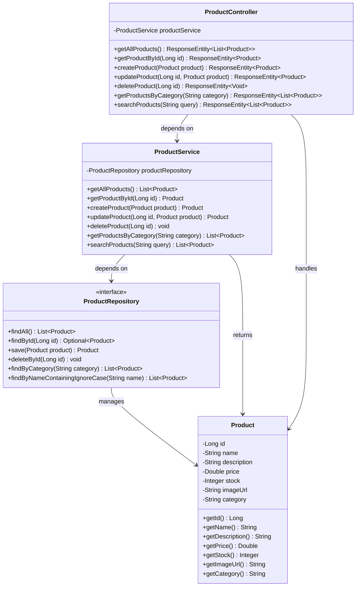
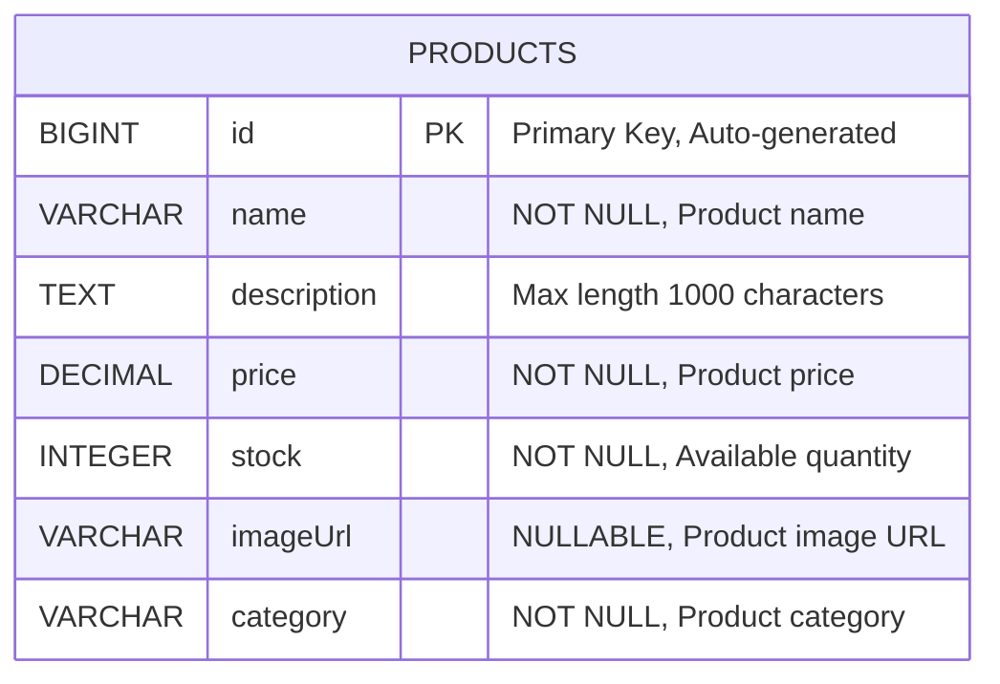
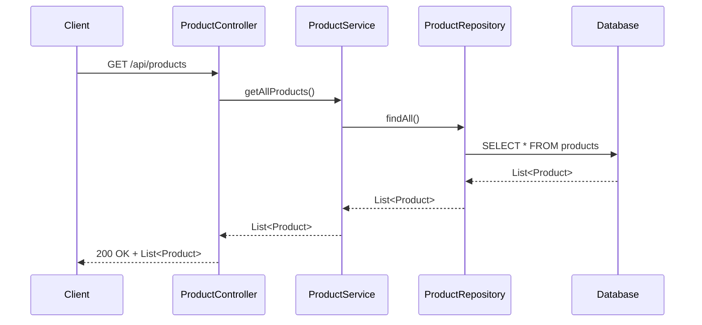
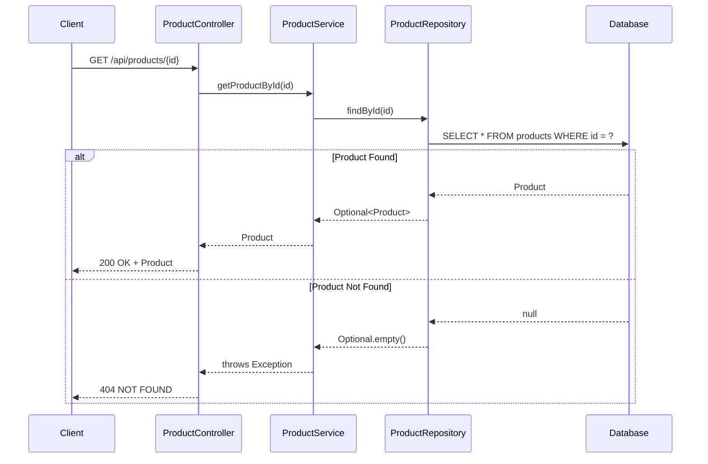
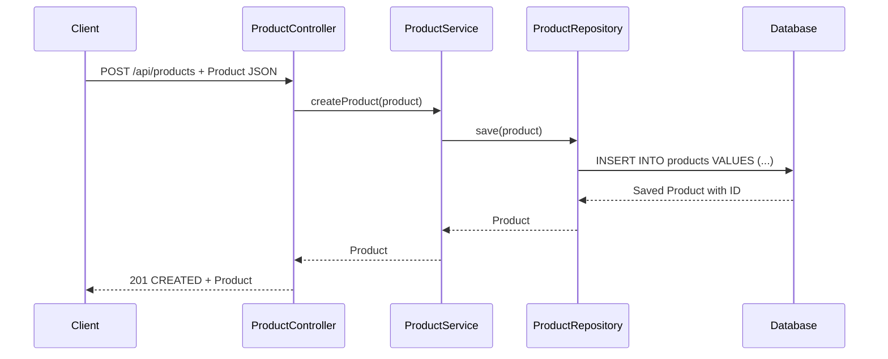
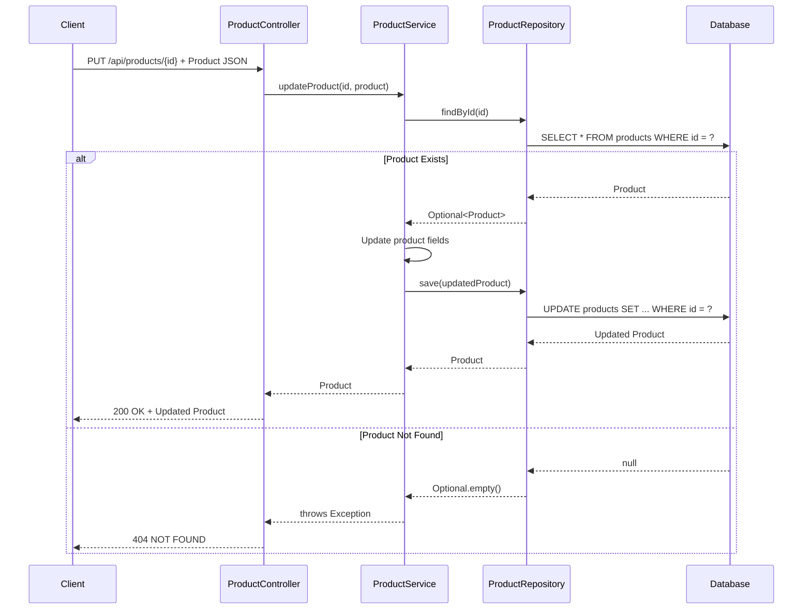
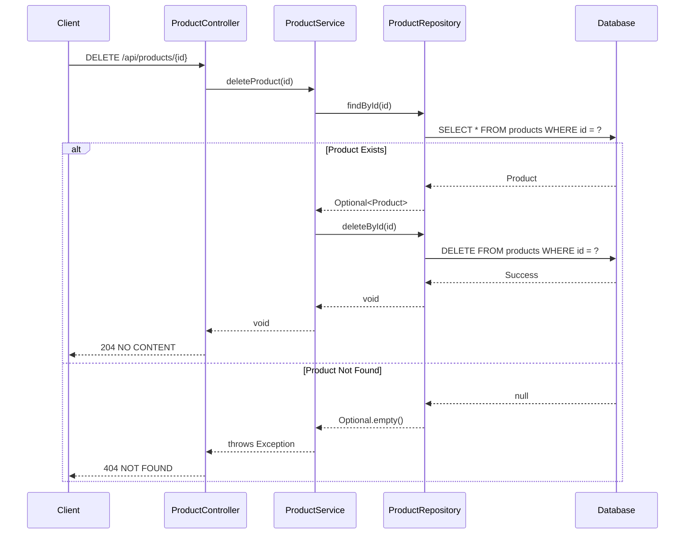
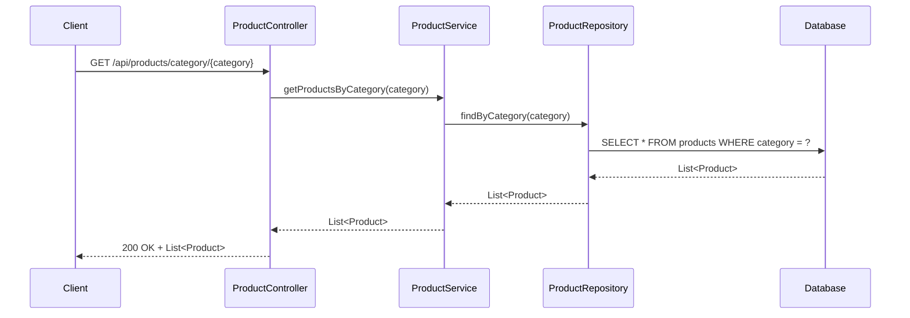
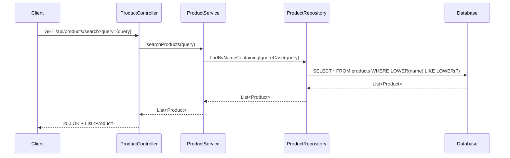

# Low-Level Design (LLD) - E-commerce Spring Boot Application

## Table of Contents
1. [Overview](#overview)
2. [System Architecture](#system-architecture)
3. [Class Diagram](#class-diagram)
4. [Entity Relationship Diagram](#entity-relationship-diagram)
5. [Sequence Diagrams](#sequence-diagrams)
6. [API Specifications](#api-specifications)
7. [Database Schema](#database-schema)
8. [Configuration Details](#configuration-details)

## Overview

This document provides a comprehensive Low-Level Design for an e-commerce Spring Boot application focusing on Product Management functionality.

### Technology Stack
- **Framework**: Spring Boot 3.3.0
- **Java Version**: 21
- **Database**: PostgreSQL
- **Server Port**: 8080
- **Dependencies**: Spring Boot Web, JPA, PostgreSQL, Lombok, H2 (runtime)

## System Architecture

The application follows a layered architecture pattern:
- **API Layer**: REST Controllers handling HTTP requests
- **Service Layer**: Business logic implementation
- **Data Layer**: Entity models and repository interfaces
- **Database Layer**: PostgreSQL for data persistence

## Class Diagram



## Entity Relationship Diagram



## Sequence Diagrams

### 1. Get All Products



### 2. Get Product by ID



### 3. Create Product



### 4. Update Product



### 5. Delete Product



### 6. Get Products by Category



### 7. Search Products



## API Specifications

### Base Path: `/api/products`

| Method | Endpoint | Description | Request Body | Response | Status Codes |
|--------|----------|-------------|--------------|----------|-------------|
| GET | `/` | Get all products | None | List<Product> | 200 |
| GET | `/{id}` | Get product by ID | None | Product | 200, 404 |
| POST | `/` | Create new product | Product JSON | Product | 201 |
| PUT | `/{id}` | Update existing product | Product JSON | Product | 200, 404 |
| DELETE | `/{id}` | Delete product | None | None | 204, 404 |
| GET | `/category/{category}` | Get products by category | None | List<Product> | 200 |
| GET | `/search?query={query}` | Search products by name | None | List<Product> | 200 |

### Product JSON Schema

```json
{
  "id": "number (auto-generated)",
  "name": "string (required)",
  "description": "string (max 1000 chars)",
  "price": "number (required)",
  "stock": "integer (required)",
  "imageUrl": "string (optional)",
  "category": "string (required)"
}
```

## Database Schema

### Products Table

```sql
CREATE TABLE products (
    id BIGSERIAL PRIMARY KEY,
    name VARCHAR(255) NOT NULL,
    description TEXT CHECK (LENGTH(description) <= 1000),
    price DECIMAL(10,2) NOT NULL,
    stock INTEGER NOT NULL,
    image_url VARCHAR(500),
    category VARCHAR(100) NOT NULL
);

-- Indexes for performance
CREATE INDEX idx_products_category ON products(category);
CREATE INDEX idx_products_name ON products(name);
```

## Configuration Details

### Application Properties

```properties
# Server Configuration
server.port=8080

# Database Configuration
spring.datasource.url=jdbc:postgresql://localhost:5432/ecommerce_db
spring.datasource.username=${DB_USERNAME:admin}
spring.datasource.password=${DB_PASSWORD:password}
spring.datasource.driver-class-name=org.postgresql.Driver

# JPA Configuration
spring.jpa.hibernate.ddl-auto=update
spring.jpa.show-sql=true
spring.jpa.properties.hibernate.dialect=org.hibernate.dialect.PostgreSQLDialect

# H2 Console (for development)
spring.h2.console.enabled=true
```

### CORS Configuration

```java
@Configuration
@EnableWebMvc
public class WebConfig implements WebMvcConfigurer {
    
    @Override
    public void addCorsMappings(CorsRegistry registry) {
        registry.addMapping("/api/**")
                .allowedOrigins("http://localhost:3000", "http://localhost:4200")
                .allowedMethods("GET", "POST", "PUT", "DELETE", "OPTIONS")
                .allowedHeaders("*")
                .allowCredentials(true);
    }
}
```

### Dependencies

```xml
<dependencies>
    <!-- Spring Boot Starter Web -->
    <dependency>
        <groupId>org.springframework.boot</groupId>
        <artifactId>spring-boot-starter-web</artifactId>
    </dependency>
    
    <!-- Spring Boot Starter Data JPA -->
    <dependency>
        <groupId>org.springframework.boot</groupId>
        <artifactId>spring-boot-starter-data-jpa</artifactId>
    </dependency>
    
    <!-- PostgreSQL Driver -->
    <dependency>
        <groupId>org.postgresql</groupId>
        <artifactId>postgresql</artifactId>
        <scope>runtime</scope>
    </dependency>
    
    <!-- Lombok -->
    <dependency>
        <groupId>org.projectlombok</groupId>
        <artifactId>lombok</artifactId>
        <optional>true</optional>
    </dependency>
    
    <!-- H2 Database (for testing) -->
    <dependency>
        <groupId>com.h2database</groupId>
        <artifactId>h2</artifactId>
        <scope>runtime</scope>
    </dependency>
</dependencies>
```

## Implementation Notes

### Error Handling
- Custom exception handling for product not found scenarios
- Validation for required fields and constraints
- Proper HTTP status code responses

### Performance Considerations
- Database indexing on frequently queried columns (category, name)
- Pagination support for large datasets
- Connection pooling for database connections

### Security Considerations
- Input validation and sanitization
- SQL injection prevention through JPA
- CORS configuration for frontend integration

### Testing Strategy
- Unit tests for service layer methods
- Integration tests for repository layer
- API endpoint testing with MockMvc
- Database testing with H2 in-memory database

---

**Document Version**: 1.0  
**Last Updated**: December 2024  
**Author**: API Documentation Generator  
**Review Status**: Ready for Review