# Low-Level Design Document: E-commerce Product Management System

## 1. Project Overview

### 1.1 Purpose
This document provides a detailed low-level design for an E-commerce Product Management System. The system enables users to browse products, manage shopping carts, and perform CRUD operations on products.

### 1.2 Scope
The system includes:
- Product catalog management
- Shopping cart functionality
- Category-based product organization
- Product search capabilities
- RESTful API endpoints

### 1.3 Technology Stack
- **Backend Framework**: Spring Boot 3.x
- **Language**: Java 17
- **Database**: PostgreSQL
- **ORM**: Spring Data JPA/Hibernate
- **API Documentation**: OpenAPI/Swagger
- **Build Tool**: Maven
- **Testing**: JUnit 5, Mockito

---

## 2. System Architecture

### 2.1 Layered Architecture
The system follows a layered architecture pattern:

```
┌─────────────────────────────────────┐
│     Presentation Layer (REST)       │
├─────────────────────────────────────┤
│       Service Layer (Business)      │
├─────────────────────────────────────┤
│    Repository Layer (Data Access)   │
├─────────────────────────────────────┤
│         Database (PostgreSQL)       │
└─────────────────────────────────────┘
```

### 2.2 Class Diagram

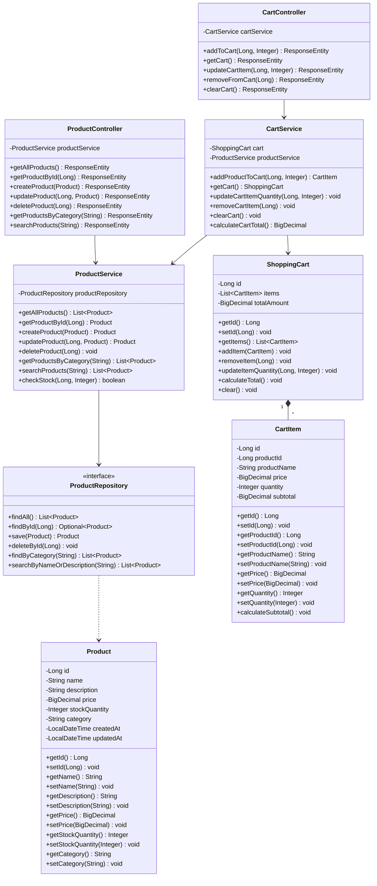

### 2.3 Entity Relationship Diagram

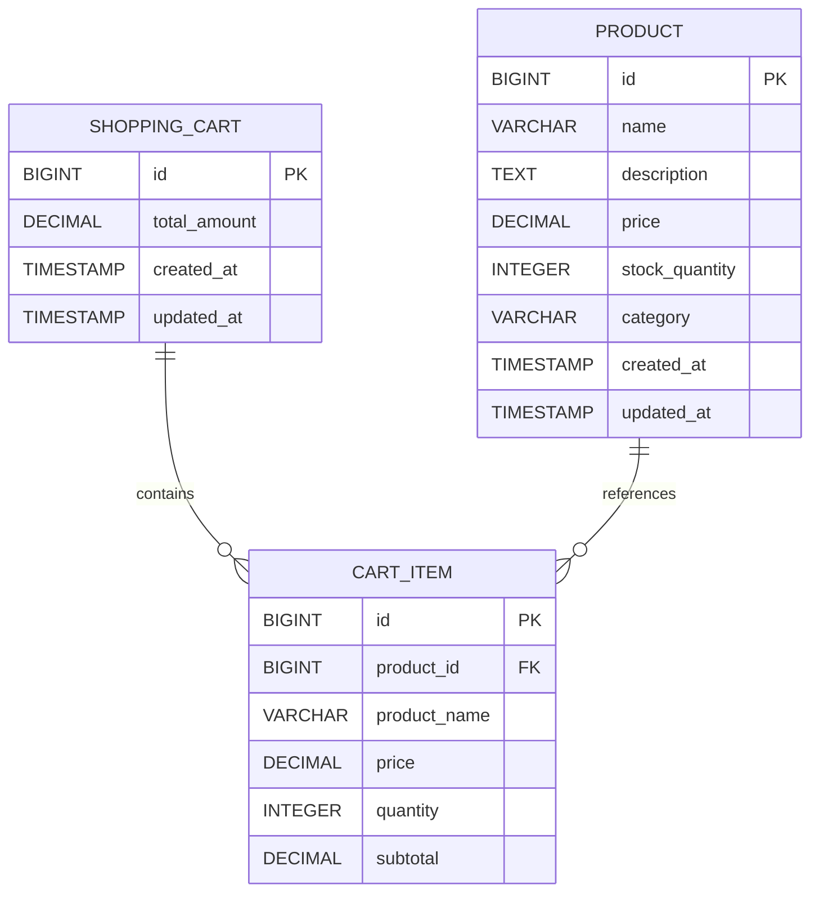

---

## 3. Detailed Component Design

### 3.1 Product Management

#### 3.1.1 Get All Products

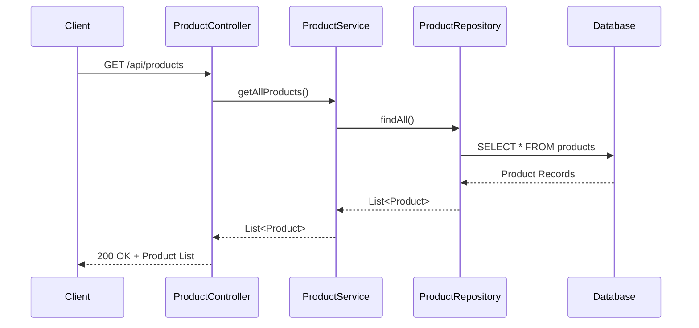

**Implementation Details:**
- **Endpoint**: `GET /api/products`
- **Response**: List of all products with pagination support
- **Error Handling**: Returns empty list if no products exist

#### 3.1.2 Get Product By ID

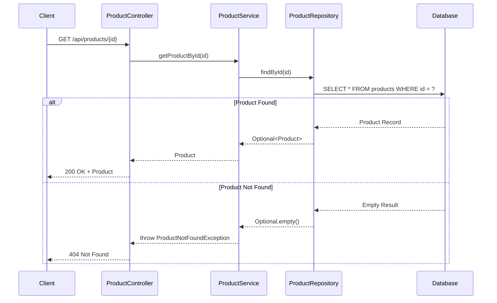

**Implementation Details:**
- **Endpoint**: `GET /api/products/{id}`
- **Path Variable**: `id` (Long)
- **Success Response**: 200 OK with product details
- **Error Response**: 404 Not Found if product doesn't exist

#### 3.1.3 Create Product

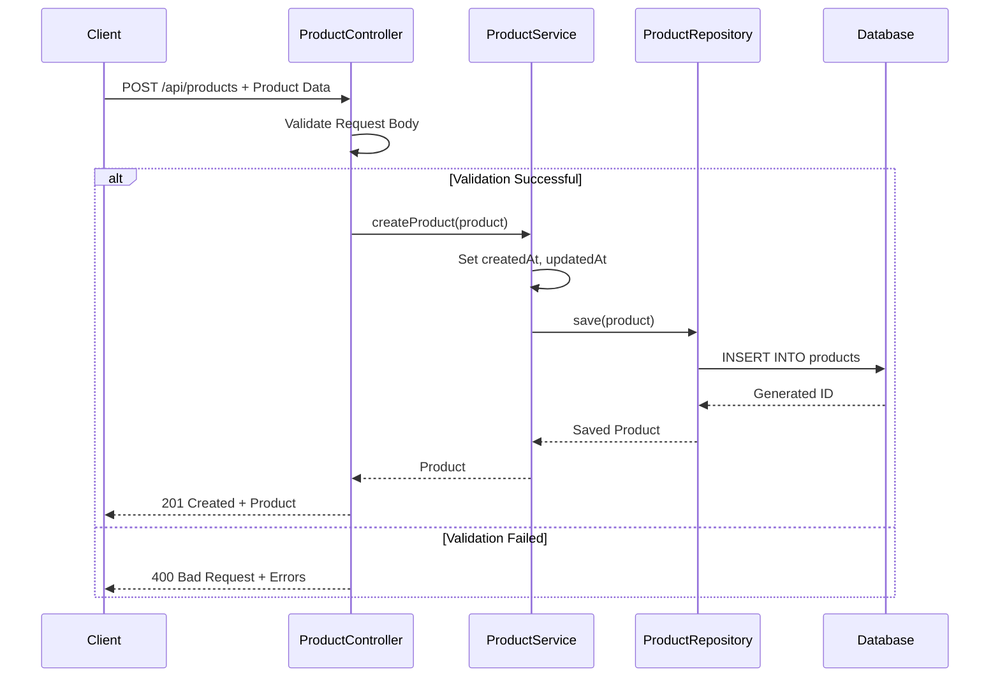

**Implementation Details:**
- **Endpoint**: `POST /api/products`
- **Request Body**: Product JSON
- **Validations**:
  - Name: Required, max 255 characters
  - Price: Required, positive value
  - Stock Quantity: Required, non-negative
  - Category: Required
- **Success Response**: 201 Created with product details
- **Error Response**: 400 Bad Request for validation errors

#### 3.1.4 Update Product

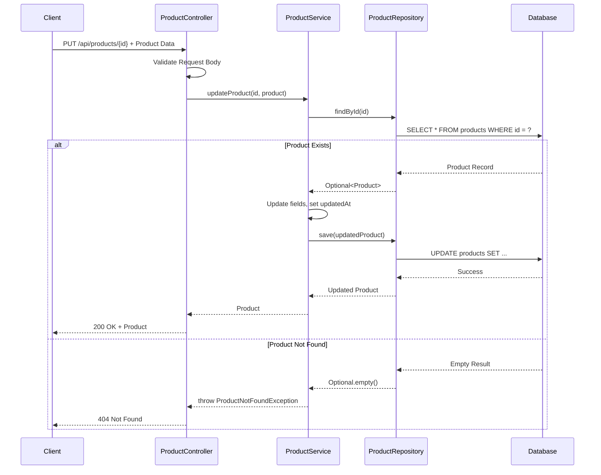

**Implementation Details:**
- **Endpoint**: `PUT /api/products/{id}`
- **Path Variable**: `id` (Long)
- **Request Body**: Product JSON
- **Update Strategy**: Partial update (only provided fields)
- **Success Response**: 200 OK with updated product
- **Error Responses**:
  - 404 Not Found if product doesn't exist
  - 400 Bad Request for validation errors

#### 3.1.5 Delete Product

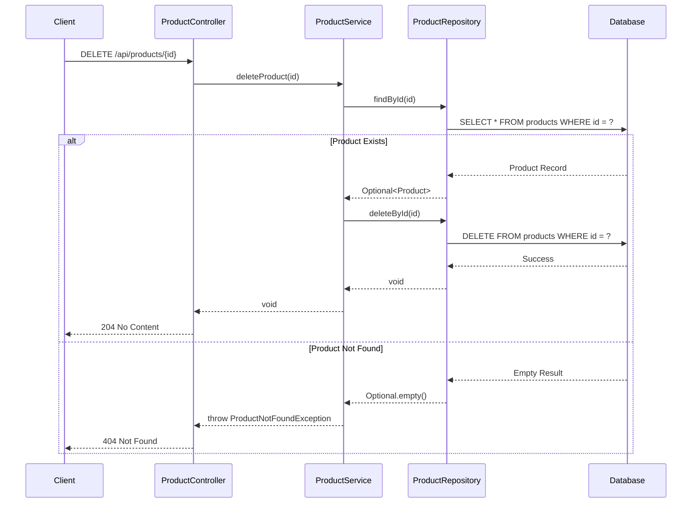

**Implementation Details:**
- **Endpoint**: `DELETE /api/products/{id}`
- **Path Variable**: `id` (Long)
- **Success Response**: 204 No Content
- **Error Response**: 404 Not Found if product doesn't exist

#### 3.1.6 Get Products By Category


**Implementation Details:**
- **Endpoint**: `GET /api/products/category/{category}`
- **Path Variable**: `category` (String)
- **Response**: List of products in the specified category
- **Error Handling**: Returns empty list if no products in category

#### 3.1.7 Search Products

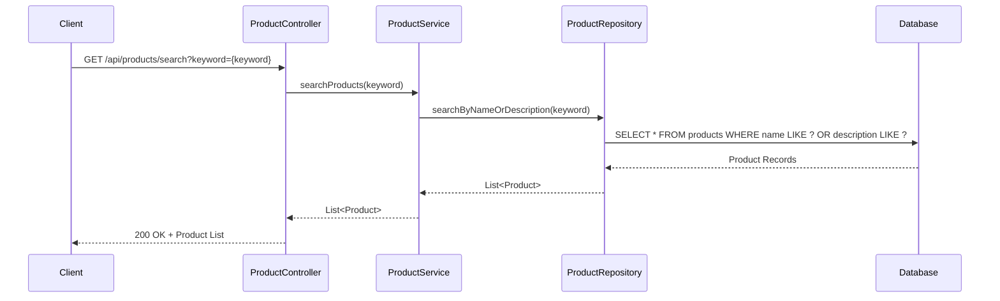

**Implementation Details:**
- **Endpoint**: `GET /api/products/search`
- **Query Parameter**: `keyword` (String)
- **Search Fields**: Product name and description
- **Search Type**: Case-insensitive partial match
- **Response**: List of matching products

### 3.2 Shopping Cart Management

#### 3.2.1 Add Product to Cart

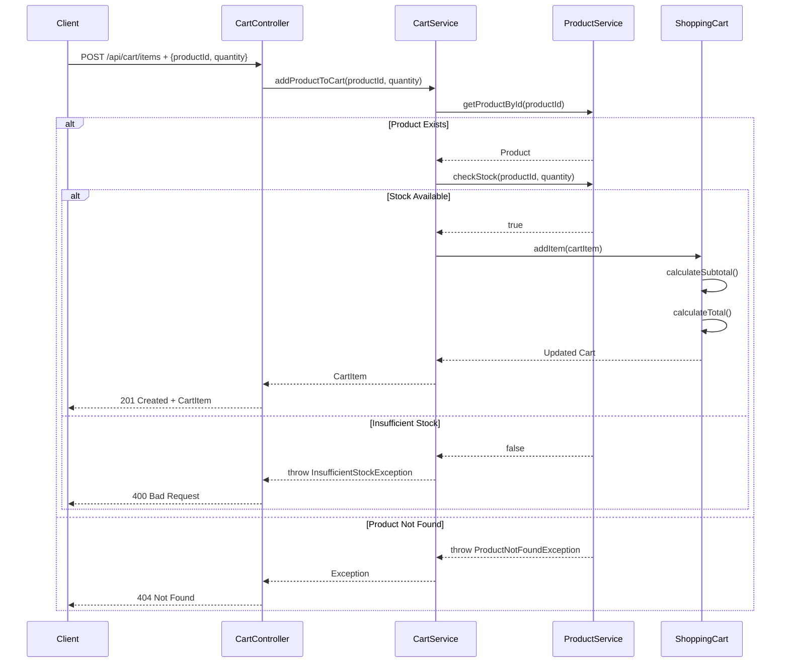

**Implementation Details:**
- **Endpoint**: `POST /api/cart/items`
- **Request Body**: `{productId: Long, quantity: Integer}`
- **Validations**:
  - Product must exist
  - Quantity must be positive
  - Sufficient stock must be available
- **Success Response**: 201 Created with cart item details
- **Error Responses**:
  - 404 Not Found if product doesn't exist
  - 400 Bad Request if insufficient stock

#### 3.2.2 View Shopping Cart

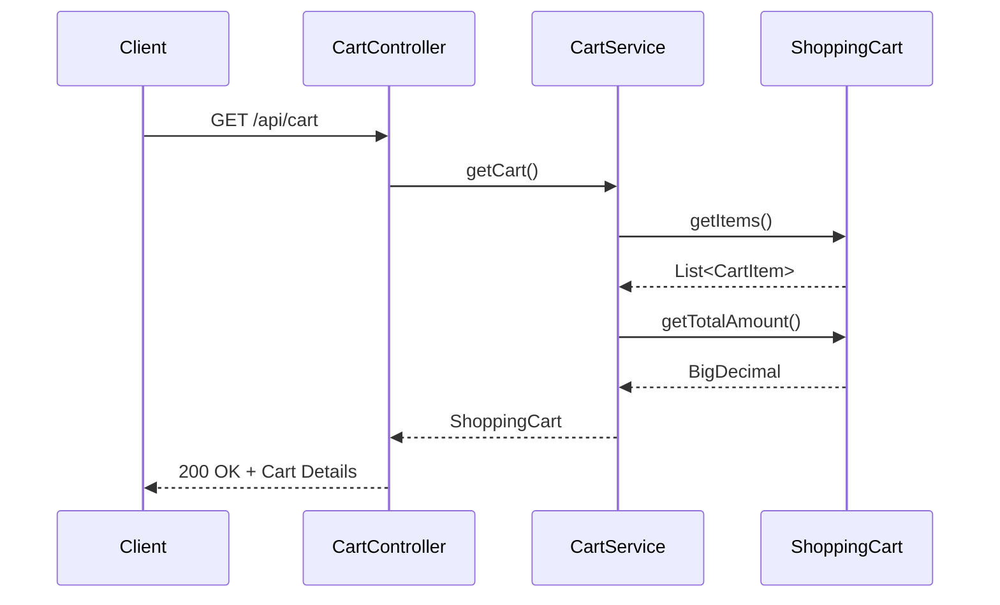

**Implementation Details:**
- **Endpoint**: `GET /api/cart`
- **Response**: Complete cart with items and total amount
- **Cart Details Include**:
  - List of cart items
  - Individual item subtotals
  - Total cart amount

#### 3.2.3 Update Cart Item Quantity

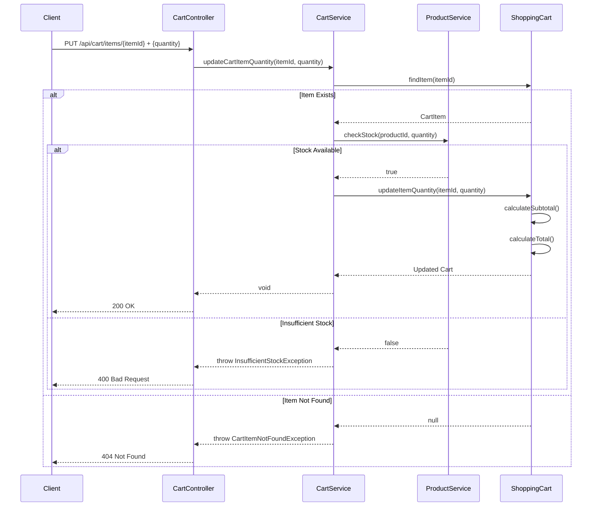

**Implementation Details:**
- **Endpoint**: `PUT /api/cart/items/{itemId}`
- **Path Variable**: `itemId` (Long)
- **Request Body**: `{quantity: Integer}`
- **Validations**:
  - Cart item must exist
  - Quantity must be positive
  - Sufficient stock must be available
- **Success Response**: 200 OK
- **Error Responses**:
  - 404 Not Found if cart item doesn't exist
  - 400 Bad Request if insufficient stock

#### 3.2.4 Remove Item from Cart

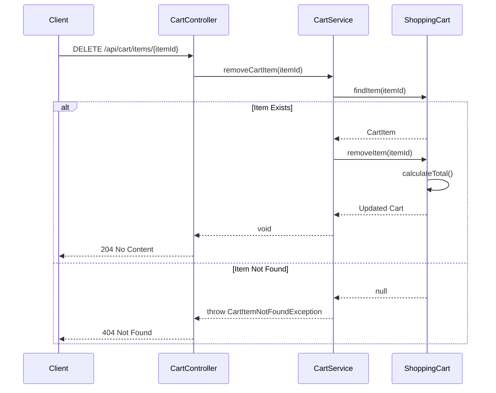

**Implementation Details:**
- **Endpoint**: `DELETE /api/cart/items/{itemId}`
- **Path Variable**: `itemId` (Long)
- **Success Response**: 204 No Content
- **Error Response**: 404 Not Found if cart item doesn't exist

---

## 4. API Endpoints Summary

### 4.1 Product Endpoints

| Method | Endpoint | Description | Request Body | Response |
|--------|----------|-------------|--------------|----------|
| GET | `/api/products` | Get all products | - | 200 OK + List<Product> |
| GET | `/api/products/{id}` | Get product by ID | - | 200 OK + Product |
| POST | `/api/products` | Create new product | Product | 201 Created + Product |
| PUT | `/api/products/{id}` | Update product | Product | 200 OK + Product |
| DELETE | `/api/products/{id}` | Delete product | - | 204 No Content |
| GET | `/api/products/category/{category}` | Get products by category | - | 200 OK + List<Product> |
| GET | `/api/products/search?keyword={keyword}` | Search products | - | 200 OK + List<Product> |

### 4.2 Cart Endpoints

| Method | Endpoint | Description | Request Body | Response |
|--------|----------|-------------|--------------|----------|
| POST | `/api/cart/items` | Add product to cart | {productId, quantity} | 201 Created + CartItem |
| GET | `/api/cart` | View shopping cart | - | 200 OK + ShoppingCart |
| PUT | `/api/cart/items/{itemId}` | Update cart item quantity | {quantity} | 200 OK |
| DELETE | `/api/cart/items/{itemId}` | Remove item from cart | - | 204 No Content |
| DELETE | `/api/cart` | Clear cart | - | 204 No Content |

---

## 5. Database Schema

### 5.1 Products Table

```sql
CREATE TABLE products (
    id BIGSERIAL PRIMARY KEY,
    name VARCHAR(255) NOT NULL,
    description TEXT,
    price DECIMAL(10, 2) NOT NULL,
    stock_quantity INTEGER NOT NULL DEFAULT 0,
    category VARCHAR(100) NOT NULL,
    created_at TIMESTAMP DEFAULT CURRENT_TIMESTAMP,
    updated_at TIMESTAMP DEFAULT CURRENT_TIMESTAMP
);

CREATE INDEX idx_products_category ON products(category);
CREATE INDEX idx_products_name ON products(name);
```

### 5.2 Cart Items Table

```sql
CREATE TABLE cart_items (
    id BIGSERIAL PRIMARY KEY,
    product_id BIGINT NOT NULL,
    product_name VARCHAR(255) NOT NULL,
    price DECIMAL(10, 2) NOT NULL,
    quantity INTEGER NOT NULL,
    subtotal DECIMAL(10, 2) NOT NULL,
    FOREIGN KEY (product_id) REFERENCES products(id) ON DELETE CASCADE
);
```

### 5.3 Shopping Cart Table

```sql
CREATE TABLE shopping_carts (
    id BIGSERIAL PRIMARY KEY,
    total_amount DECIMAL(10, 2) NOT NULL DEFAULT 0.00,
    created_at TIMESTAMP DEFAULT CURRENT_TIMESTAMP,
    updated_at TIMESTAMP DEFAULT CURRENT_TIMESTAMP
);
```

---

## 6. Error Handling

### 6.1 Exception Hierarchy

```java
public class ProductNotFoundException extends RuntimeException {
    public ProductNotFoundException(Long id) {
        super("Product not found with id: " + id);
    }
}

public class InsufficientStockException extends RuntimeException {
    public InsufficientStockException(String productName, int requested, int available) {
        super(String.format("Insufficient stock for %s. Requested: %d, Available: %d", 
            productName, requested, available));
    }
}

public class CartItemNotFoundException extends RuntimeException {
    public CartItemNotFoundException(Long id) {
        super("Cart item not found with id: " + id);
    }
}
```

### 6.2 Global Exception Handler

```java
@RestControllerAdvice
public class GlobalExceptionHandler {
    
    @ExceptionHandler(ProductNotFoundException.class)
    public ResponseEntity<ErrorResponse> handleProductNotFound(ProductNotFoundException ex) {
        ErrorResponse error = new ErrorResponse(
            HttpStatus.NOT_FOUND.value(),
            ex.getMessage(),
            LocalDateTime.now()
        );
        return new ResponseEntity<>(error, HttpStatus.NOT_FOUND);
    }
    
    @ExceptionHandler(InsufficientStockException.class)
    public ResponseEntity<ErrorResponse> handleInsufficientStock(InsufficientStockException ex) {
        ErrorResponse error = new ErrorResponse(
            HttpStatus.BAD_REQUEST.value(),
            ex.getMessage(),
            LocalDateTime.now()
        );
        return new ResponseEntity<>(error, HttpStatus.BAD_REQUEST);
    }
    
    @ExceptionHandler(MethodArgumentNotValidException.class)
    public ResponseEntity<ErrorResponse> handleValidationErrors(MethodArgumentNotValidException ex) {
        List<String> errors = ex.getBindingResult()
            .getFieldErrors()
            .stream()
            .map(FieldError::getDefaultMessage)
            .collect(Collectors.toList());
        
        ErrorResponse error = new ErrorResponse(
            HttpStatus.BAD_REQUEST.value(),
            "Validation failed: " + String.join(", ", errors),
            LocalDateTime.now()
        );
        return new ResponseEntity<>(error, HttpStatus.BAD_REQUEST);
    }
}
```

---

## 7. Design Patterns Used

### 7.1 Repository Pattern
- Abstracts data access logic
- Provides clean separation between business logic and data access
- Implemented via Spring Data JPA

### 7.2 Service Layer Pattern
- Encapsulates business logic
- Provides transaction management
- Coordinates between controllers and repositories

### 7.3 DTO Pattern
- Separates internal domain models from API contracts
- Provides data validation
- Reduces over-fetching/under-fetching

### 7.4 Singleton Pattern
- Shopping cart instance (session-scoped)
- Service beans (application-scoped)

---

## 8. Security Considerations

### 8.1 Input Validation
- All user inputs validated using Bean Validation (JSR-380)
- SQL injection prevention via parameterized queries
- XSS prevention via input sanitization

### 8.2 Data Validation Rules

**Product:**
- Name: Required, 1-255 characters
- Description: Optional, max 2000 characters
- Price: Required, positive, max 2 decimal places
- Stock Quantity: Required, non-negative integer
- Category: Required, 1-100 characters

**Cart Item:**
- Product ID: Required, must exist
- Quantity: Required, positive integer, max 999

---

## 9. Performance Considerations

### 9.1 Database Optimization
- Indexes on frequently queried columns (category, name)
- Connection pooling via HikariCP
- Lazy loading for relationships
- Query optimization via JPA criteria

### 9.2 Caching Strategy
- Product catalog caching (Redis/Caffeine)
- Cache invalidation on product updates
- Session-based cart storage

### 9.3 Pagination
- Implement pagination for product listings
- Default page size: 20 items
- Maximum page size: 100 items

---

## 10. Testing Strategy

### 10.1 Unit Tests
- Service layer business logic
- Repository custom queries
- Utility methods
- Target coverage: 80%+

### 10.2 Integration Tests
- API endpoint testing
- Database integration
- End-to-end workflows

### 10.3 Test Data
- Use H2 in-memory database for tests
- Test data builders for object creation
- Mockito for mocking dependencies

---

## 11. Deployment Considerations

### 11.1 Environment Configuration
- Development: H2 database, debug logging
- Staging: PostgreSQL, info logging
- Production: PostgreSQL with replication, error logging

### 11.2 Configuration Properties

```yaml
spring:
  datasource:
    url: ${DB_URL}
    username: ${DB_USERNAME}
    password: ${DB_PASSWORD}
  jpa:
    hibernate:
      ddl-auto: validate
    show-sql: false
  
server:
  port: 8080
  
logging:
  level:
    root: INFO
    com.ecommerce: DEBUG
```

---

## 12. Future Enhancements

1. **User Authentication & Authorization**
   - JWT-based authentication
   - Role-based access control
   - User-specific carts

2. **Order Management**
   - Checkout process
   - Order history
   - Payment integration

3. **Advanced Features**
   - Product reviews and ratings
   - Wishlist functionality
   - Product recommendations
   - Inventory management
   - Multi-currency support

4. **Performance Improvements**
   - Redis caching
   - CDN for product images
   - Database read replicas
   - Elasticsearch for product search

---

## 13. Appendix

### 13.1 Sample Request/Response

**Create Product Request:**
```json
{
  "name": "Laptop",
  "description": "High-performance laptop",
  "price": 999.99,
  "stockQuantity": 50,
  "category": "Electronics"
}
```

**Create Product Response:**
```json
{
  "id": 1,
  "name": "Laptop",
  "description": "High-performance laptop",
  "price": 999.99,
  "stockQuantity": 50,
  "category": "Electronics",
  "createdAt": "2024-01-15T10:30:00",
  "updatedAt": "2024-01-15T10:30:00"
}
```

**Add to Cart Request:**
```json
{
  "productId": 1,
  "quantity": 2
}
```

**Cart Response:**
```json
{
  "id": 1,
  "items": [
    {
      "id": 1,
      "productId": 1,
      "productName": "Laptop",
      "price": 999.99,
      "quantity": 2,
      "subtotal": 1999.98
    }
  ],
  "totalAmount": 1999.98
}
```

### 13.2 Key Features Summary

1. **Product Management**
   - Complete CRUD operations
   - Category-based filtering
   - Search functionality
   - Stock management

2. **Shopping Cart**
   - Add/remove items
   - Update quantities
   - Real-time total calculation
   - Stock validation

3. **Data Integrity**
   - Foreign key constraints
   - Transaction management
   - Optimistic locking

4. **API Design**
   - RESTful principles
   - Consistent error handling
   - Comprehensive validation
   - Clear documentation

---

**Document Version**: 1.0  
**Last Updated**: 2024-01-15  
**Author**: Development Team  
**Status**: Approved