# Low-Level Design (LLD) - E-commerce Product Management System

## 1. Project Overview

This document provides a comprehensive low-level design for an E-commerce Product Management System. The system enables users to browse products, manage a shopping cart, and perform CRUD operations on products. It is built using Spring Boot with a RESTful API architecture.

## 2. System Architecture

### 2.1 High-Level Architecture

```
┌─────────────────┐
│   Client Layer  │
│  (Web/Mobile)   │
└────────┬────────┘
         │
         │ HTTP/REST
         │
┌────────▼────────┐
│ Controller Layer│
│  (REST APIs)    │
└────────┬────────┘
         │
┌────────▼────────┐
│  Service Layer  │
│ (Business Logic)│
└────────┬────────┘
         │
┌────────▼────────┐
│Repository Layer │
│   (Data Access) │
└────────┬────────┘
         │
┌────────▼────────┐
│    Database     │
│    (MySQL)      │
└─────────────────┘
```

### 2.2 Class Diagram

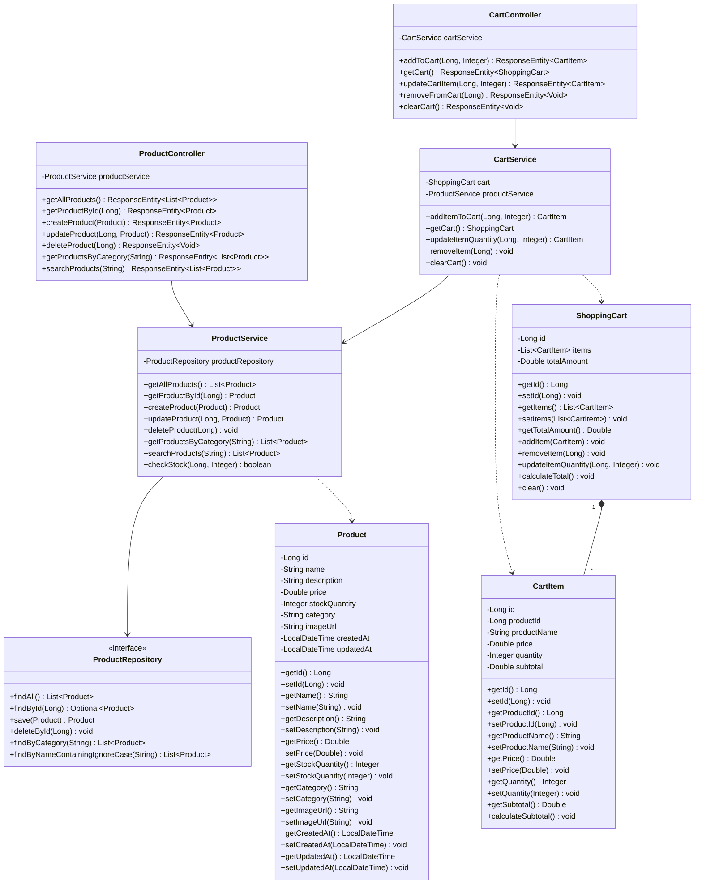

### 2.3 Entity Relationship Diagram

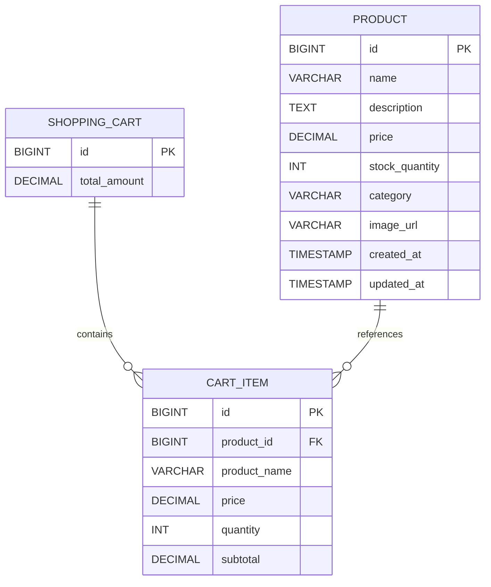

## 3. Sequence Diagrams

### 3.1 Get All Products

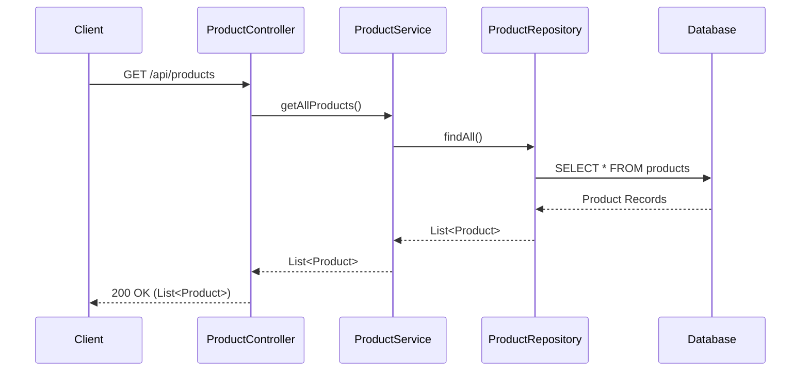

### 3.2 Get Product By ID

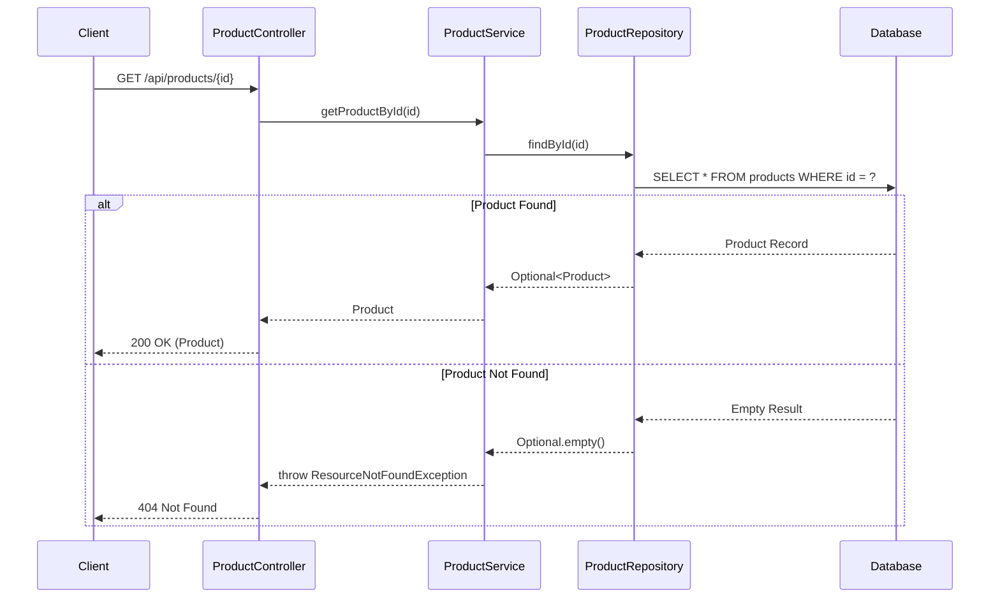

### 3.3 Create Product

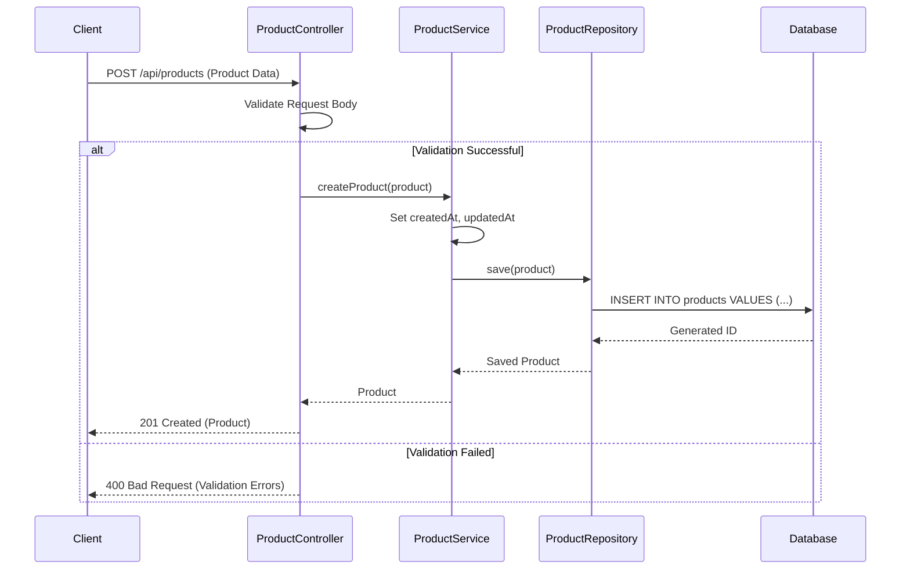

### 3.4 Update Product

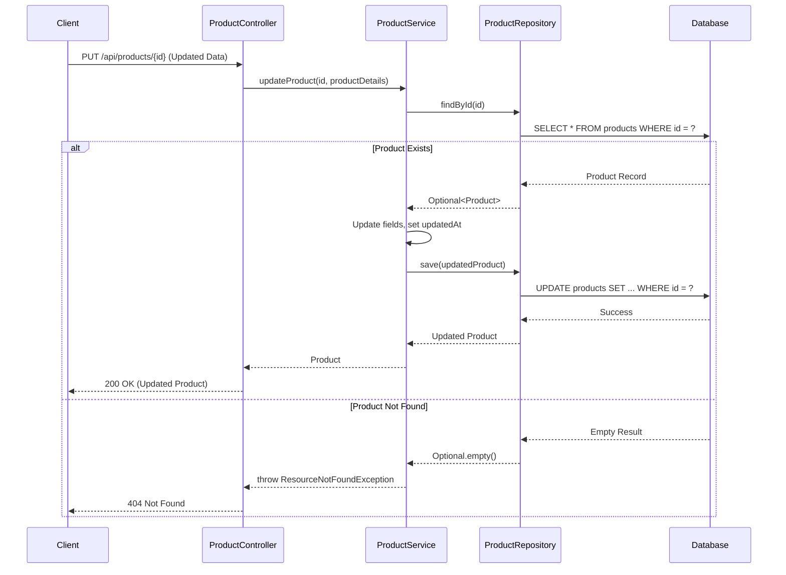

### 3.5 Delete Product

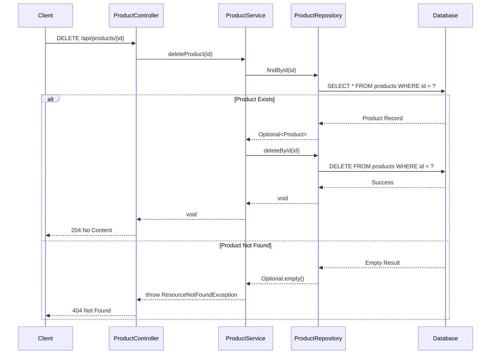

### 3.6 Get Products By Category

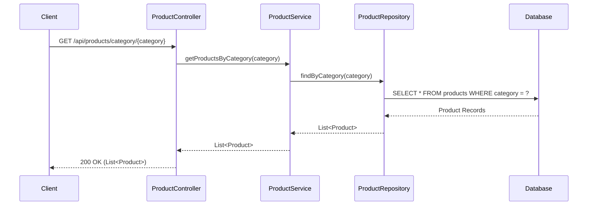

### 3.7 Search Products

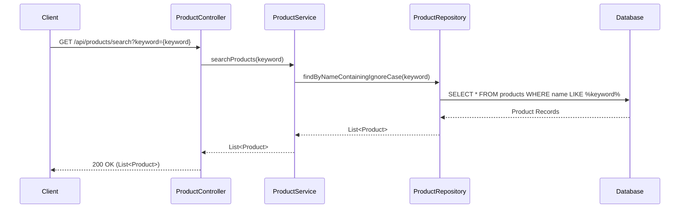

### 3.8 Add Product to Cart

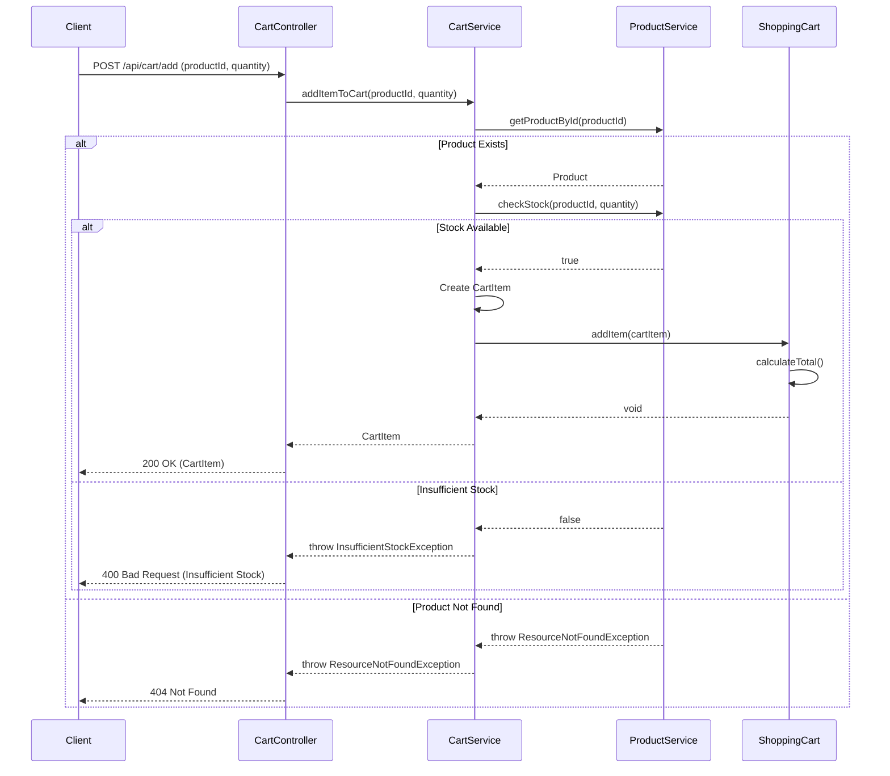

### 3.9 View Shopping Cart

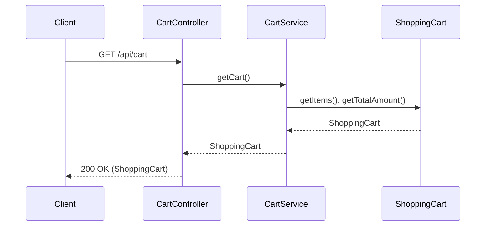

### 3.10 Update Cart Item Quantity

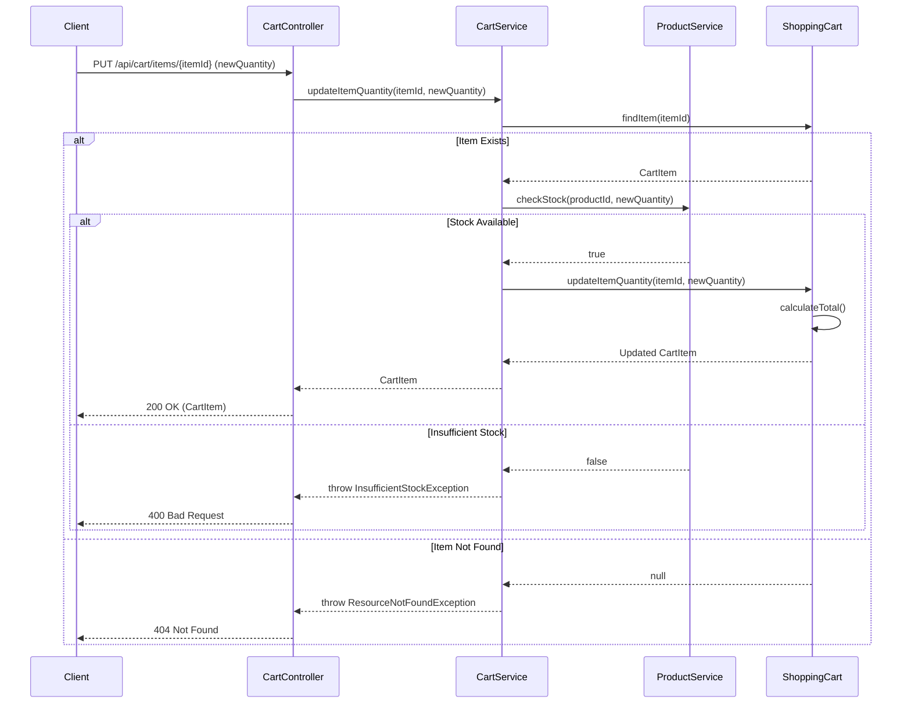

### 3.11 Remove Item from Cart

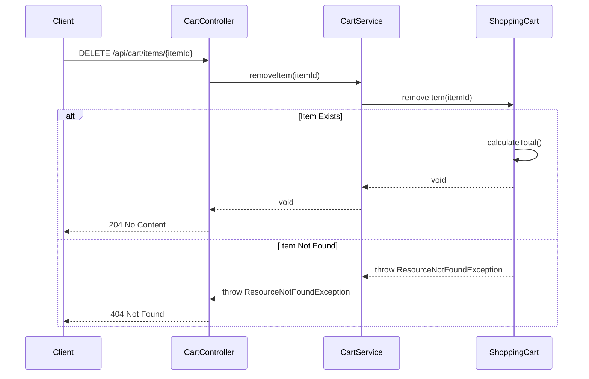

## 4. API Endpoints Summary

### Product Management APIs

| Method | Endpoint | Description | Request Body | Response |
|--------|----------|-------------|--------------|----------|
| GET | /api/products | Get all products | None | List<Product> |
| GET | /api/products/{id} | Get product by ID | None | Product |
| POST | /api/products | Create new product | Product | Product (201) |
| PUT | /api/products/{id} | Update product | Product | Product |
| DELETE | /api/products/{id} | Delete product | None | 204 No Content |
| GET | /api/products/category/{category} | Get products by category | None | List<Product> |
| GET | /api/products/search?keyword={keyword} | Search products | None | List<Product> |

### Shopping Cart APIs

| Method | Endpoint | Description | Request Body | Response |
|--------|----------|-------------|--------------|----------|
| POST | /api/cart/add | Add item to cart | {productId, quantity} | CartItem |
| GET | /api/cart | View shopping cart | None | ShoppingCart |
| PUT | /api/cart/items/{itemId} | Update item quantity | {quantity} | CartItem |
| DELETE | /api/cart/items/{itemId} | Remove item from cart | None | 204 No Content |
| DELETE | /api/cart/clear | Clear entire cart | None | 204 No Content |

## 5. Database Schema

### 5.1 Products Table

```sql
CREATE TABLE products (
    id BIGINT AUTO_INCREMENT PRIMARY KEY,
    name VARCHAR(255) NOT NULL,
    description TEXT,
    price DECIMAL(10, 2) NOT NULL,
    stock_quantity INT NOT NULL DEFAULT 0,
    category VARCHAR(100),
    image_url VARCHAR(500),
    created_at TIMESTAMP DEFAULT CURRENT_TIMESTAMP,
    updated_at TIMESTAMP DEFAULT CURRENT_TIMESTAMP ON UPDATE CURRENT_TIMESTAMP,
    INDEX idx_category (category),
    INDEX idx_name (name)
);
```

### 5.2 Cart Items Table

```sql
CREATE TABLE cart_items (
    id BIGINT AUTO_INCREMENT PRIMARY KEY,
    product_id BIGINT NOT NULL,
    product_name VARCHAR(255) NOT NULL,
    price DECIMAL(10, 2) NOT NULL,
    quantity INT NOT NULL,
    subtotal DECIMAL(10, 2) NOT NULL,
    cart_id BIGINT,
    FOREIGN KEY (product_id) REFERENCES products(id) ON DELETE CASCADE,
    FOREIGN KEY (cart_id) REFERENCES shopping_carts(id) ON DELETE CASCADE
);
```

### 5.3 Shopping Carts Table

```sql
CREATE TABLE shopping_carts (
    id BIGINT AUTO_INCREMENT PRIMARY KEY,
    total_amount DECIMAL(10, 2) NOT NULL DEFAULT 0.00,
    created_at TIMESTAMP DEFAULT CURRENT_TIMESTAMP,
    updated_at TIMESTAMP DEFAULT CURRENT_TIMESTAMP ON UPDATE CURRENT_TIMESTAMP
);
```

## 6. Technology Stack

- **Backend Framework**: Spring Boot 3.x
- **Language**: Java 17+
- **Database**: MySQL 8.x
- **ORM**: Spring Data JPA / Hibernate
- **Build Tool**: Maven
- **API Documentation**: SpringDoc OpenAPI (Swagger)
- **Validation**: Jakarta Bean Validation
- **Logging**: SLF4J with Logback

## 7. Design Patterns Used

1. **MVC Pattern**: Separation of Controller, Service, and Repository layers
2. **Repository Pattern**: Data access abstraction through Spring Data JPA
3. **Dependency Injection**: Constructor-based injection for loose coupling
4. **DTO Pattern**: Data Transfer Objects for API requests/responses
5. **Singleton Pattern**: Service beans managed by Spring container
6. **Builder Pattern**: For complex object creation (if needed)

## 8. Key Features

### 8.1 Product Management
- Complete CRUD operations for products
- Category-based filtering
- Search functionality with case-insensitive matching
- Stock quantity tracking
- Automatic timestamp management

### 8.2 Shopping Cart
- Add products to cart with quantity validation
- Update item quantities with stock verification
- Remove individual items
- Clear entire cart
- Automatic subtotal and total calculation
- Real-time stock availability checking

### 8.3 Error Handling
- Custom exception handling for:
  - Resource not found (404)
  - Insufficient stock (400)
  - Validation errors (400)
  - Internal server errors (500)

### 8.4 Data Validation
- Request body validation using Jakarta Bean Validation
- Business rule validation in service layer
- Stock availability checks before cart operations

### 8.5 Performance Considerations
- Database indexing on frequently queried columns
- Efficient query methods in repositories
- Lazy loading for related entities
- Connection pooling for database connections

---

**Document Version**: 1.0  
**Last Updated**: 2024  
**Status**: Active