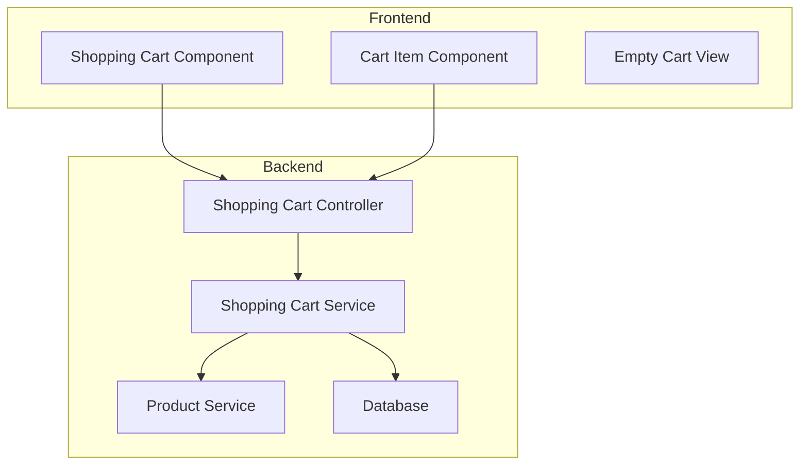

# Low Level Design Document
## Shopping Cart Feature

### Document Information
- **Version**: 2.0
- **Last Updated**: 2024
- **Status**: Updated with RCA Modifications

---

## Table of Contents
1. [Overview](#overview)
2. [System Architecture](#system-architecture)
3. [Backend Components](#backend-components)
   - 3.1 [Shopping Cart Controller](#shopping-cart-controller)
   - 3.2 [Shopping Cart Service](#shopping-cart-service)
   - 3.3 [Data Models](#data-models)
4. [Frontend Components](#frontend-components)
   - 4.1 [Shopping Cart Component](#shopping-cart-component)
   - 4.2 [Cart Item Component](#cart-item-component)
5. [API Specifications](#api-specifications)
6. [Validation Rules](#validation-rules)
7. [Error Handling](#error-handling)
8. [Security Considerations](#security-considerations)
9. [Performance Optimization](#performance-optimization)
10. [Testing Strategy](#testing-strategy)

---

## 1. Overview

This Low Level Design document describes the implementation details for the Shopping Cart Feature. The shopping cart allows users to add products, update quantities, remove items, and proceed to checkout.

### Key Features
- Add products to cart
- Update item quantities
- Remove items from cart
- View cart summary with pricing
- Empty cart management
- Quantity validation against product limits

---

## 2. System Architecture



---

## 3. Backend Components

### 3.1 Shopping Cart Controller

**File**: `controllers/shopping_cart_controller.py`

**Responsibilities**:
- Handle HTTP requests for cart operations
- Validate request parameters
- Coordinate with Shopping Cart Service
- Return appropriate HTTP responses

**Endpoints**:

#### Add Item to Cart
```python
@router.post("/cart/items")
async def add_item_to_cart(
    product_id: int,
    quantity: int,
    user_id: int = Depends(get_current_user)
):
    """
    Add an item to the shopping cart.
    
    Validations:
    - Product must exist
    - Quantity must be positive
    - Quantity must not exceed max_order_quantity
    """
    try:
        # Validate product exists and get product details
        product = await product_service.get_product(product_id)
        if not product:
            raise HTTPException(status_code=404, detail="Product not found")
        
        # Validate quantity against max_order_quantity
        if quantity > product.max_order_quantity:
            raise HTTPException(
                status_code=400,
                detail=f"Quantity exceeds maximum order quantity of {product.max_order_quantity}"
            )
        
        # Add item to cart
        cart_item = await shopping_cart_service.add_item(
            user_id=user_id,
            product_id=product_id,
            quantity=quantity
        )
        
        return {
            "status": "success",
            "data": cart_item,
            "message": "Item added to cart successfully"
        }
    except Exception as e:
        logger.error(f"Error adding item to cart: {str(e)}")
        raise HTTPException(status_code=500, detail="Internal server error")
```

#### Update Cart Item Quantity
```python
@router.put("/cart/items/{cart_item_id}")
async def update_cart_item_quantity(
    cart_item_id: int,
    quantity: int,
    user_id: int = Depends(get_current_user)
):
    """
    Update the quantity of a cart item.
    
    **MODIFICATION APPLIED**: Added validation to enforce max_order_quantity on update operations.
    
    Validations:
    - Cart item must exist and belong to user
    - Quantity must be positive
    - **NEW**: Quantity must not exceed product's max_order_quantity
    
    Reason: Story requires enforcement for all cart operations, not just add.
    """
    try:
        # Get cart item and validate ownership
        cart_item = await shopping_cart_service.get_cart_item(cart_item_id, user_id)
        if not cart_item:
            raise HTTPException(status_code=404, detail="Cart item not found")
        
        # **MODIFICATION**: Get product details to validate max_order_quantity
        product = await product_service.get_product(cart_item.product_id)
        if not product:
            raise HTTPException(status_code=404, detail="Product not found")
        
        # **MODIFICATION**: Validate updated quantity against max_order_quantity
        if quantity > product.max_order_quantity:
            raise HTTPException(
                status_code=400,
                detail=f"Quantity exceeds maximum order quantity of {product.max_order_quantity}"
            )
        
        # Validate quantity is positive
        if quantity <= 0:
            raise HTTPException(status_code=400, detail="Quantity must be positive")
        
        # Update cart item quantity
        updated_item = await shopping_cart_service.update_item_quantity(
            cart_item_id=cart_item_id,
            user_id=user_id,
            quantity=quantity
        )
        
        return {
            "status": "success",
            "data": updated_item,
            "message": "Cart item updated successfully"
        }
    except HTTPException:
        raise
    except Exception as e:
        logger.error(f"Error updating cart item: {str(e)}")
        raise HTTPException(status_code=500, detail="Internal server error")
```

#### Remove Item from Cart
```python
@router.delete("/cart/items/{cart_item_id}")
async def remove_item_from_cart(
    cart_item_id: int,
    user_id: int = Depends(get_current_user)
):
    """
    Remove an item from the shopping cart.
    """
    try:
        await shopping_cart_service.remove_item(
            cart_item_id=cart_item_id,
            user_id=user_id
        )
        
        return {
            "status": "success",
            "message": "Item removed from cart successfully"
        }
    except Exception as e:
        logger.error(f"Error removing item from cart: {str(e)}")
        raise HTTPException(status_code=500, detail="Internal server error")
```

#### Get Cart
```python
@router.get("/cart")
async def get_cart(user_id: int = Depends(get_current_user)):
    """
    Retrieve the user's shopping cart with all items and totals.
    """
    try:
        cart = await shopping_cart_service.get_cart(user_id)
        return {
            "status": "success",
            "data": cart
        }
    except Exception as e:
        logger.error(f"Error retrieving cart: {str(e)}")
        raise HTTPException(status_code=500, detail="Internal server error")
```

---

### 3.2 Shopping Cart Service

**File**: `services/shopping_cart_service.py`

**Responsibilities**:
- Business logic for cart operations
- Data persistence
- Cart calculations (subtotal, total)
- Inventory validation

**Implementation**:

```python
class ShoppingCartService:
    def __init__(self, db_session, product_service):
        self.db = db_session
        self.product_service = product_service
    
    async def add_item(self, user_id: int, product_id: int, quantity: int):
        """
        Add an item to the user's cart or update quantity if already exists.
        
        **MODIFICATION APPLIED**: Automatic recalculation logic added.
        """
        # Check if item already exists in cart
        existing_item = await self.db.query(CartItem).filter(
            CartItem.user_id == user_id,
            CartItem.product_id == product_id
        ).first()
        
        if existing_item:
            # Update quantity
            existing_item.quantity += quantity
            existing_item.updated_at = datetime.utcnow()
            await self.db.commit()
            cart_item = existing_item
        else:
            # Create new cart item
            cart_item = CartItem(
                user_id=user_id,
                product_id=product_id,
                quantity=quantity,
                created_at=datetime.utcnow(),
                updated_at=datetime.utcnow()
            )
            self.db.add(cart_item)
            await self.db.commit()
        
        # **MODIFICATION**: Mandate recalculation on every mutation
        await self._recalculate_cart_totals(user_id)
        
        return await self._enrich_cart_item(cart_item)
    
    async def update_item_quantity(self, cart_item_id: int, user_id: int, quantity: int):
        """
        Update the quantity of a specific cart item.
        
        **MODIFICATION APPLIED**: Automatic recalculation logic added.
        """
        cart_item = await self.db.query(CartItem).filter(
            CartItem.id == cart_item_id,
            CartItem.user_id == user_id
        ).first()
        
        if not cart_item:
            raise ValueError("Cart item not found")
        
        cart_item.quantity = quantity
        cart_item.updated_at = datetime.utcnow()
        await self.db.commit()
        
        # **MODIFICATION**: Mandate recalculation on every mutation for business correctness
        await self._recalculate_cart_totals(user_id)
        
        return await self._enrich_cart_item(cart_item)
    
    async def remove_item(self, cart_item_id: int, user_id: int):
        """
        Remove an item from the cart.
        
        **MODIFICATION APPLIED**: Automatic recalculation logic added.
        """
        cart_item = await self.db.query(CartItem).filter(
            CartItem.id == cart_item_id,
            CartItem.user_id == user_id
        ).first()
        
        if not cart_item:
            raise ValueError("Cart item not found")
        
        await self.db.delete(cart_item)
        await self.db.commit()
        
        # **MODIFICATION**: Mandate recalculation on every mutation
        await self._recalculate_cart_totals(user_id)
    
    async def get_cart(self, user_id: int):
        """
        Retrieve the complete cart for a user with all items and totals.
        """
        cart_items = await self.db.query(CartItem).filter(
            CartItem.user_id == user_id
        ).all()
        
        enriched_items = []
        for item in cart_items:
            enriched_items.append(await self._enrich_cart_item(item))
        
        # Calculate totals
        subtotal = sum(item['subtotal'] for item in enriched_items)
        tax = subtotal * 0.1  # 10% tax
        total = subtotal + tax
        
        return {
            "items": enriched_items,
            "subtotal": round(subtotal, 2),
            "tax": round(tax, 2),
            "total": round(total, 2),
            "item_count": len(enriched_items)
        }
    
    async def get_cart_item(self, cart_item_id: int, user_id: int):
        """
        Retrieve a specific cart item.
        """
        cart_item = await self.db.query(CartItem).filter(
            CartItem.id == cart_item_id,
            CartItem.user_id == user_id
        ).first()
        
        return cart_item
    
    async def _enrich_cart_item(self, cart_item):
        """
        Enrich cart item with product details and calculated values.
        """
        product = await self.product_service.get_product(cart_item.product_id)
        
        return {
            "id": cart_item.id,
            "product_id": cart_item.product_id,
            "product_name": product.name,
            "product_price": product.price,
            "max_order_quantity": product.max_order_quantity,
            "quantity": cart_item.quantity,
            "subtotal": round(product.price * cart_item.quantity, 2),
            "created_at": cart_item.created_at.isoformat(),
            "updated_at": cart_item.updated_at.isoformat()
        }
    
    async def _recalculate_cart_totals(self, user_id: int):
        """
        **NEW METHOD ADDED**: Explicit logic for recalculation of subtotal and total.
        
        This method is called whenever cart item quantity changes to ensure
        business correctness. It recalculates:
        - Item subtotals (price * quantity)
        - Cart subtotal (sum of all item subtotals)
        - Tax amount
        - Total amount
        
        This mandatory recalculation ensures data consistency and prevents
        stale pricing information.
        """
        cart_items = await self.db.query(CartItem).filter(
            CartItem.user_id == user_id
        ).all()
        
        subtotal = 0
        for item in cart_items:
            product = await self.product_service.get_product(item.product_id)
            item_subtotal = product.price * item.quantity
            subtotal += item_subtotal
        
        # Calculate tax and total
        tax = subtotal * 0.1  # 10% tax rate
        total = subtotal + tax
        
        # Update or create cart summary record
        cart_summary = await self.db.query(CartSummary).filter(
            CartSummary.user_id == user_id
        ).first()
        
        if cart_summary:
            cart_summary.subtotal = round(subtotal, 2)
            cart_summary.tax = round(tax, 2)
            cart_summary.total = round(total, 2)
            cart_summary.updated_at = datetime.utcnow()
        else:
            cart_summary = CartSummary(
                user_id=user_id,
                subtotal=round(subtotal, 2),
                tax=round(tax, 2),
                total=round(total, 2),
                created_at=datetime.utcnow(),
                updated_at=datetime.utcnow()
            )
            self.db.add(cart_summary)
        
        await self.db.commit()
        
        return {
            "subtotal": round(subtotal, 2),
            "tax": round(tax, 2),
            "total": round(total, 2)
        }
```

---

### 3.3 Data Models

**File**: `models/cart_models.py`

```python
from sqlalchemy import Column, Integer, String, Float, DateTime, ForeignKey
from sqlalchemy.orm import relationship
from database import Base

class CartItem(Base):
    __tablename__ = "cart_items"
    
    id = Column(Integer, primary_key=True, index=True)
    user_id = Column(Integer, ForeignKey("users.id"), nullable=False)
    product_id = Column(Integer, ForeignKey("products.id"), nullable=False)
    quantity = Column(Integer, nullable=False)
    created_at = Column(DateTime, nullable=False)
    updated_at = Column(DateTime, nullable=False)
    
    # Relationships
    user = relationship("User", back_populates="cart_items")
    product = relationship("Product")

class CartSummary(Base):
    __tablename__ = "cart_summaries"
    
    id = Column(Integer, primary_key=True, index=True)
    user_id = Column(Integer, ForeignKey("users.id"), nullable=False, unique=True)
    subtotal = Column(Float, nullable=False, default=0.0)
    tax = Column(Float, nullable=False, default=0.0)
    total = Column(Float, nullable=False, default=0.0)
    created_at = Column(DateTime, nullable=False)
    updated_at = Column(DateTime, nullable=False)
    
    # Relationships
    user = relationship("User", back_populates="cart_summary")

class Product(Base):
    __tablename__ = "products"
    
    id = Column(Integer, primary_key=True, index=True)
    name = Column(String, nullable=False)
    description = Column(String)
    price = Column(Float, nullable=False)
    max_order_quantity = Column(Integer, nullable=False, default=10)
    stock_quantity = Column(Integer, nullable=False)
    created_at = Column(DateTime, nullable=False)
    updated_at = Column(DateTime, nullable=False)
```

---

## 4. Frontend Components

### 4.1 Shopping Cart Component

**File**: `components/ShoppingCart.jsx`

**Responsibilities**:
- Display cart items
- Show cart summary (subtotal, tax, total)
- Handle empty cart state
- Coordinate checkout process

**Implementation**:

```jsx
import React, { useState, useEffect } from 'react';
import { useNavigate } from 'react-router-dom';
import CartItem from './CartItem';
import { getCart } from '../services/cartService';
import './ShoppingCart.css';

const ShoppingCart = () => {
  const [cart, setCart] = useState(null);
  const [loading, setLoading] = useState(true);
  const [error, setError] = useState(null);
  const navigate = useNavigate();

  useEffect(() => {
    loadCart();
  }, []);

  const loadCart = async () => {
    try {
      setLoading(true);
      const response = await getCart();
      setCart(response.data);
      setError(null);
    } catch (err) {
      setError('Failed to load cart');
      console.error('Error loading cart:', err);
    } finally {
      setLoading(false);
    }
  };

  const handleItemUpdate = () => {
    // Reload cart after item update
    loadCart();
  };

  const handleCheckout = () => {
    navigate('/checkout');
  };

  if (loading) {
    return <div className="cart-loading">Loading cart...</div>;
  }

  if (error) {
    return <div className="cart-error">{error}</div>;
  }

  // **MODIFICATION APPLIED**: Empty Cart View with Redirection Link
  if (!cart || cart.items.length === 0) {
    return (
      <div className="empty-cart">
        <div className="empty-cart-icon">
          <i className="fas fa-shopping-cart"></i>
        </div>
        <h2>Your cart is empty</h2>
        <p>Add some items to get started!</p>
        {/* **NEW**: Explicit UI redirection link to 'continue shopping' */}
        {/* Required by story acceptance criteria */}
        <button 
          className="continue-shopping-btn"
          onClick={() => navigate('/products')}
        >
          Continue Shopping
        </button>
      </div>
    );
  }

  return (
    <div className="shopping-cart">
      <h1>Shopping Cart</h1>
      
      <div className="cart-content">
        <div className="cart-items">
          {cart.items.map(item => (
            <CartItem
              key={item.id}
              item={item}
              onUpdate={handleItemUpdate}
            />
          ))}
        </div>
        
        <div className="cart-summary">
          <h2>Order Summary</h2>
          
          <div className="summary-row">
            <span>Subtotal ({cart.item_count} items):</span>
            <span>${cart.subtotal.toFixed(2)}</span>
          </div>
          
          <div className="summary-row">
            <span>Tax:</span>
            <span>${cart.tax.toFixed(2)}</span>
          </div>
          
          <div className="summary-row total">
            <span>Total:</span>
            <span>${cart.total.toFixed(2)}</span>
          </div>
          
          <button 
            className="checkout-btn"
            onClick={handleCheckout}
          >
            Proceed to Checkout
          </button>
          
          <button 
            className="continue-shopping-link"
            onClick={() => navigate('/products')}
          >
            Continue Shopping
          </button>
        </div>
      </div>
    </div>
  );
};

export default ShoppingCart;
```

**Styles** (`ShoppingCart.css`):

```css
.shopping-cart {
  max-width: 1200px;
  margin: 0 auto;
  padding: 20px;
}

.cart-content {
  display: grid;
  grid-template-columns: 2fr 1fr;
  gap: 30px;
  margin-top: 20px;
}

.cart-items {
  display: flex;
  flex-direction: column;
  gap: 15px;
}

.cart-summary {
  background: #f8f9fa;
  padding: 20px;
  border-radius: 8px;
  height: fit-content;
  position: sticky;
  top: 20px;
}

.summary-row {
  display: flex;
  justify-content: space-between;
  padding: 10px 0;
  border-bottom: 1px solid #dee2e6;
}

.summary-row.total {
  font-weight: bold;
  font-size: 1.2em;
  border-bottom: none;
  margin-top: 10px;
}

.checkout-btn {
  width: 100%;
  padding: 15px;
  background: #28a745;
  color: white;
  border: none;
  border-radius: 5px;
  font-size: 1.1em;
  cursor: pointer;
  margin-top: 20px;
}

.checkout-btn:hover {
  background: #218838;
}

.continue-shopping-link {
  width: 100%;
  padding: 10px;
  background: transparent;
  color: #007bff;
  border: 1px solid #007bff;
  border-radius: 5px;
  cursor: pointer;
  margin-top: 10px;
}

.continue-shopping-link:hover {
  background: #007bff;
  color: white;
}

/* **MODIFICATION**: Empty cart view styles */
.empty-cart {
  text-align: center;
  padding: 60px 20px;
  max-width: 500px;
  margin: 0 auto;
}

.empty-cart-icon {
  font-size: 80px;
  color: #dee2e6;
  margin-bottom: 20px;
}

.empty-cart h2 {
  color: #495057;
  margin-bottom: 10px;
}

.empty-cart p {
  color: #6c757d;
  margin-bottom: 30px;
}

/* **NEW**: Continue shopping button in empty cart view */
.continue-shopping-btn {
  padding: 12px 30px;
  background: #007bff;
  color: white;
  border: none;
  border-radius: 5px;
  font-size: 1em;
  cursor: pointer;
  transition: background 0.3s;
}

.continue-shopping-btn:hover {
  background: #0056b3;
}

.cart-loading,
.cart-error {
  text-align: center;
  padding: 40px;
  font-size: 1.2em;
}

.cart-error {
  color: #dc3545;
}

@media (max-width: 768px) {
  .cart-content {
    grid-template-columns: 1fr;
  }
  
  .cart-summary {
    position: static;
  }
}
```

---

### 4.2 Cart Item Component

**File**: `components/CartItem.jsx`

**Responsibilities**:
- Display individual cart item details
- Handle quantity updates
- Handle item removal
- Show item subtotal

**Implementation**:

```jsx
import React, { useState } from 'react';
import { updateCartItemQuantity, removeCartItem } from '../services/cartService';
import './CartItem.css';

const CartItem = ({ item, onUpdate }) => {
  const [quantity, setQuantity] = useState(item.quantity);
  const [loading, setLoading] = useState(false);
  const [error, setError] = useState(null);

  /**
   * **MODIFICATION APPLIED**: UI validation and alert to prevent quantity 
   * exceeding max_order_quantity
   */
  const handleQuantityChange = async (newQuantity) => {
    // Validate quantity is positive
    if (newQuantity < 1) {
      setError('Quantity must be at least 1');
      return;
    }

    // **NEW**: Validate against max_order_quantity with appropriate error message
    if (newQuantity > item.max_order_quantity) {
      setError(
        `Quantity cannot exceed maximum order quantity of ${item.max_order_quantity}`
      );
      // **NEW**: Display alert to user
      alert(
        `Cannot add more than ${item.max_order_quantity} units of this product. ` +
        `Maximum order quantity limit reached.`
      );
      return;
    }

    try {
      setLoading(true);
      setError(null);
      
      await updateCartItemQuantity(item.id, newQuantity);
      setQuantity(newQuantity);
      
      // Notify parent component to refresh cart
      if (onUpdate) {
        onUpdate();
      }
    } catch (err) {
      setError('Failed to update quantity');
      console.error('Error updating quantity:', err);
      
      // **NEW**: Show error alert if backend validation fails
      if (err.response && err.response.status === 400) {
        alert(err.response.data.detail || 'Failed to update quantity');
      }
    } finally {
      setLoading(false);
    }
  };

  const handleRemove = async () => {
    if (!window.confirm('Are you sure you want to remove this item?')) {
      return;
    }

    try {
      setLoading(true);
      await removeCartItem(item.id);
      
      // Notify parent component to refresh cart
      if (onUpdate) {
        onUpdate();
      }
    } catch (err) {
      setError('Failed to remove item');
      console.error('Error removing item:', err);
    } finally {
      setLoading(false);
    }
  };

  const incrementQuantity = () => {
    handleQuantityChange(quantity + 1);
  };

  const decrementQuantity = () => {
    if (quantity > 1) {
      handleQuantityChange(quantity - 1);
    }
  };

  const handleInputChange = (e) => {
    const value = parseInt(e.target.value, 10);
    if (!isNaN(value)) {
      handleQuantityChange(value);
    }
  };

  return (
    <div className="cart-item">
      <div className="item-image">
        
      </div>
      
      <div className="item-details">
        <h3>{item.product_name}</h3>
        <p className="item-price">${item.product_price.toFixed(2)}</p>
        {/* **NEW**: Display max order quantity information */}
        <p className="item-limit">Max order quantity: {item.max_order_quantity}</p>
      </div>
      
      <div className="item-quantity">
        <label>Quantity:</label>
        <div className="quantity-controls">
          <button 
            onClick={decrementQuantity}
            disabled={loading || quantity <= 1}
            className="qty-btn"
          >
            -
          </button>
          
          <input
            type="number"
            value={quantity}
            onChange={handleInputChange}
            min="1"
            max={item.max_order_quantity}
            disabled={loading}
            className="qty-input"
          />
          
          <button 
            onClick={incrementQuantity}
            disabled={loading || quantity >= item.max_order_quantity}
            className="qty-btn"
          >
            +
          </button>
        </div>
        {/* **NEW**: Display error message for quantity validation */}
        {error && <p className="error-message">{error}</p>}
      </div>
      
      <div className="item-subtotal">
        <p>Subtotal:</p>
        <p className="subtotal-amount">${item.subtotal.toFixed(2)}</p>
      </div>
      
      <div className="item-actions">
        <button 
          onClick={handleRemove}
          disabled={loading}
          className="remove-btn"
        >
          {loading ? 'Removing...' : 'Remove'}
        </button>
      </div>
    </div>
  );
};

export default CartItem;
```

**Styles** (`CartItem.css`):

```css
.cart-item {
  display: grid;
  grid-template-columns: 100px 2fr 1fr 1fr auto;
  gap: 20px;
  align-items: center;
  padding: 20px;
  background: white;
  border: 1px solid #dee2e6;
  border-radius: 8px;
}

.item-image img {
  width: 100%;
  height: 100px;
  object-fit: cover;
  border-radius: 5px;
}

.item-details h3 {
  margin: 0 0 10px 0;
  font-size: 1.1em;
}

.item-price {
  color: #28a745;
  font-weight: bold;
  font-size: 1.1em;
  margin: 5px 0;
}

/* **NEW**: Style for max order quantity display */
.item-limit {
  color: #6c757d;
  font-size: 0.9em;
  margin: 5px 0;
}

.item-quantity label {
  display: block;
  margin-bottom: 5px;
  font-weight: 500;
}

.quantity-controls {
  display: flex;
  align-items: center;
  gap: 10px;
}

.qty-btn {
  width: 30px;
  height: 30px;
  border: 1px solid #dee2e6;
  background: white;
  cursor: pointer;
  border-radius: 3px;
  font-size: 1.2em;
}

.qty-btn:hover:not(:disabled) {
  background: #f8f9fa;
}

.qty-btn:disabled {
  opacity: 0.5;
  cursor: not-allowed;
}

.qty-input {
  width: 60px;
  height: 30px;
  text-align: center;
  border: 1px solid #dee2e6;
  border-radius: 3px;
}

/* **NEW**: Error message styling for quantity validation */
.error-message {
  color: #dc3545;
  font-size: 0.85em;
  margin-top: 5px;
}

.item-subtotal {
  text-align: right;
}

.subtotal-amount {
  font-weight: bold;
  font-size: 1.2em;
  color: #212529;
}

.remove-btn {
  padding: 8px 16px;
  background: #dc3545;
  color: white;
  border: none;
  border-radius: 5px;
  cursor: pointer;
}

.remove-btn:hover:not(:disabled) {
  background: #c82333;
}

.remove-btn:disabled {
  opacity: 0.6;
  cursor: not-allowed;
}

@media (max-width: 768px) {
  .cart-item {
    grid-template-columns: 1fr;
    gap: 15px;
  }
  
  .item-image {
    text-align: center;
  }
  
  .item-subtotal,
  .item-actions {
    text-align: center;
  }
}
```

---

## 5. API Specifications

### Base URL
```
https://api.example.com/v1
```

### Authentication
All endpoints require Bearer token authentication:
```
Authorization: Bearer <token>
```

### Endpoints

#### 1. Add Item to Cart
**POST** `/cart/items`

**Request Body**:
```json
{
  "product_id": 123,
  "quantity": 2
}
```

**Response** (200 OK):
```json
{
  "status": "success",
  "data": {
    "id": 456,
    "product_id": 123,
    "product_name": "Product Name",
    "product_price": 29.99,
    "max_order_quantity": 10,
    "quantity": 2,
    "subtotal": 59.98,
    "created_at": "2024-01-15T10:30:00Z",
    "updated_at": "2024-01-15T10:30:00Z"
  },
  "message": "Item added to cart successfully"
}
```

**Error Response** (400 Bad Request):
```json
{
  "detail": "Quantity exceeds maximum order quantity of 10"
}
```

#### 2. Update Cart Item Quantity
**PUT** `/cart/items/{cart_item_id}`

**Request Body**:
```json
{
  "quantity": 3
}
```

**Response** (200 OK):
```json
{
  "status": "success",
  "data": {
    "id": 456,
    "product_id": 123,
    "product_name": "Product Name",
    "product_price": 29.99,
    "max_order_quantity": 10,
    "quantity": 3,
    "subtotal": 89.97,
    "created_at": "2024-01-15T10:30:00Z",
    "updated_at": "2024-01-15T10:35:00Z"
  },
  "message": "Cart item updated successfully"
}
```

**Error Response** (400 Bad Request):
```json
{
  "detail": "Quantity exceeds maximum order quantity of 10"
}
```

#### 3. Remove Item from Cart
**DELETE** `/cart/items/{cart_item_id}`

**Response** (200 OK):
```json
{
  "status": "success",
  "message": "Item removed from cart successfully"
}
```

#### 4. Get Cart
**GET** `/cart`

**Response** (200 OK):
```json
{
  "status": "success",
  "data": {
    "items": [
      {
        "id": 456,
        "product_id": 123,
        "product_name": "Product Name",
        "product_price": 29.99,
        "max_order_quantity": 10,
        "quantity": 3,
        "subtotal": 89.97,
        "created_at": "2024-01-15T10:30:00Z",
        "updated_at": "2024-01-15T10:35:00Z"
      }
    ],
    "subtotal": 89.97,
    "tax": 8.99,
    "total": 98.96,
    "item_count": 1
  }
}
```

---

## 6. Validation Rules

### Product Validation
1. Product must exist in the database
2. Product must be active and available
3. Product must have sufficient stock

### Quantity Validation
1. Quantity must be a positive integer (> 0)
2. **Quantity must not exceed product's `max_order_quantity`** (enforced on both add and update operations)
3. Quantity must not exceed available stock
4. Maximum quantity per cart item: defined by product's `max_order_quantity`

### Cart Validation
1. User must be authenticated
2. Cart item must belong to the authenticated user
3. Cart cannot exceed maximum number of unique items (e.g., 50 items)

### Price Validation
1. Prices must be calculated server-side
2. Client-submitted prices are ignored
3. Tax rates are applied based on user location

---

## 7. Error Handling

### Error Response Format
```json
{
  "detail": "Error message",
  "error_code": "ERROR_CODE",
  "timestamp": "2024-01-15T10:30:00Z"
}
```

### Common Error Codes

| Code | HTTP Status | Description |
|------|-------------|-------------|
| PRODUCT_NOT_FOUND | 404 | Product does not exist |
| CART_ITEM_NOT_FOUND | 404 | Cart item does not exist |
| INVALID_QUANTITY | 400 | Quantity is invalid or out of range |
| MAX_QUANTITY_EXCEEDED | 400 | Quantity exceeds max_order_quantity |
| INSUFFICIENT_STOCK | 400 | Not enough stock available |
| UNAUTHORIZED | 401 | User not authenticated |
| FORBIDDEN | 403 | User not authorized for this cart |
| INTERNAL_ERROR | 500 | Server error |

### Frontend Error Handling

```javascript
try {
  await updateCartItemQuantity(itemId, quantity);
} catch (error) {
  if (error.response) {
    // Server responded with error
    switch (error.response.status) {
      case 400:
        // Validation error - show to user
        alert(error.response.data.detail);
        break;
      case 404:
        // Not found - redirect or show message
        console.error('Item not found');
        break;
      case 500:
        // Server error - show generic message
        alert('Something went wrong. Please try again.');
        break;
      default:
        alert('An error occurred');
    }
  } else {
    // Network error
    alert('Network error. Please check your connection.');
  }
}
```

---

## 8. Security Considerations

### Authentication & Authorization
1. All cart operations require valid JWT token
2. Users can only access their own cart
3. Cart item ownership validated on every operation

### Input Validation
1. All inputs sanitized to prevent SQL injection
2. Quantity values validated as integers
3. Product IDs validated against database

### Rate Limiting
1. Maximum 100 requests per minute per user
2. Maximum 10 cart updates per minute

### Data Privacy
1. Cart data encrypted at rest
2. Sensitive data not logged
3. Cart data purged after 30 days of inactivity

---

## 9. Performance Optimization

### Database Optimization
1. Indexes on `user_id` and `product_id` in `cart_items` table
2. Composite index on `(user_id, product_id)` for faster lookups
3. Database connection pooling

### Caching Strategy
1. Product details cached for 5 minutes
2. Cart summary cached for 1 minute
3. Redis used for session storage

### API Optimization
1. Batch operations for multiple item updates
2. Pagination for large carts (if needed)
3. Compression enabled for API responses

### Frontend Optimization
1. Debouncing on quantity input changes
2. Optimistic UI updates
3. Lazy loading of product images

---

## 10. Testing Strategy

### Unit Tests

#### Backend Tests
```python
class TestShoppingCartService:
    def test_add_item_success(self):
        """Test successful item addition"""
        pass
    
    def test_add_item_exceeds_max_quantity(self):
        """Test adding item with quantity exceeding max_order_quantity"""
        pass
    
    def test_update_quantity_success(self):
        """Test successful quantity update"""
        pass
    
    def test_update_quantity_exceeds_max(self):
        """Test updating quantity beyond max_order_quantity"""
        pass
    
    def test_recalculation_on_quantity_change(self):
        """Test automatic recalculation when quantity changes"""
        pass
    
    def test_remove_item_success(self):
        """Test successful item removal"""
        pass
```

#### Frontend Tests
```javascript
describe('CartItem Component', () => {
  test('displays product details correctly', () => {
    // Test implementation
  });
  
  test('prevents quantity exceeding max_order_quantity', () => {
    // Test validation logic
  });
  
  test('shows alert when max quantity exceeded', () => {
    // Test alert display
  });
  
  test('updates quantity successfully', () => {
    // Test quantity update
  });
});

describe('ShoppingCart Component', () => {
  test('displays empty cart message with continue shopping link', () => {
    // Test empty cart view
  });
  
  test('displays cart items correctly', () => {
    // Test cart display
  });
  
  test('calculates totals correctly', () => {
    // Test calculation logic
  });
});
```

### Integration Tests

```python
class TestCartAPIIntegration:
    def test_add_and_update_cart_item_flow(self):
        """Test complete flow of adding and updating cart item"""
        # Add item
        response = client.post('/cart/items', json={
            'product_id': 1,
            'quantity': 2
        })
        assert response.status_code == 200
        
        # Update quantity within limit
        cart_item_id = response.json()['data']['id']
        response = client.put(f'/cart/items/{cart_item_id}', json={
            'quantity': 5
        })
        assert response.status_code == 200
        
        # Try to exceed max_order_quantity
        response = client.put(f'/cart/items/{cart_item_id}', json={
            'quantity': 15  # Assuming max is 10
        })
        assert response.status_code == 400
        assert 'maximum order quantity' in response.json()['detail'].lower()
```

### End-to-End Tests

```javascript
describe('Shopping Cart E2E', () => {
  test('complete cart workflow', async () => {
    // Navigate to products
    await page.goto('/products');
    
    // Add item to cart
    await page.click('.add-to-cart-btn');
    
    // Navigate to cart
    await page.goto('/cart');
    
    // Verify item is in cart
    expect(await page.textContent('.cart-item')).toContain('Product Name');
    
    // Try to exceed max quantity
    await page.fill('.qty-input', '15');
    
    // Verify alert is shown
    page.on('dialog', dialog => {
      expect(dialog.message()).toContain('maximum order quantity');
      dialog.accept();
    });
  });
  
  test('empty cart shows continue shopping link', async () => {
    await page.goto('/cart');
    
    // Verify empty cart message
    expect(await page.textContent('.empty-cart')).toContain('Your cart is empty');
    
    // Verify continue shopping button exists
    const continueBtn = await page.$('.continue-shopping-btn');
    expect(continueBtn).toBeTruthy();
    
    // Click and verify navigation
    await continueBtn.click();
    expect(page.url()).toContain('/products');
  });
});
```

---

## Appendix A: Database Schema

```sql
CREATE TABLE cart_items (
    id SERIAL PRIMARY KEY,
    user_id INTEGER NOT NULL REFERENCES users(id),
    product_id INTEGER NOT NULL REFERENCES products(id),
    quantity INTEGER NOT NULL CHECK (quantity > 0),
    created_at TIMESTAMP NOT NULL DEFAULT CURRENT_TIMESTAMP,
    updated_at TIMESTAMP NOT NULL DEFAULT CURRENT_TIMESTAMP,
    UNIQUE(user_id, product_id)
);

CREATE INDEX idx_cart_items_user_id ON cart_items(user_id);
CREATE INDEX idx_cart_items_product_id ON cart_items(product_id);
CREATE INDEX idx_cart_items_user_product ON cart_items(user_id, product_id);

CREATE TABLE cart_summaries (
    id SERIAL PRIMARY KEY,
    user_id INTEGER NOT NULL UNIQUE REFERENCES users(id),
    subtotal DECIMAL(10, 2) NOT NULL DEFAULT 0.00,
    tax DECIMAL(10, 2) NOT NULL DEFAULT 0.00,
    total DECIMAL(10, 2) NOT NULL DEFAULT 0.00,
    created_at TIMESTAMP NOT NULL DEFAULT CURRENT_TIMESTAMP,
    updated_at TIMESTAMP NOT NULL DEFAULT CURRENT_TIMESTAMP
);

CREATE INDEX idx_cart_summaries_user_id ON cart_summaries(user_id);

CREATE TABLE products (
    id SERIAL PRIMARY KEY,
    name VARCHAR(255) NOT NULL,
    description TEXT,
    price DECIMAL(10, 2) NOT NULL,
    max_order_quantity INTEGER NOT NULL DEFAULT 10,
    stock_quantity INTEGER NOT NULL,
    created_at TIMESTAMP NOT NULL DEFAULT CURRENT_TIMESTAMP,
    updated_at TIMESTAMP NOT NULL DEFAULT CURRENT_TIMESTAMP
);
```

---

## Appendix B: Modification Summary

This document has been updated with the following targeted modifications based on RCA metadata:

### 1. Shopping Cart Component (Frontend) - Empty Cart View
- **Location**: Section 4.1, `ShoppingCart.jsx`
- **Change**: Added explicit UI redirection link with "Continue Shopping" button in empty cart view
- **Reason**: Required by story acceptance criteria

### 2. Shopping Cart Service (Backend) - Automatic Recalculation
- **Location**: Section 3.2, `shopping_cart_service.py`
- **Change**: Added `_recalculate_cart_totals()` method and integrated it into all mutation operations (add, update, remove)
- **Reason**: Mandates recalculation on every mutation for business correctness

### 3. Shopping Cart Controller (Backend) - Max Quantity Validation on Update
- **Location**: Section 3.1, `shopping_cart_controller.py`, `update_cart_item_quantity` endpoint
- **Change**: Added validation to enforce max_order_quantity when updating cart item quantity
- **Reason**: Story requires enforcement for all cart operations, not just add

### 4. Cart Item Component (Frontend) - UI Validation and Alert
- **Location**: Section 4.2, `CartItem.jsx`
- **Change**: Added UI validation in `handleQuantityChange` to prevent exceeding max_order_quantity with appropriate error message and alert
- **Reason**: Provides user-friendly validation feedback

---

**Document Version**: 2.0  
**Last Modified**: 2024  
**Modifications Applied**: 4 targeted changes from RCA metadata  
**Status**: Complete and Ready for Review