# Low-Level Design (LLD) - E-commerce Product Management System

## 1. Project Overview

**Framework:** Spring Boot  
**Language:** Java 21  
**Database:** PostgreSQL  
**Module:** ProductManagement  

## 2. System Architecture

### 2.1 Class Diagram

```mermaid
classDiagram
    class ProductController {
        <<@RestController>>
        -ProductService productService
        +getAllProducts() ResponseEntity~List~Product~~
        +getProductById(Long id) ResponseEntity~Product~
        +createProduct(Product product) ResponseEntity~Product~
        +updateProduct(Long id, Product product) ResponseEntity~Product~
        +deleteProduct(Long id) ResponseEntity~Void~
        +getProductsByCategory(String category) ResponseEntity~List~Product~~
        +searchProducts(String keyword) ResponseEntity~List~Product~~
    }
    
    class ProductService {
        <<@Service>>
        -ProductRepository productRepository
        +getAllProducts() List~Product~
        +getProductById(Long id) Product
        +createProduct(Product product) Product
        +updateProduct(Long id, Product product) Product
        +deleteProduct(Long id) void
        +getProductsByCategory(String category) List~Product~
        +searchProducts(String keyword) List~Product~
    }
    
    class ProductRepository {
        <<@Repository>>
        <<interface>>
        +findAll() List~Product~
        +findById(Long id) Optional~Product~
        +save(Product product) Product
        +deleteById(Long id) void
        +findByCategory(String category) List~Product~
        +findByNameContainingIgnoreCase(String keyword) List~Product~
    }
    
    class Product {
        <<@Entity>>
        -Long id
        -String name
        -String description
        -BigDecimal price
        -String category
        -Integer stockQuantity
        -LocalDateTime createdAt
        +getId() Long
        +setId(Long id) void
        +getName() String
        +setName(String name) void
        +getDescription() String
        +setDescription(String description) void
        +getPrice() BigDecimal
        +setPrice(BigDecimal price) void
        +getCategory() String
        +setCategory(String category) void
        +getStockQuantity() Integer
        +setStockQuantity(Integer stockQuantity) void
        +getCreatedAt() LocalDateTime
        +setCreatedAt(LocalDateTime createdAt) void
    }
    
    class ShoppingCartController {
        <<@RestController>>
        -ShoppingCartService shoppingCartService
        +getCart(Long userId) ResponseEntity~ShoppingCart~
        +addToCart(Long userId, CartItemRequest request) ResponseEntity~ShoppingCart~
        +updateCartItem(Long userId, Long itemId, Integer quantity) ResponseEntity~ShoppingCart~
        +removeFromCart(Long userId, Long itemId) ResponseEntity~ShoppingCart~
        +clearCart(Long userId) ResponseEntity~Void~
    }
    
    class ShoppingCartService {
        <<@Service>>
        -ShoppingCartRepository cartRepository
        -CartItemRepository cartItemRepository
        -ProductService productService
        +getCartByUserId(Long userId) ShoppingCart
        +addProductToCart(Long userId, Long productId, Integer quantity) ShoppingCart
        +updateCartItemQuantity(Long userId, Long itemId, Integer quantity) ShoppingCart
        +removeCartItem(Long userId, Long itemId) ShoppingCart
        +clearCart(Long userId) void
        +recalculateCartTotals(ShoppingCart cart) ShoppingCart
    }
    
    class ShoppingCartRepository {
        <<@Repository>>
        <<interface>>
        +findByUserId(Long userId) Optional~ShoppingCart~
        +save(ShoppingCart cart) ShoppingCart
        +deleteByUserId(Long userId) void
    }
    
    class CartItemRepository {
        <<@Repository>>
        <<interface>>
        +findByCartId(Long cartId) List~CartItem~
        +save(CartItem item) CartItem
        +deleteById(Long id) void
    }
    
    class ShoppingCart {
        <<@Entity>>
        -Long id
        -Long userId
        -BigDecimal subtotal
        -BigDecimal tax
        -BigDecimal shipping
        -BigDecimal grandTotal
        -LocalDateTime updatedAt
        -List~CartItem~ items
        +getId() Long
        +getUserId() Long
        +getSubtotal() BigDecimal
        +getTax() BigDecimal
        +getShipping() BigDecimal
        +getGrandTotal() BigDecimal
        +getItems() List~CartItem~
    }
    
    class CartItem {
        <<@Entity>>
        -Long id
        -Long cartId
        -Long productId
        -String productName
        -BigDecimal unitPrice
        -Integer quantity
        -BigDecimal lineTotal
        +getId() Long
        +getProductId() Long
        +getQuantity() Integer
        +getLineTotal() BigDecimal
    }
    
    class OrderController {
        <<@RestController>>
        -OrderService orderService
        +placeOrder(Long userId, OrderRequest request) ResponseEntity~Order~
        +getOrderById(Long orderId) ResponseEntity~Order~
        +getUserOrders(Long userId) ResponseEntity~List~Order~~
        +cancelOrder(Long orderId) ResponseEntity~Order~
    }
    
    class OrderService {
        <<@Service>>
        -OrderRepository orderRepository
        -ShoppingCartService cartService
        -PaymentService paymentService
        -ShippingService shippingService
        +createOrderFromCart(Long userId, OrderRequest request) Order
        +validateOrder(Order order) boolean
        +getOrderById(Long orderId) Order
        +getUserOrders(Long userId) List~Order~
        +updateOrderStatus(Long orderId, OrderStatus status) Order
    }
    
    class OrderRepository {
        <<@Repository>>
        <<interface>>
        +findById(Long id) Optional~Order~
        +findByUserId(Long userId) List~Order~
        +save(Order order) Order
    }
    
    class Order {
        <<@Entity>>
        -Long id
        -Long userId
        -String orderNumber
        -OrderStatus status
        -BigDecimal totalAmount
        -LocalDateTime orderDate
        -List~OrderItem~ items
        +getId() Long
        +getOrderNumber() String
        +getStatus() OrderStatus
        +getTotalAmount() BigDecimal
    }
    
    class OrderItem {
        <<@Entity>>
        -Long id
        -Long orderId
        -Long productId
        -Integer quantity
        -BigDecimal price
        +getId() Long
        +getProductId() Long
        +getQuantity() Integer
    }
    
    class PaymentController {
        <<@RestController>>
        -PaymentService paymentService
        +processPayment(PaymentRequest request) ResponseEntity~PaymentResponse~
        +getPaymentStatus(String transactionId) ResponseEntity~PaymentStatus~
        +refundPayment(String transactionId) ResponseEntity~RefundResponse~
    }
    
    class PaymentService {
        <<@Service>>
        -PaymentGatewayClient gatewayClient
        -PaymentRepository paymentRepository
        +authorizePayment(PaymentRequest request) PaymentResponse
        +capturePayment(String transactionId) PaymentResponse
        +refundPayment(String transactionId, BigDecimal amount) RefundResponse
        +validatePaymentMethod(PaymentMethod method) boolean
    }
    
    class PaymentRepository {
        <<@Repository>>
        <<interface>>
        +findByTransactionId(String transactionId) Optional~Payment~
        +save(Payment payment) Payment
    }
    
    class Payment {
        <<@Entity>>
        -Long id
        -String transactionId
        -Long orderId
        -PaymentMethod method
        -BigDecimal amount
        -PaymentStatus status
        -LocalDateTime processedAt
        +getId() Long
        +getTransactionId() String
        +getStatus() PaymentStatus
    }
    
    class ShippingController {
        <<@RestController>>
        -ShippingService shippingService
        +calculateShippingCost(ShippingRequest request) ResponseEntity~ShippingCost~
        +createShipment(Long orderId, ShippingDetails details) ResponseEntity~Shipment~
        +trackShipment(String trackingNumber) ResponseEntity~TrackingInfo~
    }
    
    class ShippingService {
        <<@Service>>
        -ShippingCarrierClient carrierClient
        -ShippingRepository shippingRepository
        +calculateShippingCost(ShippingAddress address, ShippingMethod method) BigDecimal
        +createShipment(Order order, ShippingDetails details) Shipment
        +generateShippingLabel(Shipment shipment) byte[]
        +validateShippingAddress(ShippingAddress address) boolean
    }
    
    class ShippingRepository {
        <<@Repository>>
        <<interface>>
        +findByOrderId(Long orderId) Optional~Shipment~
        +findByTrackingNumber(String trackingNumber) Optional~Shipment~
        +save(Shipment shipment) Shipment
    }
    
    class Shipment {
        <<@Entity>>
        -Long id
        -Long orderId
        -String trackingNumber
        -ShippingMethod method
        -ShippingAddress address
        -ShipmentStatus status
        -LocalDateTime shippedAt
        +getId() Long
        +getTrackingNumber() String
        +getStatus() ShipmentStatus
    }
    
    class EmailNotificationService {
        <<@Service>>
        -EmailClient emailClient
        -TemplateEngine templateEngine
        +sendOrderConfirmation(Order order) void
        +sendShippingNotification(Shipment shipment) void
        +sendPaymentReceipt(Payment payment) void
        +sendEmailFromTemplate(String template, Map data, String recipient) void
    }
    
    ProductController --> ProductService : depends on
    ProductService --> ProductRepository : depends on
    ProductRepository --> Product : manages
    ProductService --> Product : operates on
    ShoppingCartController --> ShoppingCartService : depends on
    ShoppingCartService --> ShoppingCartRepository : depends on
    ShoppingCartService --> CartItemRepository : depends on
    ShoppingCartService --> ProductService : depends on
    ShoppingCartRepository --> ShoppingCart : manages
    CartItemRepository --> CartItem : manages
    ShoppingCart --> CartItem : contains
    OrderController --> OrderService : depends on
    OrderService --> OrderRepository : depends on
    OrderService --> ShoppingCartService : depends on
    OrderService --> PaymentService : depends on
    OrderService --> ShippingService : depends on
    OrderRepository --> Order : manages
    Order --> OrderItem : contains
    PaymentController --> PaymentService : depends on
    PaymentService --> PaymentRepository : depends on
    PaymentRepository --> Payment : manages
    ShippingController --> ShippingService : depends on
    ShippingService --> ShippingRepository : depends on
    ShippingRepository --> Shipment : manages
    EmailNotificationService --> OrderService : observes
    EmailNotificationService --> PaymentService : observes
    EmailNotificationService --> ShippingService : observes
```

### 2.2 Entity Relationship Diagram

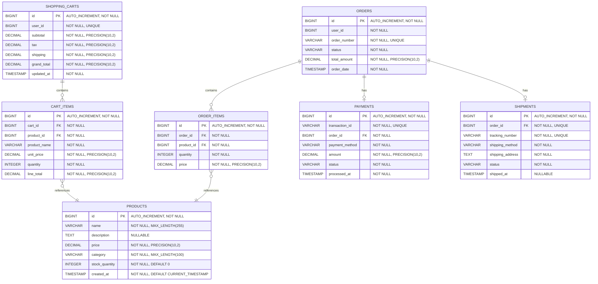

## 3. Sequence Diagrams

### 3.1 Get All Products

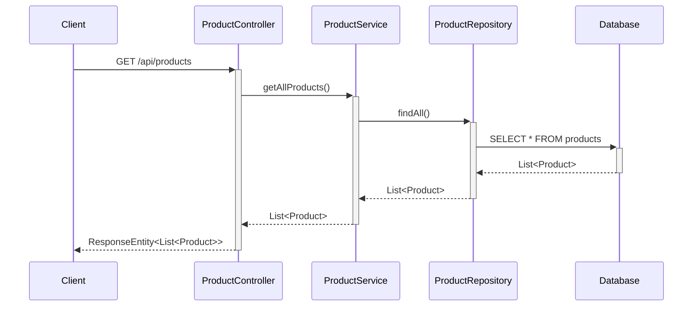

### 3.2 Get Product By ID

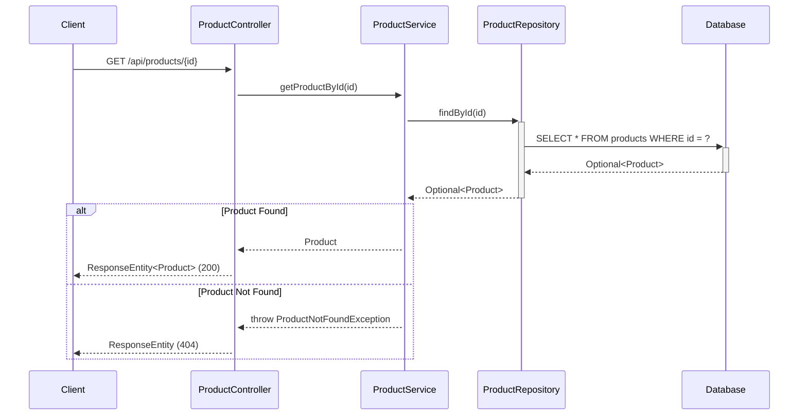

### 3.3 Create Product

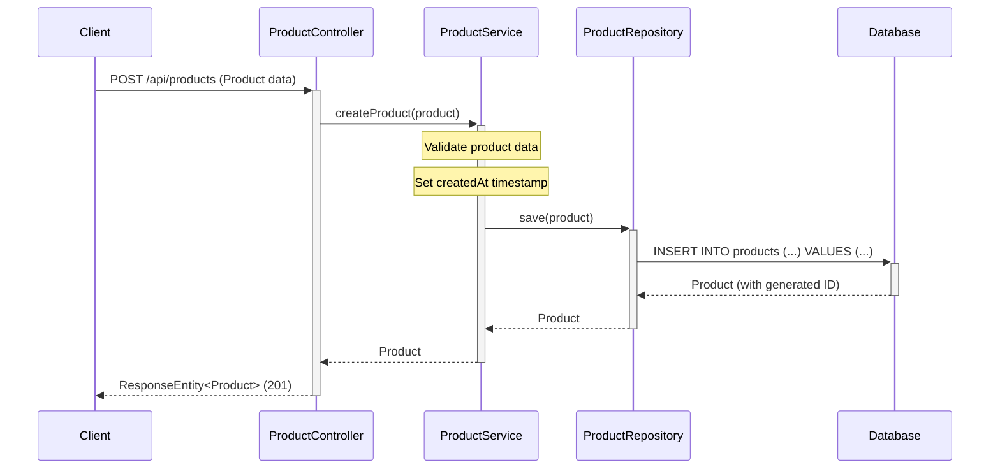

### 3.4 Update Product

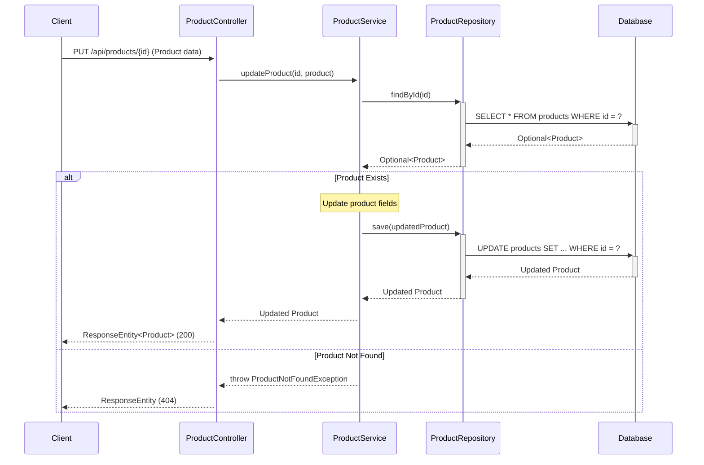

### 3.5 Delete Product

```mermaid
sequenceDiagram
    participant Client
    participant ProductController
    participant ProductService
    participant ProductRepository
    participant Database
    
    Client->>+ProductController: DELETE /api/products/{id}
    ProductController->>+ProductService: deleteProduct(id)
    
    ProductService->>+ProductRepository: findById(id)
    ProductRepository->>+Database: SELECT * FROM products WHERE id = ?
    Database-->>-ProductRepository: Optional<Product>
    ProductRepository-->>-ProductService: Optional<Product>
    
    alt Product Exists
        ProductService->>+ProductRepository: deleteById(id)
        ProductRepository->>+Database: DELETE FROM products WHERE id = ?
        Database-->>-ProductRepository: Success
        Repository-->>-ProductService: void
        ProductService-->>ProductController: void
        ProductController-->>Client: ResponseEntity (204)
    else Product Not Found
        ProductService-->>ProductController: throw ProductNotFoundException
        ProductController-->>Client: ResponseEntity (404)
    end
```

### 3.6 Get Products By Category

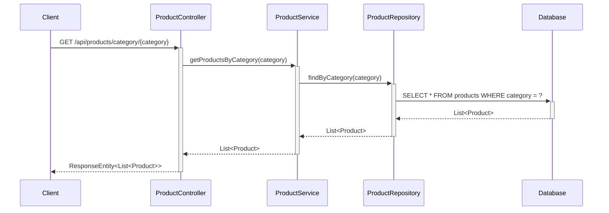

### 3.7 Search Products

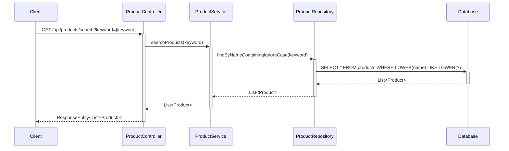

### 3.8 Add Product to Shopping Cart

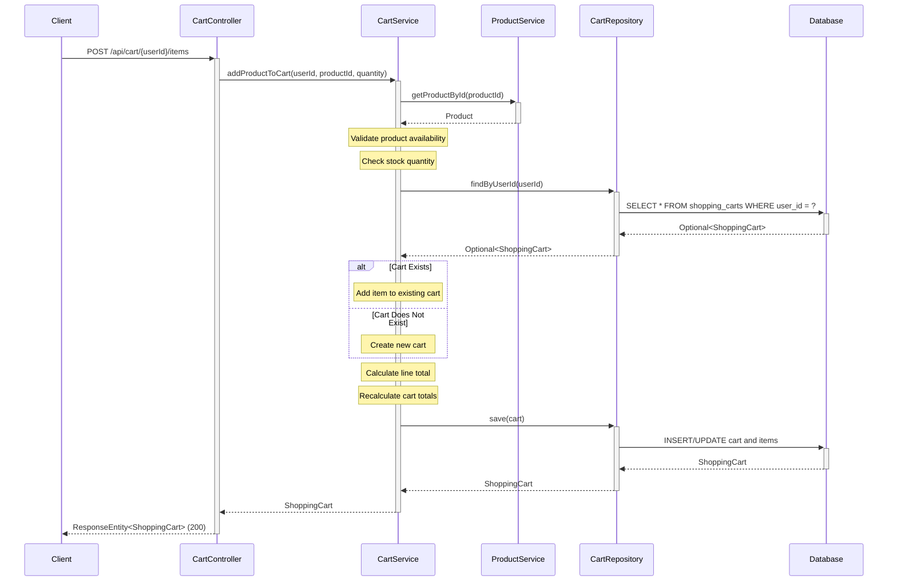

### 3.9 Update Cart Item Quantity

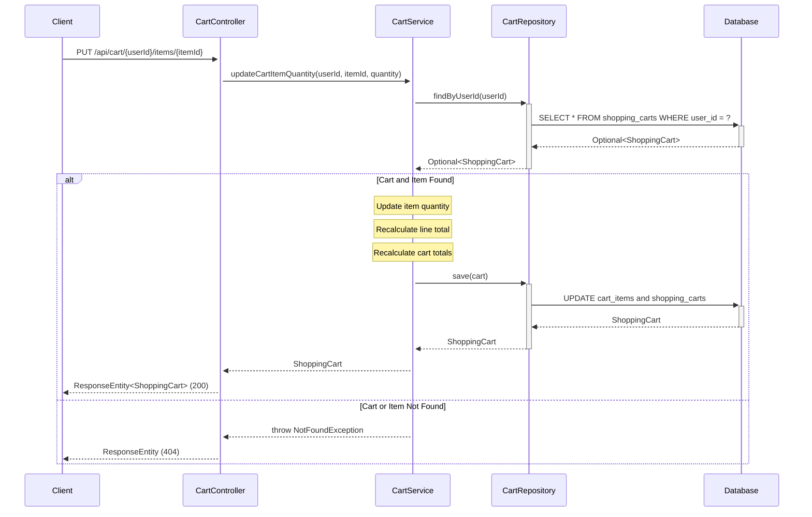

### 3.10 Remove Item from Cart

```mermaid
sequenceDiagram
    participant Client
    participant CartController
    participant CartService
    participant CartRepository
    participant Database
    
    Client->>+CartController: DELETE /api/cart/{userId}/items/{itemId}
    CartController->>+CartService: removeCartItem(userId, itemId)
    CartService->>+CartRepository: findByUserId(userId)
    CartRepository->>+Database: SELECT * FROM shopping_carts WHERE user_id = ?
    Database-->>-CartRepository: Optional<ShoppingCart>
    CartRepository-->>-CartService: Optional<ShoppingCart>
    
    alt Cart and Item Found
        Note over CartService: Remove item from cart
        Note over CartService: Recalculate cart totals
        CartService->>+CartRepository: save(cart)
        CartRepository->>+Database: DELETE FROM cart_items; UPDATE shopping_carts
        Database-->>-CartRepository: ShoppingCart
        CartRepository-->>-CartService: ShoppingCart
        CartService-->>CartController: ShoppingCart
        CartController-->>Client: ResponseEntity<ShoppingCart> (200)
    else Cart or Item Not Found
        CartService-->>CartController: throw NotFoundException
        CartController-->>Client: ResponseEntity (404)
    end
```

### 3.11 Place Order from Cart

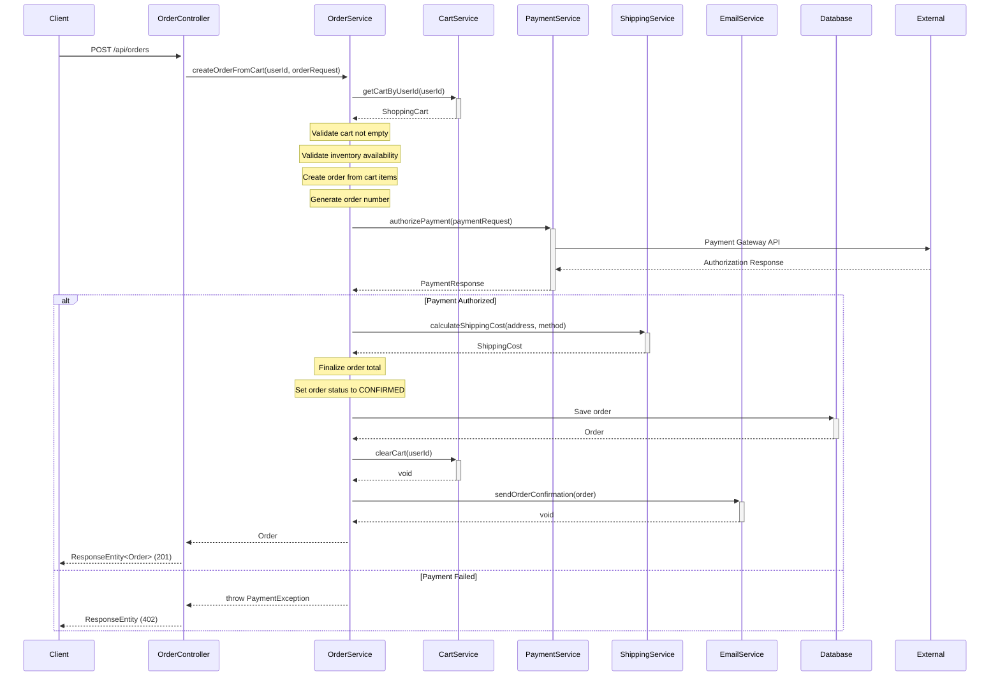

### 3.12 Process Payment

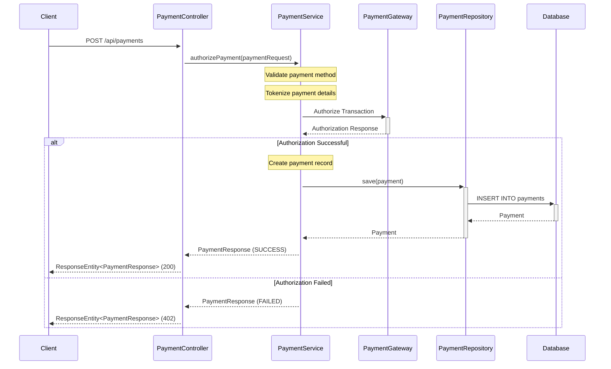

### 3.13 Create Shipment

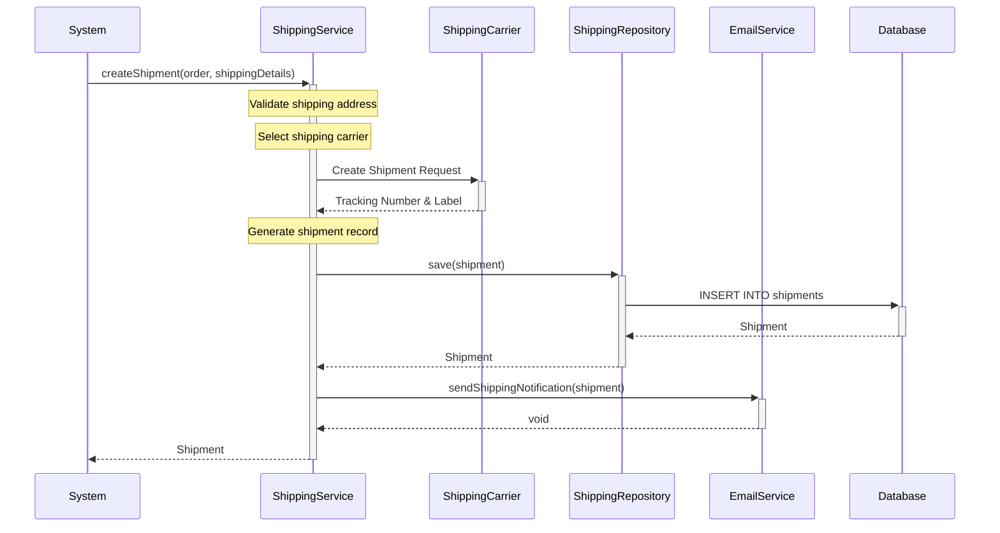

## 4. API Endpoints Summary

### Product Management APIs

| Method | Endpoint | Description | Request Body | Response |
|--------|----------|-------------|--------------|----------|
| GET | `/api/products` | Get all products | None | List<Product> |
| GET | `/api/products/{id}` | Get product by ID | None | Product |
| POST | `/api/products` | Create new product | Product | Product |
| PUT | `/api/products/{id}` | Update existing product | Product | Product |
| DELETE | `/api/products/{id}` | Delete product | None | None |
| GET | `/api/products/category/{category}` | Get products by category | None | List<Product> |
| GET | `/api/products/search?keyword={keyword}` | Search products by name | None | List<Product> |

### Shopping Cart APIs

| Method | Endpoint | Description | Request Body | Response |
|--------|----------|-------------|--------------|----------|
| GET | `/api/cart/{userId}` | Get user's shopping cart | None | ShoppingCart |
| POST | `/api/cart/{userId}/items` | Add product to cart | CartItemRequest | ShoppingCart |
| PUT | `/api/cart/{userId}/items/{itemId}` | Update cart item quantity | QuantityUpdate | ShoppingCart |
| DELETE | `/api/cart/{userId}/items/{itemId}` | Remove item from cart | None | ShoppingCart |
| DELETE | `/api/cart/{userId}` | Clear entire cart | None | None |

### Order Management APIs

| Method | Endpoint | Description | Request Body | Response |
|--------|----------|-------------|--------------|----------|
| POST | `/api/orders` | Place new order | OrderRequest | Order |
| GET | `/api/orders/{orderId}` | Get order by ID | None | Order |
| GET | `/api/orders/user/{userId}` | Get user's orders | None | List<Order> |
| PUT | `/api/orders/{orderId}/cancel` | Cancel order | None | Order |

### Payment APIs

| Method | Endpoint | Description | Request Body | Response |
|--------|----------|-------------|--------------|----------|
| POST | `/api/payments` | Process payment | PaymentRequest | PaymentResponse |
| GET | `/api/payments/{transactionId}` | Get payment status | None | PaymentStatus |
| POST | `/api/payments/{transactionId}/refund` | Refund payment | RefundRequest | RefundResponse |

### Shipping APIs

| Method | Endpoint | Description | Request Body | Response |
|--------|----------|-------------|--------------|----------|
| POST | `/api/shipping/calculate` | Calculate shipping cost | ShippingRequest | ShippingCost |
| POST | `/api/shipping/shipments` | Create shipment | ShipmentRequest | Shipment |
| GET | `/api/shipping/track/{trackingNumber}` | Track shipment | None | TrackingInfo |

## 5. Database Schema

### Products Table

```sql
CREATE TABLE products (
    id BIGINT PRIMARY KEY AUTO_INCREMENT,
    name VARCHAR(255) NOT NULL,
    description TEXT,
    price DECIMAL(10,2) NOT NULL,
    category VARCHAR(100) NOT NULL,
    stock_quantity INTEGER NOT NULL DEFAULT 0,
    created_at TIMESTAMP NOT NULL DEFAULT CURRENT_TIMESTAMP
);

CREATE INDEX idx_products_category ON products(category);
CREATE INDEX idx_products_name ON products(name);
```

### Shopping Carts Table

```sql
CREATE TABLE shopping_carts (
    id BIGINT PRIMARY KEY AUTO_INCREMENT,
    user_id BIGINT NOT NULL UNIQUE,
    subtotal DECIMAL(10,2) NOT NULL DEFAULT 0.00,
    tax DECIMAL(10,2) NOT NULL DEFAULT 0.00,
    shipping DECIMAL(10,2) NOT NULL DEFAULT 0.00,
    grand_total DECIMAL(10,2) NOT NULL DEFAULT 0.00,
    updated_at TIMESTAMP NOT NULL DEFAULT CURRENT_TIMESTAMP ON UPDATE CURRENT_TIMESTAMP
);

CREATE INDEX idx_shopping_carts_user_id ON shopping_carts(user_id);
```

### Cart Items Table

```sql
CREATE TABLE cart_items (
    id BIGINT PRIMARY KEY AUTO_INCREMENT,
    cart_id BIGINT NOT NULL,
    product_id BIGINT NOT NULL,
    product_name VARCHAR(255) NOT NULL,
    unit_price DECIMAL(10,2) NOT NULL,
    quantity INTEGER NOT NULL,
    line_total DECIMAL(10,2) NOT NULL,
    FOREIGN KEY (cart_id) REFERENCES shopping_carts(id) ON DELETE CASCADE,
    FOREIGN KEY (product_id) REFERENCES products(id)
);

CREATE INDEX idx_cart_items_cart_id ON cart_items(cart_id);
CREATE INDEX idx_cart_items_product_id ON cart_items(product_id);
```

### Orders Table

```sql
CREATE TABLE orders (
    id BIGINT PRIMARY KEY AUTO_INCREMENT,
    user_id BIGINT NOT NULL,
    order_number VARCHAR(50) NOT NULL UNIQUE,
    status VARCHAR(50) NOT NULL,
    total_amount DECIMAL(10,2) NOT NULL,
    order_date TIMESTAMP NOT NULL DEFAULT CURRENT_TIMESTAMP
);

CREATE INDEX idx_orders_user_id ON orders(user_id);
CREATE INDEX idx_orders_order_number ON orders(order_number);
CREATE INDEX idx_orders_status ON orders(status);
```

### Order Items Table

```sql
CREATE TABLE order_items (
    id BIGINT PRIMARY KEY AUTO_INCREMENT,
    order_id BIGINT NOT NULL,
    product_id BIGINT NOT NULL,
    quantity INTEGER NOT NULL,
    price DECIMAL(10,2) NOT NULL,
    FOREIGN KEY (order_id) REFERENCES orders(id) ON DELETE CASCADE,
    FOREIGN KEY (product_id) REFERENCES products(id)
);

CREATE INDEX idx_order_items_order_id ON order_items(order_id);
```

### Payments Table

```sql
CREATE TABLE payments (
    id BIGINT PRIMARY KEY AUTO_INCREMENT,
    transaction_id VARCHAR(100) NOT NULL UNIQUE,
    order_id BIGINT NOT NULL,
    payment_method VARCHAR(50) NOT NULL,
    amount DECIMAL(10,2) NOT NULL,
    status VARCHAR(50) NOT NULL,
    processed_at TIMESTAMP NOT NULL DEFAULT CURRENT_TIMESTAMP,
    FOREIGN KEY (order_id) REFERENCES orders(id)
);

CREATE INDEX idx_payments_transaction_id ON payments(transaction_id);
CREATE INDEX idx_payments_order_id ON payments(order_id);
```

### Shipments Table

```sql
CREATE TABLE shipments (
    id BIGINT PRIMARY KEY AUTO_INCREMENT,
    order_id BIGINT NOT NULL UNIQUE,
    tracking_number VARCHAR(100) NOT NULL UNIQUE,
    shipping_method VARCHAR(50) NOT NULL,
    shipping_address TEXT NOT NULL,
    status VARCHAR(50) NOT NULL,
    shipped_at TIMESTAMP NULL,
    FOREIGN KEY (order_id) REFERENCES orders(id)
);

CREATE INDEX idx_shipments_tracking_number ON shipments(tracking_number);
CREATE INDEX idx_shipments_order_id ON shipments(order_id);
```

## 6. Technology Stack

- **Backend Framework:** Spring Boot 3.x
- **Language:** Java 21
- **Database:** PostgreSQL
- **ORM:** Spring Data JPA / Hibernate
- **Build Tool:** Maven/Gradle
- **API Documentation:** Swagger/OpenAPI 3
- **Payment Gateway:** Stripe/PayPal SDK
- **Shipping Integration:** ShipStation/EasyPost API
- **Email Service:** SendGrid/AWS SES
- **Message Queue:** RabbitMQ/Apache Kafka (for async notifications)

## 7. Design Patterns Used

1. **MVC Pattern:** Separation of Controller, Service, and Repository layers
2. **Repository Pattern:** Data access abstraction through ProductRepository
3. **Dependency Injection:** Spring's IoC container manages dependencies
4. **DTO Pattern:** Data Transfer Objects for API requests/responses
5. **Exception Handling:** Custom exceptions for business logic errors
6. **Observer Pattern:** Email notification service observes order, payment, and shipping events
7. **Strategy Pattern:** Multiple payment methods and shipping carriers
8. **Factory Pattern:** Order creation from shopping cart
9. **Facade Pattern:** OrderService coordinates multiple services (cart, payment, shipping)

## 8. Key Features

- RESTful API design following HTTP standards
- Proper HTTP status codes for different scenarios
- Input validation and error handling
- Database indexing for performance optimization
- Transactional operations for data consistency
- Pagination support for large datasets (can be extended)
- Search functionality with case-insensitive matching
- Shopping cart management with real-time total calculation
- Order placement workflow with cart-to-order conversion
- Payment processing with multiple payment methods
- Shipping integration with carrier APIs
- Automated email notifications for order lifecycle events
- Inventory validation during cart and order operations
- PCI DSS compliant payment handling with tokenization

## 9. Business Logic Details

### 9.1 Shopping Cart Management

**Add Products to Cart:**
- Validates product existence and availability
- Checks stock quantity before adding
- Creates new cart if user doesn't have one
- Adds item to existing cart or updates quantity if item already exists
- Calculates line total (unit price × quantity)
- Recalculates cart totals (subtotal, tax, shipping, grand total)

**Update Cart Item Quantity:**
- Validates cart and item existence
- Checks stock availability for new quantity
- Updates item quantity and line total
- Recalculates all cart totals
- Removes item if quantity is set to 0

**Remove Items from Cart:**
- Validates cart and item existence
- Removes specified item from cart
- Recalculates cart totals
- Handles empty cart state appropriately

**Cart Total Recalculation:**
- Subtotal: Sum of all line totals
- Tax: Calculated based on subtotal and tax rate (configurable)
- Shipping: Based on shipping method and destination
- Grand Total: Subtotal + Tax + Shipping

**Empty Cart Handling:**
- Returns appropriate message when cart is empty
- Prevents order placement from empty cart
- Maintains cart structure for future additions

**Cart Persistence:**
- Cart data persisted in database
- Associated with user ID
- Survives user sessions
- Can be retrieved across devices

### 9.2 Order Management

**Order Placement Workflow:**
1. Retrieve user's shopping cart
2. Validate cart is not empty
3. Validate inventory availability for all items
4. Authorize payment
5. Calculate shipping cost
6. Create order from cart items
7. Generate unique order number
8. Set order status to CONFIRMED
9. Clear shopping cart
10. Send order confirmation email

**Order Data Model:**
- Order header: order number, user ID, status, total amount, order date
- Order items: product details, quantity, price at time of order
- Maintains historical pricing (not affected by future product price changes)

**Order Validation Logic:**
- **Inventory Check:** Verifies all products are in stock with sufficient quantity
- **Pricing Validation:** Ensures prices haven't changed since cart creation
- **Customer Eligibility:** Validates user account status and payment method
- **Address Validation:** Confirms shipping address is complete and valid

### 9.3 Payment Processing

**Payment Gateway Integration:**
- Integration with external payment service provider (Stripe/PayPal)
- Secure API communication using HTTPS
- Webhook handling for asynchronous payment updates

**Payment Method Management:**
- **Credit Card:** Visa, MasterCard, American Express, Discover
- **Debit Card:** Bank debit cards with PIN or signature
- **Digital Wallets:** Apple Pay, Google Pay, PayPal
- Tokenization of payment details for security
- Support for saved payment methods

**Payment Transaction Handling:**
- **Authorization:** Reserve funds on customer's payment method
- **Capture:** Actually charge the authorized amount
- **Refund:** Return funds to customer for cancelled/returned orders
- **Payment Status Tracking:** PENDING, AUTHORIZED, CAPTURED, FAILED, REFUNDED

**Payment Security and PCI Compliance:**
- No storage of raw credit card numbers
- Payment tokenization through gateway
- PCI DSS Level 1 compliant infrastructure
- Encrypted transmission of payment data
- Fraud detection and prevention measures
- 3D Secure authentication support

### 9.4 Shipping Integration

**Shipping Carrier Integration:**
- Integration with shipping providers (UPS, FedEx, USPS, DHL)
- Real-time rate calculation API calls
- Shipping label generation
- Tracking number retrieval

**Shipping Address Management:**
- Address validation using carrier APIs
- Standardization of address format
- Support for residential and commercial addresses
- International shipping address support

**Shipping Method Selection:**
- **Standard Shipping:** 5-7 business days
- **Express Shipping:** 2-3 business days
- **Overnight Shipping:** Next business day
- Real-time availability based on destination

**Shipping Cost Calculation:**
- Based on destination address
- Package weight and dimensions
- Selected shipping method
- Real-time rates from carrier APIs
- Handling fees and insurance (if applicable)

### 9.5 Email Notifications

**Email Notification System:**
- Integration with email service provider (SendGrid/AWS SES)
- HTML email templates with branding
- Personalization with customer and order data
- Retry logic for failed deliveries

**Order Confirmation Emails:**
- Sent immediately after successful order placement
- Contains order number, items, quantities, prices
- Total amount charged
- Estimated delivery date
- Shipping address
- Payment method (last 4 digits)

**Shipping Notification Emails:**
- Sent when order is shipped
- Contains tracking number
- Link to carrier tracking page
- Estimated delivery date
- Shipped items list

**Payment Notification Emails:**
- Payment confirmation receipt
- Transaction ID
- Amount charged
- Payment method used
- Date and time of transaction
- Refund confirmations (if applicable)

## 10. Integration Points

### 10.1 Product-Cart Integration
- Cart validates product availability through ProductService
- Real-time inventory checks before adding to cart
- Product pricing synchronized with cart items
- Product details (name, price) cached in cart items for performance

### 10.2 Cart-Order Integration
- Order creation triggered from cart
- Cart items converted to order items
- Cart cleared after successful order placement
- Cart totals transferred to order total

### 10.3 Order-Payment Integration
- Payment authorization required before order confirmation
- Payment transaction linked to order ID
- Order status updated based on payment status
- Failed payments prevent order creation

### 10.4 Order-Shipping Integration
- Shipping created automatically for confirmed orders
- Shipping cost calculated during order placement
- Tracking information linked to order
- Shipping status updates reflected in order status

### 10.5 Event-Driven Notifications
- Order events trigger email notifications
- Payment events trigger receipt emails
- Shipping events trigger tracking emails
- Asynchronous processing using message queue

## 11. Error Handling and Validation

### 11.1 Product Validation
- Product name required and non-empty
- Price must be positive
- Stock quantity must be non-negative
- Category must be valid

### 11.2 Cart Validation
- Product must exist and be available
- Quantity must be positive
- Sufficient stock must be available
- Cart must belong to requesting user

### 11.3 Order Validation
- Cart must not be empty
- All items must be in stock
- Payment method must be valid
- Shipping address must be complete

### 11.4 Payment Validation
- Payment amount must match order total
- Payment method must be authorized
- Transaction must be successful
- Duplicate transactions prevented

### 11.5 Shipping Validation
- Shipping address must be valid
- Shipping method must be available for destination
- Package weight and dimensions within carrier limits

## 12. Security Considerations

- **Authentication:** JWT-based authentication for API access
- **Authorization:** Role-based access control (RBAC)
- **Data Encryption:** TLS/SSL for data in transit
- **Payment Security:** PCI DSS compliance, tokenization
- **Input Validation:** Prevent SQL injection and XSS attacks
- **Rate Limiting:** Prevent abuse and DDoS attacks
- **Audit Logging:** Track all critical operations

## 13. Performance Optimization

- **Database Indexing:** Indexes on frequently queried columns
- **Caching:** Redis cache for product catalog and cart data
- **Connection Pooling:** Efficient database connection management
- **Async Processing:** Message queue for email notifications
- **Pagination:** Limit result sets for large data queries
- **Query Optimization:** Efficient JPA queries with proper joins

## 14. Monitoring and Observability

- **Application Metrics:** Response times, error rates, throughput
- **Business Metrics:** Orders placed, revenue, cart abandonment rate
- **Infrastructure Metrics:** CPU, memory, database connections
- **Logging:** Structured logging with correlation IDs
- **Alerting:** Automated alerts for critical failures
- **Distributed Tracing:** Request flow across services