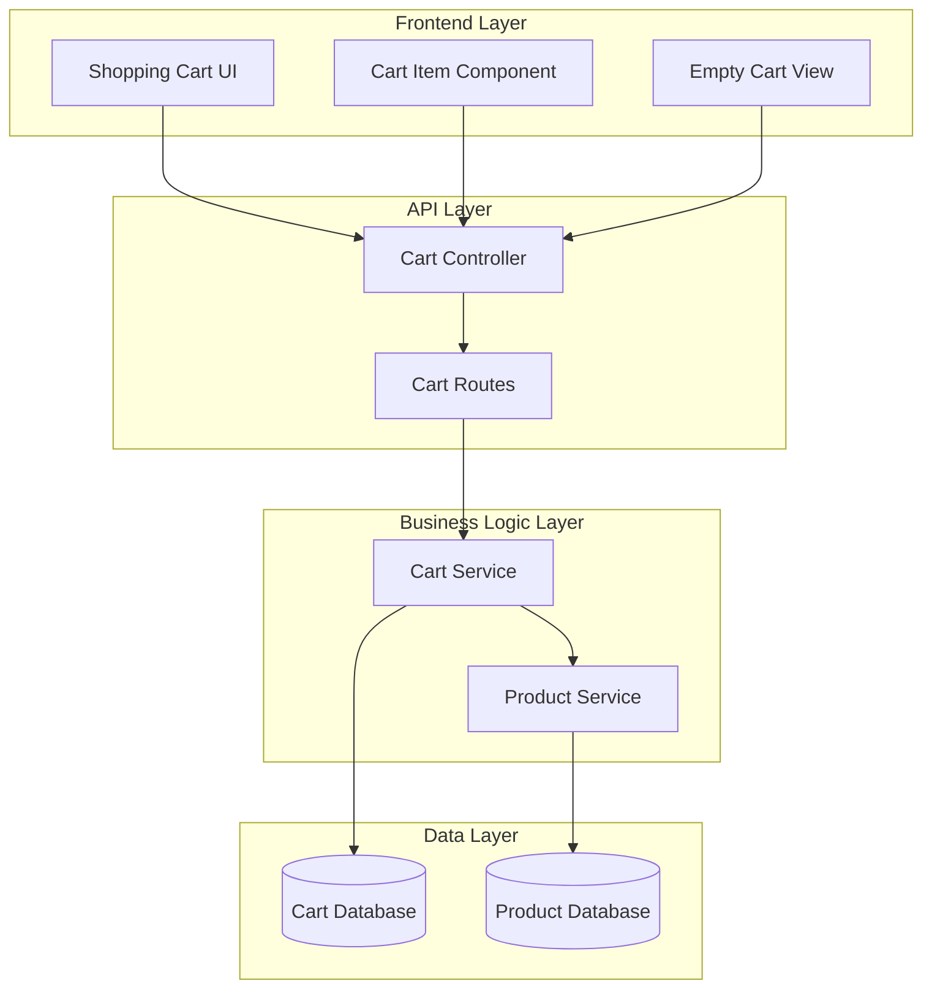
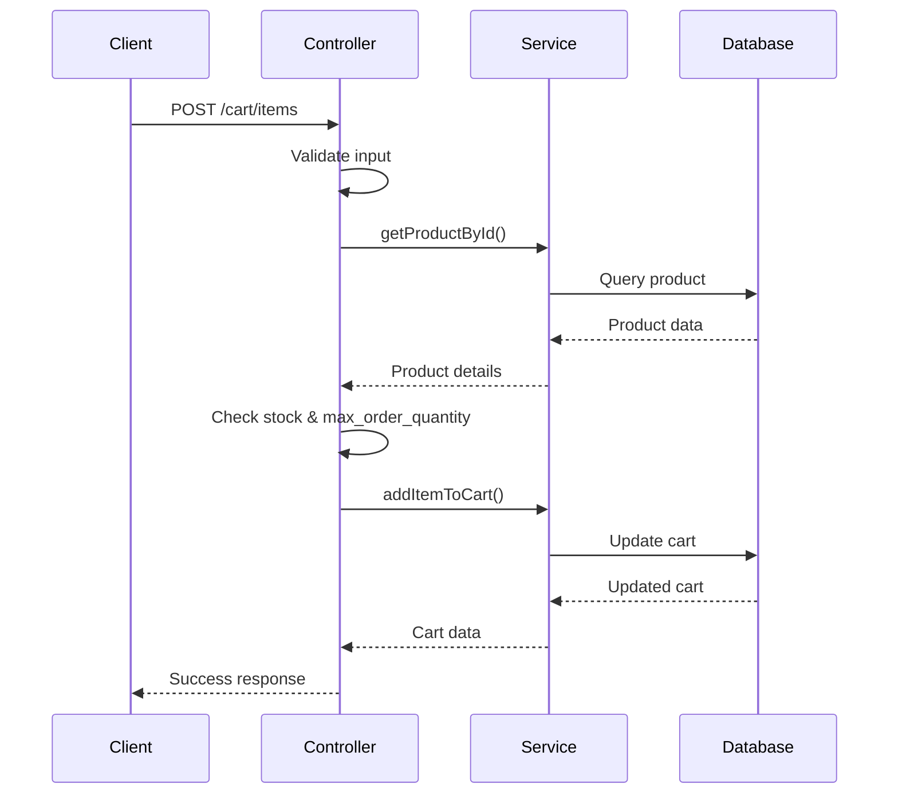
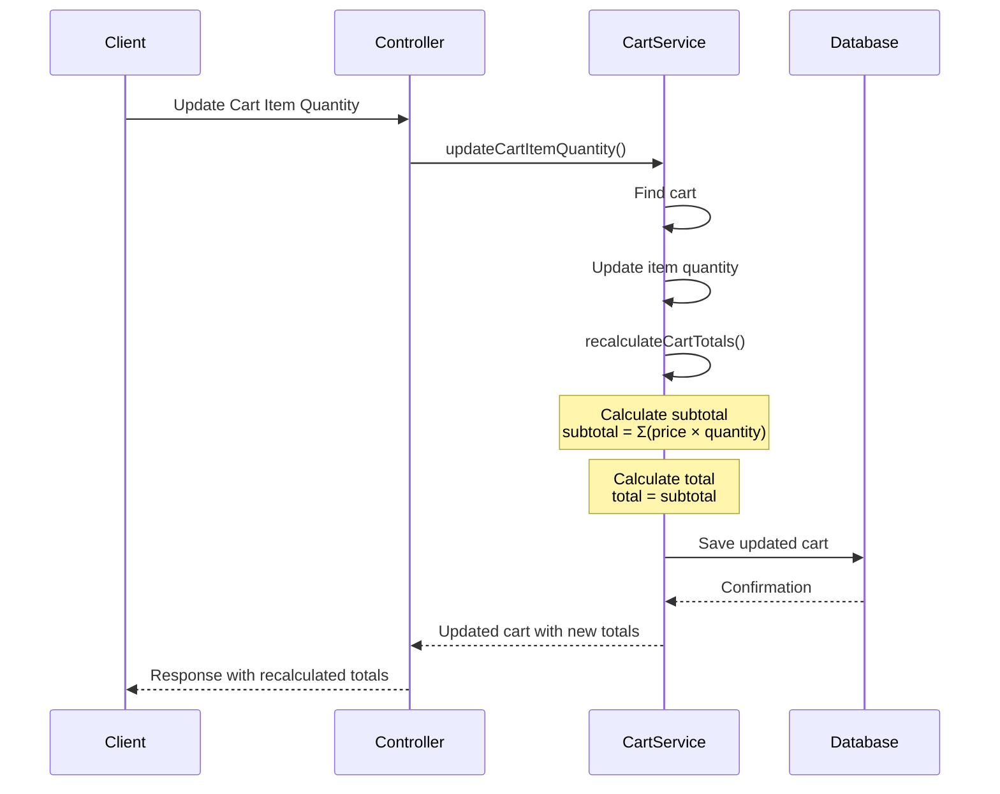
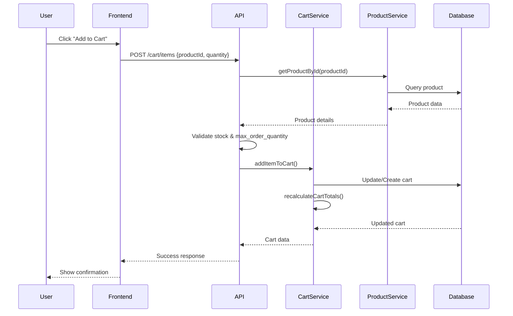
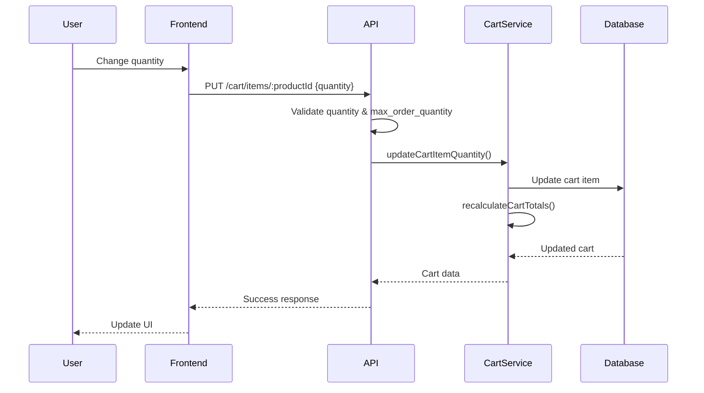
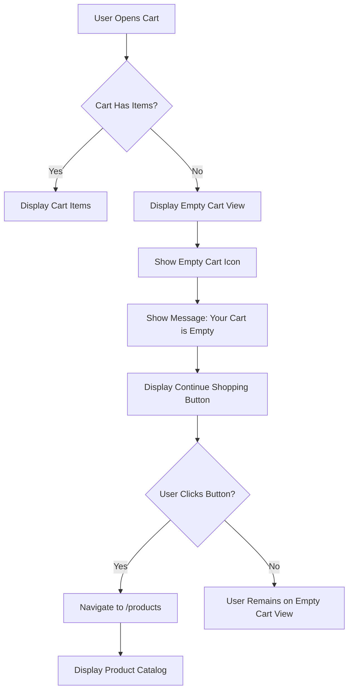
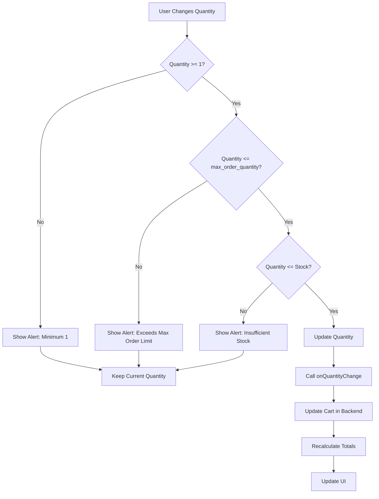
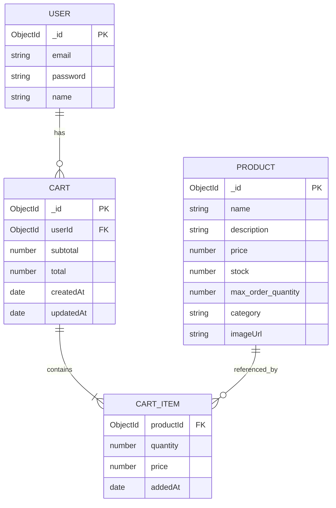
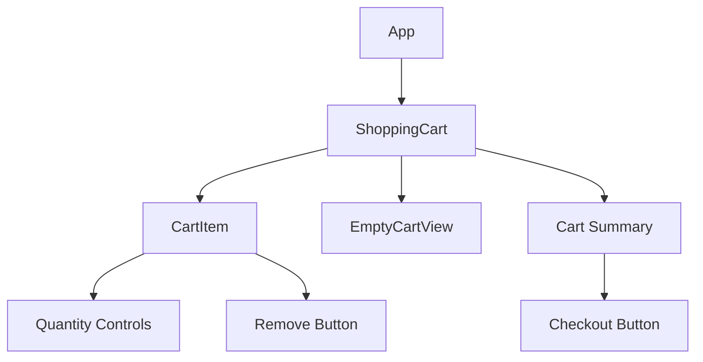

# Low Level Design Document - Shopping Cart Feature

## 1. Introduction

### 1.1 Purpose
This Low Level Design (LLD) document provides detailed technical specifications for implementing the Shopping Cart feature in the e-commerce application. It describes the component-level design, data structures, algorithms, and interactions required to build a fully functional shopping cart system.

### 1.2 Scope
This document covers:
- Backend API endpoints and business logic
- Frontend components and user interactions
- Data models and database schema
- Integration points with existing systems
- Validation rules and error handling
- UI/UX specifications

### 1.3 Definitions and Acronyms
- **LLD**: Low Level Design
- **API**: Application Programming Interface
- **REST**: Representational State Transfer
- **JWT**: JSON Web Token
- **UI**: User Interface
- **UX**: User Experience

## 2. System Architecture Overview

### 2.1 High-Level Architecture



### 2.2 Technology Stack
- **Backend**: Node.js with Express.js
- **Frontend**: React.js
- **Database**: MongoDB
- **Authentication**: JWT
- **API Style**: RESTful

## 3. Detailed Component Design

### 3.1 Backend Components

#### 3.1.1 Data Models

##### Cart Model
```javascript
const cartSchema = new mongoose.Schema({
  userId: {
    type: mongoose.Schema.Types.ObjectId,
    ref: 'User',
    required: true,
    unique: true
  },
  items: [{
    productId: {
      type: mongoose.Schema.Types.ObjectId,
      ref: 'Product',
      required: true
    },
    quantity: {
      type: Number,
      required: true,
      min: 1
    },
    price: {
      type: Number,
      required: true
    },
    addedAt: {
      type: Date,
      default: Date.now
    }
  }],
  subtotal: {
    type: Number,
    default: 0
  },
  total: {
    type: Number,
    default: 0
  },
  createdAt: {
    type: Date,
    default: Date.now
  },
  updatedAt: {
    type: Date,
    default: Date.now
  }
});

cartSchema.index({ userId: 1 });
```

##### Product Model (Reference)
```javascript
const productSchema = new mongoose.Schema({
  name: String,
  description: String,
  price: Number,
  stock: Number,
  max_order_quantity: {
    type: Number,
    required: true,
    default: 10
  },
  category: String,
  imageUrl: String
});
```

#### 3.1.2 API Endpoints

##### Cart Routes
```javascript
const express = require('express');
const router = express.Router();
const cartController = require('../controllers/cartController');
const authMiddleware = require('../middleware/auth');

// Get user's cart
router.get('/cart', authMiddleware, cartController.getCart);

// Add item to cart
router.post('/cart/items', authMiddleware, cartController.addItemToCart);

// Update cart item quantity
router.put('/cart/items/:productId', authMiddleware, cartController.updateCartItem);

// Remove item from cart
router.delete('/cart/items/:productId', authMiddleware, cartController.removeCartItem);

// Clear entire cart
router.delete('/cart', authMiddleware, cartController.clearCart);

module.exports = router;
```

#### 3.1.3 Shopping Cart Controller

```javascript
const cartService = require('../services/cartService');
const productService = require('../services/productService');

class CartController {
  /**
   * Get user's shopping cart
   */
  async getCart(req, res) {
    try {
      const userId = req.user.id;
      const cart = await cartService.getCartByUserId(userId);
      
      if (!cart) {
        return res.status(200).json({
          success: true,
          data: {
            items: [],
            subtotal: 0,
            total: 0
          }
        });
      }
      
      return res.status(200).json({
        success: true,
        data: cart
      });
    } catch (error) {
      return res.status(500).json({
        success: false,
        message: 'Error retrieving cart',
        error: error.message
      });
    }
  }

  /**
   * Add item to cart
   */
  async addItemToCart(req, res) {
    try {
      const userId = req.user.id;
      const { productId, quantity } = req.body;

      // Validate input
      if (!productId || !quantity || quantity < 1) {
        return res.status(400).json({
          success: false,
          message: 'Invalid product ID or quantity'
        });
      }

      // Check product exists and has sufficient stock
      const product = await productService.getProductById(productId);
      if (!product) {
        return res.status(404).json({
          success: false,
          message: 'Product not found'
        });
      }

      if (product.stock < quantity) {
        return res.status(400).json({
          success: false,
          message: 'Insufficient stock available'
        });
      }

      // Check max_order_quantity constraint
      if (quantity > product.max_order_quantity) {
        return res.status(400).json({
          success: false,
          message: `Quantity exceeds maximum order limit of ${product.max_order_quantity}`
        });
      }

      // Add item to cart
      const cart = await cartService.addItemToCart(userId, productId, quantity, product.price);
      
      return res.status(200).json({
        success: true,
        message: 'Item added to cart successfully',
        data: cart
      });
    } catch (error) {
      return res.status(500).json({
        success: false,
        message: 'Error adding item to cart',
        error: error.message
      });
    }
  }

  /**
   * Update cart item quantity
   * MODIFIED: Added max_order_quantity validation
   */
  async updateCartItem(req, res) {
    try {
      const userId = req.user.id;
      const { productId } = req.params;
      const { quantity } = req.body;

      // Validate input
      if (!quantity || quantity < 1) {
        return res.status(400).json({
          success: false,
          message: 'Invalid quantity'
        });
      }

      // Check product exists
      const product = await productService.getProductById(productId);
      if (!product) {
        return res.status(404).json({
          success: false,
          message: 'Product not found'
        });
      }

      // Validate against max_order_quantity
      if (quantity > product.max_order_quantity) {
        return res.status(400).json({
          success: false,
          message: `Quantity exceeds maximum order limit of ${product.max_order_quantity}`,
          max_order_quantity: product.max_order_quantity
        });
      }

      // Check stock availability
      if (product.stock < quantity) {
        return res.status(400).json({
          success: false,
          message: 'Insufficient stock available'
        });
      }

      // Update cart item
      const cart = await cartService.updateCartItemQuantity(userId, productId, quantity);
      
      if (!cart) {
        return res.status(404).json({
          success: false,
          message: 'Cart or item not found'
        });
      }

      return res.status(200).json({
        success: true,
        message: 'Cart item updated successfully',
        data: cart
      });
    } catch (error) {
      return res.status(500).json({
        success: false,
        message: 'Error updating cart item',
        error: error.message
      });
    }
  }

  /**
   * Remove item from cart
   */
  async removeCartItem(req, res) {
    try {
      const userId = req.user.id;
      const { productId } = req.params;

      const cart = await cartService.removeItemFromCart(userId, productId);
      
      if (!cart) {
        return res.status(404).json({
          success: false,
          message: 'Cart or item not found'
        });
      }

      return res.status(200).json({
        success: true,
        message: 'Item removed from cart successfully',
        data: cart
      });
    } catch (error) {
      return res.status(500).json({
        success: false,
        message: 'Error removing item from cart',
        error: error.message
      });
    }
  }

  /**
   * Clear entire cart
   */
  async clearCart(req, res) {
    try {
      const userId = req.user.id;
      await cartService.clearCart(userId);
      
      return res.status(200).json({
        success: true,
        message: 'Cart cleared successfully'
      });
    } catch (error) {
      return res.status(500).json({
        success: false,
        message: 'Error clearing cart',
        error: error.message
      });
    }
  }
}

module.exports = new CartController();
```

##### Controller Flow Diagram


### 3.2 Business Logic Layer

#### 3.2.1 Cart Service - Core Methods

```javascript
const Cart = require('../models/Cart');
const Product = require('../models/Product');

class CartService {
  /**
   * Get cart by user ID
   */
  async getCartByUserId(userId) {
    try {
      const cart = await Cart.findOne({ userId })
        .populate('items.productId', 'name price imageUrl stock max_order_quantity');
      return cart;
    } catch (error) {
      throw new Error(`Error fetching cart: ${error.message}`);
    }
  }

  /**
   * Add item to cart
   */
  async addItemToCart(userId, productId, quantity, price) {
    try {
      let cart = await Cart.findOne({ userId });

      if (!cart) {
        // Create new cart
        cart = new Cart({
          userId,
          items: [{ productId, quantity, price }]
        });
      } else {
        // Check if item already exists
        const itemIndex = cart.items.findIndex(
          item => item.productId.toString() === productId
        );

        if (itemIndex > -1) {
          // Update existing item quantity
          cart.items[itemIndex].quantity += quantity;
        } else {
          // Add new item
          cart.items.push({ productId, quantity, price });
        }
      }

      // Recalculate totals
      await this.recalculateCartTotals(cart);
      
      cart.updatedAt = Date.now();
      await cart.save();
      
      return await this.getCartByUserId(userId);
    } catch (error) {
      throw new Error(`Error adding item to cart: ${error.message}`);
    }
  }

  /**
   * Update cart item quantity
   */
  async updateCartItemQuantity(userId, productId, quantity) {
    try {
      const cart = await Cart.findOne({ userId });
      
      if (!cart) {
        return null;
      }

      const itemIndex = cart.items.findIndex(
        item => item.productId.toString() === productId
      );

      if (itemIndex === -1) {
        return null;
      }

      cart.items[itemIndex].quantity = quantity;
      
      // Recalculate totals
      await this.recalculateCartTotals(cart);
      
      cart.updatedAt = Date.now();
      await cart.save();
      
      return await this.getCartByUserId(userId);
    } catch (error) {
      throw new Error(`Error updating cart item: ${error.message}`);
    }
  }

  /**
   * Remove item from cart
   */
  async removeItemFromCart(userId, productId) {
    try {
      const cart = await Cart.findOne({ userId });
      
      if (!cart) {
        return null;
      }

      cart.items = cart.items.filter(
        item => item.productId.toString() !== productId
      );

      // Recalculate totals
      await this.recalculateCartTotals(cart);
      
      cart.updatedAt = Date.now();
      await cart.save();
      
      return await this.getCartByUserId(userId);
    } catch (error) {
      throw new Error(`Error removing item from cart: ${error.message}`);
    }
  }

  /**
   * Clear entire cart
   */
  async clearCart(userId) {
    try {
      await Cart.findOneAndUpdate(
        { userId },
        { 
          items: [], 
          subtotal: 0, 
          total: 0,
          updatedAt: Date.now()
        }
      );
    } catch (error) {
      throw new Error(`Error clearing cart: ${error.message}`);
    }
  }
}

module.exports = new CartService();
```

#### 3.2.2 Product Service Integration

```javascript
const Product = require('../models/Product');

class ProductService {
  /**
   * Get product by ID
   */
  async getProductById(productId) {
    try {
      const product = await Product.findById(productId);
      return product;
    } catch (error) {
      throw new Error(`Error fetching product: ${error.message}`);
    }
  }

  /**
   * Check product stock availability
   */
  async checkStockAvailability(productId, requestedQuantity) {
    try {
      const product = await Product.findById(productId);
      
      if (!product) {
        return { available: false, reason: 'Product not found' };
      }

      if (product.stock < requestedQuantity) {
        return { 
          available: false, 
          reason: 'Insufficient stock',
          availableStock: product.stock
        };
      }

      return { available: true };
    } catch (error) {
      throw new Error(`Error checking stock: ${error.message}`);
    }
  }
}

module.exports = new ProductService();
```

#### 3.2.3 Shopping Cart Service - Automatic Recalculation Logic

**NEW SECTION: Automatic Recalculation of Cart Totals**

This section implements the business rule requiring automatic recalculation of subtotal and total upon any quantity mutation in the shopping cart.

##### Recalculation Method

```javascript
/**
 * Recalculate cart totals (subtotal and total)
 * This method is called automatically after any cart mutation:
 * - Adding items
 * - Updating item quantities
 * - Removing items
 */
async recalculateCartTotals(cart) {
  try {
    let subtotal = 0;
    
    // Calculate subtotal by summing (price * quantity) for all items
    for (const item of cart.items) {
      subtotal += item.price * item.quantity;
    }
    
    // Set subtotal
    cart.subtotal = subtotal;
    
    // Calculate total (currently same as subtotal, can be extended for taxes/discounts)
    cart.total = subtotal;
    
    return cart;
  } catch (error) {
    throw new Error(`Error recalculating cart totals: ${error.message}`);
  }
}
```

##### Enhanced Cart Service Methods with Recalculation

The following methods have been enhanced to automatically trigger recalculation:

```javascript
/**
 * Add item to cart (Enhanced with recalculation)
 */
async addItemToCart(userId, productId, quantity, price) {
  try {
    let cart = await Cart.findOne({ userId });

    if (!cart) {
      cart = new Cart({
        userId,
        items: [{ productId, quantity, price }]
      });
    } else {
      const itemIndex = cart.items.findIndex(
        item => item.productId.toString() === productId
      );

      if (itemIndex > -1) {
        cart.items[itemIndex].quantity += quantity;
      } else {
        cart.items.push({ productId, quantity, price });
      }
    }

    // AUTOMATIC RECALCULATION
    await this.recalculateCartTotals(cart);
    
    cart.updatedAt = Date.now();
    await cart.save();
    
    return await this.getCartByUserId(userId);
  } catch (error) {
    throw new Error(`Error adding item to cart: ${error.message}`);
  }
}

/**
 * Update cart item quantity (Enhanced with recalculation)
 */
async updateCartItemQuantity(userId, productId, quantity) {
  try {
    const cart = await Cart.findOne({ userId });
    
    if (!cart) {
      return null;
    }

    const itemIndex = cart.items.findIndex(
      item => item.productId.toString() === productId
    );

    if (itemIndex === -1) {
      return null;
    }

    cart.items[itemIndex].quantity = quantity;
    
    // AUTOMATIC RECALCULATION
    await this.recalculateCartTotals(cart);
    
    cart.updatedAt = Date.now();
    await cart.save();
    
    return await this.getCartByUserId(userId);
  } catch (error) {
    throw new Error(`Error updating cart item: ${error.message}`);
  }
}

/**
 * Remove item from cart (Enhanced with recalculation)
 */
async removeItemFromCart(userId, productId) {
  try {
    const cart = await Cart.findOne({ userId });
    
    if (!cart) {
      return null;
    }

    cart.items = cart.items.filter(
      item => item.productId.toString() !== productId
    );

    // AUTOMATIC RECALCULATION
    await this.recalculateCartTotals(cart);
    
    cart.updatedAt = Date.now();
    await cart.save();
    
    return await this.getCartByUserId(userId);
  } catch (error) {
    throw new Error(`Error removing item from cart: ${error.message}`);
  }
}
```

##### Recalculation Flow Diagram



##### Recalculation Business Rules

1. **Trigger Events**: Recalculation occurs automatically on:
   - Adding new items to cart
   - Updating item quantities
   - Removing items from cart

2. **Calculation Formula**:
   - `subtotal = Σ(item.price × item.quantity)` for all items
   - `total = subtotal` (can be extended for taxes, shipping, discounts)

3. **Atomicity**: Recalculation is performed within the same transaction as the cart mutation

4. **Consistency**: All cart operations guarantee that totals are always synchronized with item quantities

### 3.3 Data Flow

#### 3.3.1 Add Item to Cart Flow



#### 3.3.2 Update Cart Item Flow



### 3.4 Frontend Components

#### 3.4.1 Shopping Cart Component

```javascript
import React, { useState, useEffect } from 'react';
import axios from 'axios';
import CartItem from './CartItem';
import EmptyCartView from './EmptyCartView';
import './ShoppingCart.css';

const ShoppingCart = () => {
  const [cart, setCart] = useState(null);
  const [loading, setLoading] = useState(true);
  const [error, setError] = useState(null);

  useEffect(() => {
    fetchCart();
  }, []);

  const fetchCart = async () => {
    try {
      setLoading(true);
      const response = await axios.get('/api/cart', {
        headers: {
          Authorization: `Bearer ${localStorage.getItem('token')}`
        }
      });
      setCart(response.data.data);
      setError(null);
    } catch (err) {
      setError('Failed to load cart');
      console.error(err);
    } finally {
      setLoading(false);
    }
  };

  const handleQuantityChange = async (productId, newQuantity) => {
    try {
      const response = await axios.put(
        `/api/cart/items/${productId}`,
        { quantity: newQuantity },
        {
          headers: {
            Authorization: `Bearer ${localStorage.getItem('token')}`
          }
        }
      );
      setCart(response.data.data);
    } catch (err) {
      if (err.response?.data?.message) {
        alert(err.response.data.message);
      } else {
        alert('Failed to update quantity');
      }
      console.error(err);
    }
  };

  const handleRemoveItem = async (productId) => {
    try {
      const response = await axios.delete(`/api/cart/items/${productId}`, {
        headers: {
          Authorization: `Bearer ${localStorage.getItem('token')}`
        }
      });
      setCart(response.data.data);
    } catch (err) {
      alert('Failed to remove item');
      console.error(err);
    }
  };

  const handleClearCart = async () => {
    if (window.confirm('Are you sure you want to clear your cart?')) {
      try {
        await axios.delete('/api/cart', {
          headers: {
            Authorization: `Bearer ${localStorage.getItem('token')}`
          }
        });
        fetchCart();
      } catch (err) {
        alert('Failed to clear cart');
        console.error(err);
      }
    }
  };

  if (loading) {
    return <div className="cart-loading">Loading cart...</div>;
  }

  if (error) {
    return <div className="cart-error">{error}</div>;
  }

  if (!cart || cart.items.length === 0) {
    return <EmptyCartView />;
  }

  return (
    <div className="shopping-cart">
      <div className="cart-header">
        <h2>Shopping Cart</h2>
        <button onClick={handleClearCart} className="clear-cart-btn">
          Clear Cart
        </button>
      </div>

      <div className="cart-items">
        {cart.items.map((item) => (
          <CartItem
            key={item.productId._id}
            item={item}
            onQuantityChange={handleQuantityChange}
            onRemove={handleRemoveItem}
          />
        ))}
      </div>

      <div className="cart-summary">
        <div className="summary-row">
          <span>Subtotal:</span>
          <span className="amount">${cart.subtotal.toFixed(2)}</span>
        </div>
        <div className="summary-row total">
          <span>Total:</span>
          <span className="amount">${cart.total.toFixed(2)}</span>
        </div>
        <button className="checkout-btn">Proceed to Checkout</button>
      </div>
    </div>
  );
};

export default ShoppingCart;
```

#### 3.4.2 Shopping Cart CSS

```css
.shopping-cart {
  max-width: 1200px;
  margin: 0 auto;
  padding: 20px;
}

.cart-header {
  display: flex;
  justify-content: space-between;
  align-items: center;
  margin-bottom: 20px;
  padding-bottom: 10px;
  border-bottom: 2px solid #e0e0e0;
}

.cart-header h2 {
  margin: 0;
  font-size: 28px;
  color: #333;
}

.clear-cart-btn {
  padding: 8px 16px;
  background-color: #f44336;
  color: white;
  border: none;
  border-radius: 4px;
  cursor: pointer;
  font-size: 14px;
}

.clear-cart-btn:hover {
  background-color: #d32f2f;
}

.cart-items {
  margin-bottom: 30px;
}

.cart-summary {
  background-color: #f9f9f9;
  padding: 20px;
  border-radius: 8px;
  max-width: 400px;
  margin-left: auto;
}

.summary-row {
  display: flex;
  justify-content: space-between;
  margin-bottom: 10px;
  font-size: 16px;
}

.summary-row.total {
  font-size: 20px;
  font-weight: bold;
  padding-top: 10px;
  border-top: 2px solid #ddd;
  margin-top: 10px;
}

.amount {
  color: #2196F3;
}

.checkout-btn {
  width: 100%;
  padding: 12px;
  background-color: #4CAF50;
  color: white;
  border: none;
  border-radius: 4px;
  font-size: 16px;
  font-weight: bold;
  cursor: pointer;
  margin-top: 15px;
}

.checkout-btn:hover {
  background-color: #45a049;
}

.cart-loading,
.cart-error {
  text-align: center;
  padding: 40px;
  font-size: 18px;
}

.cart-error {
  color: #f44336;
}
```

#### 3.4.3 Shopping Cart Component - Empty Cart View with Redirection Link

**NEW SECTION: Empty Cart View with Continue Shopping Link**

This section implements the presentation layer requirement for an empty cart view with an explicit redirection link to allow users to continue shopping.

##### Empty Cart View Component

```javascript
import React from 'react';
import { useNavigate } from 'react-router-dom';
import './EmptyCartView.css';

const EmptyCartView = () => {
  const navigate = useNavigate();

  const handleContinueShopping = () => {
    navigate('/products');
  };

  return (
    <div className="empty-cart-container">
      <div className="empty-cart-content">
        <div className="empty-cart-icon">
          <svg 
            width="120" 
            height="120" 
            viewBox="0 0 24 24" 
            fill="none" 
            stroke="currentColor" 
            strokeWidth="1.5"
          >
            <circle cx="9" cy="21" r="1"/>
            <circle cx="20" cy="21" r="1"/>
            <path d="M1 1h4l2.68 13.39a2 2 0 0 0 2 1.61h9.72a2 2 0 0 0 2-1.61L23 6H6"/>
          </svg>
        </div>
        
        <h2 className="empty-cart-title">Your Cart is Empty</h2>
        
        <p className="empty-cart-message">
          Looks like you haven't added any items to your cart yet.
          Start shopping to fill it up!
        </p>
        
        <button 
          className="continue-shopping-btn"
          onClick={handleContinueShopping}
        >
          Continue Shopping
        </button>
      </div>
    </div>
  );
};

export default EmptyCartView;
```

##### Empty Cart View CSS

```css
.empty-cart-container {
  display: flex;
  justify-content: center;
  align-items: center;
  min-height: 400px;
  padding: 40px 20px;
}

.empty-cart-content {
  text-align: center;
  max-width: 500px;
}

.empty-cart-icon {
  margin-bottom: 20px;
  color: #bdbdbd;
}

.empty-cart-icon svg {
  display: inline-block;
}

.empty-cart-title {
  font-size: 28px;
  font-weight: 600;
  color: #333;
  margin-bottom: 15px;
}

.empty-cart-message {
  font-size: 16px;
  color: #666;
  line-height: 1.6;
  margin-bottom: 30px;
}

.continue-shopping-btn {
  padding: 12px 32px;
  background-color: #2196F3;
  color: white;
  border: none;
  border-radius: 6px;
  font-size: 16px;
  font-weight: 600;
  cursor: pointer;
  transition: all 0.3s ease;
  box-shadow: 0 2px 4px rgba(0, 0, 0, 0.1);
}

.continue-shopping-btn:hover {
  background-color: #1976D2;
  box-shadow: 0 4px 8px rgba(0, 0, 0, 0.15);
  transform: translateY(-2px);
}

.continue-shopping-btn:active {
  transform: translateY(0);
  box-shadow: 0 2px 4px rgba(0, 0, 0, 0.1);
}
```

##### Empty Cart Redirection Flow Diagram



##### Integration with Shopping Cart Component

The Empty Cart View is integrated into the main Shopping Cart component:

```javascript
// In ShoppingCart.js
import EmptyCartView from './EmptyCartView';

const ShoppingCart = () => {
  // ... existing code ...

  if (!cart || cart.items.length === 0) {
    return <EmptyCartView />;
  }

  // ... rest of component ...
};
```

##### User Experience Flow

1. **Empty Cart Detection**: When cart has no items, EmptyCartView is rendered
2. **Visual Feedback**: User sees cart icon, clear message, and prominent call-to-action
3. **Navigation**: "Continue Shopping" button redirects to `/products` route
4. **Seamless Experience**: User can immediately browse and add products

#### 3.4.4 Cart Item Component

**MODIFIED: Added max_order_quantity validation and user alert**

```javascript
import React, { useState } from 'react';
import './CartItem.css';

const CartItem = ({ item, onQuantityChange, onRemove }) => {
  const [quantity, setQuantity] = useState(item.quantity);
  const product = item.productId;

  const handleQuantityChange = (newQuantity) => {
    // Validate minimum quantity
    if (newQuantity < 1) {
      alert('Quantity must be at least 1');
      return;
    }

    // MODIFIED: Validate against max_order_quantity
    if (product.max_order_quantity && newQuantity > product.max_order_quantity) {
      alert(
        `Cannot exceed maximum order quantity of ${product.max_order_quantity} for this product.`
      );
      return;
    }

    // Validate against available stock
    if (newQuantity > product.stock) {
      alert(`Only ${product.stock} items available in stock`);
      return;
    }

    setQuantity(newQuantity);
    onQuantityChange(product._id, newQuantity);
  };

  const handleIncrement = () => {
    handleQuantityChange(quantity + 1);
  };

  const handleDecrement = () => {
    handleQuantityChange(quantity - 1);
  };

  const handleInputChange = (e) => {
    const value = parseInt(e.target.value);
    if (!isNaN(value)) {
      handleQuantityChange(value);
    }
  };

  const handleRemove = () => {
    onRemove(product._id);
  };

  return (
    <div className="cart-item">
      <div className="item-image">
        
      </div>

      <div className="item-details">
        <h3 className="item-name">{product.name}</h3>
        <p className="item-price">${product.price.toFixed(2)}</p>
        {product.max_order_quantity && (
          <p className="item-max-quantity">
            Max order quantity: {product.max_order_quantity}
          </p>
        )}
      </div>

      <div className="item-quantity">
        <button 
          className="quantity-btn" 
          onClick={handleDecrement}
          disabled={quantity <= 1}
        >
          -
        </button>
        <input
          type="number"
          className="quantity-input"
          value={quantity}
          onChange={handleInputChange}
          min="1"
          max={Math.min(product.stock, product.max_order_quantity || Infinity)}
        />
        <button 
          className="quantity-btn" 
          onClick={handleIncrement}
          disabled={
            quantity >= product.stock || 
            (product.max_order_quantity && quantity >= product.max_order_quantity)
          }
        >
          +
        </button>
      </div>

      <div className="item-total">
        <p className="total-price">
          ${(product.price * quantity).toFixed(2)}
        </p>
      </div>

      <div className="item-actions">
        <button className="remove-btn" onClick={handleRemove}>
          Remove
        </button>
      </div>
    </div>
  );
};

export default CartItem;
```

##### Cart Item CSS

```css
.cart-item {
  display: flex;
  align-items: center;
  padding: 20px;
  background-color: white;
  border: 1px solid #e0e0e0;
  border-radius: 8px;
  margin-bottom: 15px;
  gap: 20px;
}

.item-image {
  flex-shrink: 0;
}

.item-image img {
  width: 100px;
  height: 100px;
  object-fit: cover;
  border-radius: 4px;
}

.item-details {
  flex-grow: 1;
}

.item-name {
  margin: 0 0 8px 0;
  font-size: 18px;
  color: #333;
}

.item-price {
  margin: 0;
  font-size: 16px;
  color: #666;
}

.item-max-quantity {
  margin: 5px 0 0 0;
  font-size: 12px;
  color: #ff9800;
  font-weight: 500;
}

.item-quantity {
  display: flex;
  align-items: center;
  gap: 10px;
}

.quantity-btn {
  width: 32px;
  height: 32px;
  border: 1px solid #ddd;
  background-color: white;
  border-radius: 4px;
  cursor: pointer;
  font-size: 18px;
  display: flex;
  align-items: center;
  justify-content: center;
}

.quantity-btn:hover:not(:disabled) {
  background-color: #f5f5f5;
}

.quantity-btn:disabled {
  opacity: 0.5;
  cursor: not-allowed;
}

.quantity-input {
  width: 60px;
  height: 32px;
  text-align: center;
  border: 1px solid #ddd;
  border-radius: 4px;
  font-size: 16px;
}

.item-total {
  min-width: 100px;
  text-align: right;
}

.total-price {
  margin: 0;
  font-size: 20px;
  font-weight: bold;
  color: #2196F3;
}

.item-actions {
  flex-shrink: 0;
}

.remove-btn {
  padding: 8px 16px;
  background-color: #f44336;
  color: white;
  border: none;
  border-radius: 4px;
  cursor: pointer;
  font-size: 14px;
}

.remove-btn:hover {
  background-color: #d32f2f;
}
```

##### Cart Item Validation Flow



## 4. Error Handling

### 4.1 Backend Error Responses

```javascript
// Standard error response format
{
  "success": false,
  "message": "Error description",
  "error": "Detailed error message"
}
```

### 4.2 Common Error Scenarios

| Error Code | Scenario | Response |
|------------|----------|----------|
| 400 | Invalid quantity | "Invalid quantity" |
| 400 | Insufficient stock | "Insufficient stock available" |
| 400 | Exceeds max_order_quantity | "Quantity exceeds maximum order limit of X" |
| 404 | Product not found | "Product not found" |
| 404 | Cart not found | "Cart or item not found" |
| 401 | Unauthorized | "Authentication required" |
| 500 | Server error | "Internal server error" |

### 4.3 Frontend Error Handling

```javascript
try {
  // API call
} catch (error) {
  if (error.response) {
    // Server responded with error
    const message = error.response.data.message || 'An error occurred';
    alert(message);
  } else if (error.request) {
    // Request made but no response
    alert('Network error. Please check your connection.');
  } else {
    // Other errors
    alert('An unexpected error occurred');
  }
  console.error('Error:', error);
}
```

## 5. Validation Rules

### 5.1 Backend Validation

1. **Product ID**: Must be valid MongoDB ObjectId
2. **Quantity**: Must be positive integer >= 1
3. **Stock Check**: Requested quantity must not exceed available stock
4. **Max Order Quantity**: Requested quantity must not exceed product's max_order_quantity
5. **User Authentication**: Valid JWT token required

### 5.2 Frontend Validation

1. **Quantity Input**: 
   - Minimum: 1
   - Maximum: min(product.stock, product.max_order_quantity)
   - Type: Integer only

2. **User Feedback**:
   - Show alert for validation failures
   - Disable increment button when max reached
   - Disable decrement button when quantity is 1

## 6. Performance Considerations

### 6.1 Database Optimization

1. **Indexes**:
   - Index on `userId` in Cart collection
   - Index on `productId` in Product collection

2. **Population**:
   - Use `.populate()` to fetch product details with cart items
   - Select only required fields to minimize data transfer

### 6.2 Frontend Optimization

1. **State Management**: Use React hooks for efficient state updates
2. **API Calls**: Debounce quantity changes to reduce API calls
3. **Loading States**: Show loading indicators during API operations
4. **Error Boundaries**: Implement error boundaries for graceful error handling

## 7. Security Considerations

### 7.1 Authentication

- All cart endpoints require valid JWT authentication
- User can only access their own cart
- Token validation on every request

### 7.2 Authorization

```javascript
// Auth middleware
const authMiddleware = async (req, res, next) => {
  try {
    const token = req.headers.authorization?.split(' ')[1];
    
    if (!token) {
      return res.status(401).json({
        success: false,
        message: 'Authentication required'
      });
    }

    const decoded = jwt.verify(token, process.env.JWT_SECRET);
    req.user = decoded;
    next();
  } catch (error) {
    return res.status(401).json({
      success: false,
      message: 'Invalid or expired token'
    });
  }
};
```

### 7.3 Input Validation

- Sanitize all user inputs
- Validate data types and ranges
- Prevent NoSQL injection
- Use parameterized queries

## 8. Testing Strategy

### 8.1 Unit Tests

```javascript
// Example: Cart Service Tests
describe('CartService', () => {
  describe('addItemToCart', () => {
    it('should add new item to empty cart', async () => {
      // Test implementation
    });

    it('should update quantity if item already exists', async () => {
      // Test implementation
    });

    it('should recalculate totals after adding item', async () => {
      // Test implementation
    });
  });

  describe('updateCartItemQuantity', () => {
    it('should update item quantity', async () => {
      // Test implementation
    });

    it('should return null if cart not found', async () => {
      // Test implementation
    });
  });
});
```

### 8.2 Integration Tests

```javascript
// Example: API Integration Tests
describe('Cart API', () => {
  it('POST /cart/items - should add item to cart', async () => {
    const response = await request(app)
      .post('/api/cart/items')
      .set('Authorization', `Bearer ${token}`)
      .send({ productId: 'validId', quantity: 2 });
    
    expect(response.status).toBe(200);
    expect(response.body.success).toBe(true);
  });

  it('PUT /cart/items/:id - should enforce max_order_quantity', async () => {
    const response = await request(app)
      .put(`/api/cart/items/${productId}`)
      .set('Authorization', `Bearer ${token}`)
      .send({ quantity: 100 });
    
    expect(response.status).toBe(400);
    expect(response.body.message).toContain('maximum order limit');
  });
});
```

### 8.3 Frontend Tests

```javascript
// Example: Component Tests
import { render, screen, fireEvent } from '@testing-library/react';
import CartItem from './CartItem';

describe('CartItem Component', () => {
  it('should display product information', () => {
    render(<CartItem item={mockItem} />);
    expect(screen.getByText(mockItem.productId.name)).toBeInTheDocument();
  });

  it('should show alert when exceeding max_order_quantity', () => {
    const alertSpy = jest.spyOn(window, 'alert').mockImplementation();
    render(<CartItem item={mockItem} />);
    
    const incrementBtn = screen.getByText('+');
    // Click until max_order_quantity reached
    fireEvent.click(incrementBtn);
    
    expect(alertSpy).toHaveBeenCalledWith(
      expect.stringContaining('maximum order quantity')
    );
  });
});
```

## 9. Deployment Considerations

### 9.1 Environment Variables

```bash
# Backend .env
PORT=5000
MONGODB_URI=mongodb://localhost:27017/ecommerce
JWT_SECRET=your_jwt_secret_key
NODE_ENV=production

# Frontend .env
REACT_APP_API_URL=http://localhost:5000/api
```

### 9.2 Build Process

```bash
# Backend
npm install
npm run build
npm start

# Frontend
npm install
npm run build
# Serve build folder with web server
```

### 9.3 Monitoring

- Log all API requests and errors
- Monitor database performance
- Track cart abandonment rates
- Monitor API response times

## 10. Future Enhancements

### 10.1 Planned Features

1. **Persistent Cart**: Save cart across sessions
2. **Guest Cart**: Allow cart without authentication
3. **Cart Expiration**: Auto-clear old cart items
4. **Wishlist Integration**: Move items between cart and wishlist
5. **Discount Codes**: Apply promotional codes
6. **Tax Calculation**: Add tax based on location
7. **Shipping Calculation**: Calculate shipping costs

### 10.2 Scalability Improvements

1. **Caching**: Implement Redis for cart caching
2. **Queue System**: Use message queue for cart operations
3. **Microservices**: Split cart service into separate microservice
4. **CDN**: Serve static assets via CDN

## 11. Appendix

### 11.1 API Request/Response Examples

#### Add Item to Cart

**Request:**
```json
POST /api/cart/items
Authorization: Bearer <token>
Content-Type: application/json

{
  "productId": "507f1f77bcf86cd799439011",
  "quantity": 2
}
```

**Success Response:**
```json
{
  "success": true,
  "message": "Item added to cart successfully",
  "data": {
    "userId": "507f1f77bcf86cd799439012",
    "items": [
      {
        "productId": {
          "_id": "507f1f77bcf86cd799439011",
          "name": "Product Name",
          "price": 29.99,
          "imageUrl": "https://example.com/image.jpg",
          "stock": 50,
          "max_order_quantity": 10
        },
        "quantity": 2,
        "price": 29.99
      }
    ],
    "subtotal": 59.98,
    "total": 59.98
  }
}
```

**Error Response (Exceeds Max Order Quantity):**
```json
{
  "success": false,
  "message": "Quantity exceeds maximum order limit of 10"
}
```

### 11.2 Database Schema Diagram



### 11.3 Component Hierarchy



## 12. Conclusion

This Low Level Design document provides comprehensive technical specifications for implementing the Shopping Cart feature. It covers all aspects from backend API design to frontend components, including data models, business logic, validation rules, error handling, and security considerations.

Key implementation points:
- RESTful API with proper authentication
- Automatic recalculation of cart totals on every mutation
- Enforcement of max_order_quantity at both backend and frontend
- Empty cart view with redirection to continue shopping
- Comprehensive validation and error handling
- Scalable and maintainable architecture

The design ensures a robust, user-friendly shopping cart experience while maintaining data integrity and security.