# Low-Level Design (LLD) - E-commerce Product Management System

## 1. Project Overview

**Framework:** Spring Boot  
**Language:** Java 21  
**Database:** PostgreSQL  
**Module:** ProductManagement  

## 2. System Architecture

### 2.1 Class Diagram

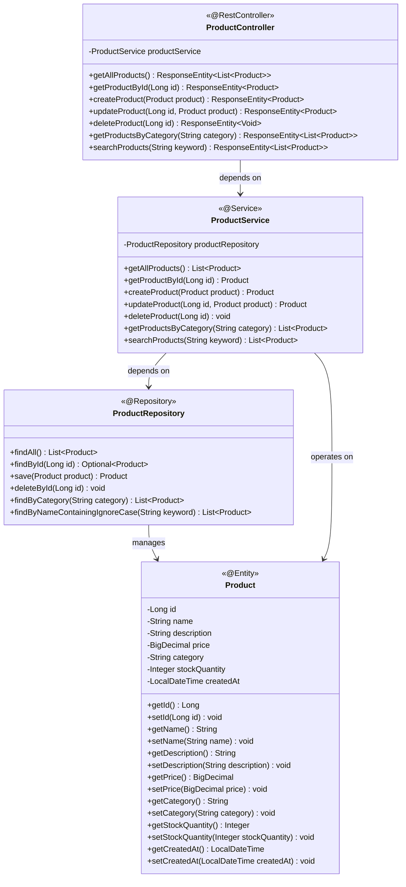

### 2.2 Shopping Cart Class Diagram

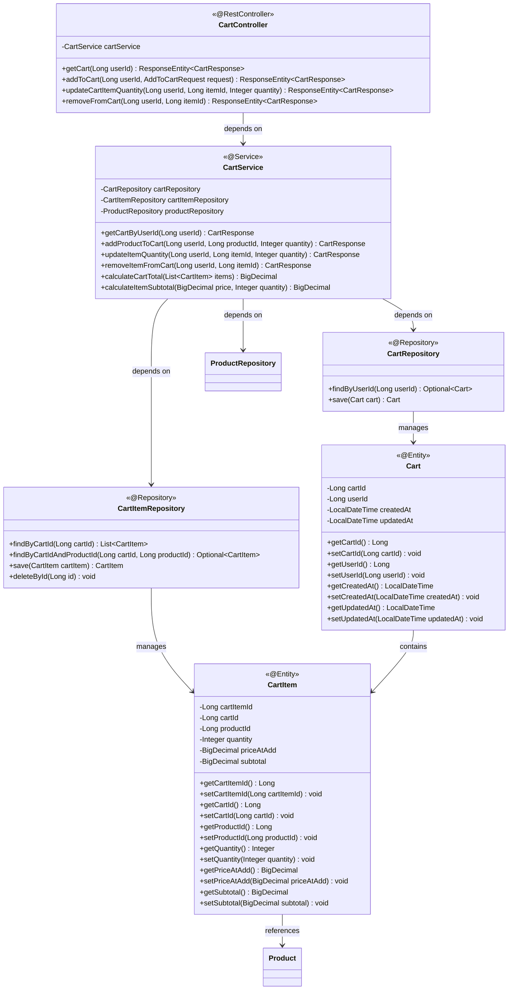

### 2.3 Entity Relationship Diagram

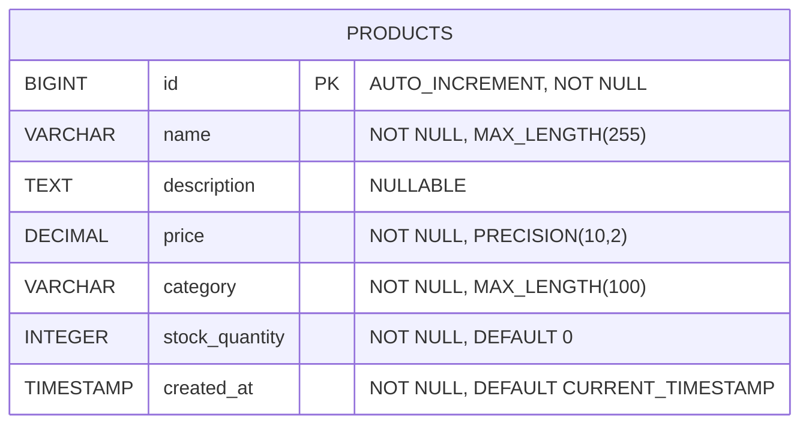

### 2.4 Shopping Cart Entity Relationship Diagram

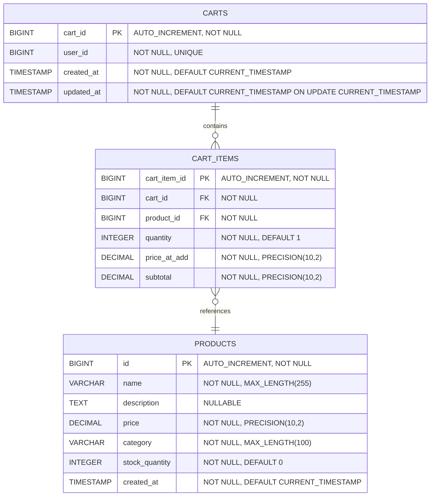

## 3. Sequence Diagrams

### 3.1 Get All Products

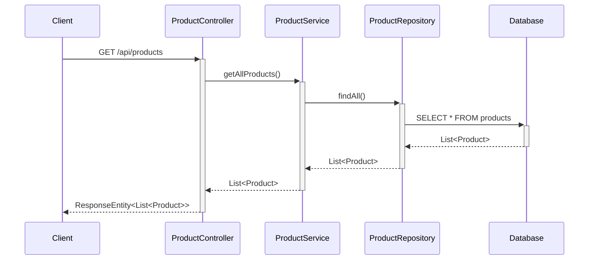

### 3.2 Get Product By ID

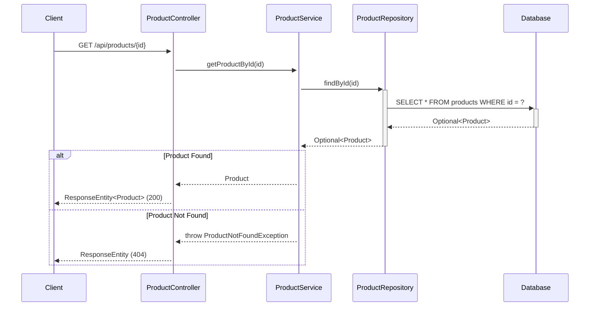

### 3.3 Create Product

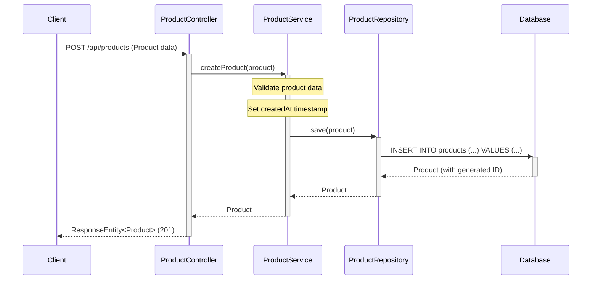

### 3.4 Update Product

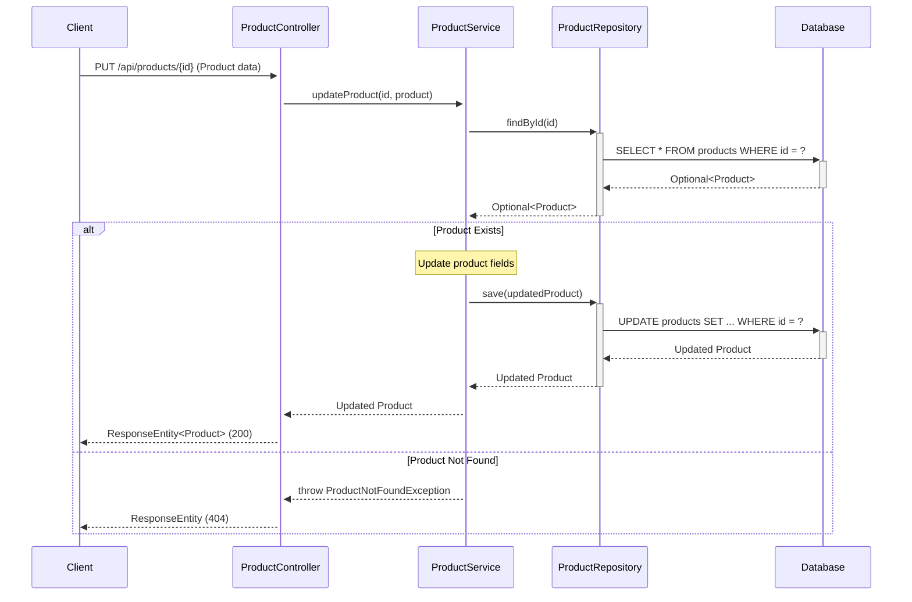

### 3.5 Delete Product

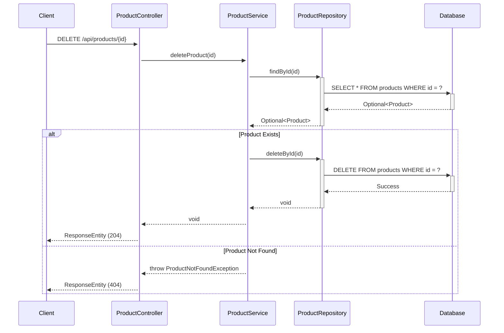

### 3.6 Get Products By Category

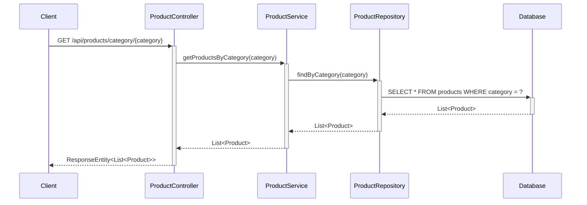

### 3.7 Search Products

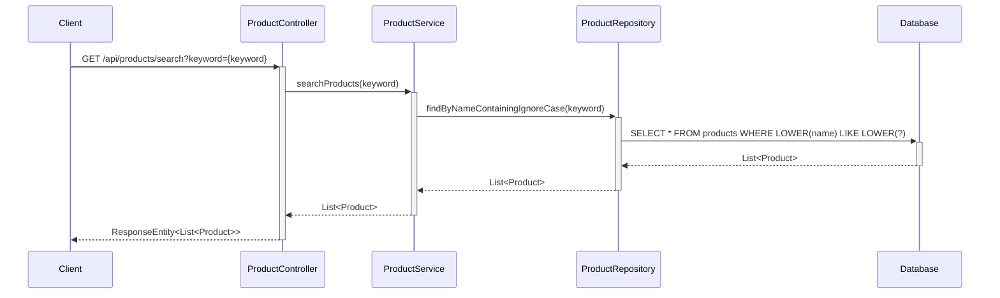

### 3.8 Add Product to Cart

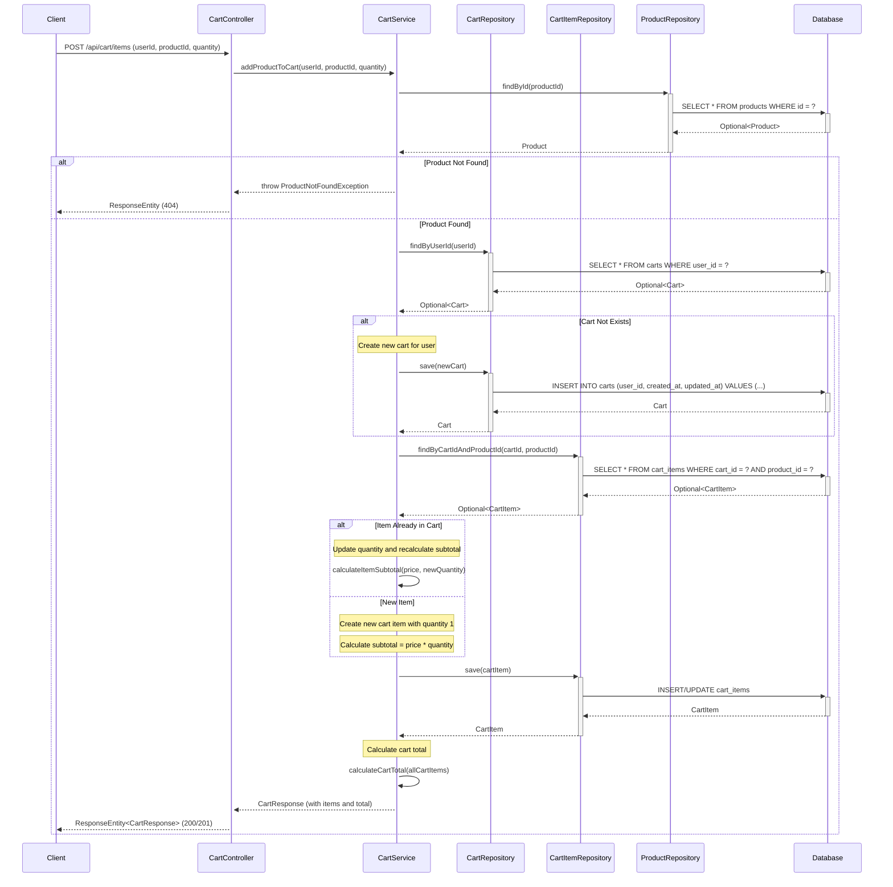

### 3.9 View Shopping Cart

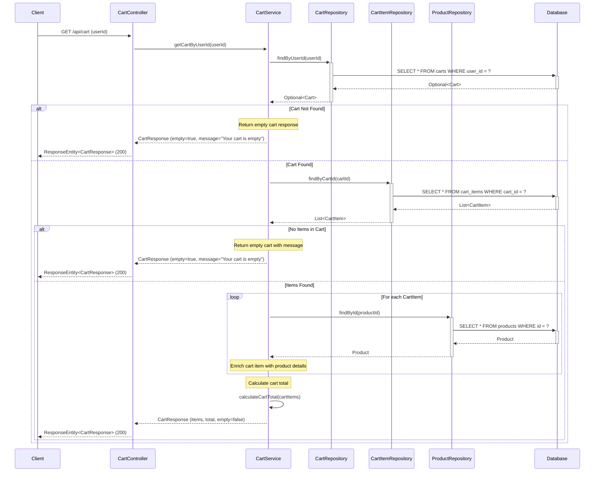

### 3.10 Update Cart Item Quantity

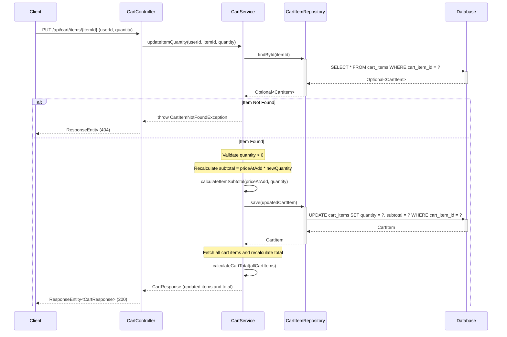

### 3.11 Remove Item from Cart

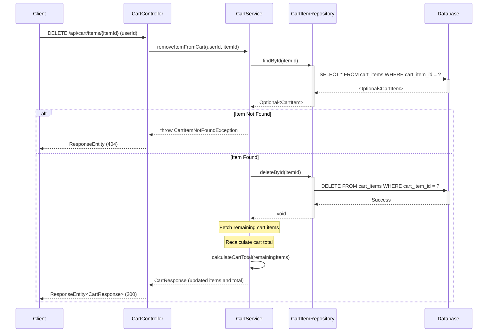

## 4. API Endpoints Summary

| Method | Endpoint | Description | Request Body | Response |
|--------|----------|-------------|--------------|----------|
| GET | `/api/products` | Get all products | None | List<Product> |
| GET | `/api/products/{id}` | Get product by ID | None | Product |
| POST | `/api/products` | Create new product | Product | Product |
| PUT | `/api/products/{id}` | Update existing product | Product | Product |
| DELETE | `/api/products/{id}` | Delete product | None | None |
| GET | `/api/products/category/{category}` | Get products by category | None | List<Product> |
| GET | `/api/products/search?keyword={keyword}` | Search products by name | None | List<Product> |

### 4.1 Shopping Cart API Endpoints

| Method | Endpoint | Description | Request Body | Response |
|--------|----------|-------------|--------------|----------|
| GET | `/api/cart` | View shopping cart for user | Query: userId | CartResponse |
| POST | `/api/cart/items` | Add product to cart | {"userId": Long, "productId": Long, "quantity": Integer} | CartResponse |
| PUT | `/api/cart/items/{itemId}` | Update cart item quantity | {"userId": Long, "quantity": Integer} | CartResponse |
| DELETE | `/api/cart/items/{itemId}` | Remove item from cart | Query: userId | CartResponse |

**CartResponse Structure:**
```json
{
  "cartId": "Long",
  "userId": "Long",
  "items": [
    {
      "cartItemId": "Long",
      "productId": "Long",
      "productName": "String",
      "price": "BigDecimal",
      "quantity": "Integer",
      "subtotal": "BigDecimal"
    }
  ],
  "total": "BigDecimal",
  "isEmpty": "Boolean",
  "message": "String (optional, e.g., 'Your cart is empty')",
  "continueShoppingLink": "String (optional, e.g., '/products')"
}
```

## 5. Database Schema

### Products Table

```sql
CREATE TABLE products (
    id BIGINT PRIMARY KEY AUTO_INCREMENT,
    name VARCHAR(255) NOT NULL,
    description TEXT,
    price DECIMAL(10,2) NOT NULL,
    category VARCHAR(100) NOT NULL,
    stock_quantity INTEGER NOT NULL DEFAULT 0,
    created_at TIMESTAMP NOT NULL DEFAULT CURRENT_TIMESTAMP
);

CREATE INDEX idx_products_category ON products(category);
CREATE INDEX idx_products_name ON products(name);
```

### 5.1 Shopping Cart Database Schema

```sql
CREATE TABLE carts (
    cart_id BIGINT PRIMARY KEY AUTO_INCREMENT,
    user_id BIGINT NOT NULL UNIQUE,
    created_at TIMESTAMP NOT NULL DEFAULT CURRENT_TIMESTAMP,
    updated_at TIMESTAMP NOT NULL DEFAULT CURRENT_TIMESTAMP ON UPDATE CURRENT_TIMESTAMP,
    INDEX idx_carts_user_id (user_id)
);

CREATE TABLE cart_items (
    cart_item_id BIGINT PRIMARY KEY AUTO_INCREMENT,
    cart_id BIGINT NOT NULL,
    product_id BIGINT NOT NULL,
    quantity INTEGER NOT NULL DEFAULT 1,
    price_at_add DECIMAL(10,2) NOT NULL,
    subtotal DECIMAL(10,2) NOT NULL,
    FOREIGN KEY (cart_id) REFERENCES carts(cart_id) ON DELETE CASCADE,
    FOREIGN KEY (product_id) REFERENCES products(id) ON DELETE CASCADE,
    UNIQUE KEY unique_cart_product (cart_id, product_id),
    INDEX idx_cart_items_cart_id (cart_id),
    INDEX idx_cart_items_product_id (product_id)
);
```

## 6. Technology Stack

- **Backend Framework:** Spring Boot 3.x
- **Language:** Java 21
- **Database:** PostgreSQL
- **ORM:** Spring Data JPA / Hibernate
- **Build Tool:** Maven/Gradle
- **API Documentation:** Swagger/OpenAPI 3

## 7. Design Patterns Used

1. **MVC Pattern:** Separation of Controller, Service, and Repository layers
2. **Repository Pattern:** Data access abstraction through ProductRepository
3. **Dependency Injection:** Spring's IoC container manages dependencies
4. **DTO Pattern:** Data Transfer Objects for API requests/responses
5. **Exception Handling:** Custom exceptions for business logic errors

## 8. Key Features

- RESTful API design following HTTP standards
- Proper HTTP status codes for different scenarios
- Input validation and error handling
- Database indexing for performance optimization
- Transactional operations for data consistency
- Pagination support for large datasets (can be extended)
- Search functionality with case-insensitive matching

## 9. Shopping Cart Business Logic

### 9.1 Cart Calculation Methods

**calculateItemSubtotal(price, quantity):**
- Input: Product price (BigDecimal), quantity (Integer)
- Logic: subtotal = price × quantity
- Output: BigDecimal subtotal
- Validation: Ensure quantity > 0 and price >= 0

**calculateCartTotal(cartItems):**
- Input: List of CartItem entities
- Logic: total = Σ(subtotal for each cart item)
- Output: BigDecimal total
- Handles empty cart: returns 0.00

### 9.2 Empty Cart State Handling

**Empty Cart Detection:**
- Check if cart exists for user
- Check if cart has zero items
- Return CartResponse with:
  - `isEmpty = true`
  - `message = "Your cart is empty"`
  - `continueShoppingLink = "/products"`
  - `items = []`
  - `total = 0.00`

### 9.3 Cart-Product Integration

**Product Availability Context:**
- When retrieving product details, include cart context:
  - `inCart`: Boolean indicating if product is in user's cart
  - `cartQuantity`: Current quantity in cart (if applicable)
  - `availableStock`: Remaining stock quantity

**Stock Validation on Add to Cart:**
- Verify product.stockQuantity >= requested quantity
- Throw InsufficientStockException if validation fails
- Update cart only if stock is available

### 9.4 Automatic Recalculation Triggers

**Quantity Update:**
- Recalculate item subtotal immediately
- Recalculate cart total
- Update cart.updatedAt timestamp

**Item Removal:**
- Remove item from cart_items table
- Recalculate cart total from remaining items
- Update cart.updatedAt timestamp

**Price Changes:**
- Use `price_at_add` field to preserve price at time of adding
- Cart displays price at which item was added
- Optionally show current price for comparison

## 10. Exception Handling

### 10.1 Product Exceptions
- **ProductNotFoundException:** Thrown when product ID not found (HTTP 404)
- **InvalidProductDataException:** Thrown for validation failures (HTTP 400)

### 10.2 Shopping Cart Exceptions
- **CartNotFoundException:** Thrown when cart not found for user (HTTP 404)
- **CartItemNotFoundException:** Thrown when cart item ID not found (HTTP 404)
- **InsufficientStockException:** Thrown when requested quantity exceeds available stock (HTTP 400)
- **InvalidQuantityException:** Thrown when quantity <= 0 (HTTP 400)
- **EmptyCartException:** Informational exception for empty cart state (HTTP 200 with message)

## 11. Traceability Matrix

### 11.1 Epic to Story to LLD Mapping

**Epic:** E-commerce Customer-Facing Capabilities  
**Story:** Shopping Cart Management

| Story AC | LLD Section | Implementation Details |
|----------|-------------|------------------------|
| AC1: Add to Cart with quantity 1 | Section 3.8, 4.1, 9.1 | POST /api/cart/items endpoint, addProductToCart service method |
| AC2: View cart with product details | Section 3.9, 4.1, 9.2 | GET /api/cart endpoint, getCartByUserId service method, CartResponse DTO |
| AC3: Update quantity with recalculation | Section 3.10, 4.1, 9.1, 9.4 | PUT /api/cart/items/{itemId} endpoint, calculateItemSubtotal and calculateCartTotal methods |
| AC4: Remove item with total update | Section 3.11, 4.1, 9.4 | DELETE /api/cart/items/{itemId} endpoint, removeItemFromCart service method |
| AC5: Empty cart message | Section 9.2, 3.9 | Empty cart state detection in getCartByUserId, CartResponse with message and link |

### 11.2 Gap Coverage Summary

| Gap ID | Category | Status | LLD Section |
|--------|----------|--------|-------------|
| ADD-001 | API Endpoint | ✅ Added | Section 4.1, 3.8 |
| ADD-002 | API Endpoint | ✅ Added | Section 4.1, 3.9 |
| ADD-003 | API Endpoint | ✅ Added | Section 4.1, 3.10 |
| ADD-004 | API Endpoint | ✅ Added | Section 4.1, 3.11 |
| ADD-005 | Business Logic | ✅ Added | Section 9.2, 3.9 |
| ADD-006 | Data Model | ✅ Added | Section 2.2, 2.4, 5.1 |
| MODIFY-001 | API Enhancement | ✅ Addressed | Section 9.3 |
| MODIFY-002 | Business Logic | ✅ Addressed | Section 9.1, 9.4 |

## 12. Implementation Notes

### 12.1 Transaction Management
- All cart operations (add, update, remove) should be wrapped in `@Transactional` annotations
- Ensure atomicity when updating multiple cart items
- Use optimistic locking for concurrent cart updates

### 12.2 Performance Considerations
- Index cart_id and product_id in cart_items table for fast lookups
- Consider caching cart totals for frequently accessed carts
- Implement pagination for carts with large number of items

### 12.3 Security Considerations
- Validate userId matches authenticated user before cart operations
- Implement rate limiting on cart API endpoints
- Sanitize all user inputs to prevent SQL injection
- Use HTTPS for all cart-related API calls

### 12.4 Future Enhancements
- Cart expiration policy (e.g., clear carts after 30 days of inactivity)
- Save for later functionality
- Cart sharing capabilities
- Promotional code application at cart level
- Inventory reservation during checkout process