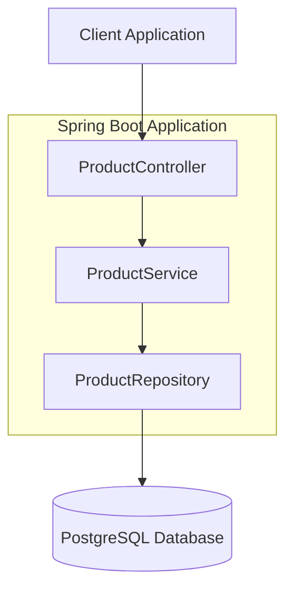
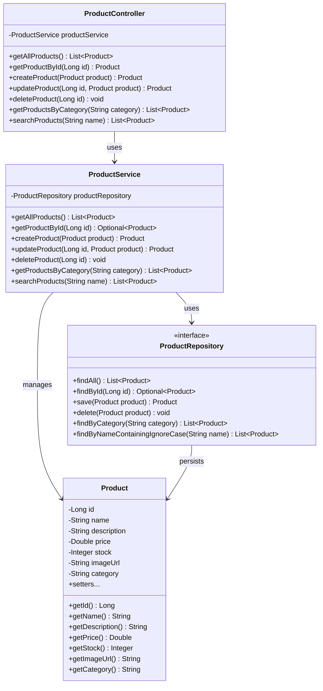
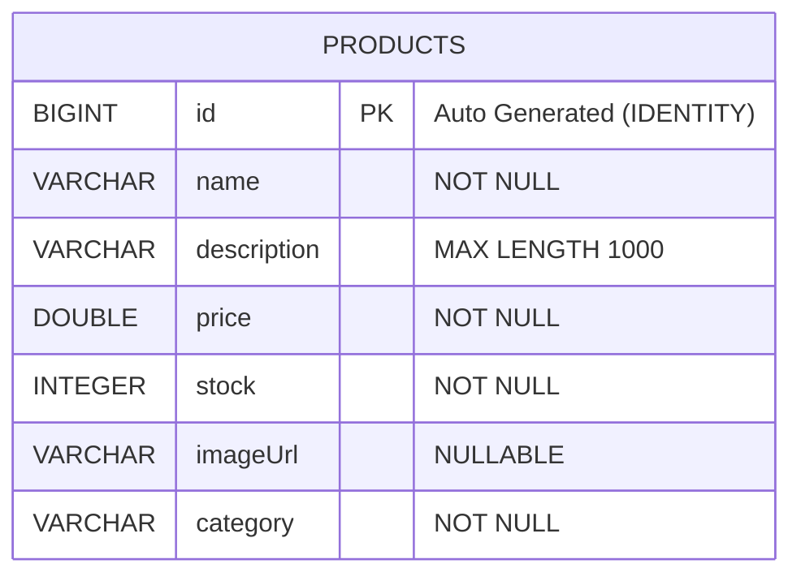
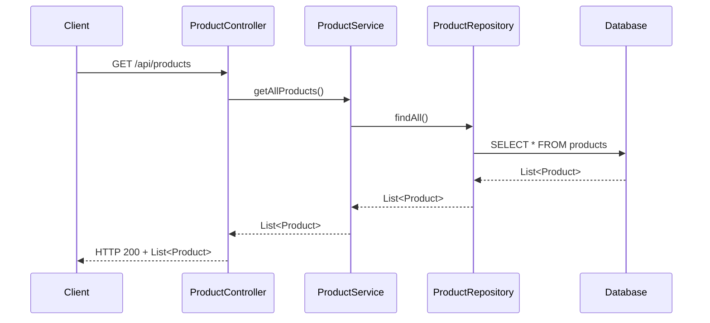
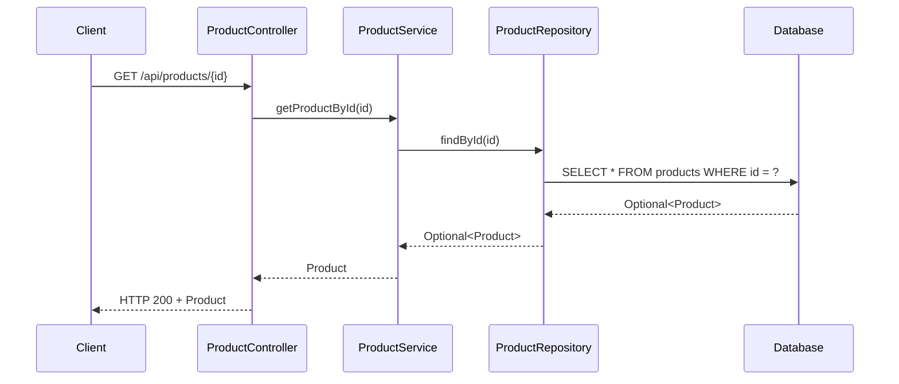
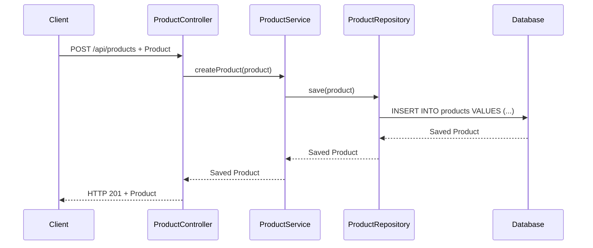
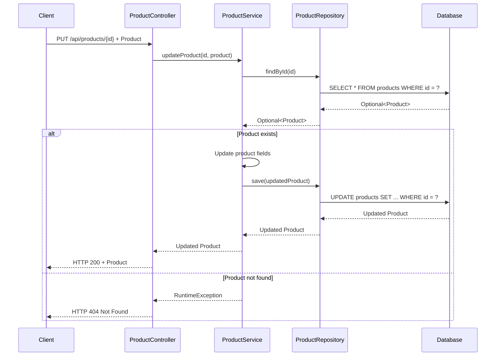
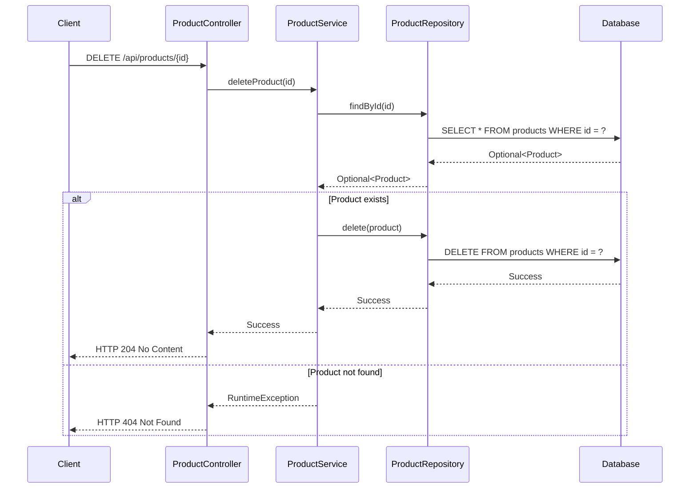
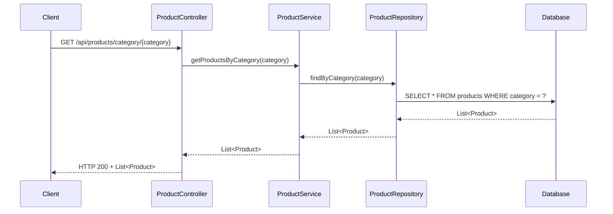
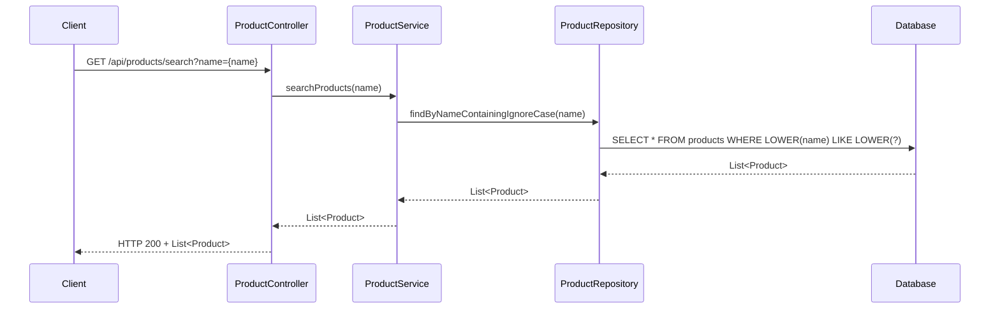

# Low-Level Design (LLD) - E-Commerce Product Management System

## 1. Project Overview

### Project Information
- **Framework**: Spring Boot 3.3.0
- **Java Version**: 21
- **Database**: PostgreSQL
- **Server Port**: 8080
- **Architecture**: RESTful API with layered architecture

### Dependencies
- spring-boot-starter-web
- spring-boot-starter-data-jpa
- postgresql
- lombok
- h2 (for testing)

## 2. System Architecture

### 2.1 High-Level Architecture

### 2.2 Class Diagram

## 3. Database Design

### 3.1 Entity Relationship Diagram

### 3.2 Database Configuration

- **Database Type**: PostgreSQL
- **URL**: jdbc:postgresql://localhost:5432/ecommerce
- **Username**: postgres
- **Driver**: org.postgresql.Driver
- **Hibernate DDL**: update
- **Show SQL**: true
- **Format SQL**: true

## 4. API Endpoints

### 4.1 REST API Overview

| Method | Endpoint | Description | Request Body | Response |
|--------|----------|-------------|--------------|----------|
| GET | /api/products | Get all products | None | List<Product> |
| GET | /api/products/{id} | Get product by ID | None | Product |
| POST | /api/products | Create new product | Product | Product |
| PUT | /api/products/{id} | Update existing product | Product | Product |
| DELETE | /api/products/{id} | Delete product | None | Void |
| GET | /api/products/category/{category} | Get products by category | None | List<Product> |
| GET | /api/products/search?name={name} | Search products by name | None | List<Product> |

## 5. Sequence Diagrams

### 5.1 Get All Products

### 5.2 Get Product by ID

### 5.3 Create Product

### 5.4 Update Product

### 5.5 Delete Product

### 5.6 Get Products by Category

### 5.7 Search Products by Name

## 6. Configuration Details

### 6.1 CORS Configuration

- **Allowed Origins**: https://ecomm-frontend-dvcdhygrandkdyhm.eastus-01.azurewebsites.net
- **Allowed Methods**: GET, POST, PUT, DELETE, OPTIONS
- **Allowed Headers**: *

### 6.2 Service Layer Logic

#### ProductService Methods:

1. **getAllProducts()**
   - Calls `productRepository.findAll()`
   - Returns list of all products

2. **getProductById(Long id)**
   - Calls `productRepository.findById(id)`
   - Returns `Optional<Product>`

3. **createProduct(Product product)**
   - Receives Product object
   - Calls `productRepository.save(product)`
   - Returns saved Product

4. **updateProduct(Long id, Product product)**
   - Finds product by ID using `productRepository.findById(id)`
   - Throws RuntimeException if product not found
   - Updates product fields (name, description, price, stock, imageUrl, category)
   - Calls `productRepository.save(product)`
   - Returns updated Product

5. **deleteProduct(Long id)**
   - Finds product by ID using `productRepository.findById(id)`
   - Throws RuntimeException if product not found
   - Calls `productRepository.delete(product)`

6. **getProductsByCategory(String category)**
   - Calls `productRepository.findByCategory(category)`
   - Returns list of products matching category

7. **searchProducts(String name)**
   - Calls `productRepository.findByNameContainingIgnoreCase(name)`
   - Returns list of products with names containing search term

## 7. Data Model Specifications

### Product Entity Constraints:

- **id**: Primary Key, Auto Generated (IDENTITY)
- **name**: Not Null
- **description**: Maximum Length 1000 characters
- **price**: Not Null
- **stock**: Not Null
- **imageUrl**: Nullable
- **category**: Not Null

## 8. Error Handling

- **404 Not Found**: When product with given ID doesn't exist
- **400 Bad Request**: When request body validation fails
- **500 Internal Server Error**: For unexpected server errors

## 9. Performance Considerations

- Database indexing on frequently queried fields (id, category, name)
- Connection pooling for database connections
- Caching strategies for frequently accessed products
- Pagination for large result sets

## 10. Security Considerations

- Input validation for all API endpoints
- SQL injection prevention through JPA/Hibernate
- CORS configuration for cross-origin requests
- Authentication and authorization (to be implemented)

---

*This LLD document provides a comprehensive overview of the Product Management System architecture, including detailed diagrams and specifications for implementation.*