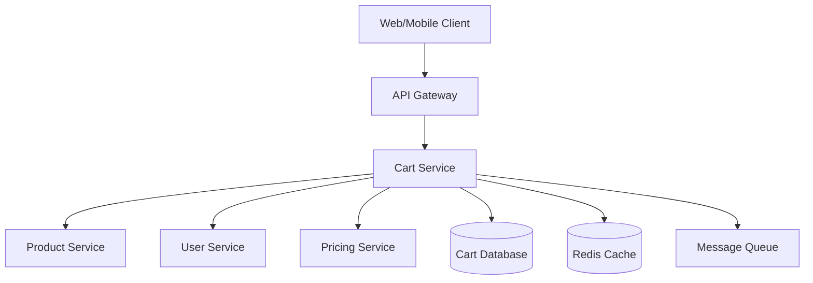
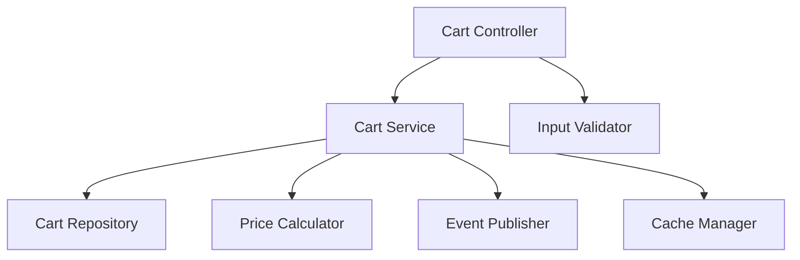

# Low Level Design Document
## E-Commerce Platform - Shopping Cart Module

**Version:** 1.4  
**Date:** 2024-01-21  
**Status:** Updated  
**Author:** Engineering Team  

---

## 1. Document Overview

### 1.1 Purpose
This Low Level Design (LLD) document provides detailed technical specifications for the Shopping Cart module of the E-Commerce Platform. It describes the component architecture, data models, API contracts, business logic, and implementation details required for development.

### 1.2 Scope
This document covers:
- Cart service architecture and components
- Database schema and data models
- API specifications and contracts
- Business logic and validation rules
- Integration points with other services
- Error handling and edge cases

### 1.3 Audience
- Software Engineers
- QA Engineers
- Technical Leads
- DevOps Engineers

### 1.4 References
- High Level Design Document v2.1
- API Design Standards v1.0
- Database Design Guidelines v1.5
- Security Standards v2.0

---

## 2. System Architecture

### 2.1 Architecture Overview


```mermaid
graph TB
    Client[Web/Mobile Client]
    Gateway[API Gateway]
    CartService[Cart Service]
    ProductService[Product Service]
    UserService[User Service]
    PricingService[Pricing Service]
    DB[(Cart Database)]
    Cache[(Redis Cache)]
    Queue[Message Queue]
    
    Client --> Gateway
    Gateway --> CartService
    CartService --> ProductService
    CartService --> UserService
    CartService --> PricingService
    CartService --> DB
    CartService --> Cache
    CartService --> Queue
```

### 2.2 Technology Stack

| Component | Technology | Version |
|-----------|------------|----------|
| Backend Framework | Node.js + Express | 18.x / 4.x |
| Database | PostgreSQL | 14.x |
| Cache | Redis | 7.x |
| Message Queue | RabbitMQ | 3.11.x |
| API Documentation | OpenAPI/Swagger | 3.0 |
| Testing | Jest | 29.x |
| Logging | Winston | 3.x |

---

## 3. Data Design

### 3.1 Database Schema

#### 3.1.1 Cart Table

```sql
CREATE TABLE carts (
    cart_id UUID PRIMARY KEY DEFAULT gen_random_uuid(),
    user_id UUID NOT NULL,
    session_id VARCHAR(255),
    status VARCHAR(20) NOT NULL DEFAULT 'active',
    created_at TIMESTAMP NOT NULL DEFAULT CURRENT_TIMESTAMP,
    updated_at TIMESTAMP NOT NULL DEFAULT CURRENT_TIMESTAMP,
    expires_at TIMESTAMP,
    total_amount DECIMAL(10,2) DEFAULT 0.00,
    total_items INTEGER DEFAULT 0,
    currency VARCHAR(3) DEFAULT 'USD',
    
    CONSTRAINT fk_user FOREIGN KEY (user_id) REFERENCES users(user_id),
    CONSTRAINT chk_status CHECK (status IN ('active', 'abandoned', 'converted', 'expired'))
);

CREATE INDEX idx_carts_user_id ON carts(user_id);
CREATE INDEX idx_carts_session_id ON carts(session_id);
CREATE INDEX idx_carts_status ON carts(status);
CREATE INDEX idx_carts_expires_at ON carts(expires_at);
```

#### 3.1.2 Cart Items Table

```sql
CREATE TABLE cart_items (
    cart_item_id UUID PRIMARY KEY DEFAULT gen_random_uuid(),
    cart_id UUID NOT NULL,
    product_id UUID NOT NULL,
    variant_id UUID,
    quantity INTEGER NOT NULL DEFAULT 1,
    unit_price DECIMAL(10,2) NOT NULL,
    subtotal DECIMAL(10,2) NOT NULL,
    discount_amount DECIMAL(10,2) DEFAULT 0.00,
    tax_amount DECIMAL(10,2) DEFAULT 0.00,
    updated_at TIMESTAMP NOT NULL DEFAULT CURRENT_TIMESTAMP,
    
    CONSTRAINT fk_cart FOREIGN KEY (cart_id) REFERENCES carts(cart_id) ON DELETE CASCADE,
    CONSTRAINT fk_product FOREIGN KEY (product_id) REFERENCES products(product_id),
    CONSTRAINT chk_quantity CHECK (quantity > 0),
    CONSTRAINT chk_unit_price CHECK (unit_price >= 0),
    CONSTRAINT chk_subtotal CHECK (subtotal >= 0)
);

CREATE INDEX idx_cart_items_cart_id ON cart_items(cart_id);
CREATE INDEX idx_cart_items_product_id ON cart_items(product_id);
CREATE UNIQUE INDEX idx_cart_items_unique ON cart_items(cart_id, product_id, variant_id);
```

#### 3.1.3 Price Snapshot Mechanism

**Purpose:** Capture product price at the time of adding to cart to handle price changes and maintain pricing integrity.

**Implementation Details:**
- The `unit_price` field in `cart_items` table serves as the price snapshot
- When an item is added to cart, the current product price is fetched from Product Service and stored in `unit_price`
- This snapshot price remains unchanged even if the product price changes later
- Price comparison logic can be implemented to notify users of price changes before checkout

**Price Change Handling:**
```javascript
class PriceSnapshotHandler {
    async validatePriceSnapshot(cartItemId) {
        const cartItem = await this.getCartItem(cartItemId);
        const currentPrice = await this.productService.getPrice(cartItem.productId);
        
        if (cartItem.unitPrice !== currentPrice) {
            return {
                priceChanged: true,
                snapshotPrice: cartItem.unitPrice,
                currentPrice: currentPrice,
                difference: currentPrice - cartItem.unitPrice
            };
        }
        
        return { priceChanged: false };
    }
    
    async updatePriceSnapshot(cartItemId) {
        const cartItem = await this.getCartItem(cartItemId);
        const currentPrice = await this.productService.getPrice(cartItem.productId);
        
        await this.repository.updateItemPrice(cartItemId, currentPrice);
        return { updated: true, newPrice: currentPrice };
    }
}
```

### 3.2 Data Models

#### 3.2.1 Cart Model

```javascript
class Cart {
    constructor(data) {
        this.cartId = data.cart_id;
        this.userId = data.user_id;
        this.sessionId = data.session_id;
        this.status = data.status;
        this.createdAt = data.created_at;
        this.updatedAt = data.updated_at;
        this.expiresAt = data.expires_at;
        this.totalAmount = data.total_amount;
        this.totalItems = data.total_items;
        this.currency = data.currency;
        this.items = [];
    }

    addItem(item) {
        this.items.push(item);
        this.recalculateTotals();
    }

    removeItem(cartItemId) {
        this.items = this.items.filter(item => item.cartItemId !== cartItemId);
        this.recalculateTotals();
    }

    updateItemQuantity(cartItemId, quantity) {
        const item = this.items.find(item => item.cartItemId === cartItemId);
        if (item) {
            item.quantity = quantity;
            item.subtotal = item.unitPrice * quantity;
            this.recalculateTotals();
        }
    }

    recalculateTotals() {
        this.totalItems = this.items.reduce((sum, item) => sum + item.quantity, 0);
        this.totalAmount = this.items.reduce((sum, item) => sum + item.subtotal, 0);
    }

    isEmpty() {
        return this.items.length === 0;
    }
}
```

#### 3.2.2 Cart Item Model

```javascript
class CartItem {
    constructor(data) {
        this.cartItemId = data.cart_item_id;
        this.cartId = data.cart_id;
        this.productId = data.product_id;
        this.variantId = data.variant_id;
        this.quantity = data.quantity;
        this.unitPrice = data.unit_price;
        this.subtotal = data.subtotal;
        this.discountAmount = data.discount_amount;
        this.taxAmount = data.tax_amount;
        this.updatedAt = data.updated_at;
    }

    calculateSubtotal() {
        return this.unitPrice * this.quantity;
    }
}
```

---

## 4. Component Design

### 4.1 Cart Service Components


```mermaid
graph TB
    Controller[Cart Controller]
    Service[Cart Service]
    Repository[Cart Repository]
    Validator[Input Validator]
    PriceService[Price Calculator]
    EventPublisher[Event Publisher]
    CacheManager[Cache Manager]
    
    Controller --> Validator
    Controller --> Service
    Service --> Repository
    Service --> PriceService
    Service --> EventPublisher
    Service --> CacheManager
```

### 4.2 Presentation Layer Components

The presentation layer handles user interactions and UI state management for the shopping cart:

#### 4.2.1 Cart View Interface
- **Purpose**: Main cart display component
- **Responsibilities**:
  - Render cart items with product details
  - Display quantity controls and remove buttons
  - Show cart totals and pricing breakdown
  - Handle loading and error states

#### 4.2.2 Empty Cart View
- **Purpose**: Display when cart has no items
- **Responsibilities**:
  - Show empty cart message/illustration
  - Provide 'continue shopping' redirection link
  - Suggest popular or recommended products

#### 4.2.3 Add to Cart Handler
- **Purpose**: Manages add-to-cart interactions
- **Responsibilities**:
  - Capture product selection and quantity
  - Validate input before API call
  - Show success/error feedback
  - Update cart badge/counter

#### 4.2.4 Quantity Updater Component
- **Purpose**: Handles quantity modifications
- **Responsibilities**:
  - Provide increment/decrement controls
  - Validate quantity constraints (min/max)
  - Trigger API updates on change
  - Show loading state during updates

### 4.3 Cart Service

#### 4.3.1 Business Logic

**Core Operations:**

1. **Add Item to Cart**
   - Validate product availability
   - Check inventory stock
   - Fetch current product price (price snapshot mechanism)
   - Check for existing item (same product + variant)
   - If exists: increment quantity
   - If new: create cart item entry
   - Recalculate cart totals
   - Update cache
   - Publish cart_item_added event

2. **Update Item Quantity**
   - Validate quantity constraints (min: 1, max: stock level)
   - Check inventory availability
   - Update cart item quantity
   - **Quantity mutation via PUT triggers automatic recalculation**: When quantity is updated, the system automatically recalculates the item subtotal (unit_price × new_quantity) and updates the cart total by summing all item subtotals
   - **Explicit Recalculation Trigger**: Upon any PUT /api/v1/cart/items/:id operation, the system must immediately recalculate item subtotal and cart total before returning the response. This is a mandatory post-update operation that ensures data consistency.
   - Update cache
   - Publish cart_item_updated event

3. **Remove Item from Cart**
   - Validate cart item exists
   - Delete cart item
   - Recalculate cart totals
   - Update cache
   - Publish cart_item_removed event

4. **Get Cart**
   - Check cache first
   - If cache miss: fetch from database
   - Enrich with product details
   - Update cache
   - Return cart with items

5. **Clear Cart**
   - Delete all cart items
   - Reset cart totals
   - Update cache
   - Publish cart_cleared event

#### 4.3.2 Empty Cart Handling

When a cart becomes empty (all items removed or cart cleared):
- Set `total_items` to 0
- Set `total_amount` to 0.00
- Maintain cart record (don't delete)
- **Empty cart state triggers UI 'continue shopping' redirection link**: The frontend receives an empty cart response and displays the Empty Cart View component with a prominent call-to-action link redirecting users to continue shopping (typically to homepage or product catalog)
- **Business Rule for Empty Cart UI**: When cart is empty (itemCount = 0), the system must return an empty cart indicator in the API response, and the frontend must display the 'continue shopping' redirection link as specified in the Empty Cart View component (Section 4.2.2)
- Cache the empty state
- Publish cart_emptied event

#### 4.3.3 Validation Rules

| Rule | Description | Error Code |
|------|-------------|------------|
| Product Exists | Product must exist and be active | PRODUCT_NOT_FOUND |
| Stock Available | Requested quantity must be ≤ available stock | INSUFFICIENT_STOCK |
| Quantity Range | Quantity must be between 1 and max_per_order | INVALID_QUANTITY |
| Cart Limit | Total items in cart ≤ 100 | CART_LIMIT_EXCEEDED |
| Price Valid | Unit price must be > 0 | INVALID_PRICE |
| User Authorized | User must own the cart | UNAUTHORIZED_ACCESS |

#### 4.3.4 Price Calculation

```javascript
class PriceCalculator {
    calculateItemSubtotal(unitPrice, quantity, discounts = []) {
        let subtotal = unitPrice * quantity;
        
        // Apply item-level discounts
        discounts.forEach(discount => {
            if (discount.type === 'percentage') {
                subtotal -= subtotal * (discount.value / 100);
            } else if (discount.type === 'fixed') {
                subtotal -= discount.value;
            }
        });
        
        return Math.max(0, subtotal);
    }

    calculateCartTotal(items, cartLevelDiscounts = []) {
        let total = items.reduce((sum, item) => sum + item.subtotal, 0);
        
        // Apply cart-level discounts
        cartLevelDiscounts.forEach(discount => {
            if (discount.type === 'percentage') {
                total -= total * (discount.value / 100);
            } else if (discount.type === 'fixed') {
                total -= discount.value;
            }
        });
        
        return Math.max(0, total);
    }

    calculateTax(subtotal, taxRate) {
        return subtotal * (taxRate / 100);
    }
}
```

### 4.4 Repository Layer

```javascript
class CartRepository {
    async createCart(userId, sessionId) {
        const query = `
            INSERT INTO carts (user_id, session_id, status, expires_at)
            VALUES ($1, $2, 'active', NOW() + INTERVAL '30 days')
            RETURNING *
        `;
        return await db.query(query, [userId, sessionId]);
    }

    async getCartByUserId(userId) {
        const query = `
            SELECT c.*, 
                   json_agg(
                       json_build_object(
                           'cart_item_id', ci.cart_item_id,
                           'product_id', ci.product_id,
                           'variant_id', ci.variant_id,
                           'quantity', ci.quantity,
                           'unit_price', ci.unit_price,
                           'subtotal', ci.subtotal
                       )
                   ) FILTER (WHERE ci.cart_item_id IS NOT NULL) as items
            FROM carts c
            LEFT JOIN cart_items ci ON c.cart_id = ci.cart_id
            WHERE c.user_id = $1 AND c.status = 'active'
            GROUP BY c.cart_id
        `;
        return await db.query(query, [userId]);
    }

    async addItemToCart(cartId, productId, variantId, quantity, unitPrice) {
        const query = `
            INSERT INTO cart_items (cart_id, product_id, variant_id, quantity, unit_price, subtotal)
            VALUES ($1, $2, $3, $4, $5, $6)
            ON CONFLICT (cart_id, product_id, variant_id)
            DO UPDATE SET 
                quantity = cart_items.quantity + EXCLUDED.quantity,
                subtotal = cart_items.unit_price * (cart_items.quantity + EXCLUDED.quantity),
                updated_at = CURRENT_TIMESTAMP
            RETURNING *
        `;
        const subtotal = unitPrice * quantity;
        return await db.query(query, [cartId, productId, variantId, quantity, unitPrice, subtotal]);
    }

    async updateItemQuantity(cartItemId, quantity) {
        const query = `
            UPDATE cart_items
            SET quantity = $2,
                subtotal = unit_price * $2,
                updated_at = CURRENT_TIMESTAMP
            WHERE cart_item_id = $1
            RETURNING *
        `;
        return await db.query(query, [cartItemId, quantity]);
    }

    async removeItem(cartItemId) {
        const query = `DELETE FROM cart_items WHERE cart_item_id = $1`;
        return await db.query(query, [cartItemId]);
    }

    async updateCartTotals(cartId) {
        const query = `
            UPDATE carts
            SET total_items = (SELECT COALESCE(SUM(quantity), 0) FROM cart_items WHERE cart_id = $1),
                total_amount = (SELECT COALESCE(SUM(subtotal), 0) FROM cart_items WHERE cart_id = $1),
                updated_at = CURRENT_TIMESTAMP
            WHERE cart_id = $1
            RETURNING *
        `;
        return await db.query(query, [cartId]);
    }
}
```

---

## 5. API Specifications

### 5.1 API Endpoints Overview

| Method | Endpoint | Description | Auth Required |
|--------|----------|-------------|---------------|
| GET | /api/v1/cart | Get user's cart | Yes |
| POST | /api/v1/cart/items | Add item to cart | Yes |
| PUT | /api/v1/cart/items/:id | Update item quantity | Yes |
| DELETE | /api/v1/cart/items/:id | Remove item from cart | Yes |
| DELETE | /api/v1/cart | Clear entire cart | Yes |
| POST | /api/v1/cart/merge | Merge guest cart with user cart | Yes |

### 5.2 Get Cart API

#### GET /api/v1/cart

**Description:** Retrieve the current user's active shopping cart with all items.

**Request Headers:**
```
Authorization: Bearer {jwt_token}
Content-Type: application/json
```

**Response (200 OK):**
```json
{
    "success": true,
    "data": {
        "cartId": "550e8400-e29b-41d4-a716-446655440000",
        "userId": "123e4567-e89b-12d3-a456-426614174000",
        "status": "active",
        "totalItems": 3,
        "totalAmount": 299.97,
        "currency": "USD",
        "items": [
            {
                "cartItemId": "660e8400-e29b-41d4-a716-446655440001",
                "productId": "prod_001",
                "productName": "Wireless Headphones",
                "variantId": "var_001",
                "variantName": "Black",
                "quantity": 2,
                "unitPrice": 99.99,
                "subtotal": 199.98,
                "imageUrl": "https://cdn.example.com/images/prod_001.jpg"
            },
            {
                "cartItemId": "660e8400-e29b-41d4-a716-446655440002",
                "productId": "prod_002",
                "productName": "USB-C Cable",
                "variantId": null,
                "variantName": null,
                "quantity": 1,
                "unitPrice": 99.99,
                "subtotal": 99.99,
                "imageUrl": "https://cdn.example.com/images/prod_002.jpg"
            }
        ],
        "createdAt": "2024-01-21T10:30:00Z",
        "updatedAt": "2024-01-21T11:15:00Z"
    }
}
```

**Response (404 Not Found) - Empty Cart:**
```json
{
    "success": true,
    "data": {
        "cartId": "550e8400-e29b-41d4-a716-446655440000",
        "userId": "123e4567-e89b-12d3-a456-426614174000",
        "status": "active",
        "totalItems": 0,
        "totalAmount": 0.00,
        "currency": "USD",
        "items": [],
        "createdAt": "2024-01-21T10:30:00Z",
        "updatedAt": "2024-01-21T11:15:00Z"
    }
}
```

### 5.3 Cart APIs

#### POST /api/v1/cart/items

**Description:** Add a product to the shopping cart. If the item already exists, increment its quantity. **API contract explicitly states default quantity is 1 when not provided** - if the quantity field is omitted from the request body, the system will automatically use a quantity of 1.

**Request Headers:**
```
Authorization: Bearer {jwt_token}
Content-Type: application/json
```

**Request Body:**
```json
{
    "productId": "prod_001",
    "variantId": "var_001",
    "quantity": 2
}
```

**Request Body (quantity omitted - defaults to 1):**
```json
{
    "productId": "prod_001",
    "variantId": "var_001"
}
```

**Validation Rules:**
- `productId`: Required, must be valid UUID
- `variantId`: Optional, must be valid UUID if provided
- `quantity`: Optional, integer, min: 1, max: 99, **defaults to 1 if not provided**

**Response (201 Created):**
```json
{
    "success": true,
    "message": "Item added to cart successfully",
    "data": {
        "cartItemId": "660e8400-e29b-41d4-a716-446655440001",
        "cartId": "550e8400-e29b-41d4-a716-446655440000",
        "productId": "prod_001",
        "variantId": "var_001",
        "quantity": 2,
        "unitPrice": 99.99,
        "subtotal": 199.98
    }
}
```

**Error Responses:**

```json
// 400 Bad Request - Invalid Input
{
    "success": false,
    "error": {
        "code": "INVALID_INPUT",
        "message": "Invalid product ID format",
        "details": {
            "field": "productId",
            "value": "invalid_id"
        }
    }
}

// 404 Not Found - Product Not Found
{
    "success": false,
    "error": {
        "code": "PRODUCT_NOT_FOUND",
        "message": "Product not found or inactive",
        "details": {
            "productId": "prod_001"
        }
    }
}

// 409 Conflict - Insufficient Stock
{
    "success": false,
    "error": {
        "code": "INSUFFICIENT_STOCK",
        "message": "Requested quantity exceeds available stock",
        "details": {
            "productId": "prod_001",
            "requestedQuantity": 10,
            "availableStock": 5
        }
    }
}
```

#### PUT /api/v1/cart/items/:id

**Description:** Update the quantity of an item in the cart.

**Request Headers:**
```
Authorization: Bearer {jwt_token}
Content-Type: application/json
```

**Request Body:**
```json
{
    "quantity": 5
}
```

**Validation Rules:**
- `quantity`: Required, integer, min: 1, max: 99

**Response (200 OK):**
```json
{
    "success": true,
    "message": "Cart item updated successfully",
    "data": {
        "cartItemId": "660e8400-e29b-41d4-a716-446655440001",
        "quantity": 5,
        "unitPrice": 99.99,
        "subtotal": 499.95,
        "updatedAt": "2024-01-21T11:30:00Z"
    }
}
```

#### DELETE /api/v1/cart/items/:id

**Description:** Remove an item from the cart.

**Request Headers:**
```
Authorization: Bearer {jwt_token}
```

**Response (200 OK):**
```json
{
    "success": true,
    "message": "Item removed from cart successfully",
    "data": {
        "cartItemId": "660e8400-e29b-41d4-a716-446655440001",
        "removedAt": "2024-01-21T11:45:00Z"
    }
}
```

#### DELETE /api/v1/cart

**Description:** Clear all items from the cart.

**Request Headers:**
```
Authorization: Bearer {jwt_token}
```

**Response (200 OK):**
```json
{
    "success": true,
    "message": "Cart cleared successfully",
    "data": {
        "cartId": "550e8400-e29b-41d4-a716-446655440000",
        "clearedAt": "2024-01-21T12:00:00Z"
    }
}
```

---

## 6. Integration Points

### 6.1 Product Service Integration

**Purpose:** Validate product availability and fetch current prices.

**API Calls:**

```javascript
// Get Product Details
GET /api/v1/products/:productId
Response: {
    productId, name, price, stock, status, images
}

// Check Stock Availability
GET /api/v1/products/:productId/stock
Response: {
    productId, availableStock, reserved, status
}

// Reserve Stock (during checkout)
POST /api/v1/products/:productId/reserve
Body: { quantity, cartId }
Response: {
    reservationId, expiresAt
}
```

### 6.2 User Service Integration

**Purpose:** Validate user authentication and fetch user preferences.

**API Calls:**

```javascript
// Validate User Token
GET /api/v1/users/validate
Headers: { Authorization: Bearer {token} }
Response: {
    userId, email, status
}

// Get User Preferences
GET /api/v1/users/:userId/preferences
Response: {
    currency, language, notifications
}
```

### 6.3 Pricing Service Integration

**Purpose:** Calculate discounts, taxes, and promotional prices.

**API Calls:**

```javascript
// Calculate Cart Pricing
POST /api/v1/pricing/calculate
Body: {
    items: [{ productId, quantity, basePrice }],
    userId,
    promoCode
}
Response: {
    items: [{ productId, unitPrice, discount, tax, subtotal }],
    cartTotal,
    totalDiscount,
    totalTax
}
```

### 6.4 Event Publishing

**Events Published:**

```javascript
// Cart Item Added Event
{
    eventType: 'cart.item.added',
    timestamp: '2024-01-21T10:30:00Z',
    data: {
        cartId,
        userId,
        productId,
        quantity,
        unitPrice
    }
}

// Cart Item Updated Event
{
    eventType: 'cart.item.updated',
    timestamp: '2024-01-21T11:30:00Z',
    data: {
        cartId,
        cartItemId,
        oldQuantity,
        newQuantity
    }
}

// Cart Item Removed Event
{
    eventType: 'cart.item.removed',
    timestamp: '2024-01-21T11:45:00Z',
    data: {
        cartId,
        cartItemId,
        productId
    }
}

// Cart Cleared Event
{
    eventType: 'cart.cleared',
    timestamp: '2024-01-21T12:00:00Z',
    data: {
        cartId,
        userId,
        itemCount
    }
}
```

---

## 7. Caching Strategy

### 7.1 Cache Keys

```
cart:{userId}                    - Complete cart data
cart:items:{cartId}              - Cart items list
product:price:{productId}        - Product price cache
product:stock:{productId}        - Product stock cache
```

### 7.2 Cache TTL

| Cache Key | TTL | Invalidation Trigger |
|-----------|-----|----------------------|
| cart:{userId} | 1 hour | Cart modification |
| cart:items:{cartId} | 1 hour | Item add/update/remove |
| product:price:{productId} | 5 minutes | Price update event |
| product:stock:{productId} | 2 minutes | Stock update event |

### 7.3 Cache Implementation

```javascript
class CacheManager {
    constructor(redisClient) {
        this.redis = redisClient;
    }

    async getCart(userId) {
        const key = `cart:${userId}`;
        const cached = await this.redis.get(key);
        return cached ? JSON.parse(cached) : null;
    }

    async setCart(userId, cartData, ttl = 3600) {
        const key = `cart:${userId}`;
        await this.redis.setex(key, ttl, JSON.stringify(cartData));
    }

    async invalidateCart(userId) {
        const key = `cart:${userId}`;
        await this.redis.del(key);
    }

    async getProductPrice(productId) {
        const key = `product:price:${productId}`;
        const cached = await this.redis.get(key);
        return cached ? parseFloat(cached) : null;
    }

    async setProductPrice(productId, price, ttl = 300) {
        const key = `product:price:${productId}`;
        await this.redis.setex(key, ttl, price.toString());
    }
}
```

---

## 8. Error Handling

### 8.1 Error Codes

| Error Code | HTTP Status | Description |
|------------|-------------|-------------|
| INVALID_INPUT | 400 | Request validation failed |
| UNAUTHORIZED_ACCESS | 401 | Authentication failed |
| FORBIDDEN | 403 | User not authorized for resource |
| PRODUCT_NOT_FOUND | 404 | Product does not exist |
| CART_NOT_FOUND | 404 | Cart does not exist |
| CART_ITEM_NOT_FOUND | 404 | Cart item does not exist |
| INSUFFICIENT_STOCK | 409 | Not enough stock available |
| CART_LIMIT_EXCEEDED | 409 | Cart item limit reached |
| INVALID_QUANTITY | 400 | Quantity out of valid range |
| PRICE_MISMATCH | 409 | Price changed since added |
| SERVICE_UNAVAILABLE | 503 | External service unavailable |
| INTERNAL_ERROR | 500 | Unexpected server error |

### 8.2 Error Response Format

```json
{
    "success": false,
    "error": {
        "code": "ERROR_CODE",
        "message": "Human-readable error message",
        "details": {
            "field": "fieldName",
            "value": "invalidValue",
            "constraint": "validation rule"
        },
        "timestamp": "2024-01-21T10:30:00Z",
        "requestId": "req_123456789"
    }
}
```

### 8.3 Error Handling Implementation

```javascript
class ErrorHandler {
    static handle(error, req, res, next) {
        const errorResponse = {
            success: false,
            error: {
                code: error.code || 'INTERNAL_ERROR',
                message: error.message || 'An unexpected error occurred',
                details: error.details || {},
                timestamp: new Date().toISOString(),
                requestId: req.id
            }
        };

        // Log error
        logger.error('Error occurred', {
            error: errorResponse,
            stack: error.stack,
            request: {
                method: req.method,
                url: req.url,
                headers: req.headers,
                body: req.body
            }
        });

        // Send response
        const statusCode = error.statusCode || 500;
        res.status(statusCode).json(errorResponse);
    }

    static createError(code, message, statusCode, details = {}) {
        const error = new Error(message);
        error.code = code;
        error.statusCode = statusCode;
        error.details = details;
        return error;
    }
}

// Usage
throw ErrorHandler.createError(
    'INSUFFICIENT_STOCK',
    'Requested quantity exceeds available stock',
    409,
    { productId: 'prod_001', requestedQuantity: 10, availableStock: 5 }
);
```

---

## 9. Security Considerations

### 9.1 Authentication & Authorization

- All cart endpoints require valid JWT authentication
- Users can only access their own carts
- Session-based carts for guest users (pre-login)
- Cart ownership validation on every request

### 9.2 Input Validation

```javascript
const addToCartSchema = {
    productId: {
        type: 'string',
        format: 'uuid',
        required: true
    },
    variantId: {
        type: 'string',
        format: 'uuid',
        required: false
    },
    quantity: {
        type: 'integer',
        minimum: 1,
        maximum: 99,
        required: false,
        default: 1
    }
};
```

### 9.3 Rate Limiting

```javascript
const rateLimits = {
    'POST /api/v1/cart/items': {
        windowMs: 60000,      // 1 minute
        maxRequests: 20       // 20 requests per minute
    },
    'PUT /api/v1/cart/items/:id': {
        windowMs: 60000,
        maxRequests: 30
    },
    'GET /api/v1/cart': {
        windowMs: 60000,
        maxRequests: 60
    }
};
```

### 9.4 Data Sanitization

- Sanitize all user inputs
- Prevent SQL injection via parameterized queries
- Escape special characters in product names/descriptions
- Validate UUID formats
- Prevent XSS attacks in cart item metadata

---

## 10. Performance Optimization

### 10.1 Database Optimization

**Indexes:**
```sql
-- Composite index for cart item lookups
CREATE INDEX idx_cart_items_lookup ON cart_items(cart_id, product_id, variant_id);

-- Index for cart expiration cleanup
CREATE INDEX idx_carts_expires_at ON carts(expires_at) WHERE status = 'active';

-- Index for user cart queries
CREATE INDEX idx_carts_user_status ON carts(user_id, status);
```

**Query Optimization:**
- Use `EXPLAIN ANALYZE` for slow queries
- Implement connection pooling (min: 10, max: 50)
- Use read replicas for GET operations
- Batch update operations where possible

### 10.2 Caching Strategy

- Cache complete cart data for 1 hour
- Cache product prices for 5 minutes
- Implement cache warming for popular products
- Use Redis pipelining for bulk operations

### 10.3 API Response Optimization

- Implement pagination for large carts (page size: 20)
- Use field filtering: `?fields=cartId,totalAmount,items`
- Compress responses with gzip
- Implement ETag for conditional requests

---

## 11. Monitoring & Logging

### 11.1 Metrics to Track

| Metric | Description | Alert Threshold |
|--------|-------------|------------------|
| cart_add_latency | Time to add item to cart | > 500ms |
| cart_get_latency | Time to retrieve cart | > 200ms |
| cart_update_latency | Time to update cart item | > 300ms |
| cart_error_rate | Percentage of failed requests | > 1% |
| cache_hit_rate | Cache hit percentage | < 80% |
| db_connection_pool | Active DB connections | > 40 |
| abandoned_cart_rate | Carts not converted | > 70% |

### 11.2 Logging Strategy

```javascript
const logger = winston.createLogger({
    level: 'info',
    format: winston.format.json(),
    defaultMeta: { service: 'cart-service' },
    transports: [
        new winston.transports.File({ filename: 'error.log', level: 'error' }),
        new winston.transports.File({ filename: 'combined.log' })
    ]
});

// Log levels
// ERROR: System errors, exceptions
// WARN: Business rule violations, stock issues
// INFO: Successful operations, state changes
// DEBUG: Detailed execution flow

// Example log entry
logger.info('Item added to cart', {
    userId: 'user_123',
    cartId: 'cart_456',
    productId: 'prod_789',
    quantity: 2,
    timestamp: new Date().toISOString(),
    requestId: 'req_abc123'
});
```

### 11.3 Health Checks

```javascript
// GET /health
app.get('/health', async (req, res) => {
    const health = {
        status: 'healthy',
        timestamp: new Date().toISOString(),
        checks: {
            database: await checkDatabase(),
            redis: await checkRedis(),
            productService: await checkProductService(),
            messageQueue: await checkMessageQueue()
        }
    };

    const isHealthy = Object.values(health.checks).every(check => check.status === 'up');
    const statusCode = isHealthy ? 200 : 503;
    
    res.status(statusCode).json(health);
});
```

---

## 12. Testing Strategy

### 12.1 Unit Tests

```javascript
describe('CartService', () => {
    describe('addItemToCart', () => {
        it('should add new item to cart', async () => {
            const result = await cartService.addItemToCart(userId, productId, variantId, 2);
            expect(result.quantity).toBe(2);
            expect(result.subtotal).toBe(199.98);
        });

        it('should increment quantity if item exists', async () => {
            await cartService.addItemToCart(userId, productId, variantId, 2);
            const result = await cartService.addItemToCart(userId, productId, variantId, 1);
            expect(result.quantity).toBe(3);
        });

        it('should throw error if insufficient stock', async () => {
            await expect(
                cartService.addItemToCart(userId, productId, variantId, 100)
            ).rejects.toThrow('INSUFFICIENT_STOCK');
        });
    });
});
```

### 12.2 Integration Tests

```javascript
describe('Cart API Integration', () => {
    it('should complete full cart flow', async () => {
        // Add item
        const addResponse = await request(app)
            .post('/api/v1/cart/items')
            .set('Authorization', `Bearer ${token}`)
            .send({ productId: 'prod_001', quantity: 2 })
            .expect(201);

        // Get cart
        const getResponse = await request(app)
            .get('/api/v1/cart')
            .set('Authorization', `Bearer ${token}`)
            .expect(200);

        expect(getResponse.body.data.totalItems).toBe(2);

        // Update quantity
        await request(app)
            .put(`/api/v1/cart/items/${addResponse.body.data.cartItemId}`)
            .set('Authorization', `Bearer ${token}`)
            .send({ quantity: 5 })
            .expect(200);

        // Remove item
        await request(app)
            .delete(`/api/v1/cart/items/${addResponse.body.data.cartItemId}`)
            .set('Authorization', `Bearer ${token}`)
            .expect(200);
    });
});
```

### 12.3 Load Testing

```javascript
// k6 load test script
import http from 'k6/http';
import { check, sleep } from 'k6';

export let options = {
    stages: [
        { duration: '2m', target: 100 },  // Ramp up to 100 users
        { duration: '5m', target: 100 },  // Stay at 100 users
        { duration: '2m', target: 0 },    // Ramp down
    ],
    thresholds: {
        http_req_duration: ['p(95)<500'],  // 95% of requests under 500ms
        http_req_failed: ['rate<0.01'],    // Error rate under 1%
    },
};

export default function () {
    const token = 'test_token';
    
    // Add to cart
    let response = http.post(
        'http://api.example.com/api/v1/cart/items',
        JSON.stringify({ productId: 'prod_001', quantity: 2 }),
        { headers: { 'Authorization': `Bearer ${token}` } }
    );
    check(response, { 'add to cart success': (r) => r.status === 201 });
    
    sleep(1);
    
    // Get cart
    response = http.get(
        'http://api.example.com/api/v1/cart',
        { headers: { 'Authorization': `Bearer ${token}` } }
    );
    check(response, { 'get cart success': (r) => r.status === 200 });
    
    sleep(1);
}
```

---

## 13. Deployment

### 13.1 Environment Configuration

```yaml
# config/production.yaml
server:
  port: 3000
  host: 0.0.0.0

database:
  host: ${DB_HOST}
  port: 5432
  name: ${DB_NAME}
  user: ${DB_USER}
  password: ${DB_PASSWORD}
  pool:
    min: 10
    max: 50

redis:
  host: ${REDIS_HOST}
  port: 6379
  password: ${REDIS_PASSWORD}
  db: 0

services:
  productService:
    baseUrl: ${PRODUCT_SERVICE_URL}
    timeout: 5000
  userService:
    baseUrl: ${USER_SERVICE_URL}
    timeout: 3000
  pricingService:
    baseUrl: ${PRICING_SERVICE_URL}
    timeout: 5000

queue:
  host: ${RABBITMQ_HOST}
  port: 5672
  user: ${RABBITMQ_USER}
  password: ${RABBITMQ_PASSWORD}

logging:
  level: info
  format: json
```

### 13.2 Docker Configuration

```dockerfile
# Dockerfile
FROM node:18-alpine

WORKDIR /app

COPY package*.json ./
RUN npm ci --only=production

COPY . .

EXPOSE 3000

USER node

CMD ["node", "src/index.js"]
```

```yaml
# docker-compose.yml
version: '3.8'

services:
  cart-service:
    build: .
    ports:
      - "3000:3000"
    environment:
      - NODE_ENV=production
      - DB_HOST=postgres
      - REDIS_HOST=redis
    depends_on:
      - postgres
      - redis
      - rabbitmq

  postgres:
    image: postgres:14-alpine
    environment:
      - POSTGRES_DB=cart_db
      - POSTGRES_USER=cart_user
      - POSTGRES_PASSWORD=secure_password
    volumes:
      - postgres_data:/var/lib/postgresql/data

  redis:
    image: redis:7-alpine
    command: redis-server --requirepass secure_password
    volumes:
      - redis_data:/data

  rabbitmq:
    image: rabbitmq:3.11-management-alpine
    environment:
      - RABBITMQ_DEFAULT_USER=cart_user
      - RABBITMQ_DEFAULT_PASS=secure_password
    volumes:
      - rabbitmq_data:/var/lib/rabbitmq

volumes:
  postgres_data:
  redis_data:
  rabbitmq_data:
```

---

## 14. Appendix

### 14.1 Database Migration Scripts

```sql
-- V1__initial_schema.sql
CREATE EXTENSION IF NOT EXISTS "uuid-ossp";

CREATE TABLE carts (
    cart_id UUID PRIMARY KEY DEFAULT gen_random_uuid(),
    user_id UUID NOT NULL,
    session_id VARCHAR(255),
    status VARCHAR(20) NOT NULL DEFAULT 'active',
    created_at TIMESTAMP NOT NULL DEFAULT CURRENT_TIMESTAMP,
    updated_at TIMESTAMP NOT NULL DEFAULT CURRENT_TIMESTAMP,
    expires_at TIMESTAMP,
    total_amount DECIMAL(10,2) DEFAULT 0.00,
    total_items INTEGER DEFAULT 0,
    currency VARCHAR(3) DEFAULT 'USD'
);

CREATE TABLE cart_items (
    cart_item_id UUID PRIMARY KEY DEFAULT gen_random_uuid(),
    cart_id UUID NOT NULL,
    product_id UUID NOT NULL,
    variant_id UUID,
    quantity INTEGER NOT NULL DEFAULT 1,
    unit_price DECIMAL(10,2) NOT NULL,
    subtotal DECIMAL(10,2) NOT NULL,
    discount_amount DECIMAL(10,2) DEFAULT 0.00,
    tax_amount DECIMAL(10,2) DEFAULT 0.00,
    updated_at TIMESTAMP NOT NULL DEFAULT CURRENT_TIMESTAMP,
    
    CONSTRAINT fk_cart FOREIGN KEY (cart_id) REFERENCES carts(cart_id) ON DELETE CASCADE
);

CREATE INDEX idx_carts_user_id ON carts(user_id);
CREATE INDEX idx_cart_items_cart_id ON cart_items(cart_id);
CREATE UNIQUE INDEX idx_cart_items_unique ON cart_items(cart_id, product_id, variant_id);
```

### 14.2 API Client Examples

```javascript
// JavaScript/Node.js Client
const axios = require('axios');

class CartClient {
    constructor(baseUrl, token) {
        this.client = axios.create({
            baseURL: baseUrl,
            headers: {
                'Authorization': `Bearer ${token}`,
                'Content-Type': 'application/json'
            }
        });
    }

    async getCart() {
        const response = await this.client.get('/api/v1/cart');
        return response.data;
    }

    async addItem(productId, variantId, quantity) {
        const response = await this.client.post('/api/v1/cart/items', {
            productId,
            variantId,
            quantity
        });
        return response.data;
    }

    async updateItemQuantity(cartItemId, quantity) {
        const response = await this.client.put(`/api/v1/cart/items/${cartItemId}`, {
            quantity
        });
        return response.data;
    }

    async removeItem(cartItemId) {
        const response = await this.client.delete(`/api/v1/cart/items/${cartItemId}`);
        return response.data;
    }
}

// Usage
const cartClient = new CartClient('https://api.example.com', 'user_token');
const cart = await cartClient.getCart();
console.log(cart);
```

### 14.3 Glossary

| Term | Definition |
|------|------------|
| Cart | A temporary collection of products a user intends to purchase |
| Cart Item | A single product entry in a cart with quantity and price |
| Session Cart | A cart associated with an anonymous session before user login |
| User Cart | A cart associated with an authenticated user account |
| Cart Merge | Process of combining session cart with user cart after login |
| Price Snapshot | Capturing product price at the time of adding to cart |
| Cart Abandonment | When a user adds items but doesn't complete checkout |
| Stock Reservation | Temporarily holding inventory for items in cart |
| Cart Expiration | Automatic cleanup of inactive carts after a period |

### 14.4 Change Log

| Version | Date | Author | Changes |
|---------|------|--------|----------|
| 1.0 | 2024-01-15 | Engineering Team | Initial LLD document |
| 1.1 | 2024-01-18 | Engineering Team | Added caching strategy and error handling |
| 1.2 | 2024-01-21 | Engineering Team | Added integration points and monitoring |
| 1.3 | 2024-01-21 | Engineering Team | Applied RCA modifications: Added presentation layer components, documented default quantity behavior, documented quantity mutation recalculation logic, and documented empty cart UI redirection |
| 1.4 | 2024-01-21 | Engineering Team | Added price snapshot mechanism (Section 3.1.3), enhanced empty cart business rule (Section 4.3.2), added explicit recalculation trigger for PUT operations (Section 4.3.1) |

---

## 15. Approval

| Role | Name | Signature | Date |
|------|------|-----------|------|
| Technical Lead | | | |
| Senior Engineer | | | |
| QA Lead | | | |
| Product Manager | | | |

---

**Document End**