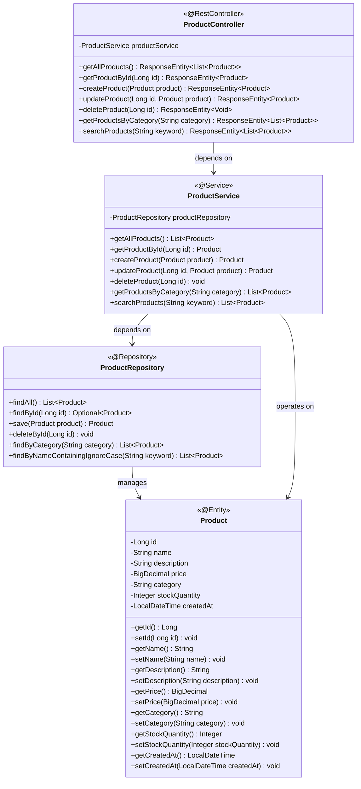
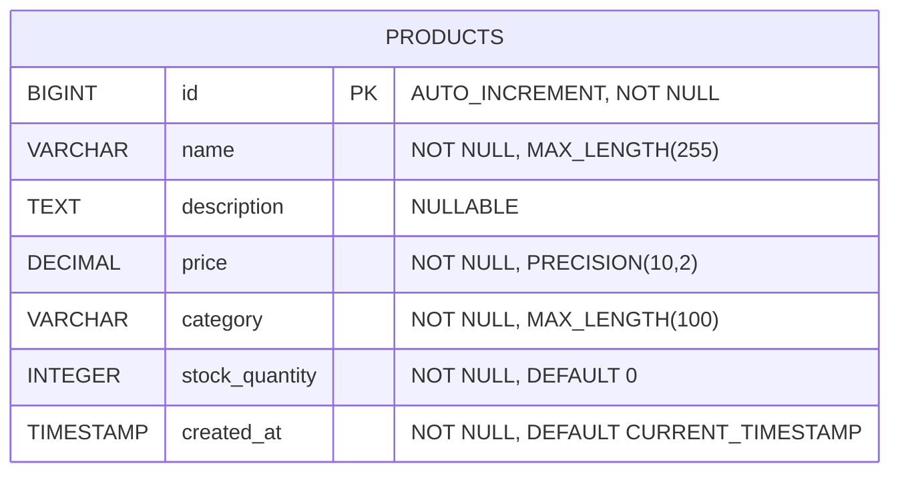
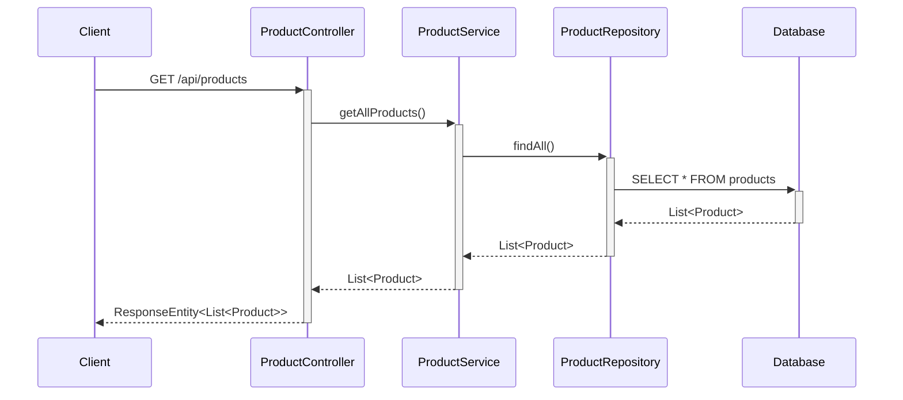
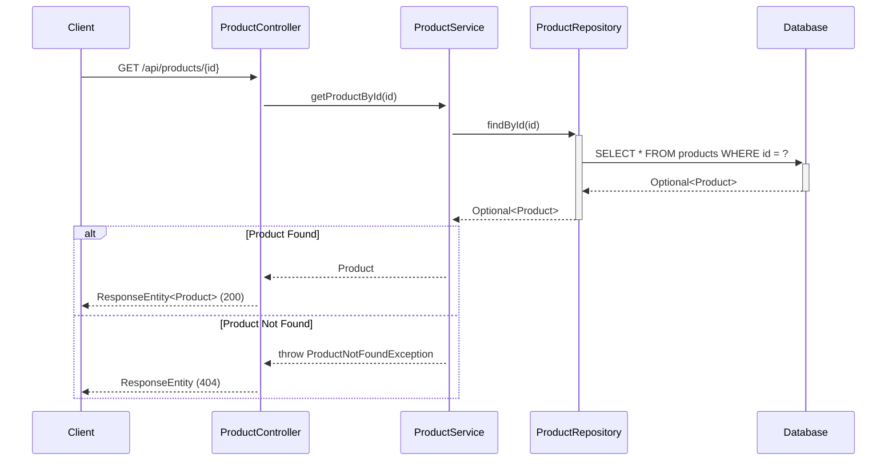
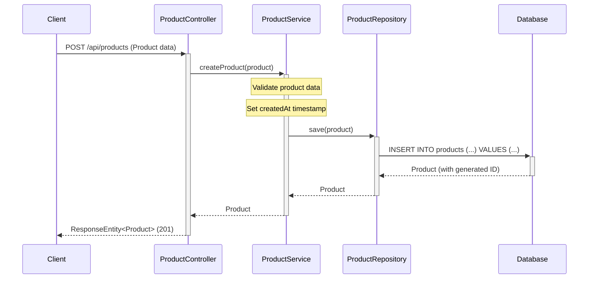
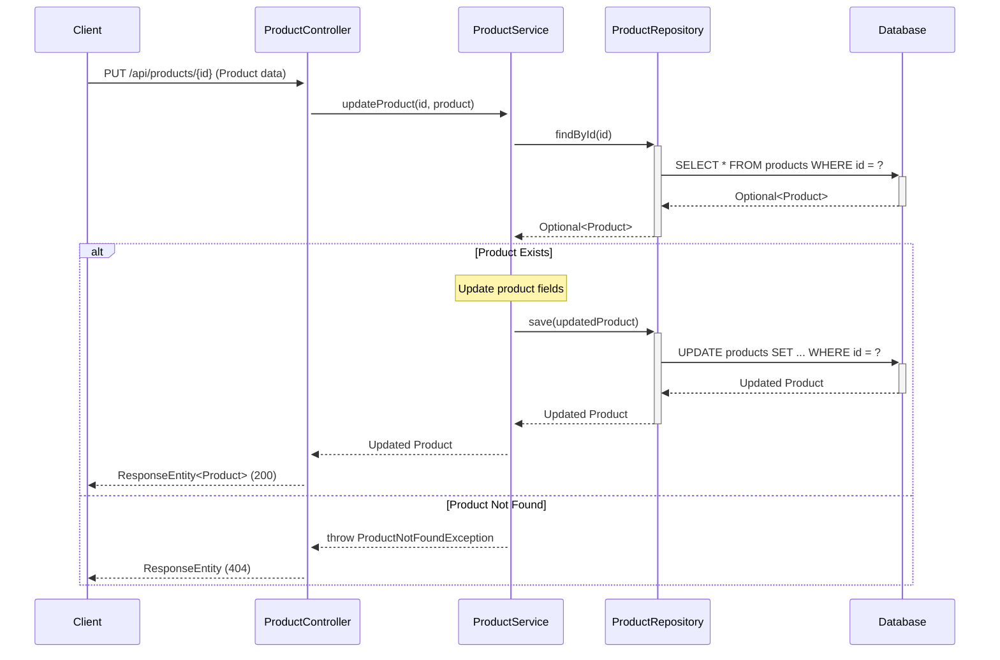
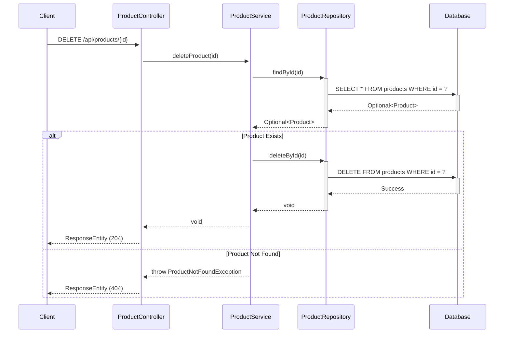
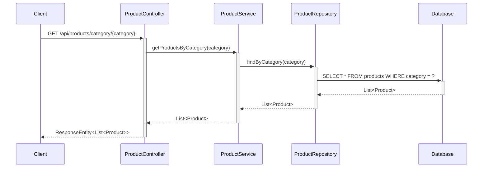
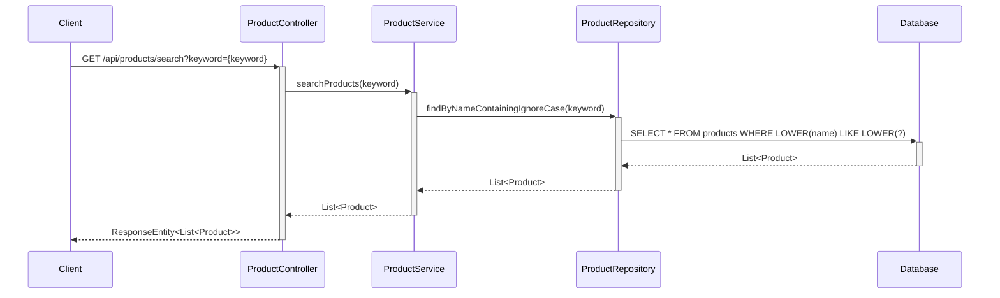

# Low-Level Design (LLD) - E-commerce Product Management System

## 1. Project Overview

**Framework:** Spring Boot  
**Language:** Java 21  
**Database:** PostgreSQL  
**Module:** ProductManagement  

## 2. System Architecture

### 2.1 Class Diagram


```mermaid
classDiagram
    class ProductController {
        <<@RestController>>
        -ProductService productService
        +getAllProducts() ResponseEntity~List~Product~~
        +getProductById(Long id) ResponseEntity~Product~
        +createProduct(Product product) ResponseEntity~Product~
        +updateProduct(Long id, Product product) ResponseEntity~Product~
        +deleteProduct(Long id) ResponseEntity~Void~
        +getProductsByCategory(String category) ResponseEntity~List~Product~~
        +searchProducts(String keyword) ResponseEntity~List~Product~~
    }
    
    class ProductService {
        <<@Service>>
        -ProductRepository productRepository
        +getAllProducts() List~Product~
        +getProductById(Long id) Product
        +createProduct(Product product) Product
        +updateProduct(Long id, Product product) Product
        +deleteProduct(Long id) void
        +getProductsByCategory(String category) List~Product~
        +searchProducts(String keyword) List~Product~
    }
    
    class ProductRepository {
        <<@Repository>>
        <<interface>>
        +findAll() List~Product~
        +findById(Long id) Optional~Product~
        +save(Product product) Product
        +deleteById(Long id) void
        +findByCategory(String category) List~Product~
        +findByNameContainingIgnoreCase(String keyword) List~Product~
    }
    
    class Product {
        <<@Entity>>
        -Long id
        -String name
        -String description
        -BigDecimal price
        -String category
        -Integer stockQuantity
        -LocalDateTime createdAt
        +getId() Long
        +setId(Long id) void
        +getName() String
        +setName(String name) void
        +getDescription() String
        +setDescription(String description) void
        +getPrice() BigDecimal
        +setPrice(BigDecimal price) void
        +getCategory() String
        +setCategory(String category) void
        +getStockQuantity() Integer
        +setStockQuantity(Integer stockQuantity) void
        +getCreatedAt() LocalDateTime
        +setCreatedAt(LocalDateTime createdAt) void
    }
    
    ProductController --> ProductService : depends on
    ProductService --> ProductRepository : depends on
    ProductRepository --> Product : manages
    ProductService --> Product : operates on
```

### 2.2 Entity Relationship Diagram


```mermaid
erDiagram
    PRODUCTS {
        BIGINT id PK "AUTO_INCREMENT, NOT NULL"
        VARCHAR name "NOT NULL, MAX_LENGTH(255)"
        TEXT description "NULLABLE"
        DECIMAL price "NOT NULL, PRECISION(10,2)"
        VARCHAR category "NOT NULL, MAX_LENGTH(100)"
        INTEGER stock_quantity "NOT NULL, DEFAULT 0"
        TIMESTAMP created_at "NOT NULL, DEFAULT CURRENT_TIMESTAMP"
    }
```

## 3. Sequence Diagrams

### 3.1 Get All Products


```mermaid
sequenceDiagram
    participant Client
    participant ProductController
    participant ProductService
    participant ProductRepository
    participant Database
    
    Client->>+ProductController: GET /api/products
    ProductController->>+ProductService: getAllProducts()
    ProductService->>+ProductRepository: findAll()
    ProductRepository->>+Database: SELECT * FROM products
    Database-->>-ProductRepository: List<Product>
    ProductRepository-->>-ProductService: List<Product>
    ProductService-->>-ProductController: List<Product>
    ProductController-->>-Client: ResponseEntity<List<Product>>
```

### 3.2 Get Product By ID


```mermaid
sequenceDiagram
    participant Client
    participant ProductController
    participant ProductService
    participant ProductRepository
    participant Database
    
    Client->>+ProductController: GET /api/products/{id}
    ProductController->>+ProductService: getProductById(id)
    ProductService->>+ProductRepository: findById(id)
    ProductRepository->>+Database: SELECT * FROM products WHERE id = ?
    Database-->>-ProductRepository: Optional<Product>
    ProductRepository-->>-ProductService: Optional<Product>
    
    alt Product Found
        ProductService-->>ProductController: Product
        ProductController-->>Client: ResponseEntity<Product> (200)
    else Product Not Found
        ProductService-->>ProductController: throw ProductNotFoundException
        ProductController-->>Client: ResponseEntity (404)
    end
```

### 3.3 Create Product


```mermaid
sequenceDiagram
    participant Client
    participant ProductController
    participant ProductService
    participant ProductRepository
    participant Database
    
    Client->>+ProductController: POST /api/products (Product data)
    ProductController->>+ProductService: createProduct(product)
    
    Note over ProductService: Validate product data
    Note over ProductService: Set createdAt timestamp
    
    ProductService->>+ProductRepository: save(product)
    ProductRepository->>+Database: INSERT INTO products (...) VALUES (...)
    Database-->>-ProductRepository: Product (with generated ID)
    ProductRepository-->>-ProductService: Product
    ProductService-->>-ProductController: Product
    ProductController-->>-Client: ResponseEntity<Product> (201)
```

### 3.4 Update Product


```mermaid
sequenceDiagram
    participant Client
    participant ProductController
    participant ProductService
    participant ProductRepository
    participant Database
    
    Client->>+ProductController: PUT /api/products/{id} (Product data)
    ProductController->>+ProductService: updateProduct(id, product)
    
    ProductService->>+ProductRepository: findById(id)
    ProductRepository->>+Database: SELECT * FROM products WHERE id = ?
    Database-->>-ProductRepository: Optional<Product>
    ProductRepository-->>-ProductService: Optional<Product>
    
    alt Product Exists
        Note over ProductService: Update product fields
        ProductService->>+ProductRepository: save(updatedProduct)
        ProductRepository->>+Database: UPDATE products SET ... WHERE id = ?
        Database-->>-ProductRepository: Updated Product
        ProductRepository-->>-ProductService: Updated Product
        ProductService-->>ProductController: Updated Product
        ProductController-->>Client: ResponseEntity<Product> (200)
    else Product Not Found
        ProductService-->>ProductController: throw ProductNotFoundException
        ProductController-->>Client: ResponseEntity (404)
    end
```

### 3.5 Delete Product


```mermaid
sequenceDiagram
    participant Client
    participant ProductController
    participant ProductService
    participant ProductRepository
    participant Database
    
    Client->>+ProductController: DELETE /api/products/{id}
    ProductController->>+ProductService: deleteProduct(id)
    
    ProductService->>+ProductRepository: findById(id)
    ProductRepository->>+Database: SELECT * FROM products WHERE id = ?
    Database-->>-ProductRepository: Optional<Product>
    ProductRepository-->>-ProductService: Optional<Product>
    
    alt Product Exists
        ProductService->>+ProductRepository: deleteById(id)
        ProductRepository->>+Database: DELETE FROM products WHERE id = ?
        Database-->>-ProductRepository: Success
        ProductRepository-->>-ProductService: void
        ProductService-->>ProductController: void
        ProductController-->>Client: ResponseEntity (204)
    else Product Not Found
        ProductService-->>ProductController: throw ProductNotFoundException
        ProductController-->>Client: ResponseEntity (404)
    end
```

### 3.6 Get Products By Category


```mermaid
sequenceDiagram
    participant Client
    participant ProductController
    participant ProductService
    participant ProductRepository
    participant Database
    
    Client->>+ProductController: GET /api/products/category/{category}
    ProductController->>+ProductService: getProductsByCategory(category)
    ProductService->>+ProductRepository: findByCategory(category)
    ProductRepository->>+Database: SELECT * FROM products WHERE category = ?
    Database-->>-ProductRepository: List<Product>
    ProductRepository-->>-ProductService: List<Product>
    ProductService-->>-ProductController: List<Product>
    ProductController-->>-Client: ResponseEntity<List<Product>>
```

### 3.7 Search Products


```mermaid
sequenceDiagram
    participant Client
    participant ProductController
    participant ProductService
    participant ProductRepository
    participant Database
    
    Client->>+ProductController: GET /api/products/search?keyword={keyword}
    ProductController->>+ProductService: searchProducts(keyword)
    ProductService->>+ProductRepository: findByNameContainingIgnoreCase(keyword)
    ProductRepository->>+Database: SELECT * FROM products WHERE LOWER(name) LIKE LOWER(?)
    Database-->>-ProductRepository: List<Product>
    ProductRepository-->>-ProductService: List<Product>
    ProductService-->>-ProductController: List<Product>
    ProductController-->>-Client: ResponseEntity<List<Product>>
```

## 4. API Endpoints Summary

| Method | Endpoint | Description | Request Body | Response |
|--------|----------|-------------|--------------|----------|
| GET | `/api/products` | Get all products | None | List<Product> |
| GET | `/api/products/{id}` | Get product by ID | None | Product |
| POST | `/api/products` | Create new product | Product | Product |
| PUT | `/api/products/{id}` | Update existing product | Product | Product |
| DELETE | `/api/products/{id}` | Delete product | None | None |
| GET | `/api/products/category/{category}` | Get products by category | None | List<Product> |
| GET | `/api/products/search?keyword={keyword}` | Search products by name | None | List<Product> |

## 5. Database Schema

### Products Table

```sql
CREATE TABLE products (
    id BIGINT PRIMARY KEY AUTO_INCREMENT,
    name VARCHAR(255) NOT NULL,
    description TEXT,
    price DECIMAL(10,2) NOT NULL,
    category VARCHAR(100) NOT NULL,
    stock_quantity INTEGER NOT NULL DEFAULT 0,
    created_at TIMESTAMP NOT NULL DEFAULT CURRENT_TIMESTAMP
);

CREATE INDEX idx_products_category ON products(category);
CREATE INDEX idx_products_name ON products(name);
```

## 6. Technology Stack

- **Backend Framework:** Spring Boot 3.x
- **Language:** Java 21
- **Database:** PostgreSQL
- **ORM:** Spring Data JPA / Hibernate
- **Build Tool:** Maven/Gradle
- **API Documentation:** Swagger/OpenAPI 3

## 7. Design Patterns Used

1. **MVC Pattern:** Separation of Controller, Service, and Repository layers
2. **Repository Pattern:** Data access abstraction through ProductRepository
3. **Dependency Injection:** Spring's IoC container manages dependencies
4. **DTO Pattern:** Data Transfer Objects for API requests/responses
5. **Exception Handling:** Custom exceptions for business logic errors

## 8. Key Features

- RESTful API design following HTTP standards
- Proper HTTP status codes for different scenarios
- Input validation and error handling
- Database indexing for performance optimization
- Transactional operations for data consistency
- Pagination support for large datasets (can be extended)
- Search functionality with case-insensitive matching

## 9. Shopping Cart Module

### 9.1 UI Components - Product Details Table

The Shopping Cart interface must display a Product Details Table with the following mandatory data fields for each cart item:

**Mandatory Display Fields:**

1. **Product Name** - The full name of the product as stored in the products table
2. **Unit Price** - The individual price per unit of the product (formatted as currency with 2 decimal places)
3. **Quantity** - The number of units of this product in the cart (editable field)
4. **Line Item Subtotal** - The calculated subtotal for this specific product line (Unit Price × Quantity)

**Display Format:**

| Product Name | Unit Price | Quantity | Line Item Subtotal |
|--------------|------------|----------|--------------------|
| Product A | $XX.XX | N | $XXX.XX |
| Product B | $XX.XX | N | $XXX.XX |

**UI Requirements:**
- All monetary values must be displayed with currency symbol and 2 decimal places
- Quantity field must be editable with increment/decrement controls
- Line Item Subtotal must update automatically when quantity changes
- Product Name should be clickable and link to product detail page

### 9.2 Functional Requirements - Price Calculations

The Shopping Cart module must implement the following calculation logic with explicit formulas:

**Calculation Formulas:**

1. **Line Item Subtotal Calculation:**
   ```
   Line Item Subtotal = Unit Price × Quantity
   ```
   - Applied individually to each product in the cart
   - Recalculated automatically whenever quantity is modified
   - Rounded to 2 decimal places using HALF_UP rounding mode

2. **Cart Subtotal Calculation:**
   ```
   Cart Subtotal = Σ(Line Item Subtotal for all items)
   ```
   - Sum of all individual line item subtotals
   - Represents the total cost of all products before taxes, shipping, or discounts
   - Rounded to 2 decimal places using HALF_UP rounding mode

3. **Total Calculation Formula:**
   ```
   Total = Cart Subtotal + Shipping Cost + Tax - Discount Amount
   ```
   Where:
   - **Shipping Cost:** Calculated based on shipping method selected (flat rate, weight-based, or free shipping threshold)
   - **Tax:** Calculated as `Cart Subtotal × Tax Rate` (tax rate based on delivery location)
   - **Discount Amount:** Applied from coupon codes or promotional offers (can be percentage or fixed amount)
   - Final Total rounded to 2 decimal places using HALF_UP rounding mode

4. **Rounding Rules for Currency Display:**
   - All monetary calculations must use `BigDecimal` with `DECIMAL128` precision
   - Intermediate calculations maintain full precision
   - Display values rounded to 2 decimal places using `RoundingMode.HALF_UP`
   - Currency symbol ($) prepended to all displayed amounts
   - Thousand separators (,) used for amounts ≥ 1,000

**Calculation Triggers:**
- Recalculate all values when:
  - Product quantity is modified
  - Product is added to cart
  - Product is removed from cart
  - Shipping method is changed
  - Discount code is applied or removed
  - Delivery location is updated (affects tax)

**Cost Breakdown Display:**

The cart must display a clear cost breakdown section:

```
Cart Subtotal:        $XXX.XX
Shipping:             $XX.XX
Tax (X.X%):          $XX.XX
Discount:            -$XX.XX
─────────────────────────────
Total:               $XXX.XX
```

**Implementation Notes:**
- All price calculations must be performed server-side for security
- Client-side calculations are for display purposes only and must be validated server-side
- Prevent race conditions during concurrent cart updates using optimistic locking
- Log all price calculation operations for audit purposes