# Low-Level Design (LLD) - E-commerce Product Management System

## 1. Project Overview

**Framework:** Spring Boot  
**Language:** Java 21  
**Database:** PostgreSQL  
**Module:** ProductManagement  

## 2. System Architecture

### 2.1 Class Diagram

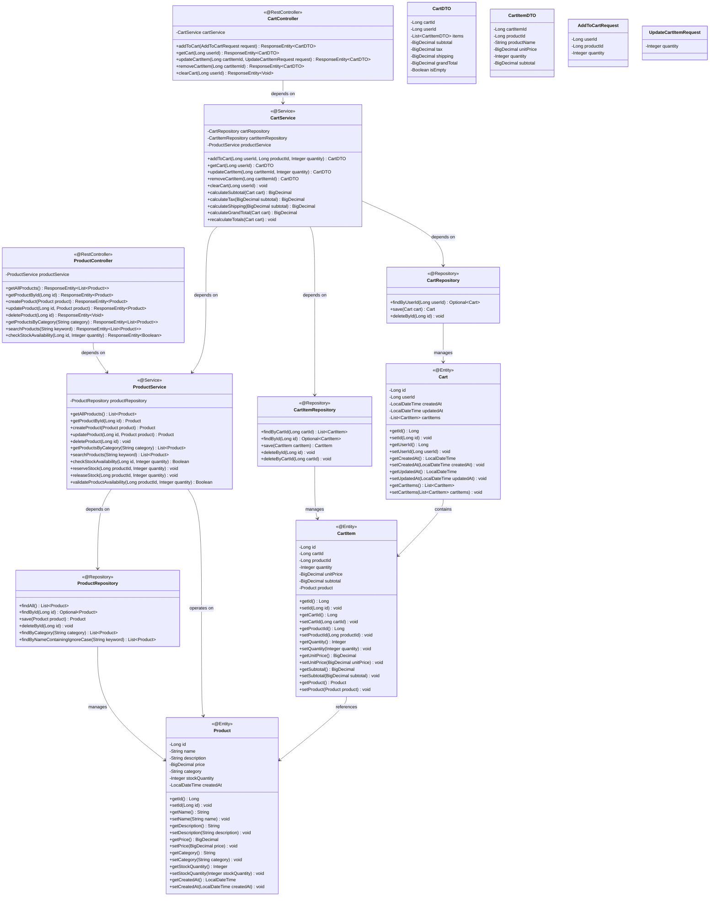
```mermaid
classDiagram
    class ProductController {
        <<@RestController>>
        -ProductService productService
        +getAllProducts() ResponseEntity~List~Product~~
        +getProductById(Long id) ResponseEntity~Product~
        +createProduct(Product product) ResponseEntity~Product~
        +updateProduct(Long id, Product product) ResponseEntity~Product~
        +deleteProduct(Long id) ResponseEntity~Void~
        +getProductsByCategory(String category) ResponseEntity~List~Product~~
        +searchProducts(String keyword) ResponseEntity~List~Product~~
        +checkStockAvailability(Long id, Integer quantity) ResponseEntity~Boolean~
    }
    
    class ProductService {
        <<@Service>>
        -ProductRepository productRepository
        +getAllProducts() List~Product~
        +getProductById(Long id) Product
        +createProduct(Product product) Product
        +updateProduct(Long id, Product product) Product
        +deleteProduct(Long id) void
        +getProductsByCategory(String category) List~Product~
        +searchProducts(String keyword) List~Product~
        +checkStockAvailability(Long id, Integer quantity) Boolean
        +reserveStock(Long productId, Integer quantity) void
        +releaseStock(Long productId, Integer quantity) void
        +validateProductAvailability(Long productId, Integer quantity) Boolean
    }
    
    class ProductRepository {
        <<@Repository>>
        <<interface>>
        +findAll() List~Product~
        +findById(Long id) Optional~Product~
        +save(Product product) Product
        +deleteById(Long id) void
        +findByCategory(String category) List~Product~
        +findByNameContainingIgnoreCase(String keyword) List~Product~
    }
    
    class Product {
        <<@Entity>>
        -Long id
        -String name
        -String description
        -BigDecimal price
        -String category
        -Integer stockQuantity
        -LocalDateTime createdAt
        +getId() Long
        +setId(Long id) void
        +getName() String
        +setName(String name) void
        +getDescription() String
        +setDescription(String description) void
        +getPrice() BigDecimal
        +setPrice(BigDecimal price) void
        +getCategory() String
        +setCategory(String category) void
        +getStockQuantity() Integer
        +setStockQuantity(Integer stockQuantity) void
        +getCreatedAt() LocalDateTime
        +setCreatedAt(LocalDateTime createdAt) void
    }
    
    class CartController {
        <<@RestController>>
        -CartService cartService
        +addToCart(AddToCartRequest request) ResponseEntity~CartDTO~
        +getCart(Long userId) ResponseEntity~CartDTO~
        +updateCartItem(Long cartItemId, UpdateCartItemRequest request) ResponseEntity~CartDTO~
        +removeCartItem(Long cartItemId) ResponseEntity~CartDTO~
        +clearCart(Long userId) ResponseEntity~Void~
    }
    
    class CartService {
        <<@Service>>
        -CartRepository cartRepository
        -CartItemRepository cartItemRepository
        -ProductService productService
        +addToCart(Long userId, Long productId, Integer quantity) CartDTO
        +getCart(Long userId) CartDTO
        +updateCartItem(Long cartItemId, Integer quantity) CartDTO
        +removeCartItem(Long cartItemId) CartDTO
        +clearCart(Long userId) void
        +calculateSubtotal(Cart cart) BigDecimal
        +calculateTax(BigDecimal subtotal) BigDecimal
        +calculateShipping(BigDecimal subtotal) BigDecimal
        +calculateGrandTotal(Cart cart) BigDecimal
        +recalculateTotals(Cart cart) void
    }
    
    class CartRepository {
        <<@Repository>>
        <<interface>>
        +findByUserId(Long userId) Optional~Cart~
        +save(Cart cart) Cart
        +deleteById(Long id) void
    }
    
    class CartItemRepository {
        <<@Repository>>
        <<interface>>
        +findByCartId(Long cartId) List~CartItem~
        +findById(Long id) Optional~CartItem~
        +save(CartItem cartItem) CartItem
        +deleteById(Long id) void
        +deleteByCartId(Long cartId) void
    }
    
    class Cart {
        <<@Entity>>
        -Long id
        -Long userId
        -LocalDateTime createdAt
        -LocalDateTime updatedAt
        -List~CartItem~ cartItems
        +getId() Long
        +setId(Long id) void
        +getUserId() Long
        +setUserId(Long userId) void
        +getCreatedAt() LocalDateTime
        +setCreatedAt(LocalDateTime createdAt) void
        +getUpdatedAt() LocalDateTime
        +setUpdatedAt(LocalDateTime updatedAt) void
        +getCartItems() List~CartItem~
        +setCartItems(List~CartItem~ cartItems) void
    }
    
    class CartItem {
        <<@Entity>>
        -Long id
        -Long cartId
        -Long productId
        -Integer quantity
        -BigDecimal unitPrice
        -BigDecimal subtotal
        -Product product
        +getId() Long
        +setId(Long id) void
        +getCartId() Long
        +setCartId(Long cartId) void
        +getProductId() Long
        +setProductId(Long productId) void
        +getQuantity() Integer
        +setQuantity(Integer quantity) void
        +getUnitPrice() BigDecimal
        +setUnitPrice(BigDecimal unitPrice) void
        +getSubtotal() BigDecimal
        +setSubtotal(BigDecimal subtotal) void
        +getProduct() Product
        +setProduct(Product product) void
    }
    
    class CartDTO {
        -Long cartId
        -Long userId
        -List~CartItemDTO~ items
        -BigDecimal subtotal
        -BigDecimal tax
        -BigDecimal shipping
        -BigDecimal grandTotal
        -Boolean isEmpty
    }
    
    class CartItemDTO {
        -Long cartItemId
        -Long productId
        -String productName
        -BigDecimal unitPrice
        -Integer quantity
        -BigDecimal subtotal
    }
    
    class AddToCartRequest {
        -Long userId
        -Long productId
        -Integer quantity
    }
    
    class UpdateCartItemRequest {
        -Integer quantity
    }
    
    ProductController --> ProductService : depends on
    ProductService --> ProductRepository : depends on
    ProductRepository --> Product : manages
    ProductService --> Product : operates on
    CartController --> CartService : depends on
    CartService --> CartRepository : depends on
    CartService --> CartItemRepository : depends on
    CartService --> ProductService : depends on
    CartRepository --> Cart : manages
    CartItemRepository --> CartItem : manages
    Cart --> CartItem : contains
    CartItem --> Product : references
```

### 2.2 Entity Relationship Diagram

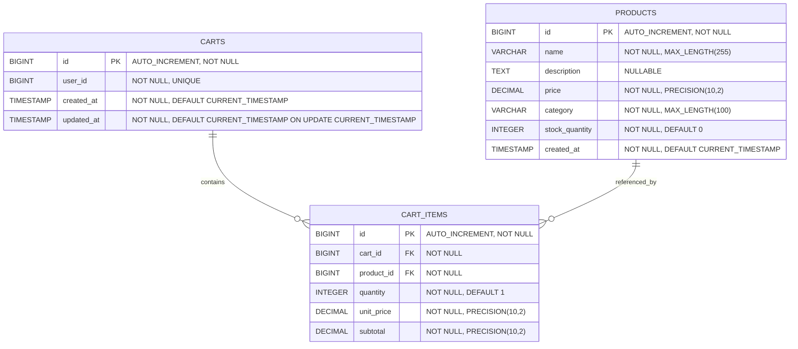
```mermaid
erDiagram
    PRODUCTS {
        BIGINT id PK "AUTO_INCREMENT, NOT NULL"
        VARCHAR name "NOT NULL, MAX_LENGTH(255)"
        TEXT description "NULLABLE"
        DECIMAL price "NOT NULL, PRECISION(10,2)"
        VARCHAR category "NOT NULL, MAX_LENGTH(100)"
        INTEGER stock_quantity "NOT NULL, DEFAULT 0"
        TIMESTAMP created_at "NOT NULL, DEFAULT CURRENT_TIMESTAMP"
    }
    
    CARTS {
        BIGINT id PK "AUTO_INCREMENT, NOT NULL"
        BIGINT user_id "NOT NULL, UNIQUE"
        TIMESTAMP created_at "NOT NULL, DEFAULT CURRENT_TIMESTAMP"
        TIMESTAMP updated_at "NOT NULL, DEFAULT CURRENT_TIMESTAMP ON UPDATE CURRENT_TIMESTAMP"
    }
    
    CART_ITEMS {
        BIGINT id PK "AUTO_INCREMENT, NOT NULL"
        BIGINT cart_id FK "NOT NULL"
        BIGINT product_id FK "NOT NULL"
        INTEGER quantity "NOT NULL, DEFAULT 1"
        DECIMAL unit_price "NOT NULL, PRECISION(10,2)"
        DECIMAL subtotal "NOT NULL, PRECISION(10,2)"
    }
    
    CARTS ||--o{ CART_ITEMS : contains
    PRODUCTS ||--o{ CART_ITEMS : referenced_by
```

## 3. Sequence Diagrams

### 3.1 Get All Products

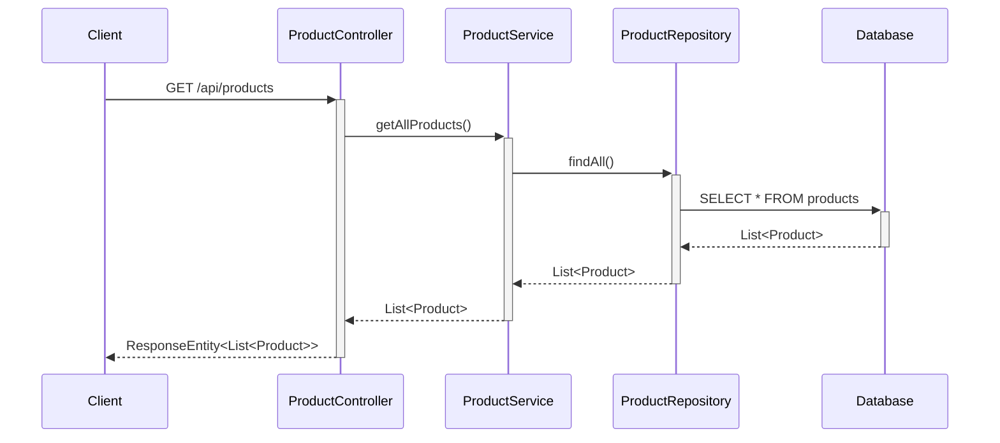
```mermaid
sequenceDiagram
    participant Client
    participant ProductController
    participant ProductService
    participant ProductRepository
    participant Database
    
    Client->>+ProductController: GET /api/products
    ProductController->>+ProductService: getAllProducts()
    ProductService->>+ProductRepository: findAll()
    ProductRepository->>+Database: SELECT * FROM products
    Database-->>-ProductRepository: List<Product>
    ProductRepository-->>-ProductService: List<Product>
    ProductService-->>-ProductController: List<Product>
    ProductController-->>-Client: ResponseEntity<List<Product>>
```

### 3.2 Get Product By ID

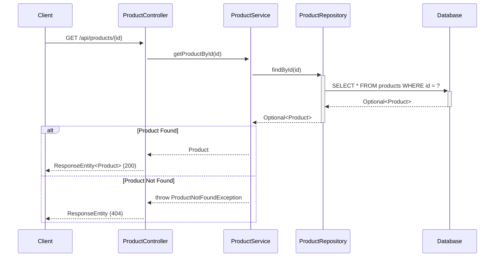
```mermaid
sequenceDiagram
    participant Client
    participant ProductController
    participant ProductService
    participant ProductRepository
    participant Database
    
    Client->>+ProductController: GET /api/products/{id}
    ProductController->>+ProductService: getProductById(id)
    ProductService->>+ProductRepository: findById(id)
    ProductRepository->>+Database: SELECT * FROM products WHERE id = ?
    Database-->>-ProductRepository: Optional<Product>
    ProductRepository-->>-ProductService: Optional<Product>
    
    alt Product Found
        ProductService-->>ProductController: Product
        ProductController-->>Client: ResponseEntity<Product> (200)
    else Product Not Found
        ProductService-->>ProductController: throw ProductNotFoundException
        ProductController-->>Client: ResponseEntity (404)
    end
```

### 3.3 Create Product

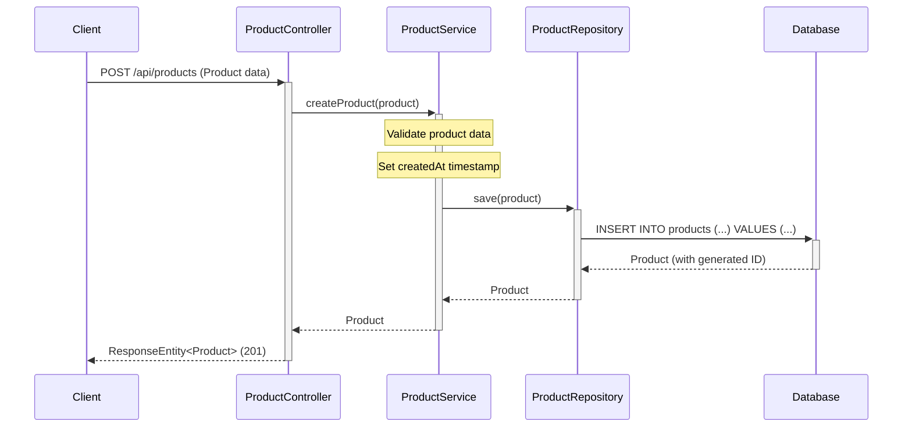
```mermaid
sequenceDiagram
    participant Client
    participant ProductController
    participant ProductService
    participant ProductRepository
    participant Database
    
    Client->>+ProductController: POST /api/products (Product data)
    ProductController->>+ProductService: createProduct(product)
    
    Note over ProductService: Validate product data
    Note over ProductService: Set createdAt timestamp
    
    ProductService->>+ProductRepository: save(product)
    ProductRepository->>+Database: INSERT INTO products (...) VALUES (...)
    Database-->>-ProductRepository: Product (with generated ID)
    ProductRepository-->>-ProductService: Product
    ProductService-->>-ProductController: Product
    ProductController-->>-Client: ResponseEntity<Product> (201)
```

### 3.4 Update Product

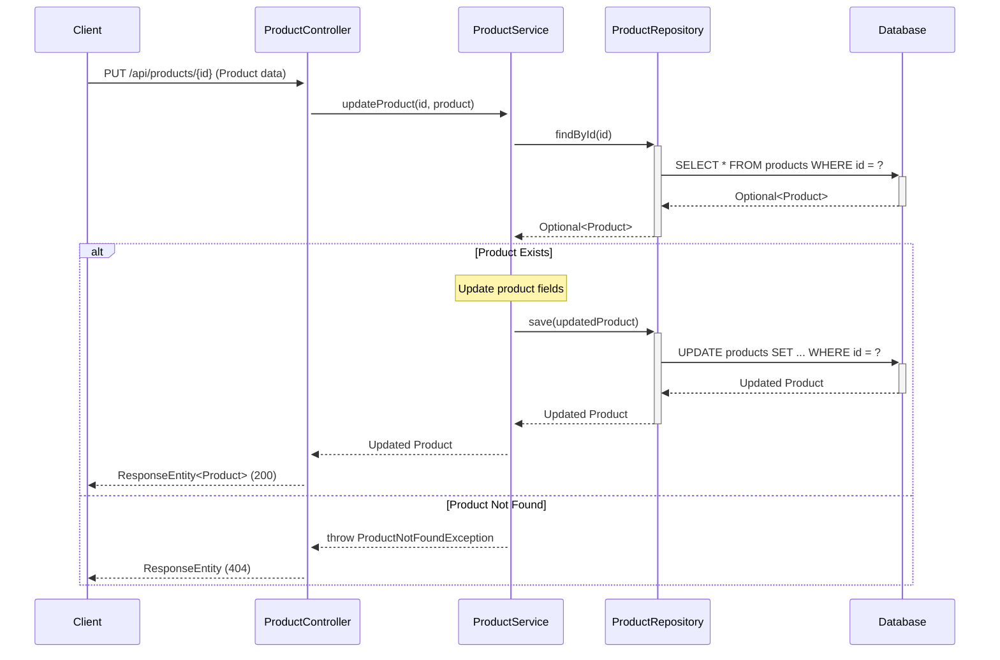
```mermaid
sequenceDiagram
    participant Client
    participant ProductController
    participant ProductService
    participant ProductRepository
    participant Database
    
    Client->>+ProductController: PUT /api/products/{id} (Product data)
    ProductController->>+ProductService: updateProduct(id, product)
    
    ProductService->>+ProductRepository: findById(id)
    ProductRepository->>+Database: SELECT * FROM products WHERE id = ?
    Database-->>-ProductRepository: Optional<Product>
    ProductRepository-->>-ProductService: Optional<Product>
    
    alt Product Exists
        Note over ProductService: Update product fields
        ProductService->>+ProductRepository: save(updatedProduct)
        ProductRepository->>+Database: UPDATE products SET ... WHERE id = ?
        Database-->>-ProductRepository: Updated Product
        ProductRepository-->>-ProductService: Updated Product
        ProductService-->>ProductController: Updated Product
        ProductController-->>Client: ResponseEntity<Product> (200)
    else Product Not Found
        ProductService-->>ProductController: throw ProductNotFoundException
        ProductController-->>Client: ResponseEntity (404)
    end
```

### 3.5 Delete Product

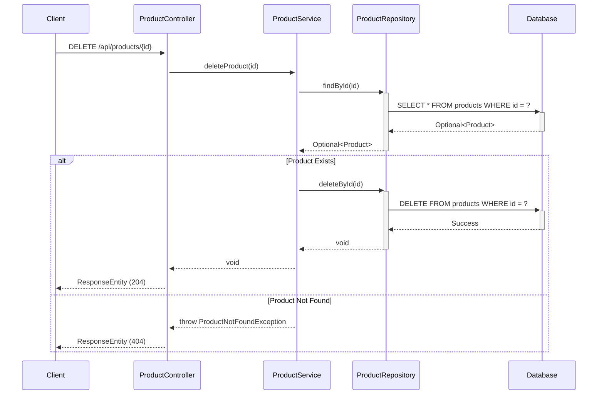
```mermaid
sequenceDiagram
    participant Client
    participant ProductController
    participant ProductService
    participant ProductRepository
    participant Database
    
    Client->>+ProductController: DELETE /api/products/{id}
    ProductController->>+ProductService: deleteProduct(id)
    
    ProductService->>+ProductRepository: findById(id)
    ProductRepository->>+Database: SELECT * FROM products WHERE id = ?
    Database-->>-ProductRepository: Optional<Product>
    ProductRepository-->>-ProductService: Optional<Product>
    
    alt Product Exists
        ProductService->>+ProductRepository: deleteById(id)
        ProductRepository->>+Database: DELETE FROM products WHERE id = ?
        Database-->>-ProductRepository: Success
        ProductRepository-->>-ProductService: void
        ProductService-->>ProductController: void
        ProductController-->>Client: ResponseEntity (204)
    else Product Not Found
        ProductService-->>ProductController: throw ProductNotFoundException
        ProductController-->>Client: ResponseEntity (404)
    end
```

### 3.6 Get Products By Category

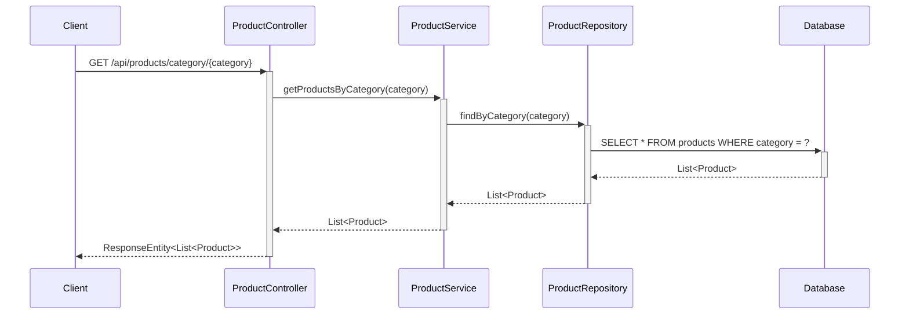
```mermaid
sequenceDiagram
    participant Client
    participant ProductController
    participant ProductService
    participant ProductRepository
    participant Database
    
    Client->>+ProductController: GET /api/products/category/{category}
    ProductController->>+ProductService: getProductsByCategory(category)
    ProductService->>+ProductRepository: findByCategory(category)
    ProductRepository->>+Database: SELECT * FROM products WHERE category = ?
    Database-->>-ProductRepository: List<Product>
    ProductRepository-->>-ProductService: List<Product>
    ProductService-->>-ProductController: List<Product>
    ProductController-->>-Client: ResponseEntity<List<Product>>
```

### 3.7 Search Products

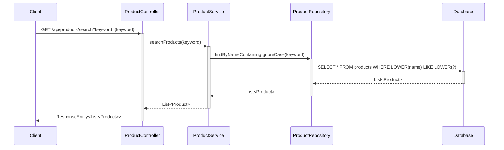
```mermaid
sequenceDiagram
    participant Client
    participant ProductController
    participant ProductService
    participant ProductRepository
    participant Database
    
    Client->>+ProductController: GET /api/products/search?keyword={keyword}
    ProductController->>+ProductService: searchProducts(keyword)
    ProductService->>+ProductRepository: findByNameContainingIgnoreCase(keyword)
    ProductRepository->>+Database: SELECT * FROM products WHERE LOWER(name) LIKE LOWER(?)
    Database-->>-ProductRepository: List<Product>
    ProductRepository-->>-ProductService: List<Product>
    ProductService-->>-ProductController: List<Product>
    ProductController-->>-Client: ResponseEntity<List<Product>>
```

### 3.8 Add To Cart

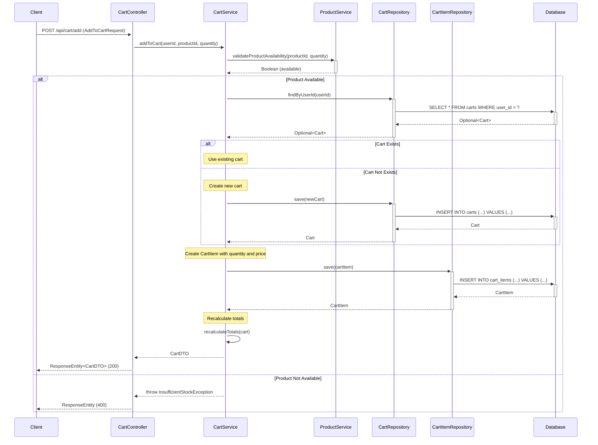
```mermaid
sequenceDiagram
    participant Client
    participant CartController
    participant CartService
    participant ProductService
    participant CartRepository
    participant CartItemRepository
    participant Database
    
    Client->>+CartController: POST /api/cart/add (AddToCartRequest)
    CartController->>+CartService: addToCart(userId, productId, quantity)
    
    CartService->>+ProductService: validateProductAvailability(productId, quantity)
    ProductService-->>-CartService: Boolean (available)
    
    alt Product Available
        CartService->>+CartRepository: findByUserId(userId)
        CartRepository->>+Database: SELECT * FROM carts WHERE user_id = ?
        Database-->>-CartRepository: Optional<Cart>
        CartRepository-->>-CartService: Optional<Cart>
        
        alt Cart Exists
            Note over CartService: Use existing cart
        else Cart Not Exists
            Note over CartService: Create new cart
            CartService->>+CartRepository: save(newCart)
            CartRepository->>+Database: INSERT INTO carts (...) VALUES (...)
            Database-->>-CartRepository: Cart
            CartRepository-->>-CartService: Cart
        end
        
        Note over CartService: Create CartItem with quantity and price
        CartService->>+CartItemRepository: save(cartItem)
        CartItemRepository->>+Database: INSERT INTO cart_items (...) VALUES (...)
        Database-->>-CartItemRepository: CartItem
        CartItemRepository-->>-CartService: CartItem
        
        Note over CartService: Recalculate totals
        CartService->>CartService: recalculateTotals(cart)
        
        CartService-->>CartController: CartDTO
        CartController-->>Client: ResponseEntity<CartDTO> (200)
    else Product Not Available
        CartService-->>CartController: throw InsufficientStockException
        CartController-->>Client: ResponseEntity (400)
    end
```

### 3.9 Get Cart

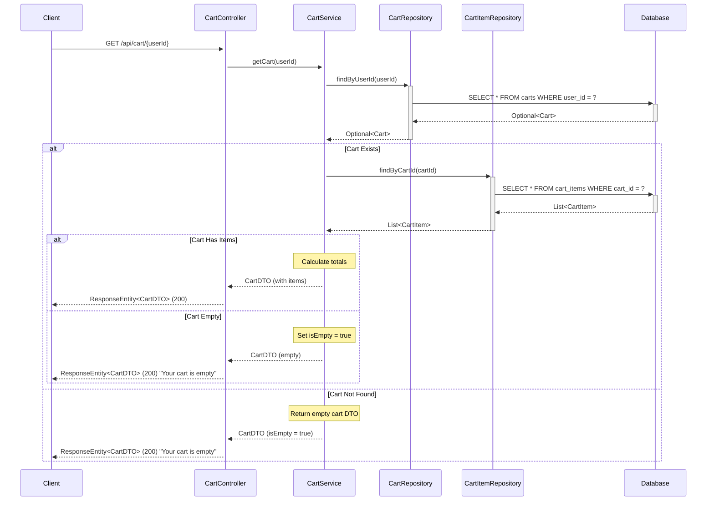
```mermaid
sequenceDiagram
    participant Client
    participant CartController
    participant CartService
    participant CartRepository
    participant CartItemRepository
    participant Database
    
    Client->>+CartController: GET /api/cart/{userId}
    CartController->>+CartService: getCart(userId)
    
    CartService->>+CartRepository: findByUserId(userId)
    CartRepository->>+Database: SELECT * FROM carts WHERE user_id = ?
    Database-->>-CartRepository: Optional<Cart>
    CartRepository-->>-CartService: Optional<Cart>
    
    alt Cart Exists
        CartService->>+CartItemRepository: findByCartId(cartId)
        CartItemRepository->>+Database: SELECT * FROM cart_items WHERE cart_id = ?
        Database-->>-CartItemRepository: List<CartItem>
        CartItemRepository-->>-CartService: List<CartItem>
        
        alt Cart Has Items
            Note over CartService: Calculate totals
            CartService-->>CartController: CartDTO (with items)
            CartController-->>Client: ResponseEntity<CartDTO> (200)
        else Cart Empty
            Note over CartService: Set isEmpty = true
            CartService-->>CartController: CartDTO (empty)
            CartController-->>Client: ResponseEntity<CartDTO> (200) "Your cart is empty"
        end
    else Cart Not Found
        Note over CartService: Return empty cart DTO
        CartService-->>CartController: CartDTO (isEmpty = true)
        CartController-->>Client: ResponseEntity<CartDTO> (200) "Your cart is empty"
    end
```

### 3.10 Update Cart Item

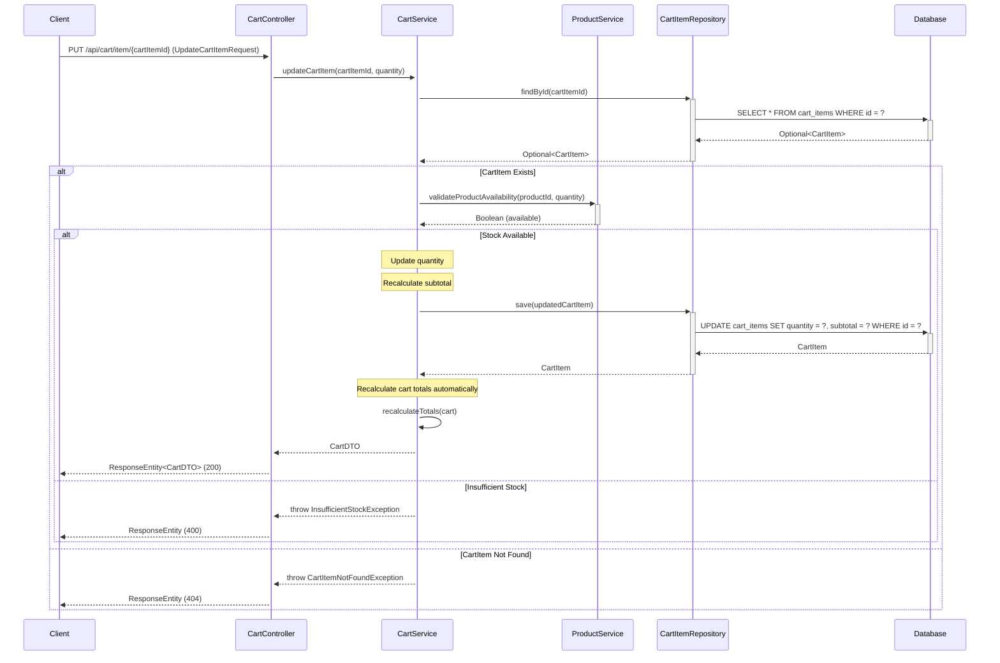
```mermaid
sequenceDiagram
    participant Client
    participant CartController
    participant CartService
    participant ProductService
    participant CartItemRepository
    participant Database
    
    Client->>+CartController: PUT /api/cart/item/{cartItemId} (UpdateCartItemRequest)
    CartController->>+CartService: updateCartItem(cartItemId, quantity)
    
    CartService->>+CartItemRepository: findById(cartItemId)
    CartItemRepository->>+Database: SELECT * FROM cart_items WHERE id = ?
    Database-->>-CartItemRepository: Optional<CartItem>
    CartItemRepository-->>-CartService: Optional<CartItem>
    
    alt CartItem Exists
        CartService->>+ProductService: validateProductAvailability(productId, quantity)
        ProductService-->>-CartService: Boolean (available)
        
        alt Stock Available
            Note over CartService: Update quantity
            Note over CartService: Recalculate subtotal
            CartService->>+CartItemRepository: save(updatedCartItem)
            CartItemRepository->>+Database: UPDATE cart_items SET quantity = ?, subtotal = ? WHERE id = ?
            Database-->>-CartItemRepository: CartItem
            CartItemRepository-->>-CartService: CartItem
            
            Note over CartService: Recalculate cart totals automatically
            CartService->>CartService: recalculateTotals(cart)
            
            CartService-->>CartController: CartDTO
            CartController-->>Client: ResponseEntity<CartDTO> (200)
        else Insufficient Stock
            CartService-->>CartController: throw InsufficientStockException
            CartController-->>Client: ResponseEntity (400)
        end
    else CartItem Not Found
        CartService-->>CartController: throw CartItemNotFoundException
        CartController-->>Client: ResponseEntity (404)
    end
```

### 3.11 Remove Cart Item

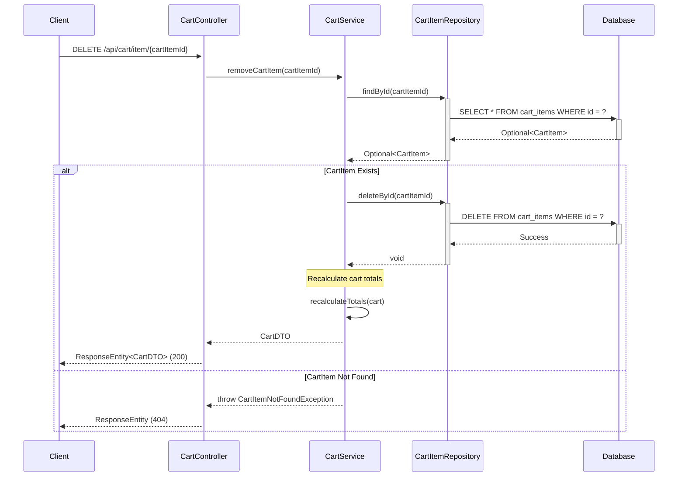
```mermaid
sequenceDiagram
    participant Client
    participant CartController
    participant CartService
    participant CartItemRepository
    participant Database
    
    Client->>+CartController: DELETE /api/cart/item/{cartItemId}
    CartController->>+CartService: removeCartItem(cartItemId)
    
    CartService->>+CartItemRepository: findById(cartItemId)
    CartItemRepository->>+Database: SELECT * FROM cart_items WHERE id = ?
    Database-->>-CartItemRepository: Optional<CartItem>
    CartItemRepository-->>-CartService: Optional<CartItem>
    
    alt CartItem Exists
        CartService->>+CartItemRepository: deleteById(cartItemId)
        CartItemRepository->>+Database: DELETE FROM cart_items WHERE id = ?
        Database-->>-CartItemRepository: Success
        CartItemRepository-->>-CartService: void
        
        Note over CartService: Recalculate cart totals
        CartService->>CartService: recalculateTotals(cart)
        
        CartService-->>CartController: CartDTO
        CartController-->>Client: ResponseEntity<CartDTO> (200)
    else CartItem Not Found
        CartService-->>CartController: throw CartItemNotFoundException
        CartController-->>Client: ResponseEntity (404)
    end
```

### 3.12 Clear Cart

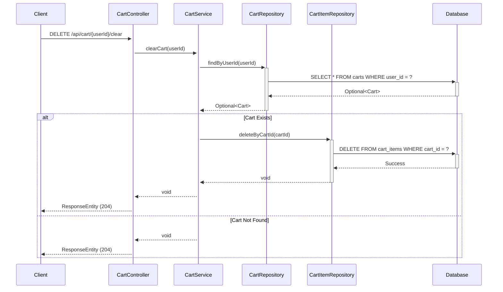
```mermaid
sequenceDiagram
    participant Client
    participant CartController
    participant CartService
    participant CartRepository
    participant CartItemRepository
    participant Database
    
    Client->>+CartController: DELETE /api/cart/{userId}/clear
    CartController->>+CartService: clearCart(userId)
    
    CartService->>+CartRepository: findByUserId(userId)
    CartRepository->>+Database: SELECT * FROM carts WHERE user_id = ?
    Database-->>-CartRepository: Optional<Cart>
    CartRepository-->>-CartService: Optional<Cart>
    
    alt Cart Exists
        CartService->>+CartItemRepository: deleteByCartId(cartId)
        CartItemRepository->>+Database: DELETE FROM cart_items WHERE cart_id = ?
        Database-->>-CartItemRepository: Success
        CartItemRepository-->>-CartService: void
        
        CartService-->>CartController: void
        CartController-->>Client: ResponseEntity (204)
    else Cart Not Found
        CartService-->>CartController: void
        CartController-->>Client: ResponseEntity (204)
    end
```

## 4. API Endpoints Summary

| Method | Endpoint | Description | Request Body | Response |
|--------|----------|-------------|--------------|----------|
| GET | `/api/products` | Get all products | None | List<Product> |
| GET | `/api/products/{id}` | Get product by ID | None | Product |
| POST | `/api/products` | Create new product | Product | Product |
| PUT | `/api/products/{id}` | Update existing product | Product | Product |
| DELETE | `/api/products/{id}` | Delete product | None | None |
| GET | `/api/products/category/{category}` | Get products by category | None | List<Product> |
| GET | `/api/products/search?keyword={keyword}` | Search products by name | None | List<Product> |
| GET | `/api/products/{id}/stock?quantity={quantity}` | Check stock availability | None | Boolean |
| POST | `/api/cart/add` | Add product to cart | AddToCartRequest | CartDTO |
| GET | `/api/cart/{userId}` | Get user's cart | None | CartDTO |
| PUT | `/api/cart/item/{cartItemId}` | Update cart item quantity | UpdateCartItemRequest | CartDTO |
| DELETE | `/api/cart/item/{cartItemId}` | Remove item from cart | None | CartDTO |
| DELETE | `/api/cart/{userId}/clear` | Clear all items from cart | None | None |

## 5. Database Schema

### Products Table

```sql
CREATE TABLE products (
    id BIGINT PRIMARY KEY AUTO_INCREMENT,
    name VARCHAR(255) NOT NULL,
    description TEXT,
    price DECIMAL(10,2) NOT NULL,
    category VARCHAR(100) NOT NULL,
    stock_quantity INTEGER NOT NULL DEFAULT 0,
    created_at TIMESTAMP NOT NULL DEFAULT CURRENT_TIMESTAMP
);

CREATE INDEX idx_products_category ON products(category);
CREATE INDEX idx_products_name ON products(name);
CREATE INDEX idx_products_stock ON products(stock_quantity);
CREATE INDEX idx_products_price ON products(price);
```

### Carts Table

```sql
CREATE TABLE carts (
    id BIGINT PRIMARY KEY AUTO_INCREMENT,
    user_id BIGINT NOT NULL UNIQUE,
    created_at TIMESTAMP NOT NULL DEFAULT CURRENT_TIMESTAMP,
    updated_at TIMESTAMP NOT NULL DEFAULT CURRENT_TIMESTAMP ON UPDATE CURRENT_TIMESTAMP
);

CREATE INDEX idx_carts_user_id ON carts(user_id);
```

### Cart Items Table

```sql
CREATE TABLE cart_items (
    id BIGINT PRIMARY KEY AUTO_INCREMENT,
    cart_id BIGINT NOT NULL,
    product_id BIGINT NOT NULL,
    quantity INTEGER NOT NULL DEFAULT 1,
    unit_price DECIMAL(10,2) NOT NULL,
    subtotal DECIMAL(10,2) NOT NULL,
    FOREIGN KEY (cart_id) REFERENCES carts(id) ON DELETE CASCADE,
    FOREIGN KEY (product_id) REFERENCES products(id) ON DELETE CASCADE,
    CONSTRAINT chk_quantity CHECK (quantity > 0)
);

CREATE INDEX idx_cart_items_cart_id ON cart_items(cart_id);
CREATE INDEX idx_cart_items_product_id ON cart_items(product_id);
```

## 6. Technology Stack

- **Backend Framework:** Spring Boot 3.x
- **Language:** Java 21
- **Database:** PostgreSQL
- **ORM:** Spring Data JPA / Hibernate
- **Build Tool:** Maven/Gradle
- **API Documentation:** Swagger/OpenAPI 3

## 7. Design Patterns Used

1. **MVC Pattern:** Separation of Controller, Service, and Repository layers
2. **Repository Pattern:** Data access abstraction through ProductRepository
3. **Dependency Injection:** Spring's IoC container manages dependencies
4. **DTO Pattern:** Data Transfer Objects for API requests/responses
5. **Exception Handling:** Custom exceptions for business logic errors

## 8. Key Features

- RESTful API design following HTTP standards
- Proper HTTP status codes for different scenarios
- Input validation and error handling
- Database indexing for performance optimization
- Transactional operations for data consistency
- Pagination support for large datasets (can be extended)
- Search functionality with case-insensitive matching

## 9. Shopping Cart Management Features

### 9.1 Cart Operations

- **Add to Cart:** Users can add products to their shopping cart with specified quantities
- **View Cart:** Display all items in the cart with product details (name, price, quantity, subtotal)
- **Update Quantity:** Modify the quantity of items in the cart with automatic total recalculation
- **Remove Items:** Delete individual items from the cart
- **Clear Cart:** Remove all items from the cart at once
- **Empty State Handling:** Display "Your cart is empty" message when no items are present

### 9.2 Cost Calculations

- **Subtotal Calculation:** Sum of all cart item subtotals (quantity × unit price)
- **Tax Calculation:** Configurable tax rate applied to subtotal
- **Shipping Calculation:** Dynamic shipping cost based on subtotal thresholds
- **Grand Total:** Final amount including subtotal, tax, and shipping
- **Automatic Recalculation:** All totals automatically update when quantities change

### 9.3 Validation & Error Handling

- **Stock Validation:** Verify product availability before adding to cart
- **Quantity Limits:** Enforce minimum (1) and maximum quantity constraints
- **Product Availability:** Check if product exists and is in stock
- **Cart Item Validation:** Validate cart item existence before updates/deletions
- **Error Responses:** Proper HTTP status codes and error messages for invalid operations

### 9.4 Data Transfer Objects (DTOs)

#### CartDTO
```java
public class CartDTO {
    private Long cartId;
    private Long userId;
    private List<CartItemDTO> items;
    private BigDecimal subtotal;
    private BigDecimal tax;
    private BigDecimal shipping;
    private BigDecimal grandTotal;
    private Boolean isEmpty;
    private String continueShoppingUrl;
    // getters and setters
}
```

**Note:** The `continueShoppingUrl` field is added to support empty cart state navigation. When the cart is empty (`isEmpty = true`), this field provides a URL link to redirect users back to the product listing or shopping page, enhancing user experience by offering a clear path to continue shopping.

#### CartItemDTO
```java
public class CartItemDTO {
    private Long cartItemId;
    private Long productId;
    private String productName;
    private BigDecimal unitPrice;
    private Integer quantity;
    private BigDecimal subtotal;
    // getters and setters
}
```

#### AddToCartRequest
```java
public class AddToCartRequest {
    @NotNull
    private Long userId;
    @NotNull
    private Long productId;
    @NotNull
    @Min(1)
    private Integer quantity;
    // getters and setters
}
```

#### UpdateCartItemRequest
```java
public class UpdateCartItemRequest {
    @NotNull
    @Min(1)
    private Integer quantity;
    // getters and setters
}
```

### 9.5 Business Logic Rules

1. **Cart Creation:** A cart is automatically created for a user when they add their first item
2. **Stock Reservation:** Stock is validated but not reserved until checkout
3. **Price Locking:** Unit price is captured at the time of adding to cart
4. **Automatic Cleanup:** Cart items are cascade deleted when cart is deleted
5. **Concurrent Updates:** Optimistic locking prevents concurrent modification issues
6. **Subtotal Calculation:** CartItem subtotal = quantity × unit_price
7. **Tax Rate:** Configurable tax rate (default 8%)
8. **Shipping Rules:**
   - Free shipping for orders over $100
   - $10 flat rate for orders under $100
9. **Total Recalculation Trigger:** Automatically triggered on quantity updates, item additions, and item removals

### 9.6 User Interface Integration Points

- **Add to Cart Button:** Integrated on product listing and detail pages
- **Cart Icon:** Header component showing cart item count
- **Cart Page:** Full cart display with item management controls
- **Quantity Controls:** Increment/decrement buttons with manual input option
- **Remove Button:** Individual item removal with confirmation
- **Clear Cart Button:** Bulk removal with confirmation dialog
- **Checkout Button:** Proceeds to checkout when cart has items
- **Empty State Message:** Displayed when cart has no items
- **Cost Breakdown Display:** Shows subtotal, tax, shipping, and grand total
- **Continue Shopping Link:** Displayed in empty cart state to redirect users back to product browsing

### 9.7 Exception Handling

```java
public class ProductNotFoundException extends RuntimeException {
    public ProductNotFoundException(Long productId) {
        super("Product not found with id: " + productId);
    }
}

public class InsufficientStockException extends RuntimeException {
    public InsufficientStockException(Long productId, Integer requested, Integer available) {
        super(String.format("Insufficient stock for product %d. Requested: %d, Available: %d", 
            productId, requested, available));
    }
}

public class CartNotFoundException extends RuntimeException {
    public CartNotFoundException(Long userId) {
        super("Cart not found for user: " + userId);
    }
}

public class CartItemNotFoundException extends RuntimeException {
    public CartItemNotFoundException(Long cartItemId) {
        super("Cart item not found with id: " + cartItemId);
    }
}
```

## 10. Integration Between Product and Cart Modules

### 10.1 Product-Cart Relationship

- Cart items reference products via foreign key relationship
- Product stock is validated before cart operations
- Product price changes do not affect existing cart items (price locking)
- Product deletion cascades to remove associated cart items

### 10.2 Stock Management Integration

- **checkStockAvailability():** Validates if requested quantity is available
- **reserveStock():** Reserves stock during checkout process
- **releaseStock():** Releases reserved stock if checkout fails or cart is cleared
- **validateProductAvailability():** Comprehensive validation including product existence and stock

### 10.3 Enhanced Product Service Methods

```java
public Boolean checkStockAvailability(Long productId, Integer quantity) {
    Product product = getProductById(productId);
    return product.getStockQuantity() >= quantity;
}

public void reserveStock(Long productId, Integer quantity) {
    Product product = getProductById(productId);
    if (product.getStockQuantity() < quantity) {
        throw new InsufficientStockException(productId, quantity, product.getStockQuantity());
    }
    product.setStockQuantity(product.getStockQuantity() - quantity);
    productRepository.save(product);
}

public void releaseStock(Long productId, Integer quantity) {
    Product product = getProductById(productId);
    product.setStockQuantity(product.getStockQuantity() + quantity);
    productRepository.save(product);
}

public Boolean validateProductAvailability(Long productId, Integer quantity) {
    try {
        Product product = getProductById(productId);
        return product.getStockQuantity() >= quantity && quantity > 0;
    } catch (ProductNotFoundException e) {
        return false;
    }
}
