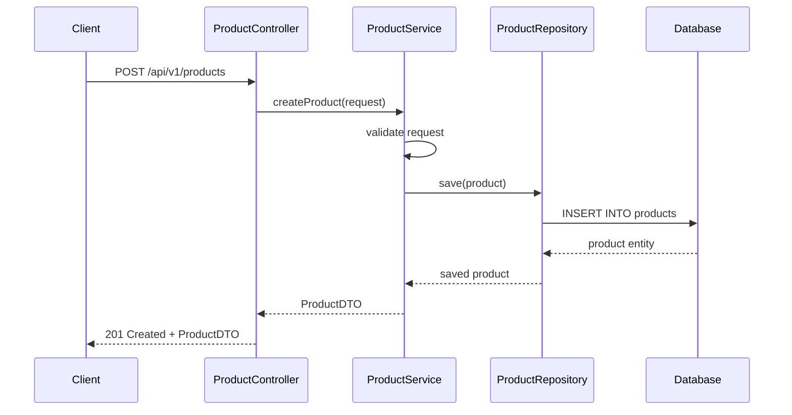
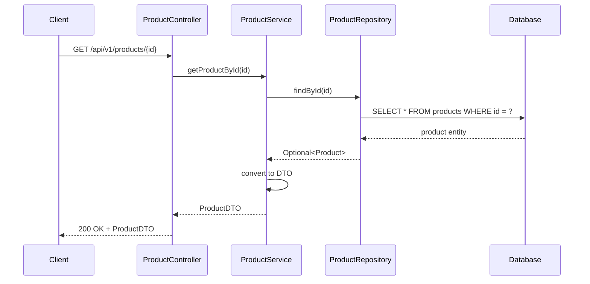
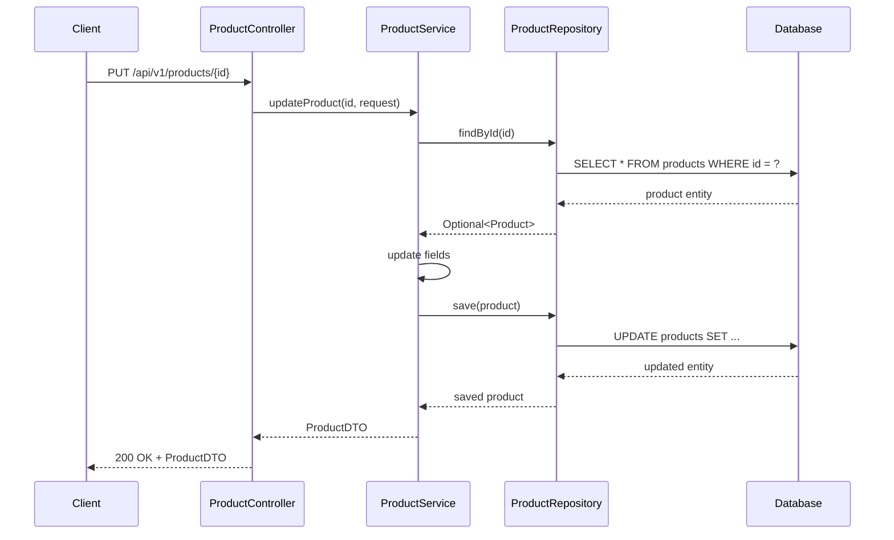
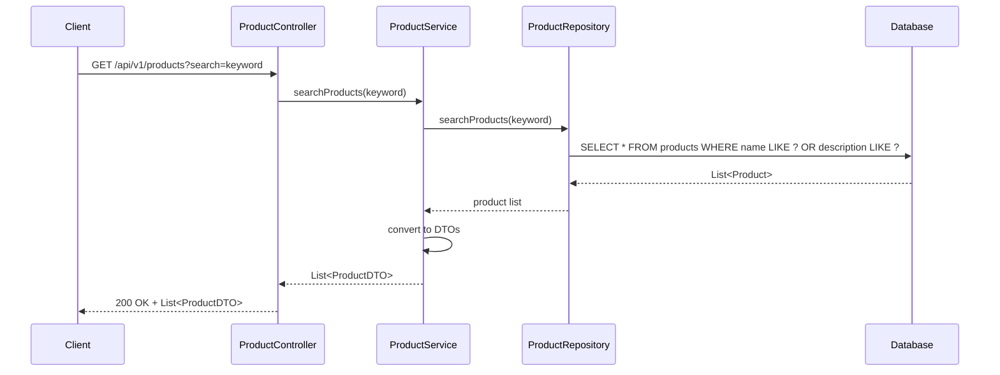
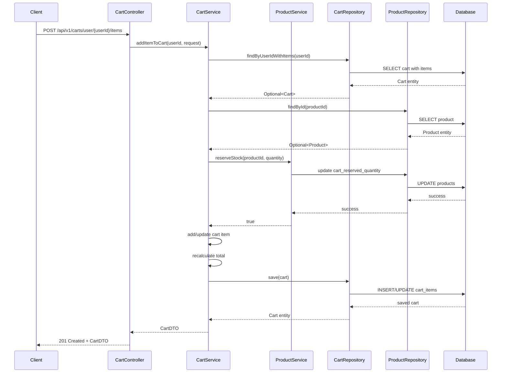
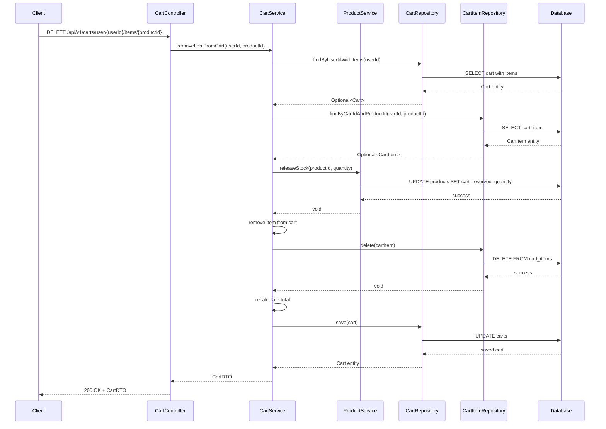
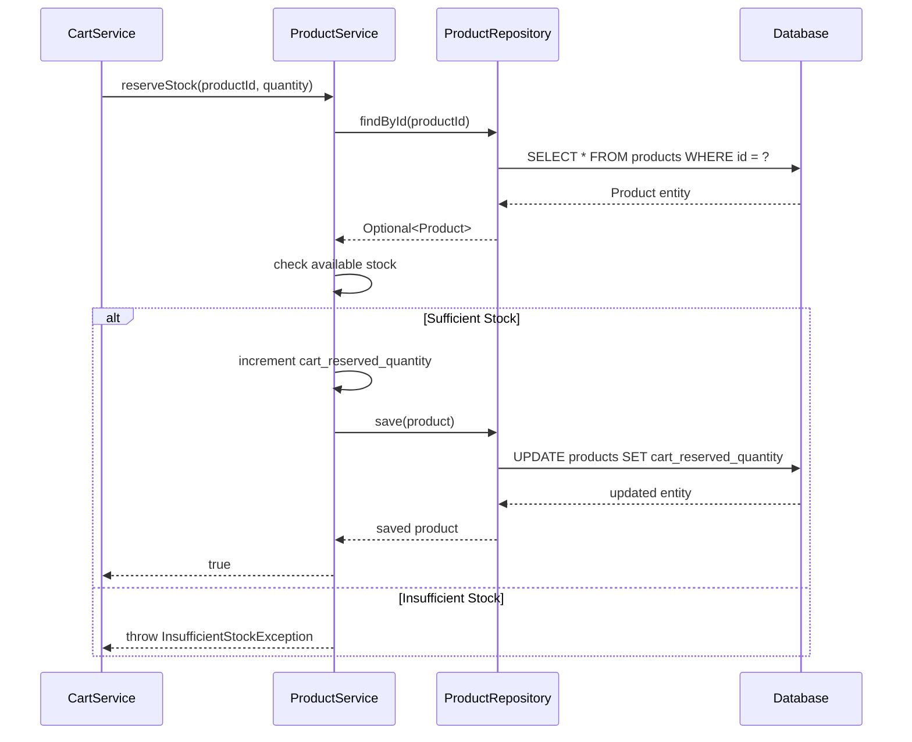
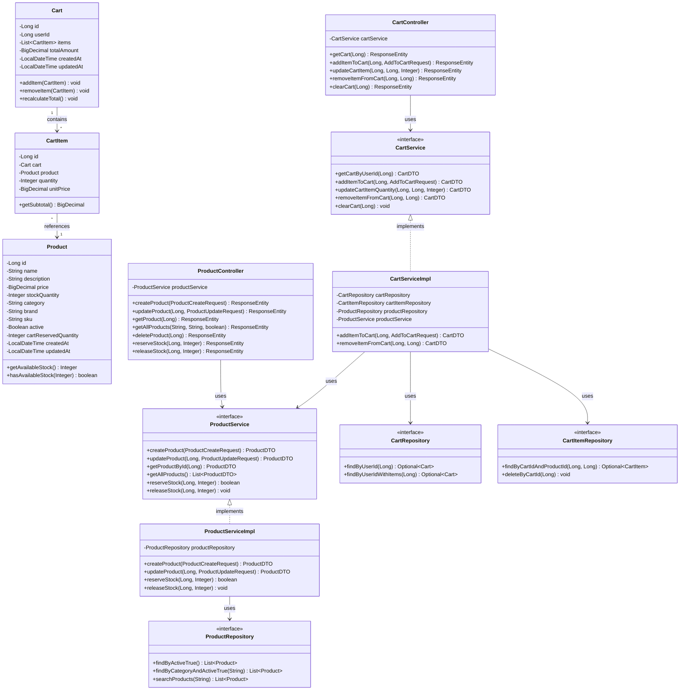

# Low Level Design: E-commerce Product Management System

## 1. System Overview

This document provides the Low Level Design (LLD) for an E-commerce Product Management System built using Spring Boot 3.x, Java 21, and PostgreSQL. The system manages product catalog operations including CRUD operations, search functionality, and cart management.

### 1.1 Technology Stack
- **Framework**: Spring Boot 3.x
- **Language**: Java 21
- **Database**: PostgreSQL 15+
- **Build Tool**: Maven/Gradle
- **API Style**: RESTful

### 1.2 Architecture Pattern
- Layered Architecture (Controller → Service → Repository → Entity)
- Dependency Injection via Spring
- Transaction Management with Spring @Transactional

## 2. Package Structure

```
com.ecommerce.product
├── controller
│   ├── ProductController.java
│   └── CartController.java
├── service
│   ├── ProductService.java
│   ├── ProductServiceImpl.java
│   ├── CartService.java
│   └── CartServiceImpl.java
├── repository
│   ├── ProductRepository.java
│   ├── CartRepository.java
│   └── CartItemRepository.java
├── entity
│   ├── Product.java
│   ├── Cart.java
│   └── CartItem.java
├── dto
│   ├── ProductDTO.java
│   ├── ProductCreateRequest.java
│   ├── ProductUpdateRequest.java
│   ├── CartDTO.java
│   ├── CartItemDTO.java
│   └── AddToCartRequest.java
├── exception
│   ├── ProductNotFoundException.java
│   ├── CartNotFoundException.java
│   ├── InsufficientStockException.java
│   └── GlobalExceptionHandler.java
└── config
    └── DatabaseConfig.java
```

## 3. Entity Design

### 3.1 Product Entity

```java
package com.ecommerce.product.entity;

import jakarta.persistence.*;
import lombok.AllArgsConstructor;
import lombok.Builder;
import lombok.Data;
import lombok.NoArgsConstructor;
import java.math.BigDecimal;
import java.time.LocalDateTime;

@Entity
@Table(name = "products")
@Data
@Builder
@NoArgsConstructor
@AllArgsConstructor
public class Product {
    
    @Id
    @GeneratedValue(strategy = GenerationType.IDENTITY)
    private Long id;
    
    @Column(nullable = false, length = 255)
    private String name;
    
    @Column(columnDefinition = "TEXT")
    private String description;
    
    @Column(nullable = false, precision = 10, scale = 2)
    private BigDecimal price;
    
    @Column(nullable = false)
    private Integer stockQuantity;
    
    @Column(length = 100)
    private String category;
    
    @Column(length = 100)
    private String brand;
    
    @Column(length = 50)
    private String sku;
    
    @Column(nullable = false)
    private Boolean active = true;
    
    @Column(name = "created_at", nullable = false, updatable = false)
    private LocalDateTime createdAt;
    
    @Column(name = "updated_at")
    private LocalDateTime updatedAt;
    
    @Column(name = "cart_reserved_quantity", nullable = false)
    private Integer cartReservedQuantity = 0;
    
    @PrePersist
    protected void onCreate() {
        createdAt = LocalDateTime.now();
        updatedAt = LocalDateTime.now();
    }
    
    @PreUpdate
    protected void onUpdate() {
        updatedAt = LocalDateTime.now();
    }
    
    public Integer getAvailableStock() {
        return stockQuantity - cartReservedQuantity;
    }
    
    public boolean hasAvailableStock(Integer requestedQuantity) {
        return getAvailableStock() >= requestedQuantity;
    }
}
```

### 3.2 Cart Entity

```java
package com.ecommerce.product.entity;

import jakarta.persistence.*;
import lombok.AllArgsConstructor;
import lombok.Builder;
import lombok.Data;
import lombok.NoArgsConstructor;
import java.math.BigDecimal;
import java.time.LocalDateTime;
import java.util.ArrayList;
import java.util.List;

@Entity
@Table(name = "carts")
@Data
@Builder
@NoArgsConstructor
@AllArgsConstructor
public class Cart {
    
    @Id
    @GeneratedValue(strategy = GenerationType.IDENTITY)
    private Long id;
    
    @Column(name = "user_id", nullable = false)
    private Long userId;
    
    @OneToMany(mappedBy = "cart", cascade = CascadeType.ALL, orphanRemoval = true)
    @Builder.Default
    private List<CartItem> items = new ArrayList<>();
    
    @Column(name = "total_amount", precision = 10, scale = 2)
    private BigDecimal totalAmount = BigDecimal.ZERO;
    
    @Column(name = "created_at", nullable = false, updatable = false)
    private LocalDateTime createdAt;
    
    @Column(name = "updated_at")
    private LocalDateTime updatedAt;
    
    @PrePersist
    protected void onCreate() {
        createdAt = LocalDateTime.now();
        updatedAt = LocalDateTime.now();
    }
    
    @PreUpdate
    protected void onUpdate() {
        updatedAt = LocalDateTime.now();
    }
    
    public void addItem(CartItem item) {
        items.add(item);
        item.setCart(this);
        recalculateTotal();
    }
    
    public void removeItem(CartItem item) {
        items.remove(item);
        item.setCart(null);
        recalculateTotal();
    }
    
    public void recalculateTotal() {
        this.totalAmount = items.stream()
            .map(CartItem::getSubtotal)
            .reduce(BigDecimal.ZERO, BigDecimal::add);
    }
}
```

### 3.3 CartItem Entity

```java
package com.ecommerce.product.entity;

import jakarta.persistence.*;
import lombok.AllArgsConstructor;
import lombok.Builder;
import lombok.Data;
import lombok.NoArgsConstructor;
import java.math.BigDecimal;

@Entity
@Table(name = "cart_items")
@Data
@Builder
@NoArgsConstructor
@AllArgsConstructor
public class CartItem {
    
    @Id
    @GeneratedValue(strategy = GenerationType.IDENTITY)
    private Long id;
    
    @ManyToOne(fetch = FetchType.LAZY)
    @JoinColumn(name = "cart_id", nullable = false)
    private Cart cart;
    
    @ManyToOne(fetch = FetchType.EAGER)
    @JoinColumn(name = "product_id", nullable = false)
    private Product product;
    
    @Column(nullable = false)
    private Integer quantity;
    
    @Column(name = "unit_price", nullable = false, precision = 10, scale = 2)
    private BigDecimal unitPrice;
    
    public BigDecimal getSubtotal() {
        return unitPrice.multiply(BigDecimal.valueOf(quantity));
    }
}
```

## 4. Repository Layer

### 4.1 ProductRepository

```java
package com.ecommerce.product.repository;

import com.ecommerce.product.entity.Product;
import org.springframework.data.jpa.repository.JpaRepository;
import org.springframework.data.jpa.repository.Query;
import org.springframework.data.repository.query.Param;
import org.springframework.stereotype.Repository;
import java.util.List;
import java.util.Optional;

@Repository
public interface ProductRepository extends JpaRepository<Product, Long> {
    
    List<Product> findByActiveTrue();
    
    List<Product> findByCategoryAndActiveTrue(String category);
    
    List<Product> findByBrandAndActiveTrue(String brand);
    
    Optional<Product> findBySku(String sku);
    
    @Query("SELECT p FROM Product p WHERE " +
           "LOWER(p.name) LIKE LOWER(CONCAT('%', :keyword, '%')) OR " +
           "LOWER(p.description) LIKE LOWER(CONCAT('%', :keyword, '%'))")
    List<Product> searchProducts(@Param("keyword") String keyword);
    
    @Query("SELECT p FROM Product p WHERE p.stockQuantity < :threshold AND p.active = true")
    List<Product> findLowStockProducts(@Param("threshold") Integer threshold);
}
```

### 4.2 CartRepository

```java
package com.ecommerce.product.repository;

import com.ecommerce.product.entity.Cart;
import org.springframework.data.jpa.repository.JpaRepository;
import org.springframework.data.jpa.repository.Query;
import org.springframework.data.repository.query.Param;
import org.springframework.stereotype.Repository;
import java.util.Optional;

@Repository
public interface CartRepository extends JpaRepository<Cart, Long> {
    
    Optional<Cart> findByUserId(Long userId);
    
    @Query("SELECT c FROM Cart c LEFT JOIN FETCH c.items WHERE c.userId = :userId")
    Optional<Cart> findByUserIdWithItems(@Param("userId") Long userId);
    
    boolean existsByUserId(Long userId);
}
```

### 4.3 CartItemRepository

```java
package com.ecommerce.product.repository;

import com.ecommerce.product.entity.CartItem;
import org.springframework.data.jpa.repository.JpaRepository;
import org.springframework.data.jpa.repository.Query;
import org.springframework.data.repository.query.Param;
import org.springframework.stereotype.Repository;
import java.util.Optional;

@Repository
public interface CartItemRepository extends JpaRepository<CartItem, Long> {
    
    @Query("SELECT ci FROM CartItem ci WHERE ci.cart.id = :cartId AND ci.product.id = :productId")
    Optional<CartItem> findByCartIdAndProductId(@Param("cartId") Long cartId, @Param("productId") Long productId);
    
    void deleteByCartId(Long cartId);
}
```

## 5. Service Layer

### 5.1 ProductService Interface

```java
package com.ecommerce.product.service;

import com.ecommerce.product.dto.ProductDTO;
import com.ecommerce.product.dto.ProductCreateRequest;
import com.ecommerce.product.dto.ProductUpdateRequest;
import java.util.List;

public interface ProductService {
    
    ProductDTO createProduct(ProductCreateRequest request);
    
    ProductDTO updateProduct(Long id, ProductUpdateRequest request);
    
    ProductDTO getProductById(Long id);
    
    List<ProductDTO> getAllProducts();
    
    List<ProductDTO> getActiveProducts();
    
    List<ProductDTO> getProductsByCategory(String category);
    
    List<ProductDTO> searchProducts(String keyword);
    
    void deleteProduct(Long id);
    
    void deactivateProduct(Long id);
    
    ProductDTO updateStock(Long id, Integer quantity);
    
    boolean reserveStock(Long productId, Integer quantity);
    
    void releaseStock(Long productId, Integer quantity);
}
```

### 5.2 ProductServiceImpl

```java
package com.ecommerce.product.service;

import com.ecommerce.product.dto.ProductDTO;
import com.ecommerce.product.dto.ProductCreateRequest;
import com.ecommerce.product.dto.ProductUpdateRequest;
import com.ecommerce.product.entity.Product;
import com.ecommerce.product.exception.ProductNotFoundException;
import com.ecommerce.product.exception.InsufficientStockException;
import com.ecommerce.product.repository.ProductRepository;
import lombok.RequiredArgsConstructor;
import lombok.extern.slf4j.Slf4j;
import org.springframework.stereotype.Service;
import org.springframework.transaction.annotation.Transactional;
import java.util.List;
import java.util.stream.Collectors;

@Service
@RequiredArgsConstructor
@Slf4j
@Transactional
public class ProductServiceImpl implements ProductService {
    
    private final ProductRepository productRepository;
    
    @Override
    public ProductDTO createProduct(ProductCreateRequest request) {
        log.info("Creating new product: {}", request.getName());
        
        Product product = Product.builder()
                .name(request.getName())
                .description(request.getDescription())
                .price(request.getPrice())
                .stockQuantity(request.getStockQuantity())
                .category(request.getCategory())
                .brand(request.getBrand())
                .sku(request.getSku())
                .active(true)
                .cartReservedQuantity(0)
                .build();
        
        Product savedProduct = productRepository.save(product);
        log.info("Product created successfully with ID: {}", savedProduct.getId());
        
        return convertToDTO(savedProduct);
    }
    
    @Override
    public ProductDTO updateProduct(Long id, ProductUpdateRequest request) {
        log.info("Updating product with ID: {}", id);
        
        Product product = productRepository.findById(id)
                .orElseThrow(() -> new ProductNotFoundException("Product not found with ID: " + id));
        
        if (request.getName() != null) {
            product.setName(request.getName());
        }
        if (request.getDescription() != null) {
            product.setDescription(request.getDescription());
        }
        if (request.getPrice() != null) {
            product.setPrice(request.getPrice());
        }
        if (request.getStockQuantity() != null) {
            product.setStockQuantity(request.getStockQuantity());
        }
        if (request.getCategory() != null) {
            product.setCategory(request.getCategory());
        }
        if (request.getBrand() != null) {
            product.setBrand(request.getBrand());
        }
        
        Product updatedProduct = productRepository.save(product);
        log.info("Product updated successfully: {}", id);
        
        return convertToDTO(updatedProduct);
    }
    
    @Override
    @Transactional(readOnly = true)
    public ProductDTO getProductById(Long id) {
        log.info("Fetching product with ID: {}", id);
        
        Product product = productRepository.findById(id)
                .orElseThrow(() -> new ProductNotFoundException("Product not found with ID: " + id));
        
        return convertToDTO(product);
    }
    
    @Override
    @Transactional(readOnly = true)
    public List<ProductDTO> getAllProducts() {
        log.info("Fetching all products");
        
        return productRepository.findAll().stream()
                .map(this::convertToDTO)
                .collect(Collectors.toList());
    }
    
    @Override
    @Transactional(readOnly = true)
    public List<ProductDTO> getActiveProducts() {
        log.info("Fetching active products");
        
        return productRepository.findByActiveTrue().stream()
                .map(this::convertToDTO)
                .collect(Collectors.toList());
    }
    
    @Override
    @Transactional(readOnly = true)
    public List<ProductDTO> getProductsByCategory(String category) {
        log.info("Fetching products by category: {}", category);
        
        return productRepository.findByCategoryAndActiveTrue(category).stream()
                .map(this::convertToDTO)
                .collect(Collectors.toList());
    }
    
    @Override
    @Transactional(readOnly = true)
    public List<ProductDTO> searchProducts(String keyword) {
        log.info("Searching products with keyword: {}", keyword);
        
        return productRepository.searchProducts(keyword).stream()
                .map(this::convertToDTO)
                .collect(Collectors.toList());
    }
    
    @Override
    public void deleteProduct(Long id) {
        log.info("Deleting product with ID: {}", id);
        
        if (!productRepository.existsById(id)) {
            throw new ProductNotFoundException("Product not found with ID: " + id);
        }
        
        productRepository.deleteById(id);
        log.info("Product deleted successfully: {}", id);
    }
    
    @Override
    public void deactivateProduct(Long id) {
        log.info("Deactivating product with ID: {}", id);
        
        Product product = productRepository.findById(id)
                .orElseThrow(() -> new ProductNotFoundException("Product not found with ID: " + id));
        
        product.setActive(false);
        productRepository.save(product);
        log.info("Product deactivated successfully: {}", id);
    }
    
    @Override
    public ProductDTO updateStock(Long id, Integer quantity) {
        log.info("Updating stock for product ID: {} to quantity: {}", id, quantity);
        
        Product product = productRepository.findById(id)
                .orElseThrow(() -> new ProductNotFoundException("Product not found with ID: " + id));
        
        product.setStockQuantity(quantity);
        Product updatedProduct = productRepository.save(product);
        log.info("Stock updated successfully for product: {}", id);
        
        return convertToDTO(updatedProduct);
    }
    
    @Override
    public boolean reserveStock(Long productId, Integer quantity) {
        log.info("Reserving stock for product ID: {}, quantity: {}", productId, quantity);
        
        Product product = productRepository.findById(productId)
                .orElseThrow(() -> new ProductNotFoundException("Product not found with ID: " + productId));
        
        if (!product.hasAvailableStock(quantity)) {
            log.warn("Insufficient stock for product ID: {}. Available: {}, Requested: {}", 
                     productId, product.getAvailableStock(), quantity);
            throw new InsufficientStockException(
                String.format("Insufficient stock for product %s. Available: %d, Requested: %d",
                             product.getName(), product.getAvailableStock(), quantity));
        }
        
        product.setCartReservedQuantity(product.getCartReservedQuantity() + quantity);
        productRepository.save(product);
        log.info("Stock reserved successfully for product: {}", productId);
        
        return true;
    }
    
    @Override
    public void releaseStock(Long productId, Integer quantity) {
        log.info("Releasing stock for product ID: {}, quantity: {}", productId, quantity);
        
        Product product = productRepository.findById(productId)
                .orElseThrow(() -> new ProductNotFoundException("Product not found with ID: " + productId));
        
        int newReservedQuantity = Math.max(0, product.getCartReservedQuantity() - quantity);
        product.setCartReservedQuantity(newReservedQuantity);
        productRepository.save(product);
        log.info("Stock released successfully for product: {}", productId);
    }
    
    private ProductDTO convertToDTO(Product product) {
        return ProductDTO.builder()
                .id(product.getId())
                .name(product.getName())
                .description(product.getDescription())
                .price(product.getPrice())
                .stockQuantity(product.getStockQuantity())
                .availableStock(product.getAvailableStock())
                .category(product.getCategory())
                .brand(product.getBrand())
                .sku(product.getSku())
                .active(product.getActive())
                .createdAt(product.getCreatedAt())
                .updatedAt(product.getUpdatedAt())
                .build();
    }
}
```

### 5.3 CartService Interface

```java
package com.ecommerce.product.service;

import com.ecommerce.product.dto.CartDTO;
import com.ecommerce.product.dto.AddToCartRequest;

public interface CartService {
    
    CartDTO getCartByUserId(Long userId);
    
    CartDTO addItemToCart(Long userId, AddToCartRequest request);
    
    CartDTO updateCartItemQuantity(Long userId, Long productId, Integer quantity);
    
    CartDTO removeItemFromCart(Long userId, Long productId);
    
    void clearCart(Long userId);
    
    CartDTO getOrCreateCart(Long userId);
}
```

### 5.4 CartServiceImpl

```java
package com.ecommerce.product.service;

import com.ecommerce.product.dto.CartDTO;
import com.ecommerce.product.dto.CartItemDTO;
import com.ecommerce.product.dto.AddToCartRequest;
import com.ecommerce.product.entity.Cart;
import com.ecommerce.product.entity.CartItem;
import com.ecommerce.product.entity.Product;
import com.ecommerce.product.exception.CartNotFoundException;
import com.ecommerce.product.exception.ProductNotFoundException;
import com.ecommerce.product.exception.InsufficientStockException;
import com.ecommerce.product.repository.CartRepository;
import com.ecommerce.product.repository.CartItemRepository;
import com.ecommerce.product.repository.ProductRepository;
import lombok.RequiredArgsConstructor;
import lombok.extern.slf4j.Slf4j;
import org.springframework.stereotype.Service;
import org.springframework.transaction.annotation.Transactional;
import java.util.ArrayList;
import java.util.Optional;
import java.util.stream.Collectors;

@Service
@RequiredArgsConstructor
@Slf4j
@Transactional
public class CartServiceImpl implements CartService {
    
    private final CartRepository cartRepository;
    private final CartItemRepository cartItemRepository;
    private final ProductRepository productRepository;
    private final ProductService productService;
    
    @Override
    @Transactional(readOnly = true)
    public CartDTO getCartByUserId(Long userId) {
        log.info("Fetching cart for user ID: {}", userId);
        
        Cart cart = cartRepository.findByUserIdWithItems(userId)
                .orElseThrow(() -> new CartNotFoundException("Cart not found for user ID: " + userId));
        
        return convertToDTO(cart);
    }
    
    @Override
    public CartDTO addItemToCart(Long userId, AddToCartRequest request) {
        log.info("Adding item to cart for user ID: {}, product ID: {}, quantity: {}", 
                 userId, request.getProductId(), request.getQuantity());
        
        Cart cart = getOrCreateCartEntity(userId);
        Product product = productRepository.findById(request.getProductId())
                .orElseThrow(() -> new ProductNotFoundException("Product not found with ID: " + request.getProductId()));
        
        if (!product.getActive()) {
            throw new ProductNotFoundException("Product is not active: " + request.getProductId());
        }
        
        Optional<CartItem> existingItem = cartItemRepository.findByCartIdAndProductId(cart.getId(), product.getId());
        
        if (existingItem.isPresent()) {
            CartItem item = existingItem.get();
            int newQuantity = item.getQuantity() + request.getQuantity();
            
            productService.releaseStock(product.getId(), item.getQuantity());
            productService.reserveStock(product.getId(), newQuantity);
            
            item.setQuantity(newQuantity);
            cartItemRepository.save(item);
            log.info("Updated existing cart item quantity to: {}", newQuantity);
        } else {
            productService.reserveStock(product.getId(), request.getQuantity());
            
            CartItem newItem = CartItem.builder()
                    .cart(cart)
                    .product(product)
                    .quantity(request.getQuantity())
                    .unitPrice(product.getPrice())
                    .build();
            
            cart.addItem(newItem);
            cartItemRepository.save(newItem);
            log.info("Added new item to cart");
        }
        
        cart.recalculateTotal();
        Cart savedCart = cartRepository.save(cart);
        
        return convertToDTO(savedCart);
    }
    
    @Override
    public CartDTO updateCartItemQuantity(Long userId, Long productId, Integer quantity) {
        log.info("Updating cart item quantity for user ID: {}, product ID: {}, new quantity: {}", 
                 userId, productId, quantity);
        
        Cart cart = cartRepository.findByUserIdWithItems(userId)
                .orElseThrow(() -> new CartNotFoundException("Cart not found for user ID: " + userId));
        
        CartItem cartItem = cartItemRepository.findByCartIdAndProductId(cart.getId(), productId)
                .orElseThrow(() -> new ProductNotFoundException("Product not found in cart: " + productId));
        
        if (quantity <= 0) {
            return removeItemFromCart(userId, productId);
        }
        
        productService.releaseStock(productId, cartItem.getQuantity());
        productService.reserveStock(productId, quantity);
        
        cartItem.setQuantity(quantity);
        cartItemRepository.save(cartItem);
        
        cart.recalculateTotal();
        Cart savedCart = cartRepository.save(cart);
        
        log.info("Cart item quantity updated successfully");
        return convertToDTO(savedCart);
    }
    
    @Override
    public CartDTO removeItemFromCart(Long userId, Long productId) {
        log.info("Removing item from cart for user ID: {}, product ID: {}", userId, productId);
        
        Cart cart = cartRepository.findByUserIdWithItems(userId)
                .orElseThrow(() -> new CartNotFoundException("Cart not found for user ID: " + userId));
        
        CartItem cartItem = cartItemRepository.findByCartIdAndProductId(cart.getId(), productId)
                .orElseThrow(() -> new ProductNotFoundException("Product not found in cart: " + productId));
        
        productService.releaseStock(productId, cartItem.getQuantity());
        
        cart.removeItem(cartItem);
        cartItemRepository.delete(cartItem);
        
        cart.recalculateTotal();
        Cart savedCart = cartRepository.save(cart);
        
        log.info("Item removed from cart successfully");
        return convertToDTO(savedCart);
    }
    
    @Override
    public void clearCart(Long userId) {
        log.info("Clearing cart for user ID: {}", userId);
        
        Cart cart = cartRepository.findByUserIdWithItems(userId)
                .orElseThrow(() -> new CartNotFoundException("Cart not found for user ID: " + userId));
        
        for (CartItem item : cart.getItems()) {
            productService.releaseStock(item.getProduct().getId(), item.getQuantity());
        }
        
        cartItemRepository.deleteByCartId(cart.getId());
        cart.getItems().clear();
        cart.recalculateTotal();
        cartRepository.save(cart);
        
        log.info("Cart cleared successfully for user ID: {}", userId);
    }
    
    @Override
    public CartDTO getOrCreateCart(Long userId) {
        log.info("Getting or creating cart for user ID: {}", userId);
        
        Optional<Cart> existingCart = cartRepository.findByUserIdWithItems(userId);
        
        if (existingCart.isPresent()) {
            return convertToDTO(existingCart.get());
        }
        
        Cart newCart = Cart.builder()
                .userId(userId)
                .items(new ArrayList<>())
                .build();
        
        Cart savedCart = cartRepository.save(newCart);
        log.info("New cart created for user ID: {}", userId);
        
        return convertToDTO(savedCart);
    }
    
    private Cart getOrCreateCartEntity(Long userId) {
        return cartRepository.findByUserIdWithItems(userId)
                .orElseGet(() -> {
                    Cart newCart = Cart.builder()
                            .userId(userId)
                            .items(new ArrayList<>())
                            .build();
                    return cartRepository.save(newCart);
                });
    }
    
    private CartDTO convertToDTO(Cart cart) {
        return CartDTO.builder()
                .id(cart.getId())
                .userId(cart.getUserId())
                .items(cart.getItems().stream()
                        .map(this::convertItemToDTO)
                        .collect(Collectors.toList()))
                .totalAmount(cart.getTotalAmount())
                .createdAt(cart.getCreatedAt())
                .updatedAt(cart.getUpdatedAt())
                .build();
    }
    
    private CartItemDTO convertItemToDTO(CartItem item) {
        return CartItemDTO.builder()
                .id(item.getId())
                .productId(item.getProduct().getId())
                .productName(item.getProduct().getName())
                .quantity(item.getQuantity())
                .unitPrice(item.getUnitPrice())
                .subtotal(item.getSubtotal())
                .build();
    }
}
```

## 6. Controller Layer

### 6.1 ProductController

```java
package com.ecommerce.product.controller;

import com.ecommerce.product.dto.ProductDTO;
import com.ecommerce.product.dto.ProductCreateRequest;
import com.ecommerce.product.dto.ProductUpdateRequest;
import com.ecommerce.product.service.ProductService;
import jakarta.validation.Valid;
import lombok.RequiredArgsConstructor;
import lombok.extern.slf4j.Slf4j;
import org.springframework.http.HttpStatus;
import org.springframework.http.ResponseEntity;
import org.springframework.web.bind.annotation.*;
import java.util.List;

@RestController
@RequestMapping("/api/v1/products")
@RequiredArgsConstructor
@Slf4j
public class ProductController {
    
    private final ProductService productService;
    
    @PostMapping
    public ResponseEntity<ProductDTO> createProduct(@Valid @RequestBody ProductCreateRequest request) {
        log.info("REST request to create product: {}", request.getName());
        ProductDTO createdProduct = productService.createProduct(request);
        return ResponseEntity.status(HttpStatus.CREATED).body(createdProduct);
    }
    
    @PutMapping("/{id}")
    public ResponseEntity<ProductDTO> updateProduct(
            @PathVariable Long id,
            @Valid @RequestBody ProductUpdateRequest request) {
        log.info("REST request to update product: {}", id);
        ProductDTO updatedProduct = productService.updateProduct(id, request);
        return ResponseEntity.ok(updatedProduct);
    }
    
    @GetMapping("/{id}")
    public ResponseEntity<ProductDTO> getProduct(@PathVariable Long id) {
        log.info("REST request to get product: {}", id);
        ProductDTO product = productService.getProductById(id);
        return ResponseEntity.ok(product);
    }
    
    @GetMapping
    public ResponseEntity<List<ProductDTO>> getAllProducts(
            @RequestParam(required = false) String category,
            @RequestParam(required = false) String search,
            @RequestParam(required = false, defaultValue = "false") boolean activeOnly) {
        log.info("REST request to get all products - category: {}, search: {}, activeOnly: {}", 
                 category, search, activeOnly);
        
        List<ProductDTO> products;
        
        if (search != null && !search.isEmpty()) {
            products = productService.searchProducts(search);
        } else if (category != null && !category.isEmpty()) {
            products = productService.getProductsByCategory(category);
        } else if (activeOnly) {
            products = productService.getActiveProducts();
        } else {
            products = productService.getAllProducts();
        }
        
        return ResponseEntity.ok(products);
    }
    
    @DeleteMapping("/{id}")
    public ResponseEntity<Void> deleteProduct(@PathVariable Long id) {
        log.info("REST request to delete product: {}", id);
        productService.deleteProduct(id);
        return ResponseEntity.noContent().build();
    }
    
    @PatchMapping("/{id}/deactivate")
    public ResponseEntity<Void> deactivateProduct(@PathVariable Long id) {
        log.info("REST request to deactivate product: {}", id);
        productService.deactivateProduct(id);
        return ResponseEntity.noContent().build();
    }
    
    @PatchMapping("/{id}/stock")
    public ResponseEntity<ProductDTO> updateStock(
            @PathVariable Long id,
            @RequestParam Integer quantity) {
        log.info("REST request to update stock for product: {} to quantity: {}", id, quantity);
        ProductDTO updatedProduct = productService.updateStock(id, quantity);
        return ResponseEntity.ok(updatedProduct);
    }
    
    @PostMapping("/{id}/reserve-stock")
    public ResponseEntity<Void> reserveStock(
            @PathVariable Long id,
            @RequestParam Integer quantity) {
        log.info("REST request to reserve stock for product: {}, quantity: {}", id, quantity);
        productService.reserveStock(id, quantity);
        return ResponseEntity.ok().build();
    }
    
    @PostMapping("/{id}/release-stock")
    public ResponseEntity<Void> releaseStock(
            @PathVariable Long id,
            @RequestParam Integer quantity) {
        log.info("REST request to release stock for product: {}, quantity: {}", id, quantity);
        productService.releaseStock(id, quantity);
        return ResponseEntity.ok().build();
    }
}
```

### 6.2 CartController

```java
package com.ecommerce.product.controller;

import com.ecommerce.product.dto.CartDTO;
import com.ecommerce.product.dto.AddToCartRequest;
import com.ecommerce.product.service.CartService;
import jakarta.validation.Valid;
import lombok.RequiredArgsConstructor;
import lombok.extern.slf4j.Slf4j;
import org.springframework.http.HttpStatus;
import org.springframework.http.ResponseEntity;
import org.springframework.web.bind.annotation.*;

@RestController
@RequestMapping("/api/v1/carts")
@RequiredArgsConstructor
@Slf4j
public class CartController {
    
    private final CartService cartService;
    
    @GetMapping("/user/{userId}")
    public ResponseEntity<CartDTO> getCart(@PathVariable Long userId) {
        log.info("REST request to get cart for user: {}", userId);
        CartDTO cart = cartService.getCartByUserId(userId);
        return ResponseEntity.ok(cart);
    }
    
    @PostMapping("/user/{userId}/items")
    public ResponseEntity<CartDTO> addItemToCart(
            @PathVariable Long userId,
            @Valid @RequestBody AddToCartRequest request) {
        log.info("REST request to add item to cart for user: {}", userId);
        CartDTO cart = cartService.addItemToCart(userId, request);
        return ResponseEntity.status(HttpStatus.CREATED).body(cart);
    }
    
    @PutMapping("/user/{userId}/items/{productId}")
    public ResponseEntity<CartDTO> updateCartItem(
            @PathVariable Long userId,
            @PathVariable Long productId,
            @RequestParam Integer quantity) {
        log.info("REST request to update cart item for user: {}, product: {}, quantity: {}", 
                 userId, productId, quantity);
        CartDTO cart = cartService.updateCartItemQuantity(userId, productId, quantity);
        return ResponseEntity.ok(cart);
    }
    
    @DeleteMapping("/user/{userId}/items/{productId}")
    public ResponseEntity<CartDTO> removeItemFromCart(
            @PathVariable Long userId,
            @PathVariable Long productId) {
        log.info("REST request to remove item from cart for user: {}, product: {}", userId, productId);
        CartDTO cart = cartService.removeItemFromCart(userId, productId);
        return ResponseEntity.ok(cart);
    }
    
    @DeleteMapping("/user/{userId}")
    public ResponseEntity<Void> clearCart(@PathVariable Long userId) {
        log.info("REST request to clear cart for user: {}", userId);
        cartService.clearCart(userId);
        return ResponseEntity.noContent().build();
    }
}
```

## 7. DTO Classes

### 7.1 ProductDTO

```java
package com.ecommerce.product.dto;

import lombok.AllArgsConstructor;
import lombok.Builder;
import lombok.Data;
import lombok.NoArgsConstructor;
import java.math.BigDecimal;
import java.time.LocalDateTime;

@Data
@Builder
@NoArgsConstructor
@AllArgsConstructor
public class ProductDTO {
    private Long id;
    private String name;
    private String description;
    private BigDecimal price;
    private Integer stockQuantity;
    private Integer availableStock;
    private String category;
    private String brand;
    private String sku;
    private Boolean active;
    private LocalDateTime createdAt;
    private LocalDateTime updatedAt;
}
```

### 7.2 ProductCreateRequest

```java
package com.ecommerce.product.dto;

import jakarta.validation.constraints.*;
import lombok.AllArgsConstructor;
import lombok.Builder;
import lombok.Data;
import lombok.NoArgsConstructor;
import java.math.BigDecimal;

@Data
@Builder
@NoArgsConstructor
@AllArgsConstructor
public class ProductCreateRequest {
    
    @NotBlank(message = "Product name is required")
    @Size(max = 255, message = "Product name must not exceed 255 characters")
    private String name;
    
    @Size(max = 2000, message = "Description must not exceed 2000 characters")
    private String description;
    
    @NotNull(message = "Price is required")
    @DecimalMin(value = "0.0", inclusive = false, message = "Price must be greater than 0")
    @Digits(integer = 8, fraction = 2, message = "Price must have at most 8 integer digits and 2 decimal places")
    private BigDecimal price;
    
    @NotNull(message = "Stock quantity is required")
    @Min(value = 0, message = "Stock quantity must be non-negative")
    private Integer stockQuantity;
    
    @Size(max = 100, message = "Category must not exceed 100 characters")
    private String category;
    
    @Size(max = 100, message = "Brand must not exceed 100 characters")
    private String brand;
    
    @Size(max = 50, message = "SKU must not exceed 50 characters")
    private String sku;
}
```

### 7.3 ProductUpdateRequest

```java
package com.ecommerce.product.dto;

import jakarta.validation.constraints.*;
import lombok.AllArgsConstructor;
import lombok.Builder;
import lombok.Data;
import lombok.NoArgsConstructor;
import java.math.BigDecimal;

@Data
@Builder
@NoArgsConstructor
@AllArgsConstructor
public class ProductUpdateRequest {
    
    @Size(max = 255, message = "Product name must not exceed 255 characters")
    private String name;
    
    @Size(max = 2000, message = "Description must not exceed 2000 characters")
    private String description;
    
    @DecimalMin(value = "0.0", inclusive = false, message = "Price must be greater than 0")
    @Digits(integer = 8, fraction = 2, message = "Price must have at most 8 integer digits and 2 decimal places")
    private BigDecimal price;
    
    @Min(value = 0, message = "Stock quantity must be non-negative")
    private Integer stockQuantity;
    
    @Size(max = 100, message = "Category must not exceed 100 characters")
    private String category;
    
    @Size(max = 100, message = "Brand must not exceed 100 characters")
    private String brand;
}
```

### 7.4 CartDTO

```java
package com.ecommerce.product.dto;

import lombok.AllArgsConstructor;
import lombok.Builder;
import lombok.Data;
import lombok.NoArgsConstructor;
import java.math.BigDecimal;
import java.time.LocalDateTime;
import java.util.List;

@Data
@Builder
@NoArgsConstructor
@AllArgsConstructor
public class CartDTO {
    private Long id;
    private Long userId;
    private List<CartItemDTO> items;
    private BigDecimal totalAmount;
    private LocalDateTime createdAt;
    private LocalDateTime updatedAt;
}
```

### 7.5 CartItemDTO

```java
package com.ecommerce.product.dto;

import lombok.AllArgsConstructor;
import lombok.Builder;
import lombok.Data;
import lombok.NoArgsConstructor;
import java.math.BigDecimal;

@Data
@Builder
@NoArgsConstructor
@AllArgsConstructor
public class CartItemDTO {
    private Long id;
    private Long productId;
    private String productName;
    private Integer quantity;
    private BigDecimal unitPrice;
    private BigDecimal subtotal;
}
```

### 7.6 AddToCartRequest

```java
package com.ecommerce.product.dto;

import jakarta.validation.constraints.Min;
import jakarta.validation.constraints.NotNull;
import lombok.AllArgsConstructor;
import lombok.Builder;
import lombok.Data;
import lombok.NoArgsConstructor;

@Data
@Builder
@NoArgsConstructor
@AllArgsConstructor
public class AddToCartRequest {
    
    @NotNull(message = "Product ID is required")
    private Long productId;
    
    @NotNull(message = "Quantity is required")
    @Min(value = 1, message = "Quantity must be at least 1")
    private Integer quantity;
}
```

## 8. Exception Handling

### 8.1 ProductNotFoundException

```java
package com.ecommerce.product.exception;

public class ProductNotFoundException extends RuntimeException {
    public ProductNotFoundException(String message) {
        super(message);
    }
}
```

### 8.2 CartNotFoundException

```java
package com.ecommerce.product.exception;

public class CartNotFoundException extends RuntimeException {
    public CartNotFoundException(String message) {
        super(message);
    }
}
```

### 8.3 InsufficientStockException

```java
package com.ecommerce.product.exception;

public class InsufficientStockException extends RuntimeException {
    public InsufficientStockException(String message) {
        super(message);
    }
}
```

### 8.4 GlobalExceptionHandler

```java
package com.ecommerce.product.exception;

import lombok.extern.slf4j.Slf4j;
import org.springframework.http.HttpStatus;
import org.springframework.http.ResponseEntity;
import org.springframework.validation.FieldError;
import org.springframework.web.bind.MethodArgumentNotValidException;
import org.springframework.web.bind.annotation.ExceptionHandler;
import org.springframework.web.bind.annotation.RestControllerAdvice;
import java.time.LocalDateTime;
import java.util.HashMap;
import java.util.Map;

@RestControllerAdvice
@Slf4j
public class GlobalExceptionHandler {
    
    @ExceptionHandler(ProductNotFoundException.class)
    public ResponseEntity<ErrorResponse> handleProductNotFoundException(ProductNotFoundException ex) {
        log.error("Product not found: {}", ex.getMessage());
        ErrorResponse error = ErrorResponse.builder()
                .timestamp(LocalDateTime.now())
                .status(HttpStatus.NOT_FOUND.value())
                .error("Not Found")
                .message(ex.getMessage())
                .build();
        return ResponseEntity.status(HttpStatus.NOT_FOUND).body(error);
    }
    
    @ExceptionHandler(CartNotFoundException.class)
    public ResponseEntity<ErrorResponse> handleCartNotFoundException(CartNotFoundException ex) {
        log.error("Cart not found: {}", ex.getMessage());
        ErrorResponse error = ErrorResponse.builder()
                .timestamp(LocalDateTime.now())
                .status(HttpStatus.NOT_FOUND.value())
                .error("Not Found")
                .message(ex.getMessage())
                .build();
        return ResponseEntity.status(HttpStatus.NOT_FOUND).body(error);
    }
    
    @ExceptionHandler(InsufficientStockException.class)
    public ResponseEntity<ErrorResponse> handleInsufficientStockException(InsufficientStockException ex) {
        log.error("Insufficient stock: {}", ex.getMessage());
        ErrorResponse error = ErrorResponse.builder()
                .timestamp(LocalDateTime.now())
                .status(HttpStatus.BAD_REQUEST.value())
                .error("Bad Request")
                .message(ex.getMessage())
                .build();
        return ResponseEntity.status(HttpStatus.BAD_REQUEST).body(error);
    }
    
    @ExceptionHandler(MethodArgumentNotValidException.class)
    public ResponseEntity<ErrorResponse> handleValidationExceptions(MethodArgumentNotValidException ex) {
        log.error("Validation error: {}", ex.getMessage());
        Map<String, String> errors = new HashMap<>();
        ex.getBindingResult().getAllErrors().forEach((error) -> {
            String fieldName = ((FieldError) error).getField();
            String errorMessage = error.getDefaultMessage();
            errors.put(fieldName, errorMessage);
        });
        
        ErrorResponse error = ErrorResponse.builder()
                .timestamp(LocalDateTime.now())
                .status(HttpStatus.BAD_REQUEST.value())
                .error("Validation Failed")
                .message("Input validation failed")
                .validationErrors(errors)
                .build();
        return ResponseEntity.status(HttpStatus.BAD_REQUEST).body(error);
    }
    
    @ExceptionHandler(Exception.class)
    public ResponseEntity<ErrorResponse> handleGenericException(Exception ex) {
        log.error("Unexpected error: {}", ex.getMessage(), ex);
        ErrorResponse error = ErrorResponse.builder()
                .timestamp(LocalDateTime.now())
                .status(HttpStatus.INTERNAL_SERVER_ERROR.value())
                .error("Internal Server Error")
                .message("An unexpected error occurred")
                .build();
        return ResponseEntity.status(HttpStatus.INTERNAL_SERVER_ERROR).body(error);
    }
    
    @lombok.Data
    @lombok.Builder
    @lombok.NoArgsConstructor
    @lombok.AllArgsConstructor
    public static class ErrorResponse {
        private LocalDateTime timestamp;
        private int status;
        private String error;
        private String message;
        private Map<String, String> validationErrors;
    }
}
```

## 9. Database Schema

### 9.1 Products Table

```sql
CREATE TABLE products (
    id BIGSERIAL PRIMARY KEY,
    name VARCHAR(255) NOT NULL,
    description TEXT,
    price DECIMAL(10, 2) NOT NULL,
    stock_quantity INTEGER NOT NULL,
    category VARCHAR(100),
    brand VARCHAR(100),
    sku VARCHAR(50) UNIQUE,
    active BOOLEAN NOT NULL DEFAULT true,
    cart_reserved_quantity INTEGER NOT NULL DEFAULT 0,
    created_at TIMESTAMP NOT NULL DEFAULT CURRENT_TIMESTAMP,
    updated_at TIMESTAMP NOT NULL DEFAULT CURRENT_TIMESTAMP
);

CREATE INDEX idx_products_category ON products(category);
CREATE INDEX idx_products_brand ON products(brand);
CREATE INDEX idx_products_sku ON products(sku);
CREATE INDEX idx_products_active ON products(active);
CREATE INDEX idx_products_name ON products(name);
```

### 9.2 Carts Table

```sql
CREATE TABLE carts (
    id BIGSERIAL PRIMARY KEY,
    user_id BIGINT NOT NULL,
    total_amount DECIMAL(10, 2) DEFAULT 0.00,
    created_at TIMESTAMP NOT NULL DEFAULT CURRENT_TIMESTAMP,
    updated_at TIMESTAMP NOT NULL DEFAULT CURRENT_TIMESTAMP,
    CONSTRAINT uk_carts_user_id UNIQUE (user_id)
);

CREATE INDEX idx_carts_user_id ON carts(user_id);
```

### 9.3 Cart Items Table

```sql
CREATE TABLE cart_items (
    id BIGSERIAL PRIMARY KEY,
    cart_id BIGINT NOT NULL,
    product_id BIGINT NOT NULL,
    quantity INTEGER NOT NULL,
    unit_price DECIMAL(10, 2) NOT NULL,
    CONSTRAINT fk_cart_items_cart FOREIGN KEY (cart_id) REFERENCES carts(id) ON DELETE CASCADE,
    CONSTRAINT fk_cart_items_product FOREIGN KEY (product_id) REFERENCES products(id) ON DELETE CASCADE,
    CONSTRAINT uk_cart_items_cart_product UNIQUE (cart_id, product_id)
);

CREATE INDEX idx_cart_items_cart_id ON cart_items(cart_id);
CREATE INDEX idx_cart_items_product_id ON cart_items(product_id);
```

## 10. Sequence Diagrams

### 10.1 Create Product Flow


```mermaid
sequenceDiagram
    participant Client
    participant ProductController
    participant ProductService
    participant ProductRepository
    participant Database

    Client->>ProductController: POST /api/v1/products
    ProductController->>ProductService: createProduct(request)
    ProductService->>ProductService: validate request
    ProductService->>ProductRepository: save(product)
    ProductRepository->>Database: INSERT INTO products
    Database-->>ProductRepository: product entity
    ProductRepository-->>ProductService: saved product
    ProductService-->>ProductController: ProductDTO
    ProductController-->>Client: 201 Created + ProductDTO
```

### 10.2 Get Product Flow


```mermaid
sequenceDiagram
    participant Client
    participant ProductController
    participant ProductService
    participant ProductRepository
    participant Database

    Client->>ProductController: GET /api/v1/products/{id}
    ProductController->>ProductService: getProductById(id)
    ProductService->>ProductRepository: findById(id)
    ProductRepository->>Database: SELECT * FROM products WHERE id = ?
    Database-->>ProductRepository: product entity
    ProductRepository-->>ProductService: Optional<Product>
    ProductService->>ProductService: convert to DTO
    ProductService-->>ProductController: ProductDTO
    ProductController-->>Client: 200 OK + ProductDTO
```

### 10.3 Update Product Flow


```mermaid
sequenceDiagram
    participant Client
    participant ProductController
    participant ProductService
    participant ProductRepository
    participant Database

    Client->>ProductController: PUT /api/v1/products/{id}
    ProductController->>ProductService: updateProduct(id, request)
    ProductService->>ProductRepository: findById(id)
    ProductRepository->>Database: SELECT * FROM products WHERE id = ?
    Database-->>ProductRepository: product entity
    ProductRepository-->>ProductService: Optional<Product>
    ProductService->>ProductService: update fields
    ProductService->>ProductRepository: save(product)
    ProductRepository->>Database: UPDATE products SET ...
    Database-->>ProductRepository: updated entity
    ProductRepository-->>ProductService: saved product
    ProductService-->>ProductController: ProductDTO
    ProductController-->>Client: 200 OK + ProductDTO
```

### 10.4 Search Products Flow


```mermaid
sequenceDiagram
    participant Client
    participant ProductController
    participant ProductService
    participant ProductRepository
    participant Database

    Client->>ProductController: GET /api/v1/products?search=keyword
    ProductController->>ProductService: searchProducts(keyword)
    ProductService->>ProductRepository: searchProducts(keyword)
    ProductRepository->>Database: SELECT * FROM products WHERE name LIKE ? OR description LIKE ?
    Database-->>ProductRepository: List<Product>
    ProductRepository-->>ProductService: product list
    ProductService->>ProductService: convert to DTOs
    ProductService-->>ProductController: List<ProductDTO>
    ProductController-->>Client: 200 OK + List<ProductDTO>
```

### 10.5 Add Item to Cart Flow


```mermaid
sequenceDiagram
    participant Client
    participant CartController
    participant CartService
    participant ProductService
    participant CartRepository
    participant ProductRepository
    participant Database

    Client->>CartController: POST /api/v1/carts/user/{userId}/items
    CartController->>CartService: addItemToCart(userId, request)
    CartService->>CartRepository: findByUserIdWithItems(userId)
    CartRepository->>Database: SELECT cart with items
    Database-->>CartRepository: Cart entity
    CartRepository-->>CartService: Optional<Cart>
    CartService->>ProductRepository: findById(productId)
    ProductRepository->>Database: SELECT product
    Database-->>ProductRepository: Product entity
    ProductRepository-->>CartService: Optional<Product>
    CartService->>ProductService: reserveStock(productId, quantity)
    ProductService->>ProductRepository: update cart_reserved_quantity
    ProductRepository->>Database: UPDATE products
    Database-->>ProductRepository: success
    ProductRepository-->>ProductService: success
    ProductService-->>CartService: true
    CartService->>CartService: add/update cart item
    CartService->>CartService: recalculate total
    CartService->>CartRepository: save(cart)
    CartRepository->>Database: INSERT/UPDATE cart_items
    Database-->>CartRepository: saved cart
    CartRepository-->>CartService: Cart entity
    CartService-->>CartController: CartDTO
    CartController-->>Client: 201 Created + CartDTO
```

### 10.6 Remove Item from Cart Flow


```mermaid
sequenceDiagram
    participant Client
    participant CartController
    participant CartService
    participant ProductService
    participant CartRepository
    participant CartItemRepository
    participant Database

    Client->>CartController: DELETE /api/v1/carts/user/{userId}/items/{productId}
    CartController->>CartService: removeItemFromCart(userId, productId)
    CartService->>CartRepository: findByUserIdWithItems(userId)
    CartRepository->>Database: SELECT cart with items
    Database-->>CartRepository: Cart entity
    CartRepository-->>CartService: Optional<Cart>
    CartService->>CartItemRepository: findByCartIdAndProductId(cartId, productId)
    CartItemRepository->>Database: SELECT cart_item
    Database-->>CartItemRepository: CartItem entity
    CartItemRepository-->>CartService: Optional<CartItem>
    CartService->>ProductService: releaseStock(productId, quantity)
    ProductService->>Database: UPDATE products SET cart_reserved_quantity
    Database-->>ProductService: success
    ProductService-->>CartService: void
    CartService->>CartService: remove item from cart
    CartService->>CartItemRepository: delete(cartItem)
    CartItemRepository->>Database: DELETE FROM cart_items
    Database-->>CartItemRepository: success
    CartItemRepository-->>CartService: void
    CartService->>CartService: recalculate total
    CartService->>CartRepository: save(cart)
    CartRepository->>Database: UPDATE carts
    Database-->>CartRepository: saved cart
    CartRepository-->>CartService: Cart entity
    CartService-->>CartController: CartDTO
    CartController-->>Client: 200 OK + CartDTO
```

### 10.7 Stock Reservation Flow


```mermaid
sequenceDiagram
    participant CartService
    participant ProductService
    participant ProductRepository
    participant Database

    CartService->>ProductService: reserveStock(productId, quantity)
    ProductService->>ProductRepository: findById(productId)
    ProductRepository->>Database: SELECT * FROM products WHERE id = ?
    Database-->>ProductRepository: Product entity
    ProductRepository-->>ProductService: Optional<Product>
    ProductService->>ProductService: check available stock
    alt Sufficient Stock
        ProductService->>ProductService: increment cart_reserved_quantity
        ProductService->>ProductRepository: save(product)
        ProductRepository->>Database: UPDATE products SET cart_reserved_quantity
        Database-->>ProductRepository: updated entity
        ProductRepository-->>ProductService: saved product
        ProductService-->>CartService: true
    else Insufficient Stock
        ProductService-->>CartService: throw InsufficientStockException
    end
```

## 11. Class Diagram


```mermaid
classDiagram
    class Product {
        -Long id
        -String name
        -String description
        -BigDecimal price
        -Integer stockQuantity
        -String category
        -String brand
        -String sku
        -Boolean active
        -Integer cartReservedQuantity
        -LocalDateTime createdAt
        -LocalDateTime updatedAt
        +getAvailableStock() Integer
        +hasAvailableStock(Integer) boolean
    }

    class Cart {
        -Long id
        -Long userId
        -List~CartItem~ items
        -BigDecimal totalAmount
        -LocalDateTime createdAt
        -LocalDateTime updatedAt
        +addItem(CartItem) void
        +removeItem(CartItem) void
        +recalculateTotal() void
    }

    class CartItem {
        -Long id
        -Cart cart
        -Product product
        -Integer quantity
        -BigDecimal unitPrice
        +getSubtotal() BigDecimal
    }

    class ProductController {
        -ProductService productService
        +createProduct(ProductCreateRequest) ResponseEntity
        +updateProduct(Long, ProductUpdateRequest) ResponseEntity
        +getProduct(Long) ResponseEntity
        +getAllProducts(String, String, boolean) ResponseEntity
        +deleteProduct(Long) ResponseEntity
        +reserveStock(Long, Integer) ResponseEntity
        +releaseStock(Long, Integer) ResponseEntity
    }

    class CartController {
        -CartService cartService
        +getCart(Long) ResponseEntity
        +addItemToCart(Long, AddToCartRequest) ResponseEntity
        +updateCartItem(Long, Long, Integer) ResponseEntity
        +removeItemFromCart(Long, Long) ResponseEntity
        +clearCart(Long) ResponseEntity
    }

    class ProductService {
        <<interface>>
        +createProduct(ProductCreateRequest) ProductDTO
        +updateProduct(Long, ProductUpdateRequest) ProductDTO
        +getProductById(Long) ProductDTO
        +getAllProducts() List~ProductDTO~
        +reserveStock(Long, Integer) boolean
        +releaseStock(Long, Integer) void
    }

    class CartService {
        <<interface>>
        +getCartByUserId(Long) CartDTO
        +addItemToCart(Long, AddToCartRequest) CartDTO
        +updateCartItemQuantity(Long, Long, Integer) CartDTO
        +removeItemFromCart(Long, Long) CartDTO
        +clearCart(Long) void
    }

    class ProductServiceImpl {
        -ProductRepository productRepository
        +createProduct(ProductCreateRequest) ProductDTO
        +updateProduct(Long, ProductUpdateRequest) ProductDTO
        +reserveStock(Long, Integer) boolean
        +releaseStock(Long, Integer) void
    }

    class CartServiceImpl {
        -CartRepository cartRepository
        -CartItemRepository cartItemRepository
        -ProductRepository productRepository
        -ProductService productService
        +addItemToCart(Long, AddToCartRequest) CartDTO
        +removeItemFromCart(Long, Long) CartDTO
    }

    class ProductRepository {
        <<interface>>
        +findByActiveTrue() List~Product~
        +findByCategoryAndActiveTrue(String) List~Product~
        +searchProducts(String) List~Product~
    }

    class CartRepository {
        <<interface>>
        +findByUserId(Long) Optional~Cart~
        +findByUserIdWithItems(Long) Optional~Cart~
    }

    class CartItemRepository {
        <<interface>>
        +findByCartIdAndProductId(Long, Long) Optional~CartItem~
        +deleteByCartId(Long) void
    }

    Cart "1" --> "*" CartItem : contains
    CartItem "*" --> "1" Product : references
    ProductController --> ProductService : uses
    CartController --> CartService : uses
    ProductService <|.. ProductServiceImpl : implements
    CartService <|.. CartServiceImpl : implements
    ProductServiceImpl --> ProductRepository : uses
    CartServiceImpl --> CartRepository : uses
    CartServiceImpl --> CartItemRepository : uses
    CartServiceImpl --> ProductService : uses
```

## 12. API Endpoints

### 12.1 Product Management APIs

| Method | Endpoint | Description | Request Body | Response |
|--------|----------|-------------|--------------|----------|
| POST | `/api/v1/products` | Create new product | ProductCreateRequest | 201 Created + ProductDTO |
| PUT | `/api/v1/products/{id}` | Update product | ProductUpdateRequest | 200 OK + ProductDTO |
| GET | `/api/v1/products/{id}` | Get product by ID | - | 200 OK + ProductDTO |
| GET | `/api/v1/products` | Get all products | Query params: category, search, activeOnly | 200 OK + List<ProductDTO> |
| DELETE | `/api/v1/products/{id}` | Delete product | - | 204 No Content |
| PATCH | `/api/v1/products/{id}/deactivate` | Deactivate product | - | 204 No Content |
| PATCH | `/api/v1/products/{id}/stock` | Update stock | Query param: quantity | 200 OK + ProductDTO |
| POST | `/api/v1/products/{id}/reserve-stock` | Reserve stock for cart | Query param: quantity | 200 OK |
| POST | `/api/v1/products/{id}/release-stock` | Release reserved stock | Query param: quantity | 200 OK |

### 12.2 Cart Management APIs

| Method | Endpoint | Description | Request Body | Response |
|--------|----------|-------------|--------------|----------|
| GET | `/api/v1/carts/user/{userId}` | Get user's cart | - | 200 OK + CartDTO |
| POST | `/api/v1/carts/user/{userId}/items` | Add item to cart | AddToCartRequest | 201 Created + CartDTO |
| PUT | `/api/v1/carts/user/{userId}/items/{productId}` | Update cart item quantity | Query param: quantity | 200 OK + CartDTO |
| DELETE | `/api/v1/carts/user/{userId}/items/{productId}` | Remove item from cart | - | 200 OK + CartDTO |
| DELETE | `/api/v1/carts/user/{userId}` | Clear entire cart | - | 204 No Content |

## 13. Configuration

### 13.1 Application Properties

```properties
# Application
spring.application.name=ecommerce-product-service
server.port=8080

# Database
spring.datasource.url=jdbc:postgresql://localhost:5432/ecommerce_db
spring.datasource.username=postgres
spring.datasource.password=password
spring.datasource.driver-class-name=org.postgresql.Driver

# JPA/Hibernate
spring.jpa.hibernate.ddl-auto=validate
spring.jpa.show-sql=true
spring.jpa.properties.hibernate.format_sql=true
spring.jpa.properties.hibernate.dialect=org.hibernate.dialect.PostgreSQLDialect

# Logging
logging.level.com.ecommerce.product=DEBUG
logging.level.org.springframework.web=INFO
logging.level.org.hibernate.SQL=DEBUG
logging.level.org.hibernate.type.descriptor.sql.BasicBinder=TRACE
```

## 14. Integration Points

### 14.1 Product-Cart Integration

The Product and Cart modules are tightly integrated through stock reservation mechanisms:

1. **Stock Reservation**: When items are added to cart, the system reserves stock by incrementing `cart_reserved_quantity` in the Product entity
2. **Stock Release**: When items are removed from cart or cart is cleared, reserved stock is released
3. **Available Stock Calculation**: `availableStock = stockQuantity - cartReservedQuantity`
4. **Validation**: Before adding items to cart, the system validates available stock

### 14.2 Transaction Management

- All cart operations that modify product stock are wrapped in transactions
- If cart operation fails, stock reservations are automatically rolled back
- CartService uses ProductService for all stock-related operations to maintain consistency

### 14.3 Data Consistency

- Foreign key constraints ensure referential integrity between carts and products
- Cascade operations handle cart item deletion when cart is deleted
- Optimistic locking can be added to Product entity to handle concurrent stock updates

## 15. Error Handling Strategy

### 15.1 Exception Types

1. **ProductNotFoundException**: Thrown when product ID doesn't exist
2. **CartNotFoundException**: Thrown when cart doesn't exist for user
3. **InsufficientStockException**: Thrown when requested quantity exceeds available stock
4. **ValidationException**: Thrown for invalid input data

### 15.2 Error Response Format

```json
{
  "timestamp": "2024-01-15T10:30:00",
  "status": 404,
  "error": "Not Found",
  "message": "Product not found with ID: 123",
  "validationErrors": {}
}
```

## 16. Testing Strategy

### 16.1 Unit Tests
- Test service layer business logic
- Mock repository dependencies
- Test exception scenarios
- Validate DTO conversions

### 16.2 Integration Tests
- Test controller endpoints
- Test database operations
- Test transaction rollback scenarios
- Test stock reservation/release flows

### 16.3 Test Coverage Goals
- Service Layer: 90%+
- Controller Layer: 85%+
- Repository Layer: 80%+

## 17. Performance Considerations

### 17.1 Database Optimization
- Indexes on frequently queried columns (category, brand, sku, active)
- Connection pooling configuration
- Query optimization for search operations

### 17.2 Caching Strategy
- Consider caching frequently accessed products
- Cache invalidation on product updates
- Redis integration for distributed caching

### 17.3 Pagination
- Implement pagination for product listing APIs
- Use Spring Data's Pageable interface
- Default page size: 20 items

## 18. Security Considerations

### 18.1 Input Validation
- All DTOs use Jakarta Validation annotations
- Controller validates request bodies
- Service layer performs business rule validation

### 18.2 SQL Injection Prevention
- Use JPA/Hibernate parameterized queries
- Repository methods use Spring Data query methods
- No raw SQL concatenation

### 18.3 Authentication & Authorization
- Integrate Spring Security (future enhancement)
- JWT token-based authentication
- Role-based access control (ADMIN, USER)

## 19. Deployment Considerations

### 19.1 Environment Configuration
- Separate properties files for dev, test, prod
- Externalize database credentials
- Use environment variables for sensitive data

### 19.2 Database Migration
- Use Flyway or Liquibase for schema versioning
- Maintain migration scripts in version control
- Test migrations in staging before production

### 19.3 Monitoring & Logging
- Integrate Spring Boot Actuator
- Configure health check endpoints
- Set up application metrics collection
- Centralized logging with ELK stack

## 20. Future Enhancements

### 20.1 Planned Features
- Product image management
- Product reviews and ratings
- Inventory management system
- Order processing integration
- Payment gateway integration
- Real-time stock updates via WebSocket

### 20.2 Scalability Improvements
- Microservices architecture
- Event-driven architecture with message queues
- Distributed caching
- Database sharding for large datasets

---

**Document Version**: 2.0  
**Last Updated**: 2024-01-15  
**Author**: Development Team  
**Status**: Approved