# Low-Level Design (LLD) - E-commerce Product Management System

## 1. Project Overview

**Framework:** Spring Boot  
**Language:** Java 21  
**Database:** PostgreSQL  
**Module:** ProductManagement  

## 2. System Architecture

### 2.1 Class Diagram

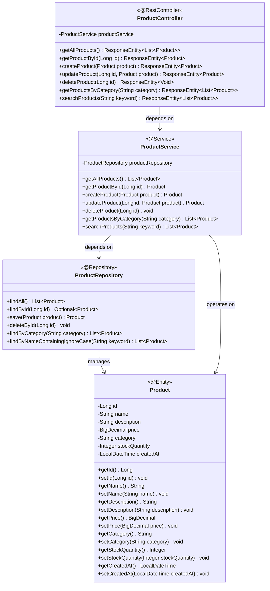
```mermaid
classDiagram
    class ProductController {
        <<@RestController>>
        -ProductService productService
        +getAllProducts() ResponseEntity~List~Product~~
        +getProductById(Long id) ResponseEntity~Product~
        +createProduct(Product product) ResponseEntity~Product~
        +updateProduct(Long id, Product product) ResponseEntity~Product~
        +deleteProduct(Long id) ResponseEntity~Void~
        +getProductsByCategory(String category) ResponseEntity~List~Product~~
        +searchProducts(String keyword) ResponseEntity~List~Product~~
    }
    
    class ProductService {
        <<@Service>>
        -ProductRepository productRepository
        +getAllProducts() List~Product~
        +getProductById(Long id) Product
        +createProduct(Product product) Product
        +updateProduct(Long id, Product product) Product
        +deleteProduct(Long id) void
        +getProductsByCategory(String category) List~Product~
        +searchProducts(String keyword) List~Product~
    }
    
    class ProductRepository {
        <<@Repository>>
        <<interface>>
        +findAll() List~Product~
        +findById(Long id) Optional~Product~
        +save(Product product) Product
        +deleteById(Long id) void
        +findByCategory(String category) List~Product~
        +findByNameContainingIgnoreCase(String keyword) List~Product~
    }
    
    class Product {
        <<@Entity>>
        -Long id
        -String name
        -String description
        -BigDecimal price
        -String category
        -Integer stockQuantity
        -LocalDateTime createdAt
        +getId() Long
        +setId(Long id) void
        +getName() String
        +setName(String name) void
        +getDescription() String
        +setDescription(String description) void
        +getPrice() BigDecimal
        +setPrice(BigDecimal price) void
        +getCategory() String
        +setCategory(String category) void
        +getStockQuantity() Integer
        +setStockQuantity(Integer stockQuantity) void
        +getCreatedAt() LocalDateTime
        +setCreatedAt(LocalDateTime createdAt) void
    }
    
    ProductController --> ProductService : depends on
    ProductService --> ProductRepository : depends on
    ProductRepository --> Product : manages
    ProductService --> Product : operates on
```

### 2.2 Entity Relationship Diagram

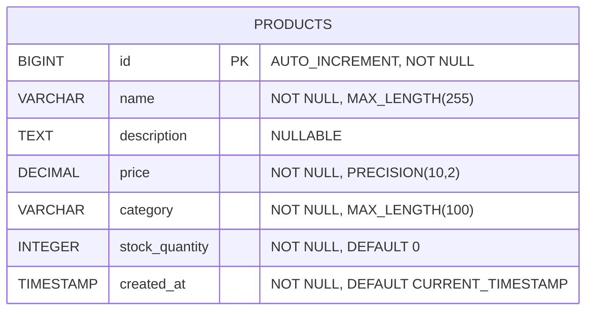
```mermaid
erDiagram
    PRODUCTS {
        BIGINT id PK "AUTO_INCREMENT, NOT NULL"
        VARCHAR name "NOT NULL, MAX_LENGTH(255)"
        TEXT description "NULLABLE"
        DECIMAL price "NOT NULL, PRECISION(10,2)"
        VARCHAR category "NOT NULL, MAX_LENGTH(100)"
        INTEGER stock_quantity "NOT NULL, DEFAULT 0"
        TIMESTAMP created_at "NOT NULL, DEFAULT CURRENT_TIMESTAMP"
    }
```

## 3. Sequence Diagrams

### 3.1 Get All Products

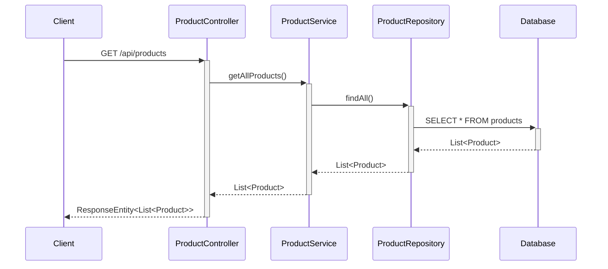
```mermaid
sequenceDiagram
    participant Client
    participant ProductController
    participant ProductService
    participant ProductRepository
    participant Database
    
    Client->>+ProductController: GET /api/products
    ProductController->>+ProductService: getAllProducts()
    ProductService->>+ProductRepository: findAll()
    ProductRepository->>+Database: SELECT * FROM products
    Database-->>-ProductRepository: List<Product>
    ProductRepository-->>-ProductService: List<Product>
    ProductService-->>-ProductController: List<Product>
    ProductController-->>-Client: ResponseEntity<List<Product>>
```

### 3.2 Get Product By ID

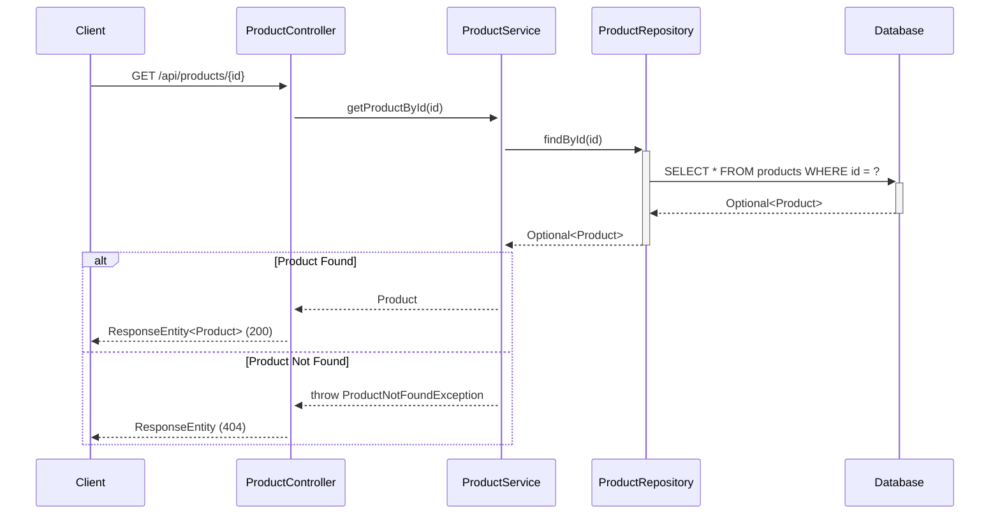
```mermaid
sequenceDiagram
    participant Client
    participant ProductController
    participant ProductService
    participant ProductRepository
    participant Database
    
    Client->>+ProductController: GET /api/products/{id}
    ProductController->>+ProductService: getProductById(id)
    ProductService->>+ProductRepository: findById(id)
    ProductRepository->>+Database: SELECT * FROM products WHERE id = ?
    Database-->>-ProductRepository: Optional<Product>
    ProductRepository-->>-ProductService: Optional<Product>
    
    alt Product Found
        ProductService-->>ProductController: Product
        ProductController-->>Client: ResponseEntity<Product> (200)
    else Product Not Found
        ProductService-->>ProductController: throw ProductNotFoundException
        ProductController-->>Client: ResponseEntity (404)
    end
```

### 3.3 Create Product

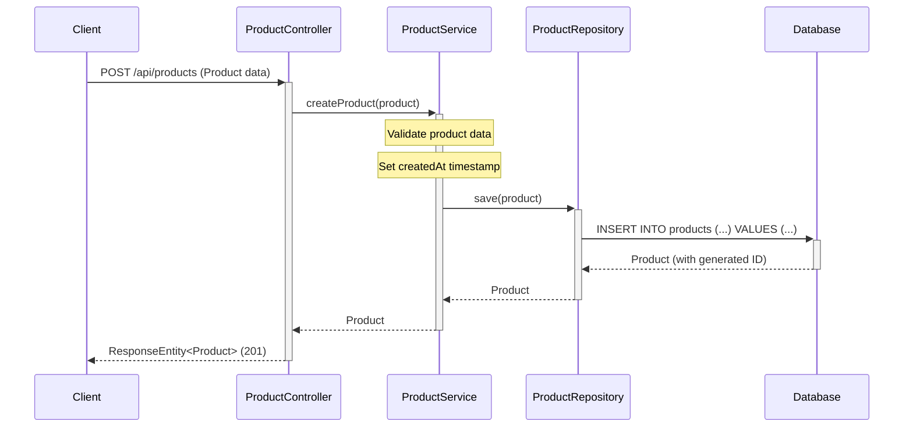
```mermaid
sequenceDiagram
    participant Client
    participant ProductController
    participant ProductService
    participant ProductRepository
    participant Database
    
    Client->>+ProductController: POST /api/products (Product data)
    ProductController->>+ProductService: createProduct(product)
    
    Note over ProductService: Validate product data
    Note over ProductService: Set createdAt timestamp
    
    ProductService->>+ProductRepository: save(product)
    ProductRepository->>+Database: INSERT INTO products (...) VALUES (...)
    Database-->>-ProductRepository: Product (with generated ID)
    ProductRepository-->>-ProductService: Product
    ProductService-->>-ProductController: Product
    ProductController-->>-Client: ResponseEntity<Product> (201)
```

### 3.4 Update Product

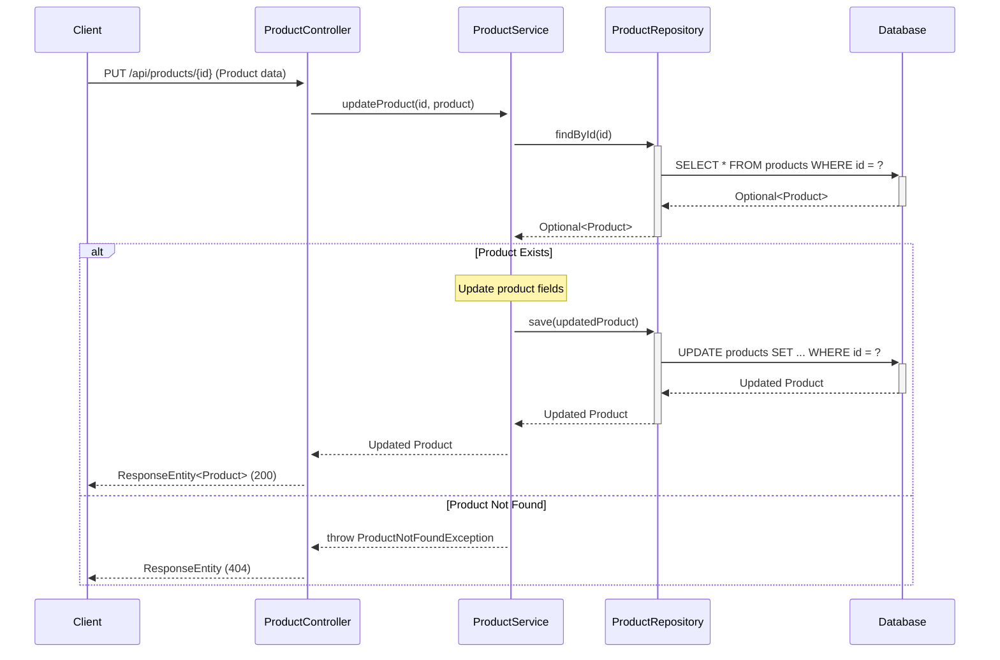
```mermaid
sequenceDiagram
    participant Client
    participant ProductController
    participant ProductService
    participant ProductRepository
    participant Database
    
    Client->>+ProductController: PUT /api/products/{id} (Product data)
    ProductController->>+ProductService: updateProduct(id, product)
    
    ProductService->>+ProductRepository: findById(id)
    ProductRepository->>+Database: SELECT * FROM products WHERE id = ?
    Database-->>-ProductRepository: Optional<Product>
    ProductRepository-->>-ProductService: Optional<Product>
    
    alt Product Exists
        Note over ProductService: Update product fields
        ProductService->>+ProductRepository: save(updatedProduct)
        ProductRepository->>+Database: UPDATE products SET ... WHERE id = ?
        Database-->>-ProductRepository: Updated Product
        ProductRepository-->>-ProductService: Updated Product
        ProductService-->>ProductController: Updated Product
        ProductController-->>Client: ResponseEntity<Product> (200)
    else Product Not Found
        ProductService-->>ProductController: throw ProductNotFoundException
        ProductController-->>Client: ResponseEntity (404)
    end
```

### 3.5 Delete Product

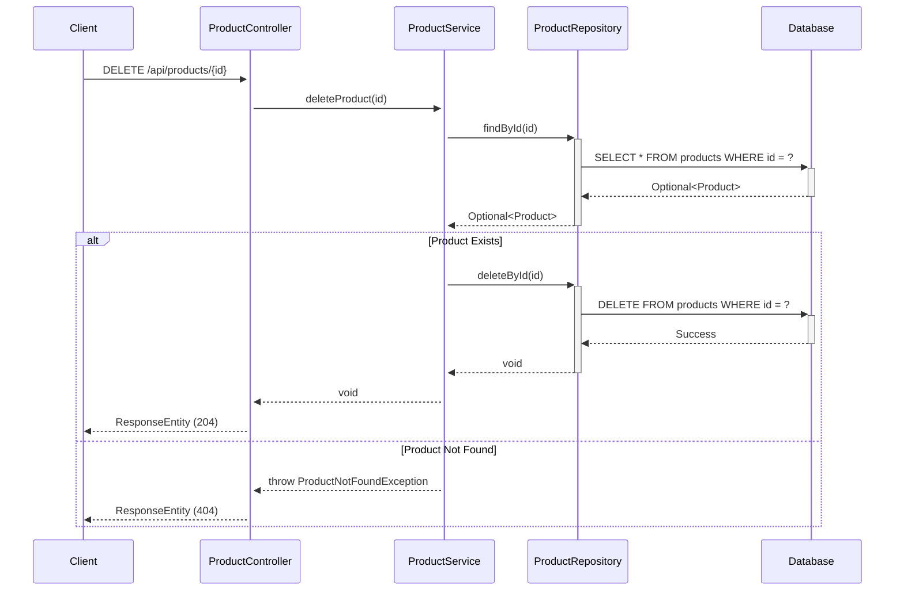
```mermaid
sequenceDiagram
    participant Client
    participant ProductController
    participant ProductService
    participant ProductRepository
    participant Database
    
    Client->>+ProductController: DELETE /api/products/{id}
    ProductController->>+ProductService: deleteProduct(id)
    
    ProductService->>+ProductRepository: findById(id)
    ProductRepository->>+Database: SELECT * FROM products WHERE id = ?
    Database-->>-ProductRepository: Optional<Product>
    ProductRepository-->>-ProductService: Optional<Product>
    
    alt Product Exists
        ProductService->>+ProductRepository: deleteById(id)
        ProductRepository->>+Database: DELETE FROM products WHERE id = ?
        Database-->>-ProductRepository: Success
        ProductRepository-->>-ProductService: void
        ProductService-->>ProductController: void
        ProductController-->>Client: ResponseEntity (204)
    else Product Not Found
        ProductService-->>ProductController: throw ProductNotFoundException
        ProductController-->>Client: ResponseEntity (404)
    end
```

### 3.6 Get Products By Category

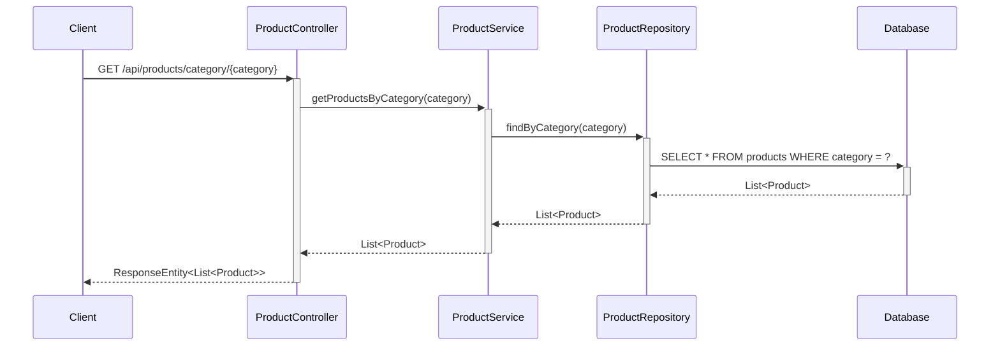
```mermaid
sequenceDiagram
    participant Client
    participant ProductController
    participant ProductService
    participant ProductRepository
    participant Database
    
    Client->>+ProductController: GET /api/products/category/{category}
    ProductController->>+ProductService: getProductsByCategory(category)
    ProductService->>+ProductRepository: findByCategory(category)
    ProductRepository->>+Database: SELECT * FROM products WHERE category = ?
    Database-->>-ProductRepository: List<Product>
    ProductRepository-->>-ProductService: List<Product>
    ProductService-->>-ProductController: List<Product>
    ProductController-->>-Client: ResponseEntity<List<Product>>
```

### 3.7 Search Products

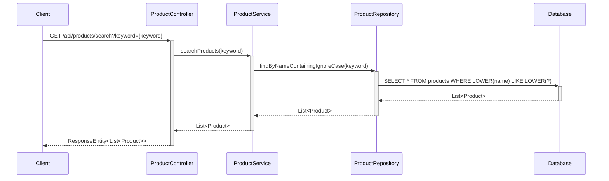
```mermaid
sequenceDiagram
    participant Client
    participant ProductController
    participant ProductService
    participant ProductRepository
    participant Database
    
    Client->>+ProductController: GET /api/products/search?keyword={keyword}
    ProductController->>+ProductService: searchProducts(keyword)
    ProductService->>+ProductRepository: findByNameContainingIgnoreCase(keyword)
    ProductRepository->>+Database: SELECT * FROM products WHERE LOWER(name) LIKE LOWER(?)
    Database-->>-ProductRepository: List<Product>
    ProductRepository-->>-ProductService: List<Product>
    ProductService-->>-ProductController: List<Product>
    ProductController-->>-Client: ResponseEntity<List<Product>>
```

## 4. API Endpoints Summary

| Method | Endpoint | Description | Request Body | Response |
|--------|----------|-------------|--------------|----------|
| GET | `/api/products` | Get all products | None | List<Product> |
| GET | `/api/products/{id}` | Get product by ID | None | Product |
| POST | `/api/products` | Create new product | Product | Product |
| PUT | `/api/products/{id}` | Update existing product | Product | Product |
| DELETE | `/api/products/{id}` | Delete product | None | None |
| GET | `/api/products/category/{category}` | Get products by category | None | List<Product> |
| GET | `/api/products/search?keyword={keyword}` | Search products by name | None | List<Product> |

## 5. Database Schema

### Products Table

```sql
CREATE TABLE products (
    id BIGINT PRIMARY KEY AUTO_INCREMENT,
    name VARCHAR(255) NOT NULL,
    description TEXT,
    price DECIMAL(10,2) NOT NULL,
    category VARCHAR(100) NOT NULL,
    stock_quantity INTEGER NOT NULL DEFAULT 0,
    created_at TIMESTAMP NOT NULL DEFAULT CURRENT_TIMESTAMP
);

CREATE INDEX idx_products_category ON products(category);
CREATE INDEX idx_products_name ON products(name);
```

## 6. Technology Stack

- **Backend Framework:** Spring Boot 3.x
- **Language:** Java 21
- **Database:** PostgreSQL
- **ORM:** Spring Data JPA / Hibernate
- **Build Tool:** Maven/Gradle
- **API Documentation:** Swagger/OpenAPI 3

## 7. Design Patterns Used

1. **MVC Pattern:** Separation of Controller, Service, and Repository layers
2. **Repository Pattern:** Data access abstraction through ProductRepository
3. **Dependency Injection:** Spring's IoC container manages dependencies
4. **DTO Pattern:** Data Transfer Objects for API requests/responses
5. **Exception Handling:** Custom exceptions for business logic errors

## 8. Key Features

- RESTful API design following HTTP standards
- Proper HTTP status codes for different scenarios
- Input validation and error handling
- Database indexing for performance optimization
- Transactional operations for data consistency
- Pagination support for large datasets (can be extended)
- Search functionality with case-insensitive matching

## 9. Shopping Cart Module

### 9.1 Shopping Cart Data Models

**Requirement Reference:** Story Description - Add products to cart with quantity management

**Description:** Define cart item data structure with product ID, name, price, quantity, subtotal fields and cart collection model

#### CartItem Entity

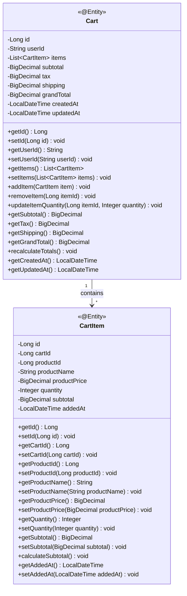
```mermaid
classDiagram
    class CartItem {
        <<@Entity>>
        -Long id
        -Long cartId
        -Long productId
        -String productName
        -BigDecimal productPrice
        -Integer quantity
        -BigDecimal subtotal
        -LocalDateTime addedAt
        +getId() Long
        +setId(Long id) void
        +getCartId() Long
        +setCartId(Long cartId) void
        +getProductId() Long
        +setProductId(Long productId) void
        +getProductName() String
        +setProductName(String productName) void
        +getProductPrice() BigDecimal
        +setProductPrice(BigDecimal productPrice) void
        +getQuantity() Integer
        +setQuantity(Integer quantity) void
        +getSubtotal() BigDecimal
        +setSubtotal(BigDecimal subtotal) void
        +calculateSubtotal() void
        +getAddedAt() LocalDateTime
        +setAddedAt(LocalDateTime addedAt) void
    }
    
    class Cart {
        <<@Entity>>
        -Long id
        -String userId
        -List~CartItem~ items
        -BigDecimal subtotal
        -BigDecimal tax
        -BigDecimal shipping
        -BigDecimal grandTotal
        -LocalDateTime createdAt
        -LocalDateTime updatedAt
        +getId() Long
        +setId(Long id) void
        +getUserId() String
        +setUserId(String userId) void
        +getItems() List~CartItem~
        +setItems(List~CartItem~ items) void
        +addItem(CartItem item) void
        +removeItem(Long itemId) void
        +updateItemQuantity(Long itemId, Integer quantity) void
        +getSubtotal() BigDecimal
        +getTax() BigDecimal
        +getShipping() BigDecimal
        +getGrandTotal() BigDecimal
        +recalculateTotals() void
        +getCreatedAt() LocalDateTime
        +getUpdatedAt() LocalDateTime
    }
    
    Cart "1" --> "*" CartItem : contains
```

#### Cart Data Models ERD

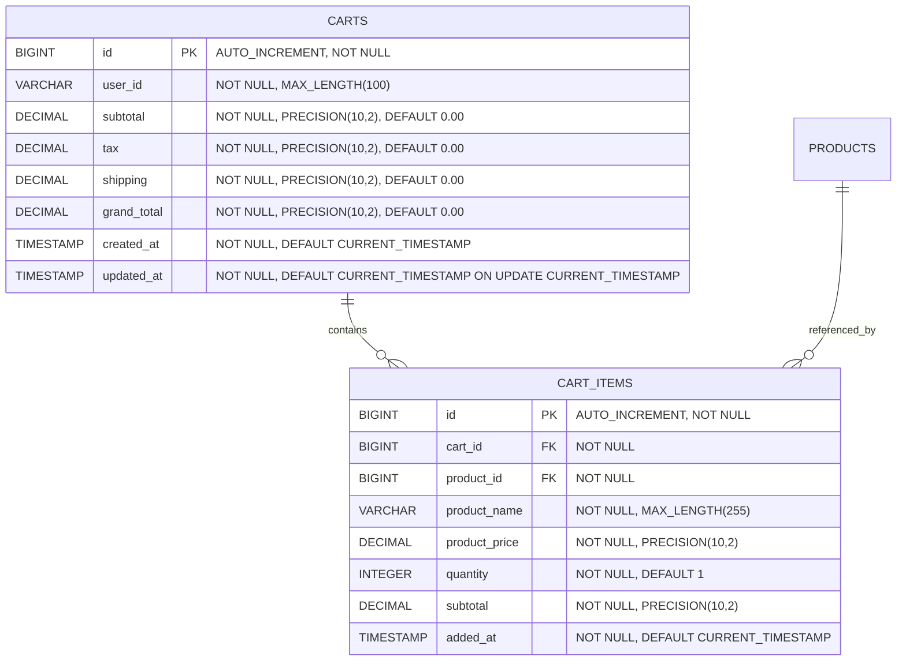
```mermaid
erDiagram
    CARTS {
        BIGINT id PK "AUTO_INCREMENT, NOT NULL"
        VARCHAR user_id "NOT NULL, MAX_LENGTH(100)"
        DECIMAL subtotal "NOT NULL, PRECISION(10,2), DEFAULT 0.00"
        DECIMAL tax "NOT NULL, PRECISION(10,2), DEFAULT 0.00"
        DECIMAL shipping "NOT NULL, PRECISION(10,2), DEFAULT 0.00"
        DECIMAL grand_total "NOT NULL, PRECISION(10,2), DEFAULT 0.00"
        TIMESTAMP created_at "NOT NULL, DEFAULT CURRENT_TIMESTAMP"
        TIMESTAMP updated_at "NOT NULL, DEFAULT CURRENT_TIMESTAMP ON UPDATE CURRENT_TIMESTAMP"
    }
    
    CART_ITEMS {
        BIGINT id PK "AUTO_INCREMENT, NOT NULL"
        BIGINT cart_id FK "NOT NULL"
        BIGINT product_id FK "NOT NULL"
        VARCHAR product_name "NOT NULL, MAX_LENGTH(255)"
        DECIMAL product_price "NOT NULL, PRECISION(10,2)"
        INTEGER quantity "NOT NULL, DEFAULT 1"
        DECIMAL subtotal "NOT NULL, PRECISION(10,2)"
        TIMESTAMP added_at "NOT NULL, DEFAULT CURRENT_TIMESTAMP"
    }
    
    CARTS ||--o{ CART_ITEMS : contains
    PRODUCTS ||--o{ CART_ITEMS : referenced_by
```

### 9.2 Cart Management APIs

**Requirement Reference:** Story Description - Add, update, remove cart items functionality

**Description:** Create REST APIs for addToCart, updateQuantity, removeItem, getCartContents, clearCart operations

#### Cart API Endpoints

| Method | Endpoint | Description | Request Body | Response |
|--------|----------|-------------|--------------|----------|
| POST | `/api/cart/add` | Add product to cart | CartItemRequest | CartResponse |
| PUT | `/api/cart/items/{itemId}/quantity` | Update item quantity | QuantityUpdateRequest | CartResponse |
| DELETE | `/api/cart/items/{itemId}` | Remove item from cart | None | CartResponse |
| GET | `/api/cart` | Get cart contents | None | CartResponse |
| DELETE | `/api/cart/clear` | Clear all cart items | None | MessageResponse |
| GET | `/api/cart/count` | Get total items count | None | Integer |

#### Cart Controller Class Diagram

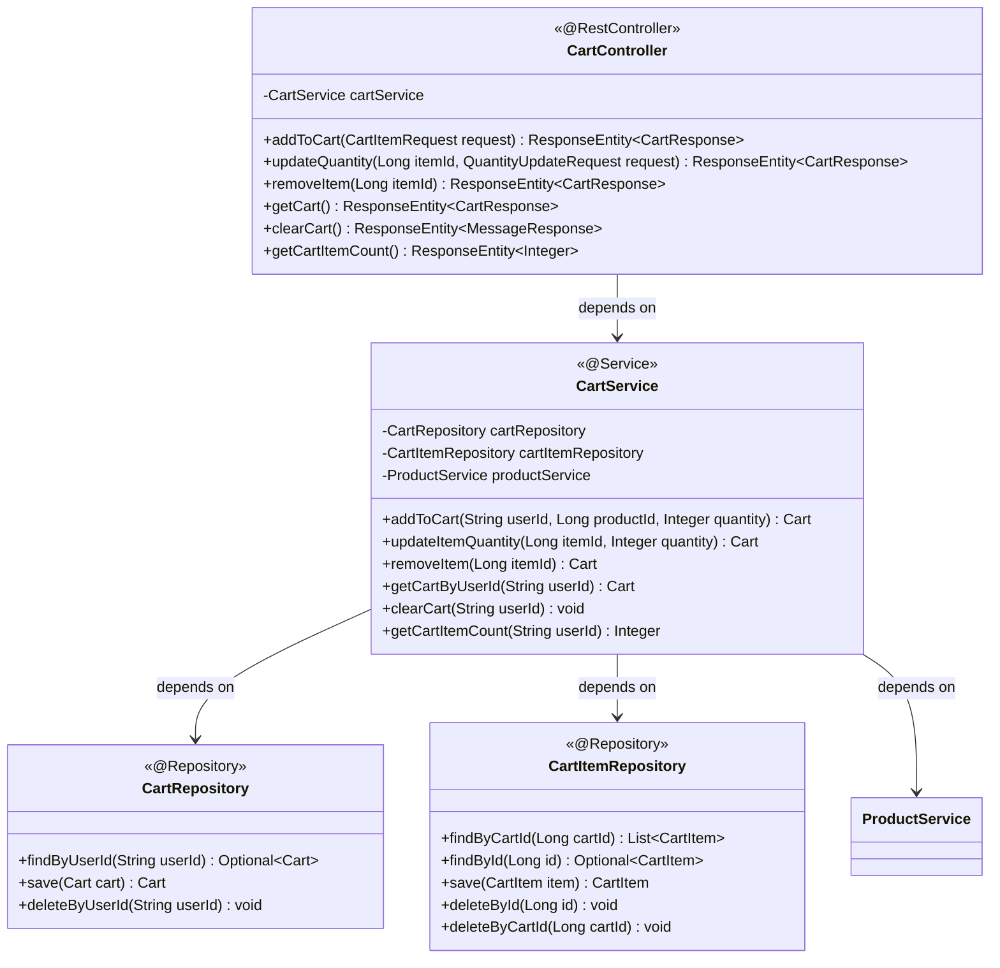
```mermaid
classDiagram
    class CartController {
        <<@RestController>>
        -CartService cartService
        +addToCart(CartItemRequest request) ResponseEntity~CartResponse~
        +updateQuantity(Long itemId, QuantityUpdateRequest request) ResponseEntity~CartResponse~
        +removeItem(Long itemId) ResponseEntity~CartResponse~
        +getCart() ResponseEntity~CartResponse~
        +clearCart() ResponseEntity~MessageResponse~
        +getCartItemCount() ResponseEntity~Integer~
    }
    
    class CartService {
        <<@Service>>
        -CartRepository cartRepository
        -CartItemRepository cartItemRepository
        -ProductService productService
        +addToCart(String userId, Long productId, Integer quantity) Cart
        +updateItemQuantity(Long itemId, Integer quantity) Cart
        +removeItem(Long itemId) Cart
        +getCartByUserId(String userId) Cart
        +clearCart(String userId) void
        +getCartItemCount(String userId) Integer
    }
    
    class CartRepository {
        <<@Repository>>
        <<interface>>
        +findByUserId(String userId) Optional~Cart~
        +save(Cart cart) Cart
        +deleteByUserId(String userId) void
    }
    
    class CartItemRepository {
        <<@Repository>>
        <<interface>>
        +findByCartId(Long cartId) List~CartItem~
        +findById(Long id) Optional~CartItem~
        +save(CartItem item) CartItem
        +deleteById(Long id) void
        +deleteByCartId(Long cartId) void
    }
    
    CartController --> CartService : depends on
    CartService --> CartRepository : depends on
    CartService --> CartItemRepository : depends on
    CartService --> ProductService : depends on
```

### 9.3 Real-time Calculation Engine

**Requirement Reference:** Story Description - Automatic recalculation of subtotal and total when quantity changes

**Description:** Implement calculation logic for item subtotals, cart subtotal, tax, shipping, and grand total with real-time updates

#### Calculation Flow Diagram

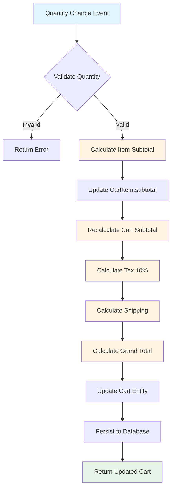
```mermaid
flowchart TD
    A[Quantity Change Event] --> B{Validate Quantity}
    B -->|Invalid| C[Return Error]
    B -->|Valid| D[Calculate Item Subtotal]
    D --> E[Update CartItem.subtotal]
    E --> F[Recalculate Cart Subtotal]
    F --> G[Calculate Tax 10%]
    G --> H[Calculate Shipping]
    H --> I[Calculate Grand Total]
    I --> J[Update Cart Entity]
    J --> K[Persist to Database]
    K --> L[Return Updated Cart]
    
    style A fill:#e1f5ff
    style D fill:#fff4e1
    style F fill:#fff4e1
    style G fill:#fff4e1
    style H fill:#fff4e1
    style I fill:#fff4e1
    style L fill:#e7f5e7
```

#### Calculation Logic Sequence

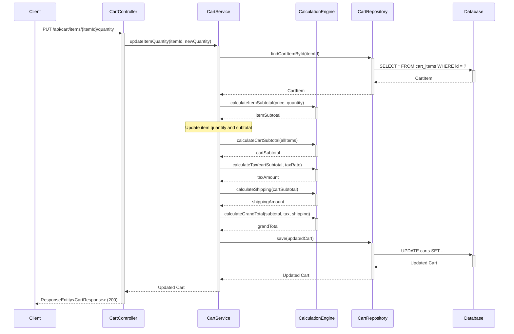
```mermaid
sequenceDiagram
    participant Client
    participant CartController
    participant CartService
    participant CalculationEngine
    participant CartRepository
    participant Database
    
    Client->>+CartController: PUT /api/cart/items/{itemId}/quantity
    CartController->>+CartService: updateItemQuantity(itemId, newQuantity)
    CartService->>+CartRepository: findCartItemById(itemId)
    CartRepository->>+Database: SELECT * FROM cart_items WHERE id = ?
    Database-->>-CartRepository: CartItem
    CartRepository-->>-CartService: CartItem
    
    CartService->>+CalculationEngine: calculateItemSubtotal(price, quantity)
    CalculationEngine-->>-CartService: itemSubtotal
    
    Note over CartService: Update item quantity and subtotal
    
    CartService->>+CalculationEngine: calculateCartSubtotal(allItems)
    CalculationEngine-->>-CartService: cartSubtotal
    
    CartService->>+CalculationEngine: calculateTax(cartSubtotal, taxRate)
    CalculationEngine-->>-CartService: taxAmount
    
    CartService->>+CalculationEngine: calculateShipping(cartSubtotal)
    CalculationEngine-->>-CartService: shippingAmount
    
    CartService->>+CalculationEngine: calculateGrandTotal(subtotal, tax, shipping)
    CalculationEngine-->>-CartService: grandTotal
    
    CartService->>+CartRepository: save(updatedCart)
    CartRepository->>+Database: UPDATE carts SET ...
    Database-->>-CartRepository: Updated Cart
    CartRepository-->>-CartService: Updated Cart
    
    CartService-->>-CartController: Updated Cart
    CartController-->>-Client: ResponseEntity<CartResponse> (200)
```

#### Calculation Engine Implementation

```java
@Component
public class CartCalculationEngine {
    
    private static final BigDecimal TAX_RATE = new BigDecimal("0.10"); // 10% tax
    private static final BigDecimal FREE_SHIPPING_THRESHOLD = new BigDecimal("50.00");
    private static final BigDecimal STANDARD_SHIPPING = new BigDecimal("5.99");
    
    public BigDecimal calculateItemSubtotal(BigDecimal price, Integer quantity) {
        return price.multiply(new BigDecimal(quantity)).setScale(2, RoundingMode.HALF_UP);
    }
    
    public BigDecimal calculateCartSubtotal(List<CartItem> items) {
        return items.stream()
            .map(CartItem::getSubtotal)
            .reduce(BigDecimal.ZERO, BigDecimal::add)
            .setScale(2, RoundingMode.HALF_UP);
    }
    
    public BigDecimal calculateTax(BigDecimal subtotal) {
        return subtotal.multiply(TAX_RATE).setScale(2, RoundingMode.HALF_UP);
    }
    
    public BigDecimal calculateShipping(BigDecimal subtotal) {
        if (subtotal.compareTo(FREE_SHIPPING_THRESHOLD) >= 0) {
            return BigDecimal.ZERO;
        }
        return STANDARD_SHIPPING;
    }
    
    public BigDecimal calculateGrandTotal(BigDecimal subtotal, BigDecimal tax, BigDecimal shipping) {
        return subtotal.add(tax).add(shipping).setScale(2, RoundingMode.HALF_UP);
    }
}
```

### 9.4 Cart State Management

**Requirement Reference:** Epic Summary - Shopping cart management with persistent state

**Description:** Design cart persistence mechanism using local storage and database synchronization for session management

#### State Management Architecture

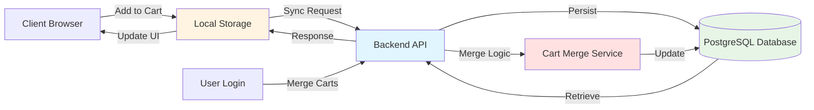
```mermaid
flowchart LR
    A[Client Browser] -->|Add to Cart| B[Local Storage]
    B -->|Sync Request| C[Backend API]
    C -->|Persist| D[(PostgreSQL Database)]
    D -->|Retrieve| C
    C -->|Response| B
    B -->|Update UI| A
    
    E[User Login] -->|Merge Carts| C
    C -->|Merge Logic| F[Cart Merge Service]
    F -->|Update| D
    
    style B fill:#fff4e1
    style C fill:#e1f5ff
    style D fill:#e7f5e7
    style F fill:#ffe1e1
```

#### Cart State Synchronization Sequence

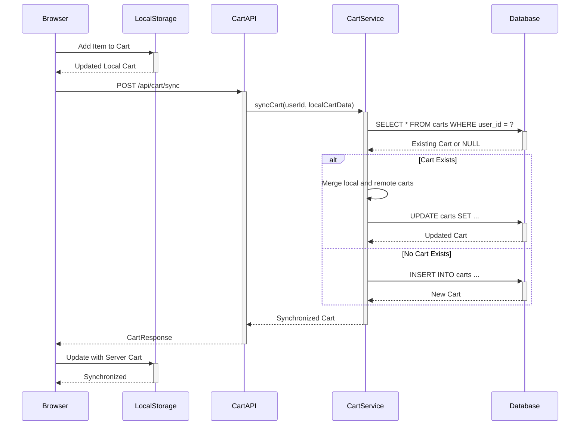
```mermaid
sequenceDiagram
    participant Browser
    participant LocalStorage
    participant CartAPI
    participant CartService
    participant Database
    
    Browser->>+LocalStorage: Add Item to Cart
    LocalStorage-->>-Browser: Updated Local Cart
    
    Browser->>+CartAPI: POST /api/cart/sync
    CartAPI->>+CartService: syncCart(userId, localCartData)
    
    CartService->>+Database: SELECT * FROM carts WHERE user_id = ?
    Database-->>-CartService: Existing Cart or NULL
    
    alt Cart Exists
        CartService->>CartService: Merge local and remote carts
        CartService->>+Database: UPDATE carts SET ...
        Database-->>-CartService: Updated Cart
    else No Cart Exists
        CartService->>+Database: INSERT INTO carts ...
        Database-->>-CartService: New Cart
    end
    
    CartService-->>-CartAPI: Synchronized Cart
    CartAPI-->>-Browser: CartResponse
    Browser->>+LocalStorage: Update with Server Cart
    LocalStorage-->>-Browser: Synchronized
```

#### Session Management Strategy

**Anonymous Users:**
- Cart stored in browser localStorage
- Temporary session ID generated
- No database persistence until checkout or login

**Authenticated Users:**
- Cart persisted in PostgreSQL database
- Associated with user_id
- Synchronized across devices
- Merged with anonymous cart on login

**Cart Expiration Policy:**
- Anonymous carts: 7 days in localStorage
- Authenticated carts: 30 days in database
- Automatic cleanup job runs daily

### 9.5 Empty Cart Handling

**Requirement Reference:** Story Description - Display 'Your cart is empty' message with continue shopping link

**Description:** Implement empty cart detection logic and UI components for empty state messaging and navigation

#### Empty Cart Detection Flow

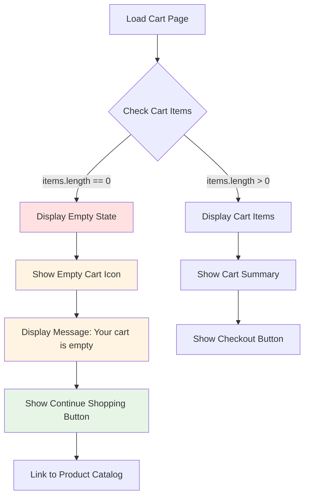
```mermaid
flowchart TD
    A[Load Cart Page] --> B{Check Cart Items}
    B -->|items.length > 0| C[Display Cart Items]
    B -->|items.length == 0| D[Display Empty State]
    D --> E[Show Empty Cart Icon]
    E --> F[Display Message: Your cart is empty]
    F --> G[Show Continue Shopping Button]
    G --> H[Link to Product Catalog]
    
    C --> I[Show Cart Summary]
    I --> J[Show Checkout Button]
    
    style D fill:#ffe1e1
    style E fill:#fff4e1
    style F fill:#fff4e1
    style G fill:#e7f5e7
```

#### Empty Cart Component Specification

**UI Elements:**
- Empty cart icon (shopping cart with slash or empty box)
- Heading: "Your cart is empty"
- Subtext: "Looks like you haven't added any items yet"
- Primary CTA button: "Continue Shopping" → redirects to /products
- Optional: Display recommended products or popular items

**Implementation Logic:**
```java
@GetMapping("/api/cart")
public ResponseEntity<CartResponse> getCart(@AuthenticationPrincipal UserDetails user) {
    Cart cart = cartService.getCartByUserId(user.getUsername());
    
    if (cart == null || cart.getItems().isEmpty()) {
        return ResponseEntity.ok(CartResponse.builder()
            .isEmpty(true)
            .message("Your cart is empty")
            .itemCount(0)
            .build());
    }
    
    return ResponseEntity.ok(CartResponse.builder()
        .isEmpty(false)
        .cart(cart)
        .itemCount(cart.getItems().size())
        .build());
}
```

### 9.6 Cart UI Components

**Requirement Reference:** Story Summary - Shopping Cart Module with product display, quantity controls, cost breakdown

**Description:** Design cart item display components, quantity increment/decrement controls, remove buttons, and cost breakdown section

#### Cart UI Component Architecture

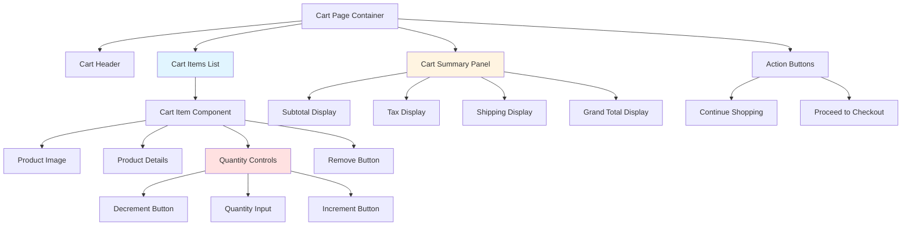
```mermaid
flowchart TD
    A[Cart Page Container] --> B[Cart Header]
    A --> C[Cart Items List]
    A --> D[Cart Summary Panel]
    A --> E[Action Buttons]
    
    C --> F[Cart Item Component]
    F --> G[Product Image]
    F --> H[Product Details]
    F --> I[Quantity Controls]
    F --> J[Remove Button]
    
    I --> K[Decrement Button]
    I --> L[Quantity Input]
    I --> M[Increment Button]
    
    D --> N[Subtotal Display]
    D --> O[Tax Display]
    D --> P[Shipping Display]
    D --> Q[Grand Total Display]
    
    E --> R[Continue Shopping]
    E --> S[Proceed to Checkout]
    
    style C fill:#e1f5ff
    style D fill:#fff4e1
    style I fill:#ffe1e1
```

#### Cart Item Component Specification

**CartItem Component Structure:**
```
┌─────────────────────────────────────────────────────────┐
│ [Product Image]  Product Name                      [X]  │
│                  Category: Electronics                   │
│                  Price: $299.99                          │
│                  [ - ] [ 2 ] [ + ]                       │
│                  Subtotal: $599.98                       │
└─────────────────────────────────────────────────────────┘
```

**Quantity Controls Behavior:**
- Decrement button: Decreases quantity by 1 (min: 1)
- Increment button: Increases quantity by 1 (max: stock quantity)
- Direct input: Allows manual entry with validation
- Real-time subtotal update on quantity change
- Debounced API call (500ms) to prevent excessive requests

**Cart Summary Panel:**
```
┌─────────────────────────────┐
│ Order Summary               │
├─────────────────────────────┤
│ Subtotal:        $1,299.97  │
│ Tax (10%):         $130.00  │
│ Shipping:            $5.99  │
├─────────────────────────────┤
│ Grand Total:     $1,435.96  │
├─────────────────────────────┤
│ [Proceed to Checkout]       │
└─────────────────────────────┘
```

### 9.7 Product Catalog Integration

**Requirement Reference:** Epic Summary - Product discovery and Add to Cart functionality

**Description:** Define integration points between product catalog and cart system for seamless product addition

#### Product to Cart Integration Flow

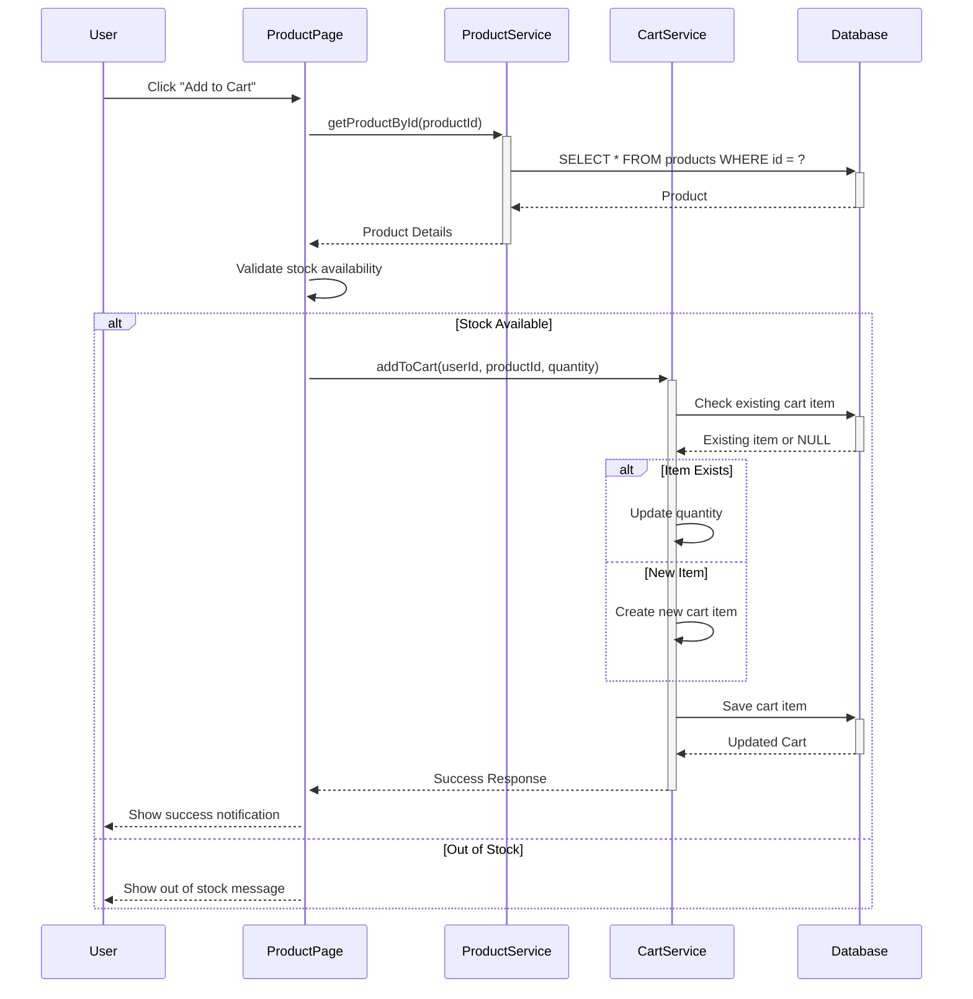
```mermaid
sequenceDiagram
    participant User
    participant ProductPage
    participant ProductService
    participant CartService
    participant Database
    
    User->>+ProductPage: Click "Add to Cart"
    ProductPage->>+ProductService: getProductById(productId)
    ProductService->>+Database: SELECT * FROM products WHERE id = ?
    Database-->>-ProductService: Product
    ProductService-->>-ProductPage: Product Details
    
    ProductPage->>ProductPage: Validate stock availability
    
    alt Stock Available
        ProductPage->>+CartService: addToCart(userId, productId, quantity)
        CartService->>+Database: Check existing cart item
        Database-->>-CartService: Existing item or NULL
        
        alt Item Exists
            CartService->>CartService: Update quantity
        else New Item
            CartService->>CartService: Create new cart item
        end
        
        CartService->>+Database: Save cart item
        Database-->>-CartService: Updated Cart
        CartService-->>-ProductPage: Success Response
        ProductPage-->>User: Show success notification
    else Out of Stock
        ProductPage-->>User: Show out of stock message
    end
```

#### Add to Cart Button Integration

**Product Listing Page:**
- Quick "Add to Cart" button on each product card
- Default quantity: 1
- Success feedback: Toast notification + cart icon badge update

**Product Detail Page:**
- Quantity selector before adding to cart
- Stock availability indicator
- "Add to Cart" primary button
- "Buy Now" secondary button (add to cart + redirect to checkout)

**Integration API Contract:**
```java
@PostMapping("/api/cart/add")
public ResponseEntity<CartResponse> addToCart(@RequestBody CartItemRequest request) {
    // Request: { productId, quantity }
    // Response: { cart, itemCount, message }
}
```

### 9.8 Checkout Integration

**Requirement Reference:** Epic Summary - Order placement and checkout processing

**Description:** Design cart-to-checkout data flow and order creation process with cart contents transfer

#### Cart to Checkout Flow

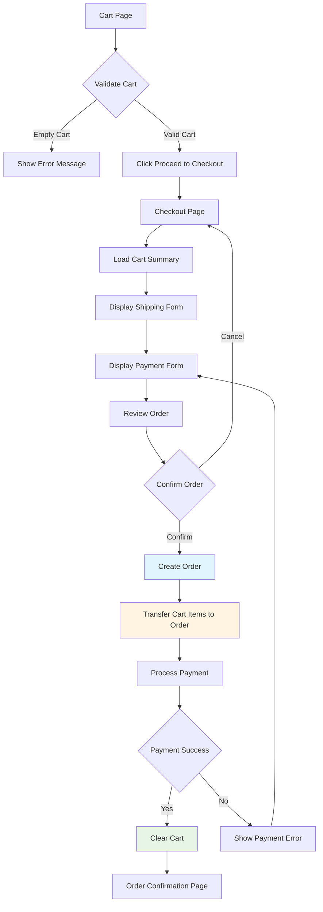
```mermaid
flowchart TD
    A[Cart Page] --> B{Validate Cart}
    B -->|Empty Cart| C[Show Error Message]
    B -->|Valid Cart| D[Click Proceed to Checkout]
    D --> E[Checkout Page]
    E --> F[Load Cart Summary]
    F --> G[Display Shipping Form]
    G --> H[Display Payment Form]
    H --> I[Review Order]
    I --> J{Confirm Order}
    J -->|Cancel| E
    J -->|Confirm| K[Create Order]
    K --> L[Transfer Cart Items to Order]
    L --> M[Process Payment]
    M --> N{Payment Success}
    N -->|Yes| O[Clear Cart]
    O --> P[Order Confirmation Page]
    N -->|No| Q[Show Payment Error]
    Q --> H
    
    style K fill:#e1f5ff
    style L fill:#fff4e1
    style O fill:#e7f5e7
```

#### Checkout Integration Sequence

```mermaid
sequenceDiagram
    participant User
    participant CheckoutPage
    participant CartService
    participant OrderService
    participant PaymentService
    participant Database
    
    User->>+CheckoutPage: Click "Proceed to Checkout"
    CheckoutPage->>+CartService: getCart(userId)
    CartService->>+Database: SELECT cart with items
    Database-->>-CartService: Cart with items
    CartService-->>-CheckoutPage: Cart data
    
    CheckoutPage->>CheckoutPage: Display cart summary
    User->>CheckoutPage: Enter shipping details
    User->>CheckoutPage: Enter payment details
    User->>CheckoutPage: Click "Place Order"
    
    CheckoutPage->>+OrderService: createOrder(userId, cartId, shippingInfo, paymentInfo)
    OrderService->>+CartService: validateCart(cartId)
    CartService-->>-OrderService: Validation result
    
    alt Cart Valid
        OrderService->>+Database: BEGIN TRANSACTION
        OrderService->>Database: INSERT INTO orders ...
        OrderService->>Database: INSERT INTO order_items (from cart_items)
        
        OrderService->>+PaymentService: processPayment(orderTotal, paymentInfo)
        PaymentService-->>-OrderService: Payment result
        
        alt Payment Success
            OrderService->>+CartService: clearCart(userId)
            CartService->>Database: DELETE FROM cart_items WHERE cart_id = ?
            CartService-->>-OrderService: Cart cleared
            OrderService->>Database: COMMIT TRANSACTION
            OrderService-->>-CheckoutPage: Order created successfully
            CheckoutPage-->>User: Redirect to order confirmation
        else Payment Failed
            OrderService->>Database: ROLLBACK TRANSACTION
            OrderService-->>CheckoutPage: Payment error
            CheckoutPage-->>User: Show payment error message
        end
    else Cart Invalid
        OrderService-->>CheckoutPage: Cart validation error
        CheckoutPage-->>User: Show validation error
    end
```

#### Order Creation Data Transfer

**Cart to Order Mapping:**
```java
public Order createOrderFromCart(Cart cart, ShippingInfo shipping, PaymentInfo payment) {
    Order order = new Order();
    order.setUserId(cart.getUserId());
    order.setSubtotal(cart.getSubtotal());
    order.setTax(cart.getTax());
    order.setShipping(cart.getShipping());
    order.setGrandTotal(cart.getGrandTotal());
    order.setShippingAddress(shipping.getAddress());
    order.setPaymentMethod(payment.getMethod());
    order.setStatus(OrderStatus.PENDING);
    
    List<OrderItem> orderItems = cart.getItems().stream()
        .map(cartItem -> OrderItem.builder()
            .productId(cartItem.getProductId())
            .productName(cartItem.getProductName())
            .price(cartItem.getProductPrice())
            .quantity(cartItem.getQuantity())
            .subtotal(cartItem.getSubtotal())
            .build())
        .collect(Collectors.toList());
    
    order.setItems(orderItems);
    return order;
}
```

### 9.9 Validation Rules

**Requirement Reference:** Story Description - Quantity validation and inventory limits

**Description:** Implement validation logic for quantity limits (min 1, max inventory), product availability, and cart constraints

#### Validation Rules Specification

**Quantity Validation:**
- Minimum quantity: 1
- Maximum quantity: Product stock quantity
- Quantity must be positive integer
- Cannot exceed available inventory

**Product Availability Validation:**
- Product must exist in catalog
- Product must be active/published
- Product must have stock > 0
- Product price must be valid (> 0)

**Cart Constraints:**
- Maximum items per cart: 50
- Maximum quantity per item: 99
- Maximum cart value: $10,000
- Duplicate products: Update quantity instead of adding new item

#### Validation Flow Diagram

```mermaid
flowchart TD
    A[Add to Cart Request] --> B{Product Exists?}
    B -->|No| C[Return 404 Error]
    B -->|Yes| D{Product Active?}
    D -->|No| E[Return 400 Error: Product unavailable]
    D -->|Yes| F{Stock Available?}
    F -->|No| G[Return 400 Error: Out of stock]
    F -->|Yes| H{Validate Quantity}
    H -->|Invalid| I[Return 400 Error: Invalid quantity]
    H -->|Valid| J{Check Cart Limits}
    J -->|Exceeded| K[Return 400 Error: Cart limit exceeded]
    J -->|Valid| L{Item Already in Cart?}
    L -->|Yes| M[Update Quantity]
    L -->|No| N[Add New Item]
    M --> O[Recalculate Totals]
    N --> O
    O --> P[Save Cart]
    P --> Q[Return Success]
    
    style C fill:#ffe1e1
    style E fill:#ffe1e1
    style G fill:#ffe1e1
    style I fill:#ffe1e1
    style K fill:#ffe1e1
    style Q fill:#e7f5e7
```

#### Validation Implementation

```java
@Service
public class CartValidationService {
    
    private static final int MAX_ITEMS_PER_CART = 50;
    private static final int MAX_QUANTITY_PER_ITEM = 99;
    private static final BigDecimal MAX_CART_VALUE = new BigDecimal("10000.00");
    
    public void validateAddToCart(Product product, Integer quantity, Cart cart) {
        // Product validation
        if (product == null) {
            throw new ProductNotFoundException("Product not found");
        }
        if (!product.isActive()) {
            throw new ProductUnavailableException("Product is not available");
        }
        if (product.getStockQuantity() <= 0) {
            throw new OutOfStockException("Product is out of stock");
        }
        
        // Quantity validation
        if (quantity == null || quantity < 1) {
            throw new InvalidQuantityException("Quantity must be at least 1");
        }
        if (quantity > product.getStockQuantity()) {
            throw new InvalidQuantityException(
                String.format("Only %d items available", product.getStockQuantity()));
        }
        if (quantity > MAX_QUANTITY_PER_ITEM) {
            throw new InvalidQuantityException(
                String.format("Maximum quantity per item is %d", MAX_QUANTITY_PER_ITEM));
        }
        
        // Cart constraints validation
        if (cart.getItems().size() >= MAX_ITEMS_PER_CART) {
            throw new CartLimitExceededException(
                String.format("Maximum %d items allowed in cart", MAX_ITEMS_PER_CART));
        }
        
        BigDecimal newCartValue = cart.getGrandTotal()
            .add(product.getPrice().multiply(new BigDecimal(quantity)));
        if (newCartValue.compareTo(MAX_CART_VALUE) > 0) {
            throw new CartLimitExceededException(
                String.format("Cart value cannot exceed $%s", MAX_CART_VALUE));
        }
    }
    
    public void validateQuantityUpdate(CartItem item, Integer newQuantity, Product product) {
        if (newQuantity < 1) {
            throw new InvalidQuantityException("Quantity must be at least 1");
        }
        if (newQuantity > product.getStockQuantity()) {
            throw new InvalidQuantityException(
                String.format("Only %d items available", product.getStockQuantity()));
        }
        if (newQuantity > MAX_QUANTITY_PER_ITEM) {
            throw new InvalidQuantityException(
                String.format("Maximum quantity per item is %d", MAX_QUANTITY_PER_ITEM));
        }
    }
}
```

### 9.10 Error Handling

**Requirement Reference:** Epic Summary - Error handling and user feedback requirements

**Description:** Design error handling mechanisms for cart operations, inventory conflicts, and user notification system

#### Error Handling Architecture

```mermaid
flowchart TD
    A[Cart Operation] --> B{Operation Type}
    B -->|Add Item| C[Add Item Handler]
    B -->|Update Quantity| D[Update Handler]
    B -->|Remove Item| E[Remove Handler]
    B -->|Checkout| F[Checkout Handler]
    
    C --> G{Validation}
    D --> G
    E --> G
    F --> G
    
    G -->|Pass| H[Execute Operation]
    G -->|Fail| I[Error Handler]
    
    I --> J{Error Type}
    J -->|Validation Error| K[400 Bad Request]
    J -->|Not Found| L[404 Not Found]
    J -->|Conflict| M[409 Conflict]
    J -->|Server Error| N[500 Internal Error]
    
    K --> O[User Notification]
    L --> O
    M --> O
    N --> O
    
    H --> P[Success Response]
    P --> Q[Update UI]
    O --> Q
    
    style I fill:#ffe1e1
    style O fill:#fff4e1
    style P fill:#e7f5e7
```

#### Error Types and Responses

**1. Validation Errors (400 Bad Request)**
```json
{
  "error": "INVALID_QUANTITY",
  "message": "Quantity must be between 1 and 99",
  "field": "quantity",
  "timestamp": "2024-01-15T10:30:00Z"
}
```

**2. Product Not Found (404 Not Found)**
```json
{
  "error": "PRODUCT_NOT_FOUND",
  "message": "Product with ID 12345 not found",
  "productId": 12345,
  "timestamp": "2024-01-15T10:30:00Z"
}
```

**3. Out of Stock (409 Conflict)**
```json
{
  "error": "OUT_OF_STOCK",
  "message": "Product is currently out of stock",
  "productId": 12345,
  "availableQuantity": 0,
  "timestamp": "2024-01-15T10:30:00Z"
}
```

**4. Insufficient Stock (409 Conflict)**
```json
{
  "error": "INSUFFICIENT_STOCK",
  "message": "Only 5 items available in stock",
  "productId": 12345,
  "requestedQuantity": 10,
  "availableQuantity": 5,
  "timestamp": "2024-01-15T10:30:00Z"
}
```

**5. Cart Limit Exceeded (400 Bad Request)**
```json
{
  "error": "CART_LIMIT_EXCEEDED",
  "message": "Maximum 50 items allowed in cart",
  "currentItemCount": 50,
  "maxItemCount": 50,
  "timestamp": "2024-01-15T10:30:00Z"
}
```

#### Global Exception Handler

```java
@RestControllerAdvice
public class CartExceptionHandler {
    
    @ExceptionHandler(ProductNotFoundException.class)
    public ResponseEntity<ErrorResponse> handleProductNotFound(ProductNotFoundException ex) {
        ErrorResponse error = ErrorResponse.builder()
            .error("PRODUCT_NOT_FOUND")
            .message(ex.getMessage())
            .timestamp(LocalDateTime.now())
            .build();
        return ResponseEntity.status(HttpStatus.NOT_FOUND).body(error);
    }
    
    @ExceptionHandler(InvalidQuantityException.class)
    public ResponseEntity<ErrorResponse> handleInvalidQuantity(InvalidQuantityException ex) {
        ErrorResponse error = ErrorResponse.builder()
            .error("INVALID_QUANTITY")
            .message(ex.getMessage())
            .timestamp(LocalDateTime.now())
            .build();
        return ResponseEntity.status(HttpStatus.BAD_REQUEST).body(error);
    }
    
    @ExceptionHandler(OutOfStockException.class)
    public ResponseEntity<ErrorResponse> handleOutOfStock(OutOfStockException ex) {
        ErrorResponse error = ErrorResponse.builder()
            .error("OUT_OF_STOCK")
            .message(ex.getMessage())
            .timestamp(LocalDateTime.now())
            .build();
        return ResponseEntity.status(HttpStatus.CONFLICT).body(error);
    }
    
    @ExceptionHandler(CartLimitExceededException.class)
    public ResponseEntity<ErrorResponse> handleCartLimitExceeded(CartLimitExceededException ex) {
        ErrorResponse error = ErrorResponse.builder()
            .error("CART_LIMIT_EXCEEDED")
            .message(ex.getMessage())
            .timestamp(LocalDateTime.now())
            .build();
        return ResponseEntity.status(HttpStatus.BAD_REQUEST).body(error);
    }
    
    @ExceptionHandler(Exception.class)
    public ResponseEntity<ErrorResponse> handleGenericException(Exception ex) {
        ErrorResponse error = ErrorResponse.builder()
            .error("INTERNAL_SERVER_ERROR")
            .message("An unexpected error occurred")
            .timestamp(LocalDateTime.now())
            .build();
        return ResponseEntity.status(HttpStatus.INTERNAL_SERVER_ERROR).body(error);
    }
}
```

#### User Notification System

**Notification Types:**

1. **Success Notifications (Green Toast)**
   - "Product added to cart successfully"
   - "Cart updated successfully"
   - "Item removed from cart"

2. **Warning Notifications (Yellow Toast)**
   - "Only X items available in stock"
   - "Cart limit approaching (45/50 items)"

3. **Error Notifications (Red Toast)**
   - "Product is out of stock"
   - "Failed to add item to cart"
   - "Invalid quantity specified"

4. **Info Notifications (Blue Toast)**
   - "Cart synchronized with server"
   - "Free shipping unlocked!"

**Notification Display Sequence:**
```mermaid
sequenceDiagram
    participant User
    participant UI
    participant API
    participant NotificationService
    
    User->>+UI: Perform cart action
    UI->>+API: API request
    API-->>-UI: Response (success/error)
    
    alt Success
        UI->>+NotificationService: showSuccess(message)
        NotificationService->>UI: Display green toast
        NotificationService-->>-UI: Auto-dismiss after 3s
    else Error
        UI->>+NotificationService: showError(message)
        NotificationService->>UI: Display red toast
        NotificationService-->>-UI: Auto-dismiss after 5s
    end
    
    UI-->>-User: Updated UI + notification
```

## 10. Shopping Cart Database Schema

### Cart Tables SQL

```sql
-- Carts table
CREATE TABLE carts (
    id BIGINT PRIMARY KEY AUTO_INCREMENT,
    user_id VARCHAR(100) NOT NULL,
    subtotal DECIMAL(10,2) NOT NULL DEFAULT 0.00,
    tax DECIMAL(10,2) NOT NULL DEFAULT 0.00,
    shipping DECIMAL(10,2) NOT NULL DEFAULT 0.00,
    grand_total DECIMAL(10,2) NOT NULL DEFAULT 0.00,
    created_at TIMESTAMP NOT NULL DEFAULT CURRENT_TIMESTAMP,
    updated_at TIMESTAMP NOT NULL DEFAULT CURRENT_TIMESTAMP ON UPDATE CURRENT_TIMESTAMP,
    UNIQUE KEY uk_carts_user_id (user_id)
);

-- Cart items table
CREATE TABLE cart_items (
    id BIGINT PRIMARY KEY AUTO_INCREMENT,
    cart_id BIGINT NOT NULL,
    product_id BIGINT NOT NULL,
    product_name VARCHAR(255) NOT NULL,
    product_price DECIMAL(10,2) NOT NULL,
    quantity INTEGER NOT NULL DEFAULT 1,
    subtotal DECIMAL(10,2) NOT NULL,
    added_at TIMESTAMP NOT NULL DEFAULT CURRENT_TIMESTAMP,
    FOREIGN KEY (cart_id) REFERENCES carts(id) ON DELETE CASCADE,
    FOREIGN KEY (product_id) REFERENCES products(id) ON DELETE CASCADE,
    UNIQUE KEY uk_cart_items_cart_product (cart_id, product_id)
);

-- Indexes for performance
CREATE INDEX idx_carts_user_id ON carts(user_id);
CREATE INDEX idx_cart_items_cart_id ON cart_items(cart_id);
CREATE INDEX idx_cart_items_product_id ON cart_items(product_id);
```

## 11. Shopping Cart API Endpoints Extended

| Method | Endpoint | Description | Request Body | Response | Status Codes |
|--------|----------|-------------|--------------|----------|-------------|
| POST | `/api/cart/add` | Add product to cart | `{productId, quantity}` | CartResponse | 200, 400, 404, 409 |
| PUT | `/api/cart/items/{itemId}/quantity` | Update item quantity | `{quantity}` | CartResponse | 200, 400, 404, 409 |
| DELETE | `/api/cart/items/{itemId}` | Remove item from cart | None | CartResponse | 200, 404 |
| GET | `/api/cart` | Get cart contents | None | CartResponse | 200 |
| DELETE | `/api/cart/clear` | Clear all cart items | None | MessageResponse | 200 |
| GET | `/api/cart/count` | Get total items count | None | Integer | 200 |
| POST | `/api/cart/sync` | Sync local cart with server | LocalCartData | CartResponse | 200, 400 |
| POST | `/api/cart/validate` | Validate cart before checkout | None | ValidationResponse | 200, 400 |

## 12. Updated Technology Stack

- **Backend Framework:** Spring Boot 3.x
- **Language:** Java 21
- **Database:** PostgreSQL
- **ORM:** Spring Data JPA / Hibernate
- **Build Tool:** Maven/Gradle
- **API Documentation:** Swagger/OpenAPI 3
- **Caching:** Redis (for cart session management)
- **Message Queue:** RabbitMQ (for async cart operations)
- **Frontend State Management:** Redux/Context API
- **Local Storage:** Browser localStorage API

## 13. Updated Design Patterns

1. **MVC Pattern:** Separation of Controller, Service, and Repository layers
2. **Repository Pattern:** Data access abstraction through ProductRepository and CartRepository
3. **Dependency Injection:** Spring's IoC container manages dependencies
4. **DTO Pattern:** Data Transfer Objects for API requests/responses
5. **Exception Handling:** Custom exceptions for business logic errors
6. **Strategy Pattern:** Calculation engine for different pricing strategies
7. **Observer Pattern:** Real-time cart updates and notifications
8. **Factory Pattern:** Cart creation and initialization
9. **Singleton Pattern:** Cart calculation engine
10. **Command Pattern:** Cart operation commands (add, update, remove)

## 14. Updated Key Features

- RESTful API design following HTTP standards
- Proper HTTP status codes for different scenarios
- Input validation and error handling
- Database indexing for performance optimization
- Transactional operations for data consistency
- Pagination support for large datasets
- Search functionality with case-insensitive matching
- **Real-time cart calculations and updates**
- **Shopping cart state persistence and synchronization**
- **Inventory validation and conflict resolution**
- **Empty cart state handling**
- **Seamless product catalog integration**
- **Checkout integration with order creation**
- **Comprehensive error handling and user notifications**
- **Cart session management for anonymous and authenticated users**
- **Cart expiration and cleanup policies**