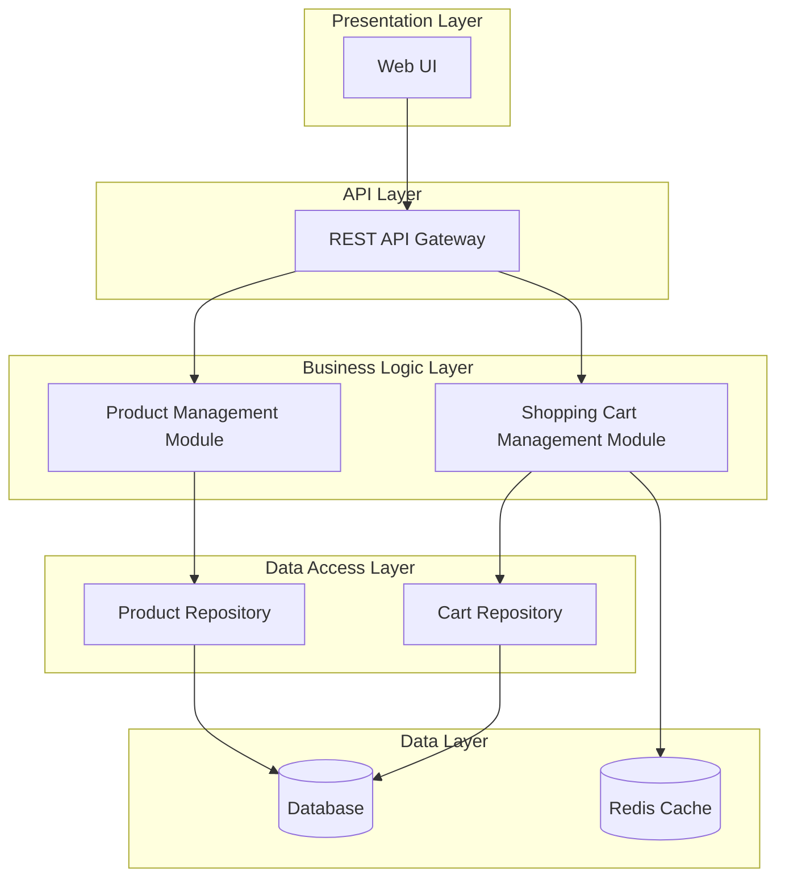
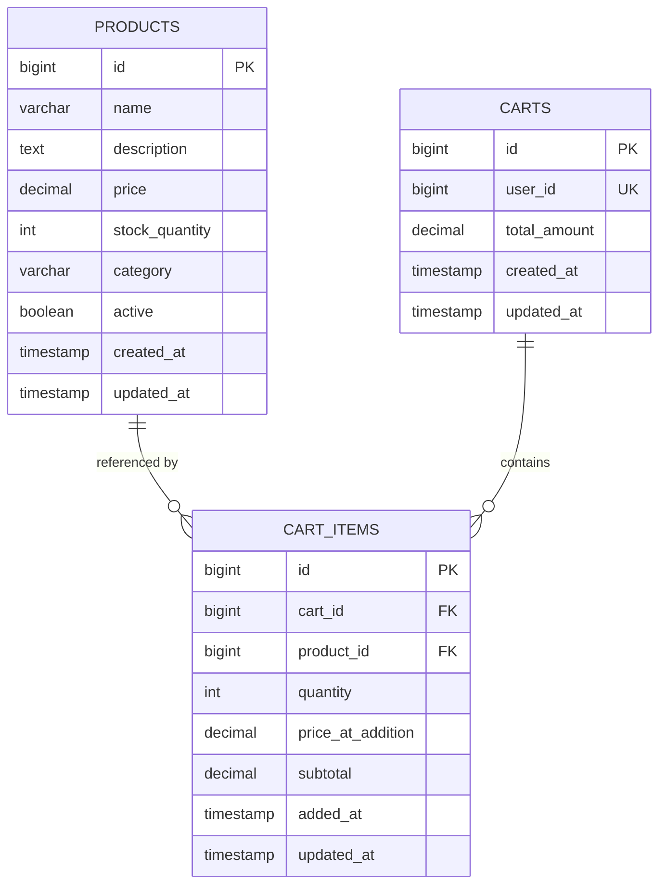

# Low-Level Design Document
## E-commerce Product Management System with Shopping Cart

### 1. System Overview

This document provides the low-level design for an e-commerce product management system with shopping cart functionality. The system enables users to browse products, manage a shopping cart, and view cart totals with price protection.

### 2. Architecture Overview



### 3. Module Design

#### 3.1 Product Management Module

##### 3.1.1 Components

**ProductController**
- Handles HTTP requests for product operations
- Validates input parameters
- Returns appropriate HTTP status codes

**ProductService**
- Implements business logic for product operations
- Manages product lifecycle
- Handles product validation rules

**ProductRepository**
- Provides data access abstraction
- Implements CRUD operations
- Handles database transactions

##### 3.1.2 Data Model

**Product Entity**
```java
@Entity
@Table(name = "products")
public class Product {
    @Id
    @GeneratedValue(strategy = GenerationType.IDENTITY)
    private Long id;
    
    @Column(nullable = false, length = 255)
    private String name;
    
    @Column(columnDefinition = "TEXT")
    private String description;
    
    @Column(nullable = false, precision = 10, scale = 2)
    private BigDecimal price;
    
    @Column(nullable = false)
    private Integer stockQuantity;
    
    @Column(length = 100)
    private String category;
    
    @Column(nullable = false)
    private Boolean active = true;
    
    @CreationTimestamp
    private LocalDateTime createdAt;
    
    @UpdateTimestamp
    private LocalDateTime updatedAt;
}
```

##### 3.1.3 API Endpoints

**GET /api/v1/products**
- Returns paginated list of active products
- Query parameters: page, size, category, sortBy
- Response: Page<ProductDTO>

**GET /api/v1/products/{id}**
- Returns single product details
- Path parameter: id
- Response: ProductDTO
- Error: 404 if not found

**POST /api/v1/products**
- Creates new product
- Request body: CreateProductRequest
- Response: ProductDTO
- Error: 400 if validation fails

**PUT /api/v1/products/{id}**
- Updates existing product
- Path parameter: id
- Request body: UpdateProductRequest
- Response: ProductDTO
- Error: 404 if not found, 400 if validation fails

**DELETE /api/v1/products/{id}**
- Soft deletes product (sets active = false)
- Path parameter: id
- Response: 204 No Content
- Error: 404 if not found

##### 3.1.4 Business Logic Implementation

**Product Creation**
1. Validate input data (name, price, stock)
2. Check for duplicate product names
3. Set default values (active = true)
4. Save to database
5. Return created product

**Product Update**
1. Verify product exists
2. Validate updated fields
3. Preserve audit fields (createdAt)
4. Update timestamp
5. Save changes
6. Return updated product

**Stock Management**
1. Validate stock quantity >= 0
2. Check for pending orders
3. Update stock atomically
4. Log stock changes

#### 3.2 Shopping Cart Management Module

##### 3.2.1 Components

**CartController**
- Handles HTTP requests for cart operations
- Manages user session/authentication
- Returns cart state with totals

**CartService**
- Implements shopping cart business logic
- Manages cart item operations
- Calculates subtotals and totals
- Handles price protection logic

**CartRepository**
- Provides cart data access
- Implements cart persistence
- Manages cart item relationships

##### 3.2.2 Data Model

**Cart Entity**
```java
@Entity
@Table(name = "carts")
public class Cart {
    @Id
    @GeneratedValue(strategy = GenerationType.IDENTITY)
    private Long id;
    
    @Column(nullable = false, unique = true)
    private Long userId;
    
    @OneToMany(mappedBy = "cart", cascade = CascadeType.ALL, orphanRemoval = true)
    private List<CartItem> items = new ArrayList<>();
    
    @Column(nullable = false, precision = 10, scale = 2)
    private BigDecimal totalAmount = BigDecimal.ZERO;
    
    @CreationTimestamp
    private LocalDateTime createdAt;
    
    @UpdateTimestamp
    private LocalDateTime updatedAt;
}
```

**CartItem Entity**
```java
@Entity
@Table(name = "cart_items")
public class CartItem {
    @Id
    @GeneratedValue(strategy = GenerationType.IDENTITY)
    private Long id;
    
    @ManyToOne(fetch = FetchType.LAZY)
    @JoinColumn(name = "cart_id", nullable = false)
    private Cart cart;
    
    @Column(nullable = false)
    private Long productId;
    
    @Column(nullable = false)
    private Integer quantity;
    
    @Column(nullable = false, precision = 10, scale = 2)
    private BigDecimal priceAtAddition;
    
    @Column(nullable = false, precision = 10, scale = 2)
    private BigDecimal subtotal;
    
    @CreationTimestamp
    private LocalDateTime addedAt;
    
    @UpdateTimestamp
    private LocalDateTime updatedAt;
}
```

**Note on Price Protection**: The `priceAtAddition` field in CartItem stores a snapshot of the product price at the time the item was added to the cart. This ensures price protection - the customer pays the price they saw when they added the item, even if the product price changes later. This snapshot is captured during the add-to-cart operation and remains immutable for that cart item.

##### 3.2.3 API Endpoints

**GET /api/v1/cart**
- Returns current user's cart with all items
- Response includes:
  - List of cart items with individual item subtotals (quantity × priceAtAddition)
  - Overall cart total (sum of all item subtotals)
  - Each item's product details, quantity, price snapshot, and calculated subtotal
- Response: CartDTO with itemSubtotals and cartTotal
- Error: 404 if cart not found

**POST /api/v1/cart/items**
- Adds product to cart
- Request body: AddToCartRequest (productId, quantity)
- Captures current product price as priceAtAddition
- Response: CartDTO
- Error: 400 if product not available, 404 if product not found

**PUT /api/v1/cart/items/{itemId}**
- Updates cart item quantity
- Path parameter: itemId
- Request body: UpdateCartItemRequest (quantity)
- Response: CartDTO
- Error: 404 if item not found, 400 if invalid quantity

**DELETE /api/v1/cart/items/{itemId}**
- Removes item from cart
- Path parameter: itemId
- Response: CartDTO
- Error: 404 if item not found

**DELETE /api/v1/cart**
- Clears entire cart
- Response: 204 No Content

##### 3.2.4 Business Logic Implementation

**Add to Cart**
1. Validate product exists and is active
2. Check product stock availability
3. Check if product already in cart
   - If exists: update quantity
   - If new: create cart item with current product price as priceAtAddition (price snapshot)
4. Calculate item subtotal (quantity × priceAtAddition)
5. Recalculate cart total (sum of all item subtotals)
6. Save cart
7. Return updated cart with individual item subtotals and overall cart total

**Update Cart Item**
1. Verify cart item exists
2. Validate new quantity > 0
3. Check product stock for new quantity
4. Update quantity
5. Recalculate item subtotal (quantity × priceAtAddition)
6. Recalculate cart total (sum of all item subtotals)
7. Save changes
8. Return updated cart with individual item subtotals and overall cart total

**Remove from Cart**
1. Verify cart item exists
2. Remove item from cart
3. Recalculate cart total (sum of remaining item subtotals)
4. Save cart
5. Return updated cart with individual item subtotals and overall cart total

**View Cart**
1. Retrieve cart for current user
2. Recalculate all item subtotals (quantity × priceAtAddition for each item)
3. Recalculate overall cart total (sum of all item subtotals)
4. If cart is empty, trigger UI redirection to 'continue shopping' link
5. Return cart with individual item subtotals and overall cart total

**Cart Calculation Rules**
- Subtotal and total recalculation must occur after EVERY cart mutation operation:
  - After adding items to cart
  - After updating item quantities
  - After removing items from cart
  - After viewing cart (to ensure consistency)
- Item subtotal = quantity × priceAtAddition (using price snapshot)
- Cart total = sum of all item subtotals
- All calculations use BigDecimal for precision
- Round to 2 decimal places

**Empty Cart Handling**
- When cart is empty (no items), the system must trigger UI redirection to display a 'continue shopping' link
- This ensures users are guided back to product browsing when their cart is empty
- Empty cart state returns CartDTO with empty items list and zero total

**Price Protection**
- Each cart item stores priceAtAddition (price snapshot at time of addition)
- Subtotals calculated using priceAtAddition, not current product price
- Price changes in product catalog don't affect existing cart items
- Ensures customer pays the price they saw when adding to cart

### 4. Data Transfer Objects (DTOs)

**ProductDTO**
```java
public class ProductDTO {
    private Long id;
    private String name;
    private String description;
    private BigDecimal price;
    private Integer stockQuantity;
    private String category;
    private Boolean active;
    private LocalDateTime createdAt;
    private LocalDateTime updatedAt;
}
```

**CartDTO**
```java
public class CartDTO {
    private Long id;
    private Long userId;
    private List<CartItemDTO> items;
    private BigDecimal totalAmount;
    private LocalDateTime createdAt;
    private LocalDateTime updatedAt;
}
```

**CartItemDTO**
```java
public class CartItemDTO {
    private Long id;
    private Long productId;
    private String productName;
    private Integer quantity;
    private BigDecimal priceAtAddition;
    private BigDecimal subtotal;
    private LocalDateTime addedAt;
}
```

### 5. Database Schema



### 6. Error Handling

**Error Response Format**
```json
{
    "timestamp": "2024-01-15T10:30:00Z",
    "status": 400,
    "error": "Bad Request",
    "message": "Validation failed",
    "path": "/api/v1/products",
    "errors": [
        {
            "field": "price",
            "message": "Price must be greater than 0"
        }
    ]
}
```

**Common Error Scenarios**
- 400 Bad Request: Invalid input, validation failures
- 404 Not Found: Resource doesn't exist
- 409 Conflict: Duplicate resource, concurrent modification
- 500 Internal Server Error: Unexpected system errors

### 7. Caching Strategy

**Product Cache**
- Cache frequently accessed products
- TTL: 5 minutes
- Invalidate on product update/delete
- Cache key: `product:{id}`

**Cart Cache**
- Cache active user carts
- TTL: 30 minutes
- Invalidate on cart modifications
- Cache key: `cart:user:{userId}`

### 8. Security Considerations

**Authentication**
- JWT-based authentication
- Token expiration: 24 hours
- Refresh token mechanism

**Authorization**
- Role-based access control (RBAC)
- Admin role for product management
- User role for cart operations

**Data Validation**
- Input sanitization
- SQL injection prevention
- XSS protection

### 9. Performance Optimization

**Database Indexes**
```sql
CREATE INDEX idx_products_category ON products(category);
CREATE INDEX idx_products_active ON products(active);
CREATE INDEX idx_carts_user_id ON carts(user_id);
CREATE INDEX idx_cart_items_cart_id ON cart_items(cart_id);
CREATE INDEX idx_cart_items_product_id ON cart_items(product_id);
```

**Query Optimization**
- Use pagination for product listings
- Eager loading for cart with items
- Batch operations for bulk updates

### 10. Monitoring and Logging

**Metrics to Track**
- API response times
- Database query performance
- Cache hit/miss ratios
- Error rates by endpoint

**Logging Levels**
- ERROR: System failures, exceptions
- WARN: Validation failures, business rule violations
- INFO: API requests, business operations
- DEBUG: Detailed execution flow

### 11. Testing Strategy

**Unit Tests**
- Service layer business logic
- Repository data access
- DTO mappings

**Integration Tests**
- API endpoint functionality
- Database transactions
- Cache operations

**Performance Tests**
- Load testing for concurrent users
- Stress testing for peak loads
- Endurance testing for stability

### 12. Deployment Considerations

**Environment Configuration**
- Development: Local database, debug logging
- Staging: Shared database, info logging
- Production: Clustered database, error logging

**Scalability**
- Horizontal scaling of API servers
- Database read replicas
- Redis cluster for caching

---

**Document Version**: 1.1  
**Last Updated**: 2024-01-15  
**Author**: Engineering Team