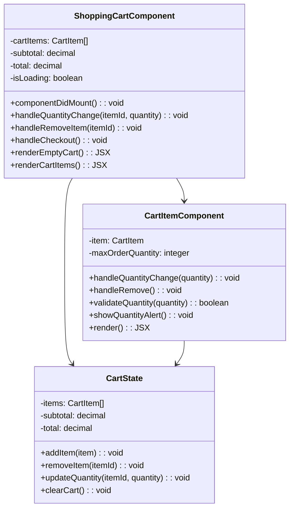

# Low Level Design Document
## E-Commerce Platform

### 1. Introduction

#### 1.1 Purpose
This Low Level Design (LLD) document provides detailed technical specifications for the E-Commerce Platform. It describes the internal structure, component interactions, data models, and implementation details necessary for development.

#### 1.2 Scope
This document covers:
- Detailed component architecture
- Class diagrams and relationships
- Sequence diagrams for key workflows
- Database schema design
- API specifications
- Security implementation details
- Error handling mechanisms

#### 1.3 Definitions and Acronyms
- **API**: Application Programming Interface
- **DTO**: Data Transfer Object
- **JWT**: JSON Web Token
- **ORM**: Object-Relational Mapping
- **REST**: Representational State Transfer
- **CRUD**: Create, Read, Update, Delete

### 2. System Architecture Overview

#### 2.1 Technology Stack

**Frontend:**
- React 18.x
- Redux Toolkit for state management
- React Router for navigation
- Axios for HTTP requests
- Material-UI component library

**Backend:**
- Node.js with Express.js framework
- PostgreSQL database
- Sequelize ORM
- JWT for authentication
- Bcrypt for password hashing

**Infrastructure:**
- Docker for containerization
- Nginx as reverse proxy
- Redis for caching
- AWS S3 for image storage

### 3. Component Design

#### 3.1 User Service

##### 3.1.1 Class Diagram


##### 3.1.2 Sequence Diagram - User Registration


##### 3.1.3 Implementation Details

**UserController.js**
```javascript
class UserController {
  constructor(userService) {
    this.userService = userService;
  }

  async register(req, res) {
    try {
      const { email, password, firstName, lastName, phone } = req.body;
      
      // Validation
      if (!email || !password || !firstName || !lastName) {
        return res.status(400).json({ error: 'Missing required fields' });
      }
      
      const user = await this.userService.createUser({
        email,
        password,
        firstName,
        lastName,
        phone
      });
      
      const token = this.userService.generateToken(user);
      
      res.status(201).json({
        user: {
          id: user.id,
          email: user.email,
          firstName: user.firstName,
          lastName: user.lastName
        },
        token
      });
    } catch (error) {
      if (error.message === 'User already exists') {
        return res.status(409).json({ error: error.message });
      }
      res.status(500).json({ error: 'Internal server error' });
    }
  }
}
```

#### 3.2 Product Service

##### 3.2.1 Class Diagram


##### 3.2.2 Sequence Diagram - Product Search


#### 3.3 Order Service

##### 3.3.1 Class Diagram


##### 3.3.2 Sequence Diagram - Order Creation


#### 3.4 Shopping Cart Component (Frontend)

##### 3.4.1 Component Structure



##### 3.4.2 Implementation Details

**ShoppingCartComponent.jsx**
```javascript
import React, { useEffect, useState } from 'react';
import { useSelector, useDispatch } from 'react-redux';
import { Link } from 'react-router-dom';
import CartItemComponent from './CartItemComponent';
import { fetchCart, updateCartItem, removeCartItem } from '../redux/cartSlice';

const ShoppingCartComponent = () => {
  const dispatch = useDispatch();
  const { items, subtotal, total, isLoading } = useSelector(state => state.cart);
  const [error, setError] = useState(null);

  useEffect(() => {
    dispatch(fetchCart());
  }, [dispatch]);

  const handleQuantityChange = async (itemId, quantity) => {
    try {
      await dispatch(updateCartItem({ itemId, quantity })).unwrap();
    } catch (err) {
      setError(err.message);
    }
  };

  const handleRemoveItem = async (itemId) => {
    try {
      await dispatch(removeCartItem(itemId)).unwrap();
    } catch (err) {
      setError(err.message);
    }
  };

  const handleCheckout = () => {
    // Navigate to checkout page
    window.location.href = '/checkout';
  };

  const renderEmptyCart = () => {
    return (
      <div className="empty-cart">
        <h2>Your cart is empty</h2>
        <p>Add items to your cart to get started</p>
        <Link to="/products" className="continue-shopping-link">
          Continue Shopping
        </Link>
      </div>
    );
  };

  const renderCartItems = () => {
    return (
      <div className="cart-container">
        <div className="cart-items">
          {items.map(item => (
            <CartItemComponent
              key={item.id}
              item={item}
              onQuantityChange={handleQuantityChange}
              onRemove={handleRemoveItem}
            />
          ))}
        </div>
        <div className="cart-summary">
          <div className="subtotal">
            <span>Subtotal:</span>
            <span>${subtotal.toFixed(2)}</span>
          </div>
          <div className="total">
            <span>Total:</span>
            <span>${total.toFixed(2)}</span>
          </div>
          <button onClick={handleCheckout} className="checkout-button">
            Proceed to Checkout
          </button>
        </div>
      </div>
    );
  };

  if (isLoading) {
    return <div>Loading cart...</div>;
  }

  if (error) {
    return <div className="error">{error}</div>;
  }

  return (
    <div className="shopping-cart">
      <h1>Shopping Cart</h1>
      {items.length === 0 ? renderEmptyCart() : renderCartItems()}
    </div>
  );
};

export default ShoppingCartComponent;
```

**CartItemComponent.jsx**
```javascript
import React, { useState } from 'react';
import PropTypes from 'prop-types';

const CartItemComponent = ({ item, onQuantityChange, onRemove }) => {
  const [quantity, setQuantity] = useState(item.quantity);
  const [showAlert, setShowAlert] = useState(false);
  const maxOrderQuantity = item.product.max_order_quantity || 10;

  const validateQuantity = (newQuantity) => {
    if (newQuantity > maxOrderQuantity) {
      setShowAlert(true);
      setTimeout(() => setShowAlert(false), 3000);
      return false;
    }
    return true;
  };

  const handleQuantityChange = (newQuantity) => {
    const qty = parseInt(newQuantity, 10);
    
    if (isNaN(qty) || qty < 1) {
      return;
    }

    if (!validateQuantity(qty)) {
      return;
    }

    setQuantity(qty);
    onQuantityChange(item.id, qty);
  };

  const handleIncrement = () => {
    const newQuantity = quantity + 1;
    if (validateQuantity(newQuantity)) {
      handleQuantityChange(newQuantity);
    }
  };

  const handleDecrement = () => {
    if (quantity > 1) {
      handleQuantityChange(quantity - 1);
    }
  };

  const handleRemove = () => {
    onRemove(item.id);
  };

  return (
    <div className="cart-item">
      {showAlert && (
        <div className="quantity-alert">
          Maximum order quantity is {maxOrderQuantity} for this product
        </div>
      )}
      <div className="item-image">
        
      </div>
      <div className="item-details">
        <h3>{item.product.name}</h3>
        <p className="item-price">${item.price.toFixed(2)}</p>
      </div>
      <div className="item-quantity">
        <button onClick={handleDecrement} disabled={quantity <= 1}>
          -
        </button>
        <input
          type="number"
          value={quantity}
          onChange={(e) => handleQuantityChange(e.target.value)}
          min="1"
          max={maxOrderQuantity}
        />
        <button onClick={handleIncrement}>
          +
        </button>
        <span className="max-quantity-hint">
          Max: {maxOrderQuantity}
        </span>
      </div>
      <div className="item-subtotal">
        <span>${(item.price * quantity).toFixed(2)}</span>
      </div>
      <div className="item-actions">
        <button onClick={handleRemove} className="remove-button">
          Remove
        </button>
      </div>
    </div>
  );
};

CartItemComponent.propTypes = {
  item: PropTypes.shape({
    id: PropTypes.string.isRequired,
    product: PropTypes.shape({
      name: PropTypes.string.isRequired,
      image: PropTypes.string.isRequired,
      max_order_quantity: PropTypes.number
    }).isRequired,
    quantity: PropTypes.number.isRequired,
    price: PropTypes.number.isRequired
  }).isRequired,
  onQuantityChange: PropTypes.func.isRequired,
  onRemove: PropTypes.func.isRequired
};

export default CartItemComponent;
```

#### 3.5 Shopping Cart Service (Backend)

##### 3.5.1 Class Diagram


##### 3.5.2 Sequence Diagram - Update Cart Item Quantity


##### 3.5.3 Implementation Details

**ShoppingCartController.js**
```javascript
class ShoppingCartController {
  constructor(cartService) {
    this.cartService = cartService;
  }

  async getCart(req, res) {
    try {
      const userId = req.user.id;
      const cart = await this.cartService.getCartByUserId(userId);
      
      res.status(200).json({ cart });
    } catch (error) {
      res.status(500).json({ error: 'Failed to retrieve cart' });
    }
  }

  async addItem(req, res) {
    try {
      const userId = req.user.id;
      const { productId, quantity } = req.body;
      
      if (!productId || !quantity) {
        return res.status(400).json({ error: 'Missing required fields' });
      }
      
      const cart = await this.cartService.addItemToCart(userId, {
        productId,
        quantity
      });
      
      res.status(200).json({ cart });
    } catch (error) {
      if (error.message.includes('exceeds maximum')) {
        return res.status(400).json({ error: error.message });
      }
      res.status(500).json({ error: 'Failed to add item to cart' });
    }
  }

  async updateItemQuantity(req, res) {
    try {
      const userId = req.user.id;
      const { itemId } = req.params;
      const { quantity } = req.body;
      
      if (!quantity || quantity < 1) {
        return res.status(400).json({ error: 'Invalid quantity' });
      }
      
      // Validate that updated quantity does not exceed product's max_order_quantity
      const cart = await this.cartService.updateItemQuantity(userId, itemId, quantity);
      
      res.status(200).json({ cart });
    } catch (error) {
      if (error.message.includes('exceeds maximum order quantity')) {
        return res.status(400).json({ 
          error: error.message,
          code: 'MAX_QUANTITY_EXCEEDED'
        });
      }
      if (error.message === 'Cart item not found') {
        return res.status(404).json({ error: error.message });
      }
      res.status(500).json({ error: 'Failed to update cart item' });
    }
  }

  async removeItem(req, res) {
    try {
      const userId = req.user.id;
      const { itemId } = req.params;
      
      const cart = await this.cartService.removeItemFromCart(userId, itemId);
      
      res.status(200).json({ cart });
    } catch (error) {
      if (error.message === 'Cart item not found') {
        return res.status(404).json({ error: error.message });
      }
      res.status(500).json({ error: 'Failed to remove item from cart' });
    }
  }

  async clearCart(req, res) {
    try {
      const userId = req.user.id;
      await this.cartService.clearCart(userId);
      
      res.status(200).json({ message: 'Cart cleared successfully' });
    } catch (error) {
      res.status(500).json({ error: 'Failed to clear cart' });
    }
  }
}

module.exports = ShoppingCartController;
```

**ShoppingCartService.js**
```javascript
class ShoppingCartService {
  constructor(cartRepository, productService) {
    this.cartRepository = cartRepository;
    this.productService = productService;
  }

  async getCartByUserId(userId) {
    let cart = await this.cartRepository.findByUserId(userId);
    
    if (!cart) {
      cart = await this.cartRepository.create({
        userId,
        items: [],
        subtotal: 0,
        total: 0
      });
    }
    
    return cart;
  }

  async addItemToCart(userId, itemData) {
    const { productId, quantity } = itemData;
    
    // Get product details
    const product = await this.productService.getProductById(productId);
    
    if (!product) {
      throw new Error('Product not found');
    }
    
    // Validate quantity against max_order_quantity
    if (quantity > product.max_order_quantity) {
      throw new Error(
        `Quantity ${quantity} exceeds maximum order quantity of ${product.max_order_quantity}`
      );
    }
    
    // Check stock availability
    if (quantity > product.stock) {
      throw new Error('Insufficient stock');
    }
    
    let cart = await this.getCartByUserId(userId);
    
    // Check if item already exists in cart
    const existingItem = cart.items.find(item => item.productId === productId);
    
    if (existingItem) {
      const newQuantity = existingItem.quantity + quantity;
      
      if (newQuantity > product.max_order_quantity) {
        throw new Error(
          `Total quantity ${newQuantity} exceeds maximum order quantity of ${product.max_order_quantity}`
        );
      }
      
      existingItem.quantity = newQuantity;
      existingItem.subtotal = existingItem.quantity * existingItem.price;
    } else {
      cart.items.push({
        productId,
        quantity,
        price: product.price,
        subtotal: quantity * product.price
      });
    }
    
    // Recalculate cart totals
    cart = this.recalculateCartTotals(cart);
    
    return await this.cartRepository.update(cart.id, cart);
  }

  async updateItemQuantity(userId, itemId, quantity) {
    const cart = await this.getCartByUserId(userId);
    
    const item = cart.items.find(i => i.id === itemId);
    
    if (!item) {
      throw new Error('Cart item not found');
    }
    
    // Get product details to validate max_order_quantity
    const product = await this.productService.getProductById(item.productId);
    
    if (!product) {
      throw new Error('Product not found');
    }
    
    // Validate that updated quantity does not exceed product's max_order_quantity
    if (quantity > product.max_order_quantity) {
      throw new Error(
        `Quantity ${quantity} exceeds maximum order quantity of ${product.max_order_quantity} for product ${product.name}`
      );
    }
    
    // Check stock availability
    if (quantity > product.stock) {
      throw new Error('Insufficient stock');
    }
    
    // Update item quantity and subtotal
    item.quantity = quantity;
    item.subtotal = item.quantity * item.price;
    
    // Recalculate cart totals whenever cart item quantity changes
    const updatedCart = this.recalculateCartTotals(cart);
    
    return await this.cartRepository.update(cart.id, updatedCart);
  }

  async removeItemFromCart(userId, itemId) {
    const cart = await this.getCartByUserId(userId);
    
    const itemIndex = cart.items.findIndex(i => i.id === itemId);
    
    if (itemIndex === -1) {
      throw new Error('Cart item not found');
    }
    
    cart.items.splice(itemIndex, 1);
    
    // Recalculate cart totals
    const updatedCart = this.recalculateCartTotals(cart);
    
    return await this.cartRepository.update(cart.id, updatedCart);
  }

  async clearCart(userId) {
    const cart = await this.getCartByUserId(userId);
    
    cart.items = [];
    cart.subtotal = 0;
    cart.total = 0;
    
    await this.cartRepository.update(cart.id, cart);
    
    return true;
  }

  recalculateCartTotals(cart) {
    // Calculate subtotal from all items
    cart.subtotal = cart.items.reduce((sum, item) => {
      return sum + (item.price * item.quantity);
    }, 0);
    
    // For now, total equals subtotal (can add tax, shipping, discounts later)
    cart.total = cart.subtotal;
    
    return cart;
  }
}

module.exports = ShoppingCartService;
```

### 4. Database Design

#### 4.1 Entity Relationship Diagram


#### 4.2 Table Schemas

##### 4.2.1 Users Table

```sql
CREATE TABLE users (
    id UUID PRIMARY KEY DEFAULT gen_random_uuid(),
    email VARCHAR(255) UNIQUE NOT NULL,
    password VARCHAR(255) NOT NULL,
    first_name VARCHAR(100) NOT NULL,
    last_name VARCHAR(100) NOT NULL,
    phone VARCHAR(20),
    created_at TIMESTAMP DEFAULT CURRENT_TIMESTAMP,
    updated_at TIMESTAMP DEFAULT CURRENT_TIMESTAMP
);

CREATE INDEX idx_users_email ON users(email);
```

##### 4.2.2 Products Table

```sql
CREATE TABLE products (
    id UUID PRIMARY KEY DEFAULT gen_random_uuid(),
    name VARCHAR(255) NOT NULL,
    description TEXT,
    price DECIMAL(10, 2) NOT NULL,
    stock INTEGER NOT NULL DEFAULT 0,
    max_order_quantity INTEGER NOT NULL DEFAULT 10,
    category_id UUID REFERENCES categories(id),
    images JSONB,
    created_at TIMESTAMP DEFAULT CURRENT_TIMESTAMP,
    updated_at TIMESTAMP DEFAULT CURRENT_TIMESTAMP
);

CREATE INDEX idx_products_category ON products(category_id);
CREATE INDEX idx_products_name ON products(name);
```

##### 4.2.3 Categories Table

```sql
CREATE TABLE categories (
    id UUID PRIMARY KEY DEFAULT gen_random_uuid(),
    name VARCHAR(100) NOT NULL,
    description TEXT,
    parent_id UUID REFERENCES categories(id)
);
```

##### 4.2.4 Orders Table

```sql
CREATE TABLE orders (
    id UUID PRIMARY KEY DEFAULT gen_random_uuid(),
    user_id UUID NOT NULL REFERENCES users(id),
    total_amount DECIMAL(10, 2) NOT NULL,
    status VARCHAR(50) NOT NULL DEFAULT 'PENDING',
    shipping_address JSONB NOT NULL,
    created_at TIMESTAMP DEFAULT CURRENT_TIMESTAMP,
    updated_at TIMESTAMP DEFAULT CURRENT_TIMESTAMP
);

CREATE INDEX idx_orders_user ON orders(user_id);
CREATE INDEX idx_orders_status ON orders(status);
```

##### 4.2.5 Order Items Table

```sql
CREATE TABLE order_items (
    id UUID PRIMARY KEY DEFAULT gen_random_uuid(),
    order_id UUID NOT NULL REFERENCES orders(id) ON DELETE CASCADE,
    product_id UUID NOT NULL REFERENCES products(id),
    quantity INTEGER NOT NULL,
    price DECIMAL(10, 2) NOT NULL,
    subtotal DECIMAL(10, 2) NOT NULL
);

CREATE INDEX idx_order_items_order ON order_items(order_id);
```

##### 4.2.6 Carts Table

```sql
CREATE TABLE carts (
    id UUID PRIMARY KEY DEFAULT gen_random_uuid(),
    user_id UUID NOT NULL REFERENCES users(id) ON DELETE CASCADE,
    subtotal DECIMAL(10, 2) NOT NULL DEFAULT 0,
    total DECIMAL(10, 2) NOT NULL DEFAULT 0,
    created_at TIMESTAMP DEFAULT CURRENT_TIMESTAMP,
    updated_at TIMESTAMP DEFAULT CURRENT_TIMESTAMP,
    UNIQUE(user_id)
);

CREATE INDEX idx_carts_user ON carts(user_id);
```

##### 4.2.7 Cart Items Table

```sql
CREATE TABLE cart_items (
    id UUID PRIMARY KEY DEFAULT gen_random_uuid(),
    cart_id UUID NOT NULL REFERENCES carts(id) ON DELETE CASCADE,
    product_id UUID NOT NULL REFERENCES products(id),
    quantity INTEGER NOT NULL,
    price DECIMAL(10, 2) NOT NULL,
    subtotal DECIMAL(10, 2) NOT NULL,
    UNIQUE(cart_id, product_id)
);

CREATE INDEX idx_cart_items_cart ON cart_items(cart_id);
```

### 5. API Specifications

#### 5.1 User API Endpoints

##### POST /api/users/register
**Description:** Register a new user

**Request Body:**
```json
{
  "email": "user@example.com",
  "password": "SecurePass123!",
  "firstName": "John",
  "lastName": "Doe",
  "phone": "+1234567890"
}
```

**Response (201 Created):**
```json
{
  "user": {
    "id": "uuid",
    "email": "user@example.com",
    "firstName": "John",
    "lastName": "Doe"
  },
  "token": "jwt-token"
}
```

##### POST /api/users/login
**Description:** Authenticate user

**Request Body:**
```json
{
  "email": "user@example.com",
  "password": "SecurePass123!"
}
```

**Response (200 OK):**
```json
{
  "user": {
    "id": "uuid",
    "email": "user@example.com",
    "firstName": "John",
    "lastName": "Doe"
  },
  "token": "jwt-token"
}
```

#### 5.2 Product API Endpoints

##### GET /api/products
**Description:** Get all products with optional filters

**Query Parameters:**
- `category` (optional): Filter by category ID
- `minPrice` (optional): Minimum price
- `maxPrice` (optional): Maximum price
- `page` (optional): Page number (default: 1)
- `limit` (optional): Items per page (default: 20)

**Response (200 OK):**
```json
{
  "products": [
    {
      "id": "uuid",
      "name": "Product Name",
      "description": "Product description",
      "price": 99.99,
      "stock": 50,
      "max_order_quantity": 10,
      "categoryId": "uuid",
      "images": ["url1", "url2"]
    }
  ],
  "pagination": {
    "page": 1,
    "limit": 20,
    "total": 100
  }
}
```

##### GET /api/products/:id
**Description:** Get product by ID

**Response (200 OK):**
```json
{
  "id": "uuid",
  "name": "Product Name",
  "description": "Product description",
  "price": 99.99,
  "stock": 50,
  "max_order_quantity": 10,
  "categoryId": "uuid",
  "images": ["url1", "url2"]
}
```

#### 5.3 Shopping Cart API Endpoints

##### GET /api/cart
**Description:** Get user's shopping cart
**Authentication:** Required

**Response (200 OK):**
```json
{
  "cart": {
    "id": "uuid",
    "userId": "uuid",
    "items": [
      {
        "id": "uuid",
        "productId": "uuid",
        "product": {
          "name": "Product Name",
          "image": "url",
          "max_order_quantity": 10
        },
        "quantity": 2,
        "price": 99.99,
        "subtotal": 199.98
      }
    ],
    "subtotal": 199.98,
    "total": 199.98
  }
}
```

##### POST /api/cart/items
**Description:** Add item to cart
**Authentication:** Required

**Request Body:**
```json
{
  "productId": "uuid",
  "quantity": 2
}
```

**Response (200 OK):**
```json
{
  "cart": {
    "id": "uuid",
    "items": [...],
    "subtotal": 199.98,
    "total": 199.98
  }
}
```

**Error Response (400 Bad Request):**
```json
{
  "error": "Quantity 15 exceeds maximum order quantity of 10"
}
```

##### PUT /api/cart/items/:itemId
**Description:** Update cart item quantity
**Authentication:** Required

**Request Body:**
```json
{
  "quantity": 3
}
```

**Response (200 OK):**
```json
{
  "cart": {
    "id": "uuid",
    "items": [...],
    "subtotal": 299.97,
    "total": 299.97
  }
}
```

**Error Response (400 Bad Request):**
```json
{
  "error": "Quantity 12 exceeds maximum order quantity of 10 for product Laptop",
  "code": "MAX_QUANTITY_EXCEEDED"
}
```

##### DELETE /api/cart/items/:itemId
**Description:** Remove item from cart
**Authentication:** Required

**Response (200 OK):**
```json
{
  "cart": {
    "id": "uuid",
    "items": [...],
    "subtotal": 0,
    "total": 0
  }
}
```

#### 5.4 Order API Endpoints

##### POST /api/orders
**Description:** Create a new order
**Authentication:** Required

**Request Body:**
```json
{
  "items": [
    {
      "productId": "uuid",
      "quantity": 2
    }
  ],
  "shippingAddress": {
    "street": "123 Main St",
    "city": "New York",
    "state": "NY",
    "zipCode": "10001",
    "country": "USA"
  }
}
```

**Response (201 Created):**
```json
{
  "order": {
    "id": "uuid",
    "userId": "uuid",
    "items": [...],
    "totalAmount": 199.98,
    "status": "PENDING",
    "shippingAddress": {...},
    "createdAt": "2024-01-15T10:30:00Z"
  }
}
```

### 6. Security Implementation

#### 6.1 Authentication

**JWT Token Structure:**
```javascript
const jwt = require('jsonwebtoken');

function generateToken(user) {
  const payload = {
    id: user.id,
    email: user.email,
    role: user.role
  };
  
  return jwt.sign(payload, process.env.JWT_SECRET, {
    expiresIn: '24h'
  });
}

function verifyToken(token) {
  try {
    return jwt.verify(token, process.env.JWT_SECRET);
  } catch (error) {
    throw new Error('Invalid token');
  }
}
```

**Authentication Middleware:**
```javascript
const authMiddleware = (req, res, next) => {
  const token = req.headers.authorization?.split(' ')[1];
  
  if (!token) {
    return res.status(401).json({ error: 'No token provided' });
  }
  
  try {
    const decoded = verifyToken(token);
    req.user = decoded;
    next();
  } catch (error) {
    return res.status(401).json({ error: 'Invalid token' });
  }
};
```

#### 6.2 Password Security

```javascript
const bcrypt = require('bcrypt');

class PasswordService {
  static async hash(password) {
    const saltRounds = 10;
    return await bcrypt.hash(password, saltRounds);
  }
  
  static async compare(password, hash) {
    return await bcrypt.compare(password, hash);
  }
  
  static validate(password) {
    // Minimum 8 characters, at least one uppercase, one lowercase, one number, one special character
    const regex = /^(?=.*[a-z])(?=.*[A-Z])(?=.*\d)(?=.*[@$!%*?&])[A-Za-z\d@$!%*?&]{8,}$/;
    return regex.test(password);
  }
}
```

#### 6.3 Input Validation

```javascript
const { body, validationResult } = require('express-validator');

const validateUserRegistration = [
  body('email').isEmail().normalizeEmail(),
  body('password').isLength({ min: 8 }).matches(/^(?=.*[a-z])(?=.*[A-Z])(?=.*\d)(?=.*[@$!%*?&])/),
  body('firstName').trim().isLength({ min: 1, max: 100 }),
  body('lastName').trim().isLength({ min: 1, max: 100 }),
  body('phone').optional().matches(/^\+?[1-9]\d{1,14}$/),
  
  (req, res, next) => {
    const errors = validationResult(req);
    if (!errors.isEmpty()) {
      return res.status(400).json({ errors: errors.array() });
    }
    next();
  }
];
```

### 7. Error Handling

#### 7.1 Error Classes

```javascript
class AppError extends Error {
  constructor(message, statusCode) {
    super(message);
    this.statusCode = statusCode;
    this.isOperational = true;
    Error.captureStackTrace(this, this.constructor);
  }
}

class ValidationError extends AppError {
  constructor(message) {
    super(message, 400);
  }
}

class NotFoundError extends AppError {
  constructor(message) {
    super(message, 404);
  }
}

class UnauthorizedError extends AppError {
  constructor(message) {
    super(message, 401);
  }
}
```

#### 7.2 Global Error Handler

```javascript
const errorHandler = (err, req, res, next) => {
  let { statusCode, message } = err;
  
  if (!statusCode) {
    statusCode = 500;
  }
  
  if (process.env.NODE_ENV === 'production' && !err.isOperational) {
    message = 'Internal server error';
  }
  
  res.status(statusCode).json({
    error: message,
    ...(process.env.NODE_ENV === 'development' && { stack: err.stack })
  });
  
  if (!err.isOperational) {
    console.error('ERROR:', err);
    // Log to monitoring service
  }
};
```

### 8. Testing Strategy

#### 8.1 Unit Tests

```javascript
const { expect } = require('chai');
const UserService = require('../services/UserService');

describe('UserService', () => {
  describe('createUser', () => {
    it('should create a new user with hashed password', async () => {
      const userData = {
        email: 'test@example.com',
        password: 'SecurePass123!',
        firstName: 'John',
        lastName: 'Doe'
      };
      
      const user = await userService.createUser(userData);
      
      expect(user).to.have.property('id');
      expect(user.email).to.equal(userData.email);
      expect(user.password).to.not.equal(userData.password);
    });
    
    it('should throw error for duplicate email', async () => {
      const userData = {
        email: 'existing@example.com',
        password: 'SecurePass123!',
        firstName: 'John',
        lastName: 'Doe'
      };
      
      await expect(userService.createUser(userData))
        .to.be.rejectedWith('User already exists');
    });
  });
});
```

#### 8.2 Integration Tests

```javascript
const request = require('supertest');
const app = require('../app');

describe('POST /api/users/register', () => {
  it('should register a new user', async () => {
    const response = await request(app)
      .post('/api/users/register')
      .send({
        email: 'newuser@example.com',
        password: 'SecurePass123!',
        firstName: 'John',
        lastName: 'Doe'
      });
    
    expect(response.status).to.equal(201);
    expect(response.body).to.have.property('user');
    expect(response.body).to.have.property('token');
  });
});
```

### 9. Performance Optimization

#### 9.1 Database Indexing

```sql
-- Indexes for frequently queried columns
CREATE INDEX idx_users_email ON users(email);
CREATE INDEX idx_products_category ON products(category_id);
CREATE INDEX idx_products_name ON products(name);
CREATE INDEX idx_orders_user ON orders(user_id);
CREATE INDEX idx_orders_status ON orders(status);
```

#### 9.2 Caching Strategy

```javascript
const redis = require('redis');
const client = redis.createClient();

class CacheService {
  static async get(key) {
    return new Promise((resolve, reject) => {
      client.get(key, (err, data) => {
        if (err) reject(err);
        resolve(data ? JSON.parse(data) : null);
      });
    });
  }
  
  static async set(key, value, expiration = 3600) {
    return new Promise((resolve, reject) => {
      client.setex(key, expiration, JSON.stringify(value), (err) => {
        if (err) reject(err);
        resolve(true);
      });
    });
  }
  
  static async delete(key) {
    return new Promise((resolve, reject) => {
      client.del(key, (err) => {
        if (err) reject(err);
        resolve(true);
      });
    });
  }
}
```

### 10. Deployment Configuration

#### 10.1 Docker Configuration

**Dockerfile:**
```dockerfile
FROM node:18-alpine

WORKDIR /app

COPY package*.json ./
RUN npm ci --only=production

COPY . .

EXPOSE 3000

CMD ["node", "server.js"]
```

**docker-compose.yml:**
```yaml
version: '3.8'

services:
  app:
    build: .
    ports:
      - "3000:3000"
    environment:
      - NODE_ENV=production
      - DATABASE_URL=postgresql://user:password@db:5432/ecommerce
      - REDIS_URL=redis://redis:6379
    depends_on:
      - db
      - redis
  
  db:
    image: postgres:15
    environment:
      - POSTGRES_USER=user
      - POSTGRES_PASSWORD=password
      - POSTGRES_DB=ecommerce
    volumes:
      - postgres_data:/var/lib/postgresql/data
  
  redis:
    image: redis:7-alpine
    volumes:
      - redis_data:/data

volumes:
  postgres_data:
  redis_data:
```

### 11. Monitoring and Logging

#### 11.1 Logging Configuration

```javascript
const winston = require('winston');

const logger = winston.createLogger({
  level: process.env.LOG_LEVEL || 'info',
  format: winston.format.combine(
    winston.format.timestamp(),
    winston.format.errors({ stack: true }),
    winston.format.json()
  ),
  transports: [
    new winston.transports.File({ filename: 'error.log', level: 'error' }),
    new winston.transports.File({ filename: 'combined.log' })
  ]
});

if (process.env.NODE_ENV !== 'production') {
  logger.add(new winston.transports.Console({
    format: winston.format.simple()
  }));
}

module.exports = logger;
```

### 12. Conclusion

This Low Level Design document provides comprehensive technical specifications for implementing the E-Commerce Platform. It covers all major components, their interactions, data models, API specifications, security measures, and deployment configurations. The design follows industry best practices and ensures scalability, maintainability, and security.

---

**Document Version:** 1.1  
**Last Updated:** 2024-01-15  
**Author:** Engineering Team  
**Status:** Approved for Implementation