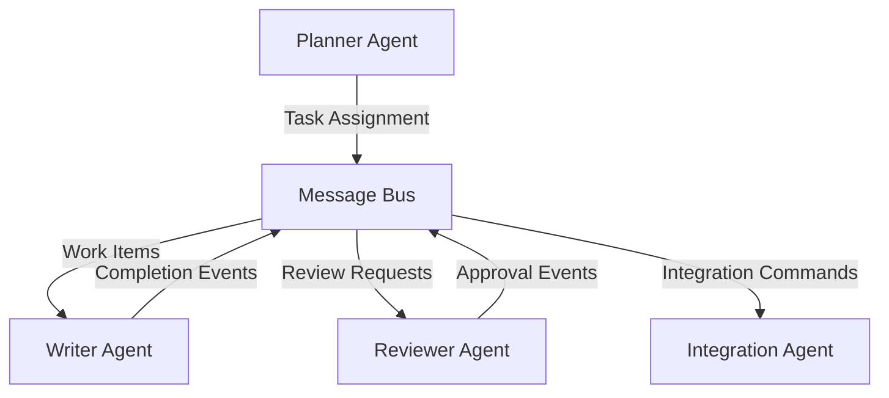
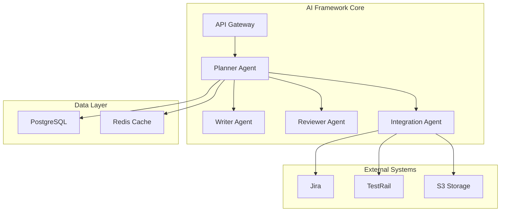
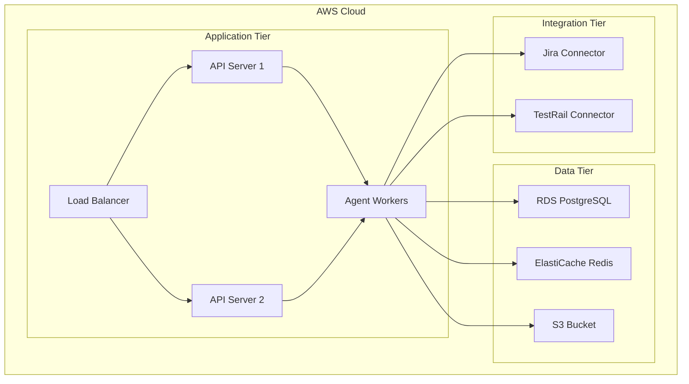
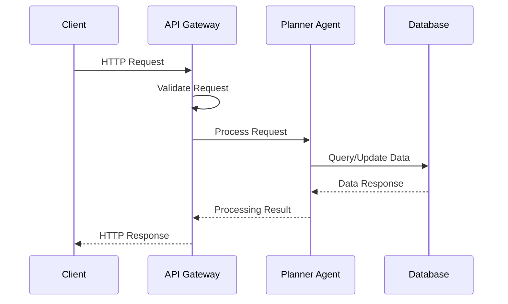
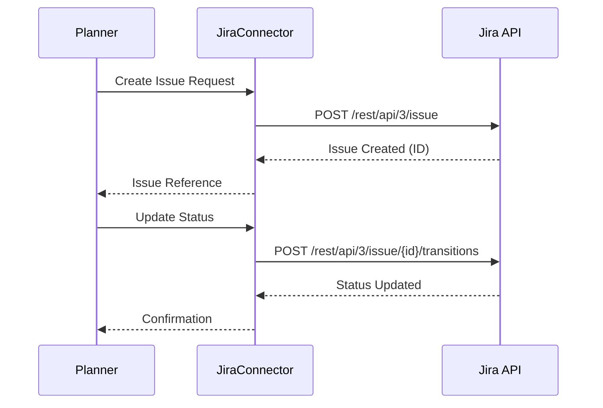
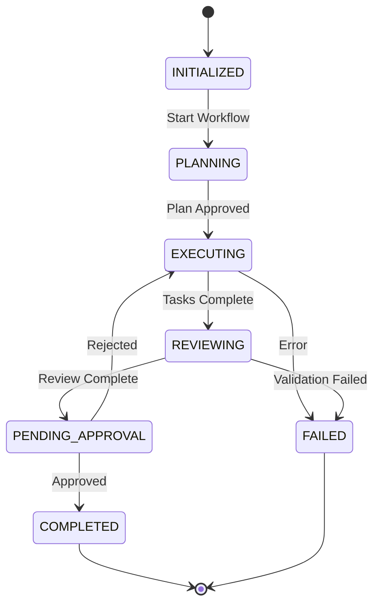
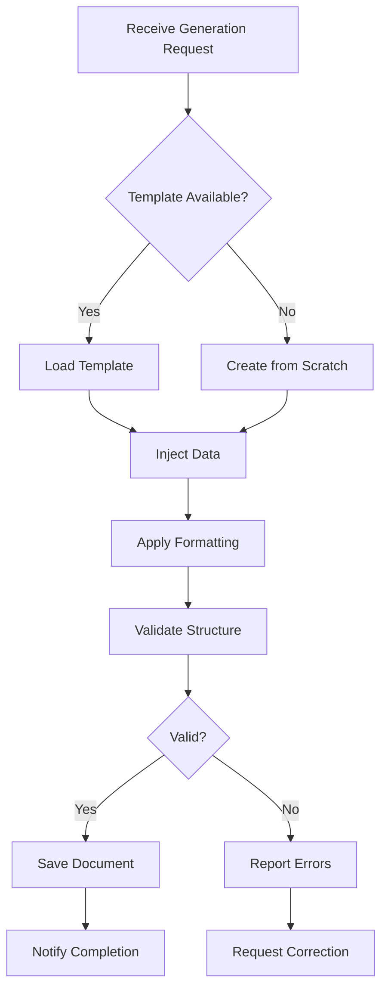
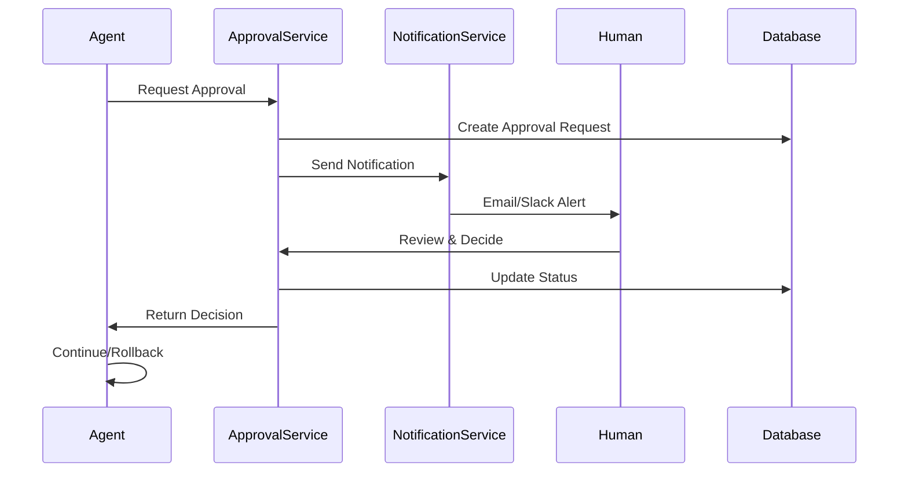
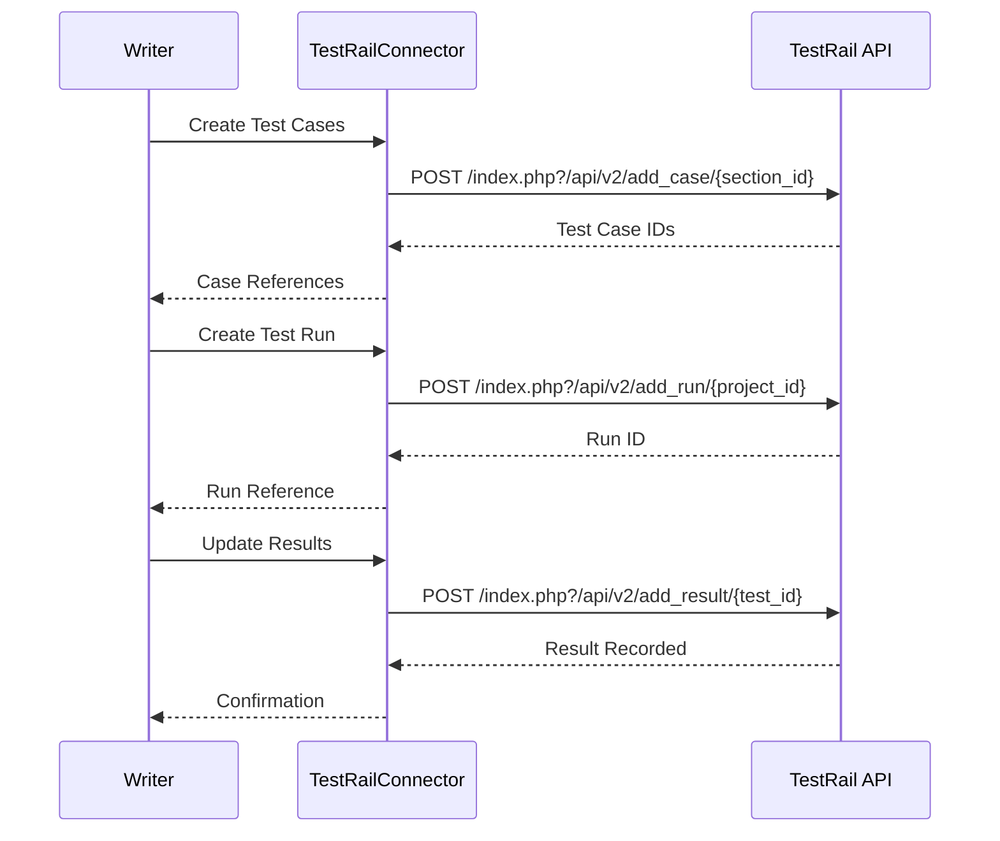

# Low Level Design Document

## 1. Introduction

### 1.1 Purpose
This Low Level Design (LLD) document provides detailed technical specifications for the AI Framework system implementation. It serves as a comprehensive guide for developers to understand the system architecture, component interactions, and implementation details.

### 1.2 Scope
This document covers the detailed design of the AI Framework system, including multi-agent architecture, integration components, data models, API specifications, and deployment configurations.

### 1.3 Definitions and Acronyms
- **LLD**: Low Level Design
- **API**: Application Programming Interface
- **REST**: Representational State Transfer
- **AI**: Artificial Intelligence
- **RCA**: Root Cause Analysis
- **HITL**: Human-in-the-Loop

## 2. System Architecture

### 2.1 Overview
The AI Framework system follows a multi-agent architecture pattern with specialized agents for different tasks, integrated with external systems like Jira and TestRail.

### 2.2 Multi-agent AI Framework Architecture

The system implements a sophisticated multi-agent architecture with the following key components:

#### Agent Types
1. **Planner Agent**: Orchestrates task planning and workflow coordination
2. **Writer Agent**: Handles document generation and content creation
3. **Reviewer Agent**: Performs quality checks and validation
4. **Integration Agent**: Manages external system integrations

#### Agent Communication
Agents communicate through a message bus architecture using event-driven patterns:



#### Agent Coordination
- Centralized orchestration through Planner Agent
- Asynchronous message passing
- Event-driven workflow execution
- State management for long-running processes

### 2.3 Component Diagram



### 2.4 Deployment Architecture



## 3. Component Design

### 3.1 API Layer

#### 3.1.1 REST API Controllers
The API layer provides RESTful endpoints for client interactions.

**Base URL**: `/api/v1`

#### 3.1.2 Request/Response Flow



### 3.2 Service Layer

#### 3.2.1 Agent Services
Core business logic implemented through specialized agent services.

**PlannerAgentService**
- Responsibilities: Task orchestration, workflow management
- Methods:
  - `createWorkflow(workflowConfig)`: Initialize new workflow
  - `assignTask(taskId, agentId)`: Assign task to agent
  - `monitorProgress(workflowId)`: Track workflow execution

**WriterAgentService**
- Responsibilities: Document generation, content creation
- Methods:
  - `generateDocument(template, data)`: Create document from template
  - `updateContent(documentId, changes)`: Apply content modifications
  - `validateFormat(document)`: Check document formatting

**ReviewerAgentService**
- Responsibilities: Quality assurance, validation
- Methods:
  - `reviewDocument(documentId)`: Perform document review
  - `validateCompliance(document, rules)`: Check compliance
  - `approveChanges(reviewId)`: Approve reviewed changes

### 3.3 Data Access Layer

#### 3.3.1 Repository Pattern
Implements repository pattern for data access abstraction.

**WorkflowRepository**
- `findById(id)`: Retrieve workflow by ID
- `save(workflow)`: Persist workflow
- `findByStatus(status)`: Query workflows by status

**DocumentRepository**
- `findById(id)`: Retrieve document by ID
- `save(document)`: Persist document
- `findByWorkflowId(workflowId)`: Get documents for workflow

**TaskRepository**
- `findById(id)`: Retrieve task by ID
- `save(task)`: Persist task
- `findByAgentId(agentId)`: Get tasks assigned to agent

### 3.4 Integration Layer

#### 3.4.1 External System Connectors
Manages connections to external systems.

**S3Connector**
- `uploadFile(key, content)`: Upload file to S3
- `downloadFile(key)`: Download file from S3
- `deleteFile(key)`: Remove file from S3

### 3.5 Security Components

#### 3.5.1 Authentication
- JWT-based authentication
- Token expiration: 24 hours
- Refresh token support

#### 3.5.2 Authorization
- Role-based access control (RBAC)
- Permission levels: Admin, User, Viewer

### 3.6 Caching Strategy

#### 3.6.1 Redis Cache
- Cache frequently accessed data
- TTL: 1 hour for workflow data
- Cache invalidation on updates

### 3.7 Error Handling

#### 3.7.1 Exception Hierarchy
- `AIFrameworkException`: Base exception
- `ValidationException`: Input validation errors
- `IntegrationException`: External system errors
- `AgentException`: Agent processing errors

### 3.8 Jira Integration

The system integrates with Jira for issue tracking and project management.

#### 3.8.1 Jira Connector Configuration
```json
{
  "jira_url": "https://company.atlassian.net",
  "authentication": "oauth2",
  "project_key": "AIFW",
  "issue_types": ["Story", "Task", "Bug"]
}
```

#### 3.8.2 Jira Operations
- **Create Issue**: Automatically create Jira issues from workflow tasks
- **Update Status**: Sync task status with Jira issue status
- **Add Comments**: Post workflow updates as Jira comments
- **Link Issues**: Create relationships between related issues

#### 3.8.3 Jira Integration Flow



### 3.9 Planner Agent Workflows

The Planner Agent orchestrates complex workflows through a state machine approach.

#### 3.9.1 Workflow States
- **INITIALIZED**: Workflow created, awaiting start
- **PLANNING**: Analyzing requirements and creating plan
- **EXECUTING**: Tasks being processed by agents
- **REVIEWING**: Under review by Reviewer Agent
- **PENDING_APPROVAL**: Awaiting human approval
- **COMPLETED**: Successfully finished
- **FAILED**: Encountered unrecoverable error

#### 3.9.2 Workflow State Transitions



#### 3.9.3 Task Assignment Logic
```python
def assign_task(task, available_agents):
    # Priority-based assignment
    if task.priority == "HIGH":
        agent = get_least_loaded_agent(available_agents)
    else:
        agent = get_next_available_agent(available_agents)
    
    # Capability matching
    if not agent.has_capability(task.required_capability):
        agent = find_capable_agent(available_agents, task.required_capability)
    
    return agent
```

### 3.10 Writer Agent Workflows

The Writer Agent handles document generation and content management.

#### 3.10.1 Document Generation Process



#### 3.10.2 Content Update Strategy
- **Incremental Updates**: Apply only changed sections
- **Version Control**: Maintain document version history
- **Conflict Resolution**: Handle concurrent modifications
- **Rollback Support**: Ability to revert to previous versions

#### 3.10.3 Template Management
```yaml
templates:
  - name: "LLD Template"
    format: "markdown"
    sections:
      - introduction
      - architecture
      - component_design
      - data_models
      - api_specifications
    
  - name: "Test Plan Template"
    format: "markdown"
    sections:
      - test_strategy
      - test_cases
      - test_data
      - execution_plan
```

### 3.11 Human-in-the-Loop Approval

The system implements HITL approval for critical decisions and quality gates.

#### 3.11.1 Approval Workflow



#### 3.11.2 Approval Types
1. **Document Approval**: Review generated documents
2. **Workflow Approval**: Approve workflow execution plans
3. **Integration Approval**: Authorize external system operations
4. **Configuration Approval**: Validate system configuration changes

#### 3.11.3 Approval Policies
```json
{
  "approval_policies": {
    "document_changes": {
      "required_approvers": 1,
      "timeout_hours": 24,
      "auto_reject_on_timeout": false
    },
    "workflow_execution": {
      "required_approvers": 2,
      "timeout_hours": 48,
      "auto_reject_on_timeout": true
    },
    "critical_operations": {
      "required_approvers": 3,
      "timeout_hours": 12,
      "auto_reject_on_timeout": true
    }
  }
}
```

#### 3.11.4 Notification Channels
- Email notifications with approval links
- Slack/Teams integration for real-time alerts
- In-app notification dashboard
- SMS for critical approvals (optional)

### 3.12 TestRail Integration

The system integrates with TestRail for test case management and execution tracking.

#### 3.12.1 TestRail Connector Configuration
```json
{
  "testrail_url": "https://company.testrail.io",
  "authentication": "api_key",
  "project_id": 1,
  "suite_id": 10,
  "auto_create_runs": true
}
```

#### 3.12.2 TestRail Operations
- **Create Test Cases**: Generate test cases from requirements
- **Create Test Runs**: Initialize test execution runs
- **Update Results**: Post test execution results
- **Generate Reports**: Pull test metrics and reports

#### 3.12.3 TestRail Integration Flow



#### 3.12.4 Test Case Mapping
```yaml
test_case_mapping:
  requirement_id: "REQ-001"
  test_cases:
    - id: "TC-001"
      title: "Verify workflow creation"
      priority: "High"
      type: "Functional"
      automated: true
    
    - id: "TC-002"
      title: "Verify agent assignment"
      priority: "Medium"
      type: "Functional"
      automated: true
```
