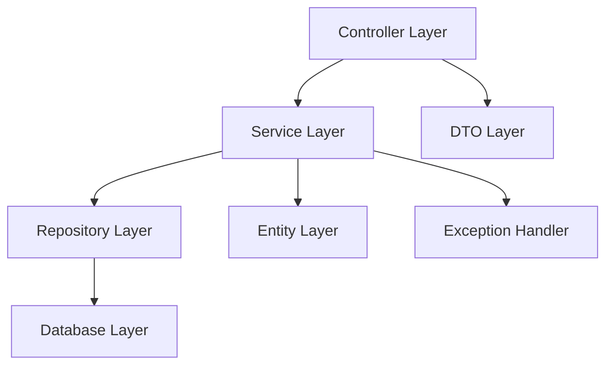

# Low Level Design Document: E-commerce Product Management System

## 1. System Overview

### 1.1 Purpose
This document provides the low-level design for an E-commerce Product Management System built using Spring Boot and Java 21. The system manages product catalog, inventory, shopping cart functionality, and order processing with a focus on scalability, maintainability, and performance.

### 1.2 Technology Stack
- **Framework**: Spring Boot 3.2.x
- **Language**: Java 21
- **Database**: PostgreSQL 15
- **Build Tool**: Maven
- **API Documentation**: SpringDoc OpenAPI
- **Testing**: JUnit 5, Mockito
- **Logging**: SLF4J with Logback

## 2. Architecture Overview

### 2.1 Layered Architecture



### 2.2 Package Structure
```
com.ecommerce.product
├── controller
│   ├── ProductController
│   ├── CategoryController
│   ├── InventoryController
│   └── CartController
├── service
│   ├── ProductService
│   ├── CategoryService
│   ├── InventoryService
│   └── CartService
├── repository
│   ├── ProductRepository
│   ├── CategoryRepository
│   ├── InventoryRepository
│   ├── CartRepository
│   └── CartItemRepository
├── entity
│   ├── Product
│   ├── Category
│   ├── Inventory
│   ├── ShoppingCart
│   └── CartItem
├── dto
│   ├── ProductDTO
│   ├── CategoryDTO
│   ├── InventoryDTO
│   ├── CartDTO
│   ├── CartItemDTO
│   ├── AddToCartRequest
│   └── UpdateQuantityRequest
├── exception
│   ├── ResourceNotFoundException
│   ├── InvalidRequestException
│   ├── InsufficientStockException
│   └── GlobalExceptionHandler
└── config
    ├── DatabaseConfig
    └── OpenAPIConfig
```

## 3. Entity Model

### 3.1 Product Entity

```java
@Entity
@Table(name = "products")
public class Product {
    @Id
    @GeneratedValue(strategy = GenerationType.IDENTITY)
    private Long id;
    
    @Column(nullable = false, length = 200)
    private String name;
    
    @Column(length = 1000)
    private String description;
    
    @Column(nullable = false, precision = 10, scale = 2)
    private BigDecimal price;
    
    @Column(length = 50)
    private String sku;
    
    @ManyToOne(fetch = FetchType.LAZY)
    @JoinColumn(name = "category_id")
    private Category category;
    
    @Column(name = "minimum_procurement_threshold")
    private Integer minimumProcurementThreshold;
    
    @Column(name = "created_at")
    private LocalDateTime createdAt;
    
    @Column(name = "updated_at")
    private LocalDateTime updatedAt;
    
    @Column(name = "is_active")
    private Boolean isActive;
    
    @OneToOne(mappedBy = "product", cascade = CascadeType.ALL)
    private Inventory inventory;
}
```

### 3.2 Category Entity

```java
@Entity
@Table(name = "categories")
public class Category {
    @Id
    @GeneratedValue(strategy = GenerationType.IDENTITY)
    private Long id;
    
    @Column(nullable = false, length = 100)
    private String name;
    
    @Column(length = 500)
    private String description;
    
    @ManyToOne(fetch = FetchType.LAZY)
    @JoinColumn(name = "parent_id")
    private Category parent;
    
    @OneToMany(mappedBy = "parent")
    private List<Category> subCategories;
    
    @OneToMany(mappedBy = "category")
    private List<Product> products;
}
```

### 3.3 Inventory Entity

```java
@Entity
@Table(name = "inventory")
public class Inventory {
    @Id
    @GeneratedValue(strategy = GenerationType.IDENTITY)
    private Long id;
    
    @OneToOne
    @JoinColumn(name = "product_id", unique = true)
    private Product product;
    
    @Column(nullable = false)
    private Integer quantity;
    
    @Column(name = "reserved_quantity")
    private Integer reservedQuantity;
    
    @Column(name = "last_updated")
    private LocalDateTime lastUpdated;
}
```

### 3.4 ShoppingCart Entity

```java
@Entity
@Table(name = "shopping_carts")
public class ShoppingCart {
    @Id
    @GeneratedValue(strategy = GenerationType.IDENTITY)
    private Long id;
    
    @Column(name = "user_id", nullable = false)
    private Long userId;
    
    @OneToMany(mappedBy = "cart", cascade = CascadeType.ALL, orphanRemoval = true)
    private List<CartItem> items = new ArrayList<>();
    
    @Column(name = "created_at")
    private LocalDateTime createdAt;
    
    @Column(name = "updated_at")
    private LocalDateTime updatedAt;
    
    @Column(name = "is_active")
    private Boolean isActive;
}
```

### 3.5 CartItem Entity

```java
@Entity
@Table(name = "cart_items")
public class CartItem {
    @Id
    @GeneratedValue(strategy = GenerationType.IDENTITY)
    private Long id;
    
    @ManyToOne(fetch = FetchType.LAZY)
    @JoinColumn(name = "cart_id", nullable = false)
    private ShoppingCart cart;
    
    @ManyToOne(fetch = FetchType.LAZY)
    @JoinColumn(name = "product_id", nullable = false)
    private Product product;
    
    @Column(nullable = false)
    private Integer quantity;
    
    @Column(name = "added_at")
    private LocalDateTime addedAt;
}
```

## 4. Database Schema

### 4.1 Products Table
```sql
CREATE TABLE products (
    id BIGSERIAL PRIMARY KEY,
    name VARCHAR(200) NOT NULL,
    description VARCHAR(1000),
    price DECIMAL(10, 2) NOT NULL,
    sku VARCHAR(50) UNIQUE,
    category_id BIGINT REFERENCES categories(id),
    minimum_procurement_threshold INTEGER,
    created_at TIMESTAMP DEFAULT CURRENT_TIMESTAMP,
    updated_at TIMESTAMP DEFAULT CURRENT_TIMESTAMP,
    is_active BOOLEAN DEFAULT TRUE
);

CREATE INDEX idx_products_category ON products(category_id);
CREATE INDEX idx_products_sku ON products(sku);
CREATE INDEX idx_products_active ON products(is_active);
```

### 4.2 Categories Table
```sql
CREATE TABLE categories (
    id BIGSERIAL PRIMARY KEY,
    name VARCHAR(100) NOT NULL,
    description VARCHAR(500),
    parent_id BIGINT REFERENCES categories(id)
);

CREATE INDEX idx_categories_parent ON categories(parent_id);
```

### 4.3 Inventory Table
```sql
CREATE TABLE inventory (
    id BIGSERIAL PRIMARY KEY,
    product_id BIGINT UNIQUE REFERENCES products(id),
    quantity INTEGER NOT NULL DEFAULT 0,
    reserved_quantity INTEGER DEFAULT 0,
    last_updated TIMESTAMP DEFAULT CURRENT_TIMESTAMP
);

CREATE INDEX idx_inventory_product ON inventory(product_id);
```

### 4.4 Shopping Carts Table
```sql
CREATE TABLE shopping_carts (
    id BIGSERIAL PRIMARY KEY,
    user_id BIGINT NOT NULL,
    created_at TIMESTAMP DEFAULT CURRENT_TIMESTAMP,
    updated_at TIMESTAMP DEFAULT CURRENT_TIMESTAMP,
    is_active BOOLEAN DEFAULT TRUE
);

CREATE INDEX idx_carts_user ON shopping_carts(user_id);
CREATE INDEX idx_carts_active ON shopping_carts(is_active);
```

### 4.5 Cart Items Table
```sql
CREATE TABLE cart_items (
    id BIGSERIAL PRIMARY KEY,
    cart_id BIGINT NOT NULL REFERENCES shopping_carts(id) ON DELETE CASCADE,
    product_id BIGINT NOT NULL REFERENCES products(id),
    quantity INTEGER NOT NULL,
    added_at TIMESTAMP DEFAULT CURRENT_TIMESTAMP,
    UNIQUE(cart_id, product_id)
);

CREATE INDEX idx_cart_items_cart ON cart_items(cart_id);
CREATE INDEX idx_cart_items_product ON cart_items(product_id);
```

## 5. Repository Layer

### 5.1 ProductRepository

```java
@Repository
public interface ProductRepository extends JpaRepository<Product, Long> {
    
    List<Product> findByCategory(Category category);
    
    Optional<Product> findBySku(String sku);
    
    @Query("SELECT p FROM Product p WHERE p.isActive = true")
    List<Product> findAllActiveProducts();
    
    @Query("SELECT p FROM Product p WHERE p.name LIKE %:keyword% OR p.description LIKE %:keyword%")
    List<Product> searchProducts(@Param("keyword") String keyword);
    
    @Query("SELECT p FROM Product p WHERE p.price BETWEEN :minPrice AND :maxPrice")
    List<Product> findByPriceRange(@Param("minPrice") BigDecimal minPrice, 
                                   @Param("maxPrice") BigDecimal maxPrice);
}
```

### 5.2 CategoryRepository

```java
@Repository
public interface CategoryRepository extends JpaRepository<Category, Long> {
    
    List<Category> findByParentIsNull();
    
    List<Category> findByParent(Category parent);
    
    Optional<Category> findByName(String name);
}
```

### 5.3 InventoryRepository

```java
@Repository
public interface InventoryRepository extends JpaRepository<Inventory, Long> {
    
    Optional<Inventory> findByProduct(Product product);
    
    Optional<Inventory> findByProductId(Long productId);
    
    @Query("SELECT i FROM Inventory i WHERE i.quantity < :threshold")
    List<Inventory> findLowStockItems(@Param("threshold") Integer threshold);
}
```

### 5.4 CartRepository

```java
@Repository
public interface CartRepository extends JpaRepository<ShoppingCart, Long> {
    
    Optional<ShoppingCart> findByUserIdAndIsActiveTrue(Long userId);
    
    List<ShoppingCart> findByUserId(Long userId);
    
    @Query("SELECT c FROM ShoppingCart c WHERE c.userId = :userId AND c.isActive = true")
    Optional<ShoppingCart> findActiveCartByUserId(@Param("userId") Long userId);
}
```

### 5.5 CartItemRepository

```java
@Repository
public interface CartItemRepository extends JpaRepository<CartItem, Long> {
    
    List<CartItem> findByCart(ShoppingCart cart);
    
    Optional<CartItem> findByCartAndProduct(ShoppingCart cart, Product product);
    
    void deleteByCartAndProduct(ShoppingCart cart, Product product);
    
    @Query("SELECT ci FROM CartItem ci WHERE ci.cart.id = :cartId")
    List<CartItem> findByCartId(@Param("cartId") Long cartId);
}
```
