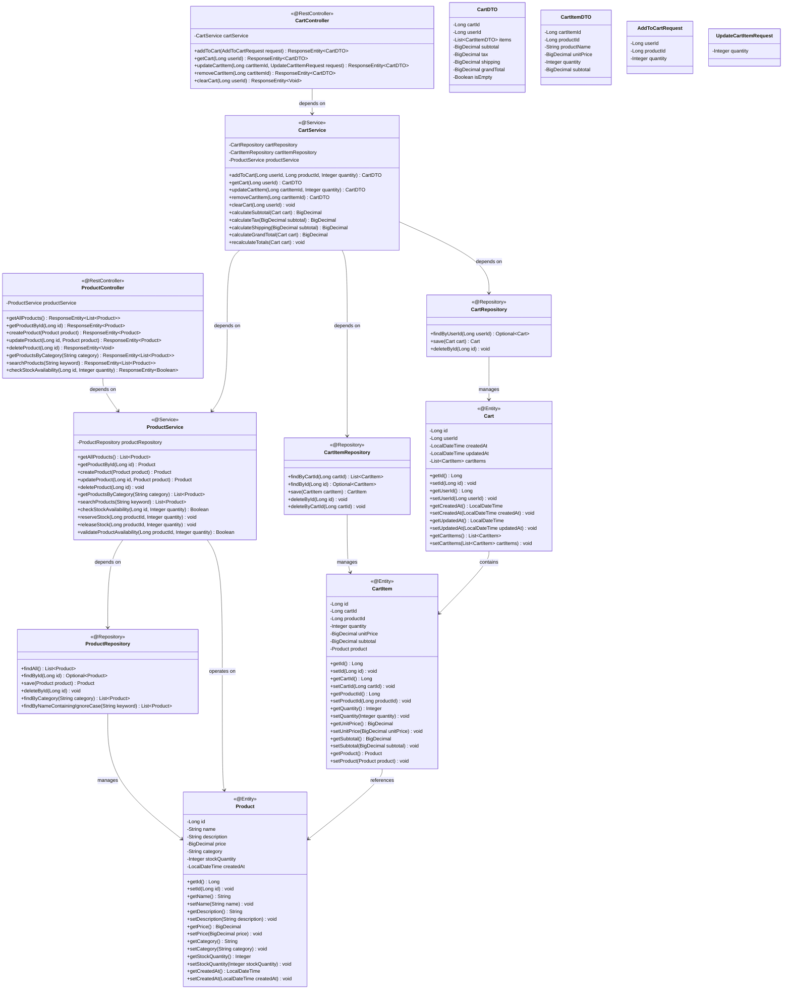
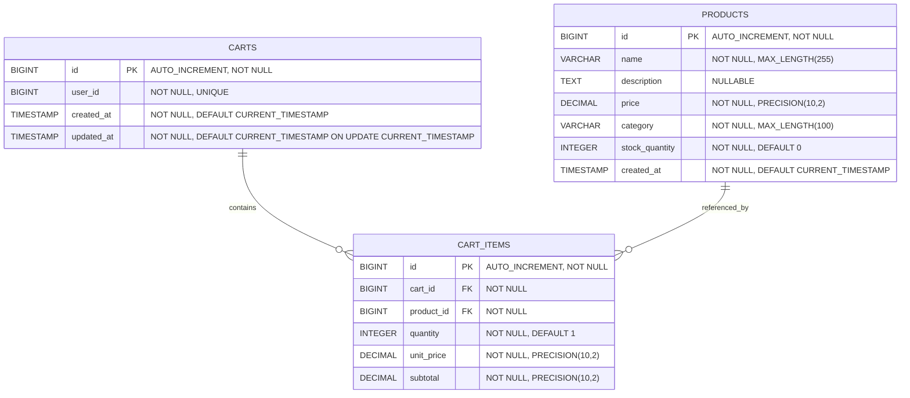
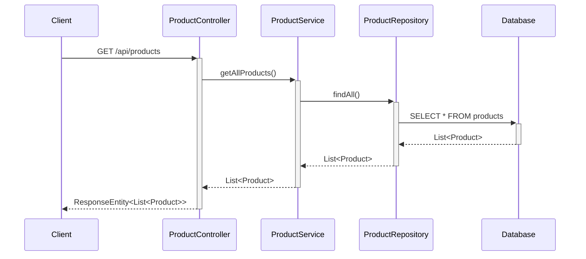
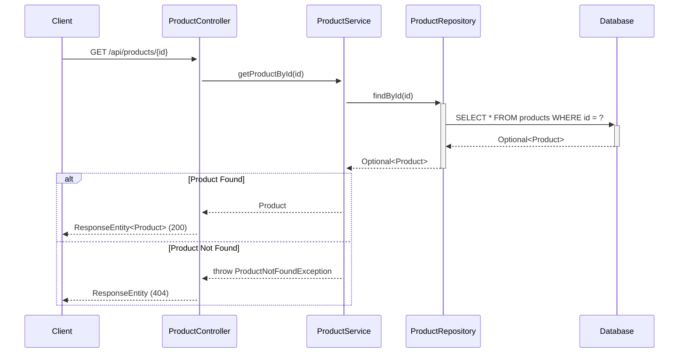
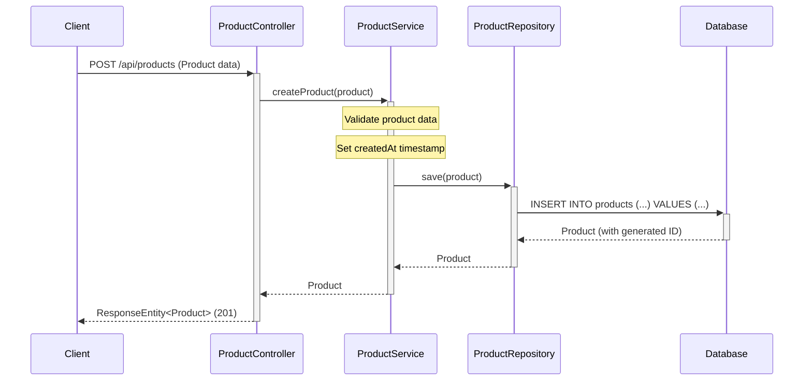
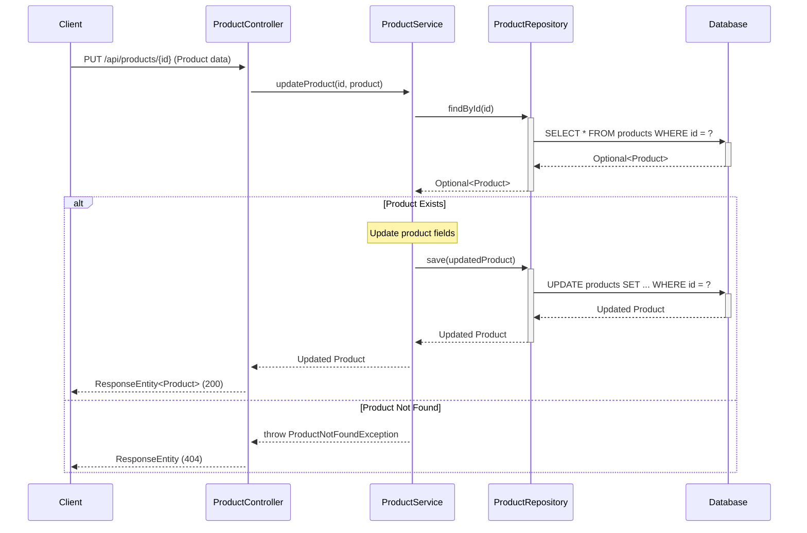
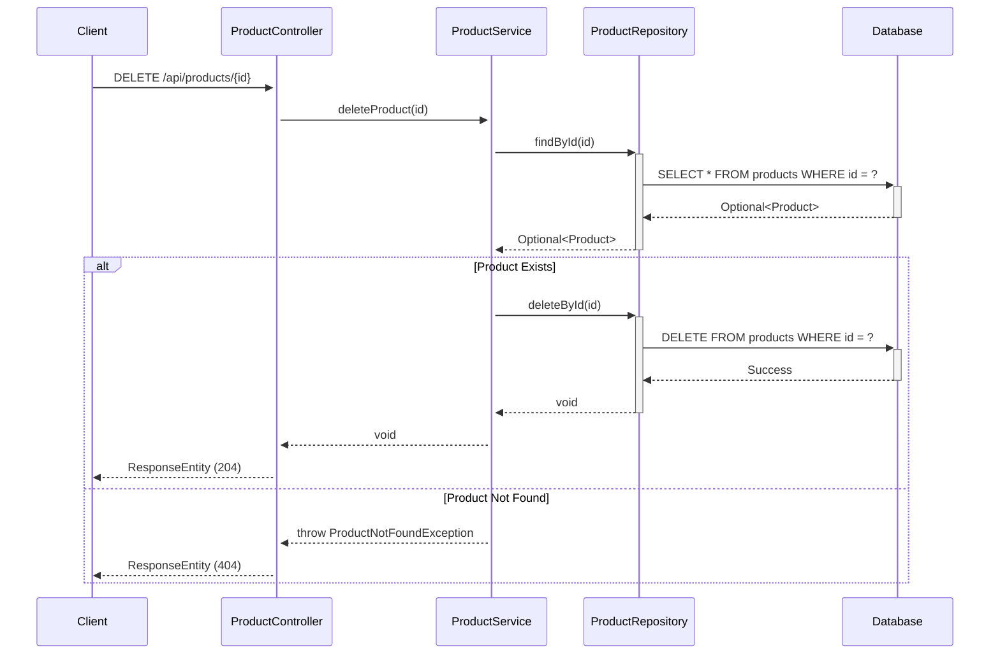
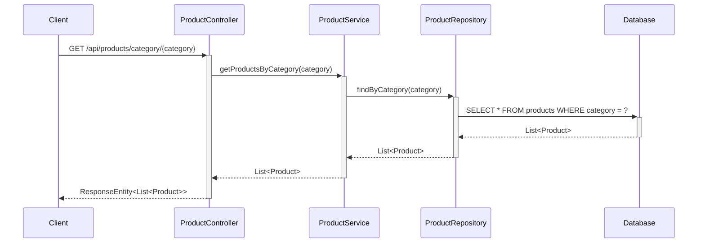
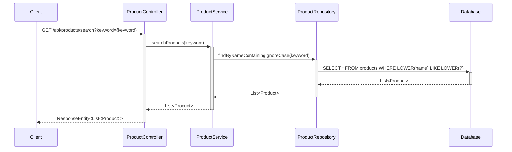
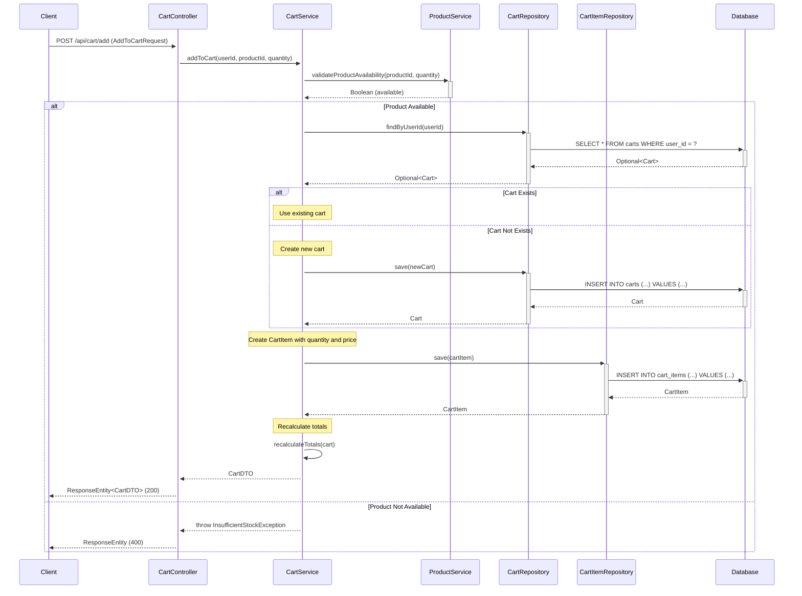

# Low-Level Design (LLD) - E-commerce Product Management System

## 1. Project Overview

**Framework:** Spring Boot  
**Language:** Java 21  
**Database:** PostgreSQL  
**Module:** ProductManagement  

## 2. System Architecture

### 2.1 Class Diagram

### 2.2 Entity Relationship Diagram

## 3. Sequence Diagrams

### 3.1 Get All Products

### 3.2 Get Product By ID

### 3.3 Create Product

### 3.4 Update Product

### 3.5 Delete Product

### 3.6 Get Products By Category

### 3.7 Search Products

### 3.8 Add To Cart

