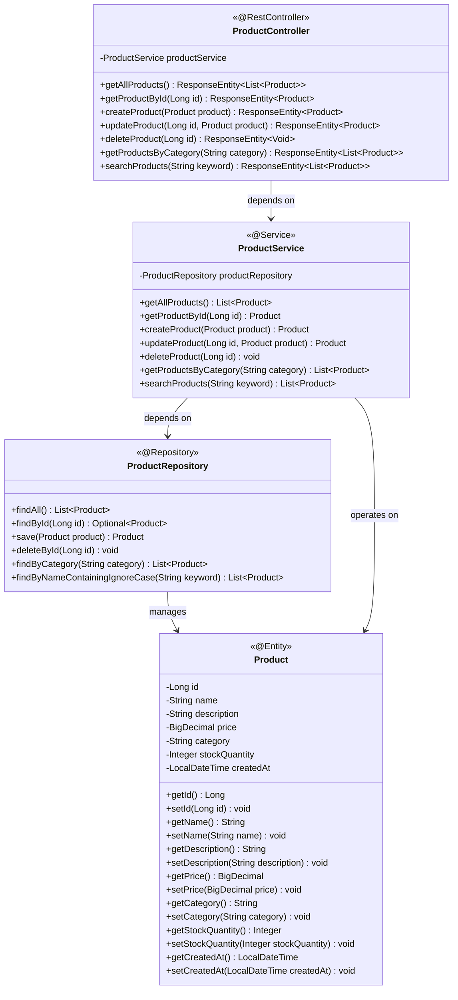
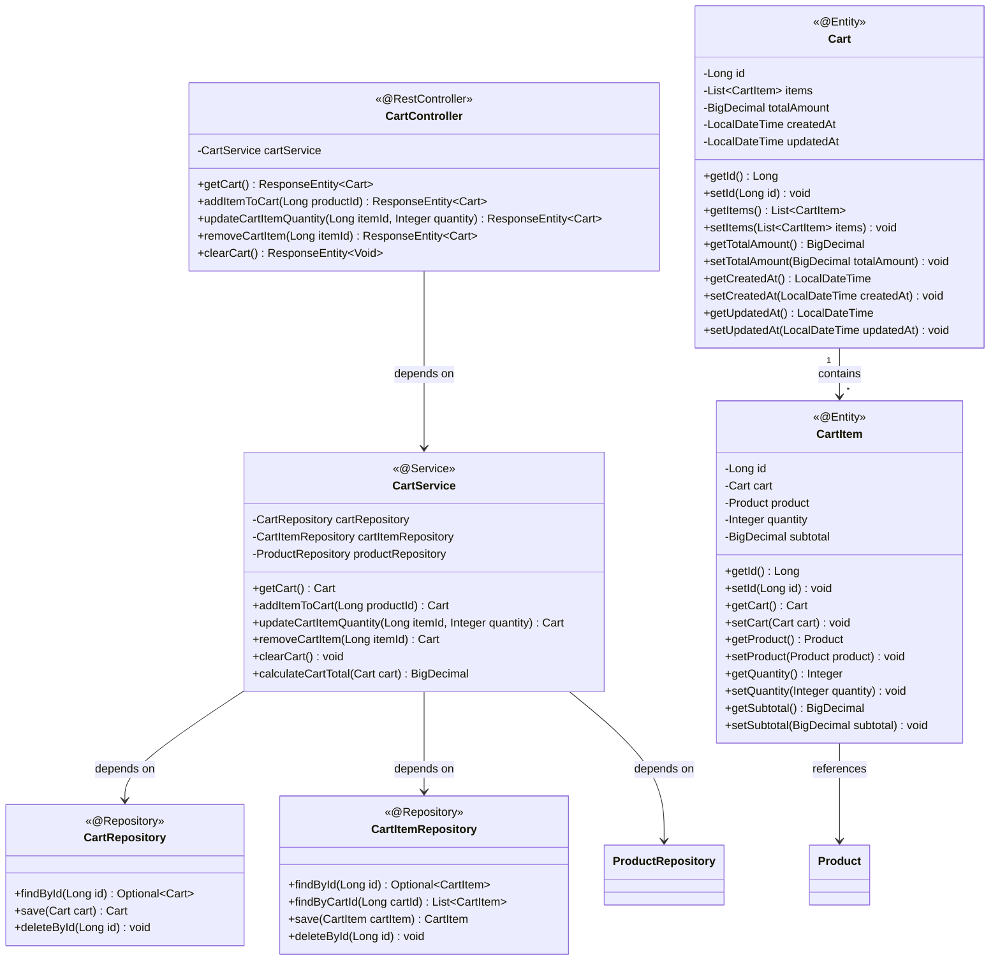
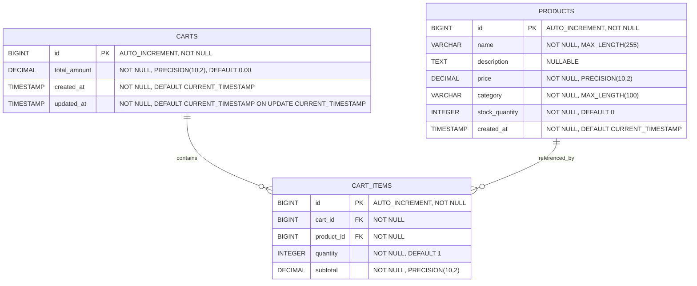

# Low-Level Design (LLD) - E-commerce Product Management System

## 1. Project Overview

**Framework:** Spring Boot  
**Language:** Java 21  
**Database:** PostgreSQL  
**Module:** ProductManagement  

**Project Scope:** This is a comprehensive e-commerce customer experience platform covering end-to-end functionality including product discovery, shopping cart management, order placement, payment processing, and shipping integration. The system provides a complete online shopping solution with real-time cart updates, secure payment gateway integration, and automated order fulfillment workflows.

## 2. System Architecture

### 2.1 Class Diagram

### 2.2 Shopping Cart Class Diagram

### 2.3 Entity Relationship Diagram

