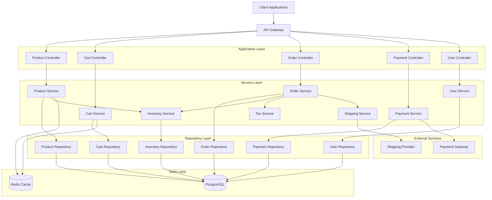

# Low Level Design: E-commerce Product Management System

## 1. System Overview

This document provides the Low Level Design (LLD) for an E-commerce Product Management System built using Spring Boot and Java 21. The system manages products, shopping carts, orders, payments, user management, inventory, and related operations with a focus on scalability, maintainability, and performance.

### 1.1 Technology Stack
- **Framework**: Spring Boot 3.x
- **Language**: Java 21
- **Database**: PostgreSQL
- **Caching**: Redis
- **Message Queue**: RabbitMQ
- **API Documentation**: OpenAPI 3.0 (Swagger)
- **Build Tool**: Maven
- **Testing**: JUnit 5, Mockito

## 2. Architecture Overview

