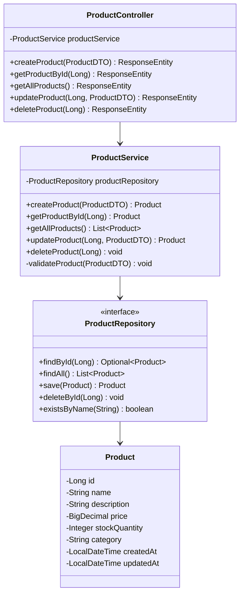
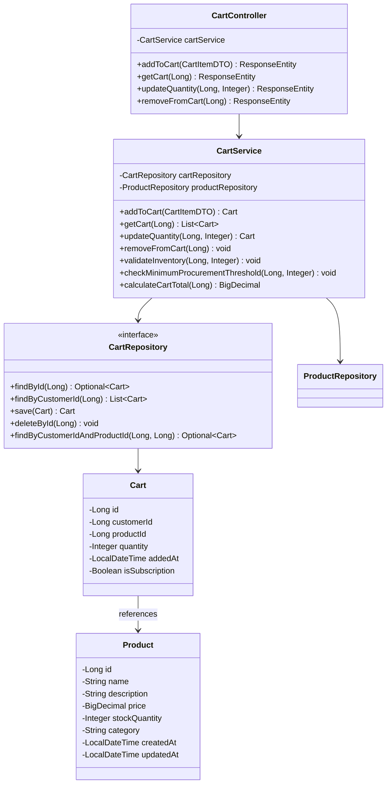
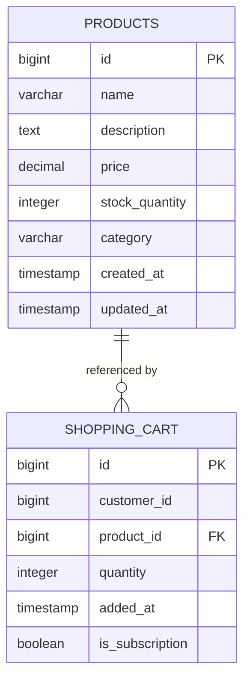
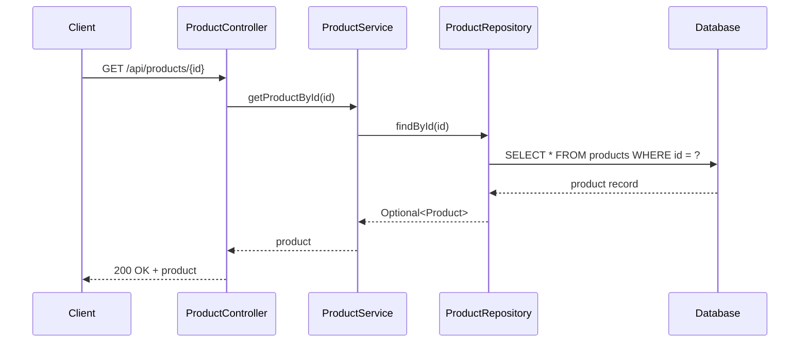
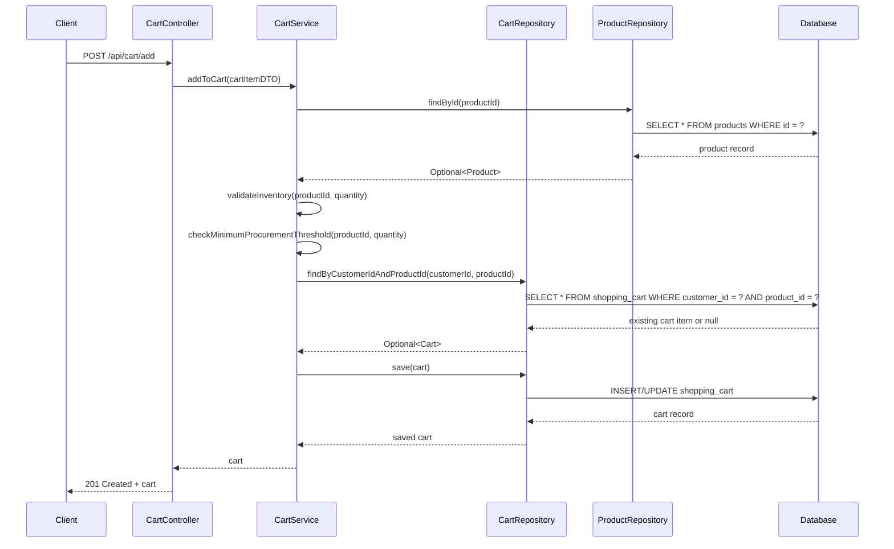
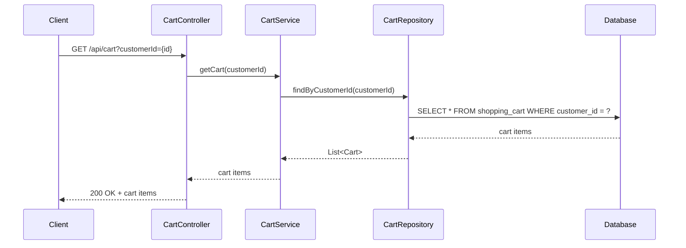
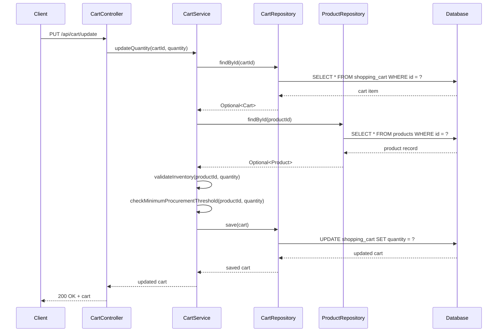
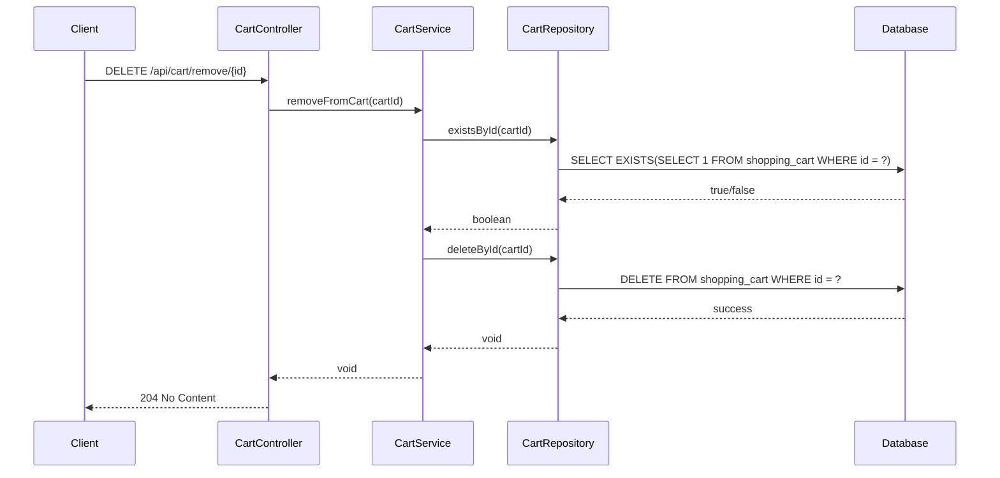

# Low-Level Design Document: E-commerce Product and Cart Management System

## 1. Project Overview

**Module:** ProductManagement and CartManagement  
**Purpose:** This module provides comprehensive functionality for managing products and shopping carts in an e-commerce platform. It includes CRUD operations for products, shopping cart management, inventory validation, and procurement threshold logic.  
**Technology Stack:** Spring Boot 3.x, Java 21, PostgreSQL, Spring Data JPA  
**Architecture Pattern:** Layered Architecture (Controller → Service → Repository)

---

## 2. System Architecture

### 2.1 High-Level Architecture

The system follows a standard three-tier architecture with cart management components integrated:

```
┌─────────────────────────────────────────────────────────┐
│                    Presentation Layer                    │
│              (ProductController, CartController)         │
└─────────────────────────────────────────────────────────┘
                            ↓
┌─────────────────────────────────────────────────────────┐
│                     Business Layer                       │
│               (ProductService, CartService)              │
└─────────────────────────────────────────────────────────┘
                            ↓
┌─────────────────────────────────────────────────────────┐
│                   Persistence Layer                      │
│           (ProductRepository, CartRepository)            │
└─────────────────────────────────────────────────────────┘
                            ↓
┌─────────────────────────────────────────────────────────┐
│                    Database (PostgreSQL)                 │
│              (products, shopping_cart tables)            │
└─────────────────────────────────────────────────────────┘
```

### 2.2 Product Management Class Diagram



### 2.3 Shopping Cart Class Diagram



---

## 3. Entity Relationship Diagram



---

## 4. Sequence Diagrams

### 4.1 Get Product by ID Flow



### 4.2 Add to Cart Flow



### 4.3 Get Cart Contents Flow



### 4.4 Update Cart Quantity Flow



### 4.5 Remove from Cart Flow



---

## 5. API Endpoints

### 5.1 Product Management Endpoints

| Method | Endpoint | Description | Request Body | Response |
|--------|----------|-------------|--------------|----------|
| GET | `/api/products/{id}` | Get product by ID | - | 200 OK + Product |
| GET | `/api/products` | Get all products | - | 200 OK + List<Product> |

### 5.2 Shopping Cart Endpoints

| Method | Endpoint | Description | Request Body | Response |
|--------|----------|-------------|--------------|----------|
| POST | `/api/cart/add` | Add item to cart | CartItemDTO | 201 Created + Cart |
| GET | `/api/cart` | Get cart contents | customerId (query param) | 200 OK + List<Cart> |
| PUT | `/api/cart/update` | Update cart quantity | cartId, quantity | 200 OK + Cart |
| DELETE | `/api/cart/remove/{id}` | Remove item from cart | - | 204 No Content |

---

## 6. Data Transfer Objects (DTOs)

### 6.1 ProductDTO

```java
public class ProductDTO {
    private String name;
    private String description;
    private BigDecimal price;
    private Integer stockQuantity;
    private String category;
    
    // Validation annotations
    @NotBlank(message = "Product name is required")
    @Size(min = 3, max = 100)
    private String name;
    
    @NotNull(message = "Price is required")
    @DecimalMin(value = "0.0", inclusive = false)
    private BigDecimal price;
    
    @NotNull(message = "Stock quantity is required")
    @Min(value = 0)
    private Integer stockQuantity;
}
```

### 6.2 CartItemDTO

```java
public class CartItemDTO {
    private Long customerId;
    private Long productId;
    private Integer quantity;
    private Boolean isSubscription;
    
    // Validation annotations
    @NotNull(message = "Customer ID is required")
    private Long customerId;
    
    @NotNull(message = "Product ID is required")
    private Long productId;
    
    @NotNull(message = "Quantity is required")
    @Min(value = 1)
    private Integer quantity;
}
```

---

## 7. Business Logic

### 7.1 Product Validation Rules

- Product name must be unique
- Price must be greater than 0
- Stock quantity cannot be negative
- Category must be from predefined list

### 7.2 Minimum Procurement Threshold Logic

The system enforces minimum procurement thresholds to ensure efficient order processing:

```java
public void checkMinimumProcurementThreshold(Long productId, Integer quantity) {
    Product product = productRepository.findById(productId)
        .orElseThrow(() -> new ProductNotFoundException("Product not found"));
    
    // Minimum threshold is 5 units for non-subscription items
    final int MIN_THRESHOLD = 5;
    
    if (!isSubscription && quantity < MIN_THRESHOLD) {
        throw new MinimumThresholdException(
            "Minimum procurement quantity is " + MIN_THRESHOLD + " units"
        );
    }
}
```

### 7.3 Inventory Validation

Before adding or updating cart items, the system validates available inventory:

```java
public void validateInventory(Long productId, Integer requestedQuantity) {
    Product product = productRepository.findById(productId)
        .orElseThrow(() -> new ProductNotFoundException("Product not found"));
    
    if (product.getStockQuantity() < requestedQuantity) {
        throw new InsufficientStockException(
            "Insufficient stock. Available: " + product.getStockQuantity() + 
            ", Requested: " + requestedQuantity
        );
    }
}
```

### 7.4 Cart Total Calculation

Calculate the total value of items in a customer's cart:

```java
public BigDecimal calculateCartTotal(Long customerId) {
    List<Cart> cartItems = cartRepository.findByCustomerId(customerId);
    
    if (cartItems.isEmpty()) {
        throw new EmptyCartException("Cart is empty");
    }
    
    return cartItems.stream()
        .map(cartItem -> {
            Product product = productRepository.findById(cartItem.getProductId())
                .orElseThrow(() -> new ProductNotFoundException("Product not found"));
            return product.getPrice().multiply(new BigDecimal(cartItem.getQuantity()));
        })
        .reduce(BigDecimal.ZERO, BigDecimal::add);
}
```

---

## 8. Error Handling

### 8.1 Product-Related Exceptions

- `ProductNotFoundException`: Thrown when product ID doesn't exist
- `DuplicateProductException`: Thrown when creating product with existing name
- `InvalidProductDataException`: Thrown for validation failures

### 8.2 Cart-Related Exceptions

- `EmptyCartException`: Thrown when attempting operations on an empty cart
- `CartItemNotFoundException`: Thrown when cart item ID doesn't exist
- `InsufficientStockException`: Thrown when requested quantity exceeds available stock
- `MinimumThresholdException`: Thrown when quantity is below minimum procurement threshold
- `InvalidCartDataException`: Thrown for cart validation failures

### 8.3 Exception Response Format

```json
{
    "timestamp": "2024-01-15T10:30:00",
    "status": 400,
    "error": "Bad Request",
    "message": "Insufficient stock. Available: 10, Requested: 15",
    "path": "/api/cart/add"
}
```

---
