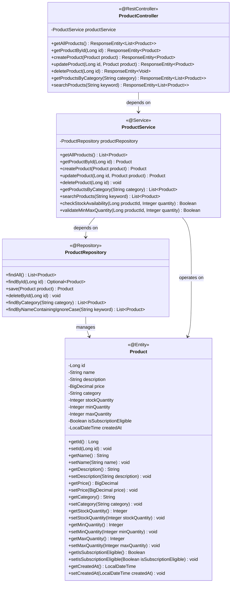
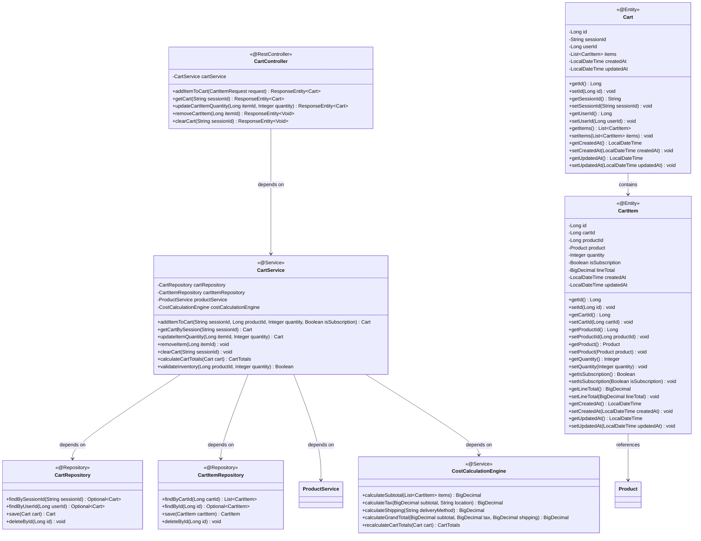
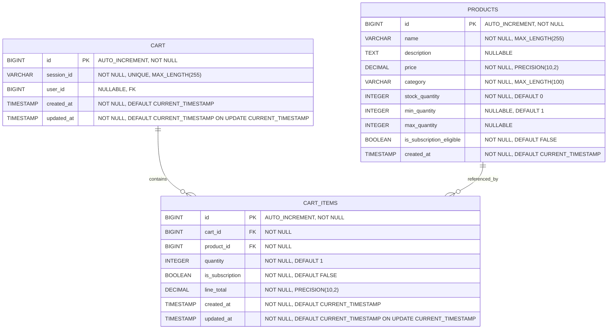

# Low-Level Design (LLD) - E-commerce Product Management System

## 1. Project Overview

**Framework:** Spring Boot  
**Language:** Java 21  
**Database:** PostgreSQL  
**Module:** ProductManagement, ShoppingCart  

## 2. System Architecture

### 2.1 Class Diagram - Product Management

### 2.2 Class Diagram - Shopping Cart Module

### 2.3 Entity Relationship Diagram

