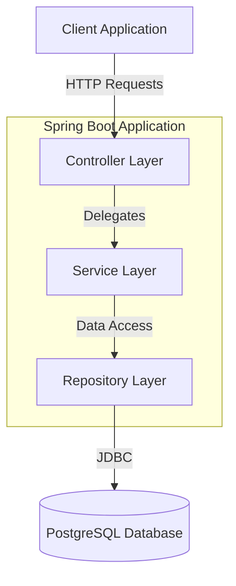
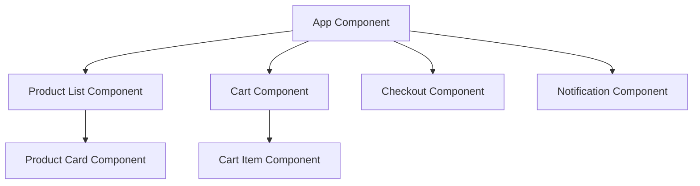
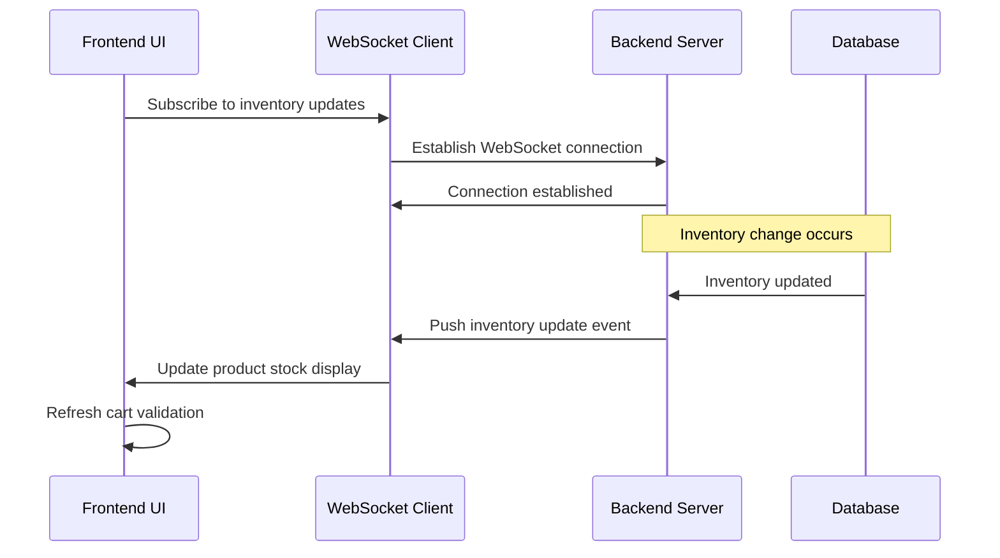

# Low Level Design Document: E-commerce Product Management System

## 1. System Overview

### 1.1 Purpose
This document provides the low-level design for an E-commerce Product Management System built using Spring Boot and Java 21. The system manages product inventory, shopping cart operations, and order processing with real-time inventory validation and procurement threshold management.

### 1.2 Technology Stack
- **Framework**: Spring Boot 3.2.x
- **Language**: Java 21
- **Database**: PostgreSQL 15+
- **Build Tool**: Maven
- **API Documentation**: OpenAPI 3.0 (Swagger)
- **Testing**: JUnit 5, Mockito, TestContainers

### 1.3 Architecture Pattern
The system follows a layered architecture with clear separation of concerns:
- **Controller Layer**: REST API endpoints
- **Service Layer**: Business logic
- **Repository Layer**: Data access
- **Entity Layer**: Domain models

## 2. Component Architecture

### 2.1 High-Level Component Diagram



### 2.2 Package Structure

```
com.ecommerce.productmanagement
├── controller
│   ├── ProductController
│   ├── CartController
│   └── OrderController
├── service
│   ├── ProductService
│   ├── CartService
│   └── OrderService
├── repository
│   ├── ProductRepository
│   ├── CartRepository
│   └── OrderRepository
├── entity
│   ├── Product
│   ├── Cart
│   ├── CartItem
│   └── Order
├── dto
│   ├── request
│   │   ├── AddToCartRequest
│   │   └── CreateOrderRequest
│   └── response
│       ├── ProductResponse
│       ├── CartResponse
│       ├── OrderResponse
│       └── ErrorResponse
├── exception
│   ├── ProductNotFoundException
│   ├── InsufficientStockException
│   └── GlobalExceptionHandler
└── config
    ├── SwaggerConfig
    └── DatabaseConfig
```

## 3. Frontend Component Architecture

### 3.1 Component Hierarchy



### 3.2 State Management

- **Global State**: Shopping cart, user session, notifications
- **Local State**: Form inputs, UI toggles, loading states
- **State Management Library**: Redux/Context API for React, Vuex for Vue, NgRx for Angular

### 3.3 Component Responsibilities

#### Product List Component
- Display paginated product catalog
- Filter and search functionality
- Real-time stock status updates
- Add to cart actions

#### Cart Component
- Display cart items with quantities
- Real-time inventory validation
- Update quantities with threshold checks
- Remove items functionality
- Display total price and item count

#### Checkout Component
- Order summary display
- Payment information collection
- Final inventory validation before order placement
- Order confirmation display

## 4. Real-time UI Updates

### 4.1 WebSocket Integration



### 4.2 Update Events

- **STOCK_UPDATED**: Product quantity changed
- **PRODUCT_UNAVAILABLE**: Product out of stock
- **THRESHOLD_REACHED**: Minimum procurement threshold reached
- **CART_INVALIDATED**: Cart items no longer available

### 4.3 UI Update Strategy

- **Optimistic Updates**: Immediate UI feedback for user actions
- **Server Reconciliation**: Validate against server state
- **Conflict Resolution**: Server state takes precedence
- **User Notification**: Alert users of inventory changes affecting their cart

## 5. Detailed Component Design

### 5.1 Product Entity

```java
package com.ecommerce.productmanagement.entity;

import jakarta.persistence.*;
import lombok.AllArgsConstructor;
import lombok.Data;
import lombok.NoArgsConstructor;
import java.math.BigDecimal;
import java.time.LocalDateTime;

@Entity
@Table(name = "products")
@Data
@NoArgsConstructor
@AllArgsConstructor
public class Product {
    
    @Id
    @GeneratedValue(strategy = GenerationType.IDENTITY)
    private Long id;
    
    @Column(nullable = false, length = 255)
    private String name;
    
    @Column(columnDefinition = "TEXT")
    private String description;
    
    @Column(nullable = false, precision = 10, scale = 2)
    private BigDecimal price;
    
    @Column(nullable = false)
    private Integer stockQuantity;
    
    @Column(nullable = false)
    private Integer minimumProcurementThreshold;
    
    @Column(nullable = false)
    private Integer procurementQuantity;
    
    @Column(length = 100)
    private String category;
    
    @Column(nullable = false)
    private Boolean active = true;
    
    @Column(nullable = false, updatable = false)
    private LocalDateTime createdAt;
    
    @Column(nullable = false)
    private LocalDateTime updatedAt;
    
    @PrePersist
    protected void onCreate() {
        createdAt = LocalDateTime.now();
        updatedAt = LocalDateTime.now();
    }
    
    @PreUpdate
    protected void onUpdate() {
        updatedAt = LocalDateTime.now();
    }
    
    public boolean isAvailable() {
        return active && stockQuantity > 0;
    }
    
    public boolean hasReachedProcurementThreshold() {
        return stockQuantity <= minimumProcurementThreshold;
    }
    
    public boolean canFulfillQuantity(int requestedQuantity) {
        return stockQuantity >= requestedQuantity;
    }
}
```

### 5.2 Cart Entity

```java
package com.ecommerce.productmanagement.entity;

import jakarta.persistence.*;
import lombok.AllArgsConstructor;
import lombok.Data;
import lombok.NoArgsConstructor;
import java.time.LocalDateTime;
import java.util.ArrayList;
import java.util.List;

@Entity
@Table(name = "carts")
@Data
@NoArgsConstructor
@AllArgsConstructor
public class Cart {
    
    @Id
    @GeneratedValue(strategy = GenerationType.IDENTITY)
    private Long id;
    
    @Column(nullable = false, unique = true)
    private String sessionId;
    
    @OneToMany(mappedBy = "cart", cascade = CascadeType.ALL, orphanRemoval = true)
    private List<CartItem> items = new ArrayList<>();
    
    @Column(nullable = false)
    private LocalDateTime createdAt;
    
    @Column(nullable = false)
    private LocalDateTime updatedAt;
    
    @PrePersist
    protected void onCreate() {
        createdAt = LocalDateTime.now();
        updatedAt = LocalDateTime.now();
    }
    
    @PreUpdate
    protected void onUpdate() {
        updatedAt = LocalDateTime.now();
    }
    
    public void addItem(CartItem item) {
        items.add(item);
        item.setCart(this);
    }
    
    public void removeItem(CartItem item) {
        items.remove(item);
        item.setCart(null);
    }
}
```

### 5.3 CartItem Entity

```java
package com.ecommerce.productmanagement.entity;

import jakarta.persistence.*;
import lombok.AllArgsConstructor;
import lombok.Data;
import lombok.NoArgsConstructor;

@Entity
@Table(name = "cart_items")
@Data
@NoArgsConstructor
@AllArgsConstructor
public class CartItem {
    
    @Id
    @GeneratedValue(strategy = GenerationType.IDENTITY)
    private Long id;
    
    @ManyToOne(fetch = FetchType.LAZY)
    @JoinColumn(name = "cart_id", nullable = false)
    private Cart cart;
    
    @ManyToOne(fetch = FetchType.EAGER)
    @JoinColumn(name = "product_id", nullable = false)
    private Product product;
    
    @Column(nullable = false)
    private Integer quantity;
    
    public void incrementQuantity(int amount) {
        this.quantity += amount;
    }
    
    public void decrementQuantity(int amount) {
        this.quantity = Math.max(0, this.quantity - amount);
    }
}
```

### 5.4 Order Entity

```java
package com.ecommerce.productmanagement.entity;

import jakarta.persistence.*;
import lombok.AllArgsConstructor;
import lombok.Data;
import lombok.NoArgsConstructor;
import java.math.BigDecimal;
import java.time.LocalDateTime;
import java.util.ArrayList;
import java.util.List;

@Entity
@Table(name = "orders")
@Data
@NoArgsConstructor
@AllArgsConstructor
public class Order {
    
    @Id
    @GeneratedValue(strategy = GenerationType.IDENTITY)
    private Long id;
    
    @Column(nullable = false, unique = true)
    private String orderNumber;
    
    @Column(nullable = false)
    private String sessionId;
    
    @OneToMany(mappedBy = "order", cascade = CascadeType.ALL)
    private List<OrderItem> items = new ArrayList<>();
    
    @Column(nullable = false, precision = 10, scale = 2)
    private BigDecimal totalAmount;
    
    @Enumerated(EnumType.STRING)
    @Column(nullable = false)
    private OrderStatus status;
    
    @Column(nullable = false)
    private LocalDateTime createdAt;
    
    @PrePersist
    protected void onCreate() {
        createdAt = LocalDateTime.now();
    }
    
    public enum OrderStatus {
        PENDING, CONFIRMED, SHIPPED, DELIVERED, CANCELLED
    }
}
```
