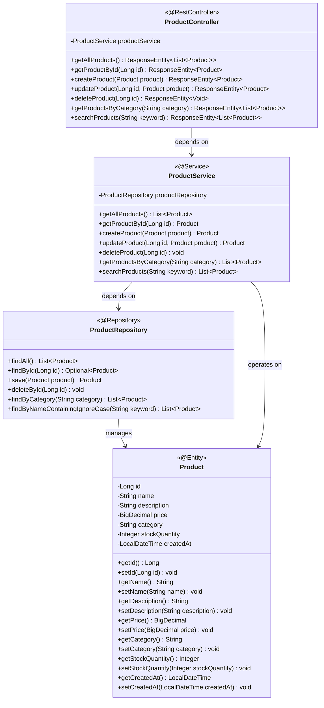
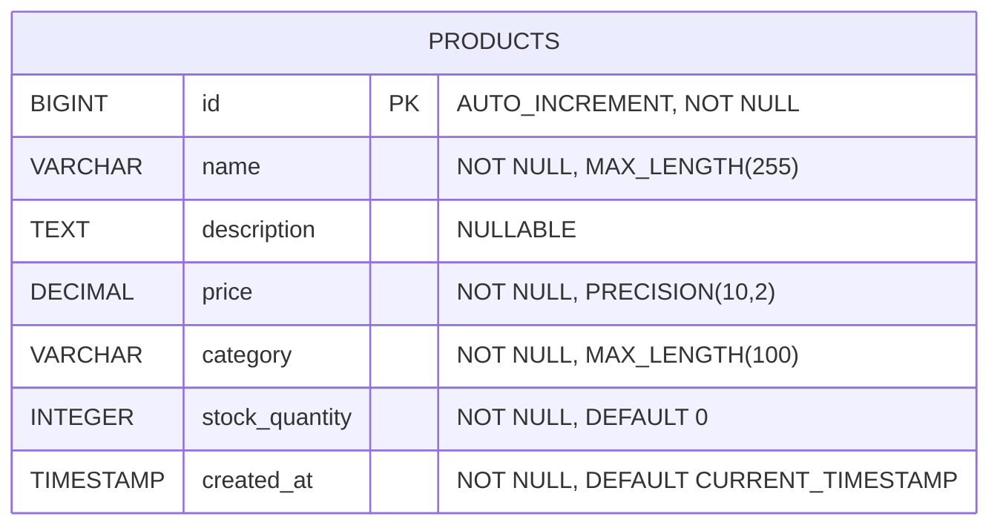
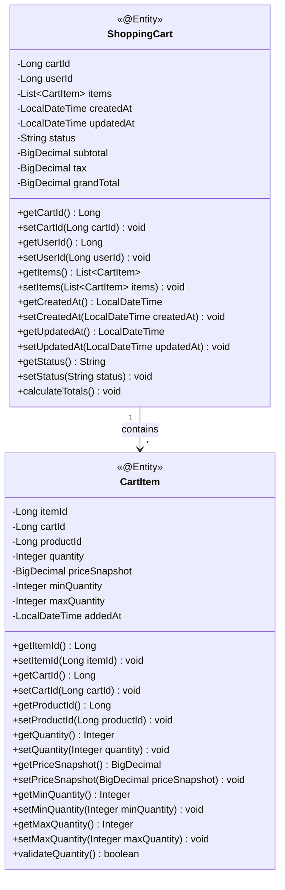

# Low-Level Design (LLD) - E-commerce Product Management System

## 1. Project Overview

**Framework:** Spring Boot  
**Language:** Java 21  
**Database:** PostgreSQL  
**Module:** ProductManagement  

## 2. System Architecture

### 2.1 Class Diagram

### 2.2 Entity Relationship Diagram

### 2.3 Shopping Cart Data Models

#### 2.3.1 Shopping Cart Model
**Requirement Reference:** Epic: Shopping cart management, Story: Add products to cart, AC-1

**Shopping Cart Data Structure:**
- `cart_id`: Unique identifier for the cart (Primary Key)
- `user_id`: Reference to the user who owns the cart (Foreign Key)
- `items`: Array of CartItem objects
- `created_at`: Timestamp when cart was created
- `updated_at`: Timestamp of last cart modification
- `status`: Cart status (ACTIVE, ABANDONED, CHECKED_OUT)
- `subtotal`: Sum of all item prices
- `tax`: Calculated tax amount
- `grand_total`: Final total including tax

**Reason for Addition:** Missing fundamental cart data structure required for cart functionality

#### 2.3.2 Cart Item Model
**Requirement Reference:** Story: Quantity management and thresholds, AC-2, AC-4

**CartItem Data Structure:**
- `item_id`: Unique identifier for cart item (Primary Key)
- `cart_id`: Reference to parent cart (Foreign Key)
- `product_id`: Reference to product (Foreign Key)
- `quantity`: Number of units in cart
- `price_snapshot`: Product price at time of addition (for price consistency)
- `min_quantity`: Minimum procurement threshold for this product
- `max_quantity`: Maximum allowed quantity per order
- `added_at`: Timestamp when item was added to cart

**Reason for Addition:** Missing cart item structure needed for quantity management
