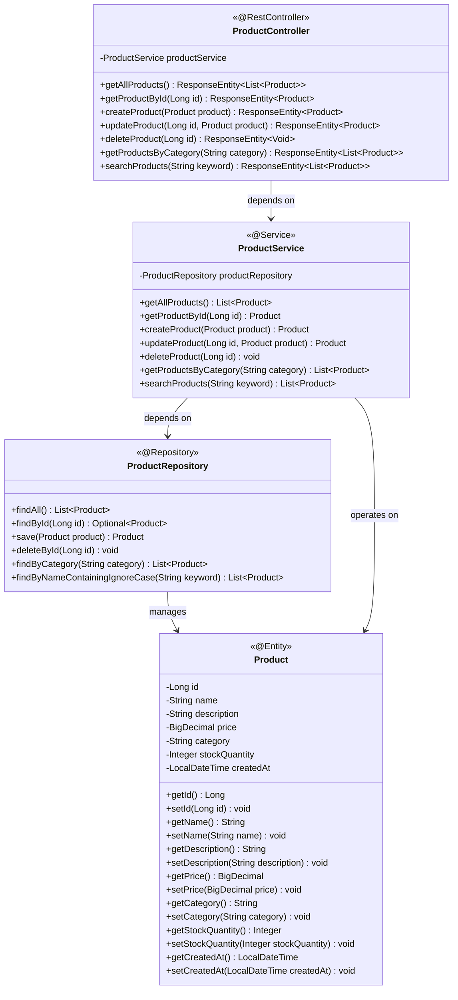
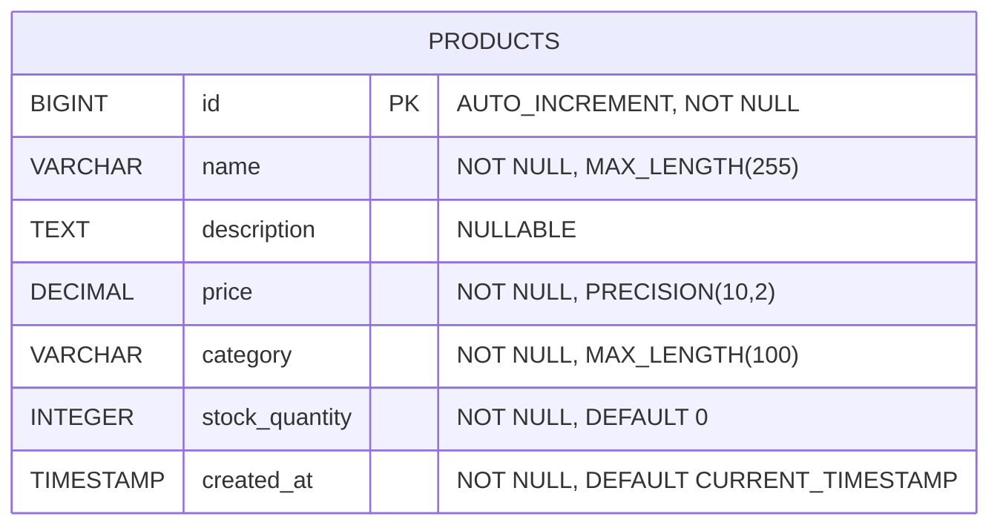
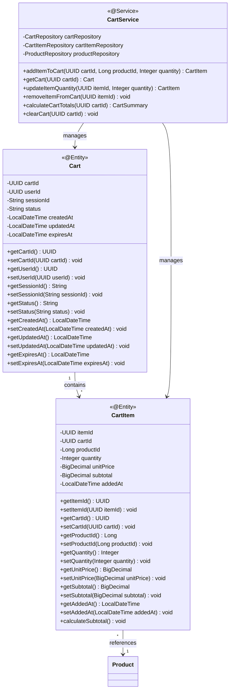
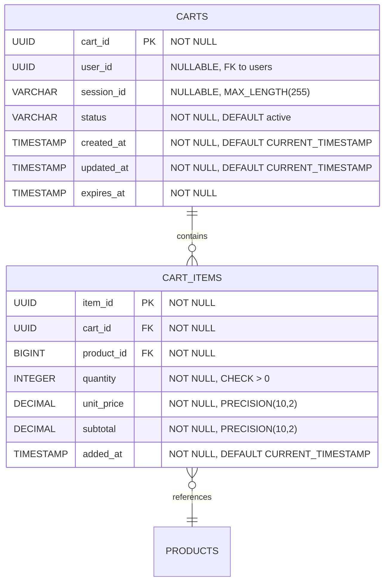

# Low-Level Design (LLD) - E-commerce Product Management System

## 1. Project Overview

**Framework:** Spring Boot  
**Language:** Java 21  
**Database:** PostgreSQL  
**Module:** ProductManagement  

## 2. System Architecture

### 2.1 Class Diagram

### 2.2 Entity Relationship Diagram

### 2.3 Shopping Cart Data Model Specification

**Requirement Reference:** Epic SCRUM-344: shopping cart management, Story SCRUM-343: add products to shopping cart and manage quantities

#### Cart Entity Structure

#### Cart Entity Relationships

**Description:** Comprehensive shopping cart data model including cart entity structure (cart_id, user_id, session_id, status, timestamps), cart item entity (item_id, cart_id, product_id, quantity, unit_price, subtotal), and relationship mappings between cart, cart_items, and products tables.

**Reason:** Required for implementing cart functionality with proper data structures for persistence and state management.
