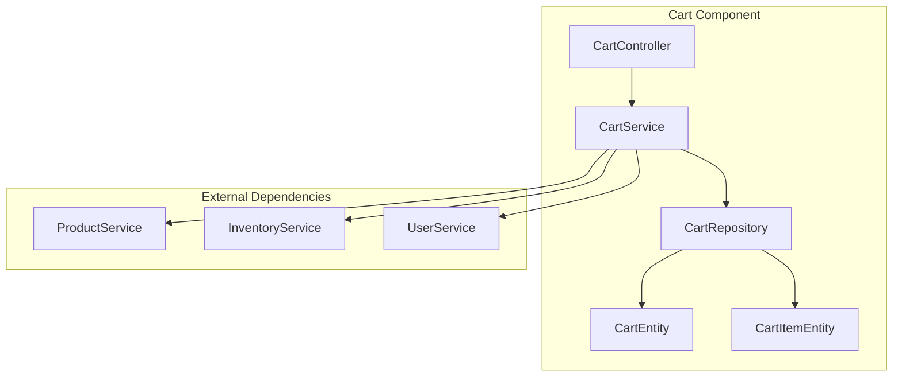
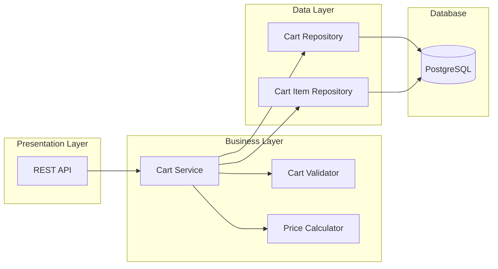

# Low Level Design Document: E-Commerce Platform

## 1. Introduction

### 1.1 Purpose
This document provides the low-level design specifications for the E-Commerce Platform, detailing the technical implementation of all system components, interfaces, and interactions.

### 1.2 Scope
This LLD covers the detailed design of:
- User Management System
- Shopping Cart System
- Product Catalog System
- Order Management System
- Payment Processing System
- Inventory Management System
- Notification System

### 1.3 Document Conventions
- All diagrams use Mermaid syntax
- API endpoints follow RESTful conventions
- Database schemas use standard SQL notation
- Code examples are in Java/Spring Boot

## 2. System Architecture

### 2.1 Component Architecture

#### 2.1.1 Shopping Cart Component

### 2.2 Layer Architecture

#### 2.2.1 Shopping Cart Layers

