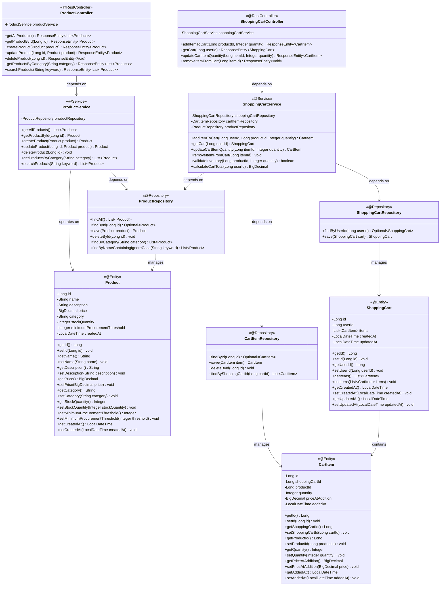
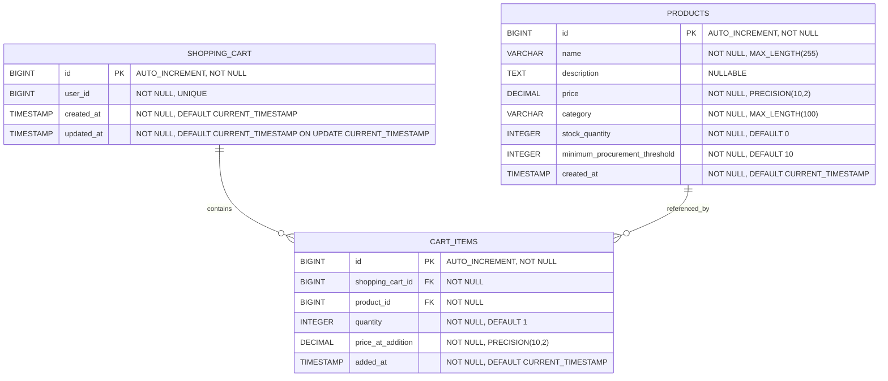
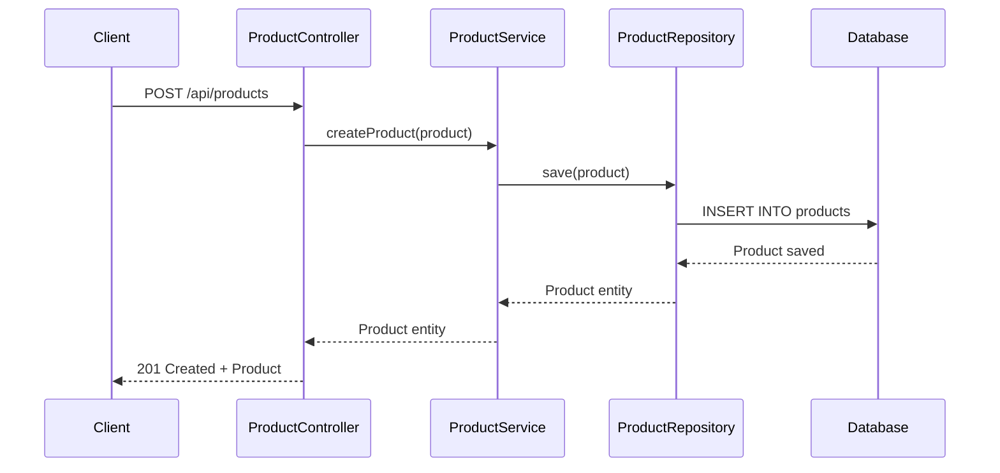
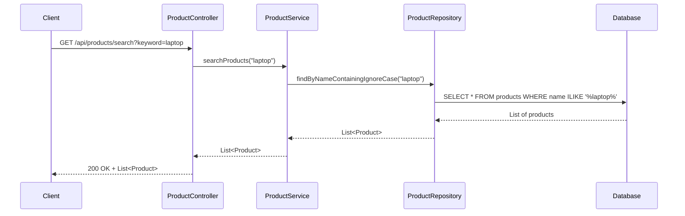
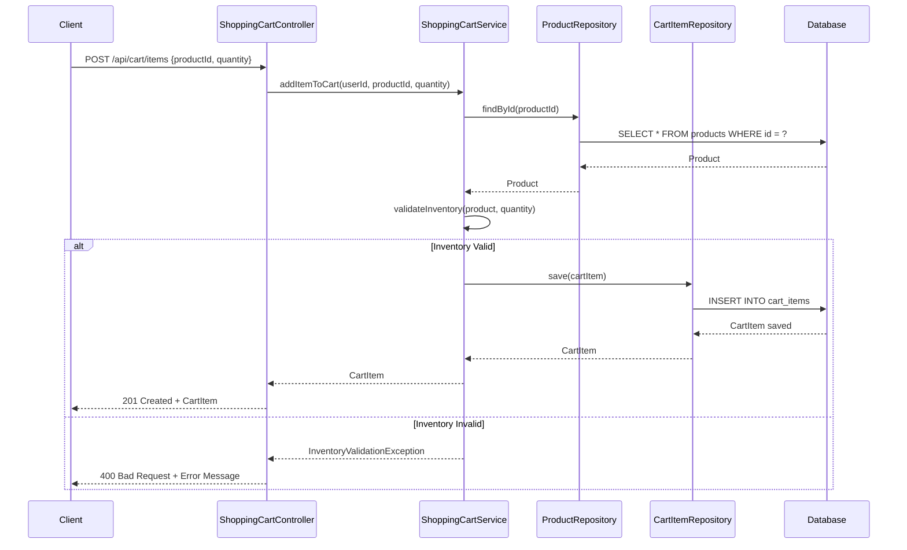
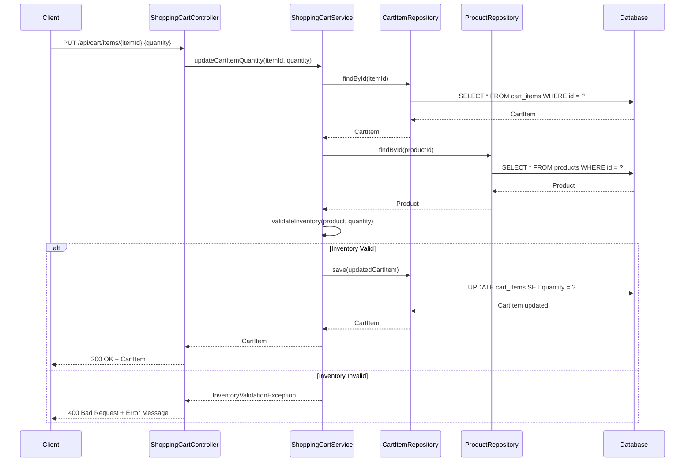
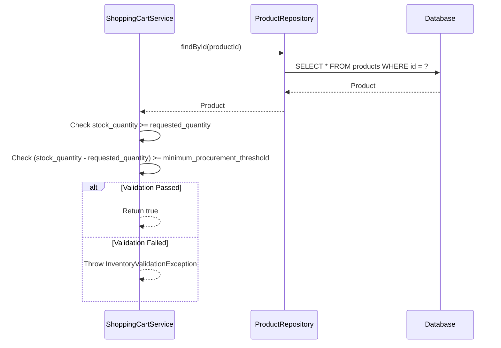

# Low-Level Design (LLD) - E-commerce Product Management and Shopping Cart Management System

## 1. Project Overview

**Framework:** Spring Boot  
**Language:** Java 21  
**Database:** PostgreSQL  
**Module:** ProductManagement and ShoppingCartManagement  

## 2. System Architecture

### 2.1 Class Diagram



### 2.2 Entity Relationship Diagram



## 3. Key Features

### 3.1 Product Management Features
- Create, Read, Update, Delete (CRUD) operations for products
- Search products by name (case-insensitive)
- Filter products by category
- Retrieve all products with pagination support
- Manage product inventory and stock quantities
- Track product creation timestamps

### 3.2 Shopping Cart Features
- Add products to shopping cart with quantity validation
- View cart contents with real-time pricing
- Update item quantities in cart
- Remove items from cart
- Real-time inventory validation
- Automatic cart total calculation
- Minimum procurement threshold enforcement

## 4. API Endpoints

### 4.1 Product Management Endpoints

#### 4.1.1 Get All Products
**Endpoint:** `GET /api/products`  
**Description:** Retrieves all products from the database  
**Response:** `200 OK` with list of products

#### 4.1.2 Get Product by ID
**Endpoint:** `GET /api/products/{id}`  
**Description:** Retrieves a specific product by its ID  
**Path Parameter:** `id` (Long) - Product ID  
**Response:** `200 OK` with product details or `404 Not Found`

#### 4.1.3 Create Product
**Endpoint:** `POST /api/products`  
**Description:** Creates a new product  
**Request Body:** Product object (JSON)  
**Response:** `201 Created` with created product

#### 4.1.4 Update Product
**Endpoint:** `PUT /api/products/{id}`  
**Description:** Updates an existing product  
**Path Parameter:** `id` (Long) - Product ID  
**Request Body:** Product object (JSON)  
**Response:** `200 OK` with updated product or `404 Not Found`

#### 4.1.5 Delete Product
**Endpoint:** `DELETE /api/products/{id}`  
**Description:** Deletes a product by ID  
**Path Parameter:** `id` (Long) - Product ID  
**Response:** `204 No Content` or `404 Not Found`

#### 4.1.6 Get Products by Category
**Endpoint:** `GET /api/products/category/{category}`  
**Description:** Retrieves all products in a specific category  
**Path Parameter:** `category` (String) - Category name  
**Response:** `200 OK` with list of products

#### 4.1.7 Search Products
**Endpoint:** `GET /api/products/search?keyword={keyword}`  
**Description:** Searches products by name (case-insensitive)  
**Query Parameter:** `keyword` (String) - Search term  
**Response:** `200 OK` with list of matching products

### 4.2 Shopping Cart Endpoints

#### 4.2.1 Add Item to Cart
**Endpoint:** `POST /api/cart/items`  
**Description:** Adds a product to the shopping cart with inventory validation  
**Request Body:**
```json
{
  "productId": 1,
  "quantity": 2
}
```
**Response:** `201 Created` with cart item details or `400 Bad Request` if validation fails

#### 4.2.2 Get Shopping Cart
**Endpoint:** `GET /api/cart`  
**Description:** Retrieves the current user's shopping cart with all items  
**Response:** `200 OK` with shopping cart details including items and total

#### 4.2.3 Update Cart Item Quantity
**Endpoint:** `PUT /api/cart/items/{itemId}`  
**Description:** Updates the quantity of an item in the cart with inventory validation  
**Path Parameter:** `itemId` (Long) - Cart item ID  
**Request Body:**
```json
{
  "quantity": 5
}
```
**Response:** `200 OK` with updated cart item or `400 Bad Request` if validation fails

#### 4.2.4 Remove Item from Cart
**Endpoint:** `DELETE /api/cart/items/{itemId}`  
**Description:** Removes an item from the shopping cart  
**Path Parameter:** `itemId` (Long) - Cart item ID  
**Response:** `204 No Content` or `404 Not Found`

## 5. Sequence Diagrams

### 5.1 Create Product Flow



### 5.2 Search Products Flow



### 5.3 Add Product to Cart Flow



### 5.4 Update Cart Item Quantity Flow



### 5.5 Inventory Validation Flow



## 6. Business Logic

### 6.1 Minimum Procurement Threshold

The system enforces a minimum procurement threshold for each product to ensure adequate inventory levels are maintained:

**Rule:** When adding or updating items in the shopping cart, the system validates that:
```
(current_stock_quantity - requested_quantity) >= minimum_procurement_threshold
```

**Example:**
- Product: Laptop
- Current Stock: 50 units
- Minimum Procurement Threshold: 10 units
- Customer Request: 45 units
- Validation: (50 - 45) = 5 < 10 → **REJECTED**
- Maximum Allowed: 40 units (50 - 10)

**Purpose:**
- Prevents complete stock depletion
- Ensures buffer stock for procurement lead time
- Maintains service level for other customers
- Triggers reorder processes before stockout

### 6.2 Real-time Cart Total Calculation

The shopping cart total is calculated dynamically based on:
- Current item quantities in cart
- Price at the time of addition (stored in cart_items.price_at_addition)
- Ensures price consistency even if product prices change after items are added

**Calculation Formula:**
```
Cart Total = Σ (cart_item.quantity × cart_item.price_at_addition)
```
