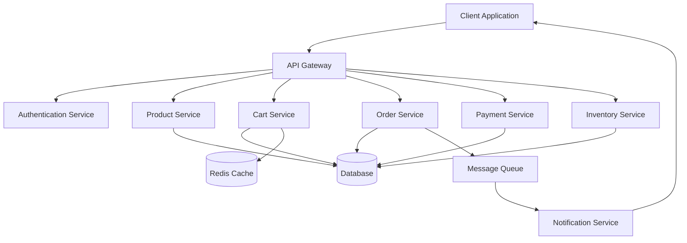
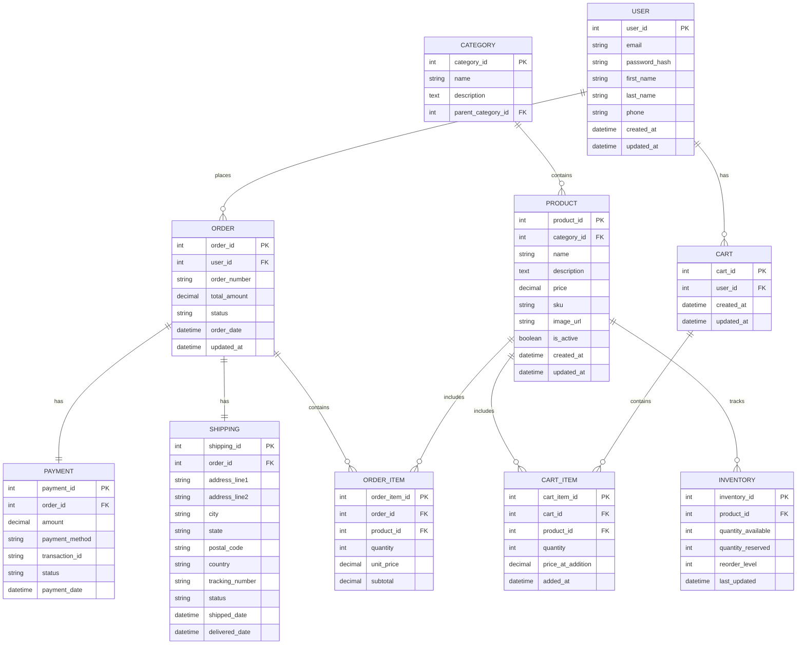

# Low Level Design Document: E-commerce Product Management System

## 1. Introduction

### 1.1 Purpose
This Low Level Design (LLD) document provides detailed technical specifications for the E-commerce Product Management System. It describes the system architecture, component interactions, data structures, and implementation details necessary for development.

### 1.2 Scope
This document covers:
- System architecture and component design
- Database schema and data models
- API specifications
- Class diagrams and sequence flows
- Security and performance considerations
- Shopping cart management functionality
- Checkout and order processing
- Payment integration
- Inventory management
- Notification system

### 1.3 Definitions and Acronyms
- **API**: Application Programming Interface
- **CRUD**: Create, Read, Update, Delete
- **DTO**: Data Transfer Object
- **JWT**: JSON Web Token
- **REST**: Representational State Transfer
- **SKU**: Stock Keeping Unit
- **LLD**: Low Level Design

## 2. System Architecture

### 2.1 High-Level Architecture



### 2.2 Component Overview

#### 2.2.1 API Gateway
- Routes requests to appropriate services
- Handles authentication and authorization
- Implements rate limiting
- Provides request/response logging

#### 2.2.2 Product Service
- Manages product catalog
- Handles product CRUD operations
- Manages product categories and attributes
- Implements search and filtering

#### 2.2.3 Cart Service
- Manages shopping cart operations
- Handles cart item additions, updates, and removals
- Maintains cart state
- Integrates with inventory for availability checks

#### 2.2.4 Order Service
- Processes order creation and management
- Handles order status updates
- Manages order history
- Coordinates with payment and inventory services

#### 2.2.5 Payment Service
- Processes payment transactions
- Integrates with payment gateways
- Handles refunds and cancellations
- Maintains payment records

#### 2.2.6 Inventory Service
- Manages product stock levels
- Handles inventory reservations
- Processes stock updates
- Provides availability information

#### 2.2.7 Notification Service
- Sends order confirmations
- Provides shipping updates
- Handles promotional notifications
- Manages email and SMS communications

## 3. Database Design

### 3.1 Entity Relationship Diagram



### 3.2 Database Schema

#### 3.2.1 Shopping Carts Table
```sql
CREATE TABLE shopping_carts (
    cart_id INT PRIMARY KEY AUTO_INCREMENT,
    user_id INT NOT NULL,
    session_id VARCHAR(255),
    created_at TIMESTAMP DEFAULT CURRENT_TIMESTAMP,
    updated_at TIMESTAMP DEFAULT CURRENT_TIMESTAMP ON UPDATE CURRENT_TIMESTAMP,
    expires_at TIMESTAMP,
    is_active BOOLEAN DEFAULT TRUE,
    FOREIGN KEY (user_id) REFERENCES users(user_id) ON DELETE CASCADE,
    INDEX idx_user_id (user_id),
    INDEX idx_session_id (session_id),
    INDEX idx_expires_at (expires_at)
);
```

#### 3.2.2 Cart Items Table
```sql
CREATE TABLE cart_items (
    cart_item_id INT PRIMARY KEY AUTO_INCREMENT,
    cart_id INT NOT NULL,
    product_id INT NOT NULL,
    quantity INT NOT NULL DEFAULT 1,
    price_at_addition DECIMAL(10, 2) NOT NULL,
    added_at TIMESTAMP DEFAULT CURRENT_TIMESTAMP,
    updated_at TIMESTAMP DEFAULT CURRENT_TIMESTAMP ON UPDATE CURRENT_TIMESTAMP,
    FOREIGN KEY (cart_id) REFERENCES shopping_carts(cart_id) ON DELETE CASCADE,
    FOREIGN KEY (product_id) REFERENCES products(product_id) ON DELETE CASCADE,
    UNIQUE KEY unique_cart_product (cart_id, product_id),
    INDEX idx_cart_id (cart_id),
    INDEX idx_product_id (product_id),
    CHECK (quantity > 0),
    CHECK (price_at_addition >= 0)
);
```

#### 3.2.3 Users Table
```sql
CREATE TABLE users (
    user_id INT PRIMARY KEY AUTO_INCREMENT,
    email VARCHAR(255) UNIQUE NOT NULL,
    password_hash VARCHAR(255) NOT NULL,
    first_name VARCHAR(100),
    last_name VARCHAR(100),
    phone VARCHAR(20),
    created_at TIMESTAMP DEFAULT CURRENT_TIMESTAMP,
    updated_at TIMESTAMP DEFAULT CURRENT_TIMESTAMP ON UPDATE CURRENT_TIMESTAMP,
    INDEX idx_email (email)
);
```

#### 3.2.4 Products Table
```sql
CREATE TABLE products (
    product_id INT PRIMARY KEY AUTO_INCREMENT,
    category_id INT,
    name VARCHAR(255) NOT NULL,
    description TEXT,
    price DECIMAL(10, 2) NOT NULL,
    sku VARCHAR(100) UNIQUE NOT NULL,
    image_url VARCHAR(500),
    is_active BOOLEAN DEFAULT TRUE,
    created_at TIMESTAMP DEFAULT CURRENT_TIMESTAMP,
    updated_at TIMESTAMP DEFAULT CURRENT_TIMESTAMP ON UPDATE CURRENT_TIMESTAMP,
    FOREIGN KEY (category_id) REFERENCES categories(category_id),
    INDEX idx_category (category_id),
    INDEX idx_sku (sku),
    INDEX idx_is_active (is_active)
);
```

#### 3.2.5 Orders Table
```sql
CREATE TABLE orders (
    order_id INT PRIMARY KEY AUTO_INCREMENT,
    user_id INT NOT NULL,
    order_number VARCHAR(50) UNIQUE NOT NULL,
    total_amount DECIMAL(10, 2) NOT NULL,
    status ENUM('pending', 'confirmed', 'processing', 'shipped', 'delivered', 'cancelled') DEFAULT 'pending',
    order_date TIMESTAMP DEFAULT CURRENT_TIMESTAMP,
    updated_at TIMESTAMP DEFAULT CURRENT_TIMESTAMP ON UPDATE CURRENT_TIMESTAMP,
    FOREIGN KEY (user_id) REFERENCES users(user_id),
    INDEX idx_user_id (user_id),
    INDEX idx_order_number (order_number),
    INDEX idx_status (status),
    INDEX idx_order_date (order_date)
);
```

#### 3.2.6 Inventory Table
```sql
CREATE TABLE inventory (
    inventory_id INT PRIMARY KEY AUTO_INCREMENT,
    product_id INT UNIQUE NOT NULL,
    quantity_available INT NOT NULL DEFAULT 0,
    quantity_reserved INT NOT NULL DEFAULT 0,
    reorder_level INT DEFAULT 10,
    last_updated TIMESTAMP DEFAULT CURRENT_TIMESTAMP ON UPDATE CURRENT_TIMESTAMP,
    FOREIGN KEY (product_id) REFERENCES products(product_id),
    INDEX idx_product_id (product_id),
    CHECK (quantity_available >= 0),
    CHECK (quantity_reserved >= 0)
);
```
